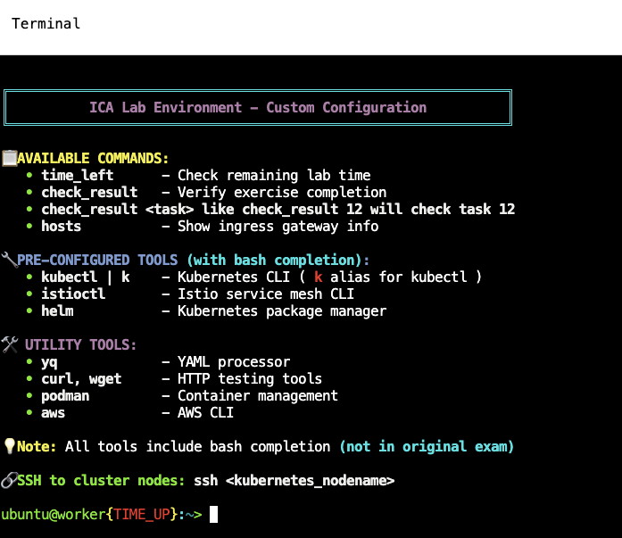

# ICA Mock Exam Infrastructure


Welcome to the **Istio Certified Associate (ICA)** mock exam environment! This infrastructure provides hands-on practice for the ICA certification exam with realistic exam scenarios covering Istio service mesh concepts.

## Overview

This repository contains **2 complete mock exams** designed to simulate the real ICA certification experience:

- **Mock 01**: 17 tasks covering core Istio concepts
- **Mock 02**: 16 tasks focusing on advanced service mesh patterns

Each mock exam tests your knowledge of:

- Istio installation and configuration (Helm and istioctl)
- Traffic management (VirtualServices, DestinationRules, Gateways)
- Security policies (AuthorizationPolicy, PeerAuthentication)
- Observability and fault injection
- Sidecar injection strategies
- Egress gateway configuration

## Custom Terminal Environment



The infrastructure provides a **custom-configured terminal environment** with pre-installed tools and utilities designed specifically for the ICA exam:

### Available Commands
- **`time_left`** - Check remaining lab time
- **`check_result`** - Verify exercise completion (use `check_result <task>` for specific tasks)
- **`hosts`** - Show ingress gateway info (NodePort mappings and IPs)

### Pre-Configured Tools (with bash completion)
- **`kubectl | k`** - Kubernetes CLI with `k` alias
- **`istioctl`** - Istio service mesh CLI
- **`helm`** - Kubernetes package manager
- **`yq`** - YAML processor
- **`curl, wget`** - HTTP testing tools
- **`podman`** - Container management
- **`aws`** - AWS CLI

### SSH Access
Connect to cluster nodes directly:
```bash
ssh <kubernetes_nodename>
```

**Note:** All tools include bash completion (not available in the original exam). This enhanced environment makes practicing and troubleshooting more efficient!

## Quick Start

### 1. Check Your Current Score

Run the automated test suite to see how you're doing:

```bash
# Check all tasks
check_result

# Check specific task
check_result <task_number>
```

The `check_result` command will:
- Execute BATS test suites for completed tasks
- Calculate your score based on acceptance criteria
- Show detailed pass/fail status for each validation

### 2. Get Cluster Connection Info

Need to connect to Istio ingress gateways or expose services?

```bash
hosts
```

This helper command displays:
- Node IP addresses
- NodePort mappings for Istio gateways
- Internal FQDNs for cluster communication

Perfect for testing external access to services via Gateways and VirtualServices!

### 3. Check Remaining Time

During timed practice sessions:

```bash
time_left
```

## Exam Structure

### Mock 01 - Foundation (17 tasks)
Core Istio concepts including installation, basic traffic management, and security policies.

**Key Topics:**
- Istio installation with istioctl
- Gateway and VirtualService configuration
- AuthorizationPolicy and traffic routing
- Sidecar injection control

### Mock 02 - Advanced (16 tasks)
Advanced service mesh patterns with complex routing and security scenarios.

**Key Topics:**
- Operator based canary upgrade
- Helm-based Istio installation
- Egress gateway configuration
- Port-level load balancing
- Fault injection and timeouts
- Cross-namespace authorization

## Directory Structure

```
ica/
├── mock/
│   ├── 01/                     # Mock Exam 1
│   │   ├── README.MD           # Task descriptions and requirements
│   │   └── worker/
│   │       └── files/
│   │           ├── solutions/  # Reference solutions (01.MD - 17.MD)
│   │           └── tests/      # BATS test files (tests-01.bats - tests-17.bats)
│   │
│   └── 02/                     # Mock Exam 2
│       ├── README.MD           # Task descriptions and requirements
│       └── worker/
│           └── files/
│               ├── solutions/  # Reference solutions (01.MD - 16.MD)
│               └── tests/      # BATS test files (tests-01.bats - tests-16.bats)

```

## Allowed Resources During Exam

You can reference official Istio documentation:

**https://istio.io/latest/docs/** and all subdomains

This mirrors the real ICA exam environment where official documentation access is permitted.

## Tips for Success

1. **Read Task Requirements Carefully**: Pay attention to exact names, namespaces, and resource specifications
2. **Use kubectl contexts**: Always verify you're working in the correct cluster with `kubectl config current-context`
3. **Test Your Work**: Use `curl` from sleep pods to verify traffic routing and policies
4. **Check Logs**: Use `kubectl logs` to troubleshoot Istio sidecar and gateway issues
5. **Leverage Cockpit**: Use the web interface for quick file edits and multi-cluster monitoring
6. **Reference Solutions**: After attempting tasks, review solution files for best practices

## Common Pitfalls

- **VirtualService hosts**: For cross-namespace traffic, include both short name and FQDN:
  ```yaml
  hosts:
    - service-name
    - service-name.namespace.svc.cluster.local
  ```
- **Gateway selectors**: Ensure your Gateway selector matches the actual ingress gateway labels
- **Sidecar injection**: Verify pods have Envoy sidecars with `kubectl get pods` (should show 2/2 containers)
- **Context switching**: Double-check cluster context before applying resources

## Scoring

Each task has a weighted score contributing to your total percentage:
- Mock 01: Tasks worth 1% to 15% each (100% total)
- Mock 02: Tasks worth 4% to 15% each (100% total)

Aim for **70%+** to demonstrate certification-level competency.

## Support

- Review task requirements in each mock's `README.MD`
- Check reference solutions in `worker/files/solutions/`
- Examine test validation logic in `worker/files/tests/`

---

**Good luck with your ICA certification preparation!**

Practice makes perfect - run through both mocks multiple times until you can complete tasks confidently within time limits.

## TODO 
- Troubleshooting section 
- Fix unknown issues
- Add tasks related to tls and ambient mode
