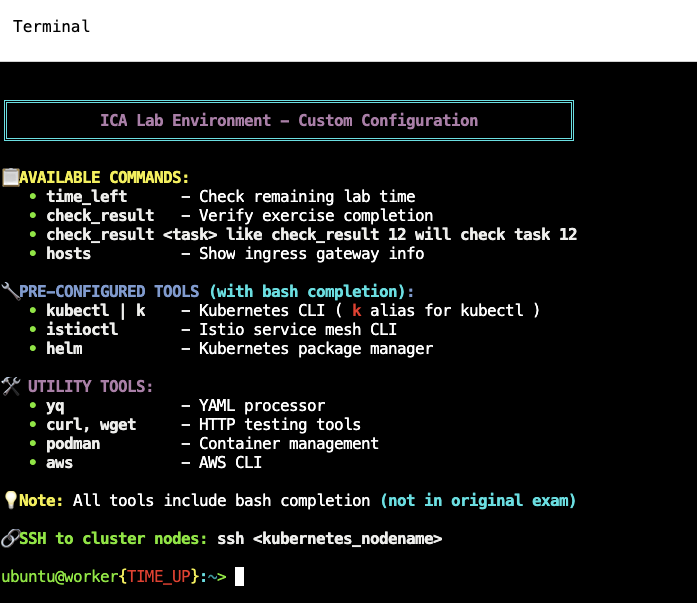

[RU version](README_RU.MD) · [Eng version](README.MD) · [Versión en español](README_ES.MD) · [Version française](README_FR.MD)

# Istio Certified Associate (ICA) - Schulungsmaterialien


Vollständige Vorbereitung auf die Zertifizierung **Istio Certified Associate (ICA)**: ein
Selbstlernkurs, praktische Übungen und vollständige Mock-Prüfungen - alles an einem Ort.

## Was ist enthalten

| Teil | Pfad | Was es ist |
|------|------|-----------|
| **Kurs** | [`course/`](course/README_DE.md) | Selbstlernkurs mit 32 Kapiteln: von der Idee des Service Mesh bis zum Produktionsbetrieb |
| **Übungen** | [`labs/`](labs/) | 35 praktische Übungen auf echten AWS-Clustern, jeweils an ein Kurskapitel gekoppelt |
| **Mock-Prüfungen** | [`mock/`](mock/) | 2 vollständige Mock-Prüfungen, die die echte ICA-Prüfung simulieren |

Empfohlener Weg: ein Kurskapitel lernen, mit der zugehörigen Übung vertiefen und dann die
Mock-Prüfungen unter Zeitdruck durchspielen.

## Der Kurs

Der Kurs ([`course/README_DE.md`](course/README_DE.md)) besteht aus 32 Kapiteln und
richtet sich an Ingenieure, die Kubernetes bereits kennen (CKA-Niveau):

- **Teil 1 (Kapitel 1-24)** - Grundlagen und vollständige Abdeckung der ICA-Prüfungsdomänen
  (Traffic-Management, Sicherheit, Observability, fortgeschrittene Szenarien,
  Troubleshooting, Installation).
- **Teil 2 (Kapitel 25-31)** - Best Practices für die Praxis: Progressive Delivery,
  Zero-Downtime-Migration, Istio auf EKS, Multi-Cluster, VM-Workloads,
  Control-Plane-Performance, Härtung.
- **Prüfungsvorbereitung (Kapitel 32)** - ICA-Format, Tipps und Links zu den
  Mock-Prüfungen.

Jedes Kapitel endet mit einem Abschnitt **Praxis**, der auf die passende Übung
verlinkt.

## Die Übungen

35 praktische Übungen (`labs/01` .. `labs/35`), jede vollständig lokalisiert: Englisch
(`README.MD`), Russisch (`README_RU.MD`), Spanisch (`README_ES.MD`), Französisch
(`README_FR.MD`) und Deutsch (`README_DE.MD`). Sie stellen echte Cluster in AWS über
Terragrunt bereit:

```bash
TASK=01 make run_ica_task      # Übung 01 bereitstellen
TASK=01 make delete_ica_task   # wieder abbauen
```

Themen der Übungen (und das Kurskapitel, das die Theorie behandelt):

| Übung | Thema | Kapitel |
|-----|-------|---------|
| 01 | Istio installieren, Bookinfo, Sidecar-Injektion | 2 |
| 02 | Dark Launch, Header-Routing, Canary | 5, 6 |
| 03 | Fault Injection und Retries | 8 |
| 04 | mTLS (PeerAuthentication) + AuthorizationPolicy | 13, 14 |
| 05 | Egress: ServiceEntry, Egress Gateway, REGISTRY_ONLY | 12 |
| 06 | Load Balancing + Traffic-Mirroring | 6, 7 |
| 07 | Helm-Installation + Canary-Upgrade (Revisionen) | 3 |
| 08 | Observability: Prometheus/Jaeger/Kiali | 17 |
| 09 | Ambient-Modus (ohne Sidecar) | 22 |
| 10 | Resilienz: Timeout + Circuit Breaker | 8 |
| 11 | Endbenutzer-Authentifizierung: RequestAuthentication + JWT | 15 |
| 12 | Troubleshooting mit istioctl | 24 |
| 13 | Edge-TLS (SIMPLE) | 9 |
| 14 | Lokalitätsbewusstes Failover | 7 |
| 15 | Installation und Konfiguration (IstioOperator + MeshConfig) | 2 |
| 16 | Kubernetes Gateway API (Gateway + HTTPRoute) | 11 |
| 17 | Lokales Rate Limiting (EnvoyFilter) | 20 |
| 18 | Telemetry API: Access-Logs + Tracing | 18 |
| 19 | Eigene CA in istiod | 16 |
| 20 | mTLS-Migration von PERMISSIVE zu STRICT | 13 |
| 21 | Sidecar-Scoping | 19 |
| 22 | TLS-Origination | 12 |
| 23 | WasmPlugin (WebAssembly) | 21 |
| 24 | Ambient: Waypoint-Proxy + L7-Autorisierung | 22 |
| 25 | Progressive Delivery mit Flagger | 25 |
| 26 | Dynamische CA: cert-manager + istio-csr | 16 |
| 27 | EnvoyFilter + Lua | 21 |
| 28 | TCP-Routing | 10 |
| 29 | Ingress-TLS: MUTUAL und PASSTHROUGH | 9 |
| 30 | StatefulSet und Headless-Services | 23 |
| 31 | Zero-Downtime-Migration: ingress-nginx zu Istio | 26 |
| 32 | gRPC: Per-Request-Load-Balancing, Portbenennung, Retries | 10 |
| 33 | Control Plane: Performance und Betrieb | 30 |
| 34 | Hardening und Bedrohungsmodell | 31 |
| 35 | Multi-Cluster-Mesh (Multi-Primary, Multi-Network) | 28 |

## Mock-Prüfungen

Zwei vollständige Mock-Prüfungen, die das ICA-Format nachbilden:

- **Mock 01** ([`mock/01`](mock/01/README.MD)) - 17 Aufgaben zu grundlegenden Istio-Konzepten.
- **Mock 02** ([`mock/02`](mock/02/README.MD)) - 16 Aufgaben zu fortgeschrittenen Service-Mesh-Mustern.

Führen Sie sie unter Zeitdruck ohne Hinweise durch und streben Sie **70%+** an.

## Individuelle Terminalumgebung



Die Infrastruktur stellt ein vorkonfiguriertes Terminal mit Tools und Helfern für die
ICA-Praxis bereit.

### Verfügbare Befehle
- **`time_left`** - verbleibende Übungszeit prüfen
- **`check_result`** - Aufgabenerfüllung prüfen (`check_result <task>` für eine bestimmte Aufgabe)
- **`hosts`** - Ingress-Gateway-Infos anzeigen (NodePort-Mappings und IPs)

### Vorkonfigurierte Tools (mit Bash-Completion)
- **`kubectl | k`**, **`istioctl`**, **`helm`**, **`yq`**, **`curl`/`wget`**,
  **`podman`**, **`aws`**

### SSH-Zugriff
```bash
ssh <kubernetes_nodename>
```

## Schnellstart

```bash
# eigene Punktzahl prüfen (alle Aufgaben oder eine bestimmte)
check_result
check_result <task_number>

# Cluster-/Ingress-Infos zum Testen des externen Zugriffs
hosts

# verbleibende Zeit bei einem zeitlich begrenzten Durchlauf
time_left
```

## Erlaubte Ressourcen während der Prüfung

Sie dürfen die offizielle Istio-Dokumentation nutzen:
**https://istio.io/latest/docs/** und alle Subdomains. Die Mock-Prüfungen bilden dies
nach.

## Tipps für den Erfolg

1. **Lesen Sie die Aufgabenstellung genau** - exakte Namen, Namespaces und Specs sind
   wichtig.
2. **Prüfen Sie Ihren Kontext** mit `kubectl config current-context`.
3. **Testen Sie Ihre Arbeit** - `curl` aus Sleep-Pods, um Routing und Policies zu prüfen.
4. **Nutzen Sie `istioctl analyze`, `proxy-status`, `proxy-config`**, um
   Fehlkonfigurationen zu finden.
5. **Prüfen Sie die Referenzlösungen** nach dem Bearbeiten der Aufgaben.

## Häufige Fehler

- **Hosts in VirtualService**: bei Traffic zwischen Namespaces sowohl Kurzname als auch
  FQDN angeben.
- **Gateway-Selektoren**: müssen mit den tatsächlichen Labels des Ingress Gateway
  übereinstimmen.
- **Sidecar-Injektion**: Pods sollten `2/2` Container anzeigen.
- **Kontextwechsel**: Cluster vor dem Anwenden von Ressourcen doppelt prüfen.

---

**Viel Erfolg bei Ihrer ICA-Zertifizierung!** Übung macht den Meister - arbeiten Sie
Kurs, Übungen und beide Mock-Prüfungen durch, bis Sie die Aufgaben sicher innerhalb der
Zeitvorgaben lösen können.
