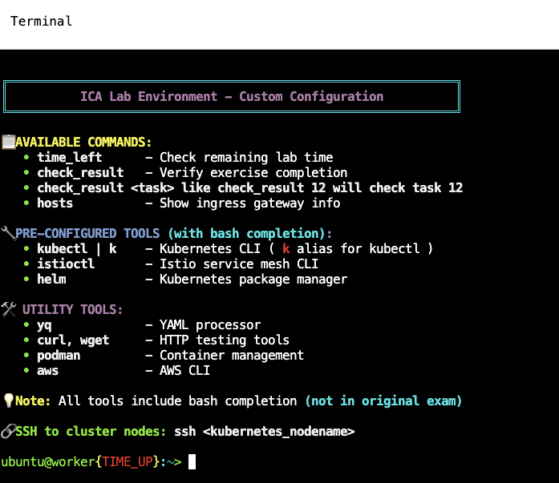

[Русская версия](README_RU.MD) · [Eng version](README.MD) · [Versión en español](README_ES.MD) · [Version française](README_FR.MD) · [Deutsche Version](README_DE.MD) · [ქართული ვერსია](README_GE.MD) · [繁體中文版](README_TW.MD)

# Istio Certified Associate (ICA) - トレーニング教材


**Istio Certified Associate (ICA)** 認定への完全な準備: セルフスタディコース、
実践的なラボ、そして本格的なモック試験 - すべてが一箇所に。

## 内容

| パート | パス | 概要 |
|-------|------|-----------|
| **コース** | [`course/`](course/README_JP.md) | 32 章のセルフスタディコース: service mesh の概念から本番運用まで |
| **ラボ** | [`labs/`](labs/) | 実際の AWS クラスター上の 35 の実践ラボ。各ラボはコースの章に対応 |
| **モック試験** | [`mock/`](mock/) | 本番の ICA を再現する 2 つの本格的なモック試験 |

推奨ルート: コースの章を学習し、対応するラボで定着させ、その後モック試験を時間内に
こなします。

## コース

コース ([`course/README_JP.md`](course/README_JP.md)) は 32 章から成り、すでに Kubernetes
（CKA レベル）を理解しているエンジニア向けに書かれています:

- **パート 1（第 1-24 章）** - 基礎と ICA 試験ドメインの完全カバー（トラフィック管理、
  セキュリティ、observability、高度なシナリオ、troubleshooting、インストール）。
- **パート 2（第 25-31 章）** - 実運用の best practices: プログレッシブデリバリー、
  ゼロダウンタイム移行、EKS 上の Istio、マルチクラスター、VM ワークロード、control
  plane のパフォーマンス、ハードニング。
- **試験対策（第 32 章）** - ICA の形式、ヒント、モック試験へのリンク。

各章は対応するラボへのリンクを含む **「実践」** セクションで終わります。

## ラボ

35 の実践ラボ（`labs/01` .. `labs/35`）は、それぞれ 8 言語に完全ローカライズされています:
英語（`README.MD`）、ロシア語（`README_RU.MD`）、スペイン語（`README_ES.MD`）、
フランス語（`README_FR.MD`）、ドイツ語（`README_DE.MD`）、ジョージア語
（`README_GE.MD`）、繁体字中国語（`README_TW.MD`）、日本語（`README_JP.MD`）。
Terragrunt を介して AWS 上に実際のクラスターをデプロイします:

```bash
TASK=01 make run_ica_task      # ラボ 01 をデプロイ
TASK=01 make delete_ica_task   # 削除
```

ラボのトピック（および理論を扱うコースの章）:

| ラボ | トピック | 章 |
|------|------|------|
| 01 | Istio のインストール、Bookinfo、sidecar injection | 2 |
| 02 | Dark launch、header-routing、canary | 5, 6 |
| 03 | Fault injection と retries | 8 |
| 04 | mTLS (PeerAuthentication) + AuthorizationPolicy | 13, 14 |
| 05 | Egress: ServiceEntry、egress gateway、REGISTRY_ONLY | 12 |
| 06 | ロードバランシング + トラフィック mirroring | 6, 7 |
| 07 | Helm によるインストール + canary アップグレード（リビジョン） | 3 |
| 08 | Observability: Prometheus/Jaeger/Kiali | 17 |
| 09 | Ambient mode（sidecar なし） | 22 |
| 10 | レジリエンス: timeout + circuit breaker | 8 |
| 11 | エンドユーザー認証: RequestAuthentication + JWT | 15 |
| 12 | istioctl による Troubleshooting | 24 |
| 13 | Edge TLS (SIMPLE) | 9 |
| 14 | Locality-aware failover | 7 |
| 15 | インストールと設定 (IstioOperator + MeshConfig) | 2 |
| 16 | Kubernetes Gateway API (Gateway + HTTPRoute) | 11 |
| 17 | ローカル rate limiting (EnvoyFilter) | 20 |
| 18 | Telemetry API: access logs + tracing | 18 |
| 19 | istiod のカスタム CA | 16 |
| 20 | mTLS 移行 PERMISSIVE → STRICT | 13 |
| 21 | Sidecar scoping | 19 |
| 22 | TLS origination | 12 |
| 23 | WasmPlugin (WebAssembly) | 21 |
| 24 | Ambient: waypoint proxy + L7 認可 | 22 |
| 25 | Flagger によるプログレッシブデリバリー | 25 |
| 26 | 動的 CA: cert-manager + istio-csr | 16 |
| 27 | EnvoyFilter + Lua | 21 |
| 28 | TCP ルーティング | 10 |
| 29 | Ingress TLS: MUTUAL と PASSTHROUGH | 9 |
| 30 | StatefulSet と headless サービス | 23 |
| 31 | ゼロダウンタイム移行: ingress-nginx → Istio | 26 |
| 32 | gRPC: per-request ロードバランシング、ポート命名、retries | 10 |
| 33 | Control plane: パフォーマンスと運用 | 30 |
| 34 | ハードニングと脅威モデル | 31 |
| 35 | マルチクラスター mesh (multi-primary, multi-network) | 28 |

## モック試験（mock）

ICA の形式を再現する 2 つの本格的なモック試験:

- **Mock 01** ([`mock/01`](mock/01/README.MD)) - Istio の基本概念に関する 17 タスク。
- **Mock 02** ([`mock/02`](mock/02/README.MD)) - 高度な mesh パターンに関する 16 タスク。

時間を計り、ヒントなしで取り組み、**70%+** を目指しましょう。

## カスタムターミナル環境



インフラストラクチャは、ICA の練習用に構築されたツールとヘルパーを備えた事前設定済み
ターミナルを提供します。

### 利用可能なコマンド
- **`time_left`** - 残り時間を確認
- **`check_result`** - タスクの完了を検証（特定のタスクは `check_result <task>`）
- **`hosts`** - ingress gateway 情報を表示（NodePort マッピングと IP）

### 事前設定済みツール（bash 補完付き）
- **`kubectl | k`**、**`istioctl`**、**`helm`**、**`yq`**、**`curl`/`wget`**、
  **`podman`**、**`aws`**

### SSH アクセス
```bash
ssh <kubernetes_nodename>
```

## クイックスタート

```bash
# スコアを確認（すべてのタスクまたは特定のタスク）
check_result
check_result <task_number>

# 外部アクセスをテストするためのクラスター/ingress 情報
hosts

# 時間制限のある実行中の残り時間
time_left
```

## 試験中に許可されるリソース

Istio の公式ドキュメントを参照できます:
**https://istio.io/latest/docs/** とそのすべてのサブドメイン。モックはこれを再現して
います。

## 成功のためのヒント

1. **タスクの要件を注意深く読む** - 正確な名前、namespace、spec が重要です。
2. **コンテキストを確認する** - `kubectl config current-context` で。
3. **作業をテストする** - sleep pod から `curl` を実行してルーティングとポリシーを確認。
4. **`istioctl analyze`、`proxy-status`、`proxy-config` を使う** - 設定ミスを見つける
   ために。
5. **リファレンス解答を確認する** - タスクに取り組んだ後に。

## よくある落とし穴

- **VirtualService の hosts**: namespace 間のトラフィックでは短縮名と FQDN の両方を
  含める。
- **Gateway セレクター**: 実際の ingress gateway のラベルと一致させる必要がある。
- **Sidecar injection**: pod は `2/2` コンテナを表示するはず。
- **コンテキストの切り替え**: リソースを適用する前にクラスターを再確認する。

---

**ICA 認定の成功を祈ります！** 練習が肝心です - コース、ラボ、両方のモックをこなし、
制限時間内に自信を持ってタスクを完了できるようになるまで取り組みましょう。
