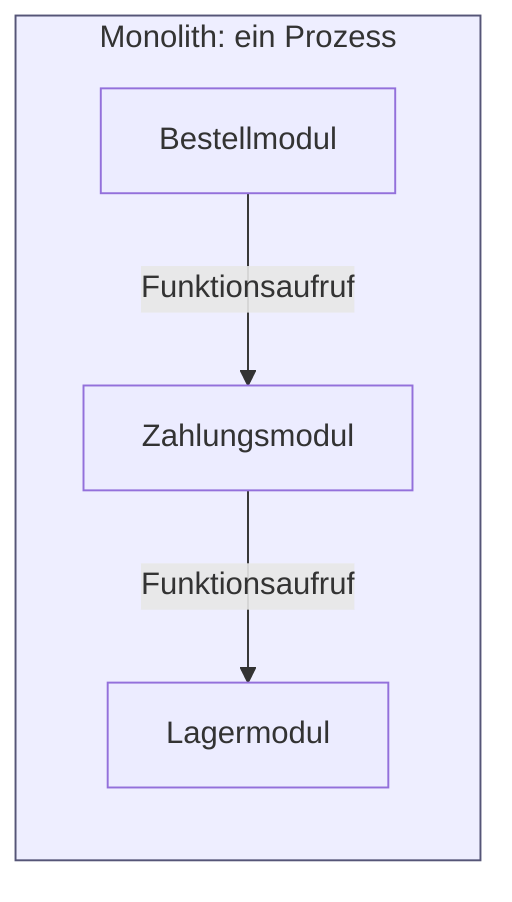
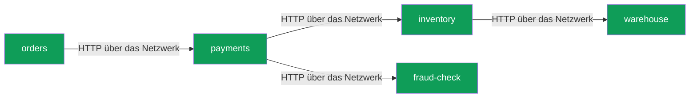
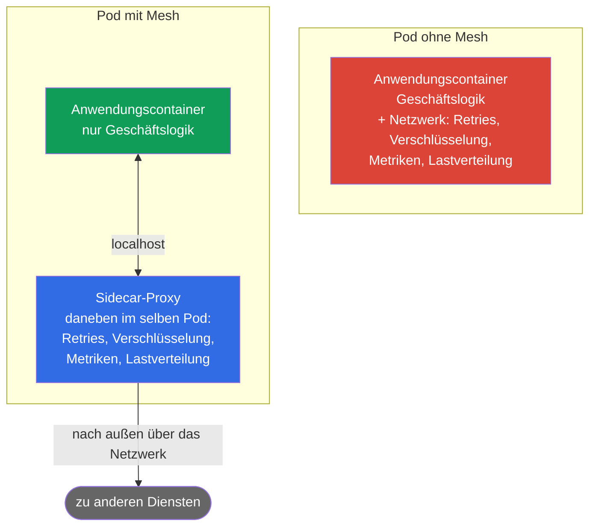
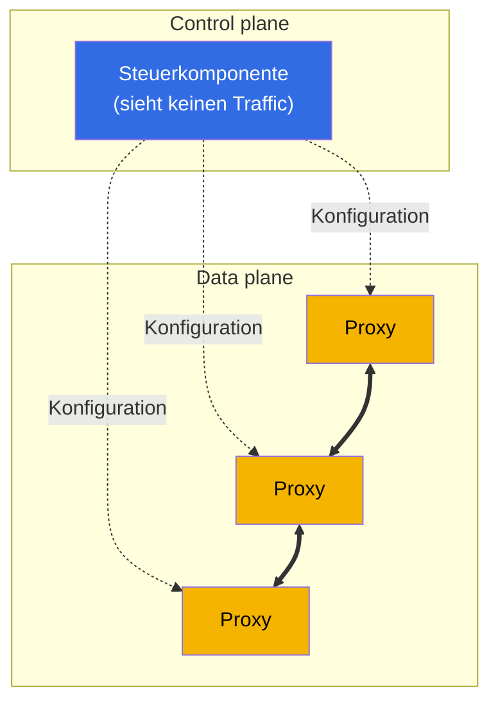
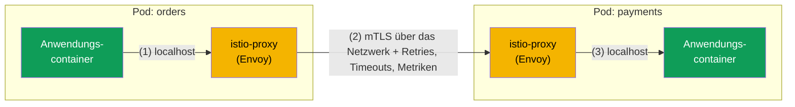
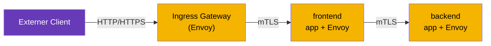
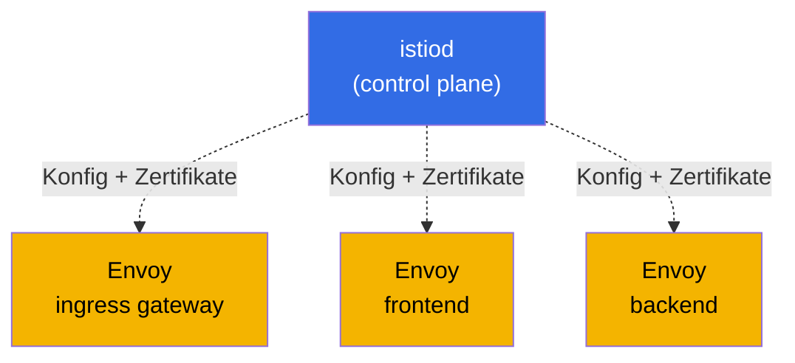
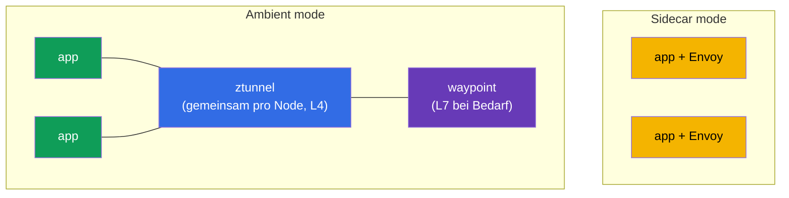

[RU version](ru.md) · [Eng version](en.md) · [Versión en español](es.md) · [Version française](fr.md)

# Kapitel 1. Einführung in Service Mesh und die Architektur von Istio

> **Für wen dieses Kapitel ist.** Wir gehen davon aus, dass Sie mit Kubernetes bereits
> auf CKA-Niveau vertraut sind. CKA (Certified Kubernetes Administrator) ist eine
> offizielle Zertifizierung der CNCF und der Linux Foundation, die die Fähigkeit
> bestätigt, einen Kubernetes-Cluster zu administrieren. Mehr zur Prüfung:
> [Certified Kubernetes Administrator (CKA)](https://training.linuxfoundation.org/certification/certified-kubernetes-administrator-cka/).
> Falls Sie diese Prüfung nicht abgelegt haben, ist das kein Problem – es genügt, sicher mit
> Kubernetes umzugehen: Pod, Deployment, Service, Ingress, kubectl, und zu verstehen, was
> kube-proxy und NetworkPolicy sind. Mit Service Mesh und Istio hatten Sie aber noch keine
> Berührung. Genau diese Lücke schließt dieses Kapitel.
> Wir gehen von dem aus, was Sie bereits kennen, hin zu der Frage, wozu ein Mesh nötig ist,
> was es ist und wie Istio aufgebaut ist. Wir schreiben keinen Code, sondern klären nur die
> Begriffe und das Gesamtbild.
> Die Praxis beginnt in Kapitel 2.

## 1.1. Was Kubernetes bereits kann und was ihm fehlt

In Kubernetes haben Sie bereits fertige Netzwerk-Primitive. Schauen wir uns an, was sie
leisten und wo ihre Grenze verläuft.

| Aufgabe | Was Sie derzeit verwenden | Wo die Grenze liegt |
|--------|---------------------------|-------------|
| Einen anderen Dienst über den Namen finden | Service + kube-DNS | Lastverteilung nur auf Verbindungsebene (L4) |
| Traffic verteilen | Service / kube-proxy | Round-Robin über Verbindungen, „10 % auf v2" nicht möglich |
| Traffic von außen hereinlassen | Ingress | Nur am Eingang, nichts über den Traffic innerhalb des Clusters |
| Einschränken, wer mit wem kommuniziert | NetworkPolicy | Nur nach IP und Port (L3/L4), ohne Berücksichtigung von HTTP |
| Traffic zwischen Pods verschlüsseln | nicht out of the box | Traffic zwischen Pods läuft im Klartext |
| Eine fehlgeschlagene Anfrage wiederholen, einen Timeout setzen | nicht out of the box | Das muss die Anwendung selbst können |
| Sehen, wer wen aufruft und mit welcher Latenz | nicht out of the box | Muss manuell im Code ergänzt werden |

Die ersten vier Zeilen sind Ihre Komfortzone nach dem CKA. Schauen Sie sich nun die unteren
drei an. Verschlüsselung des Traffics zwischen Diensten, Ausfallsicherheit und Observability
gibt Kubernetes out of the box nicht her. Genau hier beginnt das Service Mesh.

## 1.2. Warum das zum Problem wurde: Monolith gegen Microservices

Als die Anwendung ein Monolith war, waren fast alle Aufrufe zwischen ihren Teilen ganz normale
Funktionsaufrufe innerhalb eines Prozesses. Sie liefen nicht über das Netzwerk, gingen nicht
verloren, mussten nicht verschlüsselt oder wiederholt werden.

Wenn dieselbe Funktionalität in Microservices aufgeteilt wird, wird jeder Aufruf zwischen ihnen
zu einer Netzwerkanfrage. Und das Netzwerk ist unzuverlässig: Pakete gehen verloren, Dienste
starten neu, Latenzen schwanken.

Jeder Pfeil hier ist ein möglicher Ausfallpunkt. Und sofort entstehen vier Gruppen von
Aufgaben, die es im Monolith kaum gab.

- **Traffic-Management.** Wie rollt man eine neue Version von payments für 10 % der Nutzer aus?
  Wie leitet man Tester über einen HTTP-Header auf eine experimentelle Version um?
- **Ausfallsicherheit.** Was tun, wenn inventory langsam ist oder 503 zurückgibt? Die Anfrage
  wiederholen? Per Timeout abbrechen? Den kranken Dienst vorübergehend deaktivieren?
- **Sicherheit.** Wie stellt man sicher, dass orders mit dem echten payments kommuniziert und
  nicht mit etwas Untergeschobenem? Wie verschlüsselt man diesen Traffic? Wie verbietet man
  fraud-check, warehouse direkt anzusprechen?
- **Observability.** Eine Anfrage lief durch fünf Dienste und blieb irgendwo hängen. Wo genau?
  Wie viele Anfragen pro Sekunde laufen zwischen den Diensten, wie hoch sind Fehleranteil und
  Latenz?

## 1.3. Drei Wege, diese Aufgaben zu lösen

### Weg 1. Alles im Code jedes Dienstes umsetzen

Die erste naheliegende Variante: Jeder Dienst kann selbst Anfragen wiederholen, Timeouts setzen,
Verbindungen verschlüsseln und Metriken senden. Die Probleme:

- Die Logik muss in jedem Dienst dupliziert und einheitlich gehalten werden.
- Dienste in verschiedenen Sprachen (Go, Java, Python) bedeuten, dass man dasselbe in jeder
  Sprache auf eigene Weise schreiben muss.
- Ändert man die Retry-Policy, muss man alle Dienste neu bauen und neu deployen.

### Weg 2. Gemeinsame Bibliotheken

Als Nächstes kamen Bibliotheken auf Anwendungsebene auf (seinerzeit waren das Netflix Hystrix,
Twitter Finagle und ähnliche). Ausfallsicherheit und Lastverteilung wurden in einbindbaren Code
ausgelagert. Es wurde besser, aber die wichtigsten Nachteile blieben:

- Die Bibliothek ist an eine Sprache gebunden, der Wildwuchs an Implementierungen blieb.
- Ein Update der Bibliothek erfordert trotzdem ein Neubauen und Neu-Deployen des Dienstes.
- Der Entwickler der Geschäftslogik muss sich in die Feinheiten der Netzwerk-Ausfallsicherheit
  einarbeiten.

### Weg 3. Alles in die Infrastruktur auslagern, direkt neben den Dienst

Die Kernidee des Service Mesh: die gesamte Netzwerk-Anbindung aus der Anwendung herausnehmen und
in einen separaten Proxy legen, der neben jedem Dienst steht und dessen gesamten Netzwerk-Traffic
abfängt. Die Anwendung meint, eine ganz normale HTTP-Anfrage zu machen, während der Proxy
unbemerkt Retries, Verschlüsselung, Metriken und Routing hinzufügt.

Das ist der Ansatz des Service Mesh: Der Anwendungscode ändert sich nicht, und das gesamte
Netzwerkverhalten wird deklarativ auf Infrastrukturebene konfiguriert.

## 1.4. Was ein Service Mesh ist

Ein Service Mesh ist eine eigene Infrastrukturschicht, die die Kommunikation zwischen Diensten
verwaltet: Routing, Ausfallsicherheit, Sicherheit und Observability. Und das alles transparent
für die Anwendung.

Technisch besteht es aus zwei Teilen. Diese Aufteilung ist der zentrale Begriff des Kapitels,
merken Sie ihn sich gleich.

- **Data plane.** Eine Menge von Proxys, jeweils einer neben jeder Instanz eines Dienstes
  (genau die Sidecars aus dem vorigen Abschnitt). Sie sind es, die den realen Traffic
  durchleiten und die Regeln anwenden: Sie verschlüsseln Verbindungen, wiederholen Anfragen,
  zählen Metriken.
- **Control plane.** Das ist das Gehirn des Mesh. Sie verarbeitet keinen Nutzer-Traffic. Ihre
  Aufgabe ist es, Ihre Einstellungen zu nehmen und allen Proxys die aktuelle Konfiguration
  auszuliefern sowie ihnen Zertifikate für die Verschlüsselung auszustellen.

Die durchgezogenen Linien zwischen den Proxys sind der produktive Traffic zwischen den Diensten.
Die gestrichelten sind die Konfiguration, die die Control plane von oben an die Proxys ausliefert.
Die Regel ist einfach: Die Control plane konfiguriert, die Data plane arbeitet. Wie diese Teile
konkret in Istio heißen, klären wir etwas weiter unten.

## 1.5. Welche Service Meshes es derzeit gibt

Die Idee des Mesh haben wir geklärt. Bevor wir tiefer in Istio einsteigen, lohnt sich ein Blick
in die Runde: Istio ist nicht das einzige Service Mesh. Ein Verständnis des Marktes hilft zu
sehen, warum für den Kurs gerade dieses gewählt wurde.

- **Istio.** Das beliebteste und funktionsreichste Mesh, ein CNCF-Projekt. Data plane auf
  Envoy. Umfangreiches Routing, Sicherheit, Observability und Erweiterbarkeit. Der Preis: eine
  höhere Einstiegshürde und Komplexität.
- **Linkerd.** Das zweitbeliebteste Mesh, ebenfalls CNCF. Verwendet einen eigenen leichtgewichtigen
  Proxy in Rust (nicht Envoy). Der Hauptvorteil ist Einfachheit und geringer Overhead. Der
  Nachteil: weniger Möglichkeiten als bei Istio (spärlicheres Routing und Erweiterbarkeit).
- **Cilium Service Mesh.** Baut auf eBPF auf und kann ohne Proxy in jedem Pod arbeiten, indem es
  einen Teil der Funktionen direkt in den Linux-Kernel verlagert. Der Vorteil: hohe Performance
  und enge Integration mit dem Netzwerk. Der Nachteil: L7-Funktionen stützen sich trotzdem auf
  Envoy, das Ökosystem rund um das Mesh ist jünger.
- **Consul (HashiCorp).** Mesh auf Basis von Consul, verwendet Envoy. Stark dort, wo ein
  einheitliches Werkzeug außerhalb von Kubernetes gebraucht wird (VM, mehrere Plattformen,
  Multi-Rechenzentrum).
- **Kuma / Kong Mesh.** Ein CNCF-Projekt auf Basis von Envoy, kann mehrere Zonen und
  Nicht-Kubernetes-Workloads aus einem Panel verwalten.
- **AWS App Mesh.** Ein von AWS verwaltetes Mesh auf Envoy. Einfach in die AWS-Dienste zu
  integrieren, aber an das AWS-Ökosystem gebunden und bei den Möglichkeiten Istio unterlegen
  (und verliert allmählich an Bedeutung).

Kurzvergleich:

| Mesh | Data plane | Stärke | Wann man es wählt |
|------|-----------|-----------------|----------------|
| **Istio** | Envoy (Sidecar oder ambient) | Am funktionsreichsten, großes Ökosystem | Viele Dienste, hohe Anforderungen an Traffic und Sicherheit |
| **Linkerd** | eigener Rust-Proxy | Einfachheit, geringer Overhead | Ein leichtgewichtiges Mesh mit minimaler Konfiguration nötig |
| **Cilium** | eBPF (+ Envoy für L7) | Performance, Arbeit im Kernel | Cilium CNI bereits im Einsatz, Geschwindigkeit ist wichtig |
| **Consul** | Envoy | Arbeit außerhalb von Kubernetes, Multi-Plattform | Hybride Infrastruktur, VM + Kubernetes |
| **Kuma / Kong** | Envoy | Multi-Zone, einfache Verwaltung | Mehrere Cluster und Nicht-Kubernetes-Workloads |

Wichtig: Die meisten Meshes (Istio, Cilium, Consul, Kuma, App Mesh) bauen auf Envoy auf.
Deshalb lassen sich die mit Istio erworbenen Fähigkeiten weitgehend auch auf andere Meshes
übertragen. Für den Kurs wurde Istio gewählt: Es ist das funktionsreichste und am weitesten
verbreitete, und dafür gibt es die Zertifizierung ICA. Im Folgenden vertiefen wir genau dieses.

## 1.6. Wie der Proxy neben den Dienst kommt (Sidecar)

Wie stellt sich der Proxy physisch neben jeden Dienst? Über einen Ihnen bekannten
Kubernetes-Mechanismus – einen zusätzlichen Container im Pod. Er wird Sidecar genannt.

Wenn auf einem namespace das Label `istio-injection=enabled` steht, fügt Istio beim Erstellen
des Pods selbst noch einen weiteren Container hinzu, istio-proxy (eben jenen Envoy). Deshalb
zeigen Pods im Mesh `2/2` in der Spalte READY: Der erste Container ist Ihre Anwendung, der
zweite der Proxy.

Nun das Interessanteste. Mithilfe von iptables-Regeln (die ein spezieller Init-Container beim
Start des Pods einrichtet) wird der gesamte ein- und ausgehende Traffic der Anwendung durch
Envoy geleitet. Die Anwendung ruft `http://payments:8080` auf, wie gewohnt, aber tatsächlich
landet die Anfrage zuerst im lokalen Envoy, dieser wendet alle Policys an und schickt die
Anfrage erst dann an den Envoy des anderen Pods.

1. Die Anwendung orders macht eine ganz normale HTTP-Anfrage, sie geht in den lokalen Envoy.
2. Envoy verschlüsselt die Anfrage (mTLS), wendet Policys an (Retries, Timeouts, Lastverteilung,
   Metriken) und schickt sie über das Netzwerk an den Envoy des Pods payments.
3. Der Envoy auf der Seite von payments entschlüsselt den Traffic und gibt ihn über localhost
   an die Anwendung weiter.

Fazit: Die Anwendung weiß nichts über das Mesh. Für sie ist es nach wie vor ein einfacher
HTTP-Aufruf. Die gesamte Arbeit passiert in Envoy.

> **Analogie zu dem, was Sie kennen.** kube-proxy konfiguriert iptables auf dem Node und
> verteilt die Last auf L4-Ebene, also nach Verbindungen. Istio konfiguriert iptables innerhalb
> des Pods und leitet den Traffic in den Proxy Envoy, der HTTP versteht: Header, Methoden, Pfade,
> Antwortcodes. Daher kommen alle neuen Möglichkeiten.

## 1.7. Die Architektur von Istio als Ganzes

Nun setzen wir das Gesamtbild zusammen. Istio hat drei Hauptakteure.

- **istiod** ist die Control plane. Ein einziges Binary, das die Konfiguration an alle Envoys
  ausliefert (dafür war historisch die Komponente Pilot zuständig), Zertifikate für mTLS
  ausstellt und erneuert (Citadel) und Ihre Manifeste prüft (Galley). Früher waren das separate
  Dienste, im modernen Istio wurden sie zu einem einzigen istiod zusammengeführt.
- **Envoy** ist die Data plane. Der Proxy in jedem Pod (Sidecar) und in den Gateways.
- **Gateways** sind dieselben Envoys, stehen aber an der Grenze des Mesh. Das Ingress Gateway
  lässt Traffic von außen in den Cluster, das Egress Gateway lässt Traffic aus dem Cluster
  nach außen.

Um das Bild nicht zu überladen, teilen wir es in zwei. Zuerst der Pfad des produktiven Traffics
(Data plane). Jeder Dienst ist ein Pod aus zwei Containern: die Anwendung und Envoy daneben.

Der Pfad der Anfrage ist linear: Client, dann Ingress Gateway, dann der Envoy des Dienstes
frontend, dann der Envoy des Dienstes backend. Der gesamte Traffic innerhalb des Mesh wird per
mTLS verschlüsselt.

Nun separat: wie istiod (Control plane) alle Envoys mit Konfiguration und Zertifikaten versorgt.
Es fasst den Traffic selbst nicht an, sondern konfiguriert nur die Proxys.

Verbinden Sie die beiden Bilder im Kopf: Über die Pfeile des ersten Diagramms fließt der
Traffic, und istiod aus dem zweiten hat all diesen Envoys vorab die Routing-Regeln und
Zertifikate ausgeliefert.

## 1.8. Was Istio kann

Alles, was Istio tut, lässt sich bequem in vier Bereiche aufteilen. Das sind zugleich die
Domänen der ICA-Prüfung, auf die wir in Teil 1 des Kurses vorbereiten.

- **Traffic-Management.** Feingranulares Routing: Canary-Releases, Verteilung nach Gewichten,
  Routing nach Headern, Mirroring von Traffic, Lastverteilung, Umgang mit externen Diensten.
  Das sind die Kapitel 5–11.
- **Sicherheit.** Automatisches mTLS zwischen Diensten, Authentifizierung nach Identity
  (SPIFFE), Autorisierung (wer mit wem und wie kommunizieren darf), JWT-Prüfung von Nutzern.
  Das sind die Kapitel 12–15.
- **Observability.** Metriken jeder Anfrage, verteiltes Tracing, ein Graph der Dienste, und
  das alles ohne Codeänderung. Das sind die Kapitel 16–17.
- **Fortgeschrittene Szenarien und Erweiterbarkeit.** Rate limiting, eigene Logik über
  EnvoyFilter, Lua und Wasm, ambient-Modus, Optimierung. Das sind die Kapitel 18–22.

Dazu kommen übergreifende Themen: Installation und Update (Kapitel 2–4) und Troubleshooting
(Kapitel 23).

## 1.9. Zwei Modi der Data plane: Sidecar und ambient

Historisch arbeitet Istio nach dem Sidecar-Modell, das wir oben besprochen haben: Envoy in
jedem Pod. Das ist zuverlässig und leistungsfähig, aber das Modell hat seinen Preis. Der Proxy
in jedem Pod verbraucht CPU und Arbeitsspeicher, und ein Update der Data plane erfordert einen
Neustart der Pods.

Deshalb entstand der ambient mode, ein Modus ohne Sidecars. In ihm bedient eine gemeinsame,
pro Node laufende Komponente ztunnel den L4-Traffic, und L7-Funktionen (Routing, Autorisierung
über HTTP) werden bei Bedarf über einen separaten waypoint proxy zugeschaltet. So sind der
Overhead geringer und die Updates einfacher.

Merken Sie sich vorerst nur, dass es beide Modi gibt. Den Hauptteil des Kurses lernen wir am
klassischen Sidecar-Modell, es ist vollständiger und für den Start verständlicher. Ambient
besprechen wir ausführlich in Kapitel 21.

## 1.10. Wann ein Mesh nötig ist und wann nicht

Ein Service Mesh gibt es nicht umsonst. Bevor Sie es einführen, wägen Sie die Nachteile
ehrlich ab.

- **Overhead.** Ein zusätzlicher Proxy in jedem Pod fügt etwas Latenz hinzu und verbraucht
  Ressourcen.
- **Komplexität.** Es entsteht eine ganz neue Schicht von Abstraktionen und Ressourcen, die
  man verstehen und debuggen können muss (dem ist Kapitel 23 gewidmet).
- **Nicht für drei Dienste.** Für eine kleine Anwendung aus ein paar Diensten ist ein Mesh
  wie mit Kanonen auf Spatzen zu schießen.

Istio ist gerechtfertigt, wenn es viele Dienste gibt, sie in verschiedenen Sprachen geschrieben
sind, Sicherheit (mTLS, Zero Trust) und Observability wichtig sind und die Anforderungen an das
Release-Management (Canary, schrittweise Rollouts) hoch sind. Genau solche Szenarien üben wir in
den Labs.

## 1.11. Brücke vom CKA: Zuordnung bekannter Begriffe

Damit sich das Neue auf bereits Bekanntes stützen kann, halten Sie diese Tabelle bereit.

| Sie kennen aus Kubernetes | Entsprechung in Istio | Worin der Unterschied liegt |
|-------------------------|----------------|---------------|
| Ingress | Gateway + VirtualService | Flexibles L7-Routing: Gewichte, Header, Mirroring |
| kube-proxy (L4) | Envoy Sidecar (L7) | Versteht HTTP: Methoden, Pfade, Codes, Retries, Timeouts |
| NetworkPolicy (L3/L4) | AuthorizationPolicy (L7) | Regeln nach Identity, HTTP-Methode und Pfad, nicht nur IP und Port |
| Verschlüsselung von Hand | Automatisches mTLS | Istio stellt selbst Zertifikate aus und verschlüsselt den Traffic zwischen Pods |
| Metriken über Code | Metriken aus Envoy | Werden für jede Anfrage automatisch erfasst |
| ServiceAccount für den API-Zugriff | ServiceAccount als Identity (SPIFFE) | Derselbe SA wird zur kryptografischen Identität des Dienstes |

## 1.12. Mini-Glossar

- **Service Mesh** – eine Infrastrukturschicht zur Verwaltung des Traffics zwischen Diensten.
- **Data plane** – die Proxys (Envoy), die den realen Traffic tragen.
- **Control plane** – istiod: liefert Konfiguration und Zertifikate aus, fasst den Traffic
  nicht an.
- **Envoy** – ein schneller L7-Proxy, die Basis der Data plane von Istio.
- **Sidecar** – der Container istio-proxy (Envoy), der dem Pod neben der Anwendung hinzugefügt
  wird.
- **istiod** – ein einheitliches Binary der Control plane (Pilot, Citadel, Galley in einem).
- **Gateway** – Envoy an der Grenze des Mesh: ingress (Eingang) und egress (Ausgang).
- **mTLS** – wechselseitiges TLS: beide Seiten weisen Zertifikate vor, der Traffic wird
  verschlüsselt.
- **SPIFFE** – ein Identity-Standard der Form `spiffe://cluster.local/ns/<ns>/sa/<sa>`.
- **Ambient mode** – ein Modus ohne Sidecars: ztunnel (L4) und waypoint (L7).

## 1.13. Zusammenfassung des Kapitels

- Kubernetes löst out of the box weder die Verschlüsselung des Traffics zwischen Diensten noch
  die Ausfallsicherheit und Observability. Genau das ist die Nische des Service Mesh.
- Das Mesh verlagert die Netzwerk-Anbindung aus der Anwendung in einen Proxy neben dem Dienst
  und wird deklarativ konfiguriert, ohne Codeänderung.
- Istio besteht aus Data plane (Envoy in Pods und Gateways) und Control plane (istiod). Man
  muss sie klar unterscheiden.
- Der Sidecar wird dem Pod hinzugefügt und fängt über iptables den gesamten Traffic ab. Pods
  im Mesh zeigen `2/2`.
- Die Möglichkeiten von Istio gliedern sich in Traffic-Management, Sicherheit, Observability
  und fortgeschrittene Szenarien. Das sind die Domänen der ICA-Prüfung.
- Es gibt zwei Modi der Data plane: das klassische Sidecar und das neue ambient ohne Sidecars.
- Istio ist nicht das einzige Mesh (es gibt Linkerd, Cilium, Consul, Kuma), aber es ist das
  funktionsreichste und am weitesten verbreitete, und die meisten Alternativen bauen ebenfalls
  auf Envoy auf.
- Ein Mesh ist gerechtfertigt bei einer großen Zahl von Diensten und hohen Anforderungen an
  Sicherheit, Releases und Observability. Für winzige Anwendungen ist es überdimensioniert.

## 1.14. Fragen zur Selbstüberprüfung

1. Worin unterscheiden sich die Aufgaben von Control plane und Data plane grundsätzlich? Wer
   von beiden verarbeitet den Nutzer-Traffic?
2. Warum zeigen Pods im Mesh `2/2` Container? Was macht der zweite Container?
3. Wie gelangt der Traffic der Anwendung in Envoy, wenn die Anwendung davon nichts weiß?
4. Wodurch ist AuthorizationPolicy in Istio mächtiger als NetworkPolicy in Kubernetes?
5. In welchen Fällen sollte man ein Service Mesh nicht einführen?
6. Wodurch unterscheidet sich der Sidecar-Modus vom ambient-Modus der Data plane?
7. Nennen Sie ein paar Alternativen zu Istio und wodurch sie sich unterscheiden. Warum bauen
   viele Meshes auf Envoy auf?

## Praxis

Die Praxis beginnt mit dem nächsten Kapitel. In Kapitel 2 installieren Sie Istio im Cluster,
aktivieren die Sidecar-Injection und rollen die Demo-Anwendung Bookinfo aus, um all das oben
Beschriebene live zu sehen.

🧪 Lab 01: [tasks/ica/labs/01](../../labs/01/README_DE.MD)

---
[Inhaltsverzeichnis](../README_DE.md) · [Kapitel 2](../02/de.md)
