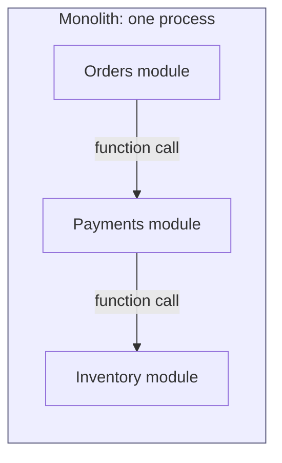
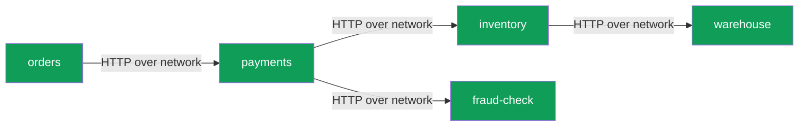
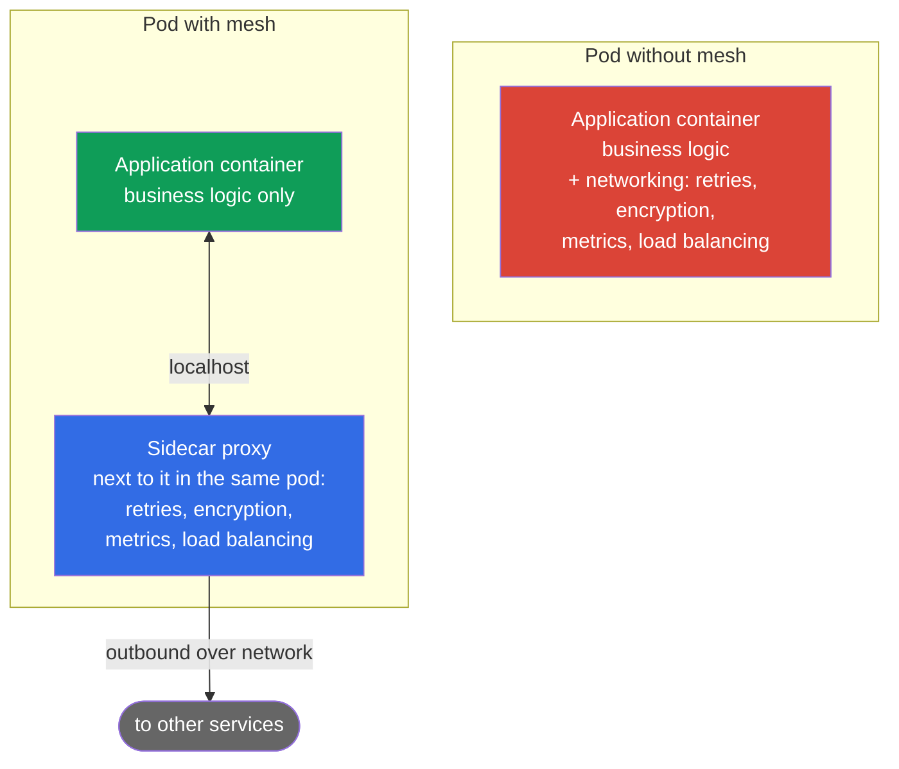
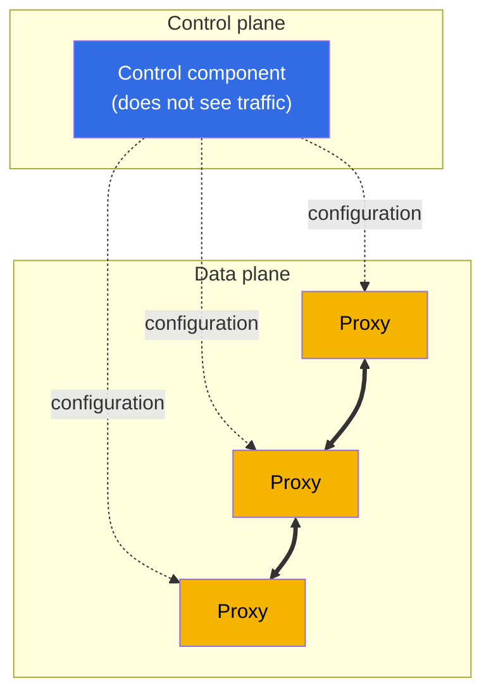
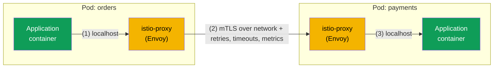
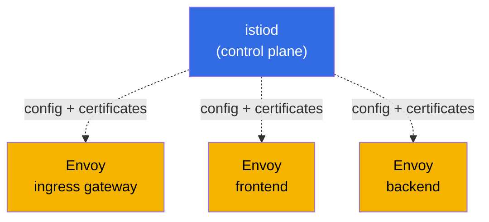
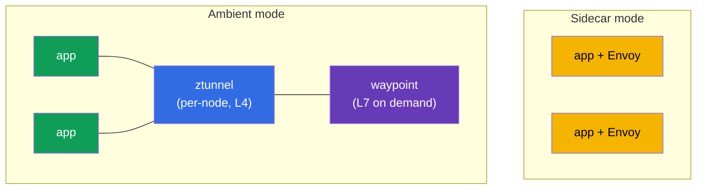

[RU version](ru.md)

# Chapter 1. Introduction to service mesh and Istio architecture

> **Who this chapter is for.** We assume you are already familiar with Kubernetes at the
> CKA level. CKA (Certified Kubernetes Administrator) is the official certification from
> the CNCF and the Linux Foundation that validates the ability to administer a Kubernetes
> cluster. More about the exam:
> [Certified Kubernetes Administrator (CKA)](https://training.linuxfoundation.org/certification/certified-kubernetes-administrator-cka/).
> If you have not taken this exam - no problem, it is enough to be comfortable with
> Kubernetes: Pod, Deployment, Service, Ingress, kubectl, and to understand what kube-proxy
> and NetworkPolicy are. But you have not yet worked with a service mesh and Istio. This
> chapter closes exactly that gap.
> We start from what you already know and move on to why a mesh is needed, what it is, and
> how Istio is built. We will not write code, only walk through the concepts and the big
> picture. Hands-on practice begins in chapter 2.

## 1.1. What Kubernetes already does, and what it lacks

In Kubernetes you already have ready-made networking primitives. Let's look at what they
give you and where their boundary is.

| Task | What you use today | Where the boundary is |
|------|--------------------|-----------------------|
| Find another service by name | Service + kube-DNS | Load balancing only at the connection level (L4) |
| Distribute traffic | Service / kube-proxy | Round-robin over connections, no "10% to v2" |
| Let traffic in from outside | Ingress | Only at the edge, nothing about traffic inside the cluster |
| Restrict who talks to whom | NetworkPolicy | By IP and port only (L3/L4), no HTTP awareness |
| Encrypt traffic between pods | not out of the box | Pod-to-pod traffic goes in plaintext |
| Retry a failed request, set a timeout | not out of the box | The application itself has to do it |
| See who calls whom and with what latency | not out of the box | You have to add code by hand |

The first four rows are your comfort zone after CKA. Now look at the bottom three.
Encrypting service-to-service traffic, resilience to failures, and observability -
Kubernetes does not give you these out of the box. This is where the service mesh begins.

## 1.2. Why this became a problem: monolith vs microservices

When the application was a monolith, almost all calls between its parts were ordinary
function calls inside one process. They did not travel over the network, were not lost,
and did not need to be encrypted or retried.

When the same functionality is split into microservices, every call between them becomes a
network request. And the network is unreliable: packets are lost, services restart,
latencies spike.

Every arrow here is a potential point of failure. And immediately four groups of tasks
appear that barely existed in the monolith.

- **Traffic management.** How do you roll out a new version of payments to 10% of users?
  How do you send testers to an experimental version based on an HTTP header?
- **Resilience.** What do you do if inventory is slow or returns 503? Retry the request?
  Cut it off by timeout? Temporarily take the unhealthy service out?
- **Security.** How do you make sure orders talks to the real payments and not to something
  impersonating it? How do you encrypt that traffic? How do you forbid fraud-check from
  calling warehouse directly?
- **Observability.** A request went through five services and hung somewhere. Where exactly?
  How many requests per second between services, what is the error rate and the latency?

## 1.3. Three ways to solve these tasks

### Option 1. Write everything in each service's code

The first obvious option: let each service know how to retry requests, set timeouts,
encrypt connections and emit metrics on its own. Problems:

- The logic has to be duplicated in every service and kept identical.
- Services in different languages (Go, Java, Python) mean writing the same thing in each
  language its own way.
- Change the retry policy and you have to rebuild and redeploy every service.

### Option 2. Shared libraries

Next came application-level libraries (at one point these were Netflix Hystrix, Twitter
Finagle and similar). Resilience and load balancing were moved into pluggable code. It got
better, but the main drawbacks remained:

- The library is tied to a language; the zoo of implementations did not go away.
- Updating the library still requires rebuilding and redeploying the service.
- The business-logic developer has to understand the subtleties of network resilience.

### Option 3. Move everything into the infrastructure, next to the service

The core idea of a service mesh: take all the networking plumbing out of the application
and put it into a separate proxy that sits next to each service and intercepts all of its
network traffic. The application thinks it is making an ordinary HTTP request, while the
proxy transparently adds retries, encryption, metrics and routing.

This is the service mesh approach: the application code does not change, and all network
behavior is configured declaratively at the infrastructure level.

## 1.4. What a service mesh is

A service mesh is a dedicated infrastructure layer that manages communication between
services: routing, resilience, security and observability. And all of it transparently to
the application.

Technically it consists of two parts. This separation is the key concept of the chapter -
remember it right away.

- **Data plane.** A set of proxies, one next to each service instance (the sidecars from
  the previous section). They are the ones that pass the real traffic through themselves
  and apply the rules: encrypt connections, retry requests, count metrics.
- **Control plane.** This is the brain of the mesh. It does not process user traffic. Its
  job is to take your settings and hand out the current configuration to all the proxies,
  and also to issue them certificates for encryption.

The solid lines between proxies are the live traffic between services. The dashed lines are
the configuration that the control plane hands down to the proxies. The rule is simple: the
control plane configures, the data plane works. What exactly these parts are called in
Istio we cover a little further on.

## 1.5. Which service meshes exist today

We have covered the idea of a mesh. Before diving into Istio, it helps to look around: Istio
is not the only service mesh. Understanding the market helps you see why it was chosen for
the course.

- **Istio.** The most popular and most feature-rich mesh, a CNCF project. Data plane on
  Envoy. Rich routing, security, observability and extensibility. The cost is a higher entry
  barrier and complexity.
- **Linkerd.** The second most popular mesh, also CNCF. Uses its own lightweight proxy
  written in Rust (not Envoy). The main upside is simplicity and low overhead. The downside
  is fewer features than Istio (poorer routing and extensibility).
- **Cilium Service Mesh.** Built on eBPF and can work without a proxy in every pod, moving
  some functions straight into the Linux kernel. The upside is high performance and tight
  integration with the network. The downside is that L7 functions still rely on Envoy, and
  the ecosystem around the mesh is younger.
- **Consul (HashiCorp).** A mesh on top of Consul, uses Envoy. Strong where you need a
  single tool outside Kubernetes (VMs, multiple platforms, multi-datacenter).
- **Kuma / Kong Mesh.** A CNCF project based on Envoy, can manage multiple zones and
  non-Kubernetes workloads from one control panel.
- **AWS App Mesh.** A managed mesh from AWS on Envoy. Simple to integrate with AWS services,
  but tied to the AWS ecosystem and less capable than Istio (and gradually losing relevance).

A quick comparison:

| Mesh | Data plane | Strength | When it is chosen |
|------|-----------|----------|-------------------|
| **Istio** | Envoy (sidecar or ambient) | Most feature-rich, large ecosystem | Many services, high demands on traffic and security |
| **Linkerd** | own Rust proxy | Simplicity, low overhead | You need a lightweight mesh with minimal configuration |
| **Cilium** | eBPF (+ Envoy for L7) | Performance, in-kernel work | You already use the Cilium CNI, speed matters |
| **Consul** | Envoy | Work outside Kubernetes, multi-platform | Hybrid infrastructure, VMs + Kubernetes |
| **Kuma / Kong** | Envoy | Multi-zone, simple management | Several clusters and non-Kubernetes workloads |

Important: most meshes (Istio, Cilium, Consul, Kuma, App Mesh) are built on Envoy. So the
skills you gain with Istio largely transfer to other meshes too. Istio was chosen for the
course: it is the most feature-rich and widespread, and it has the ICA certification. From
here on we dive into it.

## 1.6. How the proxy ends up next to the service (sidecar)

How does the proxy physically get placed next to each service? Through a Kubernetes
mechanism you already know - an extra container in the pod. It is called a sidecar.

When a namespace carries the label `istio-injection=enabled`, Istio adds another container,
istio-proxy (that same Envoy), to a pod when it is created. That is why pods in the mesh
show `2/2` in the READY column: the first container is your application, the second is the
proxy.

Now the interesting part. Using iptables rules (set up by a special init container at pod
startup), all of the application's inbound and outbound traffic is routed through Envoy.
The application calls `http://payments:8080` as usual, but in reality the request first
lands in the local Envoy, which applies all the policies and only then sends the request to
the Envoy of another pod.

1. The orders application makes an ordinary HTTP request; it goes to the local Envoy.
2. Envoy encrypts the request (mTLS), applies policies (retries, timeouts, load balancing,
   metrics) and sends it to the Envoy of the payments pod over the network.
3. The Envoy on the payments side decrypts the traffic and hands it to the application over
   localhost.

The takeaway: the application knows nothing about the mesh. To it, this is still a simple
HTTP call. All the work happens in Envoy.

> **An analogy with what you know.** kube-proxy sets up iptables on the node and balances at
> L4, that is, by connection. Istio sets up iptables inside the pod and routes traffic into
> the Envoy proxy, which understands HTTP: headers, methods, paths, response codes. Hence all
> the new capabilities.

## 1.7. The full Istio architecture

Now let's assemble the big picture. Istio has three main actors.

- **istiod** - this is the control plane. A single binary that hands out configuration to
  all Envoys (historically the Pilot component did this), issues and rotates certificates
  for mTLS (Citadel) and validates your manifests (Galley). These used to be separate
  services; in modern Istio they are merged into one istiod.
- **Envoy** - this is the data plane. A proxy in every pod (sidecar) and in the gateways.
- **Gateways** - the same Envoy, but standing at the edge of the mesh. The ingress gateway
  lets traffic in from outside into the cluster, the egress gateway lets traffic out of the
  cluster.

To avoid overloading the picture, let's split it in two. First - the path of live traffic
(data plane). Each service is a pod of two containers: the application and Envoy next to it.

The request path is linear: client, then ingress gateway, then the Envoy of the frontend
service, then the Envoy of the backend service. All traffic inside the mesh is encrypted
with mTLS.

Now separately - how istiod (the control plane) supplies all the Envoys with configuration
and certificates. It does not touch traffic itself, it only configures the proxies.

Combine the two pictures in your head: traffic runs along the arrows of the first diagram,
while the istiod from the second one has already handed all those Envoys their routing rules
and certificates.

## 1.8. What Istio can do

Everything Istio does conveniently sorts into four areas. These are also the domains of the
ICA exam we prepare for in Part 1 of the course.

- **Traffic management.** Fine-grained routing: canary releases, weighted splitting,
  header-based routing, traffic mirroring, load balancing, working with external services.
  These are chapters 5-11.
- **Security.** Automatic mTLS between services, identity-based authentication (SPIFFE),
  authorization (who can talk to whom and how), verifying user JWTs. These are chapters
  12-15.
- **Observability.** Metrics for every request, distributed tracing, a service graph, and
  all of it without changing code. These are chapters 16-17.
- **Advanced scenarios and extensibility.** Rate limiting, custom logic via EnvoyFilter, Lua
  and Wasm, ambient mode, optimization. These are chapters 18-22.

Plus cross-cutting topics: install and upgrade (chapters 2-4) and troubleshooting (chapter
23).

## 1.9. Two data plane modes: sidecar and ambient

Historically Istio works with the sidecar model we covered above: an Envoy in every pod.
This is reliable and powerful, but the model has a cost. A proxy in every pod eats CPU and
memory, and upgrading the data plane requires restarting the pods.

That is why ambient mode appeared, a mode without sidecars. In it, L4 traffic is served by a
per-node shared component, ztunnel, and L7 functions (routing, HTTP authorization) are
enabled on demand via a separate waypoint proxy. This way the overhead is lower and upgrades
are simpler.

For now just remember that both modes exist. We study the main part of the course on the
classic sidecar model; it is more complete and clearer to start with. We cover ambient in
detail in chapter 21.

## 1.10. When you need a mesh, and when you do not

A service mesh is not free. Before adopting it, weigh the downsides honestly.

- **Overhead.** An extra proxy in every pod adds a bit of latency and consumes resources.
- **Complexity.** A whole new layer of abstractions and resources appears that you have to
  understand and be able to debug (chapter 23 is dedicated to this).
- **Not for three services.** For a small application of a couple of services, a mesh is
  using a cannon to shoot sparrows.

Istio is justified when there are many services, they are in different languages, security
matters (mTLS, Zero Trust) and observability matters, and the demands on release management
(canary, gradual rollouts) are high. These are exactly the scenarios we practice in the
labs.

## 1.11. A bridge from CKA: mapping familiar concepts

To make the new material land on what you already know, keep this table handy.

| You know from Kubernetes | The Istio counterpart | What the difference is |
|--------------------------|-----------------------|------------------------|
| Ingress | Gateway + VirtualService | Flexible L7 routing: weights, headers, mirroring |
| kube-proxy (L4) | Envoy sidecar (L7) | Understands HTTP: methods, paths, codes, retries, timeouts |
| NetworkPolicy (L3/L4) | AuthorizationPolicy (L7) | Rules by identity, HTTP method and path, not just IP and port |
| Manual encryption | Automatic mTLS | Istio issues certificates and encrypts pod-to-pod traffic itself |
| Metrics via code | Metrics from Envoy | Collected automatically for every request |
| ServiceAccount for API access | ServiceAccount as identity (SPIFFE) | The same SA becomes the service's cryptographic identity |

## 1.12. Mini glossary

- **Service mesh** - an infrastructure layer for managing traffic between services.
- **Data plane** - the proxies (Envoy) that carry the real traffic.
- **Control plane** - istiod: hands out configuration and certificates, does not touch
  traffic.
- **Envoy** - a fast L7 proxy, the foundation of the Istio data plane.
- **Sidecar** - the istio-proxy (Envoy) container that is added to the pod next to the
  application.
- **istiod** - the single control-plane binary (Pilot, Citadel, Galley in one).
- **Gateway** - Envoy at the edge of the mesh: ingress (in) and egress (out).
- **mTLS** - mutual TLS: both sides present certificates, the traffic is encrypted.
- **SPIFFE** - an identity standard of the form `spiffe://cluster.local/ns/<ns>/sa/<sa>`.
- **Ambient mode** - a sidecar-less mode: ztunnel (L4) and waypoint (L7).

## 1.13. Chapter summary

- Out of the box, Kubernetes does not solve encrypting service-to-service traffic, resilience
  to failures, or observability. This is exactly the service mesh's niche.
- A mesh moves the networking plumbing out of the application into a proxy next to the
  service and is configured declaratively, without changing code.
- Istio consists of a data plane (Envoy in pods and gateways) and a control plane (istiod).
  You must clearly distinguish them.
- The sidecar is added to the pod and intercepts all traffic via iptables. Pods in the mesh
  show `2/2`.
- Istio's capabilities split into traffic management, security, observability and advanced
  scenarios. These are the domains of the ICA exam.
- There are two data plane modes: the classic sidecar and the new sidecar-less ambient.
- Istio is not the only mesh (there are Linkerd, Cilium, Consul, Kuma), but it is the most
  feature-rich and widespread, and most alternatives are also on Envoy.
- A mesh is justified with a large number of services and high demands on security, releases
  and observability. For tiny applications it is overkill.

## 1.14. Self-check questions

1. How do the tasks of the control plane and the data plane differ fundamentally? Which of
   them processes user traffic?
2. Why do pods in the mesh show `2/2` containers? What does the second container do?
3. How does the application's traffic get into Envoy if the application does not know about
   it?
4. In what way is AuthorizationPolicy in Istio more powerful than NetworkPolicy in
   Kubernetes?
5. In which cases should you not adopt a service mesh?
6. How does the sidecar mode of the data plane differ from ambient mode?
7. Name a couple of Istio alternatives and how they differ. Why are many meshes built on
   Envoy?

## Practice

Practice starts in the next chapter. In chapter 2 you will install Istio into a cluster,
enable sidecar injection and deploy the Bookinfo demo application to see everything
described above live.

🧪 Lab 01: [tasks/ica/labs/01](../../labs/01/README.MD)

---
[Contents](../README.md) · [Chapter 2](../02/en.md)
