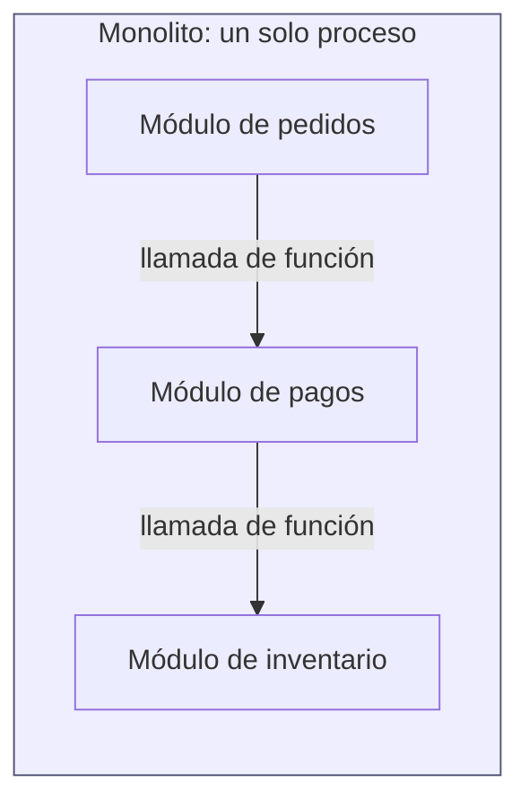
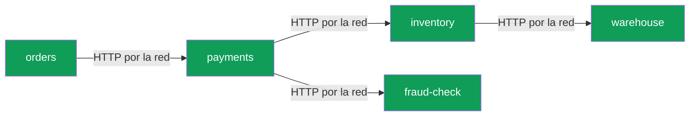
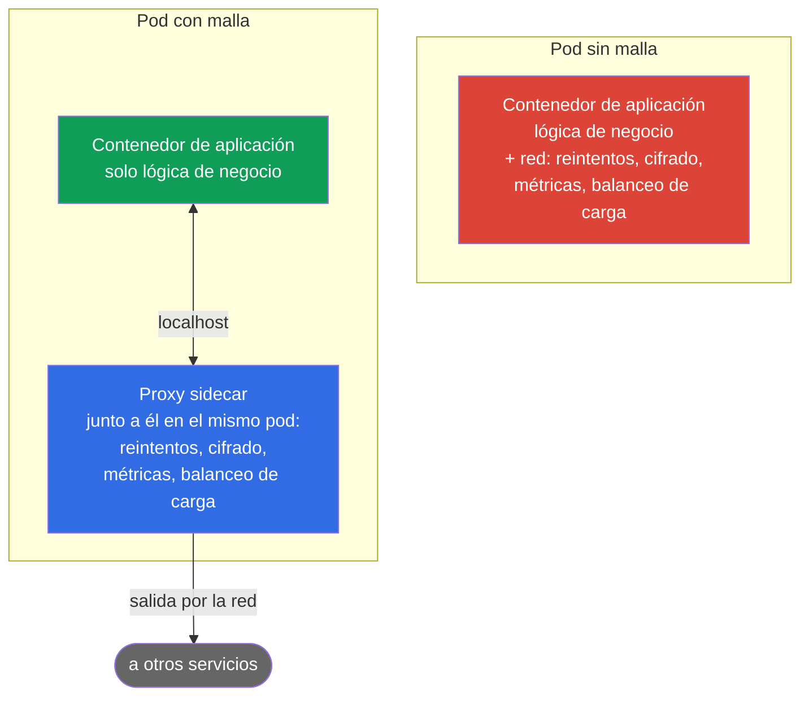
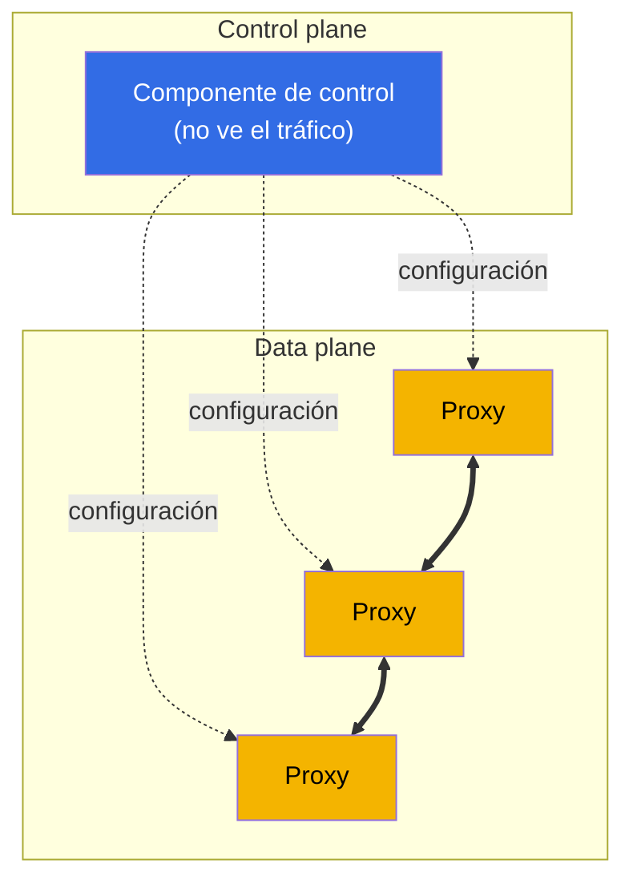
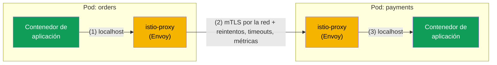
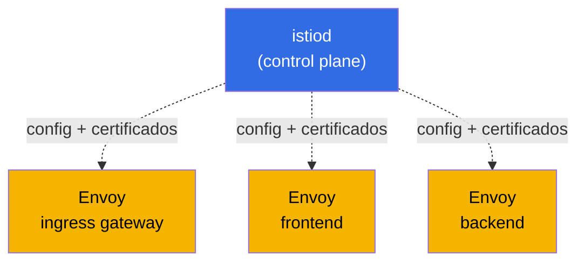
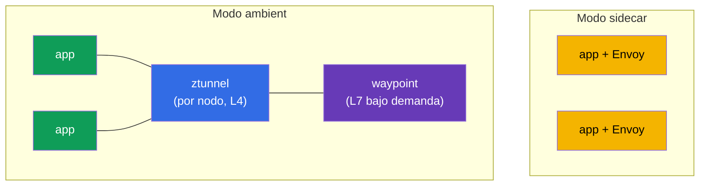

[RU version](ru.md) · [Eng version](en.md)

# Capítulo 1. Introducción a la malla de servicios y la arquitectura de Istio

> **Para quién es este capítulo.** Damos por hecho que ya conoces Kubernetes a nivel CKA.
> El CKA (Certified Kubernetes Administrator) es la certificación oficial de la CNCF y la
> Linux Foundation que valida la capacidad de administrar un clúster de Kubernetes. Más
> sobre el examen:
> [Certified Kubernetes Administrator (CKA)](https://training.linuxfoundation.org/certification/certified-kubernetes-administrator-cka/).
> Si no has hecho este examen, no pasa nada: basta con sentirte cómodo con Kubernetes: Pod,
> Deployment, Service, Ingress, kubectl, y entender qué son kube-proxy y NetworkPolicy. Pero
> todavía no has trabajado con una malla de servicios ni con Istio. Este capítulo cierra
> exactamente esa brecha.
> Partimos de lo que ya sabes y avanzamos hacia por qué se necesita una malla, qué es y
> cómo está construido Istio. No escribiremos código, solo recorreremos los conceptos y el
> panorama general. La práctica empieza en el capítulo 2.

## 1.1. Qué hace ya Kubernetes y qué le falta

En Kubernetes ya tienes primitivas de red listas para usar. Veamos qué te dan y dónde está
su límite.

| Tarea | Qué usas hoy | Dónde está el límite |
|-------|--------------|----------------------|
| Encontrar otro servicio por su nombre | Service + kube-DNS | Balanceo solo a nivel de conexión (L4) |
| Distribuir el tráfico | Service / kube-proxy | Round-robin sobre conexiones, sin "10% a v2" |
| Dejar entrar tráfico desde fuera | Ingress | Solo en el borde, nada sobre el tráfico dentro del clúster |
| Restringir quién habla con quién | NetworkPolicy | Solo por IP y puerto (L3/L4), sin conciencia de HTTP |
| Cifrar el tráfico entre pods | no de fábrica | El tráfico pod a pod va en texto plano |
| Reintentar una petición fallida, fijar un timeout | no de fábrica | La propia aplicación tiene que hacerlo |
| Ver quién llama a quién y con qué latencia | no de fábrica | Hay que añadir código a mano |

Las primeras cuatro filas son tu zona de confort tras el CKA. Ahora mira las tres de abajo.
Cifrar el tráfico servicio a servicio, la resiliencia ante fallos y la observabilidad:
Kubernetes no te da esto de fábrica. Aquí es donde empieza la malla de servicios.

## 1.2. Por qué esto se volvió un problema: monolito vs microservicios

Cuando la aplicación era un monolito, casi todas las llamadas entre sus partes eran simples
llamadas de función dentro de un mismo proceso. No viajaban por la red, no se perdían y no
había que cifrarlas ni reintentarlas.

Cuando esa misma funcionalidad se divide en microservicios, cada llamada entre ellos se
convierte en una petición de red. Y la red no es fiable: los paquetes se pierden, los
servicios se reinician, las latencias se disparan.

Cada flecha aquí es un posible punto de fallo. Y de inmediato aparecen cuatro grupos de
tareas que apenas existían en el monolito.

- **Gestión del tráfico.** ¿Cómo despliegas una nueva versión de payments al 10% de los
  usuarios? ¿Cómo envías a los testers a una versión experimental según una cabecera HTTP?
- **Resiliencia.** ¿Qué haces si inventory va lento o devuelve 503? ¿Reintentar la petición?
  ¿Cortarla por timeout? ¿Sacar temporalmente el servicio en mal estado?
- **Seguridad.** ¿Cómo te aseguras de que orders habla con el payments real y no con algo
  que lo suplanta? ¿Cómo cifras ese tráfico? ¿Cómo prohíbes que fraud-check llame a
  warehouse directamente?
- **Observabilidad.** Una petición pasó por cinco servicios y se quedó colgada en algún
  punto. ¿Dónde exactamente? ¿Cuántas peticiones por segundo entre servicios, cuál es la
  tasa de error y la latencia?

## 1.3. Tres formas de resolver estas tareas

### Opción 1. Escribir todo en el código de cada servicio

La primera opción evidente: que cada servicio sepa por sí mismo reintentar peticiones, fijar
timeouts, cifrar conexiones y emitir métricas. Problemas:

- La lógica hay que duplicarla en cada servicio y mantenerla idéntica.
- Servicios en distintos lenguajes (Go, Java, Python) implican escribir lo mismo en cada
  lenguaje a su manera.
- Cambia la política de reintentos y tienes que recompilar y redesplegar cada servicio.

### Opción 2. Librerías compartidas

Después llegaron las librerías a nivel de aplicación (en su momento fueron Netflix Hystrix,
Twitter Finagle y similares). La resiliencia y el balanceo de carga se trasladaron a código
enchufable. Mejoró, pero los principales inconvenientes se mantuvieron:

- La librería está atada a un lenguaje; el zoo de implementaciones no desapareció.
- Actualizar la librería sigue requiriendo recompilar y redesplegar el servicio.
- El desarrollador de la lógica de negocio tiene que entender las sutilezas de la
  resiliencia de red.

### Opción 3. Mover todo a la infraestructura, junto al servicio

La idea central de una malla de servicios: sacar toda la fontanería de red de la aplicación
y ponerla en un proxy aparte que se sitúa junto a cada servicio e intercepta todo su tráfico
de red. La aplicación cree que hace una petición HTTP normal, mientras el proxy añade de
forma transparente reintentos, cifrado, métricas y enrutamiento.

Este es el enfoque de la malla de servicios: el código de la aplicación no cambia, y todo el
comportamiento de red se configura de forma declarativa a nivel de infraestructura.

## 1.4. Qué es una malla de servicios

Una malla de servicios es una capa de infraestructura dedicada que gestiona la comunicación
entre servicios: enrutamiento, resiliencia, seguridad y observabilidad. Y todo ello de forma
transparente para la aplicación.

Técnicamente consta de dos partes. Esta separación es el concepto clave del capítulo:
recuérdalo desde ya.

- **Data plane.** Un conjunto de proxies, uno junto a cada instancia de servicio (los
  sidecars de la sección anterior). Son ellos los que hacen pasar el tráfico real por sí
  mismos y aplican las reglas: cifran conexiones, reintentan peticiones, cuentan métricas.
- **Control plane.** Es el cerebro de la malla. No procesa el tráfico de usuario. Su trabajo
  es tomar tus ajustes y repartir la configuración actual a todos los proxies, y además
  emitirles certificados para el cifrado.

Las líneas continuas entre proxies son el tráfico vivo entre servicios. Las líneas
discontinuas son la configuración que el control plane reparte a los proxies. La regla es
simple: el control plane configura, el data plane trabaja. Cómo se llaman exactamente estas
partes en Istio lo veremos un poco más adelante.

## 1.5. Qué mallas de servicios existen hoy

Ya cubrimos la idea de una malla. Antes de sumergirnos en Istio, conviene mirar alrededor:
Istio no es la única malla de servicios. Entender el mercado ayuda a ver por qué se eligió
para el curso.

- **Istio.** La malla más popular y con más funcionalidades, un proyecto de la CNCF. Data
  plane sobre Envoy. Enrutamiento, seguridad, observabilidad y extensibilidad ricos. El
  coste es una barrera de entrada más alta y complejidad.
- **Linkerd.** La segunda malla más popular, también de la CNCF. Usa su propio proxy ligero
  escrito en Rust (no Envoy). La principal ventaja es la simplicidad y el bajo overhead. La
  desventaja son menos funcionalidades que Istio (enrutamiento y extensibilidad más pobres).
- **Cilium Service Mesh.** Construido sobre eBPF y puede funcionar sin un proxy en cada pod,
  moviendo algunas funciones directamente al kernel de Linux. La ventaja es el alto
  rendimiento y la integración estrecha con la red. La desventaja es que las funciones L7
  siguen dependiendo de Envoy, y el ecosistema alrededor de la malla es más joven.
- **Consul (HashiCorp).** Una malla sobre Consul, usa Envoy. Fuerte donde necesitas una única
  herramienta fuera de Kubernetes (VMs, varias plataformas, multi-datacenter).
- **Kuma / Kong Mesh.** Un proyecto de la CNCF basado en Envoy, puede gestionar múltiples
  zonas y cargas de trabajo fuera de Kubernetes desde un único panel de control.
- **AWS App Mesh.** Una malla gestionada de AWS sobre Envoy. Sencilla de integrar con los
  servicios de AWS, pero atada al ecosistema de AWS y menos capaz que Istio (y perdiendo
  relevancia poco a poco).

Una comparación rápida:

| Malla | Data plane | Punto fuerte | Cuándo se elige |
|-------|-----------|--------------|-----------------|
| **Istio** | Envoy (sidecar o ambient) | La más completa, gran ecosistema | Muchos servicios, altas exigencias de tráfico y seguridad |
| **Linkerd** | proxy propio en Rust | Simplicidad, bajo overhead | Necesitas una malla ligera con mínima configuración |
| **Cilium** | eBPF (+ Envoy para L7) | Rendimiento, trabajo en el kernel | Ya usas el CNI de Cilium, la velocidad importa |
| **Consul** | Envoy | Trabajo fuera de Kubernetes, multiplataforma | Infraestructura híbrida, VMs + Kubernetes |
| **Kuma / Kong** | Envoy | Multizona, gestión sencilla | Varios clústeres y cargas fuera de Kubernetes |

Importante: la mayoría de las mallas (Istio, Cilium, Consul, Kuma, App Mesh) están
construidas sobre Envoy. Así que las habilidades que ganas con Istio se transfieren en gran
medida a otras mallas también. Istio fue elegido para el curso: es el más completo y
extendido, y tiene la certificación ICA. A partir de aquí nos sumergimos en él.

## 1.6. Cómo acaba el proxy junto al servicio (sidecar)

¿Cómo se coloca físicamente el proxy junto a cada servicio? Mediante un mecanismo de
Kubernetes que ya conoces: un contenedor extra en el pod. Se llama sidecar.

Cuando un namespace lleva la etiqueta `istio-injection=enabled`, Istio añade otro contenedor,
istio-proxy (ese mismo Envoy), a un pod cuando se crea. Por eso los pods en la malla muestran
`2/2` en la columna READY: el primer contenedor es tu aplicación, el segundo es el proxy.

Ahora la parte interesante. Mediante reglas de iptables (configuradas por un init container
especial al arrancar el pod), todo el tráfico entrante y saliente de la aplicación se enruta
a través de Envoy. La aplicación llama a `http://payments:8080` como siempre, pero en
realidad la petición cae primero en el Envoy local, que aplica todas las políticas y solo
entonces envía la petición al Envoy de otro pod.

1. La aplicación orders hace una petición HTTP normal; va al Envoy local.
2. Envoy cifra la petición (mTLS), aplica políticas (reintentos, timeouts, balanceo de carga,
   métricas) y la envía al Envoy del pod payments por la red.
3. El Envoy del lado de payments descifra el tráfico y se lo entrega a la aplicación por
   localhost.

La conclusión: la aplicación no sabe nada de la malla. Para ella, esto sigue siendo una
simple llamada HTTP. Todo el trabajo ocurre en Envoy.

> **Una analogía con lo que conoces.** kube-proxy configura iptables en el nodo y balancea en
> L4, es decir, por conexión. Istio configura iptables dentro del pod y enruta el tráfico
> hacia el proxy Envoy, que entiende HTTP: cabeceras, métodos, rutas, códigos de respuesta.
> De ahí todas las nuevas capacidades.

## 1.7. La arquitectura completa de Istio

Ahora montemos el panorama general. Istio tiene tres actores principales.

- **istiod** — este es el control plane. Un único binario que reparte la configuración a
  todos los Envoy (históricamente lo hacía el componente Pilot), emite y rota certificados
  para mTLS (Citadel) y valida tus manifiestos (Galley). Antes eran servicios separados; en
  el Istio moderno están fusionados en un solo istiod.
- **Envoy** — este es el data plane. Un proxy en cada pod (sidecar) y en los gateways.
- **Gateways** — el mismo Envoy, pero situado en el borde de la malla. El ingress gateway
  deja entrar tráfico desde fuera hacia el clúster, el egress gateway deja salir tráfico del
  clúster.

Para no sobrecargar la imagen, dividámosla en dos. Primero, el camino del tráfico vivo (data
plane). Cada servicio es un pod de dos contenedores: la aplicación y Envoy a su lado.

El camino de la petición es lineal: cliente, luego ingress gateway, luego el Envoy del
servicio frontend, luego el Envoy del servicio backend. Todo el tráfico dentro de la malla
va cifrado con mTLS.

Ahora por separado: cómo istiod (el control plane) suministra a todos los Envoy la
configuración y los certificados. No toca el tráfico él mismo, solo configura los proxies.

Combina las dos imágenes en tu cabeza: el tráfico corre a lo largo de las flechas del primer
diagrama, mientras que el istiod del segundo ya ha repartido a todos esos Envoy sus reglas
de enrutamiento y certificados.

## 1.8. Qué puede hacer Istio

Todo lo que hace Istio se ordena cómodamente en cuatro áreas. Son también los dominios del
examen ICA para el que nos preparamos en la Parte 1 del curso.

- **Gestión del tráfico.** Enrutamiento de grano fino: releases canary, división por pesos,
  enrutamiento por cabeceras, mirroring de tráfico, balanceo de carga, trabajo con servicios
  externos. Son los capítulos 5-11.
- **Seguridad.** mTLS automático entre servicios, autenticación basada en identidad
  (SPIFFE), autorización (quién puede hablar con quién y cómo), verificación de JWT de
  usuario. Son los capítulos 12-15.
- **Observabilidad.** Métricas de cada petición, trazado distribuido, un grafo de servicios,
  y todo ello sin cambiar código. Son los capítulos 16-17.
- **Escenarios avanzados y extensibilidad.** Rate limiting, lógica personalizada vía
  EnvoyFilter, Lua y Wasm, modo ambient, optimización. Son los capítulos 18-22.

Además de temas transversales: instalación y actualización (capítulos 2-4) y troubleshooting
(capítulo 23).

## 1.9. Dos modos del data plane: sidecar y ambient

Históricamente Istio trabaja con el modelo de sidecar que cubrimos arriba: un Envoy en cada
pod. Es fiable y potente, pero el modelo tiene un coste. Un proxy en cada pod consume CPU y
memoria, y actualizar el data plane requiere reiniciar los pods.

Por eso apareció el modo ambient, un modo sin sidecars. En él, el tráfico L4 lo atiende un
componente compartido por nodo, ztunnel, y las funciones L7 (enrutamiento, autorización
HTTP) se habilitan bajo demanda mediante un waypoint proxy aparte. Así el overhead es menor
y las actualizaciones son más sencillas.

Por ahora recuerda solo que ambos modos existen. Estudiamos la parte principal del curso
sobre el modelo clásico de sidecar; es más completo y más claro para empezar. Cubrimos
ambient en detalle en el capítulo 21.

## 1.10. Cuándo necesitas una malla y cuándo no

Una malla de servicios no es gratis. Antes de adoptarla, sopesa honestamente los
inconvenientes.

- **Overhead.** Un proxy extra en cada pod añade algo de latencia y consume recursos.
- **Complejidad.** Aparece toda una nueva capa de abstracciones y recursos que tienes que
  entender y saber depurar (el capítulo 23 está dedicado a esto).
- **No para tres servicios.** Para una aplicación pequeña de un par de servicios, una malla
  es matar moscas a cañonazos.

Istio se justifica cuando hay muchos servicios, están en distintos lenguajes, la seguridad
importa (mTLS, Zero Trust) y la observabilidad importa, y las exigencias sobre la gestión de
releases (canary, despliegues graduales) son altas. Son exactamente los escenarios que
practicamos en los laboratorios.

## 1.11. Un puente desde el CKA: mapeo de conceptos conocidos

Para que el material nuevo aterrice sobre lo que ya sabes, ten a mano esta tabla.

| Lo conoces de Kubernetes | El equivalente en Istio | Cuál es la diferencia |
|--------------------------|-------------------------|-----------------------|
| Ingress | Gateway + VirtualService | Enrutamiento L7 flexible: pesos, cabeceras, mirroring |
| kube-proxy (L4) | Envoy sidecar (L7) | Entiende HTTP: métodos, rutas, códigos, reintentos, timeouts |
| NetworkPolicy (L3/L4) | AuthorizationPolicy (L7) | Reglas por identidad, método y ruta HTTP, no solo IP y puerto |
| Cifrado manual | mTLS automático | Istio emite certificados y cifra el tráfico pod a pod por sí mismo |
| Métricas vía código | Métricas desde Envoy | Se recogen automáticamente para cada petición |
| ServiceAccount para acceso a la API | ServiceAccount como identidad (SPIFFE) | El mismo SA se convierte en la identidad criptográfica del servicio |

## 1.12. Miniglosario

- **Malla de servicios** — una capa de infraestructura para gestionar el tráfico entre
  servicios.
- **Data plane** — los proxies (Envoy) que transportan el tráfico real.
- **Control plane** — istiod: reparte configuración y certificados, no toca el tráfico.
- **Envoy** — un proxy L7 rápido, la base del data plane de Istio.
- **Sidecar** — el contenedor istio-proxy (Envoy) que se añade al pod junto a la aplicación.
- **istiod** — el binario único del control plane (Pilot, Citadel, Galley en uno).
- **Gateway** — Envoy en el borde de la malla: ingress (entrada) y egress (salida).
- **mTLS** — TLS mutuo: ambos lados presentan certificados, el tráfico va cifrado.
- **SPIFFE** — un estándar de identidad de la forma `spiffe://cluster.local/ns/<ns>/sa/<sa>`.
- **Modo ambient** — un modo sin sidecar: ztunnel (L4) y waypoint (L7).

## 1.13. Resumen del capítulo

- De fábrica, Kubernetes no resuelve cifrar el tráfico servicio a servicio, la resiliencia
  ante fallos ni la observabilidad. Este es exactamente el nicho de la malla de servicios.
- Una malla saca la fontanería de red de la aplicación a un proxy junto al servicio y se
  configura de forma declarativa, sin cambiar código.
- Istio consta de un data plane (Envoy en pods y gateways) y un control plane (istiod). Debes
  distinguirlos claramente.
- El sidecar se añade al pod e intercepta todo el tráfico vía iptables. Los pods en la malla
  muestran `2/2`.
- Las capacidades de Istio se dividen en gestión del tráfico, seguridad, observabilidad y
  escenarios avanzados. Son los dominios del examen ICA.
- Hay dos modos del data plane: el clásico sidecar y el nuevo ambient sin sidecar.
- Istio no es la única malla (están Linkerd, Cilium, Consul, Kuma), pero es la más completa y
  extendida, y la mayoría de alternativas también van sobre Envoy.
- Una malla se justifica con un gran número de servicios y altas exigencias de seguridad,
  releases y observabilidad. Para aplicaciones diminutas es excesivo.

## 1.14. Preguntas de autoevaluación

1. ¿En qué se diferencian fundamentalmente las tareas del control plane y del data plane?
   ¿Cuál de ellos procesa el tráfico de usuario?
2. ¿Por qué los pods en la malla muestran `2/2` contenedores? ¿Qué hace el segundo
   contenedor?
3. ¿Cómo entra el tráfico de la aplicación en Envoy si la aplicación no sabe de él?
4. ¿En qué sentido es AuthorizationPolicy en Istio más potente que NetworkPolicy en
   Kubernetes?
5. ¿En qué casos no deberías adoptar una malla de servicios?
6. ¿En qué se diferencia el modo sidecar del data plane del modo ambient?
7. Nombra un par de alternativas a Istio y en qué se diferencian. ¿Por qué muchas mallas
   están construidas sobre Envoy?

## Práctica

La práctica empieza en el siguiente capítulo. En el capítulo 2 instalarás Istio en un
clúster, habilitarás la inyección de sidecar y desplegarás la aplicación de demostración
Bookinfo para ver en vivo todo lo descrito arriba.

🧪 Laboratorio 01: [tasks/ica/labs/01](../../labs/01/README_ES.MD)

---
[Índice](../README_ES.md) · [Capítulo 2](../02/es.md)
