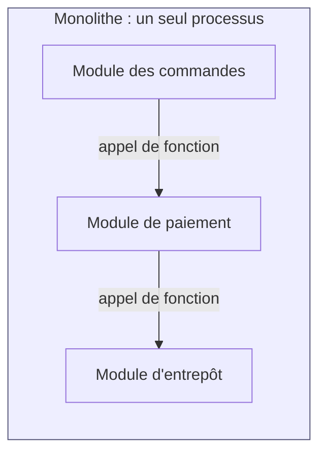
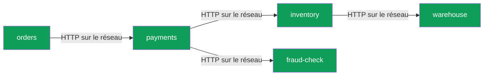
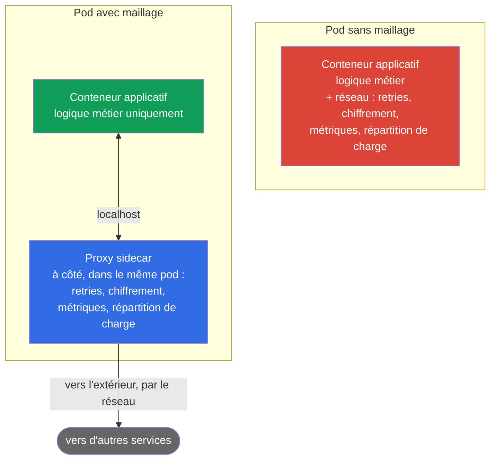
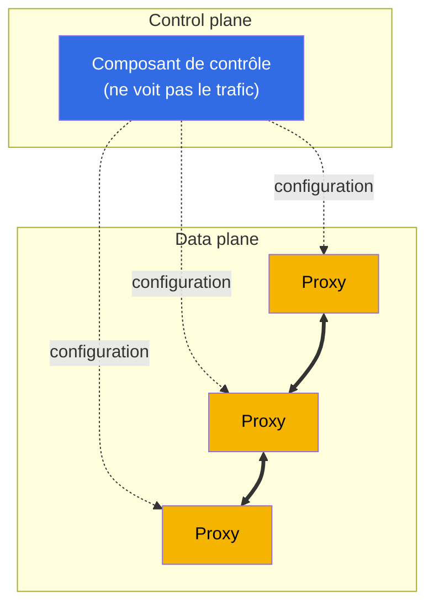
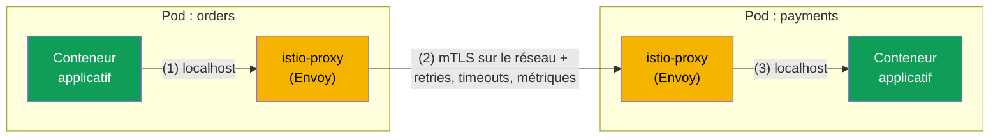
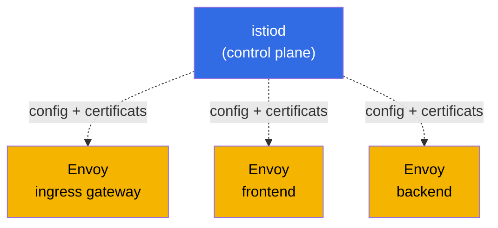
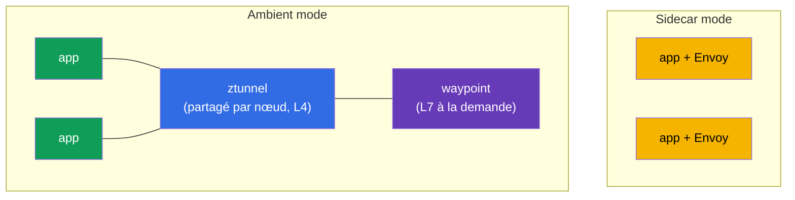

[RU version](ru.md) · [Eng version](en.md) · [Versión en español](es.md) · [Deutsche Version](de.md)

# Chapitre 1. Introduction au maillage de services et à l'architecture d'Istio

> **À qui s'adresse ce chapitre.** Nous partons du principe que vous connaissez déjà
> Kubernetes au niveau CKA. Le CKA (Certified Kubernetes Administrator) est une
> certification officielle de la CNCF et de la Linux Foundation qui atteste de la
> capacité à administrer un cluster Kubernetes. Plus de détails sur l'examen :
> [Certified Kubernetes Administrator (CKA)](https://training.linuxfoundation.org/certification/certified-kubernetes-administrator-cka/).
> Si vous n'avez pas passé cet examen, ce n'est pas grave : il suffit de savoir
> travailler avec Kubernetes en toute confiance : Pod, Deployment, Service, Ingress,
> kubectl, comprendre ce que sont kube-proxy et NetworkPolicy. Mais vous n'avez pas
> encore rencontré le maillage de services ni Istio. Ce chapitre comble précisément
> cette lacune.
> Nous partirons de ce que vous connaissez déjà pour arriver à comprendre pourquoi un
> maillage est utile, ce qu'il est et comment Istio est structuré. Nous n'écrirons pas
> de code, nous examinerons seulement les concepts et la vue d'ensemble. La pratique
> commencera au chapitre 2.

## 1.1. Ce que Kubernetes sait déjà faire, et ce qui lui manque

Dans Kubernetes, vous disposez déjà de primitives réseau prêtes à l'emploi. Voyons ce
qu'elles apportent et où se situe leur limite.

| Tâche | Ce que vous utilisez actuellement | Où est la limite |
|--------|---------------------------|-------------|
| Trouver un autre service par son nom | Service + kube-DNS | Répartition uniquement au niveau des connexions (L4) |
| Répartir le trafic | Service / kube-proxy | Round-robin par connexion, impossible de faire « 10 % vers v2 » |
| Faire entrer le trafic depuis l'extérieur | Ingress | Uniquement à l'entrée, rien sur le trafic à l'intérieur du cluster |
| Restreindre qui communique avec qui | NetworkPolicy | Uniquement par IP et port (L3/L4), sans tenir compte du HTTP |
| Chiffrer le trafic entre les pods | rien de prêt à l'emploi | Le trafic entre les pods circule en clair |
| Rejouer une requête échouée, poser un timeout | rien de prêt à l'emploi | C'est à l'application de le faire elle-même |
| Voir qui appelle qui et avec quelle latence | rien de prêt à l'emploi | Il faut ajouter du code à la main |

Les quatre premières lignes sont votre zone de confort après le CKA. Regardez
maintenant les trois dernières. Le chiffrement du trafic entre services, la résilience
aux pannes et l'observabilité ne sont pas fournis par Kubernetes de base. C'est là que
commence le maillage de services.

## 1.2. Pourquoi c'est devenu un problème : monolithe contre microservices

Lorsque l'application était un monolithe, presque tous les appels entre ses parties
étaient de simples appels de fonctions au sein d'un même processus. Ils ne
transitaient pas par le réseau, ne se perdaient pas, il n'était pas nécessaire de les
chiffrer ni de les rejouer.

Lorsque ces mêmes fonctionnalités sont découpées en microservices, chaque appel entre
eux devient une requête réseau. Or le réseau n'est pas fiable : les paquets se
perdent, les services redémarrent, les latences fluctuent.

Chaque flèche ici est un point de défaillance possible. Et apparaissent aussitôt
quatre groupes de tâches qui n'existaient presque pas dans le monolithe.

- **Gestion du trafic.** Comment déployer une nouvelle version de payments pour 10 %
  des utilisateurs ? Comment orienter les testeurs vers une version expérimentale via
  un en-tête HTTP ?
- **Résilience.** Que faire si inventory ralentit ou renvoie des 503 ? Rejouer la
  requête ? Interrompre par timeout ? Désactiver temporairement le service défaillant ?
- **Sécurité.** Comment s'assurer que orders communique avec le vrai payments et non
  avec quelque chose d'usurpé ? Comment chiffrer ce trafic ? Comment empêcher
  fraud-check d'appeler directement warehouse ?
- **Observabilité.** La requête a traversé cinq services et s'est bloquée quelque part.
  Où exactement ? Combien de requêtes par seconde entre les services, quel taux
  d'erreurs et quelle latence ?

## 1.3. Trois façons de résoudre ces problèmes

### Méthode 1. Tout écrire dans le code de chaque service

Première option évidente : que chaque service sache lui-même rejouer les requêtes,
poser des timeouts, chiffrer les connexions et envoyer des métriques. Les problèmes :

- La logique doit être dupliquée dans chaque service et maintenue identique.
- Les services sont dans différents langages (Go, Java, Python), il faut donc écrire la
  même chose dans chaque langage, à sa manière.
- Si l'on change la politique de retries, il faut reconstruire et redéployer tous les
  services.

### Méthode 2. Bibliothèques communes

Sont ensuite apparues des bibliothèques au niveau de l'application (à l'époque, il
s'agissait de Netflix Hystrix, Twitter Finagle et d'autres similaires). La résilience
et la répartition de charge ont été déportées dans du code réutilisable. C'était mieux,
mais les principaux inconvénients demeuraient :

- La bibliothèque est liée au langage, la multitude d'implémentations n'a pas disparu.
- Mettre à jour la bibliothèque nécessite toujours de reconstruire et redéployer le
  service.
- Le développeur de la logique métier doit maîtriser les subtilités de la résilience
  réseau.

### Méthode 3. Tout déporter dans l'infrastructure, à côté du service

L'idée maîtresse du maillage de services : retirer toute la mécanique réseau de
l'application et la placer dans un proxy séparé, situé à côté de chaque service et qui
intercepte tout son trafic réseau. L'application pense faire une requête HTTP
ordinaire, tandis que le proxy ajoute discrètement les retries, le chiffrement, les
métriques et le routage.

C'est cela l'approche du maillage de services : le code de l'application ne change pas,
et tout le comportement réseau se configure de manière déclarative au niveau de
l'infrastructure.

## 1.4. Qu'est-ce qu'un maillage de services

Un maillage de services est une couche d'infrastructure distincte qui gère la
communication entre les services : routage, résilience, sécurité et observabilité. Et
tout cela de manière transparente pour l'application.

Techniquement, il se compose de deux parties. Cette distinction est le concept
principal du chapitre, retenez-la dès maintenant.

- **Data plane (plan de données).** Un ensemble de proxys, un à côté de chaque instance
  de service (les fameux sidecars de la section précédente). Ce sont eux qui font
  transiter le trafic réel et appliquent les règles : ils chiffrent les connexions,
  rejouent les requêtes, comptabilisent les métriques.
- **Control plane (plan de contrôle).** C'est le cerveau du maillage. Il ne traite pas
  le trafic utilisateur. Son rôle est de prendre vos réglages et de distribuer à tous
  les proxys la configuration à jour, ainsi que de leur fournir des certificats pour le
  chiffrement.

Les lignes pleines entre les proxys représentent le trafic réel entre services. Les
pointillés, c'est la configuration que le control plane distribue aux proxys depuis le
haut. La règle est simple : le control plane configure, le data plane travaille.
Comment ces parties s'appellent concrètement dans Istio, nous le verrons un peu plus
loin.

## 1.5. Quels maillages de services existent aujourd'hui

Nous avons vu l'idée du maillage. Avant d'entrer dans le détail d'Istio, il est utile
de regarder autour de soi : Istio n'est pas le seul maillage de services. Comprendre le
marché aidera à voir pourquoi c'est lui qui a été choisi pour ce cours.

- **Istio.** Le maillage le plus populaire et le plus riche en fonctionnalités, projet
  CNCF. Data plane basé sur Envoy. Routage, sécurité, observabilité et extensibilité
  puissants. Le prix à payer : une barrière d'entrée plus haute et une complexité
  accrue.
- **Linkerd.** Deuxième maillage le plus populaire, également CNCF. Il utilise son
  propre proxy léger écrit en Rust (pas Envoy). Principal avantage : la simplicité et
  un faible surcoût. Inconvénient : moins de fonctionnalités qu'Istio (routage et
  extensibilité plus limités).
- **Cilium Service Mesh.** Construit sur eBPF et capable de fonctionner sans proxy dans
  chaque pod, en déportant une partie des fonctions directement dans le noyau Linux.
  Avantage : hautes performances et intégration étroite avec le réseau. Inconvénient :
  les fonctions L7 reposent tout de même sur Envoy, et l'écosystème autour du maillage
  est plus jeune.
- **Consul (HashiCorp).** Maillage bâti sur Consul, il utilise Envoy. Fort là où l'on a
  besoin d'un outil unique en dehors de Kubernetes (VM, plusieurs plateformes,
  multi-datacentre).
- **Kuma / Kong Mesh.** Projet CNCF basé sur Envoy, capable de gérer plusieurs zones et
  des charges de travail hors Kubernetes depuis une seule interface.
- **AWS App Mesh.** Maillage managé d'AWS basé sur Envoy. Simple à intégrer avec les
  services AWS, mais lié à l'écosystème AWS et inférieur à Istio en fonctionnalités (et
  qui perd progressivement de sa pertinence).

Comparatif rapide :

| Maillage | Data plane | Point fort | Quand le choisir |
|------|-----------|-----------------|----------------|
| **Istio** | Envoy (sidecar ou ambient) | Le plus riche, grand écosystème | Beaucoup de services, exigences élevées en matière de trafic et de sécurité |
| **Linkerd** | proxy Rust maison | Simplicité, faible surcoût | Besoin d'un maillage léger avec un minimum de réglages |
| **Cilium** | eBPF (+ Envoy pour L7) | Performances, exécution dans le noyau | Vous utilisez déjà Cilium CNI, la vitesse est importante |
| **Consul** | Envoy | Fonctionnement hors Kubernetes, multi-plateforme | Infrastructure hybride, VM + Kubernetes |
| **Kuma / Kong** | Envoy | Multi-zone, gestion simple | Plusieurs clusters et charges de travail hors Kubernetes |

Important : la plupart des maillages (Istio, Cilium, Consul, Kuma, App Mesh) sont
construits sur Envoy. C'est pourquoi les compétences acquises avec Istio se
transposent en grande partie aux autres maillages. Pour ce cours, Istio a été choisi :
c'est le plus riche et le plus répandu, et il existe pour lui une certification, l'ICA.
Nous allons maintenant l'approfondir.

## 1.6. Comment le proxy se retrouve à côté du service (sidecar)

Comment le proxy se place-t-il physiquement à côté de chaque service ? Par un mécanisme
Kubernetes que vous connaissez : un conteneur supplémentaire dans le pod. On l'appelle
sidecar.

Lorsqu'un namespace porte le label `istio-injection=enabled`, Istio ajoute lui-même, à
la création du pod, un conteneur supplémentaire, istio-proxy (le fameux Envoy). C'est
pourquoi, dans le maillage, les pods affichent `2/2` dans la colonne READY : le premier
conteneur est votre application, le second est le proxy.

Vient ensuite le plus intéressant. À l'aide de règles iptables (configurées par un
init-conteneur spécial au démarrage du pod), tout le trafic entrant et sortant de
l'application est redirigé via Envoy. L'application appelle `http://payments:8080`,
comme d'habitude, mais en réalité la requête passe d'abord par l'Envoy local, qui
applique toutes les politiques, puis n'envoie la requête à l'Envoy de l'autre pod
qu'ensuite.

1. L'application orders fait une requête HTTP ordinaire, qui part vers l'Envoy local.
2. Envoy chiffre la requête (mTLS), applique les politiques (retries, timeouts,
   répartition de charge, métriques) et l'envoie à l'Envoy du pod payments par le
   réseau.
3. L'Envoy côté payments déchiffre le trafic et le remet à l'application via localhost.

Conclusion : l'application ne sait rien du maillage. Pour elle, il s'agit toujours d'un
simple appel HTTP. Tout le travail se passe dans Envoy.

> **Analogie avec ce que vous connaissez.** kube-proxy configure iptables sur le nœud et
> répartit au niveau L4, c'est-à-dire par connexion. Istio configure iptables à
> l'intérieur du pod et redirige le trafic vers le proxy Envoy, qui comprend le HTTP :
> en-têtes, méthodes, chemins, codes de réponse. D'où toutes les nouvelles
> possibilités.

## 1.7. L'architecture complète d'Istio

Rassemblons maintenant la vue d'ensemble. Istio a trois acteurs principaux.

- **istiod** est le control plane. Un seul binaire qui distribue la configuration à
  tous les Envoy (rôle historiquement assuré par le composant Pilot), délivre et
  renouvelle les certificats pour le mTLS (Citadel) et vérifie vos manifestes (Galley).
  Auparavant, il s'agissait de services distincts ; dans l'Istio moderne, ils ont été
  regroupés en un seul istiod.
- **Envoy** est le data plane. Le proxy dans chaque pod (sidecar) et dans les gateways.
- **Gateways (passerelles)** sont les mêmes Envoy, mais placés à la frontière du
  maillage. L'ingress gateway fait entrer le trafic depuis l'extérieur vers le cluster,
  l'egress gateway laisse sortir le trafic du cluster vers l'extérieur.

Pour ne pas surcharger le schéma, séparons-le en deux. D'abord, le chemin du trafic
réel (data plane). Chaque service est un pod de deux conteneurs : l'application et
l'Envoy à côté.

Le chemin de la requête est linéaire : le client, puis l'ingress gateway, puis l'Envoy
du service frontend, puis l'Envoy du service backend. Tout le trafic à l'intérieur du
maillage est chiffré en mTLS.

Voyons maintenant à part comment istiod (control plane) fournit à tous les Envoy leur
configuration et leurs certificats. Il ne touche pas lui-même au trafic, il ne fait que
configurer les proxys.

Associez les deux images dans votre tête : le trafic circule le long des flèches du
premier schéma, tandis que l'istiod du second a distribué à l'avance à tous ces Envoy
les règles de routage et les certificats.

## 1.8. Ce que sait faire Istio

Tout ce que fait Istio se répartit commodément selon quatre axes. Ce sont d'ailleurs
les domaines de l'examen ICA, auquel nous nous préparons dans la Partie 1 du cours.

- **Gestion du trafic.** Routage fin : releases canary, répartition par poids, routage
  par en-têtes, mirroring du trafic, répartition de charge, travail avec des services
  externes. Ce sont les chapitres 5 à 11.
- **Sécurité.** mTLS automatique entre les services, authentification par identity
  (SPIFFE), autorisation (qui peut communiquer avec qui et comment), vérification des
  JWT des utilisateurs. Ce sont les chapitres 12 à 15.
- **Observabilité.** Métriques de chaque requête, tracing distribué, graphe des
  services, le tout sans modifier le code. Ce sont les chapitres 16 et 17.
- **Scénarios avancés et extensibilité.** Rate limiting, logique personnalisée via
  EnvoyFilter, Lua et Wasm, mode ambient, optimisation. Ce sont les chapitres 18 à 22.

Plus les thèmes transversaux : installation et mise à jour (chapitres 2 à 4) et
troubleshooting (chapitre 23).

## 1.9. Deux modes de data plane : sidecar et ambient

Historiquement, Istio fonctionne selon le modèle sidecar que nous avons vu plus haut :
un Envoy dans chaque pod. C'est fiable et puissant, mais ce modèle a un coût. Le proxy
dans chaque pod consomme du CPU et de la mémoire, et la mise à jour du data plane exige
de redémarrer les pods.

C'est pourquoi est apparu le mode ambient, un mode sans sidecars. Dans ce mode, le
trafic L4 est traité par un composant ztunnel partagé par nœud, et les fonctions L7
(routage, autorisation HTTP) s'activent au besoin via un waypoint proxy distinct. Ainsi
le surcoût est moindre et les mises à jour plus simples.

Pour l'instant, retenez simplement que les deux modes existent. Nous étudions
l'essentiel du cours sur le modèle sidecar classique, plus complet et plus clair pour
débuter. Nous examinerons le mode ambient en détail au chapitre 21.

## 1.10. Quand un maillage est utile, et quand il ne l'est pas

Un maillage de services n'est pas gratuit. Avant de l'adopter, pesez honnêtement les
inconvénients.

- **Surcoût.** Un proxy supplémentaire dans chaque pod ajoute un peu de latence et
  consomme des ressources.
- **Complexité.** Apparaît toute une nouvelle couche d'abstractions et de ressources
  qu'il faut comprendre et savoir déboguer (le chapitre 23 y est consacré).
- **Pas pour trois services.** Pour une petite application de quelques services, un
  maillage revient à tirer au canon sur des moineaux.

Istio se justifie lorsqu'il y a beaucoup de services, écrits dans différents langages,
que la sécurité (mTLS, Zero Trust) et l'observabilité sont importantes, et que les
exigences en matière de gestion des releases (canary, déploiements progressifs) sont
élevées. Ce sont précisément ces scénarios que nous mettons en pratique dans les labs.

## 1.11. Pont depuis le CKA : correspondance des concepts familiers

Pour que le nouveau s'appuie sur ce que vous connaissez déjà, gardez ce tableau sous la
main.

| Ce que vous connaissez de Kubernetes | Équivalent dans Istio | Différence |
|-------------------------|----------------|---------------|
| Ingress | Gateway + VirtualService | Routage L7 flexible : poids, en-têtes, mirroring |
| kube-proxy (L4) | Envoy sidecar (L7) | Comprend le HTTP : méthodes, chemins, codes, retries, timeouts |
| NetworkPolicy (L3/L4) | AuthorizationPolicy (L7) | Règles par identity, méthode et chemin HTTP, et pas seulement IP et port |
| Chiffrement manuel | mTLS automatique | Istio délivre lui-même les certificats et chiffre le trafic entre les pods |
| Métriques via le code | Métriques depuis Envoy | Collectées automatiquement pour chaque requête |
| ServiceAccount pour l'accès à l'API | ServiceAccount comme identity (SPIFFE) | Ce même SA devient l'identité cryptographique du service |

## 1.12. Mini-glossaire

- **Maillage de services (service mesh)** - couche d'infrastructure pour gérer le trafic
  entre les services.
- **Data plane** - les proxys (Envoy) qui portent le trafic réel.
- **Control plane** - istiod : distribue la configuration et les certificats, ne touche
  pas au trafic.
- **Envoy** - proxy L7 rapide, base du data plane d'Istio.
- **Sidecar** - conteneur istio-proxy (Envoy) ajouté au pod à côté de l'application.
- **istiod** - binaire unique du control plane (Pilot, Citadel, Galley réunis).
- **Gateway** - Envoy à la frontière du maillage : ingress (entrée) et egress (sortie).
- **mTLS** - TLS mutuel : les deux parties présentent des certificats, le trafic est
  chiffré.
- **SPIFFE** - standard d'identity de la forme `spiffe://cluster.local/ns/<ns>/sa/<sa>`.
- **Ambient mode** - mode sans sidecars : ztunnel (L4) et waypoint (L7).

## 1.13. Résumé du chapitre

- Kubernetes de base ne résout pas le chiffrement du trafic entre services, la
  résilience aux pannes et l'observabilité. C'est précisément la niche du maillage de
  services.
- Le maillage déporte la mécanique réseau de l'application vers un proxy situé à côté du
  service et se configure de manière déclarative, sans modifier le code.
- Istio se compose du data plane (Envoy dans les pods et les gateways) et du control
  plane (istiod). Il faut clairement les distinguer.
- Le sidecar est ajouté au pod et, via iptables, intercepte tout le trafic. Les pods
  dans le maillage affichent `2/2`.
- Les fonctionnalités d'Istio se répartissent en gestion du trafic, sécurité,
  observabilité et scénarios avancés. Ce sont les domaines de l'examen ICA.
- Il existe deux modes de data plane : le sidecar classique et le nouveau ambient sans
  sidecars.
- Istio n'est pas le seul maillage (il y a Linkerd, Cilium, Consul, Kuma), mais c'est
  le plus riche et le plus répandu, et la plupart des alternatives reposent aussi sur
  Envoy.
- Le maillage se justifie avec un grand nombre de services et des exigences élevées en
  matière de sécurité, de releases et d'observabilité. Pour de toutes petites
  applications, il est superflu.

## 1.14. Questions d'auto-évaluation

1. En quoi les tâches du control plane et du data plane diffèrent-elles fondamentalement ?
   Lequel des deux traite le trafic utilisateur ?
2. Pourquoi les pods dans le maillage affichent-ils `2/2` conteneurs ? Que fait le second
   conteneur ?
3. Comment le trafic de l'application arrive-t-il dans Envoy alors que l'application ne
   le sait pas ?
4. En quoi l'AuthorizationPolicy d'Istio est-elle plus puissante que la NetworkPolicy de
   Kubernetes ?
5. Dans quels cas ne faut-il pas adopter un maillage de services ?
6. En quoi le mode sidecar diffère-t-il du mode ambient du data plane ?
7. Citez quelques alternatives à Istio et en quoi elles diffèrent. Pourquoi de nombreux
   maillages sont-ils construits sur Envoy ?

## Pratique

La pratique commence au chapitre suivant. Au chapitre 2, vous installerez Istio dans le
cluster, activerez le sidecar injection et déploierez l'application de démonstration
Bookinfo, pour voir en vrai tout ce qui a été décrit ci-dessus.

🧪 Lab 01 : [tasks/ica/labs/01](../../labs/01/README_FR.MD)

---
[Table des matières](../README_FR.md) · [Chapitre 2](../02/fr.md)
