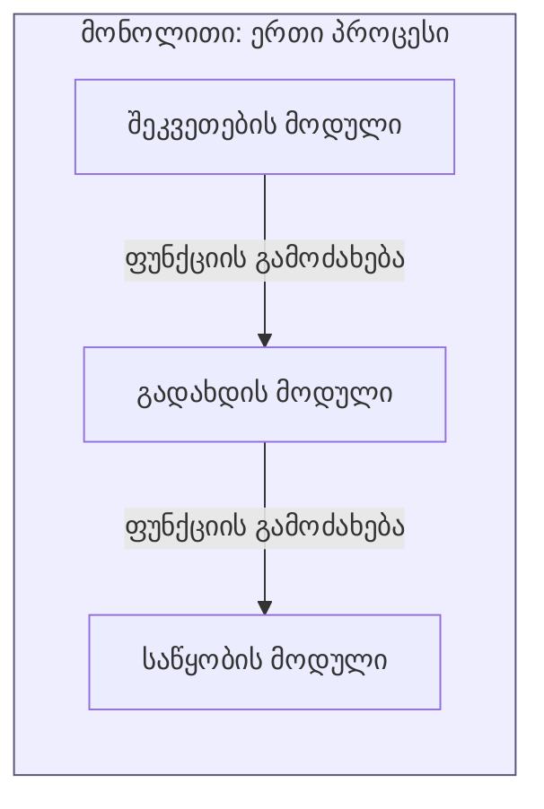
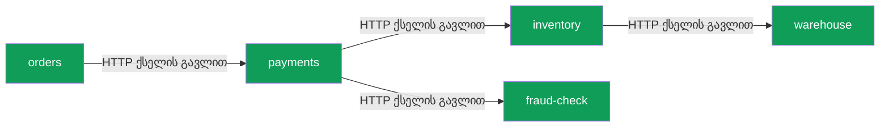
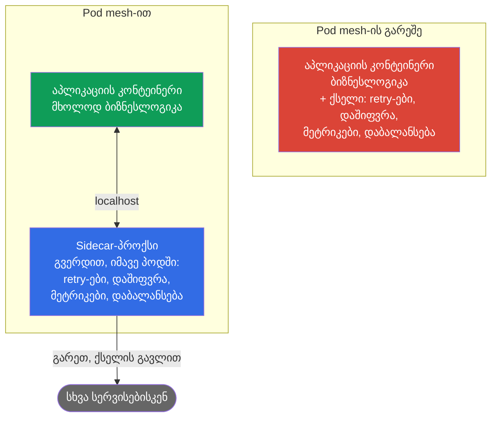
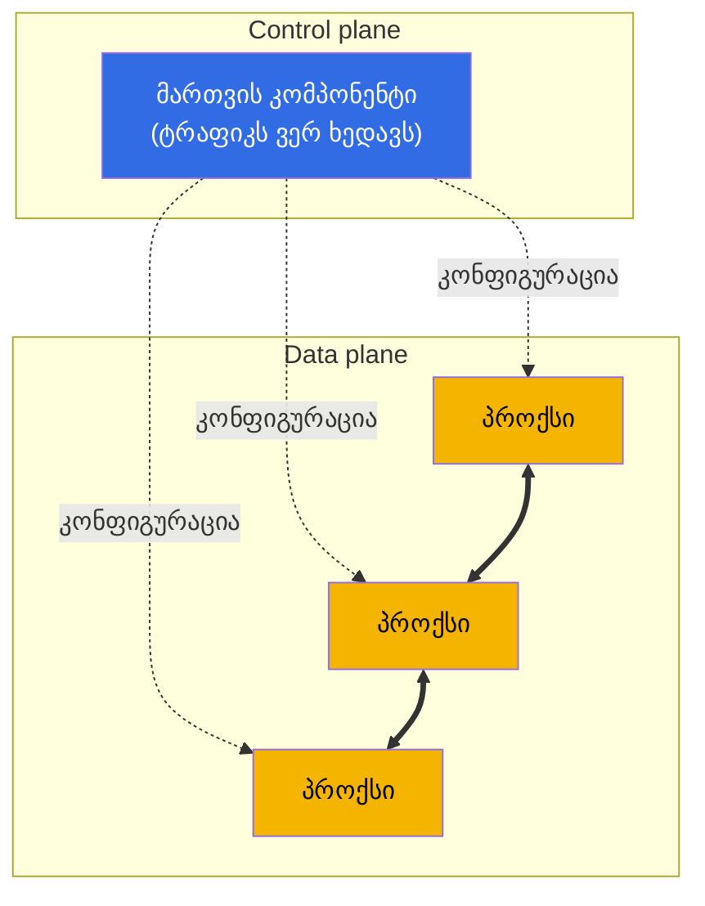
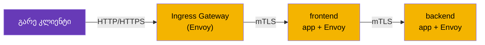
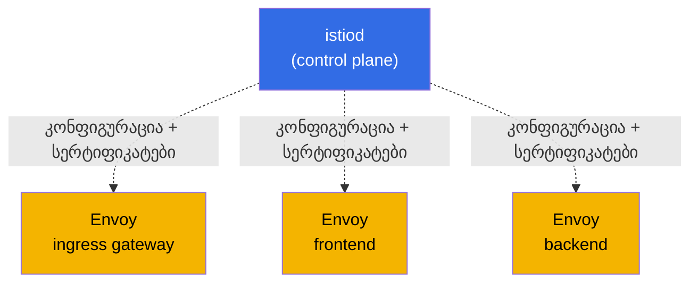
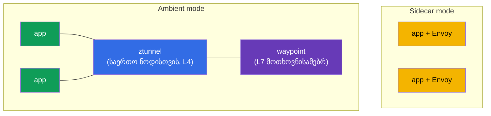

[Русская версия](ru.md) · [Eng version](en.md) · [Versión en español](es.md) · [Version française](fr.md) · [Deutsche Version](de.md) · [繁體中文版](tw.md) · [日本語版](jp.md)

# თავი 1. შესავალი service mesh-სა და Istio-ს არქიტექტურაში

> **ვისთვისაა ეს თავი.** ვვარაუდობთ, რომ Kubernetes-ს უკვე იცნობთ CKA-ის დონეზე.
> CKA (Certified Kubernetes Administrator) არის CNCF-ისა და Linux Foundation-ის
> ოფიციალური სერტიფიკაცია, რომელიც ადასტურებს Kubernetes-კლასტერის ადმინისტრირების
> უნარს. გამოცდის შესახებ დაწვრილებით:
> [Certified Kubernetes Administrator (CKA)](https://training.linuxfoundation.org/certification/certified-kubernetes-administrator-cka/).
> თუ ეს გამოცდა არ ჩაგიბარებიათ, პრობლემა არ არის - საკმარისია Kubernetes-თან
> თავდაჯერებულად მუშაობდეთ: Pod, Deployment, Service, Ingress, kubectl; გესმოდეთ,
> რა არის kube-proxy და NetworkPolicy. თუმცა service mesh-სა და Istio-ს ჯერ არ
> შეხვედრიხართ. ეს თავი სწორედ ამ დანაკლისს შეავსებს.
> დავიწყებთ იმით, რაც უკვე იცით, შემდეგ გავარკვევთ, რისთვისაა საჭირო mesh, რა არის
> ის და როგორაა მოწყობილი Istio. კოდს არ დავწერთ - მხოლოდ ცნებებსა და საერთო
> სურათს განვიხილავთ. პრაქტიკა მე-2 თავში დაიწყება.

## 1.1. რა შეუძლია უკვე Kubernetes-ს და რა აკლია მას

Kubernetes-ში მზა ქსელური პრიმიტივები უკვე გაქვთ. ვნახოთ, რას გვაძლევენ ისინი და
სად გადის მათი შესაძლებლობების ზღვარი.

| ამოცანა | რას იყენებთ ახლა | სად გადის ზღვარი |
|--------|---------------------------|-------------|
| სხვა სერვისის სახელით პოვნა | Service + kube-DNS | დატვირთვის დაბალანსება მხოლოდ კავშირების დონეზე (L4) |
| ტრაფიკის განაწილება | Service / kube-proxy | Round-robin კავშირების მიხედვით; „10% v2-ზე“ შეუძლებელია |
| გარე ტრაფიკის მიღება | Ingress | მხოლოდ შესასვლელში; კლასტერის შიგნით ტრაფიკს არ ეხება |
| იმის შეზღუდვა, ვინ ვისთან ურთიერთობს | NetworkPolicy | მხოლოდ IP-ისა და პორტის მიხედვით (L3/L4), HTTP-ის გაუთვალისწინებლად |
| პოდებს შორის ტრაფიკის დაშიფვრა | ნაგულისხმევად არ არის | პოდებს შორის ტრაფიკი ღია ტექსტით გადაიცემა |
| ჩავარდნილი მოთხოვნის გამეორება, timeout-ის დაყენება | ნაგულისხმევად არ არის | ეს თავად აპლიკაციას უნდა შეეძლოს |
| იმის დანახვა, ვინ ვის მიმართავს და რა დაყოვნებით | ნაგულისხმევად არ არის | კოდი ხელით უნდა დაემატოს |

პირველი ოთხი სტრიქონი CKA-ის შემდეგ თქვენი კომფორტის ზონაა. ახლა კი ბოლო სამს
შეხედეთ. სერვისებს შორის ტრაფიკის დაშიფვრას, შეცდომებისადმი მდგრადობასა და
observability-ს Kubernetes ნაგულისხმევად არ უზრუნველყოფს. სწორედ აქ იწყება
service mesh.

## 1.2. რატომ იქცა ეს პრობლემად: მონოლითი მიკროსერვისების წინააღმდეგ

როდესაც აპლიკაცია მონოლითი იყო, მის ნაწილებს შორის თითქმის ყველა მიმართვა ერთი
პროცესის შიგნით ფუნქციების ჩვეულებრივი გამოძახება გახლდათ. ისინი ქსელში არ
გადიოდა, არ იკარგებოდა და არც დაშიფვრა ან გამეორება სჭირდებოდა.

როდესაც იგივე ფუნქციონალი მიკროსერვისებად იყოფა, მათ შორის თითოეული მიმართვა
ქსელურ მოთხოვნად იქცევა. ქსელი კი არასაიმედოა: პაკეტები იკარგება, სერვისები
ხელახლა ეშვება, დაყოვნება მერყეობს.

აქ თითოეული ისარი შესაძლო მარცხის წერტილია. მაშინვე ჩნდება ამოცანების ოთხი ჯგუფი,
რომლებიც მონოლითში თითქმის არ არსებობდა.

- **ტრაფიკის მართვა.** როგორ გავუშვათ payments-ის ახალი ვერსია მომხმარებელთა 10%-ზე?
  როგორ გავაგზავნოთ ტესტერები ექსპერიმენტულ ვერსიაზე HTTP-სათაურის მიხედვით?
- **მდგრადობა.** რა ვქნათ, თუ inventory ნელა მუშაობს ან 503-ს აბრუნებს? გავიმეოროთ
  მოთხოვნა? timeout-ით შევწყვიტოთ? დაზიანებული სერვისი დროებით გავთიშოთ?
- **უსაფრთხოება.** როგორ დავრწმუნდეთ, რომ orders ნამდვილ payments-ს უკავშირდება და
  არა მის ნაცვლად ჩასმულ რამეს? როგორ დავშიფროთ ეს ტრაფიკი? როგორ ავუკრძალოთ
  fraud-check-ს warehouse-ისთვის პირდაპირ მიმართვა?
- **Observability.** მოთხოვნამ ხუთი სერვისი გაიარა და სადღაც გაიჭედა. კონკრეტულად
  რომელში? რამდენი მოთხოვნა სრულდება წამში სერვისებს შორის, როგორია შეცდომების
  წილი და დაყოვნება?

## 1.3. ამ ამოცანების გადაჭრის სამი გზა

### გზა 1. ყველაფრის თითოეული სერვისის კოდში დაწერა

პირველი აშკარა ვარიანტი: თითოეულმა სერვისმა თავად შეძლოს მოთხოვნების გამეორება,
timeout-ების დაყენება, კავშირების დაშიფვრა და მეტრიკების გაგზავნა. პრობლემები:

- ლოგიკა თითოეულ სერვისში უნდა გამეორდეს და ერთნაირად შენარჩუნდეს.
- სერვისები სხვადასხვა ენაზეა (Go, Java, Python), ამიტომ ერთი და იგივე თითოეულ
  ენაზე ცალ-ცალკე უნდა დაიწეროს.
- retry-ების პოლიტიკა შეიცვალა - ყველა სერვისი თავიდან უნდა აიწყოს და დაინერგოს.

### გზა 2. საერთო ბიბლიოთეკები

შემდეგ გაჩნდა აპლიკაციის დონის ბიბლიოთეკები (თავის დროზე ასეთი იყო Netflix Hystrix,
Twitter Finagle და მსგავსები). მდგრადობა და დაბალანსება ჩასართავ კოდში გადაიტანეს.
ვითარება გაუმჯობესდა, მაგრამ მთავარი ნაკლოვანებები დარჩა:

- ბიბლიოთეკა ენაზეა მიბმული და სხვადასხვა რეალიზაციის სიმრავლე არსად გამქრალა.
- ბიბლიოთეკის განახლება კვლავ მოითხოვს სერვისის თავიდან აწყობასა და დანერგვას.
- ბიზნესლოგიკის დეველოპერს ქსელური მდგრადობის დეტალებში გარკვევა უწევს.

### გზა 3. ყველაფრის ინფრასტრუქტურაში, სერვისის გვერდით გატანა

Service mesh-ის მთავარი იდეაა: მთელი ქსელური გარსი აპლიკაციიდან ავიღოთ და ცალკე
პროქსიში მოვათავსოთ, რომელიც თითოეული სერვისის გვერდით დგას და მის მთელ ქსელურ
ტრაფიკს იჭერს. აპლიკაციას ჰგონია, რომ ჩვეულებრივ HTTP-მოთხოვნას ასრულებს, პროქსი კი
შეუმჩნევლად ამატებს retry-ებს, დაშიფვრას, მეტრიკებსა და მარშრუტიზაციას.

ეს არის service mesh-ის მიდგომა: აპლიკაციის კოდი არ იცვლება, ხოლო მთელი ქსელური
ქცევა ინფრასტრუქტურის დონეზე დეკლარაციულად კონფიგურირდება.

## 1.4. რა არის service mesh

Service mesh ინფრასტრუქტურის ცალკე ფენაა, რომელიც სერვისებს შორის კომუნიკაციას
მართავს: მარშრუტიზაციას, მდგრადობას, უსაფრთხოებასა და observability-ს. და ყოველივე
ეს აპლიკაციისთვის გამჭვირვალედ ხდება.

ტექნიკურად ის ორი ნაწილისგან შედგება. ეს დაყოფა ამ თავის მთავარი ცნებაა - თავიდანვე
დაიმახსოვრეთ.

- **Data plane (მონაცემთა სიბრტყე).** პროქსების ერთობლიობა - თითო პროქსი სერვისის
  თითოეული ეგზემპლარის გვერდით (წინა განყოფილების იგივე sidecar-ები). სწორედ ისინი
  ატარებენ რეალურ ტრაფიკს და იყენებენ წესებს: შიფრავენ კავშირებს, იმეორებენ
  მოთხოვნებს, ითვლიან მეტრიკებს.
- **Control plane (მართვის სიბრტყე).** ეს mesh-ის ტვინია. ის მომხმარებლის ტრაფიკს
  არ ამუშავებს. მისი საქმეა თქვენი პარამეტრების აღება, ყველა პროქსისთვის აქტუალური
  კონფიგურაციის მიწოდება და დაშიფვრისთვის სერტიფიკატების გაცემა.

პროქსებს შორის უწყვეტი ხაზები სერვისებს შორის სამუშაო ტრაფიკია. წყვეტილი ხაზები
კონფიგურაციაა, რომელსაც control plane ზემოდან აწვდის პროქსებს. წესი მარტივია:
control plane აკონფიგურირებს, data plane მუშაობს. კონკრეტულად რა ეწოდება ამ ნაწილებს
Istio-ში - ცოტა მოგვიანებით განვიხილავთ.

## 1.5. რომელი service mesh-ები არსებობს დღეს

Mesh-ის იდეა განვიხილეთ. სანამ Istio-ს სიღრმისეულად შევისწავლით, სასარგებლოა გარშემო
მიმოვიხედოთ: Istio ერთადერთი service mesh არ არის. ბაზრის გაგება დაგვანახებს, რატომ
შეირჩა კურსისთვის სწორედ ის.

- **Istio.** ყველაზე პოპულარული და ფუნქციონალური mesh, CNCF-ის პროექტი. Data plane
  აგებულია Envoy-ზე. მდიდარი მარშრუტიზაცია, უსაფრთხოება, observability და
  გაფართოების შესაძლებლობა. ამის ფასი შესვლის მაღალი ბარიერი და სირთულეა.
- **Linkerd.** პოპულარობით მეორე mesh, ასევე CNCF-ის. იყენებს საკუთარ მსუბუქ პროქსის
  Rust-ზე (და არა Envoy-ს). მთავარი უპირატესობა სიმარტივე და დაბალი ზედნადები
  ხარჯია. ნაკლი - Istio-სთან შედარებით ნაკლები შესაძლებლობა (უფრო მწირი
  მარშრუტიზაცია და გაფართოებადობა).
- **Cilium Service Mesh.** აგებულია eBPF-ზე და შეუძლია თითოეულ პოდში პროქსის გარეშე
  მუშაობა; ფუნქციების ნაწილი პირდაპირ Linux-ის ბირთვში გადააქვს. უპირატესობა მაღალი
  წარმადობა და ქსელთან მჭიდრო ინტეგრაციაა. ნაკლი - L7-ფუნქციები მაინც Envoy-ს
  ეყრდნობა, mesh-ის გარშემო ეკოსისტემა კი უფრო ახალგაზრდაა.
- **Consul (HashiCorp).** Mesh Consul-ის ზედა ფენად, იყენებს Envoy-ს. ძლიერია იქ,
  სადაც Kubernetes-ის გარეთ ერთიანი ინსტრუმენტია საჭირო (VM, რამდენიმე პლატფორმა,
  მულტი-დატაცენტრი).
- **Kuma / Kong Mesh.** CNCF-ის პროექტი Envoy-ს ბაზაზე; შეუძლია რამდენიმე ზონისა და
  არა-Kubernetes დატვირთვების ერთი პანელიდან მართვა.
- **AWS App Mesh.** AWS-ის მართული mesh Envoy-ზე. მარტივად ინტეგრირდება AWS-ის
  სერვისებთან, თუმცა AWS-ის ეკოსისტემაზეა მიბმული, შესაძლებლობებით Istio-ს ჩამორჩება
  (და თანდათან აქტუალობას კარგავს).

მოკლე შედარება:

| Mesh | Data plane | ძლიერი მხარე | როდის ირჩევენ |
|------|-----------|-----------------|----------------|
| **Istio** | Envoy (sidecar ან ambient) | ყველაზე ფუნქციონალური, დიდი ეკოსისტემა | ბევრი სერვისი, მაღალი მოთხოვნები ტრაფიკისა და უსაფრთხოების მიმართ |
| **Linkerd** | საკუთარი Rust-პროქსი | სიმარტივე, მცირე ზედნადები ხარჯი | საჭიროა მსუბუქი mesh მინიმალური პარამეტრებით |
| **Cilium** | eBPF (+ Envoy L7-ისთვის) | წარმადობა, ბირთვში მუშაობა | უკვე იყენებთ Cilium CNI-ს და სიჩქარე მნიშვნელოვანია |
| **Consul** | Envoy | Kubernetes-ის გარეთ მუშაობა, მულტი-პლატფორმა | ჰიბრიდული ინფრასტრუქტურა, VM + Kubernetes |
| **Kuma / Kong** | Envoy | მულტი-ზონა, მარტივი მართვა | რამდენიმე კლასტერი და არა-Kubernetes დატვირთვები |

მნიშვნელოვანია: mesh-ების უმეტესობა (Istio, Cilium, Consul, Kuma, App Mesh) Envoy-ზეა
აგებული. ამიტომ Istio-ზე მიღებული უნარები დიდწილად სხვა mesh-ებზეც გადადის.
კურსისთვის Istio ავირჩიეთ: ის ყველაზე ფუნქციონალური და გავრცელებულია და მისთვის
ICA სერტიფიკაციაც არსებობს. შემდგომ სწორედ მას შევისწავლით სიღრმისეულად.

## 1.6. როგორ ხვდება პროქსი სერვისის გვერდით (sidecar)

როგორ დგება პროქსი ფიზიკურად თითოეული სერვისის გვერდით? თქვენთვის ნაცნობი Kubernetes-ის
მექანიზმით - პოდში დამატებითი კონტეინერით. მას sidecar ეწოდება.

როდესაც namespace-ს აქვს ჭდე `istio-injection=enabled`, პოდის შექმნისას Istio მასში
თავად ამატებს კიდევ ერთ კონტეინერს - istio-proxy-ს (სწორედ იმ Envoy-ს). ამიტომ mesh-ში
პოდები READY სვეტში აჩვენებს `2/2`-ს: პირველი კონტეინერი თქვენი აპლიკაციაა, მეორე კი
პროქსი.

შემდეგ ყველაზე საინტერესო ნაწილი იწყება. iptables-ის წესების საშუალებით (მათ პოდის
გაშვებისას სპეციალური init-კონტეინერი აკონფიგურირებს) აპლიკაციის მთელი შემომავალი და
გამავალი ტრაფიკი Envoy-ს გავლით მიემართება. აპლიკაცია, ჩვეულებისამებრ,
`http://payments:8080`-ს მიმართავს, მაგრამ სინამდვილეში მოთხოვნა ჯერ ლოკალურ Envoy-ში
ხვდება, ის ყველა პოლიტიკას იყენებს და მხოლოდ შემდეგ აგზავნის მოთხოვნას მეორე პოდის
Envoy-ში.

1. orders აპლიკაცია ჩვეულებრივ HTTP-მოთხოვნას აკეთებს და ის ლოკალურ Envoy-ში მიდის.
2. Envoy მოთხოვნას შიფრავს (mTLS), იყენებს პოლიტიკებს (retry-ებს, timeout-ებს,
   დაბალანსებას, მეტრიკებს) და ქსელის გავლით payments პოდის Envoy-ში აგზავნის.
3. payments-ის მხარეს Envoy ტრაფიკს გაშიფრავს და localhost-ის გავლით აპლიკაციას
   გადასცემს.

დასკვნა: აპლიკაციამ mesh-ის შესახებ არაფერი იცის. მისთვის ეს კვლავ მარტივი
HTTP-მიმართვაა. მთელ სამუშაოს Envoy ასრულებს.

> **ანალოგია იმასთან, რაც უკვე იცით.** kube-proxy ნოდზე iptables-ს აკონფიგურირებს და
> L4-ის, ანუ კავშირების დონეზე აბალანსებს. Istio iptables-ს პოდის შიგნით
> აკონფიგურირებს და ტრაფიკს Envoy პროქსიში მიმართავს, რომელსაც ესმის HTTP: სათაურები,
> მეთოდები, გზები, პასუხის კოდები. აქედან მოდის ყველა ახალი შესაძლებლობა.

## 1.7. Istio-ს სრული არქიტექტურა

ახლა საერთო სურათი შევკრათ. Istio-ში სამი მთავარი მოქმედი პირია.

- **istiod** - ეს არის control plane. ერთი ბინარული ფაილი, რომელიც ყველა Envoy-ს
  კონფიგურაციას აწვდის (ისტორიულად ამაზე Pilot კომპონენტი იყო პასუხისმგებელი),
  mTLS-ისთვის სერტიფიკატებს გასცემს და განაახლებს (Citadel) და თქვენს მანიფესტებს
  ამოწმებს (Galley). ადრე ეს ცალკეული სერვისები იყო, თანამედროვე Istio-ში კი ერთ
  istiod-ში გაერთიანდა.
- **Envoy** - ეს არის data plane. პროქსი თითოეულ პოდში (sidecar) და gateway-ებში.
- **Gateways (gateway-ები)** - იგივე Envoy-ებია, მაგრამ mesh-ის საზღვარზე მდგომი.
  Ingress gateway გარე ტრაფიკს კლასტერში უშვებს, egress gateway კი ტრაფიკს კლასტერიდან
  გარეთ უშვებს.

სურათი რომ არ გადავტვირთოთ, ორ ნაწილად გავყოფთ. ჯერ სამუშაო ტრაფიკის გზა (data plane).
თითოეული სერვისი ორი კონტეინერისგან შემდგარი პოდია: აპლიკაცია და მის გვერდით Envoy.

მოთხოვნის გზა ხაზოვანია: ჯერ კლიენტი, შემდეგ ingress gateway, შემდეგ frontend სერვისის
Envoy და ბოლოს backend სერვისის Envoy. Mesh-ის შიგნით მთელი ტრაფიკი mTLS-ით იშიფრება.

ახლა ცალკე ვნახოთ, როგორ ამარაგებს istiod (control plane) ყველა Envoy-ს კონფიგურაციითა
და სერტიფიკატებით. თავად ტრაფიკს არ ეხება, მხოლოდ პროქსებს აკონფიგურირებს.

გონებაში ეს ორი სურათი გააერთიანეთ: პირველი დიაგრამის ისრებზე ტრაფიკი მოძრაობს,
ხოლო მეორე დიაგრამიდან istiod-მა ყველა ამ Envoy-ს წინასწარ მიაწოდა მარშრუტიზაციის
წესები და სერტიფიკატები.

## 1.8. რა შეუძლია Istio-ს

ყველაფერი, რასაც Istio აკეთებს, მოსახერხებელია ოთხ მიმართულებად დავყოთ. ეს სწორედ
ICA გამოცდის დომენებია, რომლისთვისაც კურსის პირველ ნაწილში ვემზადებით.

- **ტრაფიკის მართვა.** ზუსტი მარშრუტიზაცია: canary-რელიზები, წონებით განაწილება,
  სათაურების მიხედვით მარშრუტიზაცია, ტრაფიკის სარკისებრი ასახვა, დაბალანსება, გარე
  სერვისებთან მუშაობა. ეს მე-5–11 თავებია.
- **უსაფრთხოება.** ავტომატური mTLS სერვისებს შორის, ავთენტიფიკაცია identity-ის
  მიხედვით (SPIFFE), ავტორიზაცია (ვინ ვისთან და როგორ შეიძლება ურთიერთობდეს),
  მომხმარებელთა JWT-ის შემოწმება. ეს მე-12–15 თავებია.
- **Observability.** თითოეული მოთხოვნის მეტრიკები, განაწილებული tracing, სერვისების
  გრაფი - და ეს ყველაფერი კოდის შეუცვლელად. ეს მე-16–17 თავებია.
- **გაფართოებული სცენარები და გაფართოებადობა.** Rate limiting, საკუთარი ლოგიკა
  EnvoyFilter-ის, Lua-სა და Wasm-ის საშუალებით, ambient-რეჟიმი, ოპტიმიზაცია. ეს
  მე-18–22 თავებია.

ამას ემატება გამჭოლი თემები: ინსტალაცია და განახლება (მე-2–4 თავები) და
troubleshooting (თავი 23).

## 1.9. Data plane-ის ორი რეჟიმი: sidecar და ambient

ისტორიულად Istio მუშაობს ზემოთ განხილული sidecar-მოდელით: Envoy თითოეულ პოდში. ეს
საიმედო და მძლავრია, თუმცა მოდელს თავისი ფასი აქვს. თითოეულ პოდში პროქსი CPU-სა და
მეხსიერებას მოიხმარს, data plane-ის განახლება კი პოდების ხელახლა გაშვებას მოითხოვს.

ამიტომ გაჩნდა ambient mode - რეჟიმი sidecar-ების გარეშე. მასში L4-ტრაფიკს ნოდისთვის
საერთო ztunnel კომპონენტი ემსახურება, ხოლო L7-ფუნქციები (მარშრუტიზაცია, HTTP-ის
მიხედვით ავტორიზაცია) საჭიროებისამებრ ცალკე waypoint proxy-ის საშუალებით ირთვება.
ამგვარად ზედნადები ხარჯი ნაკლებია, განახლებები კი უფრო მარტივია.

ჯერ მხოლოდ დაიმახსოვრეთ, რომ ორივე რეჟიმი არსებობს. კურსის ძირითად ნაწილს კლასიკურ
sidecar-მოდელზე ვსწავლობთ - ის უფრო სრულყოფილი და დასაწყებად გასაგებია. Ambient-ს
დეტალურად 21-ე თავში განვიხილავთ.

## 1.10. როდისაა mesh საჭირო და როდის - არა

Service mesh უფასო არ არის. დანერგვამდე ნაკლოვანებები გულწრფელად შეაფასეთ.

- **ზედნადები ხარჯი.** თითოეულ პოდში დამატებითი პროქსი მცირე დაყოვნებას ამატებს და
  რესურსებს მოიხმარს.
- **სირთულე.** ჩნდება აბსტრაქციებისა და რესურსების სრულიად ახალი ფენა, რომელიც უნდა
  გესმოდეთ და რომლის გამართვაც უნდა შეგეძლოთ (ამას 23-ე თავი ეძღვნება).
- **არა სამი სერვისისთვის.** რამდენიმე სერვისისგან შემდგარი პატარა აპლიკაციისთვის
  mesh ბეღურებზე ზარბაზნით სროლას ჰგავს.

Istio გამართლებულია, როდესაც სერვისები ბევრია, ისინი სხვადასხვა ენაზეა დაწერილი,
უსაფრთხოება (mTLS, Zero Trust) და observability მნიშვნელოვანია, ხოლო რელიზების
მართვისადმი (canary, ეტაპობრივი გაშვება) მოთხოვნები მაღალია. ლაბორატორიულ სამუშაოებში
სწორედ ასეთ სცენარებს დავამუშავებთ.

## 1.11. ხიდი CKA-დან: ნაცნობი ცნებების შესაბამისობა

იმისთვის, რომ ახალი ცოდნა უკვე ცნობილს დაუკავშიროთ, ეს ცხრილი ხელთ გქონდეთ.

| რას იცნობთ Kubernetes-იდან | ანალოგი Istio-ში | რა განსხვავებაა |
|-------------------------|----------------|---------------|
| Ingress | Gateway + VirtualService | მოქნილი L7-მარშრუტიზაცია: წონები, სათაურები, სარკისებრი ასახვა |
| kube-proxy (L4) | Envoy sidecar (L7) | ესმის HTTP: მეთოდები, გზები, კოდები, retry-ები, timeout-ები |
| NetworkPolicy (L3/L4) | AuthorizationPolicy (L7) | წესები identity-ის, HTTP-მეთოდისა და გზის მიხედვით და არა მხოლოდ IP-ისა და პორტის |
| ხელით დაშიფვრა | ავტომატური mTLS | Istio თავად გასცემს სერტიფიკატებს და პოდებს შორის ტრაფიკს შიფრავს |
| მეტრიკები კოდის საშუალებით | მეტრიკები Envoy-დან | თითოეული მოთხოვნისთვის ავტომატურად გროვდება |
| ServiceAccount API-ზე წვდომისთვის | ServiceAccount როგორც identity (SPIFFE) | იგივე SA სერვისის კრიპტოგრაფიულ იდენტობად იქცევა |

## 1.12. მინი-ლექსიკონი

- **Service mesh** - ინფრასტრუქტურის ფენა სერვისებს შორის ტრაფიკის სამართავად.
- **Data plane** - პროქსები (Envoy), რომლებიც რეალურ ტრაფიკს ატარებს.
- **Control plane** - istiod: ავრცელებს კონფიგურაციასა და სერტიფიკატებს, ტრაფიკს არ
  ეხება.
- **Envoy** - სწრაფი L7-პროქსი, Istio-ს data plane-ის საფუძველი.
- **Sidecar** - istio-proxy (Envoy) კონტეინერი, რომელიც აპლიკაციის გვერდით პოდს
  ემატება.
- **istiod** - control plane-ის ერთიანი ბინარული ფაილი (Pilot, Citadel, Galley
  ერთად).
- **Gateway** - Envoy mesh-ის საზღვარზე: ingress (შესვლა) და egress (გასვლა).
- **mTLS** - ორმხრივი TLS: ორივე მხარე წარადგენს სერტიფიკატს, ტრაფიკი იშიფრება.
- **SPIFFE** - identity-ის სტანდარტი სახით `spiffe://cluster.local/ns/<ns>/sa/<sa>`.
- **Ambient mode** - რეჟიმი sidecar-ების გარეშე: ztunnel (L4) და waypoint (L7).

## 1.13. თავის შეჯამება

- Kubernetes ნაგულისხმევად არ წყვეტს სერვისებს შორის ტრაფიკის დაშიფვრის,
  შეცდომებისადმი მდგრადობისა და observability-ს ამოცანებს. ეს service mesh-ის ნიშაა.
- Mesh ქსელურ გარსს აპლიკაციიდან სერვისის გვერდით მდგომ პროქსიში გადააქვს და კოდის
  შეუცვლელად, დეკლარაციულად კონფიგურირდება.
- Istio შედგება data plane-ისგან (Envoy პოდებსა და gateway-ებში) და control plane-ისგან
  (istiod). ისინი მკაფიოდ უნდა განასხვაოთ.
- Sidecar პოდს ემატება და iptables-ის საშუალებით მთელ ტრაფიკს იჭერს. Mesh-ში პოდები
  აჩვენებს `2/2`-ს.
- Istio-ს შესაძლებლობები იყოფა ტრაფიკის მართვად, უსაფრთხოებად, observability-დ და
  გაფართოებულ სცენარებად. ეს ICA გამოცდის დომენებია.
- არსებობს data plane-ის ორი რეჟიმი: კლასიკური sidecar და ახალი ambient sidecar-ების
  გარეშე.
- Istio ერთადერთი mesh არ არის (არსებობს Linkerd, Cilium, Consul, Kuma), მაგრამ ის
  ყველაზე ფუნქციონალური და გავრცელებულია, ალტერნატივების უმეტესობაც Envoy-ზეა აგებული.
- Mesh გამართლებულია სერვისების დიდი რაოდენობისა და უსაფრთხოების, რელიზებისა და
  observability-სადმი მაღალი მოთხოვნების შემთხვევაში. ძალიან პატარა აპლიკაციებისთვის
  ის ზედმეტია.

## 1.14. თვითშემოწმების კითხვები

1. რით განსხვავდება პრინციპულად control plane-ისა და data plane-ის ამოცანები?
   რომელი მათგანი ამუშავებს მომხმარებლის ტრაფიკს?
2. რატომ აჩვენებს mesh-ში პოდები `2/2` კონტეინერს? რას აკეთებს მეორე კონტეინერი?
3. როგორ ხვდება აპლიკაციის ტრაფიკი Envoy-ში, თუ აპლიკაციამ ამის შესახებ არაფერი იცის?
4. რატომაა Istio-ს AuthorizationPolicy Kubernetes-ის NetworkPolicy-ზე მძლავრი?
5. რა შემთხვევებში არ ღირს service mesh-ის დანერგვა?
6. რით განსხვავდება data plane-ის sidecar-რეჟიმი ambient-რეჟიმისგან?
7. დაასახელეთ Istio-ს რამდენიმე ალტერნატივა და მათი განსხვავებები. რატომაა ბევრი
   mesh Envoy-ზე აგებული?

## პრაქტიკა

პრაქტიკა მომდევნო თავიდან იწყება. მე-2 თავში Istio-ს კლასტერში დააყენებთ, ჩართავთ
sidecar injection-ს და განათავსებთ Bookinfo დემო-აპლიკაციას, რათა ზემოთ აღწერილი
ყველაფერი პრაქტიკაში ნახოთ.

🧪 ლაბორატორია 01: [tasks/ica/labs/01](../../labs/01/README_GE.MD)

---
[სარჩევი](../README_GE.md) · [თავი 2](../02/ge.md)