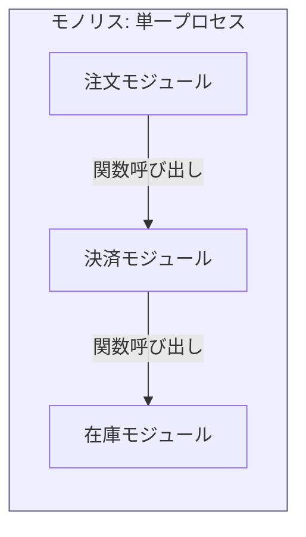
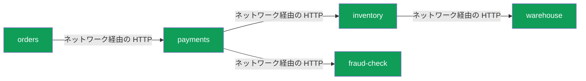
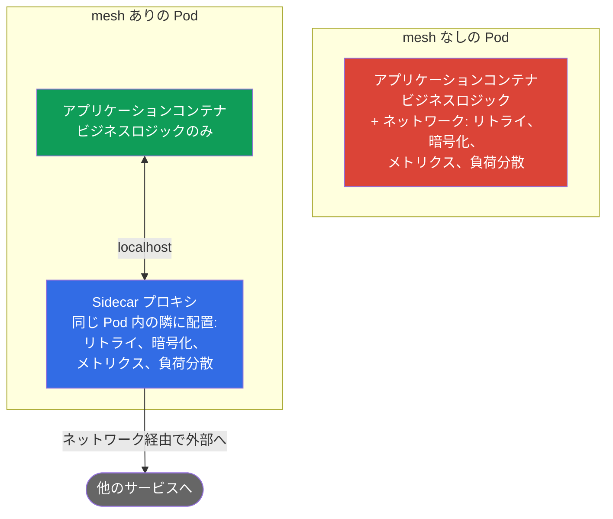
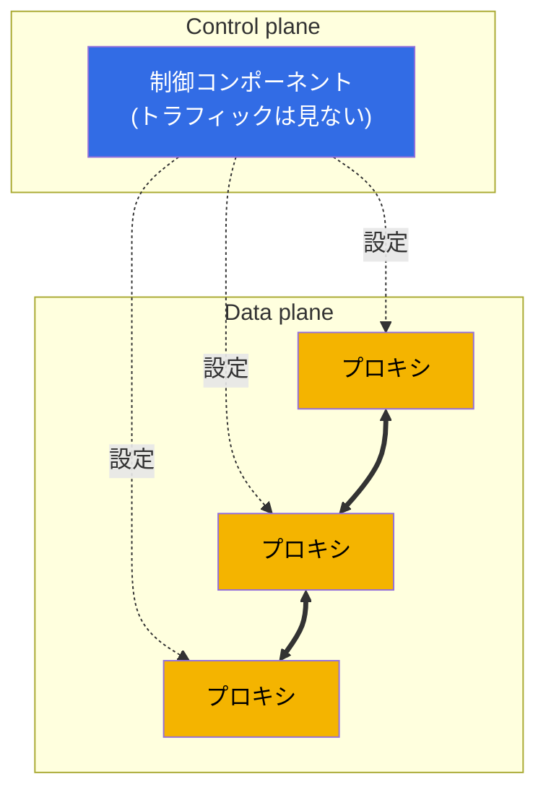
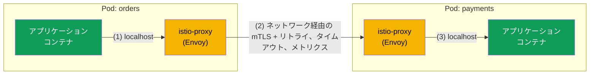
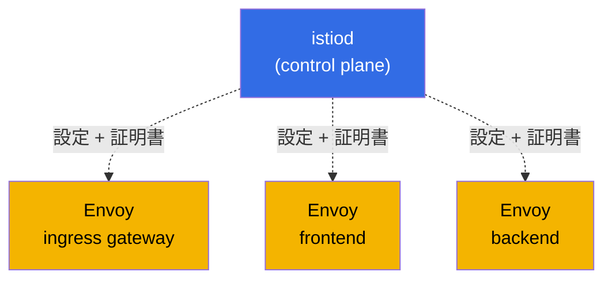
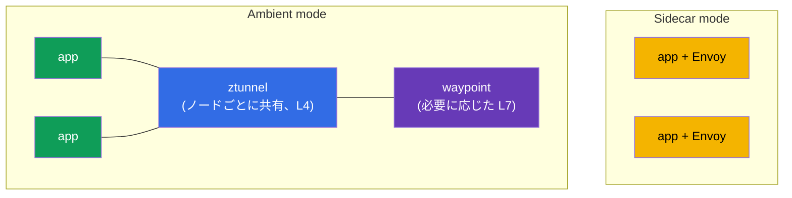

[Русская версия](ru.md) · [Eng version](en.md) · [Versión en español](es.md) · [Version française](fr.md) · [Deutsche Version](de.md) · [ქართული ვერსია](ge.md) · [繁體中文版](tw.md)

# 第1章. service mesh と Istio アーキテクチャの概要

> **この章の対象読者。** すでに CKA レベルの Kubernetes の知識があることを前提とします。CKA (Certified Kubernetes Administrator) は、Kubernetes クラスターを管理する能力を証明する、CNCF と Linux Foundation の公式認定資格です。試験の詳細は以下を参照してください。
> [Certified Kubernetes Administrator (CKA)](https://training.linuxfoundation.org/certification/certified-kubernetes-administrator-cka/)。
> この試験を受けていなくても問題ありません。Kubernetes の Pod、Deployment、Service、Ingress、kubectl を十分に扱え、kube-proxy と NetworkPolicy が何かを理解していれば十分です。ただし、service mesh と Istio はまだ未経験でしょう。この章はまさにその不足を補います。
> すでに知っていることから始め、mesh がなぜ必要なのか、それが何であり、Istio がどのように構成されるのかへと進みます。コードは書かず、概念と全体像だけを扱います。
> 実践は第2章から始まります。

## 1.1. Kubernetes がすでにできることと、足りないこと

Kubernetes にはすでにネットワークの基本要素が用意されています。それらが何を提供し、どこに限界があるかを見てみましょう。

| 課題 | 現在使っているもの | 限界 |
|--------|---------------------------|-------------|
| 名前で別のサービスを見つける | Service + kube-DNS | 接続レベル (L4) の負荷分散のみ |
| トラフィックを分散する | Service / kube-proxy | 接続ごとの round-robin、「v2 に 10%」は不可 |
| 外部からのトラフィックを受け入れる | Ingress | 入口だけで、クラスター内のトラフィックは対象外 |
| 誰が誰と通信できるかを制限する | NetworkPolicy | IP とポート (L3/L4) のみで、HTTP は考慮しない |
| Pod 間のトラフィックを暗号化する | 標準ではなし | Pod 間のトラフィックは平文で流れる |
| 失敗したリクエストを再試行し、タイムアウトを設定する | 標準ではなし | アプリケーション自身が備える必要がある |
| 誰が誰を呼び出し、どの程度の遅延かを確認する | 標準ではなし | コードを手作業で追加する必要がある |

最初の4行は CKA を取得した後のあなたの得意分野です。次に下の3行を見てください。サービス間トラフィックの暗号化、障害への耐性、observability は Kubernetes だけでは提供されません。ここから service mesh が始まります。

## 1.2. なぜこれが問題になったのか: モノリス対マイクロサービス

アプリケーションがモノリスだった頃は、その各部分の間の呼び出しのほとんどは、単一プロセス内の通常の関数呼び出しでした。ネットワークを通らず、失われることもなく、暗号化や再試行も不要でした。

同じ機能をマイクロサービスに分割すると、それらの間の呼び出しはすべてネットワークリクエストになります。そしてネットワークは信頼できません。パケットは失われ、サービスは再起動し、レイテンシは変動します。

ここにある各矢印が障害になり得るポイントです。そして、モノリスではほとんどなかった4つの課題群がすぐに現れます。

- **トラフィック管理。** 新しいバージョンの payments をユーザーの 10% にどう展開するか。HTTP ヘッダーを使ってテスターを実験版へどう送るか。
- **耐障害性。** inventory が遅い、または 503 を返す場合に何をするか。リクエストを再試行するか。タイムアウトで切断するか。一時的に問題のあるサービスを切り離すか。
- **セキュリティ。** orders が偽装された何かではなく本物の payments と通信していることをどう確認するか。このトラフィックをどう暗号化するか。fraud-check が warehouse を直接呼び出すことをどう禁止するか。
- **Observability。** リクエストが5つのサービスを通過してどこかで停止した。どこで止まったのか。サービス間の毎秒リクエスト数、エラー率、レイテンシはどの程度か。

## 1.3. これらの課題を解決する3つの方法

### 方法1. 各サービスのコードにすべてを書く

最初に思いつく選択肢は、各サービスが自らリクエストを再試行し、タイムアウトを設定し、接続を暗号化し、メトリクスを送信できるようにすることです。問題点は次のとおりです。

- ロジックを各サービスに重複して実装し、同一に保つ必要がある。
- サービスが異なる言語 (Go、Java、Python) で書かれているため、同じことを各言語で異なる方法で実装しなければならない。
- リトライポリシーを変更したら、すべてのサービスを再ビルドして再デプロイする必要がある。

### 方法2. 共通ライブラリ

次に、アプリケーション層のライブラリが登場しました（当時は Netflix Hystrix、Twitter Finagle などがありました）。耐障害性と負荷分散を組み込み可能なコードへ切り出しました。改善はされましたが、主な欠点は残りました。

- ライブラリは言語に結び付いており、実装の乱立は解消されない。
- ライブラリの更新でも、サービスを再ビルドして再デプロイする必要がある。
- ビジネスロジックの開発者も、ネットワーク耐障害性の細かな点を理解しなければならない。

### 方法3. すべてをサービスの隣のインフラストラクチャへ移す

service mesh の中心的な考え方は、ネットワークの付帯処理をすべてアプリケーションから取り出し、各サービスの隣に配置され、そのすべてのネットワークトラフィックを横取りする専用プロキシに置くことです。アプリケーションは通常の HTTP リクエストを行っていると考えますが、プロキシが目立たないようにリトライ、暗号化、メトリクス、ルーティングを追加します。

これが service mesh のアプローチです。アプリケーションコードは変更せず、すべてのネットワーク動作をインフラストラクチャレベルで宣言的に設定します。

## 1.4. service mesh とは何か

Service mesh とは、サービス間の通信、すなわちルーティング、耐障害性、セキュリティ、observability を管理する独立したインフラストラクチャ層です。そしてすべてがアプリケーションに対して透過的です。

技術的には2つの部分で構成されます。この分離は本章の最も重要な概念なので、すぐに覚えてください。

- **Data plane (データプレーン)。** 各サービスインスタンスの隣に1つずつ置かれるプロキシ群です（前節で説明した sidecar です）。実際のトラフィックを通し、接続の暗号化、リクエストの再試行、メトリクスの集計といったルールを適用するのはこれらです。
- **Control plane (コントロールプレーン)。** mesh の頭脳です。ユーザートラフィックは処理しません。あなたの設定を受け取り、最新の設定をすべてのプロキシに配布し、暗号化用の証明書を発行するのが仕事です。

プロキシ間の実線は、サービス間の実トラフィックです。点線は control plane が上からプロキシへ配布する設定です。ルールは単純です。control plane が設定し、data plane が動作します。これらが Istio で具体的に何と呼ばれるかは、少し後で説明します。

## 1.5. 現在ある service mesh

mesh の考え方は理解しました。Istio を掘り下げる前に、全体を見渡すと有益です。Istio は唯一の service mesh ではありません。市場を理解すれば、このコースで Istio が選ばれた理由も分かります。

- **Istio。** 最も人気があり機能が豊富な、CNCF のプロジェクトである mesh です。Data plane は Envoy 上に構築されています。豊富なルーティング、セキュリティ、observability、拡張性を備えます。代償は参入障壁と複雑さの高さです。
- **Linkerd。** 人気で2番目の mesh で、こちらも CNCF のプロジェクトです。独自の軽量な Rust プロキシを使用します (Envoy ではありません)。主な長所はシンプルさと低いオーバーヘッドです。短所は Istio より機能が少ないことです（ルーティングと拡張性が限定的です）。
- **Cilium Service Mesh。** eBPF を基盤とし、各 Pod にプロキシを置かずに動作でき、機能の一部を Linux カーネルへ直接移します。長所は高いパフォーマンスとネットワークとの緊密な統合です。短所は、L7 機能が依然として Envoy に依存することと、mesh 周辺のエコシステムが新しいことです。
- **Consul (HashiCorp)。** Consul 上の mesh で、Envoy を使用します。Kubernetes の外部でも統一的なツールが必要な場所（VM、複数プラットフォーム、複数データセンター）で強みを発揮します。
- **Kuma / Kong Mesh。** Envoy を基盤とする CNCF のプロジェクトで、複数ゾーンと非 Kubernetes ワークロードを単一のコントロールパネルから管理できます。
- **AWS App Mesh。** Envoy を利用する AWS のマネージド mesh です。AWS サービスとの統合は容易ですが、AWS エコシステムに縛られ、機能面では Istio に劣ります（また、徐々に重要性を失っています）。

簡単な比較:

| Mesh | Data plane | 強み | 選ばれる場面 |
|------|-----------|-----------------|----------------|
| **Istio** | Envoy (sidecar または ambient) | 最も高機能で、大きなエコシステム | 多数のサービス、トラフィックとセキュリティへの高い要件 |
| **Linkerd** | 独自の Rust プロキシ | シンプルさ、低いオーバーヘッド | 設定を最小限にした軽量な mesh が必要 |
| **Cilium** | eBPF (+ Envoy for L7) | パフォーマンス、カーネル内での動作 | すでに Cilium CNI を使用しており、速度が重要 |
| **Consul** | Envoy | Kubernetes 外部での動作、マルチプラットフォーム | ハイブリッドインフラストラクチャ、VM + Kubernetes |
| **Kuma / Kong** | Envoy | マルチゾーン、容易な管理 | 複数クラスターと非 Kubernetes ワークロード |

重要: mesh の大半 (Istio、Cilium、Consul、Kuma、App Mesh) は Envoy 上に構築されています。そのため、Istio で得たスキルは他の mesh にも多くの部分で応用できます。このコースでは、最も高機能で広く普及し、ICA 認定もある Istio を選びました。以降は Istio を詳しく見ていきます。

## 1.6. プロキシがサービスの隣に配置される仕組み (sidecar)

プロキシは物理的にどのように各サービスの隣へ配置されるのでしょうか。Kubernetes でおなじみの仕組み、すなわち Pod 内の追加コンテナを使います。これを sidecar と呼びます。

namespace に `istio-injection=enabled` ラベルが付いていると、Istio は Pod の作成時にもう1つのコンテナ、istio-proxy（あの Envoy）を自動で追加します。そのため、mesh 内では Pod は READY 列で `2/2` と表示されます。最初のコンテナはアプリケーション、2番目はプロキシです。

ここからが最も興味深い部分です。iptables ルール（Pod 起動時に特別な init コンテナが設定します）により、アプリケーションのすべての受信・送信トラフィックは Envoy を経由するよう転送されます。アプリケーションは通常どおり `http://payments:8080` にアクセスしますが、実際にはリクエストはまずローカルの Envoy に届き、そこで全ポリシーが適用されてから別の Pod の Envoy へ送られます。

1. orders アプリケーションが通常の HTTP リクエストを行うと、ローカルの Envoy へ送られる。
2. Envoy はリクエストを暗号化 (mTLS) し、ポリシー（リトライ、タイムアウト、負荷分散、メトリクス）を適用して、ネットワーク経由で payments Pod の Envoy へ送信する。
3. payments 側の Envoy がトラフィックを復号し、localhost 経由でアプリケーションに渡す。

結論: アプリケーションは mesh について何も知りません。アプリケーションにとっては、依然として単純な HTTP 呼び出しです。すべての処理は Envoy で行われます。

> **すでに知っているものとの類比。** kube-proxy はノード上で iptables を設定し、L4、すなわち接続レベルで負荷分散します。Istio は Pod 内で iptables を設定し、トラフィックを HTTP を理解する Envoy プロキシへ転送します。HTTP ヘッダー、メソッド、パス、レスポンスコードを理解できます。ここからすべての新しい機能が生まれます。

## 1.7. Istio の全体アーキテクチャ

ここで全体像を組み立てます。Istio には3つの主要な登場人物がいます。

- **istiod** - control plane です。1つのバイナリで、すべての Envoy に設定を配布し（これは歴史的には Pilot コンポーネントが担当していました）、mTLS の証明書を発行・更新し（Citadel）、マニフェストを検証します（Galley）。以前は別々のサービスでしたが、現在の Istio では1つの istiod に統合されています。
- **Envoy** - data plane です。各 Pod のプロキシ (sidecar) とゲートウェイに配置されます。
- **Gateways (ゲートウェイ)** - 同じ Envoy ですが、mesh の境界に配置されます。Ingress gateway は外部からクラスターへのトラフィックを受け入れ、egress gateway はクラスターから外部へのトラフィックを送出します。

図を過密にしないため、2つに分けます。まず、実トラフィックの経路 (data plane) です。各サービスは、アプリケーションとその隣の Envoy という2コンテナの Pod です。

リクエストの経路は直線的です。クライアント、次に ingress gateway、次に frontend サービスの Envoy、最後に backend サービスの Envoy です。mesh 内のすべてのトラフィックは mTLS で暗号化されます。

次に、istiod (control plane) がすべての Envoy に設定と証明書を供給する仕組みを個別に見ます。istiod 自身はトラフィックに触れず、プロキシの設定だけを行います。

2つの図を頭の中で結び付けてください。第1の図の矢印にはトラフィックが流れ、第2の図の istiod は事前に、これらすべての Envoy へルーティングルールと証明書を配布しています。

## 1.8. Istio ができること

Istio の機能は、4つの領域に分けると分かりやすくなります。これらはコース第1部で準備する ICA 試験のドメインでもあります。

- **トラフィック管理。** 細かなルーティング: canary リリース、重みによる分配、ヘッダーによるルーティング、トラフィックミラーリング、負荷分散、外部サービスとの連携。第5～11章です。
- **セキュリティ。** サービス間の自動 mTLS、identity (SPIFFE) による認証、認可（誰が誰とどのように通信できるか）、ユーザー JWT の検証。第12～15章です。
- **Observability。** 各リクエストのメトリクス、分散トレーシング、サービスグラフを、コードを変更せずに提供します。第16～17章です。
- **高度なシナリオと拡張性。** Rate limiting、EnvoyFilter、Lua、Wasm による独自ロジック、ambient モード、最適化。第18～22章です。

さらに横断的なトピックとして、インストールと更新（第2～4章）、troubleshooting（第23章）があります。

## 1.9. data plane の2つのモード: sidecar と ambient

歴史的に、Istio は上で説明した sidecar モデル、すなわち各 Pod に Envoy を置くモデルで動作します。これは信頼性が高く強力ですが、代償もあります。各 Pod のプロキシは CPU とメモリを消費し、data plane の更新には Pod の再起動が必要です。

そのため、sidecar を使わない ambient mode が登場しました。このモードでは、L4 トラフィックはノードごとの共有コンポーネント ztunnel が処理し、L7 機能（ルーティング、HTTP による認可）は必要に応じて専用の waypoint proxy を通して有効化されます。これによりオーバーヘッドは小さくなり、更新も簡単になります。

現時点では、両方のモードが存在することだけ覚えてください。コースの大部分は、より完全で入門にも分かりやすい従来の sidecar モデルで学びます。ambient については第21章で詳しく扱います。

## 1.10. mesh が必要な場合と不要な場合

Service mesh は無料ではありません。導入前に欠点を正直に評価してください。

- **オーバーヘッド。** 各 Pod に追加するプロキシは、わずかなレイテンシを加え、リソースを消費する。
- **複雑さ。** 理解し、デバッグできる必要がある、まったく新しい抽象化とリソースの層が追加される（これには第23章を充てています）。
- **3サービスのためではない。** 数個のサービスからなる小さなアプリケーションに mesh を使うのは、鶏を撃つのに大砲を使うようなものです。

Istio が正当化されるのは、サービスが多く、異なる言語で書かれ、セキュリティ (mTLS、Zero Trust) と observability が重要で、リリース管理 (canary、段階的なロールアウト) への要件が高い場合です。ラボではまさにこのようなシナリオを扱います。

## 1.11. CKA からの橋渡し: 既知の概念の対応付け

新しい内容を既知のものと結び付けるため、次の表を手元に置いてください。

| Kubernetes ですでに知っているもの | Istio での対応物 | 違い |
|-------------------------|----------------|---------------|
| Ingress | Gateway + VirtualService | 柔軟な L7 ルーティング: 重み、ヘッダー、ミラーリング |
| kube-proxy (L4) | Envoy sidecar (L7) | HTTP を理解する: メソッド、パス、コード、リトライ、タイムアウト |
| NetworkPolicy (L3/L4) | AuthorizationPolicy (L7) | IP とポートだけでなく、identity、HTTP メソッド、パスによるルール |
| 手動による暗号化 | 自動 mTLS | Istio が自ら証明書を発行し、Pod 間トラフィックを暗号化する |
| コードによるメトリクス | Envoy からのメトリクス | 各リクエストについて自動的に収集される |
| API アクセス用の ServiceAccount | identity (SPIFFE) としての ServiceAccount | 同じ SA がサービスの暗号学的アイデンティティになる |

## 1.12. ミニ用語集

- **Service mesh** - サービス間のトラフィックを管理するインフラストラクチャ層。
- **Data plane** - 実トラフィックを運ぶプロキシ (Envoy)。
- **Control plane** - istiod: 設定と証明書を配布し、トラフィックには触れない。
- **Envoy** - 高速な L7 プロキシであり、Istio の data plane の基盤。
- **Sidecar** - アプリケーションの隣の Pod に追加される istio-proxy (Envoy) コンテナ。
- **istiod** - 単一バイナリの control plane (Pilot、Citadel、Galley を統合)。
- **Gateway** - mesh 境界の Envoy: ingress（入口）と egress（出口）。
- **mTLS** - 相互 TLS: 両側が証明書を提示し、トラフィックを暗号化する。
- **SPIFFE** - `spiffe://cluster.local/ns/<ns>/sa/<sa>` 形式の identity 標準。
- **Ambient mode** - sidecar を使わないモード: ztunnel (L4) と waypoint (L7)。

## 1.13. この章のまとめ

- Kubernetes だけでは、サービス間トラフィックの暗号化、障害への耐性、observability は解決しません。これが service mesh の領域です。
- Mesh はネットワークの付帯処理をアプリケーションからサービスの隣のプロキシへ移し、コードを変更せずに宣言的に設定します。
- Istio は data plane（Pod とゲートウェイ内の Envoy）と control plane (istiod) で構成されます。この2つを明確に区別する必要があります。
- Sidecar は Pod に追加され、iptables によってすべてのトラフィックを横取りします。mesh 内の Pod は `2/2` と表示されます。
- Istio の機能は、トラフィック管理、セキュリティ、observability、高度なシナリオに分けられます。これらは ICA 試験のドメインです。
- data plane には、従来の sidecar と、新しい sidecar なしの ambient という2つのモードがあります。
- Istio は唯一の mesh ではありません（Linkerd、Cilium、Consul、Kuma などがあります）が、最も高機能で普及しており、代替製品の大半も Envoy を基盤としています。
- Mesh は、サービス数が多く、セキュリティ、リリース、observability への要件が高い場合に適しています。非常に小さなアプリケーションには過剰です。

## 1.14. 自己確認のための質問

1. control plane と data plane のタスクは根本的にどう異なりますか。どちらがユーザートラフィックを処理しますか。
2. mesh 内の Pod が `2/2` コンテナと表示されるのはなぜですか。2番目のコンテナは何をしますか。
3. アプリケーションがそれを知らなくても、アプリケーションのトラフィックはどのように Envoy に入りますか。
4. Istio の AuthorizationPolicy が Kubernetes の NetworkPolicy より強力なのはなぜですか。
5. service mesh を導入すべきではないのはどのような場合ですか。
6. data plane の sidecar モードと ambient モードはどのように異なりますか。
7. Istio の代替をいくつか挙げ、それぞれの違いを説明してください。なぜ多くの mesh は Envoy を基盤としているのでしょうか。

## 実践

実践は次の章から始まります。第2章では、クラスターに Istio をインストールし、sidecar injection を有効にして、デモアプリケーション Bookinfo をデプロイします。ここまでで説明したすべてを実際に確認するためです。

🧪 ラボ 01: [tasks/ica/labs/01](../../labs/01/README_JP.MD)

---
[目次](../README_JP.md) · [第2章](../02/jp.md)
