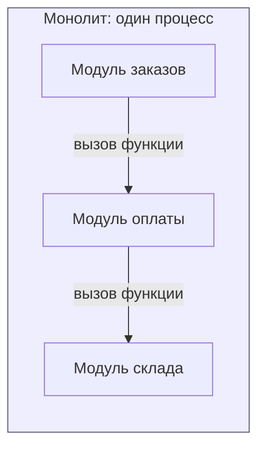
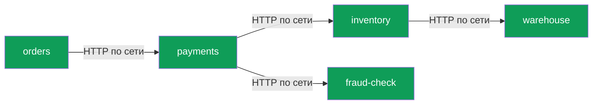
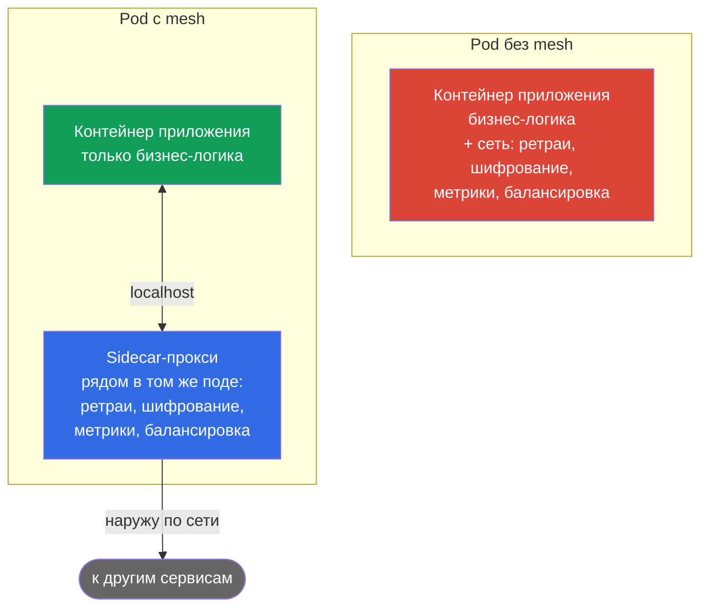
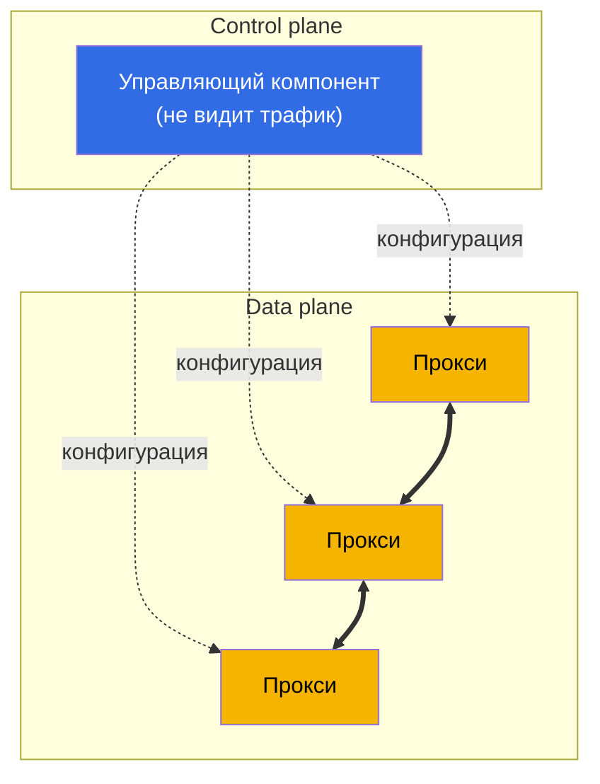
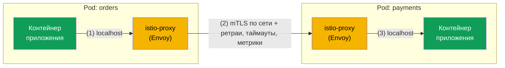
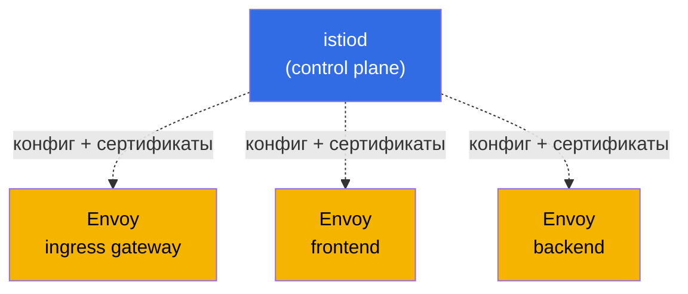
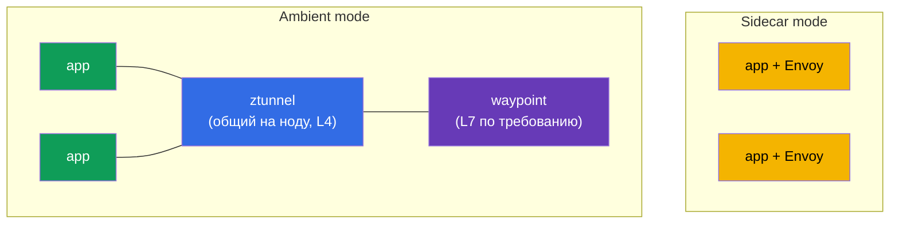

[Eng version](en.md) · [Versión en español](es.md)

# Глава 1. Введение в service mesh и архитектуру Istio

> **Для кого эта глава.** Мы рассчитываем, что вы уже знакомы с Kubernetes на уровне
> CKA. CKA (Certified Kubernetes Administrator) - это официальная сертификация от
> CNCF и Linux Foundation, которая подтверждает умение администрировать
> Kubernetes-кластер. Подробнее про экзамен:
> [Certified Kubernetes Administrator (CKA)](https://training.linuxfoundation.org/certification/certified-kubernetes-administrator-cka/).
> Если вы этот экзамен не сдавали - ничего страшного, достаточно уверенно работать с
> Kubernetes: Pod, Deployment, Service, Ingress, kubectl, понимать, что такое
> kube-proxy и NetworkPolicy. Но со service mesh и Istio вы пока не сталкивались. Эта
> глава закрывает именно этот пробел.
> Мы пойдём от того, что вы уже знаете, к тому, зачем нужен mesh, что это такое и как
> устроен Istio. Кода писать не будем, только разберём понятия и общую картину.
> Практика начнётся в главе 2.

## 1.1. Что Kubernetes уже умеет, а чего ему не хватает

В Kubernetes у вас уже есть готовые сетевые примитивы. Давайте посмотрим, что они
дают и где проходит их граница.

| Задача | Что вы используете сейчас | Где граница |
|--------|---------------------------|-------------|
| Найти другой сервис по имени | Service + kube-DNS | Балансировка только на уровне соединений (L4) |
| Распределить трафик | Service / kube-proxy | Round-robin по соединениям, нельзя "10% на v2" |
| Впустить трафик снаружи | Ingress | Только на входе, ничего про трафик внутри кластера |
| Ограничить, кто с кем общается | NetworkPolicy | Только по IP и порту (L3/L4), без учёта HTTP |
| Зашифровать трафик между подами | нет из коробки | Трафик между подами идёт открытым текстом |
| Повторить упавший запрос, поставить таймаут | нет из коробки | Это должно уметь само приложение |
| Увидеть, кто кому звонит и с какой задержкой | нет из коробки | Нужно дописывать код вручную |

Первые четыре строки - ваша зона комфорта после CKA. А теперь посмотрите на нижние
три. Шифрование трафика между сервисами, устойчивость к сбоям и observability
Kubernetes из коробки не даёт. Вот тут и начинается service mesh.

## 1.2. Почему это стало проблемой: монолит против микросервисов

Когда приложение было монолитом, почти все вызовы между его частями были обычными
вызовами функций внутри одного процесса. Они не ходили по сети, не терялись, их не
надо было шифровать или повторять.

Когда тот же функционал разбивают на микросервисы, каждый вызов между ними становится
сетевым запросом. А сеть ненадёжна: пакеты теряются, сервисы перезапускаются,
задержки скачут.

Каждая стрелка здесь - точка возможного отказа. И сразу появляется четыре группы
задач, которых в монолите почти не было.

- **Управление трафиком.** Как выкатить новую версию payments на 10% пользователей?
  Как отправить тестировщиков на экспериментальную версию по HTTP-заголовку?
- **Устойчивость.** Что делать, если inventory тормозит или отдаёт 503? Повторить
  запрос? Оборвать по таймауту? Временно отключить больной сервис?
- **Безопасность.** Как убедиться, что orders общается с настоящим payments, а не с
  чем-то подставным? Как зашифровать этот трафик? Как запретить fraud-check напрямую
  дёргать warehouse?
- **Observability.** Запрос прошёл через пять сервисов и где-то завис. В каком именно?
  Сколько запросов в секунду между сервисами, какая доля ошибок и задержка?

## 1.3. Три способа решить эти задачи

### Способ 1. Писать всё в коде каждого сервиса

Первый очевидный вариант: пусть каждый сервис сам умеет повторять запросы, ставить
таймауты, шифровать соединения и слать метрики. Проблемы:

- Логику надо дублировать в каждом сервисе и держать одинаковой.
- Сервисы на разных языках (Go, Java, Python) - значит, писать одно и то же на каждом
  языке по-своему.
- Поменяли политику ретраев - надо пересобрать и передеплоить все сервисы.

### Способ 2. Общие библиотеки

Дальше появились библиотеки уровня приложения (в своё время это были Netflix Hystrix,
Twitter Finagle и похожие). Устойчивость и балансировку вынесли в подключаемый код.
Стало лучше, но главные минусы остались:

- Библиотека привязана к языку, зоопарк реализаций никуда не делся.
- Обновление библиотеки всё равно требует пересборки и передеплоя сервиса.
- Разработчику бизнес-логики приходится разбираться в тонкостях сетевой устойчивости.

### Способ 3. Вынести всё в инфраструктуру, рядом с сервисом

Главная идея service mesh: забрать всю сетевую обвязку из приложения и положить её в
отдельный прокси, который стоит рядом с каждым сервисом и перехватывает весь его
сетевой трафик. Приложение думает, что делает обычный HTTP-запрос, а прокси незаметно
добавляет ретраи, шифрование, метрики и маршрутизацию.

Это и есть подход service mesh: код приложения не меняется, а всё сетевое поведение
настраивается декларативно на уровне инфраструктуры.

## 1.4. Что такое service mesh

Service mesh - это отдельный слой инфраструктуры, который управляет общением между
сервисами: маршрутизацией, устойчивостью, безопасностью и observability. И всё это
прозрачно для приложения.

Технически он состоит из двух частей. Это разделение - главное понятие главы, запомните
его сразу.

- **Data plane (плоскость данных).** Набор прокси, по одному рядом с каждым
  экземпляром сервиса (те самые sidecar из предыдущего раздела). Именно они пропускают
  через себя реальный трафик и применяют правила: шифруют соединения, повторяют
  запросы, считают метрики.
- **Control plane (плоскость управления).** Это мозг mesh. Он не обрабатывает
  пользовательский трафик. Его работа - взять ваши настройки и раздать всем прокси
  актуальную конфигурацию, а также выдавать им сертификаты для шифрования.

Сплошные линии между прокси - это боевой трафик между сервисами. Пунктирные - это
конфигурация, которую control plane раздаёт прокси сверху. Правило простое: control
plane настраивает, data plane работает. Как эти части называются конкретно в Istio -
разберём чуть дальше.

## 1.5. Какие service mesh есть сейчас

Идею меша мы разобрали. Прежде чем углубляться в Istio, полезно оглядеться: Istio не
единственный service mesh. Понимание рынка поможет увидеть, почему для курса выбран
именно он.

- **Istio.** Самый популярный и функциональный mesh, проекты CNCF. Data plane на
  Envoy. Богатая маршрутизация, безопасность, observability и расширяемость. Цена -
  выше порог входа и сложность.
- **Linkerd.** Второй по популярности mesh, тоже CNCF. Использует собственный лёгкий
  прокси на Rust (не Envoy). Главный плюс - простота и низкие накладные расходы.
  Минус - возможностей меньше, чем у Istio (беднее маршрутизация и расширяемость).
- **Cilium Service Mesh.** Строится на eBPF и умеет работать без прокси в каждом поде,
  часть функций уносит прямо в ядро Linux. Плюс - высокая производительность и тесная
  интеграция с сетью. Минус - L7-функции всё равно опираются на Envoy, экосистема
  вокруг mesh моложе.
- **Consul (HashiCorp).** Mesh поверх Consul, использует Envoy. Силён там, где нужен
  единый инструмент вне Kubernetes (VM, несколько платформ, мульти-датацентр).
- **Kuma / Kong Mesh.** Проект CNCF на базе Envoy, умеет управлять несколькими зонами
  и не-Kubernetes нагрузками из одной панели.
- **AWS App Mesh.** Управляемый mesh от AWS на Envoy. Прост в интеграции с сервисами
  AWS, но привязан к экосистеме AWS и по возможностям уступает Istio (и постепенно
  теряет актуальность).

Краткое сравнение:

| Mesh | Data plane | Сильная сторона | Когда выбирают |
|------|-----------|-----------------|----------------|
| **Istio** | Envoy (sidecar или ambient) | Самый функциональный, большая экосистема | Много сервисов, высокие требования к трафику и безопасности |
| **Linkerd** | свой Rust-прокси | Простота, малый оверхед | Нужен лёгкий mesh с минимумом настроек |
| **Cilium** | eBPF (+ Envoy для L7) | Производительность, работа в ядре | Уже используете Cilium CNI, важна скорость |
| **Consul** | Envoy | Работа вне Kubernetes, мульти-платформа | Гибридная инфраструктура, VM + Kubernetes |
| **Kuma / Kong** | Envoy | Мульти-зона, простое управление | Несколько кластеров и не-Kubernetes нагрузки |

Важно: большинство мешей (Istio, Cilium, Consul, Kuma, App Mesh) построены на Envoy.
Поэтому навыки, полученные на Istio, во многом переносятся и на другие меши. Для курса
выбран Istio: он самый функциональный и распространённый, и под него есть сертификация
ICA. Дальше углубляемся именно в него.

## 1.6. Как прокси оказывается рядом с сервисом (sidecar)

Как прокси физически встаёт рядом с каждым сервисом? Через знакомый вам механизм
Kubernetes - дополнительный контейнер в поде. Его называют sidecar.

Когда на namespace стоит метка `istio-injection=enabled`, Istio при создании пода сам
добавляет в него ещё один контейнер, istio-proxy (тот самый Envoy). Поэтому в mesh
поды показывают `2/2` в колонке READY: первый контейнер - ваше приложение, второй -
прокси.

Дальше самое интересное. С помощью правил iptables (их настраивает специальный
init-контейнер при старте пода) весь входящий и исходящий трафик приложения
заворачивается через Envoy. Приложение обращается на `http://payments:8080`, как
обычно, но на деле запрос сначала попадает в локальный Envoy, тот применяет все
политики и только потом отправляет запрос в Envoy другого пода.

1. Приложение orders делает обычный HTTP-запрос, он уходит в локальный Envoy.
2. Envoy шифрует запрос (mTLS), применяет политики (ретраи, таймауты, балансировку,
   метрики) и отправляет его в Envoy пода payments по сети.
3. Envoy на стороне payments расшифровывает трафик и отдаёт его приложению по
   localhost.

Вывод: приложение ничего не знает про mesh. Для него это по-прежнему простой
HTTP-вызов. Вся работа происходит в Envoy.

> **Аналогия с тем, что вы знаете.** kube-proxy настраивает iptables на ноде и
> балансирует на уровне L4, то есть по соединениям. Istio настраивает iptables внутри
> пода и заворачивает трафик в прокси Envoy, который понимает HTTP: заголовки, методы,
> пути, коды ответов. Отсюда и все новые возможности.

## 1.7. Архитектура Istio целиком

Теперь соберём общую картину. У Istio три главных действующих лица.

- **istiod** - это control plane. Один бинарник, который раздаёт конфигурацию всем
  Envoy (за это исторически отвечал компонент Pilot), выдаёт и обновляет сертификаты
  для mTLS (Citadel) и проверяет ваши манифесты (Galley). Раньше это были отдельные
  сервисы, в современном Istio их объединили в один istiod.
- **Envoy** - это data plane. Прокси в каждом поде (sidecar) и в шлюзах.
- **Gateways (шлюзы)** - те же Envoy, но стоящие на границе mesh. Ingress gateway
  впускает трафик снаружи в кластер, egress gateway выпускает трафик из кластера
  наружу.

Чтобы не перегружать картинку, разделим её на две. Сначала - путь боевого трафика
(data plane). Каждый сервис это под из двух контейнеров: приложение и Envoy рядом.

Путь запроса линейный: клиент, потом ingress gateway, потом Envoy сервиса frontend,
потом Envoy сервиса backend. Весь трафик внутри mesh шифруется по mTLS.

Теперь отдельно - как istiod (control plane) снабжает все Envoy конфигурацией и
сертификатами. Он сам трафик не трогает, только настраивает прокси.

Соедините две картинки в голове: по стрелкам первой диаграммы бежит трафик, а istiod
из второй заранее раздал всем этим Envoy правила маршрутизации и сертификаты.

## 1.8. Что умеет Istio

Всё, что делает Istio, удобно разложить по четырём направлениям. Это же и есть домены
экзамена ICA, к которому мы готовимся в Части 1 курса.

- **Управление трафиком.** Тонкая маршрутизация: canary-релизы, распределение по весам,
  маршрутизация по заголовкам, зеркалирование трафика, балансировка, работа с внешними
  сервисами. Это главы 5-11.
- **Безопасность.** Автоматический mTLS между сервисами, аутентификация по identity
  (SPIFFE), авторизация (кто с кем и как может общаться), проверка JWT пользователей.
  Это главы 12-15.
- **Observability.** Метрики каждого запроса, распределённый трейсинг, граф сервисов,
  и всё без изменения кода. Это главы 16-17.
- **Продвинутые сценарии и расширяемость.** Rate limiting, своя логика через
  EnvoyFilter, Lua и Wasm, ambient-режим, оптимизация. Это главы 18-22.

Плюс сквозные темы: установка и обновление (главы 2-4) и troubleshooting (глава 23).

## 1.9. Два режима data plane: sidecar и ambient

Исторически Istio работает по sidecar-модели, которую мы разобрали выше: Envoy в
каждом поде. Это надёжно и мощно, но у модели есть цена. Прокси в каждом поде ест CPU
и память, а обновление data plane требует перезапуска подов.

Поэтому появился ambient mode, режим без сайдкаров. В нём L4-трафик обслуживает общий
на ноду компонент ztunnel, а L7-функции (маршрутизация, авторизация по HTTP)
включаются по мере надобности через отдельный waypoint proxy. Так накладные расходы
меньше, а обновления проще.

Пока просто запомните, что оба режима существуют. Основную часть курса мы изучаем на
классической sidecar-модели, она полнее и понятнее для старта. Ambient подробно
разберём в главе 21.

## 1.10. Когда mesh нужен, а когда нет

Service mesh - это не бесплатно. Прежде чем внедрять, честно взвесьте минусы.

- **Накладные расходы.** Лишний прокси в каждом поде добавляет немного задержки и
  ест ресурсы.
- **Сложность.** Появляется целый новый слой абстракций и ресурсов, который надо
  понимать и уметь отлаживать (этому посвящена глава 23).
- **Не для трёх сервисов.** Для маленького приложения из пары сервисов mesh - это
  стрельба из пушки по воробьям.

Istio оправдан, когда сервисов много, они на разных языках, важны безопасность (mTLS,
Zero Trust) и observability, а к управлению релизами (canary, постепенные выкатки)
высокие требования. Как раз такие сценарии мы и отрабатываем в лабах.

## 1.11. Мостик от CKA: сопоставление знакомых понятий

Чтобы новое ложилось на уже известное, держите под рукой эту таблицу.

| Вы знаете из Kubernetes | Аналог в Istio | В чём разница |
|-------------------------|----------------|---------------|
| Ingress | Gateway + VirtualService | Гибкая L7-маршрутизация: веса, заголовки, зеркалирование |
| kube-proxy (L4) | Envoy sidecar (L7) | Понимает HTTP: методы, пути, коды, ретраи, таймауты |
| NetworkPolicy (L3/L4) | AuthorizationPolicy (L7) | Правила по identity, HTTP-методу и пути, а не только IP и порт |
| Шифрование вручную | Автоматический mTLS | Istio сам выдаёт сертификаты и шифрует трафик между подами |
| Метрики через код | Метрики из Envoy | Собираются автоматически для каждого запроса |
| ServiceAccount для доступа к API | ServiceAccount как identity (SPIFFE) | Тот же SA становится криптографической личностью сервиса |

## 1.12. Мини-глоссарий

- **Service mesh** - слой инфраструктуры для управления трафиком между сервисами.
- **Data plane** - прокси (Envoy), которые несут реальный трафик.
- **Control plane** - istiod: раздаёт конфигурацию и сертификаты, трафик не трогает.
- **Envoy** - быстрый L7-прокси, основа data plane Istio.
- **Sidecar** - контейнер istio-proxy (Envoy), который добавляется в под рядом с
  приложением.
- **istiod** - единый бинарник control plane (Pilot, Citadel, Galley в одном).
- **Gateway** - Envoy на границе mesh: ingress (вход) и egress (выход).
- **mTLS** - взаимный TLS: обе стороны предъявляют сертификаты, трафик шифруется.
- **SPIFFE** - стандарт identity вида `spiffe://cluster.local/ns/<ns>/sa/<sa>`.
- **Ambient mode** - режим без сайдкаров: ztunnel (L4) и waypoint (L7).

## 1.13. Итоги главы

- Kubernetes из коробки не решает шифрование трафика между сервисами, устойчивость к
  сбоям и observability. Это и есть ниша service mesh.
- Mesh выносит сетевую обвязку из приложения в прокси рядом с сервисом и настраивается
  декларативно, без изменения кода.
- Istio состоит из data plane (Envoy в подах и шлюзах) и control plane (istiod). Их
  надо чётко различать.
- Sidecar добавляется в под и через iptables перехватывает весь трафик. Поды в mesh
  показывают `2/2`.
- Возможности Istio делятся на управление трафиком, безопасность, observability и
  продвинутые сценарии. Это домены экзамена ICA.
- Есть два режима data plane: классический sidecar и новый ambient без сайдкаров.
- Istio не единственный mesh (есть Linkerd, Cilium, Consul, Kuma), но он самый
  функциональный и распространённый, и большинство альтернатив тоже на Envoy.
- Mesh оправдан при большом числе сервисов и высоких требованиях к безопасности,
  релизам и observability. Для крошечных приложений он избыточен.

## 1.14. Вопросы для самопроверки

1. Чем принципиально различаются задачи control plane и data plane? Кто из них
   обрабатывает пользовательский трафик?
2. Почему поды в mesh показывают `2/2` контейнера? Что делает второй контейнер?
3. Как трафик приложения попадает в Envoy, если приложение об этом не знает?
4. Чем AuthorizationPolicy в Istio мощнее, чем NetworkPolicy в Kubernetes?
5. В каких случаях service mesh внедрять не стоит?
6. Чем отличается sidecar-режим от ambient-режима data plane?
7. Назовите пару альтернатив Istio и чем они отличаются. Почему многие меши построены
   на Envoy?

## Практика

Практика начинается со следующей главы. В главе 2 вы установите Istio в кластер,
включите sidecar injection и развернёте демо-приложение Bookinfo, чтобы увидеть всё
описанное выше вживую.

🧪 Лаба 01: [tasks/ica/labs/01](../../labs/01/README_RU.MD)

---
[Оглавление](../README.md) · [Глава 2](../02/ru.md)
