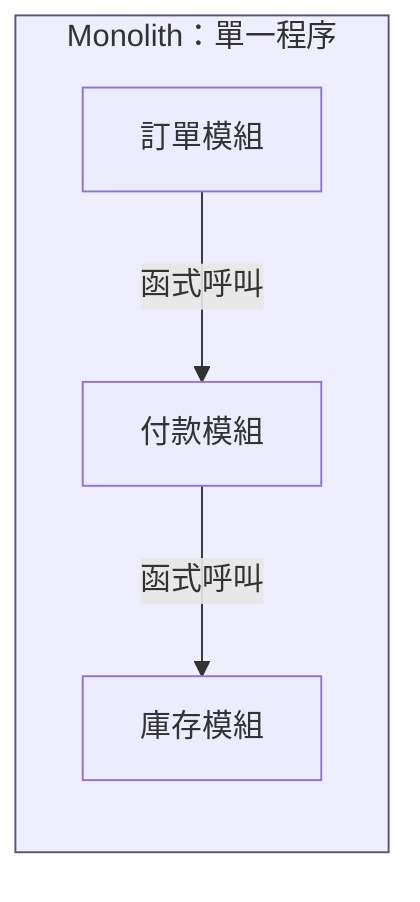
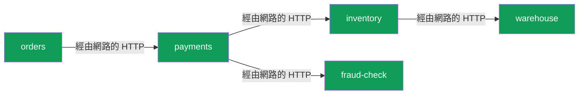
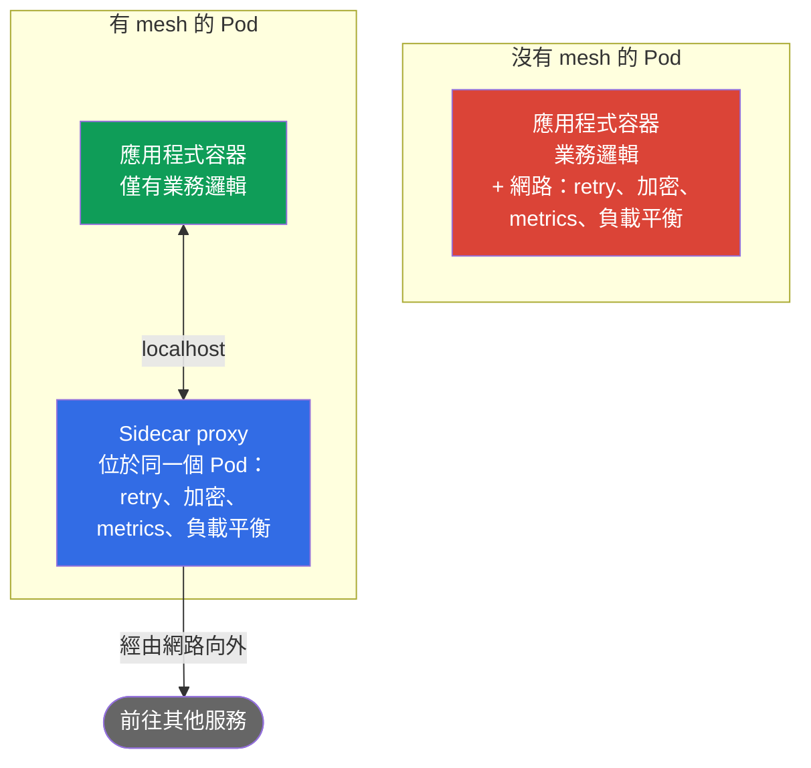
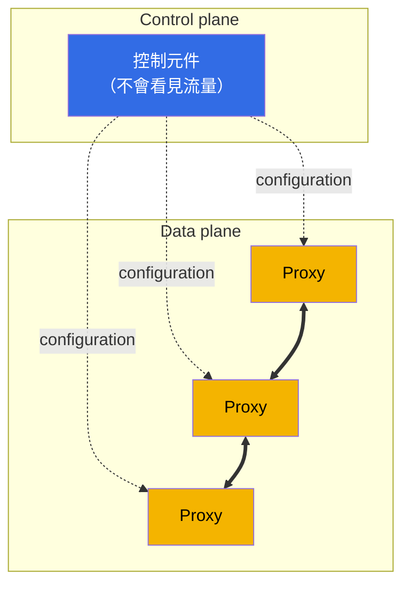
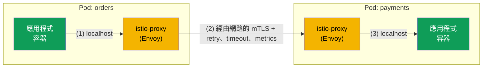
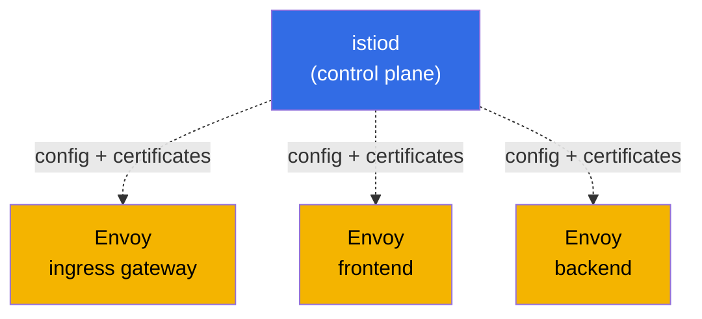
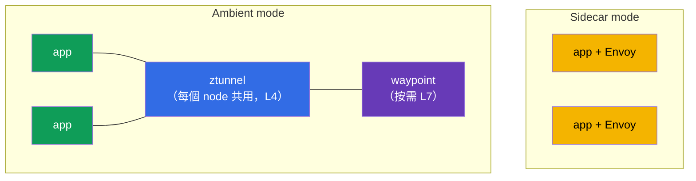

[Русская версия](ru.md) · [Eng version](en.md) · [Versión en español](es.md) · [Version française](fr.md) · [Deutsche Version](de.md) · [ქართული ვერსია](ge.md) · [日本語版](jp.md)

# 第 1 章：service mesh 與 Istio 架構簡介

> **本章適合誰閱讀。** 我們假設您已具備 CKA 層級的 Kubernetes 知識。CKA（Certified Kubernetes Administrator）是 CNCF 與 Linux Foundation 的官方認證，用以證明您具備管理 Kubernetes 叢集的能力。考試詳情請見：[Certified Kubernetes Administrator (CKA)](https://training.linuxfoundation.org/certification/certified-kubernetes-administrator-cka/)。即使您尚未參加此考試也沒有關係；只要能熟練使用 Kubernetes 的 Pod、Deployment、Service、Ingress、kubectl，並理解 kube-proxy 與 NetworkPolicy 即可。不過，您可能尚未接觸過 service mesh 與 Istio。本章正是要補足這個缺口。
> 我們會從您已知的內容出發，說明為何需要 mesh、它是什麼，以及 Istio 如何運作。本章不會撰寫程式碼，只會釐清概念與整體圖像。實作將從第 2 章開始。

## 1.1. Kubernetes 已經能做什麼，又缺少什麼

Kubernetes 已提供現成的網路原語。讓我們看看它們能提供什麼，以及其界限在哪裡。

| 工作 | 目前使用的工具 | 界限在哪裡 |
|--------|---------------------------|-------------|
| 依名稱尋找其他服務 | Service + kube-DNS | 僅在連線層級（L4）進行負載平衡 |
| 分配流量 | Service / kube-proxy | 依連線 round-robin，無法做到「10% 流向 v2」 |
| 讓外部流量進入 | Ingress | 僅處理入口流量，無法處理叢集內部流量 |
| 限制哪些服務能互相通訊 | NetworkPolicy | 僅依 IP 與連接埠（L3/L4），不考量 HTTP |
| 加密 Pod 之間的流量 | 預設沒有 | Pod 間流量以明文傳送 |
| 重試失敗的請求、設定 timeout | 預設沒有 | 應用程式本身必須具備此能力 |
| 了解誰呼叫誰，以及延遲為何 | 預設沒有 | 必須手動補寫程式碼 |

前四列是通過 CKA 後您熟悉的範圍。現在看看底下三列。Kubernetes 預設不提供服務間流量加密、故障韌性與 observability。這正是 service mesh 開始發揮作用的地方。

## 1.2. 為何這成了問題：monolith 與 microservices

當應用程式還是 monolith 時，其各部分之間幾乎都是在同一個程序內進行一般函式呼叫。它們不會經過網路、不會遺失，也無須加密或重試。

將相同功能拆分為 microservices 後，服務之間的每次呼叫都會成為網路請求。而網路並不可靠：封包可能遺失、服務可能重新啟動，延遲也會波動。

這裡的每一條箭頭都是可能的故障點。隨即會出現四組在 monolith 中幾乎不存在的問題。

- **流量管理。** 如何將新版 payments 發布給 10% 的使用者？如何依 HTTP header 將測試人員導向實驗版本？
- **韌性。** 若 inventory 變慢或回傳 503，該怎麼辦？重試請求？因 timeout 中斷？暫時停用有問題的服務？
- **安全性。** 如何確認 orders 正在與真正的 payments 通訊，而非冒充的服務？如何加密此流量？如何禁止 fraud-check 直接呼叫 warehouse？
- **Observability。** 一個請求經過五個服務後在某處卡住。究竟卡在哪裡？服務間每秒有多少請求、錯誤率與延遲是多少？

## 1.3. 解決這些問題的三種方法

### 方法 1：在每個服務的程式碼中實作一切

第一個顯而易見的選項是：讓每個服務自行具備重試請求、設定 timeout、加密連線與傳送 metrics 的能力。問題如下：

- 必須在每個服務中重複實作該邏輯，並保持一致。
- 服務使用不同語言（Go、Java、Python），表示要在每種語言中以不同方式重寫相同內容。
- 若變更 retry 政策，必須重新建置並重新部署所有服務。

### 方法 2：共用函式庫

接著出現了應用程式層級的函式庫（當時有 Netflix Hystrix、Twitter Finagle 與類似工具）。韌性與負載平衡被移至可引入的程式碼中。情況改善了，但主要缺點仍在：

- 函式庫與語言綁定，實作生態的雜亂並未消失。
- 更新函式庫仍需要重新建置與重新部署服務。
- 開發業務邏輯的工程師必須理解網路韌性的細節。

### 方法 3：將一切移至基礎設施，放在服務旁邊

service mesh 的核心理念是：從應用程式中取走所有網路周邊處理，放進位於每個服務旁的獨立 proxy；它會攔截服務的所有網路流量。應用程式以為自己正在進行普通 HTTP 請求，但 proxy 會無形地加入 retry、加密、metrics 與路由。

這就是 service mesh 方法：應用程式碼無須修改，所有網路行為都在基礎設施層以宣告式方式設定。

## 1.4. 什麼是 service mesh

service mesh 是管理服務間通訊的獨立基礎設施層：路由、韌性、安全性與 observability。這一切都對應用程式透明。

技術上，它由兩部分組成。這個區分是本章最重要的概念，請立刻記住。

- **Data plane（資料平面）。** 一組 proxy，每個服務執行個體旁各有一個（即前一節所述的 sidecar）。它們實際傳送流量並套用規則：加密連線、重試請求、計算 metrics。
- **Control plane（控制平面）。** 這是 mesh 的大腦。它不處理使用者流量。它的工作是取得您的設定、將最新 configuration 發送給所有 proxy，並為它們簽發用於加密的 certificates。

proxy 之間的實線代表服務間的實際流量。虛線則代表 control plane 從上方發給 proxy 的 configuration。規則很簡單：control plane 負責設定，data plane 負責運作。稍後會說明這些部分在 Istio 中的具體名稱。

## 1.5. 現在有哪些 service mesh

我們已經理解 mesh 的概念。在深入 Istio 前，先環顧一下是有幫助的：Istio 並非唯一的 service mesh。了解市場有助於理解為何課程選擇它。

- **Istio。** 最流行、功能最完整的 mesh，也是 CNCF 專案。Data plane 使用 Envoy。具備豐富的路由、安全性、observability 與可擴充性。代價是較高的學習門檻與複雜度。
- **Linkerd。** 第二受歡迎的 mesh，同樣屬於 CNCF。使用自行開發的輕量 Rust proxy（非 Envoy）。主要優點是簡單且開銷低。缺點是功能少於 Istio（路由與可擴充性較弱）。
- **Cilium Service Mesh。** 建構於 eBPF，可不在每個 Pod 中部署 proxy，並將部分功能直接移入 Linux kernel。優點是高效能及與網路的緊密整合。缺點是 L7 功能仍依賴 Envoy，且 mesh 周邊生態較新。
- **Consul (HashiCorp)。** 建構於 Consul 之上的 mesh，使用 Envoy。在需要 Kubernetes 以外的統一工具時很強大（VM、多種平台、多資料中心）。
- **Kuma / Kong Mesh。** 基於 Envoy 的 CNCF 專案，能從單一管理介面管理多個 zone 與非 Kubernetes workload。
- **AWS App Mesh。** AWS 提供、基於 Envoy 的 managed mesh。它易於和 AWS services 整合，但綁定 AWS 生態系，功能也不如 Istio（且正逐漸失去重要性）。

簡要比較：

| Mesh | Data plane | 強項 | 適用時機 |
|------|-----------|-----------------|----------------|
| **Istio** | Envoy（sidecar 或 ambient） | 功能最完整、生態系龐大 | 服務眾多，且對流量與安全性要求高 |
| **Linkerd** | 自有 Rust proxy | 簡單、overhead 小 | 需要設定最少的輕量 mesh |
| **Cilium** | eBPF（L7 使用 + Envoy） | 效能、在 kernel 中運作 | 已使用 Cilium CNI，且重視速度 |
| **Consul** | Envoy | Kubernetes 外部支援、多平台 | hybrid infrastructure、VM + Kubernetes |
| **Kuma / Kong** | Envoy | 多 zone、管理簡易 | 多個 cluster 與非 Kubernetes workload |

重要的是：大多數 mesh（Istio、Cilium、Consul、Kuma、App Mesh）都建構在 Envoy 上。因此，在 Istio 學到的技能在很大程度上也能遷移至其他 mesh。課程選擇 Istio，因為它最完整也最普及，並且有 ICA 認證。接下來我們將深入探討它。

## 1.6. proxy 如何位於服務旁邊（sidecar）

proxy 如何實際放到每個服務旁？透過您熟悉的 Kubernetes 機制：在 Pod 中加入額外容器。這稱為 sidecar。

當 namespace 帶有 `istio-injection=enabled` label 時，Istio 會在建立 Pod 時自動新增另一個容器 istio-proxy（即 Envoy）。因此，mesh 中的 Pod 在 READY 欄位顯示 `2/2`：第一個容器是您的應用程式，第二個是 proxy。

接著是最有趣的部分。透過 iptables rules（由 Pod 啟動時的專用 init-container 設定），應用程式的所有 ingress 與 egress 流量都會被導向 Envoy。應用程式如常呼叫 `http://payments:8080`，但實際上請求會先進入本機 Envoy；它套用所有 policies 後，才將請求傳送至另一個 Pod 的 Envoy。

1. orders 應用程式進行一般 HTTP 請求，該請求進入本機 Envoy。
2. Envoy 加密請求（mTLS）、套用 policies（retry、timeout、負載平衡、metrics），並經由網路將它傳送至 payments Pod 的 Envoy。
3. payments 端的 Envoy 解密流量，並透過 localhost 將它交給應用程式。

結論：應用程式完全不知道 mesh 的存在。對它來說，這依然是單純的 HTTP 呼叫。所有工作都在 Envoy 中進行。

> **與您已知內容的類比。** kube-proxy 在 node 上設定 iptables，並在 L4、亦即連線層級執行負載平衡。Istio 在 Pod 內設定 iptables，並將流量導入能理解 HTTP 的 Envoy proxy：headers、methods、paths 與 response codes。這正是所有新功能的來源。

## 1.7. 完整的 Istio 架構

現在讓我們拼出全貌。Istio 有三個主要角色。

- **istiod** 是 control plane。這是一個 binary，向所有 Envoy 發送 configuration（歷來由 Pilot 元件負責）、為 mTLS 簽發與更新 certificates（Citadel），並驗證您的 manifests（Galley）。過去這些是獨立服務，現代 Istio 將它們合併為單一 istiod。
- **Envoy** 是 data plane。它是每個 Pod（sidecar）及 gateway 中的 proxy。
- **Gateways（閘道）。** 也是 Envoy，但位於 mesh 邊界。Ingress gateway 讓外部流量進入 cluster，egress gateway 將流量從 cluster 向外送出。

為避免圖示過於複雜，我們將其分為兩張。首先是實際流量（data plane）的路徑。每個服務都是由兩個容器組成的 Pod：應用程式與旁邊的 Envoy。

請求路徑是線性的：client，接著是 ingress gateway，然後是 frontend service 的 Envoy，最後是 backend service 的 Envoy。mesh 內的所有流量均以 mTLS 加密。

現在單獨看看 istiod（control plane）如何向所有 Envoy 提供 configuration 與 certificates。它本身不處理流量，只設定 proxy。

請在腦中將這兩張圖連起來：流量沿第一張圖的箭頭流動，而第二張圖中的 istiod 已事先向所有 Envoy 發送路由規則與 certificates。

## 1.8. Istio 能做什麼

Istio 的能力可方便地分為四個方向。這也正是我們在課程第 1 部分準備的 ICA exam domains。

- **流量管理。** 精細路由：canary releases、依權重分配、依 headers 路由、traffic mirroring、負載平衡，以及與外部 services 互動。詳見第 5–11 章。
- **安全性。** 服務間自動 mTLS、基於 identity（SPIFFE）的 authentication、authorization（誰能以何種方式與誰通訊），以及驗證使用者 JWT。詳見第 12–15 章。
- **Observability。** 每個請求的 metrics、distributed tracing、service graph，且全都無須修改程式碼。詳見第 16–17 章。
- **進階情境與可擴充性。** Rate limiting、透過 EnvoyFilter 的自訂邏輯、Lua 與 Wasm、ambient mode、最佳化。詳見第 18–22 章。

另有貫穿性的主題：安裝與更新（第 2–4 章）及 troubleshooting（第 23 章）。

## 1.9. 兩種 data plane 模式：sidecar 與 ambient

從歷史上看，Istio 透過前述的 sidecar model 運作：每個 Pod 中都有 Envoy。這可靠且強大，但也有代價。每個 Pod 中的 proxy 都會消耗 CPU 與 memory，且更新 data plane 需要重新啟動 Pod。

因此出現了 ambient mode，也就是沒有 sidecar 的模式。在這個模式中，L4 流量由每個 node 共用的 ztunnel 元件處理，而 L7 功能（HTTP 路由、authorization）則在需要時透過獨立的 waypoint proxy 啟用。如此 overhead 較低，更新也更容易。

目前只要記住這兩種模式都存在即可。課程主要部分將使用經典 sidecar model 學習；它更完整，也更容易入門。我們會在第 21 章詳細探討 ambient。

## 1.10. 何時需要 mesh，何時不需要

Service mesh 並非免費。導入前請誠實衡量缺點。

- **Overhead。** 每個 Pod 中額外的 proxy 會增加少量延遲並消耗 resources。
- **複雜性。** 會多出一整個新的 abstractions 與 resources 層，需要理解並能夠除錯（第 23 章專門說明此主題）。
- **不適合三個服務。** 對只有幾個服務的小型應用程式而言，mesh 是殺雞用牛刀。

當服務數量眾多、使用不同語言、重視安全性（mTLS、Zero Trust）與 observability，且對 release management（canary、漸進式發布）要求很高時，Istio 才值得採用。這正是我們會在 labs 中練習的情境。

## 1.11. 從 CKA 搭橋：熟悉概念的對照

為讓新知識建立在既有基礎上，請隨時參考下表。

| 您已知的 Kubernetes 概念 | Istio 中的對應物 | 差異 |
|-------------------------|----------------|---------------|
| Ingress | Gateway + VirtualService | 彈性的 L7 路由：權重、headers、mirroring |
| kube-proxy (L4) | Envoy sidecar (L7) | 理解 HTTP：methods、paths、codes、retries、timeouts |
| NetworkPolicy (L3/L4) | AuthorizationPolicy (L7) | 規則依 identity、HTTP method 與 path，而非僅 IP 與 port |
| 手動加密 | 自動 mTLS | Istio 自行簽發 certificates 並加密 Pod 間流量 |
| 透過程式碼提供 metrics | Envoy 提供的 metrics | 每個請求都會自動收集 |
| 用於存取 API 的 ServiceAccount | 作為 identity（SPIFFE）的 ServiceAccount | 相同 SA 成為服務的 cryptographic identity |

## 1.12. 迷你詞彙表

- **Service mesh**：用於管理服務間流量的基礎設施層。
- **Data plane**：承載實際流量的 proxy（Envoy）。
- **Control plane**：istiod；發送 configuration 與 certificates，不處理流量。
- **Envoy**：快速的 L7 proxy，是 Istio data plane 的基礎。
- **Sidecar**：加到 Pod 內、位於應用程式旁的 istio-proxy（Envoy）容器。
- **istiod**：單一 control plane binary（Pilot、Citadel、Galley 合而為一）。
- **Gateway**：位於 mesh 邊界的 Envoy：ingress（進入）與 egress（離開）。
- **mTLS**：mutual TLS；雙方均出示 certificates，流量會被加密。
- **SPIFFE**：形式為 `spiffe://cluster.local/ns/<ns>/sa/<sa>` 的 identity standard。
- **Ambient mode**：無 sidecar 模式：ztunnel（L4）與 waypoint（L7）。

## 1.13. 本章總結

- Kubernetes 預設不處理服務間流量加密、故障韌性與 observability。這正是 service mesh 的定位。
- Mesh 將網路周邊處理從應用程式移至服務旁的 proxy，並以宣告式方式設定，無須修改程式碼。
- Istio 由 data plane（Pod 與 gateway 中的 Envoy）及 control plane（istiod）組成。必須清楚區分兩者。
- Sidecar 被加入 Pod，並透過 iptables 攔截所有流量。mesh 中的 Pod 顯示 `2/2`。
- Istio 功能分為流量管理、安全性、observability 與進階情境。這些就是 ICA exam domains。
- Data plane 有兩種模式：經典的 sidecar 與新版、沒有 sidecar 的 ambient。
- Istio 並不是唯一的 mesh（還有 Linkerd、Cilium、Consul、Kuma），但它最完整也最普及，且大多數替代方案也都使用 Envoy。
- 當服務數量多且對安全性、releases 及 observability 要求高時，mesh 很合理。對極小型應用程式則過度複雜。

## 1.14. 自我檢查問題

1. control plane 與 data plane 的工作本質上有何不同？誰處理使用者流量？
2. 為何 mesh 中的 Pod 顯示 `2/2` 個容器？第二個容器做什麼？
3. 若應用程式不知道 Envoy 的存在，它的流量如何到達 Envoy？
4. Istio 的 AuthorizationPolicy 為何比 Kubernetes 的 NetworkPolicy 更強大？
5. 在何種情況下不該導入 service mesh？
6. data plane 的 sidecar mode 與 ambient mode 有何不同？
7. 請列舉幾個 Istio 的替代方案及其差異。為何許多 mesh 都建構於 Envoy？

## 實作

實作從下一章開始。在第 2 章中，您將把 Istio 安裝到 cluster、啟用 sidecar injection，並部署 Bookinfo demo application，以實際查看上述所有內容。

🧪 實驗 01：[tasks/ica/labs/01](../../labs/01/README_TW.MD)

---
[目錄](../README_TW.md) · [第 2 章](../02/tw.md)
