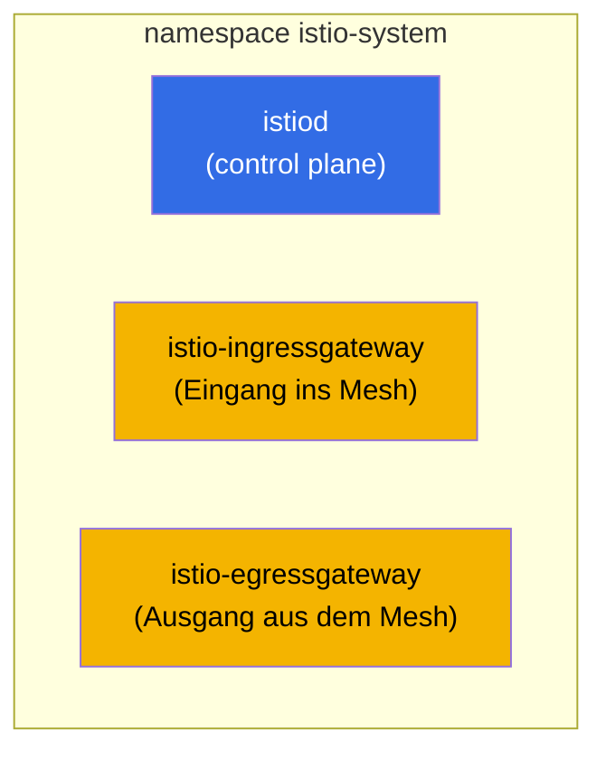
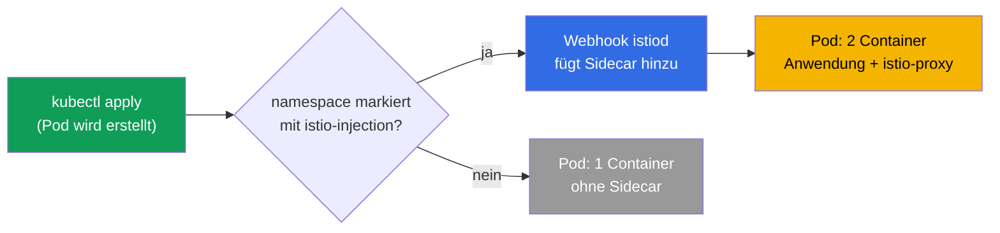
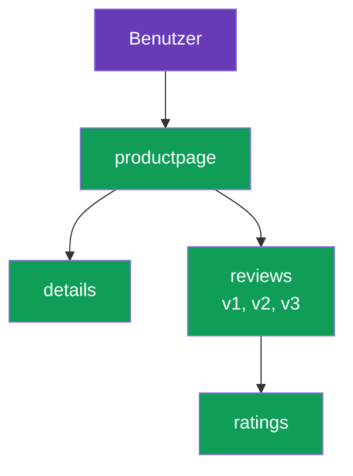

[RU version](ru.md) · [Eng version](en.md) · [Versión en español](es.md) · [Version française](fr.md)

# Kapitel 2. Installation und Konfiguration von Istio

> **Was als Nächstes kommt.** In Kapitel 1 haben wir die Idee des Mesh und die Architektur
> von Istio auf Begriffsebene besprochen. Jetzt installieren wir Istio von Hand im Cluster:
> Wir installieren das CLI, rollen die Control plane aus, aktivieren die Einbindung des
> Sidecar, bringen die Demo-Anwendung zum Laufen und sehen, wie der Traffic durch das Mesh
> läuft. Am Ende besprechen wir, wie man die Installation an die eigenen Anforderungen anpasst.

## 2.1. Was wir tun werden

Der Plan des Kapitels ist einfach und bildet den realen ersten Tag mit Istio ab:

1. `istioctl` installieren – das zentrale Werkzeug zur Verwaltung von Istio.
2. Istio im Cluster installieren (Control plane und Gateways).
3. Prüfen, dass alles hochgekommen ist.
4. Die automatische Einbindung des Sidecar auf dem namespace aktivieren.
5. Die Demo-Anwendung Bookinfo ausrollen und sich vergewissern, dass die Pods einen Sidecar
   erhalten haben.
6. Die Anwendung von außen über das Ingress Gateway öffnen.
7. Verstehen, wie man die Installationsparameter ändert (Profile, IstioOperator, MeshConfig).

## 2.2. istioctl: das zentrale Werkzeug

`istioctl` ist das CLI für Istio, ungefähr wie `kubectl` für Kubernetes. Damit installieren Sie
Istio, prüfen die Konfiguration, diagnostizieren Probleme und sehen, was tatsächlich in Envoy
liegt. In diesem Kapitel wird es in erster Linie für die Installation gebraucht.

Herunterladen einer festen Version (in den Labs wird `1.29.1` verwendet, prüfen Sie aber die
aktuelle auf istio.io):

```bash
version=1.29.1
curl -L https://istio.io/downloadIstio | ISTIO_VERSION=$version sh -
sudo mv istio-$version/bin/istioctl /usr/local/bin/
istioctl version --remote=false
```

```
client version: 1.29.1
```

Das Flag `--remote=false` weist an, nur die Version des Clients anzuzeigen, ohne den Cluster
anzusprechen (im Cluster ist Istio noch nicht installiert).

## 2.3. Installationsprofile

Istio wird nicht „irgendwie" installiert, sondern nach einem **Profil**. Ein Profil ist ein
fertiger Satz von Komponenten und deren Einstellungen. Man muss nicht alles von Hand aufzählen:
Sie wählen ein Profil passend zur Aufgabe.

| Profil | Was es umfasst | Wann man es verwendet |
|---------|--------------|--------------------|
| `default` | istiod + ingress gateway | Produktionsstart, standardmäßig empfohlen |
| `demo` | istiod + ingress + egress gateway, ausführliche Logs | Schulung und Demo (das nehmen die Labs) |
| `minimal` | nur istiod | Individuelle Zusammenstellung, Gateways installieren Sie separat |
| `empty` | nichts | Basis für eine vollständig manuelle Konfiguration |
| `preview` | experimentelle Features | Erprobung neuer Möglichkeiten |
| `ambient` | Komponenten des ambient-Modus | Arbeit ohne Sidecars (Kapitel 21) |

Im Kurs und in den Labs nehmen wir `demo`: Es enthält bereits das Egress Gateway und aktiviert
ausführliche Metriken und Logs, was für das Lernen praktisch ist.

## 2.4. Installation von Istio im Cluster

Die einfachste Variante ist ein einziger Befehl mit Angabe des Profils:

```bash
istioctl install --set profile=demo -y
```

Häufiger jedoch beschreibt man die Installation deklarativ, über ein Manifest `IstioOperator`.
In Lab 01 ist es genau so gemacht: das Profil `demo` plus ein Ingress Gateway vom Typ `NodePort`
mit festen Ports, um bequem von außen zuzugreifen.

```yaml
apiVersion: install.istio.io/v1alpha1
kind: IstioOperator
spec:
  profile: demo
  components:
    ingressGateways:
    - name: istio-ingressgateway
      k8s:
        service:
          type: NodePort
          ports:
          - port: 80
            targetPort: 8080
            nodePort: 32080   # fester HTTP-Port
            name: http2
          - port: 443
            targetPort: 8443
            nodePort: 32443   # fester HTTPS-Port
            name: https
```

```bash
istioctl install -f istio-kubeadm.yaml -y
```

`IstioOperator` ist die Beschreibung der gewünschten Installation. Wir kommen darauf im Abschnitt
2.9 zurück, wenn wir die Anpassung besprechen.

## 2.5. Was im Cluster erschienen ist

Nach der Installation lebt alles im namespace `istio-system`.



```bash
kubectl get pods -n istio-system
```

```
NAME                                    READY   STATUS    RESTARTS   AGE
istio-egressgateway-7f67df695d-z7jg5    1/1     Running   0          53s
istio-ingressgateway-76768cbcf6-l8rwt   1/1     Running   0          53s
istiod-76d6698857-wmvhs                 1/1     Running   0          61s
```

Drei Pods:
- **istiod** – das Gehirn des Mesh (Control plane).
- **istio-ingressgateway** – Envoy am Eingang, nimmt Traffic von außen an.
- **istio-egressgateway** – Envoy am Ausgang, für kontrollierten ausgehenden Traffic
  (Egress ausführlich in Kapitel 11). Er ist genau deshalb da, weil das Profil `demo` verwendet
  wird.

Die Korrektheit der Installation kann man so prüfen:

```bash
istioctl verify-install
```

## 2.6. Aktivieren der Sidecar-Injection

Istio ist installiert, aber es tut mit Ihren Anwendungen noch nichts. Damit die Pods einen
Sidecar-Proxy erhalten, muss man den namespace mit einem speziellen Label markieren:

```bash
kubectl label namespace default istio-injection=enabled
```

Wie das funktioniert: istiod hat einen mutating admission webhook. Wenn in einem markierten
namespace ein Pod erstellt wird, fängt der Webhook die Anfrage ab und ergänzt in der
Pod-Spezifikation den Container `istio-proxy` (Envoy) sowie einen Init-Container, der iptables
konfiguriert.



Wichtig: Das Label wirkt nur auf **neue** Pods. Wenn eine Anwendung im namespace bereits lief,
bevor das Label gesetzt wurde, müssen ihre Pods neu erstellt werden:

```bash
kubectl rollout restart deployment -n default
```

## 2.7. Wir rollen die Demo-Anwendung Bookinfo aus

Bookinfo ist das offizielle Demo von Istio: eine Buchseite, die vier Dienste zusammensetzen. Es
ist praktisch, weil der Dienst `reviews` gleich drei Versionen hat (v1, v2, v3), an denen später
Routing und Canary geübt werden.



Die Installation erfolgt aus den Beispielen, die in der heruntergeladenen Istio-Distribution
liegen:

```bash
cd istio-1.29.1
kubectl apply -f samples/bookinfo/platform/kube/bookinfo.yaml
```

Wir prüfen die Pods:

```bash
kubectl get pods
```

```
NAME                              READY   STATUS    RESTARTS   AGE
details-v1-6cc9f5cc44-csr7h       2/2     Running   0          50s
productpage-v1-7f885b46fc-qqd29   2/2     Running   0          49s
ratings-v1-77b8b6df5b-kfdx8       2/2     Running   0          50s
reviews-v1-fdbf79cd8-zs7qf        2/2     Running   0          50s
reviews-v2-674c6d8b4-p5r65        2/2     Running   0          50s
reviews-v3-7b775c7568-m44z7       2/2     Running   0          50s
```

Der entscheidende Punkt – die Spalte `READY` zeigt `2/2`. Das ist die Bestätigung, dass der
Sidecar eingebunden wurde: Der erste Container ist die Anwendung, der zweite Envoy. Wenn Sie
`1/1` sehen, hat die Injection nicht funktioniert. Häufige Ursachen: Das Label steht nicht auf
dem namespace, oder die Pods wurden erstellt, bevor das Label gesetzt wurde (dann ist ein
`rollout restart` nötig).

## 2.8. Wir öffnen die Anwendung von außen

Derzeit läuft Bookinfo nur innerhalb des Clusters. Um von außen darauf zuzugreifen, braucht man
zwei Istio-Ressourcen: `Gateway` (was am Ingress-Gateway gelauscht wird) und `VirtualService`
(wohin der Traffic geleitet wird). Ausführlich besprechen wir diese Ressourcen in Kapitel 5,
hier wenden wir einfach ein fertiges Beispiel an.

```bash
kubectl apply -f samples/bookinfo/networking/bookinfo-gateway.yaml
```

Wir prüfen den Zugriff über den NodePort des Ingress-Gateways (im Lab ist das der Port `32080`):

```bash
curl -s http://myapp.local:32080/productpage | grep -o "<title>.*</title>"
```

```
<title>Simple Bookstore App</title>
```

Wenn der Titel zurückkam, funktioniert die Kette: Die externe Anfrage traf auf das Ingress
Gateway, dieses leitete sie an den Sidecar von `productpage`, und weiter ging die Anfrage durch
das Mesh zu den übrigen Diensten. Genau der Traffic-Pfad, den wir in Kapitel 1 gezeichnet haben.

## 2.9. Anpassung der Installation: IstioOperator und MeshConfig

Ein Profil reicht für den Start, aber im echten Leben passt man die Installation fast immer an.
Dafür gibt es zwei Ebenen von Einstellungen, und es ist wichtig, sie nicht zu verwechseln.

- **IstioOperator** – was und wie ausgerollt wird: welche Komponenten aktiviert werden, von
  welchem Typ der Dienst des Gateways sein soll, wie viele Repliken, welche Ressourcen. Das
  betrifft die Infrastruktur der Installation.
- **MeshConfig** – wie sich das Mesh selbst verhält: das Format der Access-Logs, die
  Tracing-Einstellungen, die Standard-Policys. Das betrifft das Verhalten des bereits laufenden
  Mesh. MeshConfig wird innerhalb von IstioOperator angegeben, im Feld `meshConfig`.

Beispiel mit beiden Ebenen zugleich: Wir ändern den Diensttyp des Ingress-Gateways und
aktivieren die Access-Logs für das gesamte Mesh.

```yaml
apiVersion: install.istio.io/v1alpha1
kind: IstioOperator
spec:
  profile: default
  meshConfig:
    accessLogFile: /dev/stdout        # Access-Logs von Envoy aktivieren
  components:
    ingressGateways:
    - name: istio-ingressgateway
      enabled: true
      k8s:
        service:
          type: LoadBalancer          # Diensttyp des Gateways
        resources:
          requests:
            cpu: 100m
            memory: 128Mi
```

```bash
istioctl install -f my-istio.yaml -y
```

Die Installation ist deklarativ: Sie bearbeiten die Datei, führen erneut `istioctl install -f`
aus, und Istio bringt den Cluster in den beschriebenen Zustand. Die Anpassung der Installation
üben wir im Detail in Lab 15.

## 2.10. Andere Installationswege (kurz)

- **Helm.** Istio lässt sich auch über Helm-Charts installieren (`istio/base` + `istio/istiod`).
  Dieser Weg ist praktisch für GitOps und vor allem für sichere Updates über Revisionen. Ihm ist
  Kapitel 3 gewidmet.
- **istioctl** (unser Weg) – der direkteste für Start und Lernen.

Die Wahl des Wegs beeinflusst nicht, was am Ende im Cluster entsteht: In beiden Fällen sind es
istiod und Envoy. Der Unterschied liegt darin, wie Sie das verwalten.

## 2.11. Deinstallation von Istio

Es ist nützlich zu wissen, wie man alles wieder rückgängig macht:

```bash
istioctl uninstall --purge -y
kubectl delete namespace istio-system
kubectl label namespace default istio-injection-
```

Der letzte Befehl entfernt das Label vom namespace (das Minus am Ende ist die kubectl-Syntax zum
Entfernen eines Labels).

## 2.12. Zusammenfassung des Kapitels

- `istioctl` ist das zentrale Werkzeug; es wird wie ein gewöhnliches Binary installiert.
- Istio wird nach einem Profil installiert; für den Start eignet sich `default`, für das Lernen
  `demo`.
- Nach der Installation erscheinen in `istio-system` istiod und die Gateways (ingress, und bei
  demo zusätzlich egress).
- Der Sidecar wird automatisch über einen Webhook eingebunden, aber nur in einem namespace mit
  dem Label `istio-injection=enabled` und nur in neue Pods.
- Pods im Mesh zeigen `2/2`; das ist das wichtigste Anzeichen, dass die Injection funktioniert
  hat.
- Der Zugriff von außen wird über Gateway und VirtualService konfiguriert (ausführlich in
  Kapitel 5).
- Die Installation konfiguriert man auf zwei Ebenen: IstioOperator (was ausgerollt wird) und
  MeshConfig (wie sich das Mesh verhält).

## 2.13. Fragen zur Selbstüberprüfung

1. Wodurch unterscheidet sich das Profil `demo` von `default`? Warum wird in den Labs `demo`
   verwendet?
2. Was genau erscheint im namespace `istio-system` nach der Installation?
3. Wie funktioniert die automatische Einbindung des Sidecar? Warum wirkt das Label nicht auf
   bereits laufende Pods?
4. Sie sehen einen Pod mit dem Status `1/1` in einem namespace mit Injection-Label. Worin kann
   die Ursache liegen und wie behebt man es?
5. Worin besteht der Unterschied zwischen IstioOperator und MeshConfig?

## Praxis

Absolvieren Sie das Lab zur Installation: Sie installieren istioctl, rollen Istio mit dem Profil
`demo` aus, aktivieren die Injection, bringen Bookinfo zum Laufen und öffnen es von außen.

🧪 Lab 01: [tasks/ica/labs/01](../../labs/01/README_DE.MD)

Die Anpassung der Installation (IstioOperator und MeshConfig) üben Sie separat:

🧪 Lab 15: [tasks/ica/labs/15](../../labs/15/README_DE.MD)

---
[Inhaltsverzeichnis](../README_DE.md) · [Kapitel 1](../01/de.md) · [Kapitel 3](../03/de.md)
