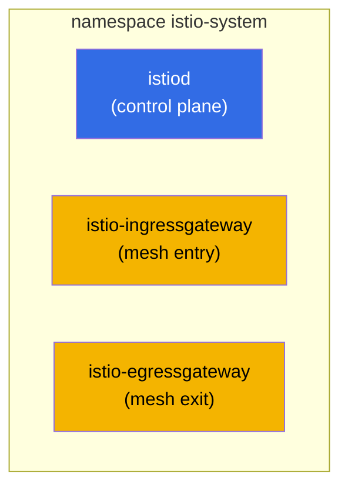
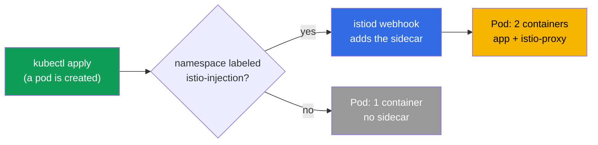
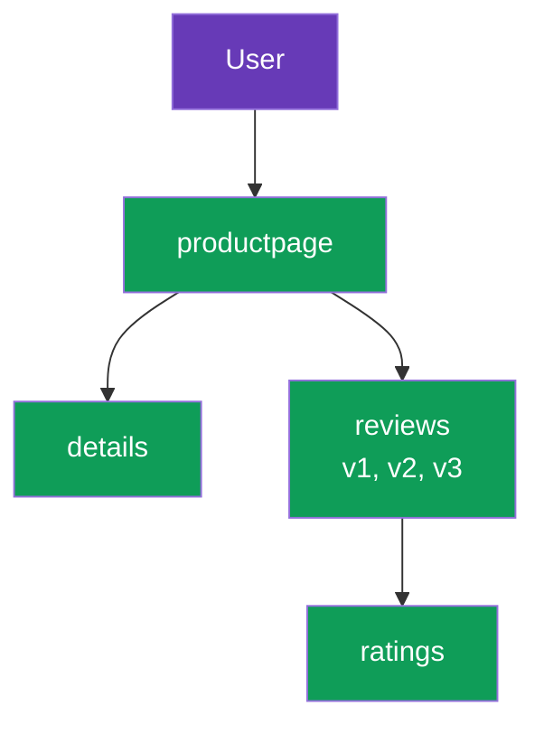

[RU version](ru.md)

# Chapter 2. Installing and configuring Istio

> **What's next.** In chapter 1 we covered the idea of a mesh and Istio's architecture at
> the conceptual level. Now we install Istio into a cluster by hand: install the CLI, deploy
> the control plane, enable sidecar injection, bring up a demo application and see how
> traffic flows through the mesh. At the end we cover how to tune the install to your
> requirements.

## 2.1. What we are going to do

The chapter's plan is simple and mirrors a real first day with Istio:

1. Install `istioctl` - the main Istio management tool.
2. Install Istio into the cluster (control plane and gateways).
3. Verify that everything came up.
4. Enable automatic sidecar injection on a namespace.
5. Deploy the Bookinfo demo application and confirm the pods got a sidecar.
6. Expose the application externally through the ingress gateway.
7. Understand how to change install parameters (profiles, IstioOperator, MeshConfig).

## 2.2. istioctl: the main tool

`istioctl` is the CLI for Istio, roughly like `kubectl` for Kubernetes. With it you install
Istio, validate configuration, diagnose problems and inspect what is actually inside Envoy.
In this chapter it is needed first of all for the install.

Downloading a fixed version (the labs use `1.29.1`, but check the current one on istio.io):

```bash
version=1.29.1
curl -L https://istio.io/downloadIstio | ISTIO_VERSION=$version sh -
sudo mv istio-$version/bin/istioctl /usr/local/bin/
istioctl version --remote=false
```

```
client version: 1.29.1
```

The `--remote=false` flag tells it to show only the client version without contacting the
cluster (Istio is not installed in the cluster yet).

## 2.3. Install profiles

Istio is installed not "however it goes", but by a **profile**. A profile is a ready-made
set of components and their settings. You do not need to list everything by hand: you pick a
profile that fits the task.

| Profile | What it includes | When to use |
|---------|------------------|-------------|
| `default` | istiod + ingress gateway | Production start, the recommended default |
| `demo` | istiod + ingress + egress gateway, verbose logs | Learning and demos (used by the labs) |
| `minimal` | istiod only | Custom build, you install gateways separately |
| `empty` | nothing | A base for fully manual configuration |
| `preview` | experimental features | Trying out new capabilities |
| `ambient` | ambient-mode components | Working without sidecars (chapter 21) |

In the course and labs we use `demo`: it already includes the egress gateway and enables
verbose metrics and logs, which is convenient for learning.

## 2.4. Installing Istio into the cluster

The simplest option is a single command specifying the profile:

```bash
istioctl install --set profile=demo -y
```

But more often the install is described declaratively, via an `IstioOperator` manifest. Lab
01 does exactly that: the `demo` profile plus a `NodePort`-type ingress gateway with fixed
ports, so it is convenient to reach from outside.

```yaml
apiVersion: install.istio.io/v1alpha1
kind: IstioOperator
spec:
  profile: demo
  components:
    ingressGateways:
    - name: istio-ingressgateway
      k8s:
        service:
          type: NodePort
          ports:
          - port: 80
            targetPort: 8080
            nodePort: 32080   # fixed HTTP port
            name: http2
          - port: 443
            targetPort: 8443
            nodePort: 32443   # fixed HTTPS port
            name: https
```

```bash
istioctl install -f istio-kubeadm.yaml -y
```

`IstioOperator` is a description of the desired install. We will come back to it in section
2.9 when we cover customization.

## 2.5. What appeared in the cluster

After the install, everything lives in the `istio-system` namespace.



```bash
kubectl get pods -n istio-system
```

```
NAME                                    READY   STATUS    RESTARTS   AGE
istio-egressgateway-7f67df695d-z7jg5    1/1     Running   0          53s
istio-ingressgateway-76768cbcf6-l8rwt   1/1     Running   0          53s
istiod-76d6698857-wmvhs                 1/1     Running   0          61s
```

Three pods:
- **istiod** - the brain of the mesh (control plane).
- **istio-ingressgateway** - the Envoy at the entry, accepts traffic from outside.
- **istio-egressgateway** - the Envoy at the exit, for controlled outbound traffic (egress
  is covered in detail in chapter 11). It is present precisely because of the `demo` profile.

You can verify the install is correct like this:

```bash
istioctl verify-install
```

## 2.6. Enabling sidecar injection

Istio is installed, but it does nothing with your applications yet. For pods to get a
sidecar proxy, you need to label the namespace with a special label:

```bash
kubectl label namespace default istio-injection=enabled
```

How it works: istiod has a mutating admission webhook. When a pod is created in a labeled
namespace, the webhook intercepts the request and adds an `istio-proxy` (Envoy) container
and an init container that sets up iptables to the pod's spec.



Important: the label only affects **new** pods. If an application was already running in the
namespace before the label was set, its pods must be recreated:

```bash
kubectl rollout restart deployment -n default
```

## 2.7. Deploying the Bookinfo demo application

Bookinfo is Istio's official demo: a book page assembled by four services. It is convenient
because the `reviews` service has three versions (v1, v2, v3) right away, which are later
used to practice routing and canary.



The install comes from the examples that ship in the downloaded Istio distribution:

```bash
cd istio-1.29.1
kubectl apply -f samples/bookinfo/platform/kube/bookinfo.yaml
```

Check the pods:

```bash
kubectl get pods
```

```
NAME                              READY   STATUS    RESTARTS   AGE
details-v1-6cc9f5cc44-csr7h       2/2     Running   0          50s
productpage-v1-7f885b46fc-qqd29   2/2     Running   0          49s
ratings-v1-77b8b6df5b-kfdx8       2/2     Running   0          50s
reviews-v1-fdbf79cd8-zs7qf        2/2     Running   0          50s
reviews-v2-674c6d8b4-p5r65        2/2     Running   0          50s
reviews-v3-7b775c7568-m44z7       2/2     Running   0          50s
```

The key point is the `READY` column showing `2/2`. That is the confirmation the sidecar was
injected: the first container is the application, the second is Envoy. If you see `1/1`, the
injection did not work. Common reasons: the namespace is not labeled, or the pods were
created before the label was set (then you need a `rollout restart`).

## 2.8. Exposing the application externally

Right now Bookinfo works only inside the cluster. To reach it from outside you need two
Istio resources: a `Gateway` (what to listen for on the ingress gateway) and a
`VirtualService` (where to route the traffic). We cover these resources in detail in chapter
5; here we just apply a ready-made example.

```bash
kubectl apply -f samples/bookinfo/networking/bookinfo-gateway.yaml
```

Check access through the ingress gateway NodePort (in the lab this is port `32080`):

```bash
curl -s http://myapp.local:32080/productpage | grep -o "<title>.*</title>"
```

```
<title>Simple Bookstore App</title>
```

If the title came back, the chain works: the external request reached the ingress gateway,
which routed it to the `productpage` sidecar, and from there the request went through the
mesh to the other services. Exactly the traffic path we drew in chapter 1.

## 2.9. Customizing the install: IstioOperator and MeshConfig

A profile is enough to start, but in real life the install is almost always adjusted. There
are two levels of settings for this, and it is important not to confuse them.

- **IstioOperator** - what to deploy and how: which components to enable, what type to make
  the gateway service, how many replicas, what resources. This is about the install
  infrastructure.
- **MeshConfig** - how the mesh itself behaves: the access-log format, tracing settings,
  default policies. This is about the behavior of an already-running mesh. MeshConfig is set
  inside IstioOperator, in the `meshConfig` field.

An example with both levels at once: change the ingress gateway service type and enable
access logs for the whole mesh.

```yaml
apiVersion: install.istio.io/v1alpha1
kind: IstioOperator
spec:
  profile: default
  meshConfig:
    accessLogFile: /dev/stdout        # enable Envoy access logs
  components:
    ingressGateways:
    - name: istio-ingressgateway
      enabled: true
      k8s:
        service:
          type: LoadBalancer          # gateway service type
        resources:
          requests:
            cpu: 100m
            memory: 128Mi
```

```bash
istioctl install -f my-istio.yaml -y
```

The install is declarative: you edit the file, run `istioctl install -f` again, and Istio
brings the cluster to the described state. We practice install customization in detail in
lab 15.

## 2.10. Other install methods (briefly)

- **Helm.** Istio can also be installed via Helm charts (`istio/base` + `istio/istiod`).
  This path is convenient for GitOps and, most importantly, for safe upgrades via revisions.
  Chapter 3 is dedicated to it.
- **istioctl** (our method) - the most direct one for starting and learning.

The choice of method does not affect what ends up in the cluster: either way it is istiod
and Envoy. The difference is in how you manage it.

## 2.11. Uninstalling Istio

It is useful to know how to roll everything back:

```bash
istioctl uninstall --purge -y
kubectl delete namespace istio-system
kubectl label namespace default istio-injection-
```

The last command removes the label from the namespace (the trailing minus is kubectl syntax
for deleting a label).

## 2.12. Chapter summary

- `istioctl` is the main tool; it is installed as an ordinary binary.
- Istio is installed by a profile; `default` fits for a start, `demo` for learning.
- After the install, istiod and the gateways (ingress, and in demo also egress) appear in
  `istio-system`.
- The sidecar is injected automatically via a webhook, but only in a namespace labeled
  `istio-injection=enabled` and only into new pods.
- Pods in the mesh show `2/2`; this is the main sign that injection worked.
- External access is configured through Gateway and VirtualService (in detail in chapter 5).
- The install is configured at two levels: IstioOperator (what to deploy) and MeshConfig
  (how the mesh behaves).

## 2.13. Self-check questions

1. How does the `demo` profile differ from `default`? Why do the labs use `demo`?
2. What exactly appears in the `istio-system` namespace after the install?
3. How does automatic sidecar injection work? Why does the label not affect already-running
   pods?
4. You see a pod with status `1/1` in a namespace with the injection label. What could be
   the reason and how do you fix it?
5. What is the difference between IstioOperator and MeshConfig?

## Practice

Go through the install lab: you will install istioctl, deploy Istio with the `demo` profile,
enable injection, bring up Bookinfo and expose it externally.

🧪 Lab 01: [tasks/ica/labs/01](../../labs/01/README.MD)

Practice install customization (IstioOperator and MeshConfig) separately:

🧪 Lab 15: [tasks/ica/labs/15](../../labs/15/README.MD)

---
[Contents](../README.md) · [Chapter 1](../01/en.md) · [Chapter 3](../03/en.md)
