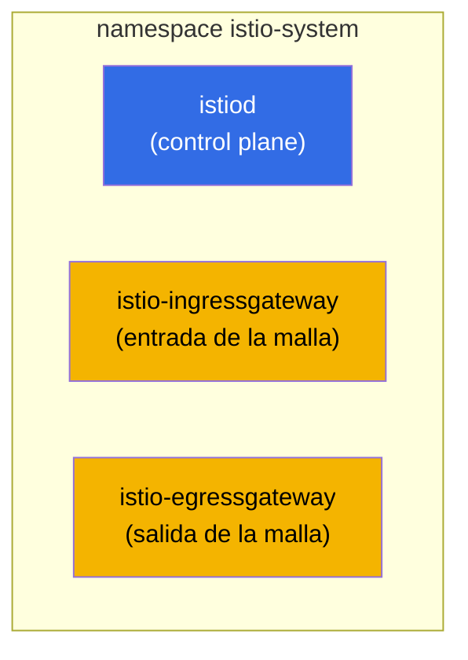
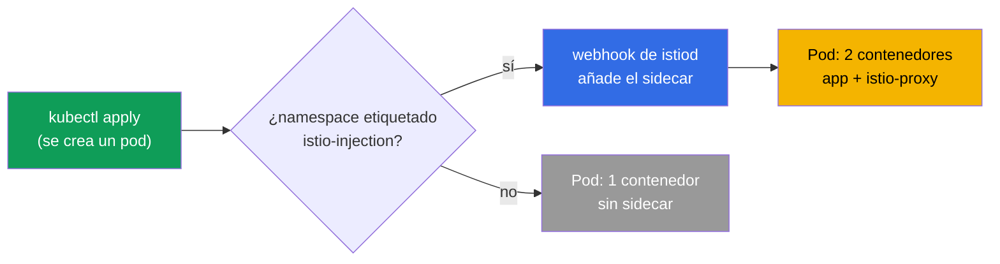
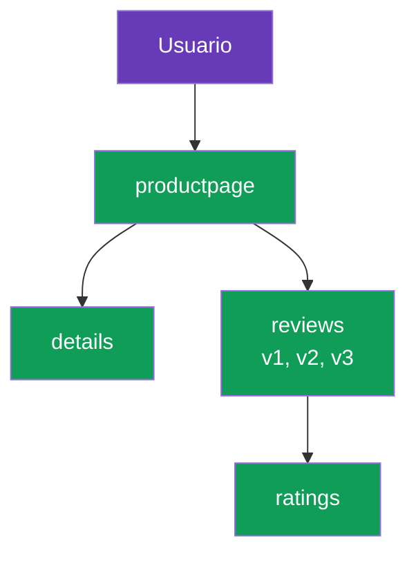

[RU version](ru.md) · [Eng version](en.md) · [Version française](fr.md) · [Deutsche Version](de.md)

# Capítulo 2. Instalación y configuración de Istio

> **Qué sigue.** En el capítulo 1 cubrimos la idea de una malla y la arquitectura de Istio a
> nivel conceptual. Ahora instalamos Istio en un clúster a mano: instalamos la CLI,
> desplegamos el control plane, habilitamos la inyección de sidecar, levantamos una
> aplicación de demostración y vemos cómo fluye el tráfico por la malla. Al final cubrimos
> cómo ajustar la instalación a tus requisitos.

## 2.1. Qué vamos a hacer

El plan del capítulo es simple y refleja un primer día real con Istio:

1. Instalar `istioctl`, la principal herramienta de gestión de Istio.
2. Instalar Istio en el clúster (control plane y gateways).
3. Verificar que todo se levantó.
4. Habilitar la inyección automática de sidecar en un namespace.
5. Desplegar la aplicación de demostración Bookinfo y confirmar que los pods recibieron un
   sidecar.
6. Exponer la aplicación externamente a través del ingress gateway.
7. Entender cómo cambiar los parámetros de instalación (perfiles, IstioOperator, MeshConfig).

## 2.2. istioctl: la herramienta principal

`istioctl` es la CLI de Istio, más o menos como `kubectl` para Kubernetes. Con ella instalas
Istio, validas la configuración, diagnosticas problemas e inspeccionas lo que hay realmente
dentro de Envoy. En este capítulo se necesita ante todo para la instalación.

Descarga de una versión fija (los laboratorios usan `1.29.1`, pero comprueba la actual en
istio.io):

```bash
version=1.29.1
curl -L https://istio.io/downloadIstio | ISTIO_VERSION=$version sh -
sudo mv istio-$version/bin/istioctl /usr/local/bin/
istioctl version --remote=false
```

```
client version: 1.29.1
```

El flag `--remote=false` le indica que muestre solo la versión del cliente sin contactar con
el clúster (Istio aún no está instalado en el clúster).

## 2.3. Perfiles de instalación

Istio no se instala "como salga", sino mediante un **perfil**. Un perfil es un conjunto
predefinido de componentes y sus ajustes. No necesitas enumerar todo a mano: eliges un perfil
que encaje con la tarea.

| Perfil | Qué incluye | Cuándo usarlo |
|--------|-------------|---------------|
| `default` | istiod + ingress gateway | Arranque en producción, el valor por defecto recomendado |
| `demo` | istiod + ingress + egress gateway, logs detallados | Aprendizaje y demos (el que usan los laboratorios) |
| `minimal` | solo istiod | Build personalizado, instalas los gateways por separado |
| `empty` | nada | Una base para configuración totalmente manual |
| `preview` | funcionalidades experimentales | Probar nuevas capacidades |
| `ambient` | componentes del modo ambient | Trabajar sin sidecars (capítulo 21) |

En el curso y los laboratorios usamos `demo`: ya incluye el egress gateway y habilita métricas
y logs detallados, lo cual es cómodo para aprender.

## 2.4. Instalar Istio en el clúster

La opción más simple es un único comando indicando el perfil:

```bash
istioctl install --set profile=demo -y
```

Pero más a menudo la instalación se describe de forma declarativa, mediante un manifiesto
`IstioOperator`. El laboratorio 01 hace exactamente eso: el perfil `demo` más un ingress
gateway de tipo `NodePort` con puertos fijos, para que sea cómodo alcanzarlo desde fuera.

```yaml
apiVersion: install.istio.io/v1alpha1
kind: IstioOperator
spec:
  profile: demo
  components:
    ingressGateways:
    - name: istio-ingressgateway
      k8s:
        service:
          type: NodePort
          ports:
          - port: 80
            targetPort: 8080
            nodePort: 32080   # puerto HTTP fijo
            name: http2
          - port: 443
            targetPort: 8443
            nodePort: 32443   # puerto HTTPS fijo
            name: https
```

```bash
istioctl install -f istio-kubeadm.yaml -y
```

`IstioOperator` es una descripción de la instalación deseada. Volveremos a ella en la sección
2.9 cuando cubramos la personalización.

## 2.5. Qué apareció en el clúster

Tras la instalación, todo vive en el namespace `istio-system`.



```bash
kubectl get pods -n istio-system
```

```
NAME                                    READY   STATUS    RESTARTS   AGE
istio-egressgateway-7f67df695d-z7jg5    1/1     Running   0          53s
istio-ingressgateway-76768cbcf6-l8rwt   1/1     Running   0          53s
istiod-76d6698857-wmvhs                 1/1     Running   0          61s
```

Tres pods:
- **istiod**, el cerebro de la malla (control plane).
- **istio-ingressgateway**, el Envoy en la entrada, acepta tráfico desde fuera.
- **istio-egressgateway**, el Envoy en la salida, para tráfico saliente controlado (el egress
  se cubre en detalle en el capítulo 11). Está presente precisamente por el perfil `demo`.

Puedes verificar que la instalación es correcta así:

```bash
istioctl verify-install
```

## 2.6. Habilitar la inyección de sidecar

Istio está instalado, pero todavía no hace nada con tus aplicaciones. Para que los pods
reciban un proxy sidecar, hay que etiquetar el namespace con una etiqueta especial:

```bash
kubectl label namespace default istio-injection=enabled
```

Cómo funciona: istiod tiene un mutating admission webhook. Cuando se crea un pod en un
namespace etiquetado, el webhook intercepta la petición y añade a la especificación del pod un
contenedor `istio-proxy` (Envoy) y un init container que configura iptables.



Importante: la etiqueta solo afecta a los pods **nuevos**. Si una aplicación ya estaba
corriendo en el namespace antes de poner la etiqueta, sus pods deben recrearse:

```bash
kubectl rollout restart deployment -n default
```

## 2.7. Desplegar la aplicación de demostración Bookinfo

Bookinfo es la demo oficial de Istio: una página de libro compuesta por cuatro servicios. Es
cómoda porque el servicio `reviews` tiene tres versiones (v1, v2, v3) desde el principio, que
luego se usan para practicar enrutamiento y canary.



La instalación viene de los ejemplos que se incluyen en la distribución de Istio descargada:

```bash
cd istio-1.29.1
kubectl apply -f samples/bookinfo/platform/kube/bookinfo.yaml
```

Comprueba los pods:

```bash
kubectl get pods
```

```
NAME                              READY   STATUS    RESTARTS   AGE
details-v1-6cc9f5cc44-csr7h       2/2     Running   0          50s
productpage-v1-7f885b46fc-qqd29   2/2     Running   0          49s
ratings-v1-77b8b6df5b-kfdx8       2/2     Running   0          50s
reviews-v1-fdbf79cd8-zs7qf        2/2     Running   0          50s
reviews-v2-674c6d8b4-p5r65        2/2     Running   0          50s
reviews-v3-7b775c7568-m44z7       2/2     Running   0          50s
```

El punto clave es la columna `READY` mostrando `2/2`. Esa es la confirmación de que se inyectó
el sidecar: el primer contenedor es la aplicación, el segundo es Envoy. Si ves `1/1`, la
inyección no funcionó. Motivos habituales: el namespace no está etiquetado, o los pods se
crearon antes de poner la etiqueta (entonces hace falta un `rollout restart`).

## 2.8. Exponer la aplicación externamente

Ahora mismo Bookinfo funciona solo dentro del clúster. Para alcanzarla desde fuera necesitas
dos recursos de Istio: un `Gateway` (qué escuchar en el ingress gateway) y un
`VirtualService` (a dónde enrutar el tráfico). Cubrimos estos recursos en detalle en el
capítulo 5; aquí solo aplicamos un ejemplo ya listo.

```bash
kubectl apply -f samples/bookinfo/networking/bookinfo-gateway.yaml
```

Comprueba el acceso a través del NodePort del ingress gateway (en el laboratorio es el puerto
`32080`):

```bash
curl -s http://myapp.local:32080/productpage | grep -o "<title>.*</title>"
```

```
<title>Simple Bookstore App</title>
```

Si el título volvió, la cadena funciona: la petición externa llegó al ingress gateway, que la
enrutó al sidecar de `productpage`, y desde ahí la petición recorrió la malla hasta los demás
servicios. Exactamente el camino del tráfico que dibujamos en el capítulo 1.

## 2.9. Personalizar la instalación: IstioOperator y MeshConfig

Un perfil basta para empezar, pero en la vida real la instalación casi siempre se ajusta. Hay
dos niveles de ajustes para esto, y es importante no confundirlos.

- **IstioOperator**, qué desplegar y cómo: qué componentes habilitar, de qué tipo hacer el
  servicio del gateway, cuántas réplicas, qué recursos. Esto trata de la infraestructura de
  instalación.
- **MeshConfig**, cómo se comporta la propia malla: el formato del access-log, los ajustes de
  tracing, las políticas por defecto. Esto trata del comportamiento de una malla ya en
  marcha. MeshConfig se define dentro de IstioOperator, en el campo `meshConfig`.

Un ejemplo con ambos niveles a la vez: cambiar el tipo del servicio del ingress gateway y
habilitar los access logs para toda la malla.

```yaml
apiVersion: install.istio.io/v1alpha1
kind: IstioOperator
spec:
  profile: default
  meshConfig:
    accessLogFile: /dev/stdout        # habilitar los access logs de Envoy
  components:
    ingressGateways:
    - name: istio-ingressgateway
      enabled: true
      k8s:
        service:
          type: LoadBalancer          # tipo de servicio del gateway
        resources:
          requests:
            cpu: 100m
            memory: 128Mi
```

```bash
istioctl install -f my-istio.yaml -y
```

La instalación es declarativa: editas el archivo, ejecutas `istioctl install -f` de nuevo, e
Istio lleva el clúster al estado descrito. Practicamos la personalización de la instalación en
detalle en el laboratorio 15.

## 2.10. Otros métodos de instalación (brevemente)

- **Helm.** Istio también se puede instalar mediante charts de Helm (`istio/base` +
  `istio/istiod`). Este camino es cómodo para GitOps y, sobre todo, para actualizaciones
  seguras mediante revisiones. El capítulo 3 está dedicado a ello.
- **istioctl** (nuestro método), el más directo para empezar y aprender.

La elección del método no afecta a lo que acaba en el clúster: de un modo u otro son istiod y
Envoy. La diferencia está en cómo lo gestionas.

## 2.11. Desinstalar Istio

Es útil saber cómo revertir todo:

```bash
istioctl uninstall --purge -y
kubectl delete namespace istio-system
kubectl label namespace default istio-injection-
```

El último comando quita la etiqueta del namespace (el guion final es la sintaxis de kubectl
para eliminar una etiqueta).

## 2.12. Resumen del capítulo

- `istioctl` es la herramienta principal; se instala como un binario cualquiera.
- Istio se instala mediante un perfil; `default` sirve para empezar, `demo` para aprender.
- Tras la instalación, istiod y los gateways (ingress, y en demo también egress) aparecen en
  `istio-system`.
- El sidecar se inyecta automáticamente mediante un webhook, pero solo en un namespace
  etiquetado con `istio-injection=enabled` y solo en pods nuevos.
- Los pods en la malla muestran `2/2`; esa es la principal señal de que la inyección funcionó.
- El acceso externo se configura mediante Gateway y VirtualService (en detalle en el capítulo
  5).
- La instalación se configura en dos niveles: IstioOperator (qué desplegar) y MeshConfig
  (cómo se comporta la malla).

## 2.13. Preguntas de autoevaluación

1. ¿En qué se diferencia el perfil `demo` de `default`? ¿Por qué los laboratorios usan
   `demo`?
2. ¿Qué aparece exactamente en el namespace `istio-system` tras la instalación?
3. ¿Cómo funciona la inyección automática de sidecar? ¿Por qué la etiqueta no afecta a los
   pods que ya están corriendo?
4. Ves un pod con estado `1/1` en un namespace con la etiqueta de inyección. ¿Cuál podría ser
   el motivo y cómo lo arreglas?
5. ¿Cuál es la diferencia entre IstioOperator y MeshConfig?

## Práctica

Realiza el laboratorio de instalación: instalarás istioctl, desplegarás Istio con el perfil
`demo`, habilitarás la inyección, levantarás Bookinfo y la expondrás externamente.

🧪 Laboratorio 01: [tasks/ica/labs/01](../../labs/01/README_ES.MD)

Practica la personalización de la instalación (IstioOperator y MeshConfig) por separado:

🧪 Laboratorio 15: [tasks/ica/labs/15](../../labs/15/README_ES.MD)

---
[Índice](../README_ES.md) · [Capítulo 1](../01/es.md) · [Capítulo 3](../03/es.md)
