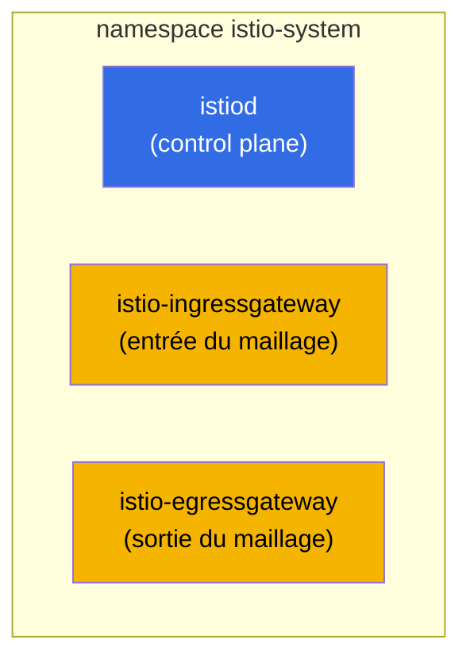
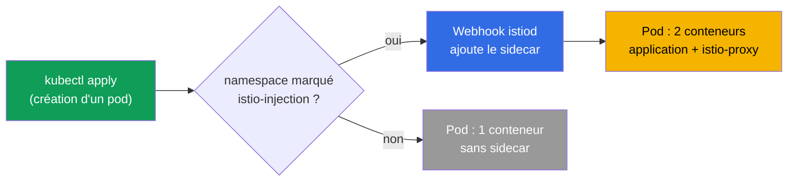
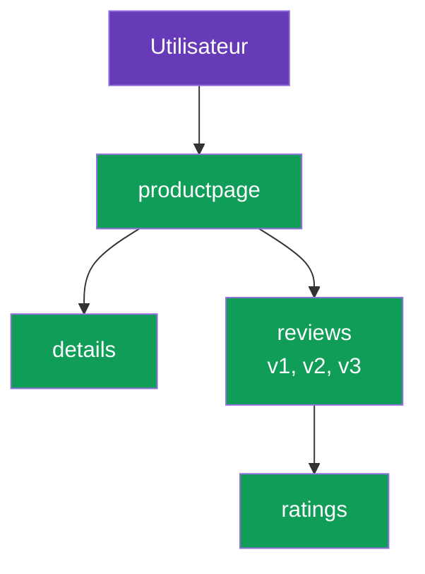

[RU version](ru.md) · [Eng version](en.md) · [Versión en español](es.md) · [Deutsche Version](de.md)

# Chapitre 2. Installation et configuration d'Istio

> **La suite.** Au chapitre 1, nous avons vu l'idée du maillage et l'architecture
> d'Istio au niveau des concepts. Nous installons maintenant Istio dans le cluster à la
> main : nous installerons le CLI, déploierons le control plane, activerons l'injection
> de sidecar, mettrons en place l'application de démonstration et verrons comment le
> trafic circule à travers le maillage. À la fin, nous verrons comment adapter
> l'installation à vos besoins.

## 2.1. Ce que nous allons faire

Le plan du chapitre est simple et reproduit une véritable première journée avec Istio :

1. Installer `istioctl`, l'outil de gestion principal d'Istio.
2. Installer Istio dans le cluster (control plane et gateways).
3. Vérifier que tout est bien en place.
4. Activer l'injection automatique de sidecar sur un namespace.
5. Déployer l'application de démonstration Bookinfo et vérifier que les pods ont reçu un
   sidecar.
6. Ouvrir l'application depuis l'extérieur via l'ingress gateway.
7. Comprendre comment modifier les paramètres d'installation (profils, IstioOperator,
   MeshConfig).

## 2.2. istioctl : l'outil principal

`istioctl` est le CLI d'Istio, à peu près comme `kubectl` pour Kubernetes. C'est par
lui que vous installez Istio, vérifiez la configuration, diagnostiquez les problèmes et
regardez ce qui se trouve réellement à l'intérieur d'Envoy. Dans ce chapitre, il sert
avant tout à l'installation.

Téléchargement d'une version fixe (les labs utilisent la `1.29.1`, mais vérifiez la
version courante sur istio.io) :

```bash
version=1.29.1
curl -L https://istio.io/downloadIstio | ISTIO_VERSION=$version sh -
sudo mv istio-$version/bin/istioctl /usr/local/bin/
istioctl version --remote=false
```

```
client version: 1.29.1
```

Le flag `--remote=false` demande de n'afficher que la version du client, sans
s'adresser au cluster (Istio n'y est pas encore installé).

## 2.3. Profils d'installation

Istio ne s'installe pas « à la va-vite », mais selon un **profil**. Un profil est un
ensemble prêt à l'emploi de composants et de leurs réglages. Nul besoin de tout
énumérer à la main : vous choisissez un profil adapté à la tâche.

| Profil | Ce qu'il inclut | Quand l'utiliser |
|---------|--------------|--------------------|
| `default` | istiod + ingress gateway | Démarrage en production, recommandé par défaut |
| `demo` | istiod + ingress + egress gateway, logs détaillés | Apprentissage et démo (celui que prennent les labs) |
| `minimal` | istiod uniquement | Assemblage sur mesure, les gateways s'installent séparément |
| `empty` | rien | Base pour une configuration entièrement manuelle |
| `preview` | fonctionnalités expérimentales | Test de nouvelles capacités |
| `ambient` | composants du mode ambient | Travail sans sidecars (chapitre 21) |

Dans le cours et les labs, nous prenons `demo` : il inclut déjà l'egress gateway et
active des métriques et des logs détaillés, ce qui est pratique pour l'apprentissage.

## 2.4. Installation d'Istio dans le cluster

L'option la plus simple : une seule commande précisant le profil :

```bash
istioctl install --set profile=demo -y
```

Mais le plus souvent, on décrit l'installation de manière déclarative, via un manifeste
`IstioOperator`. C'est ce qui est fait dans le lab 01 : le profil `demo` plus un ingress
gateway de type `NodePort` avec des ports fixes, pour accéder commodément depuis
l'extérieur.

```yaml
apiVersion: install.istio.io/v1alpha1
kind: IstioOperator
spec:
  profile: demo
  components:
    ingressGateways:
    - name: istio-ingressgateway
      k8s:
        service:
          type: NodePort
          ports:
          - port: 80
            targetPort: 8080
            nodePort: 32080   # port HTTP fixe
            name: http2
          - port: 443
            targetPort: 8443
            nodePort: 32443   # port HTTPS fixe
            name: https
```

```bash
istioctl install -f istio-kubeadm.yaml -y
```

`IstioOperator` est la description de l'installation souhaitée. Nous y reviendrons à la
section 2.9, lorsque nous aborderons la personnalisation.

## 2.5. Ce qui est apparu dans le cluster

Après l'installation, tout vit dans le namespace `istio-system`.



```bash
kubectl get pods -n istio-system
```

```
NAME                                    READY   STATUS    RESTARTS   AGE
istio-egressgateway-7f67df695d-z7jg5    1/1     Running   0          53s
istio-ingressgateway-76768cbcf6-l8rwt   1/1     Running   0          53s
istiod-76d6698857-wmvhs                 1/1     Running   0          61s
```

Trois pods :
- **istiod** - le cerveau du maillage (control plane).
- **istio-ingressgateway** - l'Envoy en entrée, reçoit le trafic depuis l'extérieur.
- **istio-egressgateway** - l'Envoy en sortie, pour le trafic sortant contrôlé (l'egress
  en détail au chapitre 11). Il est présent précisément parce que le profil est `demo`.

On peut vérifier que l'installation est correcte ainsi :

```bash
istioctl verify-install
```

## 2.6. Activation de l'injection de sidecar

Istio est installé, mais il ne fait encore rien de vos applications. Pour que les pods
reçoivent un proxy sidecar, il faut marquer le namespace d'un label spécial :

```bash
kubectl label namespace default istio-injection=enabled
```

Comment cela fonctionne : istiod dispose d'un mutating admission webhook. Lorsqu'un pod
est créé dans un namespace marqué, le webhook intercepte la requête et complète la
spécification du pod avec un conteneur `istio-proxy` (Envoy) et un init-conteneur qui
configure iptables.



Important : le label n'agit que sur les **nouveaux** pods. Si une application
fonctionnait déjà dans le namespace avant la pose du label, ses pods doivent être
recréés :

```bash
kubectl rollout restart deployment -n default
```

## 2.7. Déployons l'application de démonstration Bookinfo

Bookinfo est la démo officielle d'Istio : une page de livre assemblée par quatre
services. Elle est pratique car le service `reviews` possède d'emblée trois versions
(v1, v2, v3), sur lesquelles on met ensuite en pratique le routage et le canary.



L'installation se fait à partir des exemples présents dans la distribution Istio
téléchargée :

```bash
cd istio-1.29.1
kubectl apply -f samples/bookinfo/platform/kube/bookinfo.yaml
```

Vérifions les pods :

```bash
kubectl get pods
```

```
NAME                              READY   STATUS    RESTARTS   AGE
details-v1-6cc9f5cc44-csr7h       2/2     Running   0          50s
productpage-v1-7f885b46fc-qqd29   2/2     Running   0          49s
ratings-v1-77b8b6df5b-kfdx8       2/2     Running   0          50s
reviews-v1-fdbf79cd8-zs7qf        2/2     Running   0          50s
reviews-v2-674c6d8b4-p5r65        2/2     Running   0          50s
reviews-v3-7b775c7568-m44z7       2/2     Running   0          50s
```

Le point clé : la colonne `READY` affiche `2/2`. C'est la confirmation que le sidecar a
été injecté : le premier conteneur est l'application, le second est Envoy. Si vous
voyez `1/1`, c'est que l'injection n'a pas fonctionné. Causes fréquentes : le label
n'est pas posé sur le namespace, ou les pods ont été créés avant la pose du label (il
faut alors un `rollout restart`).

## 2.8. Ouvrons l'application depuis l'extérieur

Pour l'instant, Bookinfo ne fonctionne qu'à l'intérieur du cluster. Pour y accéder
depuis l'extérieur, il faut deux ressources Istio : `Gateway` (ce qu'écoute l'ingress
gateway) et `VirtualService` (où diriger le trafic). Nous verrons ces ressources en
détail au chapitre 5, ici nous appliquons simplement un exemple prêt à l'emploi.

```bash
kubectl apply -f samples/bookinfo/networking/bookinfo-gateway.yaml
```

Vérifions l'accès via le NodePort de l'ingress gateway (dans le lab, c'est le port
`32080`) :

```bash
curl -s http://myapp.local:32080/productpage | grep -o "<title>.*</title>"
```

```
<title>Simple Bookstore App</title>
```

Si le titre est renvoyé, c'est que la chaîne fonctionne : la requête externe est
arrivée sur l'ingress gateway, qui l'a dirigée vers le sidecar de `productpage`, puis la
requête a circulé dans le maillage vers les autres services. Exactement le chemin de
trafic que nous avons dessiné au chapitre 1.

## 2.9. Personnalisation de l'installation : IstioOperator et MeshConfig

Un profil suffit pour démarrer, mais dans la vraie vie, l'installation est presque
toujours ajustée. Pour cela, il existe deux niveaux de réglages, qu'il est important de
ne pas confondre.

- **IstioOperator** - quoi déployer et comment : quels composants activer, quel type de
  service donner au gateway, combien de réplicas, quelles ressources. C'est
  l'infrastructure de l'installation.
- **MeshConfig** - comment se comporte le maillage lui-même : format des access logs,
  réglages du tracing, politiques par défaut. C'est le comportement d'un maillage déjà
  en fonctionnement. MeshConfig se définit à l'intérieur d'IstioOperator, dans le champ
  `meshConfig`.

Exemple avec les deux niveaux à la fois : nous changeons le type de service de l'ingress
gateway et activons les access logs pour tout le maillage.

```yaml
apiVersion: install.istio.io/v1alpha1
kind: IstioOperator
spec:
  profile: default
  meshConfig:
    accessLogFile: /dev/stdout        # activer les access logs d'Envoy
  components:
    ingressGateways:
    - name: istio-ingressgateway
      enabled: true
      k8s:
        service:
          type: LoadBalancer          # type de service du gateway
        resources:
          requests:
            cpu: 100m
            memory: 128Mi
```

```bash
istioctl install -f my-istio.yaml -y
```

L'installation est déclarative : vous modifiez le fichier, relancez `istioctl install
-f`, et Istio amène le cluster à l'état décrit. Nous mettons en pratique la
personnalisation de l'installation en détail dans le lab 15.

## 2.10. Autres méthodes d'installation (en bref)

- **Helm.** Istio s'installe aussi via les charts Helm (`istio/base` + `istio/istiod`).
  Cette voie est pratique pour le GitOps et, surtout, pour les mises à jour sûres via
  les révisions. Le chapitre 3 lui est consacré.
- **istioctl** (notre méthode) - la plus directe pour débuter et apprendre.

Le choix de la méthode n'influe pas sur le résultat dans le cluster : dans les deux cas,
il s'agit d'istiod et d'Envoy. La différence tient à la manière de les gérer.

## 2.11. Désinstallation d'Istio

Il est utile de savoir comment tout revenir en arrière :

```bash
istioctl uninstall --purge -y
kubectl delete namespace istio-system
kubectl label namespace default istio-injection-
```

La dernière commande retire le label du namespace (le moins à la fin est la syntaxe
kubectl pour supprimer un label).

## 2.12. Résumé du chapitre

- `istioctl` est l'outil principal ; il s'installe comme un binaire ordinaire.
- Istio s'installe selon un profil ; pour débuter, `default` convient, pour apprendre
  `demo`.
- Après l'installation, `istio-system` contient istiod et les gateways (ingress, et en
  demo également egress).
- Le sidecar est injecté automatiquement via un webhook, mais uniquement dans les
  namespaces portant le label `istio-injection=enabled` et uniquement dans les nouveaux
  pods.
- Les pods dans le maillage affichent `2/2` ; c'est le principal signe que l'injection a
  fonctionné.
- L'accès depuis l'extérieur se configure via Gateway et VirtualService (en détail au
  chapitre 5).
- L'installation se règle sur deux niveaux : IstioOperator (quoi déployer) et MeshConfig
  (comment se comporte le maillage).

## 2.13. Questions d'auto-évaluation

1. En quoi le profil `demo` diffère-t-il de `default` ? Pourquoi les labs utilisent-ils
   `demo` ?
2. Qu'apparaît-il exactement dans le namespace `istio-system` après l'installation ?
3. Comment fonctionne l'injection automatique de sidecar ? Pourquoi le label n'affecte-t-il
   pas les pods déjà en fonctionnement ?
4. Vous voyez un pod avec le statut `1/1` dans un namespace portant le label d'injection.
   Quelle peut en être la cause et comment y remédier ?
5. Quelle est la différence entre IstioOperator et MeshConfig ?

## Pratique

Faites le lab d'installation : vous installerez istioctl, déploierez Istio avec le
profil `demo`, activerez l'injection, mettrez en place Bookinfo et l'ouvrirez depuis
l'extérieur.

🧪 Lab 01 : [tasks/ica/labs/01](../../labs/01/README_FR.MD)

Mettez en pratique la personnalisation de l'installation (IstioOperator et MeshConfig)
séparément :

🧪 Lab 15 : [tasks/ica/labs/15](../../labs/15/README_FR.MD)

---
[Table des matières](../README_FR.md) · [Chapitre 1](../01/fr.md) · [Chapitre 3](../03/fr.md)
