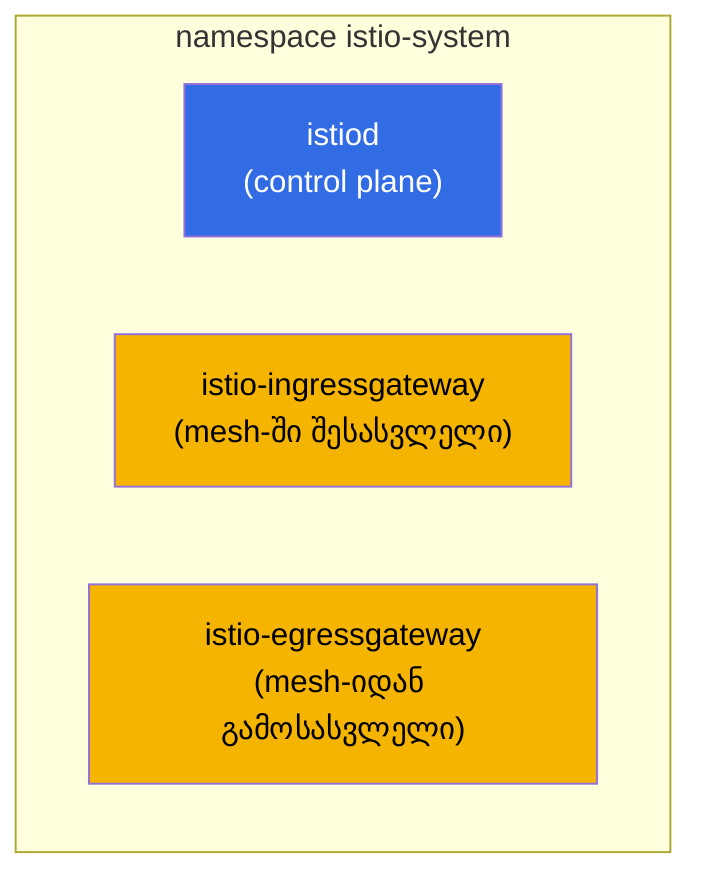
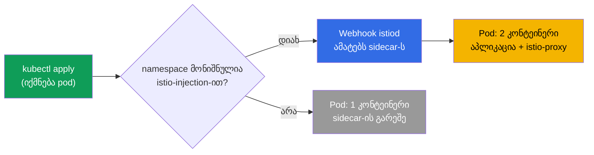
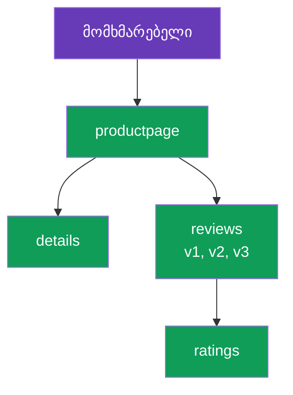

[Русская версия](ru.md) · [Eng version](en.md) · [Versión en español](es.md) · [Version française](fr.md) · [Deutsche Version](de.md) · [繁體中文版](tw.md) · [日本語版](jp.md)

# თავი 2. Istio-ს ინსტალაცია და კონფიგურაცია

> **რა გველის შემდეგ.** პირველ თავში mesh-ის იდეა და Istio-ს არქიტექტურა
> კონცეპტუალურ დონეზე განვიხილეთ. ახლა Istio-ს კლასტერში ხელით დავაყენებთ: დავაყენებთ
> CLI-ს, გავშლით control plane-ს, ჩავრთავთ sidecar-ის ინექციას, გავუშვებთ დემო
> აპლიკაციას და ვნახავთ, როგორ გადის ტრაფიკი mesh-ის გავლით. ბოლოს განვიხილავთ,
> როგორ მოვარგოთ ინსტალაცია ჩვენს მოთხოვნებს.

## 2.1. რას გავაკეთებთ

თავის გეგმა მარტივია და Istio-სთან მუშაობის რეალურ პირველ დღეს იმეორებს:

1. დავაყენოთ `istioctl` - Istio-ს მართვის მთავარი ინსტრუმენტი.
2. დავაყენოთ Istio კლასტერში (control plane და gateway-ები).
3. შევამოწმოთ, რომ ყველაფერი გაეშვა.
4. namespace-ზე ჩავრთოთ sidecar-ის ავტომატური ინექცია.
5. გავშალოთ დემო აპლიკაცია Bookinfo და დავრწმუნდეთ, რომ pod-ებმა sidecar მიიღეს.
6. აპლიკაცია გარედან ingress gateway-ის მეშვეობით გავხსნათ.
7. გავიგოთ, როგორ შეიცვალოს ინსტალაციის პარამეტრები (პროფილები, IstioOperator, MeshConfig).

## 2.2. istioctl: მთავარი ინსტრუმენტი

`istioctl` არის Istio-ს CLI, დაახლოებით ისე, როგორც `kubectl` Kubernetes-ისთვის. მისი
მეშვეობით აყენებთ Istio-ს, ამოწმებთ კონფიგურაციას, ადგენთ პრობლემების მიზეზებს და
ხედავთ, რეალურად რა არის Envoy-ს შიგნით. ამ თავში ის პირველ რიგში ინსტალაციისთვის
გვჭირდება.

ფიქსირებული ვერსიის ჩამოტვირთვა (ლაბებში გამოიყენება `1.29.1`, თუმცა აქტუალური
ვერსია istio.io-ზე შეამოწმეთ):

```bash
version=1.29.1
curl -L https://istio.io/downloadIstio | ISTIO_VERSION=$version sh -
sudo mv istio-$version/bin/istioctl /usr/local/bin/
istioctl version --remote=false
```

```
client version: 1.29.1
```

ალამი `--remote=false` მიუთითებს, რომ მხოლოდ კლიენტის ვერსია გამოჩნდეს და კლასტერს
არ მიმართოს (კლასტერში Istio ჯერ არ არის დაყენებული).

## 2.3. ინსტალაციის პროფილები

Istio შემთხვევითი პარამეტრებით კი არა, **პროფილის** მიხედვით ყენდება. პროფილი
კომპონენტებისა და მათი პარამეტრების მზა ნაკრებია. ყველაფრის ხელით ჩამოთვლა საჭირო
არ არის: ამოცანის შესაბამის პროფილს ირჩევთ.

| პროფილი | რას შეიცავს | როდის გამოვიყენოთ |
|---------|--------------|--------------------|
| `default` | istiod + ingress gateway | production-ის დასაწყებად, ნაგულისხმევად რეკომენდებული |
| `demo` | istiod + ingress + egress gateway, დეტალური ლოგები | სწავლებისა და დემოსთვის (ლაბებში ეს გამოიყენება) |
| `minimal` | მხოლოდ istiod | მორგებული აგება, gateway-ებს ცალკე აყენებთ |
| `empty` | არაფერი | სრულად ხელით კონფიგურაციის საფუძველი |
| `preview` | ექსპერიმენტული ფუნქციები | ახალი შესაძლებლობების შესამოწმებლად |
| `ambient` | ambient რეჟიმის კომპონენტები | sidecar-ების გარეშე მუშაობა (თავი 21) |

კურსსა და ლაბებში ვიყენებთ `demo`-ს: მასში უკვე შედის egress gateway და ჩართულია
დეტალური მეტრიკები და ლოგები, რაც სწავლისთვის მოსახერხებელია.

## 2.4. Istio-ს ინსტალაცია კლასტერში

უმარტივესი ვარიანტია ერთი ბრძანება პროფილის მითითებით:

```bash
istioctl install --set profile=demo -y
```

თუმცა ინსტალაციას უფრო ხშირად დეკლარაციულად, `IstioOperator` მანიფესტის მეშვეობით
აღწერენ. ლაბში 01 ზუსტად ასეა გაკეთებული: `demo` პროფილი და `NodePort` ტიპის ingress
 gateway ფიქსირებული პორტებით, რათა გარედან წვდომა მოსახერხებელი იყოს.

```yaml
apiVersion: install.istio.io/v1alpha1
kind: IstioOperator
spec:
  profile: demo
  components:
    ingressGateways:
    - name: istio-ingressgateway
      k8s:
        service:
          type: NodePort
          ports:
          - port: 80
            targetPort: 8080
            nodePort: 32080   # ფიქსირებული HTTP პორტი
            name: http2
          - port: 443
            targetPort: 8443
            nodePort: 32443   # ფიქსირებული HTTPS პორტი
            name: https
```

```bash
istioctl install -f istio-kubeadm.yaml -y
```

`IstioOperator` სასურველი ინსტალაციის აღწერაა. მას კვლავ დავუბრუნდებით 2.9
განყოფილებაში, როდესაც მორგებას განვიხილავთ.

## 2.5. რა გაჩნდა კლასტერში

ინსტალაციის შემდეგ ყველაფერი `istio-system` namespace-შია განთავსებული.



```bash
kubectl get pods -n istio-system
```

```
NAME                                    READY   STATUS    RESTARTS   AGE
istio-egressgateway-7f67df695d-z7jg5    1/1     Running   0          53s
istio-ingressgateway-76768cbcf6-l8rwt   1/1     Running   0          53s
istiod-76d6698857-wmvhs                 1/1     Running   0          61s
```

სამი pod:
- **istiod** - mesh-ის ტვინი (control plane).
- **istio-ingressgateway** - შესასვლელში განთავსებული Envoy, რომელიც ტრაფიკს გარედან იღებს.
- **istio-egressgateway** - გამოსასვლელში განთავსებული Envoy, კონტროლირებადი გამავალი
  ტრაფიკისთვის (egress დეტალურად მე-11 თავშია განხილული). ის სწორედ იმიტომ არსებობს,
  რომ არჩეულია `demo` პროფილი.

ინსტალაციის სისწორის შემოწმება ასე შეიძლება:

```bash
istioctl verify-install
```

## 2.6. sidecar injection-ის ჩართვა

Istio დაყენებულია, მაგრამ თქვენს აპლიკაციებთან ჯერ არაფერს აკეთებს. იმისათვის, რომ
pod-ებმა sidecar proxy მიიღონ, namespace სპეციალური label-ით უნდა მონიშნოთ:

```bash
kubectl label namespace default istio-injection=enabled
```

მუშაობის პრინციპი ასეთია: istiod-ს აქვს mutating admission webhook. მონიშნულ
namespace-ში pod-ის შექმნისას webhook მოთხოვნას იჭერს და pod-ის სპეციფიკაციას
უმატებს `istio-proxy` კონტეინერს (Envoy) და init container-ს, რომელიც iptables-ს
აკონფიგურირებს.



მნიშვნელოვანია: label მხოლოდ **ახალ** pod-ებზე მოქმედებს. თუ აპლიკაცია label-ის
დაყენებამდე უკვე მუშაობდა namespace-ში, მისი pod-ები თავიდან უნდა შეიქმნას:

```bash
kubectl rollout restart deployment -n default
```

## 2.7. დემო აპლიკაცია Bookinfo-ს გაშლა

Bookinfo Istio-ს ოფიციალური დემოა: წიგნის გვერდი, რომელსაც ოთხი სერვისი ქმნის. ის
მოსახერხებელია იმით, რომ `reviews` სერვისს თავიდანვე სამი ვერსია აქვს (v1, v2, v3),
რომლებზეც შემდეგ routing-სა და canary-ს გამოცდით.



ინსტალაცია Istio-ს ჩამოტვირთულ დისტრიბუტივში არსებული მაგალითებიდან სრულდება:

```bash
cd istio-1.29.1
kubectl apply -f samples/bookinfo/platform/kube/bookinfo.yaml
```

ვამოწმებთ pod-ებს:

```bash
kubectl get pods
```

```
NAME                              READY   STATUS    RESTARTS   AGE
details-v1-6cc9f5cc44-csr7h       2/2     Running   0          50s
productpage-v1-7f885b46fc-qqd29   2/2     Running   0          49s
ratings-v1-77b8b6df5b-kfdx8       2/2     Running   0          50s
reviews-v1-fdbf79cd8-zs7qf        2/2     Running   0          50s
reviews-v2-674c6d8b4-p5r65        2/2     Running   0          50s
reviews-v3-7b775c7568-m44z7       2/2     Running   0          50s
```

მთავარი მომენტია, რომ `READY` სვეტში წერია `2/2`. ეს ადასტურებს sidecar-ის
ინექციას: პირველი კონტეინერი აპლიკაციაა, მეორე კი Envoy. თუ ხედავთ `1/1`-ს, ესე იგი
ინექციამ არ იმუშავა. ხშირი მიზეზებია: namespace-ზე label არ არის დაყენებული ან
pod-ები label-ის დაყენებამდე შეიქმნა (ამ შემთხვევაში საჭიროა `rollout restart`).

## 2.8. აპლიკაციის გარედან გახსნა

ამჟამად Bookinfo მხოლოდ კლასტერის შიგნით მუშაობს. მასზე გარედან წვდომისთვის Istio-ს
ორი რესურსია საჭირო: `Gateway` (რას მოუსმინოს ingress gateway-მ) და `VirtualService`
(სად გადაამისამართოს ტრაფიკი). ამ რესურსებს დეტალურად მე-5 თავში განვიხილავთ, აქ კი
უბრალოდ მზა მაგალითს ვიყენებთ.

```bash
kubectl apply -f samples/bookinfo/networking/bookinfo-gateway.yaml
```

ingress gateway-ის NodePort-ის მეშვეობით წვდომას ვამოწმებთ (ლაბში ეს არის პორტი
`32080`):

```bash
curl -s http://myapp.local:32080/productpage | grep -o "<title>.*</title>"
```

```
<title>Simple Bookstore App</title>
```

თუ სათაური დაბრუნდა, ჯაჭვი მუშაობს: გარე მოთხოვნა ingress gateway-ზე მოხვდა, მან
ის `productpage` sidecar-ზე გადაამისამართა, შემდეგ კი მოთხოვნა mesh-ის გავლით სხვა
სერვისებისკენ წავიდა. ეს ზუსტად ის ტრაფიკის გზაა, რომელიც პირველ თავში დავხატეთ.

## 2.9. ინსტალაციის მორგება: IstioOperator და MeshConfig

დასაწყებად პროფილი საკმარისია, მაგრამ რეალურ გარემოში ინსტალაციას თითქმის ყოველთვის
არგებენ მოთხოვნებს. ამისთვის პარამეტრების ორი დონე არსებობს და მნიშვნელოვანია, ისინი
ერთმანეთში არ აგვერიოს.

- **IstioOperator** - რა და როგორ გაიშალოს: რომელი კომპონენტები ჩაირთოს, რა ტიპის
  იყოს gateway-ის სერვისი, რამდენი replica და რა რესურსები ჰქონდეს. ეს ინსტალაციის
  ინფრასტრუქტურას ეხება.
- **MeshConfig** - როგორ იქცევა თავად mesh: access log-ების ფორმატი, tracing-ის
  პარამეტრები, ნაგულისხმევი policy-ები. ეს უკვე მოქმედი mesh-ის ქცევას ეხება.
  MeshConfig განისაზღვრება IstioOperator-ის შიგნით, `meshConfig` ველში.

მაგალითი ორივე დონით: ვცვლით ingress gateway-ის სერვისის ტიპს და მთელი mesh-ისთვის
access log-ებს ვრთავთ.

```yaml
apiVersion: install.istio.io/v1alpha1
kind: IstioOperator
spec:
  profile: default
  meshConfig:
    accessLogFile: /dev/stdout        # Envoy-ს access-ლოგების ჩართვა
  components:
    ingressGateways:
    - name: istio-ingressgateway
      enabled: true
      k8s:
        service:
          type: LoadBalancer          # gateway-ის სერვისის ტიპი
        resources:
          requests:
            cpu: 100m
            memory: 128Mi
```

```bash
istioctl install -f my-istio.yaml -y
```

ინსტალაცია დეკლარაციულია: ასწორებთ ფაილს, კვლავ უშვებთ `istioctl install -f`-ს და
Istio კლასტერს აღწერილ მდგომარეობამდე მიჰყავს. ინსტალაციის მორგებას დეტალურად მე-15
ლაბში ვამუშავებთ.

## 2.10. ინსტალაციის სხვა გზები (მოკლედ)

- **Helm.** Istio Helm chart-ებითაც ყენდება (`istio/base` + `istio/istiod`). ეს გზა
  მოსახერხებელია GitOps-ისთვის და, რაც მთავარია, revision-ების მეშვეობით უსაფრთხო
  განახლებებისთვის. მას მე-3 თავი ეძღვნება.
- **istioctl** (ჩვენი გზა) - ყველაზე პირდაპირი გზა დასაწყებად და სასწავლად.

მეთოდის არჩევანი გავლენას არ ახდენს იმაზე, თუ რას მივიღებთ კლასტერში: ორივე
შემთხვევაში ეს არის istiod და Envoy. განსხვავება მათი მართვის გზაშია.

## 2.11. Istio-ს წაშლა

სასარგებლოა ვიცოდეთ, როგორ დავაბრუნოთ ყველაფერი საწყის მდგომარეობაში:

```bash
istioctl uninstall --purge -y
kubectl delete namespace istio-system
kubectl label namespace default istio-injection-
```

ბოლო ბრძანება namespace-ს label-ს ხსნის (ბოლოში მინუსი label-ის წასაშლელად
გამოყენებული kubectl-ის სინტაქსია).

## 2.12. თავის შეჯამება

- `istioctl` მთავარი ინსტრუმენტია; ის ჩვეულებრივი binary-ის მსგავსად ყენდება.
- Istio პროფილის მიხედვით ყენდება; დასაწყებად გამოდგება `default`, სასწავლად კი `demo`.
- ინსტალაციის შემდეგ `istio-system`-ში ჩნდება istiod და gateway-ები (ingress, ხოლო
  demo-ში ასევე egress).
- Sidecar ავტომატურად webhook-ის მეშვეობით ინერგება, მაგრამ მხოლოდ
  `istio-injection=enabled` label-ის მქონე namespace-ში და მხოლოდ ახალ pod-ებში.
- mesh-ში მოქცეულ pod-ებზე ჩანს `2/2`; ეს ინექციის წარმატების მთავარი ნიშანია.
- გარედან წვდომა Gateway-ისა და VirtualService-ის მეშვეობით კონფიგურირდება
  (დეტალურად მე-5 თავში).
- ინსტალაცია ორ დონეზე კონფიგურირდება: IstioOperator (რა გაიშალოს) და MeshConfig
  (როგორ იქცევა mesh).

## 2.13. თვითშემოწმების კითხვები

1. რით განსხვავდება `demo` პროფილი `default`-ისგან? რატომ გამოიყენება ლაბებში `demo`?
2. კონკრეტულად რა ჩნდება `istio-system` namespace-ში ინსტალაციის შემდეგ?
3. როგორ მუშაობს sidecar-ის ავტომატური ინექცია? რატომ არ მოქმედებს label უკვე
   გაშვებულ pod-ებზე?
4. ინექციის label-ის მქონე namespace-ში ხედავთ pod-ს სტატუსით `1/1`. რა შეიძლება
   იყოს მიზეზი და როგორ გამოასწორებთ?
5. რა განსხვავებაა IstioOperator-სა და MeshConfig-ს შორის?

## პრაქტიკა

გაიარეთ ინსტალაციის ლაბი: დააყენებთ istioctl-ს, გაშლით Istio-ს `demo` პროფილით,
ჩართავთ ინექციას, გაუშვებთ Bookinfo-ს და გარედან გახსნით.

🧪 ლაბი 01: [tasks/ica/labs/01](../../labs/01/README_GE.MD)

ინსტალაციის მორგება (IstioOperator და MeshConfig) ცალკე დაამუშავეთ:

🧪 ლაბი 15: [tasks/ica/labs/15](../../labs/15/README_GE.MD)

---
[სარჩევი](../README_GE.md) · [თავი 1](../01/ge.md) · [თავი 3](../03/ge.md)