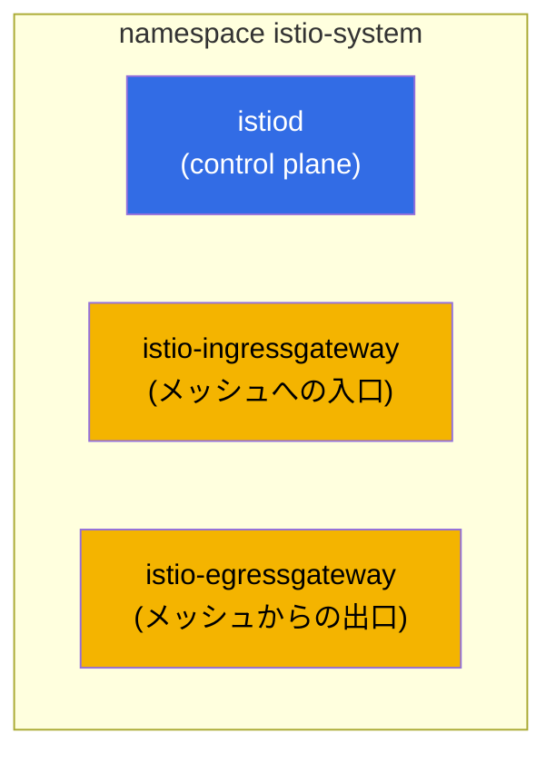
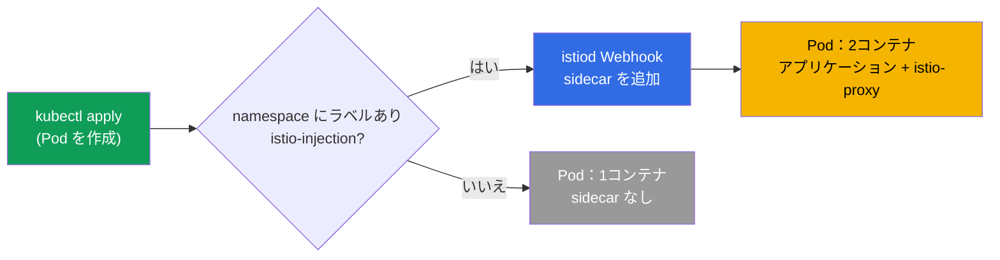
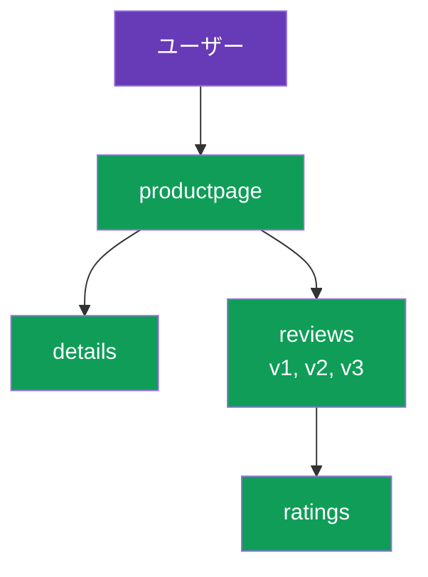

[Русская версия](ru.md) · [Eng version](en.md) · [Versión en español](es.md) · [Version française](fr.md) · [Deutsche Version](de.md) · [ქართული ვერსია](ge.md) · [繁體中文版](tw.md)

# 第2章：Istio のインストールと設定

> **この先について。** 第1章では、メッシュの考え方と Istio のアーキテクチャを概念レベルで
> 学びました。ここからは Istio を手作業でクラスターに導入します。CLI をインストールし、control
> plane をデプロイし、sidecar のインジェクションを有効化して、デモアプリケーションを起動し、トラフィックが
> mesh を通過する様子を確認します。最後に、要件に合わせてインストールを設定する方法を見ていきます。

## 2.1. これから行うこと

この章の流れはシンプルで、Istio を使い始める実際の初日に行う作業と同じです。

1. Istio を管理する主要ツールである `istioctl` をインストールする。
2. Istio をクラスターにインストールする（control plane と gateway）。
3. すべてが起動したことを確認する。
4. namespace で自動 sidecar インジェクションを有効にする。
5. Bookinfo デモアプリケーションをデプロイし、Pod に sidecar が追加されたことを確認する。
6. ingress gateway 経由でアプリケーションを外部公開する。
7. インストールパラメータ（プロファイル、IstioOperator、MeshConfig）の変更方法を理解する。

## 2.2. istioctl：主要ツール

`istioctl` は Istio 用の CLI で、Kubernetes の `kubectl` に相当します。これを使って
Istio をインストールし、設定を検証し、問題を診断し、Envoy の内部に実際に何が存在するかを
確認します。この章では、主にインストールのために使用します。

固定バージョンをダウンロードします（ラボでは `1.29.1` を使用しますが、istio.io で最新版を
確認してください）。

```bash
version=1.29.1
curl -L https://istio.io/downloadIstio | ISTIO_VERSION=$version sh -
sudo mv istio-$version/bin/istioctl /usr/local/bin/
istioctl version --remote=false
```

```
client version: 1.29.1
```

`--remote=false` フラグは、クラスターにアクセスせずクライアントのバージョンだけを表示します
（クラスターにはまだ Istio がインストールされていません）。

## 2.3. インストールプロファイル

Istio は場当たり的にインストールするのではなく、**プロファイル**を指定します。プロファイルとは、
コンポーネントとその設定をあらかじめまとめたセットです。すべてを手作業で列挙する必要はなく、
目的に合うプロファイルを選択します。

| プロファイル | 含まれるもの | 使用する場面 |
|---------|--------------|--------------------|
| `default` | istiod + ingress gateway | 本番運用の開始時、推奨されるデフォルト |
| `demo` | istiod + ingress + egress gateway、詳細ログ | 学習とデモ（ラボで使用） |
| `minimal` | istiod のみ | カスタム構成、gateway は別途インストール |
| `empty` | なし | 完全手動設定のベース |
| `preview` | 実験的機能 | 新機能の検証 |
| `ambient` | ambient モードのコンポーネント | sidecar なしの運用（第21章） |

このコースとラボでは `demo` を使います。egress gateway が含まれており、詳細なメトリクスとログが
有効になっているため、学習に便利です。

## 2.4. クラスターへの Istio のインストール

最も簡単な方法は、プロファイルを指定する1コマンドです。

```bash
istioctl install --set profile=demo -y
```

ただし、インストールは `IstioOperator` マニフェストを使って宣言的に記述することが一般的です。
ラボ 01 ではこの方法を使います。`demo` プロファイルに加え、外部からアクセスしやすいよう固定ポートを
持つ `NodePort` タイプの ingress gateway を設定しています。

```yaml
apiVersion: install.istio.io/v1alpha1
kind: IstioOperator
spec:
  profile: demo
  components:
    ingressGateways:
    - name: istio-ingressgateway
      k8s:
        service:
          type: NodePort
          ports:
          - port: 80
            targetPort: 8080
            nodePort: 32080   # 固定 HTTP ポート
            name: http2
          - port: 443
            targetPort: 8443
            nodePort: 32443   # 固定 HTTPS ポート
            name: https
```

```bash
istioctl install -f istio-kubeadm.yaml -y
```

`IstioOperator` は、望ましいインストール内容を記述したものです。カスタマイズを扱う 2.9 節で、
もう一度取り上げます。

## 2.5. クラスターに追加されたもの

インストール後、すべては `istio-system` namespace に配置されます。



```bash
kubectl get pods -n istio-system
```

```
NAME                                    READY   STATUS    RESTARTS   AGE
istio-egressgateway-7f67df695d-z7jg5    1/1     Running   0          53s
istio-ingressgateway-76768cbcf6-l8rwt   1/1     Running   0          53s
istiod-76d6698857-wmvhs                 1/1     Running   0          61s
```

3つの Pod があります。
- **istiod**：mesh の頭脳（control plane）。
- **istio-ingressgateway**：入口の Envoy。外部からのトラフィックを受信します。
- **istio-egressgateway**：出口の Envoy。制御されたアウトバウンドトラフィックのために使用します
  （egress は第11章で詳しく扱います）。これは `demo` プロファイルに含まれます。

インストールが正しいことは、次のように確認できます。

```bash
istioctl verify-install
```

## 2.6. sidecar injection を有効にする

Istio はインストール済みですが、まだアプリケーションには何も行いません。Pod に sidecar-proxy を
追加するには、namespace に特別なラベルを付ける必要があります。

```bash
kubectl label namespace default istio-injection=enabled
```

仕組みは次のとおりです。istiod には mutating admission webhook があります。ラベル付きの
namespace に Pod が作成されると、webhook がリクエストをインターセプトし、Pod の仕様に
`istio-proxy`（Envoy）コンテナと、iptables を設定する init コンテナを追加します。



重要：このラベルが適用されるのは**新しい** Pod だけです。ラベルを付ける前にアプリケーションが
namespace で動作していた場合、その Pod を再作成する必要があります。

```bash
kubectl rollout restart deployment -n default
```

## 2.7. Bookinfo デモアプリケーションをデプロイする

Bookinfo は Istio の公式デモです。4つのサービスで構成される書籍ページです。サービス `reviews` には
初めから3つのバージョン（v1、v2、v3）があり、後でルーティングと canary を練習できます。



ダウンロードした Istio ディストリビューションに含まれるサンプルからインストールします。

```bash
cd istio-1.29.1
kubectl apply -f samples/bookinfo/platform/kube/bookinfo.yaml
```

Pod を確認します。

```bash
kubectl get pods
```

```
NAME                              READY   STATUS    RESTARTS   AGE
details-v1-6cc9f5cc44-csr7h       2/2     Running   0          50s
productpage-v1-7f885b46fc-qqd29   2/2     Running   0          49s
ratings-v1-77b8b6df5b-kfdx8       2/2     Running   0          50s
reviews-v1-fdbf79cd8-zs7qf        2/2     Running   0          50s
reviews-v2-674c6d8b4-p5r65        2/2     Running   0          50s
reviews-v3-7b775c7568-m44z7       2/2     Running   0          50s
```

重要なのは、`READY` 列が `2/2` と表示されることです。これは sidecar が追加されたことの確認です。
1つ目のコンテナがアプリケーション、2つ目が Envoy です。`1/1` と表示される場合は、インジェクションが
機能していません。よくある原因は、namespace にラベルが付いていないこと、またはラベルを付ける前に
Pod を作成したことです（その場合は `rollout restart` が必要です）。

## 2.8. アプリケーションを外部公開する

現在、Bookinfo はクラスター内でのみ動作しています。外部からアクセスするには、2つの Istio リソースが
必要です。`Gateway`（ingress gateway で何をリッスンするか）と `VirtualService`（トラフィックをどこに
送るか）です。これらのリソースは第5章で詳しく扱います。ここでは、完成済みのサンプルを適用するだけです。

```bash
kubectl apply -f samples/bookinfo/networking/bookinfo-gateway.yaml
```

ingress gateway の NodePort 経由でアクセスを確認します（ラボではポート `32080` です）。

```bash
curl -s http://myapp.local:32080/productpage | grep -o "<title>.*</title>"
```

```
<title>Simple Bookstore App</title>
```

タイトルが返れば、チェーンは動作しています。外部リクエストが ingress gateway に到達し、そこから
`productpage` の sidecar に送られ、さらに mesh を通って他のサービスへ送信されます。これはまさに、
第1章で図示したトラフィックパスです。

## 2.9. インストールのカスタマイズ：IstioOperator と MeshConfig

プロファイルは開始には十分ですが、実運用ではほぼ常にインストールを調整します。そのための設定レベルは
2つあり、混同しないことが重要です。

- **IstioOperator**：何をどのようにデプロイするか。どのコンポーネントを有効にするか、gateway サービスを
  どのタイプにするか、レプリカ数やリソースはいくつかを指定します。これはインストールの
  インフラストラクチャに関するものです。
- **MeshConfig**：mesh 自体の動作。access-log の形式、tracing の設定、デフォルトポリシーを指定します。
  これは、すでに動作している mesh の振る舞いに関するものです。MeshConfig は IstioOperator 内の
  `meshConfig` フィールドで指定します。

両方のレベルを一度に指定する例です。ingress gateway のサービスタイプを変更し、mesh 全体の
access-log を有効にします。

```yaml
apiVersion: install.istio.io/v1alpha1
kind: IstioOperator
spec:
  profile: default
  meshConfig:
    accessLogFile: /dev/stdout        # Envoy の access ログを有効化
  components:
    ingressGateways:
    - name: istio-ingressgateway
      enabled: true
      k8s:
        service:
          type: LoadBalancer          # gateway のサービスタイプ
        resources:
          requests:
            cpu: 100m
            memory: 128Mi
```

```bash
istioctl install -f my-istio.yaml -y
```

インストールは宣言的です。ファイルを作成し、再び `istioctl install -f` を実行すると、Istio が
クラスターを記述された状態に合わせます。インストールのカスタマイズはラボ 15 で詳しく練習します。

## 2.10. その他のインストール方法（概要）

- **Helm。** Istio は Helm チャート（`istio/base` + `istio/istiod`）でもインストールできます。この方法は
  GitOps に適しており、特にリビジョンによる安全なアップグレードに有用です。第3章で扱います。
- **istioctl**（本章の方法）：開始と学習に最も直接的な方法です。

方法の選択は、クラスターに作成されるものには影響しません。どちらの場合も istiod と Envoy です。違いは、
それらを管理する方法にあります。

## 2.11. Istio の削除

すべてを元に戻す方法も知っておくと便利です。

```bash
istioctl uninstall --purge -y
kubectl delete namespace istio-system
kubectl label namespace default istio-injection-
```

最後のコマンドは namespace からラベルを削除します（末尾のマイナスはラベルを削除するための kubectl
構文です）。

## 2.12. この章のまとめ

- `istioctl` は主要ツールであり、通常のバイナリとしてインストールできます。
- Istio はプロファイルに従ってインストールされます。開始には `default`、学習には `demo` が適しています。
- インストール後、`istio-system` には istiod と gateway（ingress、および demo では egress も）が
  作成されます。
- Sidecar は webhook により自動追加されますが、`istio-injection=enabled` ラベルのある namespace 内の
  新しい Pod に対してのみです。
- mesh 内の Pod は `2/2` と表示されます。これはインジェクションが機能した最も重要な目印です。
- 外部アクセスは Gateway と VirtualService で設定します（詳しくは第5章）。
- インストールは、IstioOperator（何をデプロイするか）と MeshConfig（mesh の動作）の2つのレベルで
  設定します。

## 2.13. 理解度チェック

1. `demo` プロファイルは `default` と何が異なりますか。ラボで `demo` を使うのはなぜですか。
2. インストール後、`istio-system` namespace には具体的に何が作成されますか。
3. 自動 sidecar インジェクションはどのように機能しますか。ラベルがすでに動作中の Pod に影響しないのは
   なぜですか。
4. インジェクションラベル付きの namespace で `1/1` ステータスの Pod が見えます。どのような原因が考えられ、
   どう修正しますか。
5. IstioOperator と MeshConfig の違いは何ですか。

## 演習

インストール用ラボを実施してください。istioctl をインストールし、`demo` プロファイルで Istio を
デプロイし、インジェクションを有効にして Bookinfo を起動し、外部公開します。

🧪 ラボ 01：[tasks/ica/labs/01](../../labs/01/README_JP.MD)

インストールのカスタマイズ（IstioOperator と MeshConfig）は別途練習してください。

🧪 ラボ 15：[tasks/ica/labs/15](../../labs/15/README_JP.MD)

---
[目次](../README_JP.md) · [第1章](../01/jp.md) · [第3章](../03/jp.md)
