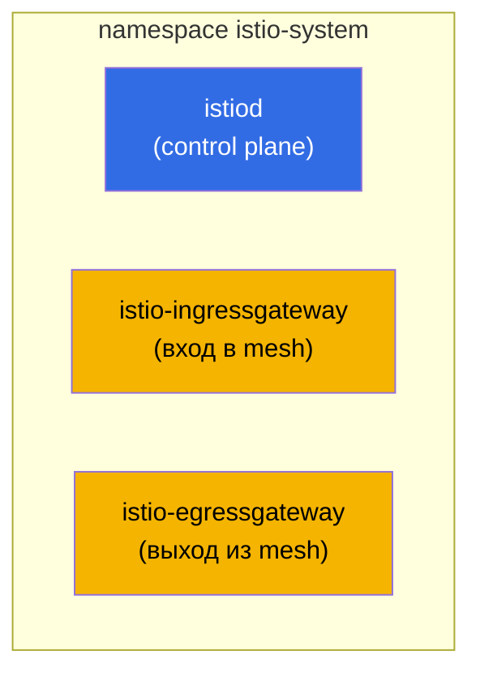
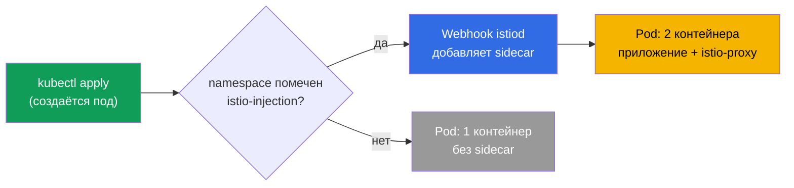
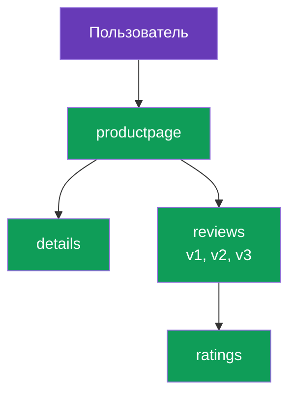

[Eng version](en.md)

# Глава 2. Установка и конфигурация Istio

> **Что дальше.** В главе 1 мы разобрали идею меша и архитектуру Istio на уровне
> понятий. Теперь ставим Istio в кластер руками: установим CLI, развернём control
> plane, включим внедрение sidecar, поднимем демо-приложение и увидим, как трафик
> идёт через mesh. В конце разберём, как настраивать установку под свои требования.

## 2.1. Что мы будем делать

План главы простой и повторяет реальный первый день с Istio:

1. Поставить `istioctl` - основной инструмент управления Istio.
2. Установить Istio в кластер (control plane и шлюзы).
3. Проверить, что всё поднялось.
4. Включить автоматическое внедрение sidecar на namespace.
5. Развернуть демо-приложение Bookinfo и убедиться, что поды получили sidecar.
6. Открыть приложение снаружи через ingress gateway.
7. Понять, как менять параметры установки (профили, IstioOperator, MeshConfig).

## 2.2. istioctl: основной инструмент

`istioctl` - это CLI для Istio, примерно как `kubectl` для Kubernetes. Через него вы
ставите Istio, проверяете конфигурацию, диагностируете проблемы и смотрите, что
реально лежит внутри Envoy. В этой главе он нужен в первую очередь для установки.

Скачивание фиксированной версии (в лабах используется `1.29.1`, но проверьте актуальную
на istio.io):

```bash
version=1.29.1
curl -L https://istio.io/downloadIstio | ISTIO_VERSION=$version sh -
sudo mv istio-$version/bin/istioctl /usr/local/bin/
istioctl version --remote=false
```

```
client version: 1.29.1
```

Флаг `--remote=false` говорит показать только версию клиента, не обращаясь к кластеру
(в кластере Istio ещё не установлен).

## 2.3. Профили установки

Istio ставится не «как получится», а по **профилю**. Профиль - это готовый набор
компонентов и их настроек. Не нужно перечислять всё вручную: выбираете профиль под
задачу.

| Профиль | Что включает | Когда использовать |
|---------|--------------|--------------------|
| `default` | istiod + ingress gateway | Продакшн-старт, рекомендуемый по умолчанию |
| `demo` | istiod + ingress + egress gateway, подробные логи | Обучение и демо (его берут лабы) |
| `minimal` | только istiod | Кастомная сборка, шлюзы ставите отдельно |
| `empty` | ничего | База для полностью ручной настройки |
| `preview` | экспериментальные фичи | Проверка новых возможностей |
| `ambient` | компоненты ambient-режима | Работа без сайдкаров (глава 21) |

В курсе и лабах мы берём `demo`: в него уже входит egress gateway и включены подробные
метрики и логи, что удобно для изучения.

## 2.4. Установка Istio в кластер

Самый простой вариант - одна команда с указанием профиля:

```bash
istioctl install --set profile=demo -y
```

Но чаще установку описывают декларативно, через манифест `IstioOperator`. В лабе 01
так и сделано: профиль `demo` плюс ingress gateway типа `NodePort` с фиксированными
портами, чтобы удобно ходить снаружи.

```yaml
apiVersion: install.istio.io/v1alpha1
kind: IstioOperator
spec:
  profile: demo
  components:
    ingressGateways:
    - name: istio-ingressgateway
      k8s:
        service:
          type: NodePort
          ports:
          - port: 80
            targetPort: 8080
            nodePort: 32080   # фиксированный HTTP порт
            name: http2
          - port: 443
            targetPort: 8443
            nodePort: 32443   # фиксированный HTTPS порт
            name: https
```

```bash
istioctl install -f istio-kubeadm.yaml -y
```

`IstioOperator` - это описание желаемой установки. Мы ещё вернёмся к нему в разделе
2.9, когда будем разбирать кастомизацию.

## 2.5. Что появилось в кластере

После установки всё живёт в namespace `istio-system`.



```bash
kubectl get pods -n istio-system
```

```
NAME                                    READY   STATUS    RESTARTS   AGE
istio-egressgateway-7f67df695d-z7jg5    1/1     Running   0          53s
istio-ingressgateway-76768cbcf6-l8rwt   1/1     Running   0          53s
istiod-76d6698857-wmvhs                 1/1     Running   0          61s
```

Три пода:
- **istiod** - мозг mesh (control plane).
- **istio-ingressgateway** - Envoy на входе, принимает трафик снаружи.
- **istio-egressgateway** - Envoy на выходе, для контролируемого исходящего трафика
  (egress подробно в главе 11). Он есть именно потому, что профиль `demo`.

Проверить корректность установки можно так:

```bash
istioctl verify-install
```

## 2.6. Включение sidecar injection

Istio установлен, но он пока ничего не делает с вашими приложениями. Чтобы поды
получали sidecar-прокси, нужно пометить namespace специальной меткой:

```bash
kubectl label namespace default istio-injection=enabled
```

Как это работает: у istiod есть mutating admission webhook. Когда в помеченном
namespace создаётся под, webhook перехватывает запрос и дописывает в спецификацию
пода контейнер `istio-proxy` (Envoy) и init-контейнер, который настраивает iptables.



Важно: метка действует только на **новые** поды. Если приложение уже работало в
namespace до установки метки, его поды надо пересоздать:

```bash
kubectl rollout restart deployment -n default
```

## 2.7. Разворачиваем демо-приложение Bookinfo

Bookinfo - это официальное демо Istio: страница книги, которую собирают четыре
сервиса. Оно удобно тем, что у сервиса `reviews` сразу три версии (v1, v2, v3), на
которых потом отрабатывают маршрутизацию и canary.



Установка идёт из примеров, которые лежат в скачанном дистрибутиве Istio:

```bash
cd istio-1.29.1
kubectl apply -f samples/bookinfo/platform/kube/bookinfo.yaml
```

Проверяем поды:

```bash
kubectl get pods
```

```
NAME                              READY   STATUS    RESTARTS   AGE
details-v1-6cc9f5cc44-csr7h       2/2     Running   0          50s
productpage-v1-7f885b46fc-qqd29   2/2     Running   0          49s
ratings-v1-77b8b6df5b-kfdx8       2/2     Running   0          50s
reviews-v1-fdbf79cd8-zs7qf        2/2     Running   0          50s
reviews-v2-674c6d8b4-p5r65        2/2     Running   0          50s
reviews-v3-7b775c7568-m44z7       2/2     Running   0          50s
```

Ключевой момент - колонка `READY` показывает `2/2`. Это и есть подтверждение, что
sidecar внедрился: первый контейнер это приложение, второй это Envoy. Если видите
`1/1`, значит инъекция не сработала. Частые причины: не стоит метка на namespace или
поды создали до того, как метку поставили (тогда нужен `rollout restart`).

## 2.8. Открываем приложение снаружи

Сейчас Bookinfo работает только внутри кластера. Чтобы попасть на него снаружи, нужны
два ресурса Istio: `Gateway` (что слушать на ingress-шлюзе) и `VirtualService` (куда
направить трафик). Подробно эти ресурсы разберём в главе 5, здесь просто применяем
готовый пример.

```bash
kubectl apply -f samples/bookinfo/networking/bookinfo-gateway.yaml
```

Проверяем доступ через NodePort ingress-шлюза (в лабе это порт `32080`):

```bash
curl -s http://myapp.local:32080/productpage | grep -o "<title>.*</title>"
```

```
<title>Simple Bookstore App</title>
```

Если заголовок вернулся, значит цепочка работает: внешний запрос попал на ingress
gateway, тот направил его на sidecar `productpage`, а дальше запрос пошёл по mesh к
остальным сервисам. Ровно тот путь трафика, что мы рисовали в главе 1.

## 2.9. Кастомизация установки: IstioOperator и MeshConfig

Профиля хватает для старта, но в реальной жизни установку почти всегда подстраивают.
Для этого есть два уровня настроек, и их важно не путать.

- **IstioOperator** - что и как разворачивать: какие компоненты включить, какого типа
  сделать сервис шлюза, сколько реплик, какие ресурсы. Это про инфраструктуру
  установки.
- **MeshConfig** - как ведёт себя сам mesh: формат access-логов, настройки трейсинга,
  политики по умолчанию. Это про поведение уже работающего mesh. MeshConfig задаётся
  внутри IstioOperator, в поле `meshConfig`.

Пример с обоими уровнями сразу: меняем тип сервиса ingress-шлюза и включаем
access-логи для всего mesh.

```yaml
apiVersion: install.istio.io/v1alpha1
kind: IstioOperator
spec:
  profile: default
  meshConfig:
    accessLogFile: /dev/stdout        # включить access-логи Envoy
  components:
    ingressGateways:
    - name: istio-ingressgateway
      enabled: true
      k8s:
        service:
          type: LoadBalancer          # тип сервиса шлюза
        resources:
          requests:
            cpu: 100m
            memory: 128Mi
```

```bash
istioctl install -f my-istio.yaml -y
```

Установка декларативна: правите файл, снова запускаете `istioctl install -f`, и Istio
приводит кластер к описанному состоянию. Детально кастомизацию установки отрабатываем
в лабе 15.

## 2.10. Другие способы установки (кратко)

- **Helm.** Istio ставится и через Helm-чарты (`istio/base` + `istio/istiod`). Этот
  путь удобен для GitOps и, главное, для безопасных обновлений через ревизии. Ему
  посвящена глава 3.
- **istioctl** (наш способ) - самый прямой для старта и обучения.

Выбор способа не влияет на то, что получится в кластере: и там, и там это istiod и
Envoy. Разница в том, как вы этим управляете.

## 2.11. Удаление Istio

Полезно знать, как откатить всё назад:

```bash
istioctl uninstall --purge -y
kubectl delete namespace istio-system
kubectl label namespace default istio-injection-
```

Последняя команда снимает метку с namespace (минус в конце это синтаксис kubectl для
удаления метки).

## 2.12. Итоги главы

- `istioctl` - основной инструмент; ставится как обычный бинарник.
- Istio устанавливается по профилю; для старта подходит `default`, для обучения `demo`.
- После установки в `istio-system` появляются istiod и шлюзы (ingress, а в demo ещё и
  egress).
- Sidecar внедряется автоматически через webhook, но только в namespace с меткой
  `istio-injection=enabled` и только в новые поды.
- Поды в mesh показывают `2/2`; это главный признак, что инъекция сработала.
- Доступ снаружи настраивается через Gateway и VirtualService (подробно в главе 5).
- Установку настраивают на двух уровнях: IstioOperator (что разворачивать) и
  MeshConfig (как ведёт себя mesh).

## 2.13. Вопросы для самопроверки

1. Чем отличается профиль `demo` от `default`? Почему в лабах используется `demo`?
2. Что именно появляется в namespace `istio-system` после установки?
3. Как работает автоматическое внедрение sidecar? Почему метка не влияет на уже
   работающие поды?
4. Вы видите под со статусом `1/1` в namespace с меткой инъекции. В чём может быть
   причина и как починить?
5. В чём разница между IstioOperator и MeshConfig?

## Практика

Пройдите лабу по установке: вы поставите istioctl, развернёте Istio с профилем
`demo`, включите инъекцию, поднимете Bookinfo и откроете его снаружи.

🧪 Лаба 01: [tasks/ica/labs/01](../../labs/01/README_RU.MD)

Кастомизацию установки (IstioOperator и MeshConfig) отработайте отдельно:

🧪 Лаба 15: [tasks/ica/labs/15](../../labs/15/README_RU.MD)

---
[Оглавление](../README.md) · [Глава 1](../01/ru.md) · [Глава 3](../03/ru.md)
