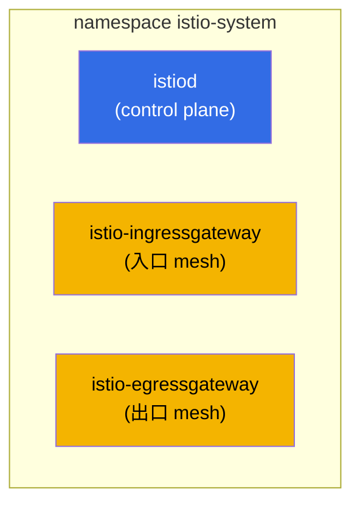
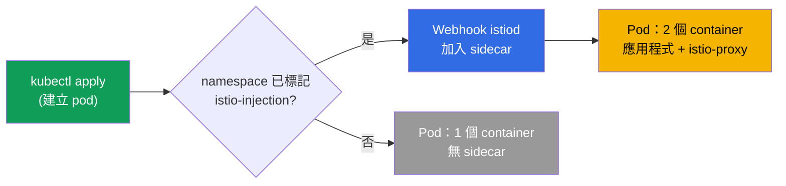
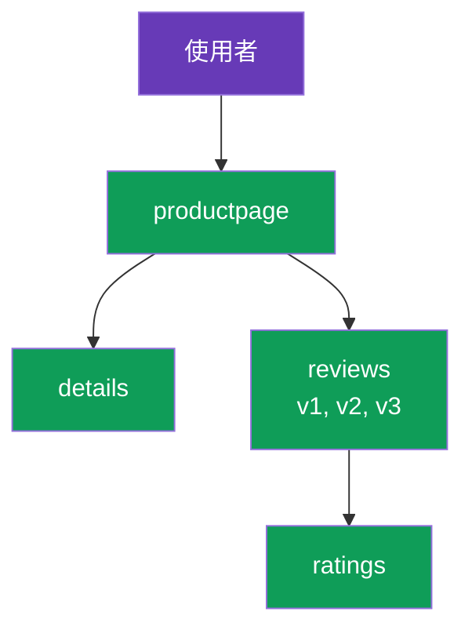

[Русская версия](ru.md) · [Eng version](en.md) · [Versión en español](es.md) · [Version française](fr.md) · [Deutsche Version](de.md) · [ქართული ვერსია](ge.md) · [日本語版](jp.md)

# 第 2 章：安裝與設定 Istio

> **接下來。** 在第 1 章中，我們從概念層面了解了 service mesh 的構想與 Istio 架構。現在要親手在叢集中安裝 Istio：安裝 CLI、部署 control plane、啟用 sidecar 注入、啟動示範應用程式，並觀察流量如何通過 mesh。最後，我們會了解如何依照自身需求設定安裝。

## 2.1. 我們要做什麼

本章的計畫很簡單，與實際使用的第一天相同：

1. 安裝 `istioctl` -- Istio 的主要管理工具。
2. 在叢集中安裝 Istio（control plane 與 gateway）。
3. 驗證所有元件都已啟動。
4. 為 namespace 啟用自動 sidecar 注入。
5. 部署 Bookinfo 示範應用程式，並確認 pod 已取得 sidecar。
6. 透過 ingress gateway 從外部開啟應用程式。
7. 了解如何變更安裝參數（profile、IstioOperator、MeshConfig）。

## 2.2. istioctl：主要工具

`istioctl` 是 Istio 的 CLI，類似 Kubernetes 的 `kubectl`。可透過它安裝 Istio、檢查設定、診斷問題，以及查看 Envoy 實際內部的內容。本章中，它主要用於安裝。

下載固定版本（實驗使用 `1.29.1`，但請在 istio.io 確認最新版本）：

```bash
version=1.29.1
curl -L https://istio.io/downloadIstio | ISTIO_VERSION=$version sh -
sudo mv istio-$version/bin/istioctl /usr/local/bin/
istioctl version --remote=false
```

```
client version: 1.29.1
```

`--remote=false` 旗標表示只顯示用戶端版本，不會連線至叢集（叢集中尚未安裝 Istio）。

## 2.3. 安裝 profile

Istio 並非隨意安裝，而是依照**profile** 安裝。profile 是元件及其設定的預先組合。不需要手動逐一列出所有項目：只要選擇適合工作的 profile。

| Profile | 包含內容 | 使用時機 |
|---------|--------------|--------------------|
| `default` | istiod + ingress gateway | 正式環境起點，建議的預設值 |
| `demo` | istiod + ingress + egress gateway、詳細日誌 | 學習與示範（實驗使用此 profile） |
| `minimal` | 僅 istiod | 自訂組合，gateway 另行安裝 |
| `empty` | 無 | 完全手動設定的基礎 |
| `preview` | 實驗性功能 | 測試新功能 |
| `ambient` | ambient 模式元件 | 不使用 sidecar 的運作方式（第 21 章） |

在課程與實驗中，我們使用 `demo`：它已包含 egress gateway，並啟用詳細的 metrics 與日誌，便於學習。

## 2.4. 在叢集中安裝 Istio

最簡單的方式是一條指定 profile 的指令：

```bash
istioctl install --set profile=demo -y
```

但更常見的是透過 `IstioOperator` manifest 以宣告方式描述安裝。實驗 01 正是這樣做：使用 `demo` profile，加上具固定連接埠的 `NodePort` 類型 ingress gateway，以便從外部存取。

```yaml
apiVersion: install.istio.io/v1alpha1
kind: IstioOperator
spec:
  profile: demo
  components:
    ingressGateways:
    - name: istio-ingressgateway
      k8s:
        service:
          type: NodePort
          ports:
          - port: 80
            targetPort: 8080
            nodePort: 32080   # 固定的 HTTP 連接埠
            name: http2
          - port: 443
            targetPort: 8443
            nodePort: 32443   # 固定的 HTTPS 連接埠
            name: https
```

```bash
istioctl install -f istio-kubeadm.yaml -y
```

`IstioOperator` 是所需安裝狀態的描述。我們會在 2.9 節討論自訂設定時再次回到它。

## 2.5. 叢集中出現了什麼

安裝後，所有元件都位於 `istio-system` namespace。



```bash
kubectl get pods -n istio-system
```

```
NAME                                    READY   STATUS    RESTARTS   AGE
istio-egressgateway-7f67df695d-z7jg5    1/1     Running   0          53s
istio-ingressgateway-76768cbcf6-l8rwt   1/1     Running   0          53s
istiod-76d6698857-wmvhs                 1/1     Running   0          61s
```

三個 pod：
- **istiod** -- mesh 的大腦（control plane）。
- **istio-ingressgateway** -- 位於入口的 Envoy，從外部接收流量。
- **istio-egressgateway** -- 位於出口的 Envoy，用於受控的對外流量（第 11 章會詳細介紹 egress）。它存在是因為使用了 `demo` profile。

可使用以下方式驗證安裝是否正確：

```bash
istioctl verify-install
```

## 2.6. 啟用 sidecar injection

Istio 已安裝完成，但目前尚未對您的應用程式做任何處理。若要讓 pod 取得 sidecar proxy，需要使用特殊 label 標記 namespace：

```bash
kubectl label namespace default istio-injection=enabled
```

運作方式如下：istiod 有一個 mutating admission webhook。當標記過的 namespace 建立 pod 時，webhook 會攔截請求，並將 `istio-proxy`（Envoy）container 與設定 iptables 的 init container 加入 pod spec。



重要：此 label 僅對**新建的** pod 有效。若應用程式在設定 label 前已在該 namespace 中執行，則必須重新建立 pod：

```bash
kubectl rollout restart deployment -n default
```

## 2.7. 部署 Bookinfo 示範應用程式

Bookinfo 是 Istio 的官方示範：由四個服務組成的圖書頁面。它的便利之處在於 `reviews` 服務有三個版本（v1、v2、v3），後續可用來練習路由與 canary。



安裝使用下載的 Istio distribution 中提供的範例：

```bash
cd istio-1.29.1
kubectl apply -f samples/bookinfo/platform/kube/bookinfo.yaml
```

檢查 pod：

```bash
kubectl get pods
```

```
NAME                              READY   STATUS    RESTARTS   AGE
details-v1-6cc9f5cc44-csr7h       2/2     Running   0          50s
productpage-v1-7f885b46fc-qqd29   2/2     Running   0          49s
ratings-v1-77b8b6df5b-kfdx8       2/2     Running   0          50s
reviews-v1-fdbf79cd8-zs7qf        2/2     Running   0          50s
reviews-v2-674c6d8b4-p5r65        2/2     Running   0          50s
reviews-v3-7b775c7568-m44z7       2/2     Running   0          50s
```

關鍵在於 `READY` 欄位顯示 `2/2`。這正是 sidecar 已注入的證明：第一個 container 是應用程式，第二個是 Envoy。若看到 `1/1`，代表注入未生效。常見原因是 namespace 沒有 label，或 pod 在設定 label 前就已建立（此時需要執行 `rollout restart`）。

## 2.8. 從外部開啟應用程式

目前 Bookinfo 僅在叢集內部運作。若要從外部存取，需要兩個 Istio resource：`Gateway`（ingress gateway 要監聽什麼）與 `VirtualService`（將流量導向何處）。第 5 章會詳細說明這些 resource；此處只套用現成範例。

```bash
kubectl apply -f samples/bookinfo/networking/bookinfo-gateway.yaml
```

透過 NodePort ingress gateway 檢查存取狀況（實驗中使用連接埠 `32080`）：

```bash
curl -s http://myapp.local:32080/productpage | grep -o "<title>.*</title>"
```

```
<title>Simple Bookstore App</title>
```

若傳回標題，表示整個鏈路正常：外部請求進入 ingress gateway，它再將請求導向 `productpage` sidecar，接著請求透過 mesh 前往其他服務。這正是我們在第 1 章繪製的流量路徑。

## 2.9. 自訂安裝：IstioOperator 與 MeshConfig

profile 足以用於起步，但在實務中，幾乎總是會依需求調整安裝。這裡有兩個設定層級，務必不要混淆。

- **IstioOperator** -- 部署什麼以及如何部署：啟用哪些元件、gateway service 的類型、replica 數量與 resource。這是關於安裝基礎設施的設定。
- **MeshConfig** -- mesh 本身的行為方式：access log 格式、tracing 設定、預設 policy。這是關於已執行 mesh 行為的設定。MeshConfig 在 IstioOperator 的 `meshConfig` 欄位中設定。

同時使用兩個層級的範例：變更 ingress gateway service 類型，並為整個 mesh 啟用 access log。

```yaml
apiVersion: install.istio.io/v1alpha1
kind: IstioOperator
spec:
  profile: default
  meshConfig:
    accessLogFile: /dev/stdout        # 啟用 Envoy 的 access log
  components:
    ingressGateways:
    - name: istio-ingressgateway
      enabled: true
      k8s:
        service:
          type: LoadBalancer          # gateway service 的類型
        resources:
          requests:
            cpu: 100m
            memory: 128Mi
```

```bash
istioctl install -f my-istio.yaml -y
```

安裝採宣告式方式：建立檔案後，再次執行 `istioctl install -f`，Istio 便會使叢集符合所描述的狀態。實驗 15 會詳細練習安裝自訂。

## 2.10. 其他安裝方式（簡述）

- **Helm。** Istio 也可透過 Helm chart 安裝（`istio/base` + `istio/istiod`）。此方式適合 GitOps，尤其適用於透過 revision 安全更新。第 3 章專門介紹此方式。
- **istioctl**（我們使用的方式）-- 最直接，適合入門與學習。

選擇方式不影響叢集中最終得到的元件：兩者都會有 istiod 與 Envoy。差異在於管理方式。

## 2.11. 移除 Istio

了解如何將所有項目還原也很有用：

```bash
istioctl uninstall --purge -y
kubectl delete namespace istio-system
kubectl label namespace default istio-injection-
```

最後一條指令會移除 namespace 上的 label（結尾的減號是 kubectl 移除 label 的語法）。

## 2.12. 本章總結

- `istioctl` 是主要工具；它以一般 binary 的方式安裝。
- Istio 依 profile 安裝；`default` 適合起步，`demo` 適合學習。
- 安裝後，`istio-system` 中會出現 istiod 與 gateway（ingress，以及 demo 中額外的 egress）。
- Sidecar 透過 webhook 自動注入，但僅限具有 `istio-injection=enabled` label 的 namespace，且只會注入新建 pod。
- mesh 中的 pod 會顯示 `2/2`；這是注入成功的主要跡象。
- 從外部存取透過 Gateway 與 VirtualService 設定（第 5 章會詳細介紹）。
- 安裝在兩個層級設定：IstioOperator（部署什麼）與 MeshConfig（mesh 如何運作）。

## 2.13. 自我檢查問題

1. `demo` profile 與 `default` 有何不同？為什麼實驗使用 `demo`？
2. 安裝後，`istio-system` namespace 中會具體出現什麼？
3. 自動 sidecar 注入如何運作？為什麼 label 不會影響已執行的 pod？
4. 在具有 injection label 的 namespace 中，您看到一個狀態為 `1/1` 的 pod。可能原因是什麼，又該如何修正？
5. IstioOperator 與 MeshConfig 有何差異？

## 實作練習

完成安裝實驗：您將安裝 istioctl、以 `demo` profile 部署 Istio、啟用 injection、啟動 Bookinfo，並從外部開啟它。

🧪 實驗 01：[tasks/ica/labs/01](../../labs/01/README_TW.MD)

另行練習安裝自訂（IstioOperator 與 MeshConfig）：

🧪 實驗 15：[tasks/ica/labs/15](../../labs/15/README_TW.MD)

---
[目錄](../README_TW.md) · [第 1 章](../01/tw.md) · [第 3 章](../03/tw.md)
