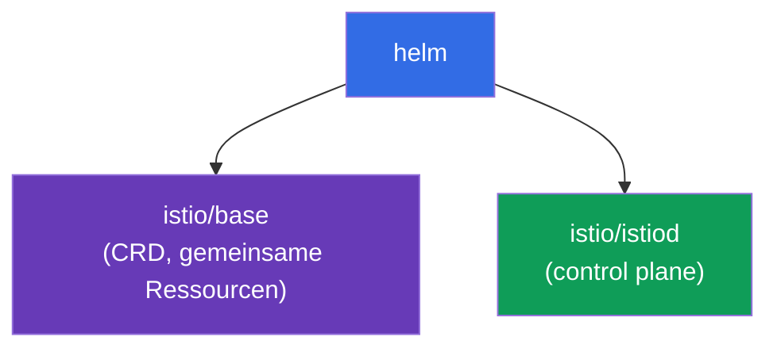
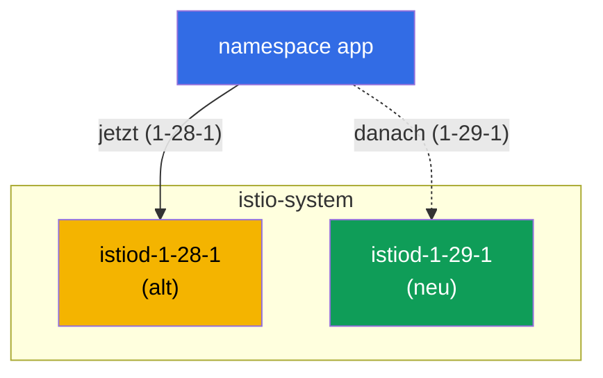

[RU version](ru.md) · [Eng version](en.md) · [Versión en español](es.md) · [Version française](fr.md)

# Kapitel 3. Update von Istio: Helm, Revisionen, Canary und In-place

> **Was als Nächstes kommt.** In Kapitel 2 haben wir Istio über istioctl installiert. Jetzt
> besprechen wir, wie man es über Helm installiert und vor allem, wie man es sicher aktualisiert.
> Ein Update der Control plane in Produktion ist eine riskante Operation: Wenn sich das neue
> istiod als inkompatibel erweist, kann das gesamte Mesh ausfallen. Deshalb lernen wir, das über
> Revisionen und Canary zu tun, mit der Möglichkeit eines sofortigen Rollbacks.

## 3.1. Worin das Problem des Updates besteht

istiod verwaltet alle Envoys im Cluster. Wenn man einfach „das Alte abreißt und das Neue
hinstellt", leidet für die Dauer des Updates und bei jeder Inkompatibilität der gesamte Traffic.
Man braucht eine Möglichkeit, schrittweise und mit einem Rollback-Plan zu aktualisieren.

Istio bietet zwei Ansätze:

- **Canary upgrade (über Revisionen)** – neben der alten Control plane wird eine neue
  hochgezogen, und die Anwendungen werden nacheinander auf sie umgestellt, mit der Möglichkeit
  eines Rollbacks durch Ändern des Labels.
- **In-place upgrade** – dasselbe istiod wird „an Ort und Stelle" aktualisiert, ohne zweite
  Kopie. Einfacher, aber riskanter: Alle Proxys werden auf einen Schlag umgeschaltet.

Wir besprechen beides, aber zuerst installieren wir Istio über Helm, weil Helm gerade Revisionen
bequem nutzt.

## 3.2. Installation von Istio über Helm

In Helm ist Istio in zwei Basis-Charts aufgeteilt:

- **`istio/base`** – CRDs und Cluster-Ressourcen. Wird einmal installiert, gemeinsam für alle
  Revisionen.
- **`istio/istiod`** – die Control plane selbst. Sie lässt sich mit Angabe einer Revision
  installieren.



Wir fügen das Repository hinzu:

```bash
helm repo add istio https://istio-release.storage.googleapis.com/charts
helm repo update
```

## 3.3. Was eine Revision ist

Eine **Revision** ist eine benannte Instanz der Control plane. Jede Revision hat ihr eigenes
Deployment `istiod-<revision>` und ihren eigenen Webhook für die Einbindung des Sidecar.

Die Kernidee: Der namespace wählt über das Label `istio.io/rev=<revision>` aus, mit welcher
Revision seine Pods „bespielt" werden. Genau das erlaubt es, **zwei Versionen von Istio
gleichzeitig** zu halten und die Last zwischen ihnen umzuschalten. Ohne Revisionen wäre ein
Update „alles oder nichts".

Beachten Sie den Unterschied zu Kapitel 2: Dort haben wir den namespace mit dem Label
`istio-injection=enabled` markiert. Beim Arbeiten mit Revisionen wird stattdessen
`istio.io/rev=<revision>` verwendet – so sagen wir explizit, welche Control plane den Sidecar
injiziert.

## 3.4. Installation der Control plane mit einer Revision

Wir installieren das Basis-Chart und istiod der Revision `1-28-1` (das ist die alte Version, von
der wir später aktualisieren werden). Im Lab werden die Versionen `1.28.1` (Revision `1-28-1`)
und `1.29.1` (Revision `1-29-1`) verwendet.

```bash
kubectl create namespace istio-system

helm install istio-base istio/base -n istio-system --version 1.28.1 --set defaultRevision=1-28-1

helm install istiod-1-28-1 istio/istiod -n istio-system --version 1.28.1 --set revision=1-28-1 --wait
```

Wir prüfen:

```bash
kubectl get pods -n istio-system
```

```
NAME                              READY   STATUS    RESTARTS   AGE
istiod-1-28-1-xxxxxxxxxx-xxxxx    1/1     Running   0          40s
```

Beachten Sie: Das Deployment heißt `istiod-1-28-1`, der Name enthält die Revision. Genau das
unterscheidet die revisionsbasierte Installation von der gewöhnlichen, bei der istiod einfach
`istiod` heißt.

Wir rollen die Anwendung aus und markieren ihren namespace mit der gewünschten Revision:

```bash
kubectl create namespace app
kubectl label namespace app istio.io/rev=1-28-1
kubectl apply -f app.yaml -n app
kubectl rollout restart deployment -n app
```

Dass der Sidecar genau durch die Revision `1-28-1` eingebunden wurde, kann man an der Version des
Images `istio-proxy` erkennen:

```bash
kubectl get pods -n app -o jsonpath='{range .items[*]}{.spec.initContainers[*].image}{"\n"}{end}'
```

```
docker.io/istio/proxyv2:1.28.1
```

## 3.5. Canary upgrade: eine neue Revision neben der alten

Der Kern des Canary-Updates: Die neue Control plane wird **neben** der alten ausgerollt, ohne
sie anzufassen. Zuerst aktualisieren wir die gemeinsamen CRDs (`istio-base`), dann installieren
wir die zweite Revision von istiod.

```bash
# zuerst aktualisieren wir die gemeinsamen CRDs auf die neue Version
helm upgrade istio-base istio/base -n istio-system --version 1.29.1 --set defaultRevision=1-28-1

# wir installieren die neue Revision von istiod, die alte läuft weiter
helm install istiod-1-29-1 istio/istiod -n istio-system --version 1.29.1 --set revision=1-29-1 --wait
```

Jetzt gibt es im Cluster zwei Revisionen der Control plane gleichzeitig:

```bash
kubectl get pods -n istio-system
```

```
NAME                              READY   STATUS    RESTARTS   AGE
istiod-1-28-1-xxxxxxxxxx-xxxxx    1/1     Running   0          5m
istiod-1-29-1-yyyyyyyyyy-yyyyy    1/1     Running   0          30s
```



Wichtig: Die Anwendung im namespace `app` ist noch nicht betroffen, ihre Pods verwenden nach wie
vor den Sidecar von `1-28-1`. Die Installation der neuen Revision migriert von sich aus nichts.
Genau darin liegt die Sicherheit von Canary: Die neue Control plane ist bereit, aber die Last ist
noch nicht auf sie umgestellt.

## 3.6. Migration der Anwendung und Rollback

Wir schalten den namespace auf die neue Revision um (ändern das Label) und starten die Pods neu.
Beim Neuerstellen erhalten sie einen Sidecar bereits von `1-29-1`:

```bash
kubectl label namespace app istio.io/rev=1-29-1 --overwrite
kubectl rollout restart deployment -n app
```

Wir prüfen die Version des Proxys nach der Migration:

```bash
kubectl get pods -n app -o jsonpath='{range .items[*]}{.spec.initContainers[*].image}{"\n"}{end}'
```

```
docker.io/istio/proxyv2:1.29.1
```

Die Anwendung ist auf die neue Control plane umgezogen. Das Wertvollste hier ist das
**Rollback**: Wenn sich die neue Version schlecht verhalten hat, genügt es, das Label
zurückzusetzen und die Pods neu zu starten.

```bash
kubectl label namespace app istio.io/rev=1-28-1 --overwrite
kubectl rollout restart deployment -n app
```

Die alte Revision hat die ganze Zeit gearbeitet, deshalb ist das Rollback sofort und ohne
Überraschungen.

### Wer noch auf der alten Version ist (Migrationsfortschritt)

Während Sie die Pods namespace für namespace neu starten, ist es nützlich zu sehen, wer bereits
umgezogen ist und wer noch auf dem alten Sidecar sitzt.

Am schnellsten geht die Übersicht über die Versionen der Data plane: wie viele Proxys auf jeder
Version sind.

```bash
istioctl version
```

```
client version: 1.29.1
control plane version: 1.28.1, 1.29.1
data plane version: 1.28.1 (2 proxies), 1.29.1 (3 proxies)
```

Die Zeile `data plane version` zeigt die Verteilung. Solange darin `1.28.1` steht, ist die
Migration nicht abgeschlossen – auf der alten Version sind noch 2 Proxys geblieben.

Wer genau und mit welcher Control plane verbunden ist:

```bash
istioctl proxy-status
```

In der Spalte mit istiod sieht man den Namen des Control-plane-Pods (`istiod-1-28-1-...` oder
`istiod-1-29-1-...`) – daran erkennt man, welche Revision jeden Proxy bedient.

Einzeln und ohne istioctl – über die Version des Sidecar-Images (und über das Revisions-Label,
das die Injection auf den Pod setzt):

```bash
kubectl get pods -A -L istio.io/rev \
  -o jsonpath='{range .items[*]}{.metadata.namespace}{"\t"}{.metadata.name}{"\t"}{.spec.initContainers[*].image}{"\n"}{end}' \
  | grep proxyv2
```

```
app   productpage-...   docker.io/istio/proxyv2:1.28.1   <- noch auf der alten
app   reviews-...       docker.io/istio/proxyv2:1.29.1
```

Pods mit `proxyv2:1.28.1` (oder mit der alten Revision in der Spalte `istio.io/rev`) sind
diejenigen, die noch über `rollout restart` neu erstellt werden müssen, um die Migration
abzuschließen.

## 3.7. Standardrevision und das Tag `default`

In den Beispielen oben haben wir explizit `istio.io/rev=1-28-1` auf jeden namespace geschrieben.
Aber das Label bei jedem Update auf allen namespaces zu ändern, ist unbequem. Dafür gibt es
**Revisions-Tags** (revision tags) – stabile Aliasse, die auf eine konkrete Revision zeigen. Das
wichtigste davon ist das Tag `default`, die „Standardrevision".

Ein namespace mit dem gewöhnlichen Label `istio-injection=enabled` (aus Kapitel 2) wird genau von
der Revision bedient, auf die das Tag `default` zeigt. Das heißt, `istio-injection=enabled` und
`istio.io/rev=default` sind ein und dasselbe: Beide zeigen auf die Standardrevision. Das Tag legt
man bequem gleich bei der Installation über Helm mit dem Flag `--set defaultRevision=<revision>`
an (das haben wir in 3.4/3.5 getan).

### Die Standardrevision ansehen

```bash
istioctl tag list
```

```
TAG      REVISION   NAMESPACES
default  1-28-1     ...
```

Die Spalte `REVISION` zeigt, auf welche Revision das Tag `default` gerade schaut, und
`NAMESPACES` – welche namespaces es nutzen (also mit `istio-injection=enabled` oder
`istio.io/rev=default` markiert sind). Dasselbe kann man über den Webhook sehen:

```bash
kubectl get mutatingwebhookconfiguration -l istio.io/tag=default \
  -o jsonpath='{.items[0].metadata.labels.istio\.io/rev}{"\n"}'
```

```
1-28-1
```

### Die Standardrevision wechseln (alle auf einen Schlag umstellen)

Szenario: Sie haben die neue Revision `1-29-1` auf einem Teil der Last geprüft (Canary aus 3.6)
und möchten nun, dass **alle** Pods, die auf der Standardrevision sitzen, auf sie umziehen. Wenn
die namespaces mit `istio-injection=enabled` markiert sind (und nicht mit einer expliziten
Revision), muss man das Label nicht auf jedem einzelnen ändern – es genügt, das Tag `default` auf
die neue Revision umzustellen:

```bash
istioctl tag set default --revision 1-29-1 --overwrite
```

Wir prüfen, dass das Tag jetzt auf die neue Revision zeigt:

```bash
istioctl tag list
```

```
TAG      REVISION   NAMESPACES
default  1-29-1     ...
```

Wie bei Canary migriert das Umsetzen des Tags selbst nichts – es ändert nur, welche Revision
`default` injiziert. Damit die Pods tatsächlich auf den neuen Sidecar umziehen, muss man sie neu
erstellen:

```bash
kubectl rollout restart deployment -n app
```

Nach dem Neustart erhalten alle namespaces auf der Standardrevision einen Sidecar der neuen
Revision – mit einem einzigen Tag-Wechsel, ohne jeden namespace zu durchlaufen. Das Rollback ist
genauso einfach: das Tag auf die alte Revision zurücksetzen und die Pods neu starten.

```bash
istioctl tag set default --revision 1-28-1 --overwrite
kubectl rollout restart deployment -n app
```

> Die beiden Kennzeichnungsmodelle vermischen Sie nicht gedankenlos: Wenn ein namespace mit einer
> expliziten Revision markiert ist (`istio.io/rev=1-28-1`), wirkt das Tag `default` nicht auf ihn
> – einen solchen namespace schaltet man durch Ändern seines eigenen Labels um (wie in 3.6). Das
> Tag `default` steuert nur diejenigen, die auf `istio-injection=enabled` /
> `istio.io/rev=default` sitzen.

## 3.8. Entfernen der alten Revision

Wenn Sie sich vergewissert haben, dass auf der neuen Revision alles stabil ist, kann man die alte
Control plane entfernen:

```bash
helm uninstall istiod-1-28-1 -n istio-system
```

Das sollte man erst tun, nachdem **alle** namespaces auf die neue Revision umgestellt wurden.
Andernfalls bleiben die Pods, die noch auf die alte Revision verweisen, ohne ihr istiod.

## 3.9. In-place upgrade: die Alternative

Canary über Revisionen ist der sicherste Weg, aber Istio unterstützt auch das Update „an Ort und
Stelle". Hier gibt es keine zweite Revision: Dasselbe Release von istiod wird über `helm upgrade`
aktualisiert. Der namespace wird dabei mit dem gewöhnlichen Label `istio-injection=enabled`
markiert.

```bash
# Basisinstallation ohne Revision
helm install istio-base istio/base -n istio-system --version 1.28.1
helm install istiod istio/istiod -n istio-system --version 1.28.1 --wait
kubectl label namespace app istio-injection=enabled --overwrite

# später: CRDs und istiod an Ort und Stelle auf die neue Version aktualisieren
helm upgrade istio-base istio/base -n istio-system --version 1.29.1
helm upgrade istiod    istio/istiod -n istio-system --version 1.29.1 --wait

# die Anwendung neu starten, damit die Pods den neuen Sidecar erhalten
kubectl rollout restart deployment -n app
```

Nachteile: Alle Proxys werden auf einen Schlag auf die neue Version umgeschaltet (nach dem
Neustart der Pods), und das Rollback erfolgt nicht durch Ändern des Labels, sondern über
`helm rollback`.

## 3.10. Canary oder In-place: was wählen

| | Canary (Revisionen) | In-place |
|---|------------------|----------|
| Zweite Control plane | ja, daneben | nein |
| Umschalten der Last | pro namespace, schrittweise | sofort für alle |
| Rollback | Label `istio.io/rev` ändern | `helm rollback` |
| Risiko | geringer | höher |
| Komplexität | höher (zwei Revisionen) | geringer |

Die Regel ist einfach: Für Produktion und verantwortungsvolle Updates nehmen Sie Canary. Für
Test-Cluster oder kleine Updates ist In-place schneller und einfacher.

Das Äquivalent über istioctl ist der Befehl `istioctl upgrade`: Er aktualisiert die Installation
ohne Revision „an Ort und Stelle", ist also das istioctl-Pendant zum In-place-Ansatz.

## 3.11. Zusammenfassung des Kapitels

- In Helm ist Istio in zwei Charts aufgeteilt: `istio/base` (CRDs, eines pro Cluster) und
  `istio/istiod` (Control plane).
- Eine Revision ist eine benannte Instanz von istiod; der namespace wählt die Revision über das
  Label `istio.io/rev=<revision>`.
- Revisionen erlauben es, zwei Versionen von Istio gleichzeitig zu halten – die Basis des
  Canary-Updates.
- Canary: die neue Revision daneben installieren, den namespace durch Ändern des Labels und
  `rollout restart` umstellen, bei Problemen das Label zurücksetzen.
- Die Installation der neuen Revision migriert nichts automatisch, das macht den Prozess selbst
  sicher.
- Den Migrationsfortschritt sieht man über `istioctl version` (wie viele Proxys auf jeder
  Version), `istioctl proxy-status` (mit welchem istiod jeder Proxy verbunden ist) und über die
  Version des Images `proxyv2` in den Pods.
- Das Tag `default` ist die Standardrevision (für Labels `istio-injection=enabled`); ansehen kann
  man es über `istioctl tag list`, und wechseln über `istioctl tag set default --revision <rev>
  --overwrite` + `rollout restart`, was alle auf einen Schlag umstellt.
- In-place ist einfacher, schaltet aber alle auf einen Schlag um und wird über `helm rollback`
  zurückgerollt.
- Für Produktion ist Canary vorzuziehen.

## 3.12. Fragen zur Selbstüberprüfung

1. Wozu ist Istio in die Charts `base` und `istiod` aufgeteilt? Welches davon wird einmal
   installiert?
2. Was ist eine Revision und wie wählt der namespace aus, mit welcher Revision der Sidecar
   injiziert wird?
3. Warum bricht die Installation einer neuen Revision von istiod die laufende Anwendung nicht?
4. Wie führt man ein Rollback beim Canary-Update durch? Und beim In-place?
5. Wann ist ein In-place upgrade gerechtfertigt und wann ist Canary besser?
6. Was ist das Tag `default`? Wie sieht man die aktuelle Standardrevision und wie stellt man alle
   mit `istio-injection=enabled` markierten namespaces auf einen Schlag auf eine neue Revision um?

## Praxis

Absolvieren Sie das Lab: Installieren Sie Istio über Helm mit einer Revision, rollen Sie eine
Anwendung aus, führen Sie ein Canary-Update auf die neue Version durch und rollen Sie es zurück.

🧪 Lab 07: [tasks/ica/labs/07](../../labs/07/README_DE.MD)

---
[Inhaltsverzeichnis](../README_DE.md) · [Kapitel 2](../02/de.md) · [Kapitel 4](../04/de.md)
