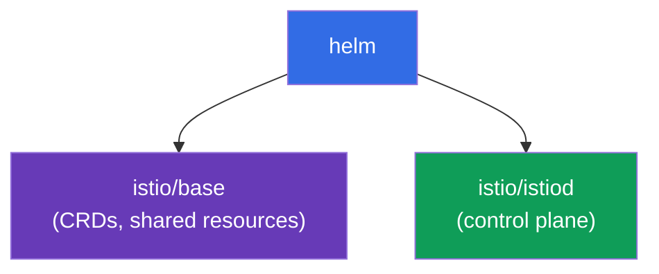
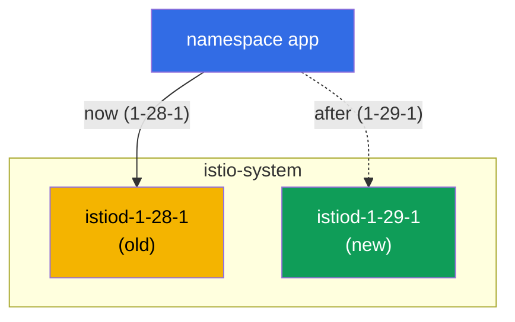

[RU version](ru.md)

# Chapter 3. Upgrading Istio: Helm, revisions, canary and in-place

> **What's next.** In chapter 2 we installed Istio via istioctl. Now we cover how to install
> it with Helm and, most importantly, how to upgrade it safely. Upgrading the control plane
> in production is a risky operation: if the new istiod turns out to be incompatible, the
> whole mesh can go down. So we will learn to do it via revisions and canary, with the
> ability to roll back instantly.

## 3.1. What the upgrade problem is

istiod manages every Envoy in the cluster. If you simply "tear down the old one and install
the new one", then during the upgrade and on any incompatibility all traffic suffers. You
need a way to upgrade gradually and with a rollback plan.

Istio offers two approaches:

- **Canary upgrade (via revisions)** - a new control plane is brought up next to the old
  one, and applications are moved onto it one by one, with the ability to roll back by
  changing a label.
- **In-place upgrade** - the same istiod is upgraded "in place", without a second copy.
  Simpler, but riskier: all proxies switch at once.

We will cover both, but first let's install Istio via Helm, because Helm conveniently uses
revisions.

## 3.2. Installing Istio via Helm

In Helm, Istio is split into two base charts:

- **`istio/base`** - CRDs and cluster-wide resources. Installed once, shared across all
  revisions.
- **`istio/istiod`** - the control plane itself. It can be installed with a revision
  specified.



Add the repository:

```bash
helm repo add istio https://istio-release.storage.googleapis.com/charts
helm repo update
```

## 3.3. What a revision is

A **revision** is a named instance of the control plane. Each revision has its own
Deployment `istiod-<revision>` and its own webhook for sidecar injection.

The key idea: a namespace chooses which revision its pods are "wired" with, via the label
`istio.io/rev=<revision>`. This is exactly what lets you keep **two versions of Istio at the
same time** and shift load between them. Without revisions, an upgrade would be
"all or nothing".

Note the difference from chapter 2: there we labeled the namespace with
`istio-injection=enabled`. When working with revisions, `istio.io/rev=<revision>` is used
instead - this way we explicitly say which control plane injects the sidecar.

## 3.4. Installing the control plane with a revision

We install the base chart and istiod of revision `1-28-1` (this is the old version we will
later upgrade from). The lab uses versions `1.28.1` (revision `1-28-1`) and `1.29.1`
(revision `1-29-1`).

```bash
kubectl create namespace istio-system

helm install istio-base istio/base -n istio-system --version 1.28.1 --set defaultRevision=1-28-1

helm install istiod-1-28-1 istio/istiod -n istio-system --version 1.28.1 --set revision=1-28-1 --wait
```

Check:

```bash
kubectl get pods -n istio-system
```

```
NAME                              READY   STATUS    RESTARTS   AGE
istiod-1-28-1-xxxxxxxxxx-xxxxx    1/1     Running   0          40s
```

Note: the Deployment is named `istiod-1-28-1`, the name contains the revision. This is what
distinguishes a revisioned install from an ordinary one, where istiod is simply named
`istiod`.

Deploy an application and label its namespace with the desired revision:

```bash
kubectl create namespace app
kubectl label namespace app istio.io/rev=1-28-1
kubectl apply -f app.yaml -n app
kubectl rollout restart deployment -n app
```

You can confirm the sidecar was injected by exactly revision `1-28-1` by the `istio-proxy`
image version:

```bash
kubectl get pods -n app -o jsonpath='{range .items[*]}{.spec.initContainers[*].image}{"\n"}{end}'
```

```
docker.io/istio/proxyv2:1.28.1
```

## 3.5. Canary upgrade: a new revision next to the old one

The essence of a canary upgrade: the new control plane is deployed **next to** the old one,
without touching it. First we upgrade the shared CRDs (`istio-base`), then install the second
istiod revision.

```bash
# first upgrade the shared CRDs to the new version
helm upgrade istio-base istio/base -n istio-system --version 1.29.1 --set defaultRevision=1-28-1

# install the new istiod revision; the old one keeps running
helm install istiod-1-29-1 istio/istiod -n istio-system --version 1.29.1 --set revision=1-29-1 --wait
```

Now there are two control-plane revisions in the cluster at the same time:

```bash
kubectl get pods -n istio-system
```

```
NAME                              READY   STATUS    RESTARTS   AGE
istiod-1-28-1-xxxxxxxxxx-xxxxx    1/1     Running   0          5m
istiod-1-29-1-yyyyyyyyyy-yyyyy    1/1     Running   0          30s
```



Important: the application in namespace `app` is not affected yet, its pods still use the
sidecar from `1-28-1`. Installing the new revision migrates nothing by itself. This is
exactly the safety of canary: the new control plane is ready, but the load has not been
moved onto it yet.

## 3.6. Migrating the application and rolling back

Switch the namespace to the new revision (change the label) and restart the pods. On
recreation they will get the sidecar from `1-29-1`:

```bash
kubectl label namespace app istio.io/rev=1-29-1 --overwrite
kubectl rollout restart deployment -n app
```

Check the proxy version after migration:

```bash
kubectl get pods -n app -o jsonpath='{range .items[*]}{.spec.initContainers[*].image}{"\n"}{end}'
```

```
docker.io/istio/proxyv2:1.29.1
```

The application has moved to the new control plane. The most valuable thing here is the
**rollback**: if the new version misbehaves, it is enough to put the label back and restart
the pods.

```bash
kubectl label namespace app istio.io/rev=1-28-1 --overwrite
kubectl rollout restart deployment -n app
```

The old revision was running the whole time, so the rollback is instant and without
surprises.

### Who is still on the old version (migration progress)

While you restart pods namespace by namespace, it helps to see who has already moved and who
is still on the old sidecar.

The quickest is a summary by data plane version: how many proxies are on each version.

```bash
istioctl version
```

```
client version: 1.29.1
control plane version: 1.28.1, 1.29.1
data plane version: 1.28.1 (2 proxies), 1.29.1 (3 proxies)
```

The `data plane version` line shows the distribution. As long as `1.28.1` is in it, the
migration is not complete - 2 proxies remain on the old version.

Who exactly, and which control plane they are connected to:

```bash
istioctl proxy-status
```

The istiod column shows the control-plane pod name (`istiod-1-28-1-...` or
`istiod-1-29-1-...`) - from it you can tell which revision serves each proxy.

Per pod and without istioctl - by the sidecar image version (and by the revision label that
injection puts on the pod):

```bash
kubectl get pods -A -L istio.io/rev \
  -o jsonpath='{range .items[*]}{.metadata.namespace}{"\t"}{.metadata.name}{"\t"}{.spec.initContainers[*].image}{"\n"}{end}' \
  | grep proxyv2
```

```
app   productpage-...   docker.io/istio/proxyv2:1.28.1   <- still on the old one
app   reviews-...       docker.io/istio/proxyv2:1.29.1
```

Pods with `proxyv2:1.28.1` (or with the old revision in the `istio.io/rev` column) are the
ones that still need to be recreated via `rollout restart` to finish the migration.

## 3.7. The default revision and the `default` tag

In the examples above we explicitly wrote `istio.io/rev=1-28-1` on each namespace. But
changing the label on every namespace on each upgrade is inconvenient. For this there are
**revision tags** - stable aliases that point to a concrete revision. The most important one
is the `default` tag, the "default revision".

A namespace with the ordinary label `istio-injection=enabled` (from chapter 2) is served by
exactly the revision the `default` tag points to. That is, `istio-injection=enabled` and
`istio.io/rev=default` are the same thing: both point to the default revision. It is
convenient to create the tag right at install time via Helm with
`--set defaultRevision=<revision>` (we did this in 3.4/3.5).

### View the default revision

```bash
istioctl tag list
```

```
TAG      REVISION   NAMESPACES
default  1-28-1     ...
```

The `REVISION` column shows which revision the `default` tag currently points to, and
`NAMESPACES` shows which namespaces use it (i.e. are labeled `istio-injection=enabled` or
`istio.io/rev=default`). The same can be seen via the webhook:

```bash
kubectl get mutatingwebhookconfiguration -l istio.io/tag=default \
  -o jsonpath='{.items[0].metadata.labels.istio\.io/rev}{"\n"}'
```

```
1-28-1
```

### Change the default revision (move everyone at once)

Scenario: you verified the new revision `1-29-1` on part of the load (canary from 3.6) and
now want **all** pods sitting on the default revision to move to it. If the namespaces are
labeled `istio-injection=enabled` (rather than an explicit revision), you do not need to
touch the label on each one - it is enough to re-point the `default` tag to the new revision:

```bash
istioctl tag set default --revision 1-29-1 --overwrite
```

Check that the tag now points to the new revision:

```bash
istioctl tag list
```

```
TAG      REVISION   NAMESPACES
default  1-29-1     ...
```

As with canary, re-pointing the tag migrates nothing by itself - it only changes which
revision `default` injects. For the pods to actually move onto the new sidecar, they must be
recreated:

```bash
kubectl rollout restart deployment -n app
```

After the restart, all namespaces on the default revision get the sidecar of the new
revision - with a single tag change, without going through each namespace. The rollback is
just as simple: point the tag back to the old revision and restart the pods.

```bash
istioctl tag set default --revision 1-28-1 --overwrite
kubectl rollout restart deployment -n app
```

> Do not mix the two labeling models carelessly: if a namespace is labeled with an explicit
> revision (`istio.io/rev=1-28-1`), the `default` tag does not affect it - such a namespace
> is switched by changing its own label (as in 3.6). The `default` tag governs only those on
> `istio-injection=enabled` / `istio.io/rev=default`.

## 3.8. Removing the old revision

Once you are sure everything is stable on the new revision, the old control plane can be
removed:

```bash
helm uninstall istiod-1-28-1 -n istio-system
```

Do this only after **all** namespaces have been moved to the new revision. Otherwise pods
that still reference the old revision will be left without their istiod.

## 3.9. In-place upgrade: the alternative

Canary via revisions is the safest path, but Istio also supports upgrading "in place". Here
there is no second revision: the same istiod release is upgraded via `helm upgrade`. The
namespace is labeled with the ordinary `istio-injection=enabled` label.

```bash
# base install without a revision
helm install istio-base istio/base -n istio-system --version 1.28.1
helm install istiod istio/istiod -n istio-system --version 1.28.1 --wait
kubectl label namespace app istio-injection=enabled --overwrite

# later: upgrade the CRDs and istiod in place to the new version
helm upgrade istio-base istio/base -n istio-system --version 1.29.1
helm upgrade istiod    istio/istiod -n istio-system --version 1.29.1 --wait

# restart the application so the pods get the new sidecar
kubectl rollout restart deployment -n app
```

Downsides: all proxies switch to the new version at once (after the pods restart), and the
rollback is done not by changing a label but via `helm rollback`.

## 3.10. Canary or in-place: which to choose

| | Canary (revisions) | In-place |
|---|--------------------|----------|
| Second control plane | yes, alongside | no |
| Load switching | per namespace, gradually | all at once |
| Rollback | change the `istio.io/rev` label | `helm rollback` |
| Risk | lower | higher |
| Complexity | higher (two revisions) | lower |

The rule is simple: for production and critical upgrades use canary. For test clusters or
minor upgrades in-place is faster and simpler.

The istioctl equivalent is the `istioctl upgrade` command: it upgrades a non-revisioned
install "in place", i.e. it is the istioctl analog of the in-place approach.

## 3.11. Chapter summary

- In Helm, Istio is split into two charts: `istio/base` (CRDs, one per cluster) and
  `istio/istiod` (control plane).
- A revision is a named istiod instance; a namespace chooses the revision via the
  `istio.io/rev=<revision>` label.
- Revisions let you keep two Istio versions at once - the basis of the canary upgrade.
- Canary: install the new revision alongside, move the namespace by changing the label and
  `rollout restart`, and on trouble put the label back.
- Installing a new revision migrates nothing automatically, which is what makes the process
  itself safe.
- Migration progress is visible via `istioctl version` (how many proxies on each version),
  `istioctl proxy-status` (which istiod each proxy is connected to) and by the `proxyv2`
  image version in the pods.
- The `default` tag is the default revision (for the `istio-injection=enabled` label); view
  it with `istioctl tag list`, and change it with `istioctl tag set default --revision <rev>
  --overwrite` + `rollout restart`, which moves everyone at once.
- In-place is simpler, but switches everyone at once and rolls back via `helm rollback`.
- For production, canary is preferred.

## 3.12. Self-check questions

1. Why is Istio split into the `base` and `istiod` charts? Which of them is installed once?
2. What is a revision, and how does a namespace choose which revision injects the sidecar?
3. Why does installing a new istiod revision not break a running application?
4. How do you roll back with a canary upgrade? And with in-place?
5. When is an in-place upgrade justified, and when is canary better?
6. What is the `default` tag? How do you view the current default revision and how do you
   move all namespaces labeled `istio-injection=enabled` to a new revision at once?

## Practice

Go through the lab: install Istio via Helm with a revision, deploy an application, perform a
canary upgrade to the new version and a rollback.

🧪 Lab 07: [tasks/ica/labs/07](../../labs/07/README.MD)

---
[Contents](../README.md) · [Chapter 2](../02/en.md) · [Chapter 4](../04/en.md)
