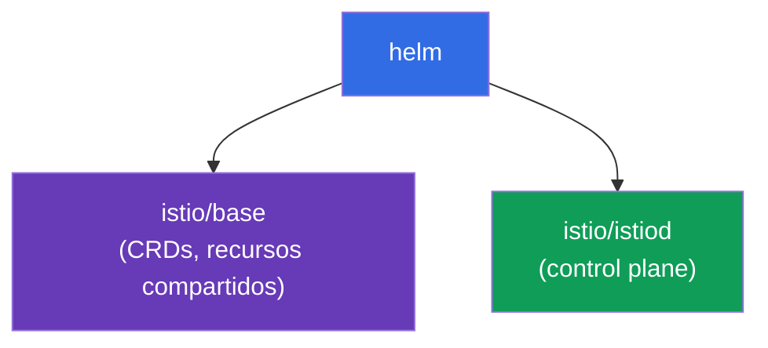
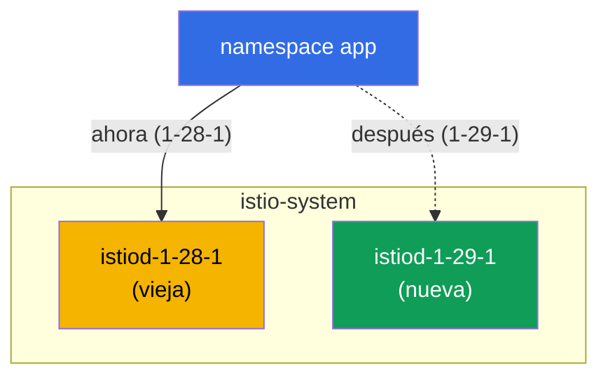

[RU version](ru.md) · [Eng version](en.md)

# Capítulo 3. Actualizar Istio: Helm, revisiones, canary e in-place

> **Qué sigue.** En el capítulo 2 instalamos Istio mediante istioctl. Ahora cubrimos cómo
> instalarlo con Helm y, sobre todo, cómo actualizarlo de forma segura. Actualizar el control
> plane en producción es una operación arriesgada: si el nuevo istiod resulta incompatible,
> toda la malla puede caer. Así que aprenderemos a hacerlo mediante revisiones y canary, con
> la posibilidad de revertir al instante.

## 3.1. Cuál es el problema de la actualización

istiod gestiona cada Envoy del clúster. Si simplemente "tiras el viejo e instalas el nuevo",
entonces durante la actualización y ante cualquier incompatibilidad todo el tráfico sufre.
Necesitas una forma de actualizar de forma gradual y con un plan de rollback.

Istio ofrece dos enfoques:

- **Actualización canary (mediante revisiones)**, se levanta un nuevo control plane junto al
  viejo, y las aplicaciones se mueven a él una a una, con la posibilidad de revertir cambiando
  una etiqueta.
- **Actualización in-place**, el mismo istiod se actualiza "en el sitio", sin una segunda
  copia. Más simple, pero más arriesgado: todos los proxies cambian a la vez.

Cubriremos ambos, pero primero instalemos Istio mediante Helm, porque Helm usa cómodamente las
revisiones.

## 3.2. Instalar Istio mediante Helm

En Helm, Istio se divide en dos charts base:

- **`istio/base`**, los CRDs y los recursos a nivel de clúster. Se instala una vez, compartido
  entre todas las revisiones.
- **`istio/istiod`**, el propio control plane. Se puede instalar indicando una revisión.



Añade el repositorio:

```bash
helm repo add istio https://istio-release.storage.googleapis.com/charts
helm repo update
```

## 3.3. Qué es una revisión

Una **revisión** es una instancia con nombre del control plane. Cada revisión tiene su propio
Deployment `istiod-<revision>` y su propio webhook para la inyección de sidecar.

La idea clave: un namespace elige con qué revisión están "cableados" sus pods, mediante la
etiqueta `istio.io/rev=<revision>`. Esto es exactamente lo que permite mantener **dos versiones
de Istio al mismo tiempo** y desplazar la carga entre ellas. Sin revisiones, una actualización
sería "todo o nada".

Nota la diferencia respecto al capítulo 2: allí etiquetábamos el namespace con
`istio-injection=enabled`. Al trabajar con revisiones se usa en su lugar
`istio.io/rev=<revision>`; así decimos explícitamente qué control plane inyecta el sidecar.

## 3.4. Instalar el control plane con una revisión

Instalamos el chart base e istiod de la revisión `1-28-1` (esta es la versión antigua desde la
que luego actualizaremos). El laboratorio usa las versiones `1.28.1` (revisión `1-28-1`) y
`1.29.1` (revisión `1-29-1`).

```bash
kubectl create namespace istio-system

helm install istio-base istio/base -n istio-system --version 1.28.1 --set defaultRevision=1-28-1

helm install istiod-1-28-1 istio/istiod -n istio-system --version 1.28.1 --set revision=1-28-1 --wait
```

Comprueba:

```bash
kubectl get pods -n istio-system
```

```
NAME                              READY   STATUS    RESTARTS   AGE
istiod-1-28-1-xxxxxxxxxx-xxxxx    1/1     Running   0          40s
```

Nota: el Deployment se llama `istiod-1-28-1`, el nombre contiene la revisión. Esto es lo que
distingue una instalación con revisión de una ordinaria, donde istiod simplemente se llama
`istiod`.

Despliega una aplicación y etiqueta su namespace con la revisión deseada:

```bash
kubectl create namespace app
kubectl label namespace app istio.io/rev=1-28-1
kubectl apply -f app.yaml -n app
kubectl rollout restart deployment -n app
```

Puedes confirmar que el sidecar fue inyectado exactamente por la revisión `1-28-1` por la
versión de la imagen de `istio-proxy`:

```bash
kubectl get pods -n app -o jsonpath='{range .items[*]}{.spec.initContainers[*].image}{"\n"}{end}'
```

```
docker.io/istio/proxyv2:1.28.1
```

## 3.5. Actualización canary: una nueva revisión junto a la vieja

La esencia de una actualización canary: el nuevo control plane se despliega **junto** al
viejo, sin tocarlo. Primero actualizamos los CRDs compartidos (`istio-base`), luego instalamos
la segunda revisión de istiod.

```bash
# primero actualiza los CRDs compartidos a la nueva versión
helm upgrade istio-base istio/base -n istio-system --version 1.29.1 --set defaultRevision=1-28-1

# instala la nueva revisión de istiod; la vieja sigue corriendo
helm install istiod-1-29-1 istio/istiod -n istio-system --version 1.29.1 --set revision=1-29-1 --wait
```

Ahora hay dos revisiones del control plane en el clúster al mismo tiempo:

```bash
kubectl get pods -n istio-system
```

```
NAME                              READY   STATUS    RESTARTS   AGE
istiod-1-28-1-xxxxxxxxxx-xxxxx    1/1     Running   0          5m
istiod-1-29-1-yyyyyyyyyy-yyyyy    1/1     Running   0          30s
```



Importante: la aplicación en el namespace `app` todavía no se ve afectada, sus pods siguen
usando el sidecar de `1-28-1`. Instalar la nueva revisión no migra nada por sí mismo. Esta es
exactamente la seguridad de canary: el nuevo control plane está listo, pero la carga aún no se
ha movido a él.

## 3.6. Migrar la aplicación y revertir

Cambia el namespace a la nueva revisión (cambia la etiqueta) y reinicia los pods. Al recrearse
recibirán el sidecar de `1-29-1`:

```bash
kubectl label namespace app istio.io/rev=1-29-1 --overwrite
kubectl rollout restart deployment -n app
```

Comprueba la versión del proxy tras la migración:

```bash
kubectl get pods -n app -o jsonpath='{range .items[*]}{.spec.initContainers[*].image}{"\n"}{end}'
```

```
docker.io/istio/proxyv2:1.29.1
```

La aplicación se ha movido al nuevo control plane. Lo más valioso aquí es el **rollback**: si
la nueva versión se porta mal, basta con volver a poner la etiqueta y reiniciar los pods.

```bash
kubectl label namespace app istio.io/rev=1-28-1 --overwrite
kubectl rollout restart deployment -n app
```

La vieja revisión estuvo corriendo todo el tiempo, así que el rollback es instantáneo y sin
sorpresas.

### Quién sigue en la versión vieja (progreso de la migración)

Mientras reinicias los pods namespace por namespace, ayuda ver quién ya se movió y quién sigue
en el sidecar viejo.

Lo más rápido es un resumen por versión del data plane: cuántos proxies hay en cada versión.

```bash
istioctl version
```

```
client version: 1.29.1
control plane version: 1.28.1, 1.29.1
data plane version: 1.28.1 (2 proxies), 1.29.1 (3 proxies)
```

La línea `data plane version` muestra la distribución. Mientras `1.28.1` siga ahí, la
migración no está completa: quedan 2 proxies en la versión vieja.

Quién exactamente, y a qué control plane están conectados:

```bash
istioctl proxy-status
```

La columna istiod muestra el nombre del pod del control plane (`istiod-1-28-1-...` o
`istiod-1-29-1-...`); de ahí puedes saber qué revisión sirve a cada proxy.

Por pod y sin istioctl, por la versión de la imagen del sidecar (y por la etiqueta de revisión
que la inyección pone en el pod):

```bash
kubectl get pods -A -L istio.io/rev \
  -o jsonpath='{range .items[*]}{.metadata.namespace}{"\t"}{.metadata.name}{"\t"}{.spec.initContainers[*].image}{"\n"}{end}' \
  | grep proxyv2
```

```
app   productpage-...   docker.io/istio/proxyv2:1.28.1   <- todavía en la vieja
app   reviews-...       docker.io/istio/proxyv2:1.29.1
```

Los pods con `proxyv2:1.28.1` (o con la revisión vieja en la columna `istio.io/rev`) son los
que todavía hay que recrear mediante `rollout restart` para terminar la migración.

## 3.7. La revisión por defecto y el tag `default`

En los ejemplos de arriba escribimos explícitamente `istio.io/rev=1-28-1` en cada namespace.
Pero cambiar la etiqueta en cada namespace en cada actualización es incómodo. Para esto
existen los **revision tags**: alias estables que apuntan a una revisión concreta. El más
importante es el tag `default`, la "revisión por defecto".

Un namespace con la etiqueta ordinaria `istio-injection=enabled` (del capítulo 2) es servido
exactamente por la revisión a la que apunta el tag `default`. Es decir,
`istio-injection=enabled` e `istio.io/rev=default` son lo mismo: ambos apuntan a la revisión
por defecto. Es cómodo crear el tag directamente en el momento de la instalación mediante Helm
con `--set defaultRevision=<revision>` (lo hicimos en 3.4/3.5).

### Ver la revisión por defecto

```bash
istioctl tag list
```

```
TAG      REVISION   NAMESPACES
default  1-28-1     ...
```

La columna `REVISION` muestra a qué revisión apunta actualmente el tag `default`, y
`NAMESPACES` muestra qué namespaces lo usan (es decir, están etiquetados con
`istio-injection=enabled` o `istio.io/rev=default`). Lo mismo se puede ver mediante el
webhook:

```bash
kubectl get mutatingwebhookconfiguration -l istio.io/tag=default \
  -o jsonpath='{.items[0].metadata.labels.istio\.io/rev}{"\n"}'
```

```
1-28-1
```

### Cambiar la revisión por defecto (mover a todos a la vez)

Escenario: verificaste la nueva revisión `1-29-1` en parte de la carga (el canary de 3.6) y
ahora quieres que **todos** los pods asentados en la revisión por defecto se muevan a ella. Si
los namespaces están etiquetados con `istio-injection=enabled` (en lugar de una revisión
explícita), no necesitas tocar la etiqueta de cada uno: basta con reapuntar el tag `default` a
la nueva revisión:

```bash
istioctl tag set default --revision 1-29-1 --overwrite
```

Comprueba que el tag ahora apunta a la nueva revisión:

```bash
istioctl tag list
```

```
TAG      REVISION   NAMESPACES
default  1-29-1     ...
```

Como con canary, reapuntar el tag no migra nada por sí mismo: solo cambia qué revisión inyecta
`default`. Para que los pods se muevan realmente al nuevo sidecar, deben recrearse:

```bash
kubectl rollout restart deployment -n app
```

Tras el reinicio, todos los namespaces en la revisión por defecto reciben el sidecar de la
nueva revisión, con un único cambio de tag, sin recorrer cada namespace. El rollback es igual
de simple: apunta el tag de vuelta a la revisión vieja y reinicia los pods.

```bash
istioctl tag set default --revision 1-28-1 --overwrite
kubectl rollout restart deployment -n app
```

> No mezcles los dos modelos de etiquetado a la ligera: si un namespace está etiquetado con
> una revisión explícita (`istio.io/rev=1-28-1`), el tag `default` no le afecta; un namespace
> así se cambia modificando su propia etiqueta (como en 3.6). El tag `default` gobierna solo a
> los que están en `istio-injection=enabled` / `istio.io/rev=default`.

## 3.8. Eliminar la revisión vieja

Una vez que estés seguro de que todo es estable en la nueva revisión, el viejo control plane
se puede eliminar:

```bash
helm uninstall istiod-1-28-1 -n istio-system
```

Haz esto solo después de que **todos** los namespaces se hayan movido a la nueva revisión. De
lo contrario, los pods que todavía referencian la revisión vieja se quedarán sin su istiod.

## 3.9. Actualización in-place: la alternativa

Canary mediante revisiones es el camino más seguro, pero Istio también admite actualizar "en
el sitio". Aquí no hay una segunda revisión: el mismo release de istiod se actualiza mediante
`helm upgrade`. El namespace se etiqueta con la etiqueta ordinaria `istio-injection=enabled`.

```bash
# instalación base sin revisión
helm install istio-base istio/base -n istio-system --version 1.28.1
helm install istiod istio/istiod -n istio-system --version 1.28.1 --wait
kubectl label namespace app istio-injection=enabled --overwrite

# más tarde: actualiza los CRDs e istiod en el sitio a la nueva versión
helm upgrade istio-base istio/base -n istio-system --version 1.29.1
helm upgrade istiod    istio/istiod -n istio-system --version 1.29.1 --wait

# reinicia la aplicación para que los pods reciban el nuevo sidecar
kubectl rollout restart deployment -n app
```

Inconvenientes: todos los proxies cambian a la nueva versión a la vez (tras el reinicio de los
pods), y el rollback se hace no cambiando una etiqueta sino mediante `helm rollback`.

## 3.10. Canary o in-place: cuál elegir

| | Canary (revisiones) | In-place |
|---|--------------------|----------|
| Segundo control plane | sí, en paralelo | no |
| Cambio de carga | por namespace, gradualmente | todo a la vez |
| Rollback | cambiar la etiqueta `istio.io/rev` | `helm rollback` |
| Riesgo | menor | mayor |
| Complejidad | mayor (dos revisiones) | menor |

La regla es simple: para producción y actualizaciones críticas usa canary. Para clústeres de
prueba o actualizaciones menores, in-place es más rápido y simple.

El equivalente en istioctl es el comando `istioctl upgrade`: actualiza una instalación sin
revisión "en el sitio", es decir, es el análogo en istioctl del enfoque in-place.

## 3.11. Resumen del capítulo

- En Helm, Istio se divide en dos charts: `istio/base` (CRDs, uno por clúster) e
  `istio/istiod` (control plane).
- Una revisión es una instancia de istiod con nombre; un namespace elige la revisión mediante
  la etiqueta `istio.io/rev=<revision>`.
- Las revisiones permiten mantener dos versiones de Istio a la vez, la base de la actualización
  canary.
- Canary: instala la nueva revisión en paralelo, mueve el namespace cambiando la etiqueta y
  `rollout restart`, y ante un problema vuelve a poner la etiqueta.
- Instalar una nueva revisión no migra nada automáticamente, que es lo que hace que el proceso
  en sí sea seguro.
- El progreso de la migración es visible mediante `istioctl version` (cuántos proxies en cada
  versión), `istioctl proxy-status` (a qué istiod está conectado cada proxy) y por la versión
  de la imagen `proxyv2` en los pods.
- El tag `default` es la revisión por defecto (para la etiqueta `istio-injection=enabled`);
  míralo con `istioctl tag list`, y cámbialo con `istioctl tag set default --revision <rev>
  --overwrite` + `rollout restart`, lo que mueve a todos a la vez.
- In-place es más simple, pero cambia a todos a la vez y revierte mediante `helm rollback`.
- Para producción, se prefiere canary.

## 3.12. Preguntas de autoevaluación

1. ¿Por qué Istio se divide en los charts `base` e `istiod`? ¿Cuál de ellos se instala una
   vez?
2. ¿Qué es una revisión, y cómo elige un namespace qué revisión inyecta el sidecar?
3. ¿Por qué instalar una nueva revisión de istiod no rompe una aplicación en marcha?
4. ¿Cómo reviertes con una actualización canary? ¿Y con in-place?
5. ¿Cuándo se justifica una actualización in-place, y cuándo es mejor canary?
6. ¿Qué es el tag `default`? ¿Cómo ves la revisión por defecto actual y cómo mueves a la vez
   todos los namespaces etiquetados con `istio-injection=enabled` a una nueva revisión?

## Práctica

Realiza el laboratorio: instala Istio mediante Helm con una revisión, despliega una
aplicación, realiza una actualización canary a la nueva versión y un rollback.

🧪 Laboratorio 07: [tasks/ica/labs/07](../../labs/07/README_ES.MD)

---
[Índice](../README_ES.md) · [Capítulo 2](../02/es.md) · [Capítulo 4](../04/es.md)
