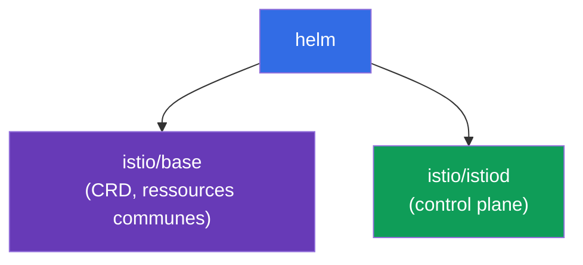
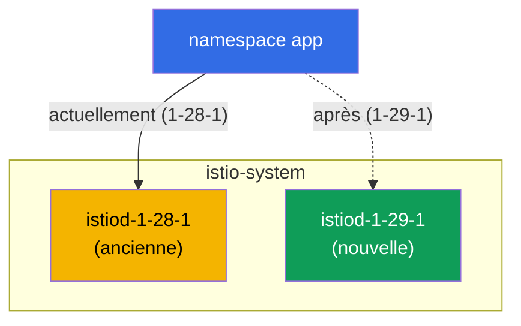

[RU version](ru.md) · [Eng version](en.md) · [Versión en español](es.md) · [Deutsche Version](de.md)

# Chapitre 3. Mise à jour d'Istio : Helm, révisions, canary et in-place

> **La suite.** Au chapitre 2, nous avons installé Istio via istioctl. Nous allons
> maintenant voir comment l'installer via Helm et, surtout, comment le mettre à jour en
> toute sécurité. Mettre à jour le control plane en production est une opération
> risquée : si le nouvel istiod s'avère incompatible, tout le maillage peut tomber.
> Nous apprendrons donc à le faire via les révisions et le canary, avec possibilité de
> retour arrière instantané.

## 3.1. Où est le problème de la mise à jour

istiod gère tous les Envoy du cluster. Si l'on se contente de « supprimer l'ancien et
installer le nouveau », tout le trafic est affecté pendant la mise à jour et à la
moindre incompatibilité. Il faut un moyen de se mettre à jour progressivement et avec un
plan de retour arrière.

Istio propose deux approches :

- **Canary upgrade (via révisions)** - un nouveau control plane est monté à côté de
  l'ancien, et les applications sont basculées dessus une par une, avec possibilité de
  retour arrière en changeant le label.
- **In-place upgrade** - le même istiod est mis à jour « sur place », sans deuxième
  copie. Plus simple, mais plus risqué : tous les proxys basculent d'un coup.

Nous verrons les deux, mais commençons par installer Istio via Helm, car c'est
justement Helm qui utilise commodément les révisions.

## 3.2. Installation d'Istio via Helm

Dans Helm, Istio est découpé en deux charts de base :

- **`istio/base`** - les CRD et les ressources de niveau cluster. Installé une seule
  fois, commun à toutes les révisions.
- **`istio/istiod`** - le control plane lui-même. On peut l'installer en précisant une
  révision.



Ajoutons le dépôt :

```bash
helm repo add istio https://istio-release.storage.googleapis.com/charts
helm repo update
```

## 3.3. Qu'est-ce qu'une révision

Une **révision (revision)** est une instance nommée du control plane. Chaque révision a
son propre Deployment `istiod-<revision>` et son propre webhook pour l'injection de
sidecar.

Idée clé : le namespace choisit par quelle révision ses pods seront « équipés », via le
label `istio.io/rev=<revision>`. C'est précisément ce qui permet de conserver **deux
versions d'Istio en même temps** et de basculer la charge de l'une à l'autre. Sans les
révisions, la mise à jour serait « tout ou rien ».

Notez la différence avec le chapitre 2 : là, nous marquions le namespace avec le label
`istio-injection=enabled`. Avec les révisions, on utilise à la place
`istio.io/rev=<revision>`, ce qui indique explicitement quel control plane injecte le
sidecar.

## 3.4. Installation du control plane avec une révision

Installons le chart de base et istiod en révision `1-28-1` (c'est l'ancienne version,
depuis laquelle nous ferons ensuite la mise à jour). Le lab utilise les versions
`1.28.1` (révision `1-28-1`) et `1.29.1` (révision `1-29-1`).

```bash
kubectl create namespace istio-system

helm install istio-base istio/base -n istio-system --version 1.28.1 --set defaultRevision=1-28-1

helm install istiod-1-28-1 istio/istiod -n istio-system --version 1.28.1 --set revision=1-28-1 --wait
```

Vérifions :

```bash
kubectl get pods -n istio-system
```

```
NAME                              READY   STATUS    RESTARTS   AGE
istiod-1-28-1-xxxxxxxxxx-xxxxx    1/1     Running   0          40s
```

Remarquez : le Deployment s'appelle `istiod-1-28-1`, le nom contient la révision. C'est
ce qui distingue une installation par révision d'une installation ordinaire, où istiod
s'appelle simplement `istiod`.

Déployons une application et marquons son namespace avec la révision voulue :

```bash
kubectl create namespace app
kubectl label namespace app istio.io/rev=1-28-1
kubectl apply -f app.yaml -n app
kubectl rollout restart deployment -n app
```

On peut s'assurer que le sidecar a bien été injecté par la révision `1-28-1` grâce à la
version de l'image `istio-proxy` :

```bash
kubectl get pods -n app -o jsonpath='{range .items[*]}{.spec.initContainers[*].image}{"\n"}{end}'
```

```
docker.io/istio/proxyv2:1.28.1
```

## 3.5. Canary upgrade : une nouvelle révision à côté de l'ancienne

Le principe de la mise à jour canary : le nouveau control plane est déployé **à côté**
de l'ancien, sans y toucher. On met d'abord à jour les CRD communs (`istio-base`), puis
on installe la seconde révision d'istiod.

```bash
# on met d'abord à jour les CRD communs vers la nouvelle version
helm upgrade istio-base istio/base -n istio-system --version 1.29.1 --set defaultRevision=1-28-1

# on installe la nouvelle révision d'istiod, l'ancienne continue de fonctionner
helm install istiod-1-29-1 istio/istiod -n istio-system --version 1.29.1 --set revision=1-29-1 --wait
```

Le cluster contient maintenant deux révisions du control plane en même temps :

```bash
kubectl get pods -n istio-system
```

```
NAME                              READY   STATUS    RESTARTS   AGE
istiod-1-28-1-xxxxxxxxxx-xxxxx    1/1     Running   0          5m
istiod-1-29-1-yyyyyyyyyy-yyyyy    1/1     Running   0          30s
```



Important : l'application du namespace `app` n'est pour l'instant pas touchée, ses pods
utilisent toujours le sidecar de `1-28-1`. L'installation de la nouvelle révision ne
migre rien en soi. C'est là toute la sécurité du canary : le nouveau control plane est
prêt, mais la charge n'y a pas encore été basculée.

## 3.6. Migration de l'application et retour arrière

Basculons le namespace sur la nouvelle révision (nous changeons le label) et
redémarrons les pods. À leur recréation, ils recevront un sidecar de `1-29-1` :

```bash
kubectl label namespace app istio.io/rev=1-29-1 --overwrite
kubectl rollout restart deployment -n app
```

Vérifions la version du proxy après la migration :

```bash
kubectl get pods -n app -o jsonpath='{range .items[*]}{.spec.initContainers[*].image}{"\n"}{end}'
```

```
docker.io/istio/proxyv2:1.29.1
```

L'application a migré vers le nouveau control plane. Le plus précieux ici est le
**retour arrière** : si la nouvelle version se comporte mal, il suffit de rétablir le
label et de redémarrer les pods.

```bash
kubectl label namespace app istio.io/rev=1-28-1 --overwrite
kubectl rollout restart deployment -n app
```

L'ancienne révision a fonctionné pendant tout ce temps, le retour arrière est donc
instantané et sans surprise.

### Qui est encore sur l'ancienne version (progression de la migration)

Pendant que vous redémarrez les pods namespace par namespace, il est utile de voir qui a
déjà migré et qui est encore sur l'ancien sidecar.

Le plus rapide est un récapitulatif par version du data plane : combien de proxys sur
chaque version.

```bash
istioctl version
```

```
client version: 1.29.1
control plane version: 1.28.1, 1.29.1
data plane version: 1.28.1 (2 proxies), 1.29.1 (3 proxies)
```

La ligne `data plane version` montre la répartition. Tant qu'elle contient `1.28.1`, la
migration n'est pas terminée : il reste 2 proxys sur l'ancienne version.

Qui exactement, et à quel control plane est-il connecté :

```bash
istioctl proxy-status
```

Dans la colonne relative à istiod, on voit le nom du pod du control plane
(`istiod-1-28-1-...` ou `istiod-1-29-1-...`) - il indique par quelle révision chaque
proxy est desservi.

Un par un et sans istioctl - par la version de l'image du sidecar (et par le label de
révision que l'injection pose sur le pod) :

```bash
kubectl get pods -A -L istio.io/rev \
  -o jsonpath='{range .items[*]}{.metadata.namespace}{"\t"}{.metadata.name}{"\t"}{.spec.initContainers[*].image}{"\n"}{end}' \
  | grep proxyv2
```

```
app   productpage-...   docker.io/istio/proxyv2:1.28.1   <- encore sur l'ancienne
app   reviews-...       docker.io/istio/proxyv2:1.29.1
```

Les pods avec `proxyv2:1.28.1` (ou avec l'ancienne révision dans la colonne
`istio.io/rev`) sont ceux qu'il faut encore recréer via `rollout restart` pour terminer
la migration.

## 3.7. Révision par défaut et tag `default`

Dans les exemples ci-dessus, nous écrivions explicitement `istio.io/rev=1-28-1` sur
chaque namespace. Mais changer le label sur tous les namespaces à chaque mise à jour est
peu pratique. Pour cela, il existe les **tags de révision** (revision tags) - des alias
stables pointant vers une révision précise. Le plus important d'entre eux est le tag
`default`, la « révision par défaut ».

Un namespace portant le label ordinaire `istio-injection=enabled` (du chapitre 2) est
desservi précisément par la révision vers laquelle pointe le tag `default`. Autrement
dit, `istio-injection=enabled` et `istio.io/rev=default` sont une seule et même chose :
les deux pointent vers la révision par défaut. Il est commode de créer le tag dès
l'installation via Helm avec le flag `--set defaultRevision=<revision>` (nous l'avons
fait en 3.4/3.5).

### Voir la révision par défaut

```bash
istioctl tag list
```

```
TAG      REVISION   NAMESPACES
default  1-28-1     ...
```

La colonne `REVISION` montre vers quelle révision pointe actuellement le tag `default`,
et `NAMESPACES` - quels namespaces l'utilisent (c'est-à-dire ceux marqués
`istio-injection=enabled` ou `istio.io/rev=default`). On peut voir la même chose via le
webhook :

```bash
kubectl get mutatingwebhookconfiguration -l istio.io/tag=default \
  -o jsonpath='{.items[0].metadata.labels.istio\.io/rev}{"\n"}'
```

```
1-28-1
```

### Changer la révision par défaut (basculer tout le monde d'un coup)

Scénario : vous avez validé la nouvelle révision `1-29-1` sur une partie de la charge
(le canary de 3.6) et vous voulez maintenant que **tous** les pods assis sur la révision
par défaut migrent dessus. Si les namespaces sont marqués `istio-injection=enabled` (et
non par une révision explicite), pas besoin de toucher au label de chacun - il suffit de
repositionner le tag `default` sur la nouvelle révision :

```bash
istioctl tag set default --revision 1-29-1 --overwrite
```

Vérifions que le tag pointe désormais vers la nouvelle révision :

```bash
istioctl tag list
```

```
TAG      REVISION   NAMESPACES
default  1-29-1     ...
```

Comme pour le canary, le déplacement du tag ne migre rien en soi - il change seulement
la révision qu'injecte `default`. Pour que les pods migrent réellement vers le nouveau
sidecar, il faut les recréer :

```bash
kubectl rollout restart deployment -n app
```

Après le redémarrage, tous les namespaces sur la révision par défaut recevront un
sidecar de la nouvelle révision - d'un seul changement de tag, sans parcourir chaque
namespace. Le retour arrière est tout aussi simple : rétablir le tag sur l'ancienne
révision et redémarrer les pods.

```bash
istioctl tag set default --revision 1-28-1 --overwrite
kubectl rollout restart deployment -n app
```

> Ne mélangez pas les deux modèles de marquage à la légère : si un namespace est marqué
> avec une révision explicite (`istio.io/rev=1-28-1`), le tag `default` ne l'affecte pas
> - un tel namespace se bascule en changeant son propre label (comme en 3.6). Le tag
> `default` ne gère que ceux qui sont sur `istio-injection=enabled` / `istio.io/rev=default`.

## 3.8. Suppression de l'ancienne révision

Une fois que vous avez la certitude que tout est stable sur la nouvelle révision,
l'ancien control plane peut être retiré :

```bash
helm uninstall istiod-1-28-1 -n istio-system
```

Il ne faut le faire qu'après avoir basculé **tous** les namespaces sur la nouvelle
révision. Sinon, les pods qui référencent encore l'ancienne révision se retrouveraient
sans leur istiod.

## 3.9. In-place upgrade : l'alternative

Le canary via les révisions est la voie la plus sûre, mais Istio prend aussi en charge
la mise à jour « sur place ». Ici, pas de seconde révision : le même release istiod est
mis à jour via `helm upgrade`. Le namespace est alors marqué avec le label ordinaire
`istio-injection=enabled`.

```bash
# installation de base sans révision
helm install istio-base istio/base -n istio-system --version 1.28.1
helm install istiod istio/istiod -n istio-system --version 1.28.1 --wait
kubectl label namespace app istio-injection=enabled --overwrite

# plus tard : on met à jour les CRD et istiod sur place vers la nouvelle version
helm upgrade istio-base istio/base -n istio-system --version 1.29.1
helm upgrade istiod    istio/istiod -n istio-system --version 1.29.1 --wait

# on redémarre l'application pour que les pods reçoivent le nouveau sidecar
kubectl rollout restart deployment -n app
```

Inconvénients : tous les proxys basculent d'un coup sur la nouvelle version (après le
redémarrage des pods), et le retour arrière ne se fait pas en changeant le label mais
via `helm rollback`.

## 3.10. Canary ou in-place : que choisir

| | Canary (révisions) | In-place |
|---|------------------|----------|
| Second control plane | oui, à côté | non |
| Bascule de la charge | par namespace, progressivement | d'un coup pour tous |
| Retour arrière | changer le label `istio.io/rev` | `helm rollback` |
| Risque | plus faible | plus élevé |
| Complexité | plus élevée (deux révisions) | plus faible |

La règle est simple : pour la production et les mises à jour sensibles, prenez le
canary. Pour les clusters de test ou les petites mises à jour, l'in-place est plus
rapide et plus simple.

L'équivalent via istioctl est la commande `istioctl upgrade` : elle met à jour une
installation sans révision « sur place », c'est donc l'analogue istioctl de l'approche
in-place.

## 3.11. Résumé du chapitre

- Dans Helm, Istio est découpé en deux charts : `istio/base` (CRD, un par cluster) et
  `istio/istiod` (control plane).
- Une révision est une instance nommée d'istiod ; le namespace choisit la révision via
  le label `istio.io/rev=<revision>`.
- Les révisions permettent de conserver deux versions d'Istio en même temps - la base de
  la mise à jour canary.
- Canary : installer la nouvelle révision à côté, basculer le namespace en changeant le
  label et `rollout restart`, en cas de problème rétablir le label.
- L'installation d'une nouvelle révision ne migre rien automatiquement, ce qui rend le
  processus lui-même sûr.
- La progression de la migration se voit via `istioctl version` (combien de proxys sur
  chaque version), `istioctl proxy-status` (à quel istiod chaque proxy est connecté) et
  par la version de l'image `proxyv2` dans les pods.
- Le tag `default` est la révision par défaut (pour les labels `istio-injection=enabled`) ;
  on le consulte via `istioctl tag list`, et on le change via `istioctl tag set default
  --revision <rev> --overwrite` + `rollout restart`, ce qui bascule tout le monde d'un
  coup.
- L'in-place est plus simple, mais bascule tout le monde d'un coup et se rétracte via
  `helm rollback`.
- Pour la production, le canary est préférable.

## 3.12. Questions d'auto-évaluation

1. Pourquoi Istio est-il découpé en charts `base` et `istiod` ? Lequel des deux
   s'installe une seule fois ?
2. Qu'est-ce qu'une révision et comment le namespace choisit-il par quelle révision
   injecter le sidecar ?
3. Pourquoi l'installation d'une nouvelle révision d'istiod ne casse-t-elle pas
   l'application en fonctionnement ?
4. Comment effectuer un retour arrière lors d'une mise à jour canary ? Et lors d'une
   in-place ?
5. Quand une in-place upgrade se justifie-t-elle, et quand vaut-il mieux un canary ?
6. Qu'est-ce que le tag `default` ? Comment voir la révision par défaut actuelle et
   comment basculer d'un coup vers une nouvelle révision tous les namespaces marqués
   `istio-injection=enabled` ?

## Pratique

Faites le lab : installez Istio via Helm avec une révision, déployez une application,
effectuez une mise à jour canary vers la nouvelle version puis un retour arrière.

🧪 Lab 07 : [tasks/ica/labs/07](../../labs/07/README_FR.MD)

---
[Table des matières](../README_FR.md) · [Chapitre 2](../02/fr.md) · [Chapitre 4](../04/fr.md)
