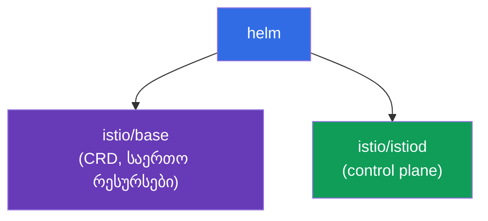
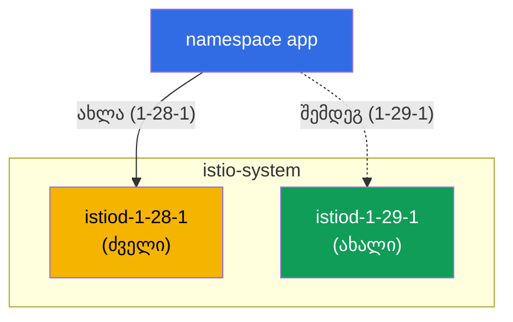

[Русская версия](ru.md) · [Eng version](en.md) · [Versión en español](es.md) · [Version française](fr.md) · [Deutsche Version](de.md) · [繁體中文版](tw.md) · [日本語版](jp.md)

# თავი 3. Istio-ს განახლება: Helm, რევიზიები, canary და in-place

> **რა არის შემდეგ.** მე-2 თავში Istio istioctl-ის საშუალებით დავაყენეთ. ახლა გავარჩევთ,
> როგორ დავაყენოთ ის Helm-ის საშუალებით და, რაც მთავარია, როგორ განვაახლოთ უსაფრთხოდ.
> production-ში control plane-ის განახლება სარისკო ოპერაციაა: თუ ახალი istiod
> შეუთავსებელი აღმოჩნდება, შესაძლოა მთელი mesh გაითიშოს. ამიტომ ვისწავლით ამის
> რევიზიებისა და canary-ის საშუალებით გაკეთებას, მყისიერი უკუქცევის შესაძლებლობით.

## 3.1. რა პრობლემაა განახლებასთან დაკავშირებით

istiod კლასტერში არსებულ ყველა Envoy-ს მართავს. თუ უბრალოდ „ძველს წავშლით და ახალს
დავაყენებთ“, განახლებისას და ნებისმიერი შეუთავსებლობის შემთხვევაში მთელი ტრაფიკი
დაზარალდება. საჭიროა ეტაპობრივი განახლებისა და უკუქცევის გეგმის მქონე მეთოდი.

Istio ორ მიდგომას გვთავაზობს:

- **Canary upgrade (რევიზიების საშუალებით)** - ძველი control plane-ის გვერდით ახალი
  ეშვება, ხოლო აპლიკაციები მასზე სათითაოდ გადადის, ნიშნულის შეცვლით უკუქცევის
  შესაძლებლობით.
- **In-place upgrade** - იგივე istiod „ადგილზე“, მეორე ასლის გარეშე ახლდება. უფრო
  მარტივი, თუმცა უფრო სარისკოა: ყველა proxy ერთდროულად გადაერთვება.

ორივეს განვიხილავთ, მაგრამ თავდაპირველად Istio-ს Helm-ის საშუალებით დავაყენებთ,
რადგან რევიზიების გამოყენება სწორედ Helm-ით არის მოსახერხებელი.

## 3.2. Istio-ს დაყენება Helm-ის საშუალებით

Helm-ში Istio ორ საბაზისო chart-ად არის დაყოფილი:

- **`istio/base`** - CRD და კლასტერული რესურსები. ყენდება ერთხელ და საერთოა ყველა
  რევიზიისთვის.
- **`istio/istiod`** - თავად control plane. მისი დაყენება რევიზიის მითითებით შეიძლება.



ვამატებთ repository-ს:

```bash
helm repo add istio https://istio-release.storage.googleapis.com/charts
helm repo update
```

## 3.3. რა არის რევიზია

**რევიზია (revision)** control plane-ის სახელდებული ეგზემპლარია. თითოეულ რევიზიას
აქვს საკუთარი Deployment `istiod-<revision>` და sidecar-ის ჩასმის საკუთარი webhook.

ძირითადი იდეა: namespace ნიშნულის `istio.io/rev=<revision>` საშუალებით ირჩევს,
რომელი რევიზია „ჩაუნერგავს“ მის pod-ებს sidecar-ს. სწორედ ეს გვაძლევს საშუალებას,
**Istio-ს ორი ვერსია ერთდროულად** გვქონდეს და დატვირთვა მათ შორის გადავრთოთ.
რევიზიების გარეშე განახლება იქნებოდა პრინციპით „ყველაფერი ან არაფერი“.

ყურადღება მიაქციეთ განსხვავებას მე-2 თავთან: იქ namespace-ს
`istio-injection=enabled` ნიშნულით ვნიშნავდით. რევიზიებთან მუშაობისას მის ნაცვლად
გამოიყენება `istio.io/rev=<revision>` - ამით პირდაპირ ვუთითებთ, კონკრეტულად რომელი
control plane უკეთებს sidecar-ს ინექციას.

## 3.4. Control plane-ის დაყენება რევიზიით

ვაყენებთ საბაზისო chart-ს და `1-28-1` რევიზიის istiod-ს (ეს ძველი ვერსიაა, რომელსაც
მოგვიანებით განვაახლებთ). ლაბაში გამოიყენება ვერსიები `1.28.1` (რევიზია `1-28-1`)
და `1.29.1` (რევიზია `1-29-1`).

```bash
kubectl create namespace istio-system

helm install istio-base istio/base -n istio-system --version 1.28.1 --set defaultRevision=1-28-1

helm install istiod-1-28-1 istio/istiod -n istio-system --version 1.28.1 --set revision=1-28-1 --wait
```

ვამოწმებთ:

```bash
kubectl get pods -n istio-system
```

```
NAME                              READY   STATUS    RESTARTS   AGE
istiod-1-28-1-xxxxxxxxxx-xxxxx    1/1     Running   0          40s
```

ყურადღება მიაქციეთ: Deployment-ს `istiod-1-28-1` ჰქვია, ანუ სახელი რევიზიას შეიცავს.
სწორედ ეს განასხვავებს რევიზიულ დაყენებას ჩვეულებრივისგან, სადაც istiod-ს უბრალოდ
`istiod` ჰქვია.

ვათავსებთ აპლიკაციას და მის namespace-ს საჭირო რევიზიით ვნიშნავთ:

```bash
kubectl create namespace app
kubectl label namespace app istio.io/rev=1-28-1
kubectl apply -f app.yaml -n app
kubectl rollout restart deployment -n app
```

იმაში დასარწმუნებლად, რომ sidecar სწორედ `1-28-1` რევიზიამ ჩასვა, შეგვიძლია
`istio-proxy` image-ის ვერსია შევამოწმოთ:

```bash
kubectl get pods -n app -o jsonpath='{range .items[*]}{.spec.initContainers[*].image}{"\n"}{end}'
```

```
docker.io/istio/proxyv2:1.28.1
```

## 3.5. Canary upgrade: ახალი რევიზია ძველის გვერდით

Canary-განახლების არსი ასეთია: ახალი control plane ძველის **გვერდით** იშლება და მას
არ ეხება. ჯერ საერთო CRD-ებს (`istio-base`) ვაახლებთ, შემდეგ კი istiod-ის მეორე
რევიზიას ვაყენებთ.

```bash
# ჯერ ვაახლებთ საერთო CRD-ს ახალ ვერსიამდე
helm upgrade istio-base istio/base -n istio-system --version 1.29.1 --set defaultRevision=1-28-1

# ვაყენებთ istiod-ის ახალ რევიზიას, ძველი აგრძელებს მუშაობას
helm install istiod-1-29-1 istio/istiod -n istio-system --version 1.29.1 --set revision=1-29-1 --wait
```

ახლა კლასტერში ერთდროულად control plane-ის ორი რევიზიაა:

```bash
kubectl get pods -n istio-system
```

```
NAME                              READY   STATUS    RESTARTS   AGE
istiod-1-28-1-xxxxxxxxxx-xxxxx    1/1     Running   0          5m
istiod-1-29-1-yyyyyyyyyy-yyyyy    1/1     Running   0          30s
```



მნიშვნელოვანია: `app` namespace-ში არსებული აპლიკაცია ჯერ არ შეცვლილა და მისი
pod-ები კვლავ `1-28-1`-ის sidecar-ს იყენებს. ახალი რევიზიის დაყენება თავისთავად
არაფერს მიგრირებს. სწორედ ეს ქმნის canary-ის უსაფრთხოებას: ახალი control plane მზად
არის, მაგრამ დატვირთვა მასზე ჯერ არ გადატანილა.

## 3.6. აპლიკაციის მიგრაცია და უკუქცევა

namespace-ს ახალ რევიზიაზე გადავრთავთ (ნიშნულს შევცვლით) და pod-ებს თავიდან
გავუშვებთ. ხელახლა შექმნისას ისინი sidecar-ს უკვე `1-29-1`-ისგან მიიღებენ:

```bash
kubectl label namespace app istio.io/rev=1-29-1 --overwrite
kubectl rollout restart deployment -n app
```

მიგრაციის შემდეგ ვამოწმებთ proxy-ის ვერსიას:

```bash
kubectl get pods -n app -o jsonpath='{range .items[*]}{.spec.initContainers[*].image}{"\n"}{end}'
```

```
docker.io/istio/proxyv2:1.29.1
```

აპლიკაცია ახალ control plane-ზე გადავიდა. აქ ყველაზე ღირებული **უკუქცევაა**: თუ
ახალი ვერსია ცუდად მოიქცევა, საკმარისია ნიშნული დავაბრუნოთ და pod-ები თავიდან
გავუშვათ.

```bash
kubectl label namespace app istio.io/rev=1-28-1 --overwrite
kubectl rollout restart deployment -n app
```

ძველი რევიზია მთელი ამ დროის განმავლობაში მუშაობდა, ამიტომ უკუქცევა მყისიერია და
სიურპრიზების გარეშე ხდება.

### ვინ არის ჯერ კიდევ ძველ ვერსიაზე (მიგრაციის პროგრესი)

სანამ namespace-ების pod-ებს თანმიმდევრულად თავიდან უშვებთ, სასარგებლოა დაინახოთ,
ვინ გადავიდა უკვე და ვინ იყენებს ჯერ კიდევ ძველ sidecar-ს.

ყველაზე სწრაფი გზა data plane-ის ვერსიების შეჯამებაა: რამდენი proxy არის თითოეულ
ვერსიაზე.

```bash
istioctl version
```

```
client version: 1.29.1
control plane version: 1.28.1, 1.29.1
data plane version: 1.28.1 (2 proxies), 1.29.1 (3 proxies)
```

სტრიქონი `data plane version` განაწილებას გვიჩვენებს. სანამ მასში `1.28.1` არის,
მიგრაცია დასრულებული არ არის - ძველ ვერსიაზე 2 proxy დარჩა.

კონკრეტულად ვინ რომელ control plane-ს უკავშირდება:

```bash
istioctl proxy-status
```

istiod-ის სვეტში ჩანს control plane-ის pod-ის სახელი (`istiod-1-28-1-...` ან
`istiod-1-29-1-...`) - მის მიხედვით გასაგებია, რომელი რევიზია ემსახურება თითოეულ
proxy-ს.

სათითაოდ და istioctl-ის გარეშე - sidecar-ის image-ის ვერსიის (და რევიზიის ნიშნულის,
რომელსაც ინექცია pod-ზე სვამს) მიხედვით:

```bash
kubectl get pods -A -L istio.io/rev \
  -o jsonpath='{range .items[*]}{.metadata.namespace}{"\t"}{.metadata.name}{"\t"}{.spec.initContainers[*].image}{"\n"}{end}' \
  | grep proxyv2
```

```
app   productpage-...   docker.io/istio/proxyv2:1.28.1   <- ჯერ კიდევ ძველზე
app   reviews-...       docker.io/istio/proxyv2:1.29.1
```

pod-ები `proxyv2:1.28.1`-ით (ან ძველი რევიზიით `istio.io/rev` სვეტში) ის pod-ებია,
რომლებიც მიგრაციის დასასრულებლად ჯერ კიდევ უნდა შეიქმნას თავიდან `rollout restart`-ის
საშუალებით.

## 3.7. ნაგულისხმევი რევიზია და `default` tag

ზემოთ მოყვანილ მაგალითებში თითოეულ namespace-ზე პირდაპირ ვწერდით
`istio.io/rev=1-28-1`. თუმცა ყოველი განახლებისას ყველა namespace-ზე ნიშნულის შეცვლა
მოუხერხებელია. ამისთვის არსებობს **რევიზიის tag-ები** (revision tags) - სტაბილური
ფსევდონიმები, რომლებიც კონკრეტულ რევიზიაზე მიუთითებს. მათ შორის ყველაზე
მნიშვნელოვანია `default` tag, ანუ „ნაგულისხმევი რევიზია“.

ჩვეულებრივი `istio-injection=enabled` ნიშნულის მქონე namespace-ს (მე-2 თავიდან)
სწორედ ის რევიზია ემსახურება, რომელზეც `default` tag მიუთითებს. შესაბამისად,
`istio-injection=enabled` და `istio.io/rev=default` ერთი და იგივეა: ორივე ნაგულისხმევ
რევიზიაზე მიუთითებს. tag-ის შექმნა მოსახერხებელია უშუალოდ Helm-ით დაყენებისას,
`--set defaultRevision=<revision>` flag-ის გამოყენებით (ეს 3.4/3.5-ში გავაკეთეთ).

### ნაგულისხმევი რევიზიის ნახვა

```bash
istioctl tag list
```

```
TAG      REVISION   NAMESPACES
default  1-28-1     ...
```

`REVISION` სვეტი გვიჩვენებს, რომელ რევიზიაზე მიუთითებს ამჟამად `default` tag, ხოლო
`NAMESPACES` - რომელი namespace-ები იყენებს მას (ანუ რომელია მონიშნული
`istio-injection=enabled` ან `istio.io/rev=default` ნიშნულით). იმავეს webhook-ის
საშუალებითაც ვნახავთ:

```bash
kubectl get mutatingwebhookconfiguration -l istio.io/tag=default \
  -o jsonpath='{.items[0].metadata.labels.istio\.io/rev}{"\n"}'
```

```
1-28-1
```

### ნაგულისხმევი რევიზიის შეცვლა (ყველას ერთდროულად გადაყვანა)

სცენარი: დატვირთვის ნაწილზე ახალი `1-29-1` რევიზია შეამოწმეთ (canary 3.6-დან) და
ახლა გსურთ, რომ ნაგულისხმევ რევიზიაზე მყოფი **ყველა** pod მასზე გადავიდეს. თუ
namespace-ები `istio-injection=enabled` ნიშნულითაა მონიშნული (და არა პირდაპირი
რევიზიით), თითოეულზე ნიშნულის შეცვლა არ არის საჭირო - საკმარისია `default` tag ახალ
რევიზიაზე გადავიტანოთ:

```bash
istioctl tag set default --revision 1-29-1 --overwrite
```

ვამოწმებთ, რომ tag ახლა ახალ რევიზიაზე მიუთითებს:

```bash
istioctl tag list
```

```
TAG      REVISION   NAMESPACES
default  1-29-1     ...
```

როგორც canary-ის შემთხვევაში, tag-ის გადატანა თავისთავად არაფერს მიგრირებს - ის
მხოლოდ ცვლის, რომელ რევიზიას უკეთებს `default` ინექციას. pod-ების ახალ sidecar-ზე
რეალურად გადასაყვანად ისინი თავიდან უნდა შეიქმნას:

```bash
kubectl rollout restart deployment -n app
```

restart-ის შემდეგ ნაგულისხმევ რევიზიაზე მყოფი ყველა namespace ახალი რევიზიის
sidecar-ს მიიღებს - tag-ის ერთი შეცვლით, თითოეული namespace-ის ცალ-ცალკე გავლის
გარეშე. უკუქცევაც ასეთივე მარტივია: tag ძველ რევიზიაზე დავაბრუნოთ და pod-ები თავიდან
გავუშვათ.

```bash
istioctl tag set default --revision 1-28-1 --overwrite
kubectl rollout restart deployment -n app
```

> მარკირების ორი მოდელი დაუფიქრებლად არ აურიოთ: თუ namespace პირდაპირი რევიზიითაა
> მონიშნული (`istio.io/rev=1-28-1`), `default` tag მასზე არ მოქმედებს - ასეთი namespace
> საკუთარი ნიშნულის შეცვლით უნდა გადაირთოს (როგორც 3.6-ში). `default` tag მართავს
> მხოლოდ მათ, ვინც `istio-injection=enabled` / `istio.io/rev=default`-ს იყენებს.

## 3.8. ძველი რევიზიის წაშლა

როდესაც დარწმუნდებით, რომ ახალ რევიზიაზე ყველაფერი სტაბილურად მუშაობს, ძველი
control plane შეგიძლიათ წაშალოთ:

```bash
helm uninstall istiod-1-28-1 -n istio-system
```

ეს მხოლოდ მას შემდეგ უნდა გააკეთოთ, რაც **ყველა** namespace ახალ რევიზიაზე გადავა.
წინააღმდეგ შემთხვევაში pod-ები, რომლებიც ჯერ კიდევ ძველ რევიზიას ეყრდნობა,
sაკუთარი istiod-ის გარეშე დარჩება.

## 3.9. In-place upgrade: ალტერნატივა

რევიზიების საშუალებით canary ყველაზე უსაფრთხო გზაა, თუმცა Istio „ადგილზე“
განახლებასაც უჭერს მხარს. აქ მეორე რევიზია არ არსებობს: იგივე istiod release
`helm upgrade`-ის საშუალებით ახლდება. ამ შემთხვევაში namespace ჩვეულებრივი
`istio-injection=enabled` ნიშნულით ინიშნება.

```bash
# საბაზისო ინსტალაცია რევიზიის გარეშე
helm install istio-base istio/base -n istio-system --version 1.28.1
helm install istiod istio/istiod -n istio-system --version 1.28.1 --wait
kubectl label namespace app istio-injection=enabled --overwrite

# მოგვიანებით: ვაახლებთ CRD-სა და istiod-ს ადგილზე ახალ ვერსიამდე
helm upgrade istio-base istio/base -n istio-system --version 1.29.1
helm upgrade istiod    istio/istiod -n istio-system --version 1.29.1 --wait

# ვამუშავებთ თავიდან აპლიკაციას, რომ pod-ებმა მიიღონ ახალი sidecar
kubectl rollout restart deployment -n app
```

ნაკლოვანებები: ყველა proxy ახალ ვერსიაზე ერთდროულად გადადის (pod-ების თავიდან
გაშვების შემდეგ), ხოლო უკუქცევა არა ნიშნულის შეცვლით, არამედ `helm rollback`-ის
საშუალებით ხდება.

## 3.10. Canary თუ in-place: რომელი ავირჩიოთ

| | Canary (რევიზიები) | In-place |
|---|------------------|----------|
| მეორე control plane | დიახ, გვერდით | არა |
| დატვირთვის გადართვა | namespace-ების მიხედვით, ეტაპობრივად | ყველასთვის ერთდროულად |
| უკუქცევა | `istio.io/rev` ნიშნულის შეცვლა | `helm rollback` |
| რისკი | დაბალი | მაღალი |
| სირთულე | მაღალი (ორი რევიზია) | დაბალი |

წესი მარტივია: production-ისა და საპასუხისმგებლო განახლებებისთვის canary გამოიყენეთ.
სატესტო კლასტერებისთვის ან მცირე განახლებებისთვის in-place უფრო სწრაფი და მარტივია.

istioctl-ის ეკვივალენტია ბრძანება `istioctl upgrade`: ის დაყენებას რევიზიის გარეშე,
„ადგილზე“ აახლებს, ანუ ეს in-place მიდგომის istioctl-ანალოგია.

## 3.11. თავის შეჯამება

- Helm-ში Istio ორ chart-ად არის დაყოფილი: `istio/base` (CRD, ერთი კლასტერზე) და
  `istio/istiod` (control plane).
- რევიზია istiod-ის სახელდებული ეგზემპლარია; namespace რევიზიას
  `istio.io/rev=<revision>` ნიშნულით ირჩევს.
- რევიზიები Istio-ს ორი ვერსიის ერთდროულად ქონის საშუალებას იძლევა - ეს
  canary-განახლების საფუძველია.
- Canary: ახალი რევიზია ძველის გვერდით დავაყენოთ, namespace ნიშნულის შეცვლითა და
  `rollout restart`-ით გადავიყვანოთ, ხოლო პრობლემისას ნიშნული უკან დავაბრუნოთ.
- ახალი რევიზიის დაყენება ავტომატურად არაფერს მიგრირებს, რაც თავად პროცესს
  უსაფრთხოს ხდის.
- მიგრაციის პროგრესი ჩანს `istioctl version`-ით (რამდენი proxy არის თითოეულ ვერსიაზე),
  `istioctl proxy-status`-ით (რომელ istiod-ს უკავშირდება თითოეული proxy) და pod-ებში
  `proxyv2` image-ის ვერსიით.
- `default` tag ნაგულისხმევი რევიზიაა (`istio-injection=enabled` ნიშნულებისთვის); მისი
  ნახვა შეიძლება `istioctl tag list`-ით, ხოლო შეცვლა - `istioctl tag set default
  --revision <rev> --overwrite` + `rollout restart`-ით, რაც ყველას ერთდროულად
  გადაიყვანს.
- In-place უფრო მარტივია, მაგრამ ყველას ერთდროულად რთავს და უკუქცევისთვის
  `helm rollback` გამოიყენება.
- production-ისთვის canary არის სასურველი.

## 3.12. თვითშემოწმების კითხვები

1. რატომ არის Istio `base` და `istiod` chart-ებად დაყოფილი? რომელი მათგანი ყენდება
   ერთხელ?
2. რა არის რევიზია და როგორ ირჩევს namespace, რომელი რევიზიით ჩასვას sidecar?
3. რატომ არ არღვევს istiod-ის ახალი რევიზიის დაყენება მოქმედ აპლიკაციას?
4. როგორ სრულდება უკუქცევა canary-განახლებისას? და in-place-ისას?
5. როდის არის გამართლებული in-place upgrade და როდის სჯობს canary?
6. რა არის `default` tag? როგორ ვნახოთ მიმდინარე ნაგულისხმევი რევიზია და როგორ
   გადავიყვანოთ ახალ რევიზიაზე ერთდროულად ყველა `istio-injection=enabled` ნიშნულის
   მქონე namespace?

## პრაქტიკა

გაიარეთ ლაბა: დააყენეთ Istio Helm-ის საშუალებით რევიზიასთან ერთად, გაშალეთ
აპლიკაცია, შეასრულეთ canary-განახლება ახალ ვერსიაზე და უკუქცევა.

🧪 ლაბა 07: [tasks/ica/labs/07](../../labs/07/README_GE.MD)

---
[სარჩევი](../README_GE.md) · [თავი 2](../02/ge.md) · [თავი 4](../04/ge.md)
