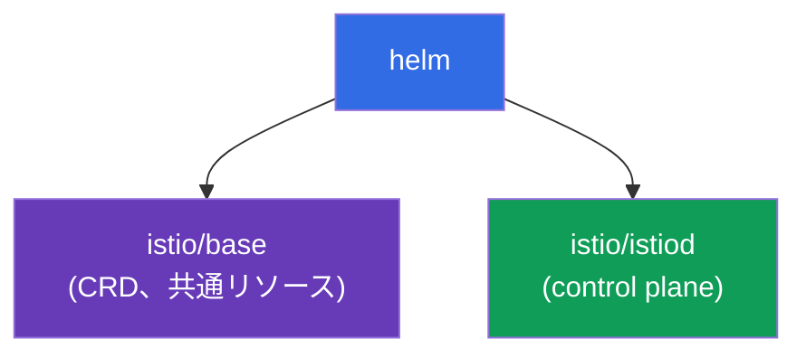
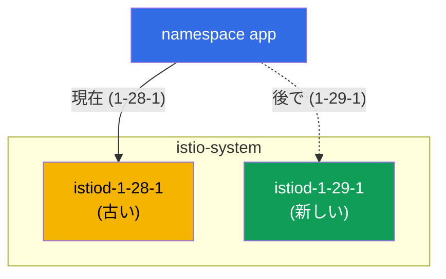

[Русская версия](ru.md) · [Eng version](en.md) · [Versión en español](es.md) · [Version française](fr.md) · [Deutsche Version](de.md) · [ქართული ვერსია](ge.md) · [繁體中文版](tw.md)

# 第3章. Istio のアップグレード: Helm、リビジョン、canary、in-place

> **この後の内容。** 第2章では istioctl を使用して Istio をインストールしました。次は Helm を使用したインストール方法、そして特に安全なアップグレード方法を見ていきます。本番環境での control plane のアップグレードはリスクのある操作です。新しい istiod に互換性がない場合、mesh 全体が停止する可能性があります。そのため、即時ロールバック可能なリビジョンと canary を使用したアップグレード方法を学びます。

## 3.1. アップグレードにおける問題

istiod はクラスター内のすべての Envoy を管理します。単に「古いものを削除して新しいものをインストール」すると、アップグレード中や非互換性が発生した場合に、すべてのトラフィックが影響を受けます。段階的にアップグレードし、ロールバック計画を持つ方法が必要です。

Istio には2つのアプローチがあります:

- **Canary upgrade（リビジョンによる）** - 古い control plane と並行して新しい control plane を起動し、アプリケーションを1つずつ移行します。ラベルを変更することでロールバックできます。
- **In-place upgrade** - 同じ istiod を2つ目のコピーなしで「その場で」アップグレードします。より簡単ですが、すべてのプロキシが一度に切り替わるため、リスクは高くなります。

両方を確認しますが、最初に Helm で Istio をインストールします。リビジョンの利用には Helm が便利だからです。

## 3.2. Helm を使用した Istio のインストール

Helm では、Istio は2つの基本チャートに分かれています:

- **`istio/base`** - CRD とクラスターリソース。すべてのリビジョンで共通のため、1回だけインストールします。
- **`istio/istiod`** - control plane 自体。リビジョンを指定してインストールできます。



リポジトリを追加します:

```bash
helm repo add istio https://istio-release.storage.googleapis.com/charts
helm repo update
```

## 3.3. リビジョンとは何か

**リビジョン（revision）** は、名前付きの control plane インスタンスです。各リビジョンには独自の Deployment `istiod-<revision>` と、sidecar 注入用の独自の webhook があります。

重要な考え方は、namespace がラベル `istio.io/rev=<revision>` を通じて、その Pod を「組み込む」リビジョンを選択することです。これにより、**2つの Istio バージョンを同時に維持**し、それらの間で負荷を切り替えられます。リビジョンがなければ、アップグレードは「すべてかゼロか」になります。

第2章との違いに注意してください。第2章では namespace に `istio-injection=enabled` ラベルを付けました。リビジョンを使用する場合は、代わりに `istio.io/rev=<revision>` を使用します。これにより、どの control plane が sidecar を注入するかを明示します。

## 3.4. リビジョンを指定した control plane のインストール

基本チャートと、リビジョン `1-28-1` の istiod をインストールします（後でアップグレード元とする古いバージョンです）。このラボでは、バージョン `1.28.1`（リビジョン `1-28-1`）と `1.29.1`（リビジョン `1-29-1`）を使用します。

```bash
kubectl create namespace istio-system

helm install istio-base istio/base -n istio-system --version 1.28.1 --set defaultRevision=1-28-1

helm install istiod-1-28-1 istio/istiod -n istio-system --version 1.28.1 --set revision=1-28-1 --wait
```

確認します:

```bash
kubectl get pods -n istio-system
```

```
NAME                              READY   STATUS    RESTARTS   AGE
istiod-1-28-1-xxxxxxxxxx-xxxxx    1/1     Running   0          40s
```

注意: Deployment の名前は `istiod-1-28-1` であり、名前にリビジョンが含まれます。これが、istiod が単に `istiod` と呼ばれる通常のインストールとの違いです。

アプリケーションをデプロイし、その namespace に必要なリビジョンのラベルを付けます:

```bash
kubectl create namespace app
kubectl label namespace app istio.io/rev=1-28-1
kubectl apply -f app.yaml -n app
kubectl rollout restart deployment -n app
```

sidecar が実際にリビジョン `1-28-1` により注入されていることは、`istio-proxy` イメージのバージョンで確認できます:

```bash
kubectl get pods -n app -o jsonpath='{range .items[*]}{.spec.initContainers[*].image}{"\n"}{end}'
```

```
docker.io/istio/proxyv2:1.28.1
```

## 3.5. Canary upgrade: 古いリビジョンと並行する新しいリビジョン

canary アップグレードの本質は、古い control plane に**並行して**、それに手を加えずに新しい control plane をデプロイすることです。まず共通 CRD（`istio-base`）をアップグレードし、次に2つ目の istiod リビジョンをインストールします。

```bash
# まず共通 CRD を新しいバージョンへアップグレードする
helm upgrade istio-base istio/base -n istio-system --version 1.29.1 --set defaultRevision=1-28-1

# 新しい istiod リビジョンをインストールする。古いリビジョンは動作を続ける
helm install istiod-1-29-1 istio/istiod -n istio-system --version 1.29.1 --set revision=1-29-1 --wait
```

これで、クラスターには同時に2つの control plane リビジョンが存在します:

```bash
kubectl get pods -n istio-system
```

```
NAME                              READY   STATUS    RESTARTS   AGE
istiod-1-28-1-xxxxxxxxxx-xxxxx    1/1     Running   0          5m
istiod-1-29-1-yyyyyyyyyy-yyyyy    1/1     Running   0          30s
```



重要: namespace `app` のアプリケーションはまだ影響を受けず、その Pod は引き続き `1-28-1` の sidecar を使用します。新しいリビジョンをインストールしても、それ自体では何も移行されません。これが canary の安全性です。新しい control plane は準備済みですが、まだ負荷は移されていません。

## 3.6. アプリケーションの移行とロールバック

namespace を新しいリビジョンに切り替え（ラベルを変更）、Pod を再起動します。再作成時に、それらは `1-29-1` の sidecar を受け取ります:

```bash
kubectl label namespace app istio.io/rev=1-29-1 --overwrite
kubectl rollout restart deployment -n app
```

移行後にプロキシのバージョンを確認します:

```bash
kubectl get pods -n app -o jsonpath='{range .items[*]}{.spec.initContainers[*].image}{"\n"}{end}'
```

```
docker.io/istio/proxyv2:1.29.1
```

アプリケーションは新しい control plane に移行しました。ここで最も価値があるのが **ロールバック** です。新しいバージョンの挙動に問題があれば、ラベルを戻して Pod を再起動するだけです。

```bash
kubectl label namespace app istio.io/rev=1-28-1 --overwrite
kubectl rollout restart deployment -n app
```

古いリビジョンはこの間ずっと稼働していたため、ロールバックは即座に行われ、予期しない事態もありません。

### まだ古いバージョンを使用しているのは誰か（移行の進捗）

namespace ごとに Pod を再起動する間、すでに移行済みのものと、まだ古い sidecar を使用しているものを把握できると便利です。

最も速い方法は、data plane のバージョン別サマリーです。各バージョンのプロキシ数を確認できます。

```bash
istioctl version
```

```
client version: 1.29.1
control plane version: 1.28.1, 1.29.1
data plane version: 1.28.1 (2 proxies), 1.29.1 (3 proxies)
```

`data plane version` の行は分布を示します。そこにまだ `1.28.1` が含まれていれば、移行は完了していません。古いバージョンに2つのプロキシが残っています。

具体的にどれがどの control plane に接続されているかを確認するには:

```bash
istioctl proxy-status
```

istiod の列には control plane Pod の名前（`istiod-1-28-1-...` または `istiod-1-29-1-...`）が表示されます。これにより、各プロキシがどのリビジョンで処理されているかを確認できます。

istioctl を使わず個別に確認するには、sidecar イメージのバージョン（および注入時に Pod に付与されるリビジョンラベル）を確認します:

```bash
kubectl get pods -A -L istio.io/rev \
  -o jsonpath='{range .items[*]}{.metadata.namespace}{"\t"}{.metadata.name}{"\t"}{.spec.initContainers[*].image}{"\n"}{end}' \
  | grep proxyv2
```

```
app   productpage-...   docker.io/istio/proxyv2:1.28.1   <- まだ古いバージョン
app   reviews-...       docker.io/istio/proxyv2:1.29.1
```

`proxyv2:1.28.1` を使用する Pod（または `istio.io/rev` 列に古いリビジョンがある Pod）は、移行を完了するために `rollout restart` で再作成する必要があるものです。

## 3.7. デフォルトリビジョンと `default` タグ

上記の例では、各 namespace に `istio.io/rev=1-28-1` を明示的に指定しました。しかし、アップグレードのたびにすべての namespace のラベルを変更するのは不便です。このために **リビジョンタグ**（revision tags）があります。これは特定のリビジョンを指す安定したエイリアスです。最も重要なものは、「デフォルトリビジョン」である `default` タグです。

通常のラベル `istio-injection=enabled`（第2章のもの）を持つ namespace は、`default` タグが指すリビジョンによって処理されます。つまり、`istio-injection=enabled` と `istio.io/rev=default` は同じです。どちらもデフォルトリビジョンを指します。Helm を使用したインストール時に、フラグ `--set defaultRevision=<revision>` でこのタグを設定しておくと便利です（3.4/3.5 で実施しました）。

### デフォルトリビジョンを確認する

```bash
istioctl tag list
```

```
TAG      REVISION   NAMESPACES
default  1-28-1     ...
```

`REVISION` 列は `default` タグが現在指すリビジョンを示し、`NAMESPACES` はそれを使用する namespace（つまり `istio-injection=enabled` または `istio.io/rev=default` が付いた namespace）を示します。同じことは webhook でも確認できます:

```bash
kubectl get mutatingwebhookconfiguration -l istio.io/tag=default \
  -o jsonpath='{.items[0].metadata.labels.istio\.io/rev}{"\n"}'
```

```
1-28-1
```

### デフォルトリビジョンを変更する（一括で全員を移行する）

シナリオ: 新しいリビジョン `1-29-1` を一部の負荷で検証し（3.6 の canary）、デフォルトリビジョンを使用する**すべての** Pod をそこへ移行したいとします。namespace が明示的なリビジョンではなく `istio-injection=enabled` でマークされている場合、各 namespace のラベルを変更する必要はありません。`default` タグを新しいリビジョンに切り替えるだけです:

```bash
istioctl tag set default --revision 1-29-1 --overwrite
```

タグが新しいリビジョンを指すようになったことを確認します:

```bash
istioctl tag list
```

```
TAG      REVISION   NAMESPACES
default  1-29-1     ...
```

canary と同様に、タグを移すだけでは何も移行されません。変更されるのは、`default` が注入するリビジョンだけです。Pod を実際に新しい sidecar へ移行するには、Pod を再作成する必要があります:

```bash
kubectl rollout restart deployment -n app
```

再起動後、デフォルトリビジョンを使用するすべての namespace は、新しいリビジョンの sidecar を受け取ります。各 namespace を回ることなく、1回のタグ変更で移行できます。ロールバックも同じように簡単です。タグを古いリビジョンに戻し、Pod を再起動します。

```bash
istioctl tag set default --revision 1-28-1 --overwrite
kubectl rollout restart deployment -n app
```

> 2つのマーキングモデルを無計画に混在させないでください。namespace が明示的なリビジョン（`istio.io/rev=1-28-1`）でマークされている場合、`default` タグは影響しません。そのような namespace は（3.6 のように）独自のラベルを変更して切り替えます。`default` タグが管理するのは、`istio-injection=enabled` / `istio.io/rev=default` を使用しているものだけです。

## 3.8. 古いリビジョンの削除

新しいリビジョンですべてが安定していることを確認したら、古い control plane を削除できます:

```bash
helm uninstall istiod-1-28-1 -n istio-system
```

これは、**すべての** namespace が新しいリビジョンに移行してから実行してください。そうしないと、まだ古いリビジョンを参照する Pod が対応する istiod を失います。

## 3.9. In-place upgrade: 代替手段

リビジョンを使用する canary は最も安全な方法ですが、Istio は「その場で」のアップグレードもサポートしています。この場合、2つ目のリビジョンはありません。同じ istiod リリースを `helm upgrade` でアップグレードします。namespace には通常のラベル `istio-injection=enabled` を付けます。

```bash
# リビジョンなしの基本インストール
helm install istio-base istio/base -n istio-system --version 1.28.1
helm install istiod istio/istiod -n istio-system --version 1.28.1 --wait
kubectl label namespace app istio-injection=enabled --overwrite

# 後で: CRD と istiod をその場で新しいバージョンへアップグレードする
helm upgrade istio-base istio/base -n istio-system --version 1.29.1
helm upgrade istiod    istio/istiod -n istio-system --version 1.29.1 --wait

# アプリケーションを再起動し、Pod が新しい sidecar を受け取るようにする
kubectl rollout restart deployment -n app
```

欠点: すべてのプロキシが（Pod の再起動後）一度に新しいバージョンへ切り替わり、ロールバックはラベル変更ではなく `helm rollback` で行います。

## 3.10. Canary と in-place: どちらを選ぶか

| | Canary（リビジョン） | In-place |
|---|------------------|----------|
| 2つ目の control plane | はい、並行して存在 | いいえ |
| 負荷の切り替え | namespace ごとに段階的に | すべて一度に |
| ロールバック | `istio.io/rev` のラベルを変更 | `helm rollback` |
| リスク | 低い | 高い |
| 複雑さ | 高い（2つのリビジョン） | 低い |

ルールはシンプルです。本番環境と重要なアップグレードには canary を選んでください。テストクラスターや小規模なアップグレードでは、in-place の方が速く簡単です。

istioctl での同等のコマンドは `istioctl upgrade` です。これはリビジョンなしのインストールを「その場で」アップグレードするため、istioctl における in-place アプローチの相当物です。

## 3.11. この章のまとめ

- Helm では、Istio は2つのチャートに分かれています: `istio/base`（CRD、クラスターごとに1つ）と `istio/istiod`（control plane）。
- リビジョンは名前付きの istiod インスタンスであり、namespace はラベル `istio.io/rev=<revision>` でリビジョンを選択します。
- リビジョンにより、2つの Istio バージョンを同時に維持できます。これが canary アップグレードの基盤です。
- Canary: 新しいリビジョンを並行してインストールし、ラベル変更と `rollout restart` により namespace を移行します。問題があればラベルを戻します。
- 新しいリビジョンをインストールしても自動では何も移行されないため、プロセス自体が安全になります。
- 移行の進捗は、`istioctl version`（各バージョンのプロキシ数）、`istioctl proxy-status`（各プロキシが接続する istiod）、Pod の `proxyv2` イメージバージョンで確認できます。
- `default` タグはデフォルトリビジョン（`istio-injection=enabled` ラベル用）です。`istioctl tag list` で確認でき、`istioctl tag set default
  --revision <rev> --overwrite` + `rollout restart` で変更できます。これにより、全員を一度に移行できます。
- In-place はより簡単ですが、全員を一度に切り替え、`helm rollback` でロールバックします。
- 本番環境では canary が推奨されます。

## 3.12. 自己確認のための質問

1. Istio が `base` と `istiod` のチャートに分かれているのはなぜですか？ どちらを1回だけインストールしますか？
2. リビジョンとは何ですか？ また、namespace はどのリビジョンで sidecar を注入するかをどのように選びますか？
3. 新しい istiod リビジョンをインストールしても、なぜ稼働中のアプリケーションは壊れないのですか？
4. canary アップグレードでロールバックするにはどうしますか？ in-place の場合はどうですか？
5. in-place upgrade が適切なのはいつですか？ また、canary の方が良いのはいつですか？
6. `default` タグとは何ですか？ 現在のデフォルトリビジョンを確認するにはどうしますか？ また、`istio-injection=enabled` が付いたすべての namespace を一度に新しいリビジョンへ移行するにはどうしますか？

## 演習

ラボを実施してください: リビジョンを指定して Helm で Istio をインストールし、アプリケーションをデプロイして、新しいバージョンへの canary アップグレードとロールバックを実行します。

🧪 ラボ 07: [tasks/ica/labs/07](../../labs/07/README_JP.MD)

---
[目次](../README_JP.md) · [第2章](../02/jp.md) · [第4章](../04/jp.md)
