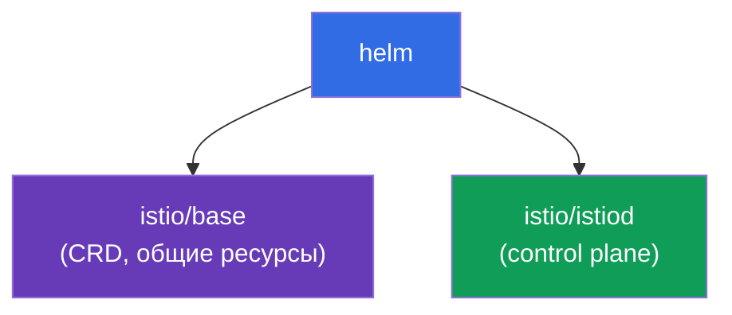
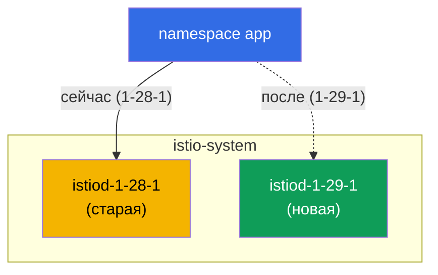

[Eng version](en.md) · [Versión en español](es.md) · [Version française](fr.md) · [Deutsche Version](de.md)

# Глава 3. Обновление Istio: Helm, ревизии, canary и in-place

> **Что дальше.** В главе 2 мы поставили Istio через istioctl. Теперь разберём, как
> ставить его через Helm и, главное, как безопасно обновлять. Обновление control
> plane в проде - операция рискованная: если новый istiod окажется несовместим, может
> лечь весь mesh. Поэтому научимся делать это через ревизии и canary, с возможностью
> мгновенного отката.

## 3.1. В чём проблема обновления

istiod управляет всеми Envoy в кластере. Если просто «снести старый и поставить
новый», то на время обновления и при любой несовместимости пострадает весь трафик.
Нужен способ обновляться постепенно и с планом отката.

Istio даёт два подхода:

- **Canary upgrade (через ревизии)** - рядом со старым control plane поднимается новый,
  и приложения переводятся на него по одному, с возможностью отката сменой метки.
- **In-place upgrade** - тот же istiod обновляется «на месте», без второй копии. Проще,
  но рискованнее: все прокси переключаются разом.

Разберём оба, но сначала поставим Istio через Helm, потому что именно Helm удобно
использует ревизии.

## 3.2. Установка Istio через Helm

В Helm Istio разбит на два базовых чарта:

- **`istio/base`** - CRD и кластерные ресурсы. Ставится один раз, общий для всех
  ревизий.
- **`istio/istiod`** - сам control plane. Его можно поставить с указанием ревизии.



Добавляем репозиторий:

```bash
helm repo add istio https://istio-release.storage.googleapis.com/charts
helm repo update
```

## 3.3. Что такое ревизия

**Ревизия (revision)** - это именованный экземпляр control plane. У каждой ревизии
свой Deployment `istiod-<revision>` и свой webhook для внедрения sidecar.

Ключевая идея: namespace выбирает, какой ревизией будут «прошиты» его поды, через
метку `istio.io/rev=<revision>`. Именно это позволяет держать **две версии Istio
одновременно** и переключать нагрузку между ними. Без ревизий обновление было бы
«всё или ничего».

Обратите внимание на разницу с главой 2: там мы помечали namespace меткой
`istio-injection=enabled`. При работе с ревизиями вместо неё используется
`istio.io/rev=<revision>` - так мы явно говорим, какой именно control plane инжектит
sidecar.

## 3.4. Установка control plane с ревизией

Ставим базовый чарт и istiod ревизии `1-28-1` (это старая версия, с которой позже
будем обновляться). В лабе используются версии `1.28.1` (ревизия `1-28-1`) и `1.29.1`
(ревизия `1-29-1`).

```bash
kubectl create namespace istio-system

helm install istio-base istio/base -n istio-system --version 1.28.1 --set defaultRevision=1-28-1

helm install istiod-1-28-1 istio/istiod -n istio-system --version 1.28.1 --set revision=1-28-1 --wait
```

Проверяем:

```bash
kubectl get pods -n istio-system
```

```
NAME                              READY   STATUS    RESTARTS   AGE
istiod-1-28-1-xxxxxxxxxx-xxxxx    1/1     Running   0          40s
```

Обратите внимание: Deployment называется `istiod-1-28-1`, имя содержит ревизию. Это и
отличает ревизионную установку от обычной, где istiod называется просто `istiod`.

Разворачиваем приложение и помечаем его namespace нужной ревизией:

```bash
kubectl create namespace app
kubectl label namespace app istio.io/rev=1-28-1
kubectl apply -f app.yaml -n app
kubectl rollout restart deployment -n app
```

Убедиться, что sidecar внедрён именно ревизией `1-28-1`, можно по версии образа
`istio-proxy`:

```bash
kubectl get pods -n app -o jsonpath='{range .items[*]}{.spec.initContainers[*].image}{"\n"}{end}'
```

```
docker.io/istio/proxyv2:1.28.1
```

## 3.5. Canary upgrade: новая ревизия рядом со старой

Суть canary-обновления: новый control plane разворачивается **рядом** со старым, не
трогая его. Сначала обновляем общие CRD (`istio-base`), затем ставим вторую ревизию
istiod.

```bash
# сначала обновляем общие CRD до новой версии
helm upgrade istio-base istio/base -n istio-system --version 1.29.1 --set defaultRevision=1-28-1

# ставим новую ревизию istiod, старая продолжает работать
helm install istiod-1-29-1 istio/istiod -n istio-system --version 1.29.1 --set revision=1-29-1 --wait
```

Теперь в кластере две ревизии control plane одновременно:

```bash
kubectl get pods -n istio-system
```

```
NAME                              READY   STATUS    RESTARTS   AGE
istiod-1-28-1-xxxxxxxxxx-xxxxx    1/1     Running   0          5m
istiod-1-29-1-yyyyyyyyyy-yyyyy    1/1     Running   0          30s
```



Важно: приложение в namespace `app` пока не затронуто, его поды по-прежнему используют
sidecar от `1-28-1`. Установка новой ревизии сама по себе ничего не мигрирует. В этом
и есть безопасность canary: новый control plane готов, но нагрузка на него ещё не
переведена.

## 3.6. Миграция приложения и откат

Переключаем namespace на новую ревизию (меняем метку) и перезапускаем поды. При
пересоздании они получат sidecar уже от `1-29-1`:

```bash
kubectl label namespace app istio.io/rev=1-29-1 --overwrite
kubectl rollout restart deployment -n app
```

Проверяем версию прокси после миграции:

```bash
kubectl get pods -n app -o jsonpath='{range .items[*]}{.spec.initContainers[*].image}{"\n"}{end}'
```

```
docker.io/istio/proxyv2:1.29.1
```

Приложение переехало на новый control plane. Самое ценное здесь - **откат**: если
новая версия повела себя плохо, достаточно вернуть метку и перезапустить поды.

```bash
kubectl label namespace app istio.io/rev=1-28-1 --overwrite
kubectl rollout restart deployment -n app
```

Старая ревизия всё это время работала, поэтому откат мгновенный и без сюрпризов.

### Кто ещё на старой версии (прогресс миграции)

Пока вы перезапускаете поды namespace за namespace, полезно видеть, кто уже переехал, а
кто ещё на старом sidecar.

Быстрее всего - сводка по версиям data plane: сколько прокси на каждой версии.

```bash
istioctl version
```

```
client version: 1.29.1
control plane version: 1.28.1, 1.29.1
data plane version: 1.28.1 (2 proxies), 1.29.1 (3 proxies)
```

Строка `data plane version` показывает распределение. Пока в ней есть `1.28.1`,
миграция не завершена - на старой версии осталось 2 прокси.

Кто именно и к какому control plane подключён:

```bash
istioctl proxy-status
```

В колонке с istiod видно имя пода control plane (`istiod-1-28-1-...` или
`istiod-1-29-1-...`) - по нему понятно, какой ревизией обслуживается каждый прокси.

Поштучно и без istioctl - по версии образа sidecar (и по метке ревизии, которую
инъекция ставит на под):

```bash
kubectl get pods -A -L istio.io/rev \
  -o jsonpath='{range .items[*]}{.metadata.namespace}{"\t"}{.metadata.name}{"\t"}{.spec.initContainers[*].image}{"\n"}{end}' \
  | grep proxyv2
```

```
app   productpage-...   docker.io/istio/proxyv2:1.28.1   <- ещё на старой
app   reviews-...       docker.io/istio/proxyv2:1.29.1
```

Поды с `proxyv2:1.28.1` (или со старой ревизией в колонке `istio.io/rev`) - это те,
которые ещё нужно пересоздать через `rollout restart`, чтобы завершить миграцию.

## 3.7. Ревизия по умолчанию и тег `default`

В примерах выше мы явно писали `istio.io/rev=1-28-1` на каждом namespace. Но менять
метку на всех namespace при каждом обновлении неудобно. Для этого есть **теги ревизий**
(revision tags) - стабильные псевдонимы, указывающие на конкретную ревизию. Самый
важный из них - тег `default`, «ревизия по умолчанию».

Namespace с обычной меткой `istio-injection=enabled` (из главы 2) обслуживается именно
той ревизией, на которую указывает тег `default`. То есть `istio-injection=enabled` и
`istio.io/rev=default` - это одно и то же: обе указывают на ревизию по умолчанию. Тег
удобно завести сразу при установке через Helm флагом `--set defaultRevision=<revision>`
(мы делали это в 3.4/3.5).

### Посмотреть ревизию по умолчанию

```bash
istioctl tag list
```

```
TAG      REVISION   NAMESPACES
default  1-28-1     ...
```

Колонка `REVISION` показывает, на какую ревизию сейчас смотрит тег `default`, а
`NAMESPACES` - какие namespace им пользуются (то есть помечены `istio-injection=enabled`
или `istio.io/rev=default`). То же самое можно увидеть по webhook:

```bash
kubectl get mutatingwebhookconfiguration -l istio.io/tag=default \
  -o jsonpath='{.items[0].metadata.labels.istio\.io/rev}{"\n"}'
```

```
1-28-1
```

### Сменить ревизию по умолчанию (перевести всех разом)

Сценарий: вы проверили новую ревизию `1-29-1` на части нагрузки (canary из 3.6) и
теперь хотите, чтобы **все** поды, сидящие на ревизии по умолчанию, переехали на неё.
Если namespace помечены `istio-injection=enabled` (а не явной ревизией), не нужно
трогать метку на каждом - достаточно переставить тег `default` на новую ревизию:

```bash
istioctl tag set default --revision 1-29-1 --overwrite
```

Проверяем, что тег теперь указывает на новую ревизию:

```bash
istioctl tag list
```

```
TAG      REVISION   NAMESPACES
default  1-29-1     ...
```

Как и при canary, сам перенос тега ничего не мигрирует - он лишь меняет, какую ревизию
инжектит `default`. Чтобы поды реально переехали на новый sidecar, их надо пересоздать:

```bash
kubectl rollout restart deployment -n app
```

После рестарта все namespace на ревизии по умолчанию получат sidecar новой ревизии -
одной сменой тега, без обхода каждого namespace. Откат такой же простой: вернуть тег на
старую ревизию и перезапустить поды.

```bash
istioctl tag set default --revision 1-28-1 --overwrite
kubectl rollout restart deployment -n app
```

> Две модели маркировки не смешивайте бездумно: если namespace помечен явной ревизией
> (`istio.io/rev=1-28-1`), тег `default` на него не влияет - такой namespace переключают
> сменой его собственной метки (как в 3.6). Тег `default` управляет только теми, кто
> сидит на `istio-injection=enabled` / `istio.io/rev=default`.

## 3.8. Удаление старой ревизии

Когда вы убедились, что всё стабильно на новой ревизии, старый control plane можно
убрать:

```bash
helm uninstall istiod-1-28-1 -n istio-system
```

Делать это стоит только после того, как **все** namespace переведены на новую ревизию.
Иначе поды, которые всё ещё ссылаются на старую ревизию, останутся без своего istiod.

## 3.9. In-place upgrade: альтернатива

Canary через ревизии - самый безопасный путь, но Istio поддерживает и обновление «на
месте». Тут нет второй ревизии: тот же релиз istiod обновляется через `helm upgrade`.
namespace при этом помечается обычной меткой `istio-injection=enabled`.

```bash
# базовая установка без ревизии
helm install istio-base istio/base -n istio-system --version 1.28.1
helm install istiod istio/istiod -n istio-system --version 1.28.1 --wait
kubectl label namespace app istio-injection=enabled --overwrite

# позже: обновляем CRD и istiod на месте до новой версии
helm upgrade istio-base istio/base -n istio-system --version 1.29.1
helm upgrade istiod    istio/istiod -n istio-system --version 1.29.1 --wait

# перезапускаем приложение, чтобы поды получили новый sidecar
kubectl rollout restart deployment -n app
```

Минусы: все прокси переключаются на новую версию сразу (после перезапуска подов), а
откат делается не сменой метки, а через `helm rollback`.

## 3.10. Canary или in-place: что выбрать

| | Canary (ревизии) | In-place |
|---|------------------|----------|
| Второй control plane | да, рядом | нет |
| Переключение нагрузки | по namespace, постепенно | сразу для всех |
| Откат | сменить метку `istio.io/rev` | `helm rollback` |
| Риск | ниже | выше |
| Сложность | выше (две ревизии) | ниже |

Правило простое: для продакшна и ответственных обновлений берите canary. Для тестовых
кластеров или мелких обновлений in-place быстрее и проще.

Эквивалент через istioctl - команда `istioctl upgrade`: она обновляет установку без
ревизии «на месте», то есть это istioctl-аналог in-place подхода.

## 3.11. Итоги главы

- В Helm Istio разбит на два чарта: `istio/base` (CRD, один на кластер) и
  `istio/istiod` (control plane).
- Ревизия это именованный экземпляр istiod; namespace выбирает ревизию меткой
  `istio.io/rev=<revision>`.
- Ревизии позволяют держать две версии Istio одновременно - основа canary-обновления.
- Canary: поставить новую ревизию рядом, перевести namespace сменой метки и
  `rollout restart`, при проблеме вернуть метку назад.
- Установка новой ревизии ничего не мигрирует автоматически, это делает безопасным сам
  процесс.
- Прогресс миграции видно через `istioctl version` (сколько прокси на каждой версии),
  `istioctl proxy-status` (к какому istiod подключён каждый прокси) и по версии образа
  `proxyv2` в подах.
- Тег `default` - это ревизия по умолчанию (для меток `istio-injection=enabled`);
  посмотреть его можно `istioctl tag list`, а сменить - `istioctl tag set default
  --revision <rev> --overwrite` + `rollout restart`, что переводит всех разом.
- In-place проще, но переключает всех разом и откатывается через `helm rollback`.
- Для прода предпочтителен canary.

## 3.12. Вопросы для самопроверки

1. Зачем Istio разбит на чарты `base` и `istiod`? Что из них ставится один раз?
2. Что такое ревизия и как namespace выбирает, какой ревизией инжектить sidecar?
3. Почему установка новой ревизии istiod не ломает работающее приложение?
4. Как выполнить откат при canary-обновлении? А при in-place?
5. Когда оправдан in-place upgrade, а когда лучше canary?
6. Что такое тег `default`? Как посмотреть текущую ревизию по умолчанию и как перевести
   на новую ревизию сразу все namespace, помеченные `istio-injection=enabled`?

## Практика

Пройдите лабу: установите Istio через Helm с ревизией, разверните приложение,
выполните canary-обновление на новую версию и откат.

🧪 Лаба 07: [tasks/ica/labs/07](../../labs/07/README_RU.MD)

---
[Оглавление](../README.md) · [Глава 2](../02/ru.md) · [Глава 4](../04/ru.md)
