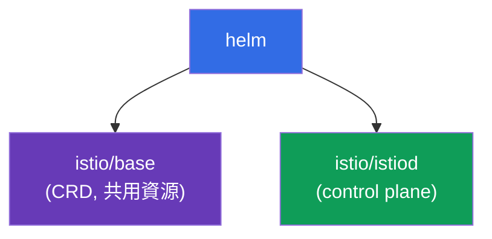
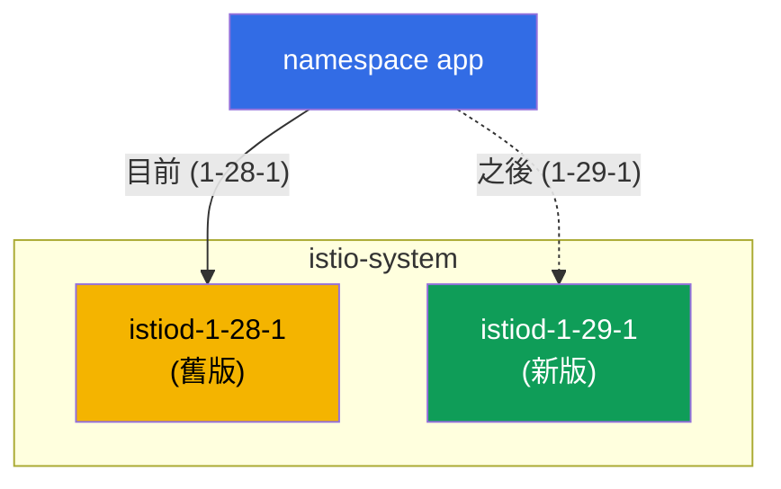

[Русская версия](ru.md) · [Eng version](en.md) · [Versión en español](es.md) · [Version française](fr.md) · [Deutsche Version](de.md) · [ქართული ვერსია](ge.md) · [日本語版](jp.md)

# 第 3 章：升級 Istio：Helm、修訂版、canary 與 in-place

> **接下來。** 在第 2 章中，我們透過 istioctl 安裝了 Istio。現在將了解如何透過 Helm
> 安裝它，以及最重要的是，如何安全地升級。於生產環境升級 control
> plane 是有風險的操作：若新的 istiod 不相容，整個 mesh
> 都可能失效。因此，我們將學習透過修訂版與 canary 進行升級，並能夠立即回復。

## 3.1. 升級的問題是什麼

istiod 管理叢集中的所有 Envoy。若只是「移除舊版並安裝
新版」，那麼在升級期間，或發生任何不相容情況時，所有流量都會受到影響。
我們需要一種能夠逐步升級且具備回復計畫的方式。

Istio 提供兩種方法：

- **Canary 升級（透過修訂版）** - 在舊 control plane 旁啟動新的 control plane，
  並逐一將應用程式遷移至新版本，能透過變更標籤回復。
- **In-place 升級** - 在「原地」升級同一個 istiod，不建立第二個副本。較簡單，
  但風險更高：所有 proxy 會同時切換。

我們將了解兩者，但先透過 Helm 安裝 Istio，因為 Helm 對修訂版的使用
特別便利。

## 3.2. 透過 Helm 安裝 Istio

在 Helm 中，Istio 分為兩個基礎 chart：

- **`istio/base`** - CRD 與叢集資源。只安裝一次，供所有
  修訂版共用。
- **`istio/istiod`** - control plane 本身。可於安裝時指定修訂版。



新增儲存庫：

```bash
helm repo add istio https://istio-release.storage.googleapis.com/charts
helm repo update
```

## 3.3. 什麼是修訂版

**修訂版（revision）** 是 control plane 的具名執行個體。每個修訂版都有自己的
Deployment `istiod-<revision>`，以及自己的 sidecar 注入 webhook。

核心概念是：namespace 透過
標籤 `istio.io/rev=<revision>` 選擇要用哪個修訂版「注入」其 pod。正是這使我們能夠**同時
保留兩個版本的 Istio**，並在它們之間切換負載。若沒有修訂版，升級將會是
「全有或全無」。

請注意與第 2 章的差異：當時我們以
`istio-injection=enabled` 標記 namespace。使用修訂版時，改用
`istio.io/rev=<revision>`，以明確指定由哪一個 control plane 注入
sidecar。

## 3.4. 以修訂版安裝 control plane

安裝基礎 chart 和修訂版 `1-28-1` 的 istiod（這是稍後要升級的舊版本）。
此實驗使用 `1.28.1`（修訂版 `1-28-1`）與 `1.29.1`
（修訂版 `1-29-1`）。

```bash
kubectl create namespace istio-system

helm install istio-base istio/base -n istio-system --version 1.28.1 --set defaultRevision=1-28-1

helm install istiod-1-28-1 istio/istiod -n istio-system --version 1.28.1 --set revision=1-28-1 --wait
```

驗證：

```bash
kubectl get pods -n istio-system
```

```
NAME                              READY   STATUS    RESTARTS   AGE
istiod-1-28-1-xxxxxxxxxx-xxxxx    1/1     Running   0          40s
```

請注意：Deployment 名為 `istiod-1-28-1`，名稱包含修訂版。這正是
修訂版安裝與一般安裝的差別；一般安裝中 istiod 僅稱為 `istiod`。

部署應用程式，並以所需修訂版標記其 namespace：

```bash
kubectl create namespace app
kubectl label namespace app istio.io/rev=1-28-1
kubectl apply -f app.yaml -n app
kubectl rollout restart deployment -n app
```

若要確認 sidecar 確實由修訂版 `1-28-1` 注入，可查看
`istio-proxy` 映像檔的版本：

```bash
kubectl get pods -n app -o jsonpath='{range .items[*]}{.spec.initContainers[*].image}{"\n"}{end}'
```

```
docker.io/istio/proxyv2:1.28.1
```

## 3.5. Canary 升級：新修訂版與舊版並存

canary 升級的要點是：將新的 control plane 部署在舊版**旁邊**，不
碰觸舊版。先升級共用 CRD（`istio-base`），再安裝第二個 istiod 修訂版。

```bash
# 首先將共用 CRD 升級至新版本
helm upgrade istio-base istio/base -n istio-system --version 1.29.1 --set defaultRevision=1-28-1

# 安裝新的 istiod 修訂版，舊版繼續運作
helm install istiod-1-29-1 istio/istiod -n istio-system --version 1.29.1 --set revision=1-29-1 --wait
```

現在叢集中同時有兩個 control plane 修訂版：

```bash
kubectl get pods -n istio-system
```

```
NAME                              READY   STATUS    RESTARTS   AGE
istiod-1-28-1-xxxxxxxxxx-xxxxx    1/1     Running   0          5m
istiod-1-29-1-yyyyyyyyyy-yyyyy    1/1     Running   0          30s
```



重要的是：`app` namespace 中的應用程式尚未受到影響，其 pod 仍使用來自
`1-28-1` 的 sidecar。安裝新修訂版本身不會遷移任何東西。這正是 canary 的
安全性所在：新的 control plane 已就緒，但負載尚未切換至它。

## 3.6. 遷移應用程式與回復

將 namespace 切換到新修訂版（變更標籤）並重新啟動 pod。重新建立時，它們將取得
來自 `1-29-1` 的 sidecar：

```bash
kubectl label namespace app istio.io/rev=1-29-1 --overwrite
kubectl rollout restart deployment -n app
```

遷移後驗證 proxy 版本：

```bash
kubectl get pods -n app -o jsonpath='{range .items[*]}{.spec.initContainers[*].image}{"\n"}{end}'
```

```
docker.io/istio/proxyv2:1.29.1
```

應用程式已遷移至新的 control plane。這裡最重要的價值是**回復**：若
新版本表現不佳，只要還原標籤並重新啟動 pod 即可。

```bash
kubectl label namespace app istio.io/rev=1-28-1 --overwrite
kubectl rollout restart deployment -n app
```

舊修訂版在整個過程中始終運作，因此回復立即生效且不會出現意外。

### 哪些仍在舊版本（遷移進度）

當您逐個 namespace 重新啟動 pod 時，查看哪些已遷移、哪些仍使用舊 sidecar
會很有幫助。

最快的方式是查看 data plane 版本摘要：每個版本有多少 proxy。

```bash
istioctl version
```

```
client version: 1.29.1
control plane version: 1.28.1, 1.29.1
data plane version: 1.28.1 (2 proxies), 1.29.1 (3 proxies)
```

`data plane version` 這一行顯示分布情況。只要其中仍有 `1.28.1`，遷移就
尚未完成；舊版本上還剩下 2 個 proxy。

要查看具體是誰以及連線到哪個 control plane：

```bash
istioctl proxy-status
```

istiod 欄位中會顯示 control plane pod 名稱（`istiod-1-28-1-...` 或
`istiod-1-29-1-...`），藉此可得知每個 proxy 由哪個修訂版提供服務。

逐一查看且不使用 istioctl 時，可依 sidecar 的映像檔版本（以及注入時為 pod
設定的修訂版標籤）判斷：

```bash
kubectl get pods -A -L istio.io/rev \
  -o jsonpath='{range .items[*]}{.metadata.namespace}{"\t"}{.metadata.name}{"\t"}{.spec.initContainers[*].image}{"\n"}{end}' \
  | grep proxyv2
```

```
app   productpage-...   docker.io/istio/proxyv2:1.28.1   <- 仍在舊版
app   reviews-...       docker.io/istio/proxyv2:1.29.1
```

使用 `proxyv2:1.28.1`（或 `istio.io/rev` 欄中舊修訂版）的 pod，便是仍需要
透過 `rollout restart` 重新建立以完成遷移的那些 pod。

## 3.7. 預設修訂版與 `default` 標籤

在上面的範例中，我們在每個 namespace 明確設定 `istio.io/rev=1-28-1`。但每次
升級都要變更所有 namespace 的標籤並不方便。為此可使用**修訂版標籤**
（revision tags）--指向特定修訂版的穩定別名。其中最重要的是 `default`
標籤，也就是「預設修訂版」。

帶有一般標籤 `istio-injection=enabled`（來自第 2 章）的 Namespace，會由
`default` 標籤指向的修訂版提供服務。換句話說，`istio-injection=enabled` 與
`istio.io/rev=default` 是相同的：兩者都指向預設修訂版。可在透過 Helm 安裝時，
以 `--set defaultRevision=<revision>` 旗標立即設定標籤（我們在 3.4/3.5
已這樣做）。

### 查看預設修訂版

```bash
istioctl tag list
```

```
TAG      REVISION   NAMESPACES
default  1-28-1     ...
```

`REVISION` 欄位顯示 `default` 標籤目前指向哪個修訂版，而
`NAMESPACES` 則顯示哪些 namespace 正在使用它（亦即標記為 `istio-injection=enabled`
或 `istio.io/rev=default`）。也可從 webhook 查看相同資訊：

```bash
kubectl get mutatingwebhookconfiguration -l istio.io/tag=default \
  -o jsonpath='{.items[0].metadata.labels.istio\.io/rev}{"\n"}'
```

```
1-28-1
```

### 變更預設修訂版（一次遷移所有項目）

情境：您已在部分負載上驗證新修訂版 `1-29-1`（3.6 的 canary），現在希望**所有**
使用預設修訂版的 pod 都遷移至它。若 namespace 標記為 `istio-injection=enabled`
（而非明確修訂版），不需要逐一變更其標籤--只需將 `default` 標籤改指向
新修訂版：

```bash
istioctl tag set default --revision 1-29-1 --overwrite
```

確認標籤現在指向新修訂版：

```bash
istioctl tag list
```

```
TAG      REVISION   NAMESPACES
default  1-29-1     ...
```

與 canary 一樣，單純移動標籤不會遷移任何項目--它只改變由 `default` 注入的
修訂版。若要讓 pod 確實遷移到新的 sidecar，必須重新建立它們：

```bash
kubectl rollout restart deployment -n app
```

重新啟動後，預設修訂版上的所有 namespace 都會取得新修訂版的 sidecar--
只需一次標籤變更，無須逐一處理每個 namespace。回復也同樣簡單：將標籤還原至
舊修訂版並重新啟動 pod。

```bash
istioctl tag set default --revision 1-28-1 --overwrite
kubectl rollout restart deployment -n app
```

> 不要不經思考就混用兩種標記模型：若 namespace 標記了明確修訂版
> （`istio.io/rev=1-28-1`），`default` 標籤不會影響它--應透過變更其自己的
> 標籤切換該 namespace（如 3.6）。`default` 標籤只管理使用
> `istio-injection=enabled` / `istio.io/rev=default` 的 namespace。

## 3.8. 移除舊修訂版

當您確認新修訂版一切穩定後，即可移除舊 control plane：

```bash
helm uninstall istiod-1-28-1 -n istio-system
```

這只能在**所有** namespace 都已遷移至新修訂版後進行。否則，仍參照舊修訂版的
pod 將失去自己的 istiod。

## 3.9. In-place 升級：替代方案

透過修訂版的 canary 是最安全的途徑，但 Istio 也支援「原地」升級。此處沒有
第二個修訂版：透過 `helm upgrade` 升級同一個 istiod release。namespace 則
以一般標籤 `istio-injection=enabled` 標記。

```bash
# 不含修訂版的基礎安裝
helm install istio-base istio/base -n istio-system --version 1.28.1
helm install istiod istio/istiod -n istio-system --version 1.28.1 --wait
kubectl label namespace app istio-injection=enabled --overwrite

# 之後：原地將 CRD 與 istiod 升級至新版本
helm upgrade istio-base istio/base -n istio-system --version 1.29.1
helm upgrade istiod    istio/istiod -n istio-system --version 1.29.1 --wait

# 重新啟動應用程式，讓 pod 取得新的 sidecar
kubectl rollout restart deployment -n app
```

缺點是：所有 proxy 會立即切換到新版本（重新啟動 pod 後），而回復並非透過
變更標籤，而是透過 `helm rollback`。

## 3.10. Canary 或 in-place：該選哪一個

| | Canary（修訂版） | In-place |
|---|------------------|----------|
| 第二個 control plane | 是，並存 | 否 |
| 切換負載 | 依 namespace，逐步進行 | 所有人立即切換 |
| 回復 | 變更 `istio.io/rev` 標籤 | `helm rollback` |
| 風險 | 較低 | 較高 |
| 複雜度 | 較高（兩個修訂版） | 較低 |

規則很簡單：面對生產環境與重要升級時，選用 canary。對測試叢集或小型
升級，in-place 更快速、也更簡單。

其等效的 istioctl 指令是 `istioctl upgrade`：它會不使用修訂版、以「原地」方式
升級安裝，也就是 in-place 方法的 istioctl 等效作法。

## 3.11. 本章總結

- 在 Helm 中，Istio 分為兩個 chart：`istio/base`（CRD，每個叢集一個）與
  `istio/istiod`（control plane）。
- 修訂版是 istiod 的具名執行個體；namespace 透過
  `istio.io/rev=<revision>` 標籤選擇修訂版。
- 修訂版允許同時保留兩個版本的 Istio，是 canary 升級的基礎。
- Canary：在旁部署新修訂版，藉由變更 namespace 標籤並執行
  `rollout restart` 遷移，出問題時將標籤改回即可。
- 安裝新修訂版不會自動遷移任何項目，這使整個過程安全。
- 可透過 `istioctl version`（各版本的 proxy 數量）、
  `istioctl proxy-status`（每個 proxy 連線到哪個 istiod），以及 pod 中
  `proxyv2` 映像檔的版本查看遷移進度。
- `default` 標籤是預設修訂版（供 `istio-injection=enabled` 標籤使用）；
  可用 `istioctl tag list` 查看，並可用 `istioctl tag set default
  --revision <rev> --overwrite` + `rollout restart` 變更，這會一次遷移所有項目。
- In-place 較簡單，但會一次切換所有項目，並透過 `helm rollback` 回復。
- 生產環境建議使用 canary。

## 3.12. 自我檢查問題

1. 為什麼 Istio 分為 `base` 與 `istiod` chart？哪一個只需安裝一次？
2. 什麼是修訂版？namespace 如何選擇由哪個修訂版注入 sidecar？
3. 為什麼安裝新的 istiod 修訂版不會破壞正在運作的應用程式？
4. 如何在 canary 升級時回復？in-place 時又如何？
5. 何時適合 in-place upgrade，何時較適合 canary？
6. 什麼是 `default` 標籤？如何查看目前的預設修訂版，以及如何一次將所有標記為
   `istio-injection=enabled` 的 namespace 遷移到新修訂版？

## 實作

完成實驗：透過具修訂版的 Helm 安裝 Istio，部署應用程式，執行對新版本的
canary 升級，並回復。

🧪 實驗 07：[tasks/ica/labs/07](../../labs/07/README_TW.MD)

---
[目錄](../README_TW.md) · [第 2 章](../02/tw.md) · [第 4 章](../04/tw.md)
