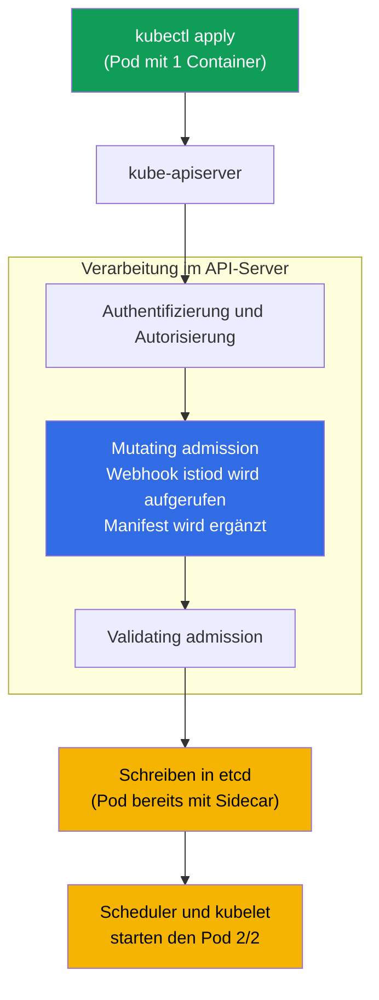
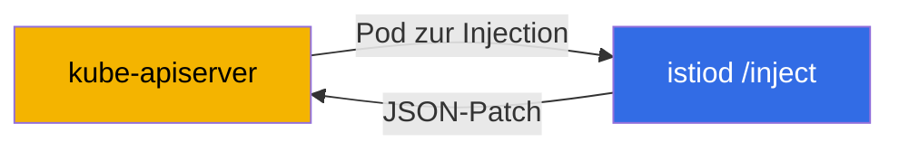
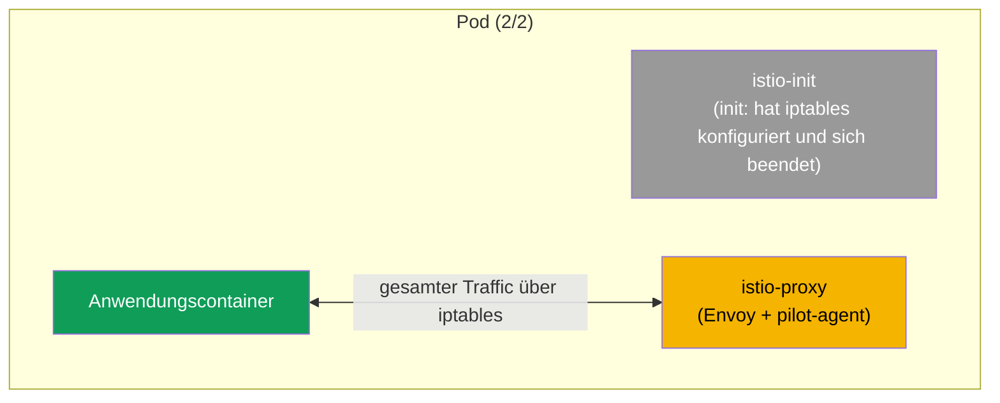

[RU version](ru.md) · [Eng version](en.md) · [Versión en español](es.md) · [Version française](fr.md)

# Kapitel 4. Data plane: Envoy und Sidecar-Injection

> **Was als Nächstes kommt.** Wir haben bereits gesehen, dass Istio eine Data plane (die Proxys,
> die den Traffic tragen) und eine Control plane (istiod, das sie verwaltet) hat. In diesem
> Kapitel besprechen wir die Data plane im Detail: was Envoy ist, woraus seine Konfiguration
> besteht, wie es die Einstellungen von istiod erhält und wie genau der Proxy in Ihren Pod
> gelangt. Das ist das Fundament, auf dem alle folgenden Kapitel über Traffic und Sicherheit
> ruhen.

## 4.1. Envoy – das Herz der Data plane

Der gesamte reale Traffic in Istio läuft nicht über istiod, sondern über die Proxys Envoy. Genau
Envoy verschlüsselt Verbindungen, wiederholt Anfragen, wendet Routing an und zählt Metriken.
istiod liefert Envoy nur die Einstellungen aus. Um Istio zu verstehen, muss man daher Envoy
zumindest auf der Ebene der Ideen verstehen.

## 4.2. Was Envoy ist und warum gerade er

Envoy ist ein hochperformanter Netzwerk-Proxy der Ebene L7, geschrieben in C++. Er wurde 2016
bei der Firma Lyft geschaffen, um die Kommunikation zwischen hunderten Microservices zu
bewältigen; im selben Jahr wurde das Projekt an die CNCF übergeben, wo es später den Status
graduated erhielt (gleichrangig mit Kubernetes). Quellcode und Dokumentation gibt es auf der
Website [envoyproxy.io](https://www.envoyproxy.io/) und im Repository
[envoyproxy/envoy](https://github.com/envoyproxy/envoy).

Envoy war als „universelle Data plane" gedacht: Ein und derselbe Proxy wird sowohl als Sidecar
neben einem Dienst als auch als Edge-Load-Balancer und als API-Gateway verwendet. Die zentralen
architektonischen Merkmale:

- **L7-Bewusstsein.** Versteht HTTP/1.1, HTTP/2, HTTP/3, gRPC und beliebiges TCP/UDP. Sieht
  Header, Methoden, Pfade, Antwortcodes, gRPC-Status – daher das intelligente Routing, Retries
  nach Codes und detaillierte Metriken.
- **Dynamische Konfiguration über eine API (xDS).** Praktisch alle Einstellungen von Envoy lassen
  sich zur Laufzeit über gRPC/REST ändern, ohne Neustart und ohne Abbruch von Verbindungen. Genau
  das nutzt istiod (Abschnitt 4.4). Die meisten klassischen Proxys können das nicht: Ihre
  Konfiguration ist statisch, und eine Änderung erfordert einen reload.
- **Filterketten (filter chains).** Die Verarbeitung einer Anfrage ist eine Pipeline aus Filtern
  (Routing, Authentifizierung, rate limit, eigene Logik in Lua oder Wasm). Daher die
  Erweiterbarkeit von Istio (EnvoyFilter, WasmPlugin – Kapitel 20).
- **Multithreading ohne Sperren.** Ein Modell aus Worker-Threads mit einem eigenen event loop pro
  Thread liefert hohen Durchsatz bei vorhersagbarer Latenz.
- **Observability out of the box.** Detaillierte Metriken (u. a. im Prometheus-Format), Tracing
  und Access-Logs für jede Anfrage; ein Admin-Interface auf dem Port `15000` innerhalb des Pods.
- **Hot restart.** Kann sich selbst neu starten, ohne aktive Verbindungen abzubrechen.

Genau die Kombination „versteht L7 + wird dynamisch über eine API konfiguriert + wird durch
Filter erweitert" hat Envoy zu einer bequemen Basis für ein Service Mesh gemacht. Deshalb hat
Istio keinen eigenen Proxy geschrieben, sondern Envoy genommen – wie auch die meisten anderen
Meshes (Kapitel 1).

### Envoy und andere Proxys

HTTP annehmen und weiterleiten können viele Proxys. Der Unterschied liegt in der Dynamik der
Konfiguration, der Protokollunterstützung und der Erweiterbarkeit, also genau in dem, was ein
Service Mesh braucht.

| Proxy | Sprache | Dynamische Konfig | HTTP/2, gRPC | Erweiterbarkeit | Wo er stark ist |
|--------|------|---------------------|--------------|---------------|-----------|
| **Envoy** | C++ | ja, xDS API zur Laufzeit | ja (u. a. HTTP/3) | Filter, Lua, Wasm | Mesh, Edge, API-Gateway; faktischer Standard der Data plane |
| **NGINX** | C | überwiegend statisch (reload; Dynamik – in NGINX Plus) | ja (proxy für gRPC) | Module (Build), Lua (OpenResty) | klassischer Webserver und Reverse-Proxy |
| **HAProxy** | C | statisch + Runtime API (teilweise) | ja | begrenzt (Lua, SPOE) | L4/L7-Lastverteilung, sehr hohe Performance |
| **Traefik** | Go | ja, aus Providern (k8s, Docker) | ja | Middlewares, Plugins | einfacher Ingress für Kubernetes/Docker |
| **linkerd2-proxy** | Rust | ja, von der Control plane von Linkerd | ja | nicht für Drittanbieter-Erweiterungen ausgelegt | leichtgewichtiger „Mikroproxy"-Sidecar in Linkerd |

Kurz:

- **NGINX / HAProxy** – reif und schnell, aber ihre Konfiguration ist historisch statisch: Um
  eine Route zu ändern, braucht man einen reload. Für ein Mesh mit hunderten Diensten und häufigen
  Änderungen ist das unbequem, und eine vollwertige Dynamik bei NGINX ist kostenpflichtig (Plus).
- **Traefik** – ein bequemer Ingress mit Autokonfiguration aus Kubernetes, aber eher ein
  Edge-Proxy als eine universelle Data plane eines Mesh.
- **linkerd2-proxy** – ein spezialisierter leichtgewichtiger Rust-Proxy, zugeschnitten auf
  Linkerd: einfacher und leichter als Envoy, aber weniger universell und nicht durch
  Drittanbieter-Filter erweiterbar.
- **Envoy** gewinnt nicht durch „Geschwindigkeit" als solche, sondern durch die Kombination aus
  dynamischer xDS-API, breiter Protokollunterstützung und Erweiterbarkeit – deshalb bauen darauf
  Istio, Consul, Kuma, Gloo, AWS App Mesh und andere auf.

## 4.3. Woraus die Konfiguration von Envoy besteht

Um die Ausgabe der Diagnose zu lesen (Kapitel 23) und zu verstehen, was passiert, muss man vier
Grundbegriffe von Envoy kennen. Sie reihen sich zu einer Kette – von „wo die Anfrage annehmen"
bis „wohin sie letztlich schicken".

- **Listener.** Der Port und die Adresse, die Envoy lauscht. Hierher kommt der Traffic.
- **Route.** Die Regeln: unter welchen Bedingungen (Host, Pfad, Header) und in welchen Cluster
  die Anfrage geleitet wird.
- **Cluster.** Eine logische Gruppe von Empfängern – im Grunde der „Zieldienst" mit Policys
  (Lastverteilung, Timeouts, mTLS).
- **Endpoint.** Die konkrete Adresse des Empfängers, gewöhnlich die IP des Pods und der Port.


Merken Sie sich diese Kette: Der Listener hat angenommen, die Route hat entschieden wohin, der
Cluster hat die Policy bestimmt, der Endpoint ist der konkrete Pod. Fast die gesamte
Konfiguration von Istio wird letztlich von istiod in diese vier Entitäten innerhalb von Envoy
umgewandelt.

## 4.4. Woher Envoy die Konfiguration bezieht: xDS

Für sich genommen ist Envoy „leer". Alle Listener, Routes, Cluster und Endpoints schickt ihm
istiod.


Diese Übertragung der Konfiguration (eben jener Pfeil „schickt Konfiguration" im Schema) läuft
nicht über einen einzigen Strom, sondern über mehrere Kanäle. Ihr gemeinsamer Name ist **xDS**
(x Discovery Service), und die einzelnen Namen begegnen Ihnen in der Diagnose:

- **LDS** – Listener Discovery Service (Listener).
- **RDS** – Route Discovery Service (Routes).
- **CDS** – Cluster Discovery Service (Cluster).
- **EDS** – Endpoint Discovery Service (Endpoints).
- **SDS** – Secret Discovery Service (Zertifikate für mTLS).

Wenn Sie zum Beispiel einen `VirtualService` anwenden, berechnet istiod die Konfiguration neu und
verteilt über xDS die Updates an alle nötigen Envoys. Die Proxys wenden sie zur Laufzeit an.
Genau deshalb erreichen Routing-Änderungen den Traffic ohne Neustart der Pods.

## 4.5. Wie der Sidecar in den Pod gelangt: automatische Injection

In Kapitel 2 haben wir das Label `istio-injection=enabled` auf den namespace gesetzt und gesehen,
dass die Pods `2/2` werden. Nun besprechen wir, was unter der Haube passiert.

istiod hat einen **mutating admission webhook**. Wenn Sie den CKA abgelegt haben, kennen Sie
diesen Mechanismus bereits: Admission-Controller greifen in die Verarbeitung der Anfrage auf der
Seite des API-Servers ein, vor dem Schreiben des Objekts in etcd. Der Sidecar-Injector von Istio
ist genau ein mutating Webhook, den der API-Server beim Erstellen eines Pods aufruft.

Den Webhook separat zu installieren, ist nicht nötig: Er erscheint **zusammen mit der
Installation von Istio**. Wenn Sie die Control plane installieren (`istioctl install` in Kapitel
2 oder das Helm-Chart `istiod` in Kapitel 3), erstellt Istio im Cluster die Ressource
`MutatingWebhookConfiguration`, die den API-Server anweist, istiod beim Erstellen von Pods
aufzurufen. Das heißt, der Sidecar-Injector ist Teil von istiod und keine separate Komponente,
die man von Hand ausrollen muss. Bei einer revisionsbasierten Installation (Kapitel 3) hat jede
Revision ihren eigenen Webhook, an ihr eigenes istiod gebunden.

Wichtig zu verstehen ist, **wo** und **wann** die Modifikation passiert: nicht auf Ihrer
Maschine, nicht im kubelet, sondern innerhalb des **API-Servers**, in der Phase der mutating
admission. Die Anwendung selbst startet die Injection nicht – sie wird vom API-Server ausgeführt,
der den Webhook als HTTP-Callback aufruft.



Die Reihenfolge ist folgende:

1. Sie machen `kubectl apply`, die Anfrage geht an den API-Server.
2. Der API-Server prüft, wer Sie sind und ob Sie einen Pod erstellen dürfen (Authentifizierung,
   Autorisierung).
3. In der Phase der **mutating admission** sieht der API-Server, dass der namespace für die
   Injection markiert ist, und ruft den Webhook istiod auf. Dieser erhält das ursprüngliche
   Manifest, ergänzt darin den Sidecar und gibt das geänderte Manifest zurück. Genau hier passiert
   die Modifikation.
4. Das ergänzte Manifest durchläuft die Validierung und wird in etcd gespeichert – in die
   Datenbank gelangt der Pod bereits mit Sidecar.
5. Danach läuft alles wie gewohnt: Der Scheduler wählt einen Node, das kubelet startet den Pod,
   und er kommt gleich `2/2` hoch.

### Wie der Webhook selbst aufgebaut ist

Ihn im Cluster ansehen kann man so:

```bash
kubectl get mutatingwebhookconfiguration | grep istio
```

Innerhalb von `MutatingWebhookConfiguration` sind mehrere Felder wichtig (vereinfacht):

```yaml
apiVersion: admissionregistration.k8s.io/v1
kind: MutatingWebhookConfiguration
metadata:
  name: istio-sidecar-injector
webhooks:
- name: sidecar-injector.istio.io
  clientConfig:
    service:
      name: istiod                 # WOHIN der API-Server den Pod zur Injection schickt
      namespace: istio-system
      path: /inject                # Endpoint von istiod, der den Patch macht
  rules:
  - operations: ["CREATE"]         # nur beim Erstellen
    resources: ["pods"]            # nur für Pods
  namespaceSelector:
    matchLabels:
      istio-injection: enabled     # nur markierte namespaces
  failurePolicy: Fail              # was tun, wenn istiod nicht erreichbar ist
```

Der entscheidende Punkt: **Dieses Objekt selbst modifiziert nichts.** Es sagt dem API-Server nur:
„Beim Erstellen eines Pods in einem solchen namespace rufe genau diesen Dienst über den Pfad
`/inject` auf." Das ist eine Routing-Regel, keine Injection-Logik.

Die Modifikation des Manifests führt **istiod** aus – eben jener Endpoint `/inject`. Gehen wir
Schritt für Schritt durch, welcher Teil wofür zuständig ist:

- **`MutatingWebhookConfiguration`** – legt fest, *wann* und *für wen* istiod gerufen wird
  (Operation CREATE, Ressource pods, der nötige namespaceSelector).
- **istiod (`/inject`)** – erhält vom API-Server das Pod-Objekt (in Form eines
  `AdmissionReview`), nimmt das Sidecar-Template (es liegt in der ConfigMap
  `istio-sidecar-injector` und wird bei der Installation festgelegt), berechnet, was hinzuzufügen
  ist, und gibt einen **JSON-Patch** zurück in das `AdmissionReview`.
- **API-Server** – wendet den erhaltenen Patch auf das ursprüngliche Manifest an. Genau danach
  erscheinen im Pod `istio-init`, `istio-proxy` und die Volumes.



Das heißt, das Template dessen, was eingefügt wird, wird bei der Installation von Istio festgelegt
(ConfigMap), die Entscheidung über den Aufruf trifft die `MutatingWebhookConfiguration`, und den
konkreten Patch berechnet istiod. Der API-Server wendet lediglich das Ergebnis an.

Erinnern wir uns an zwei Regeln aus Kapitel 2: Die Injection greift nur bei **neuen** Pods (weil
in `rules` die Operation `CREATE` steht) und nur, wenn das Label gesetzt ist (das prüft der
`namespaceSelector`; bei einer revisionsbasierten Installation ist das `istio.io/rev`). Bereits
laufende Pods müssen über `rollout restart` neu erstellt werden – dann durchlaufen sie erneut die
admission und erhalten einen Sidecar.

### Injection auf Pod- oder Deployment-Ebene

Die Injection lässt sich nicht nur auf namespace-Ebene steuern, sondern auch punktuell – für ein
konkretes Workload. Dafür gibt es das Pod-Label `sidecar.istio.io/inject` mit dem Wert `"true"`
oder `"false"`.

Ein wichtiger Punkt: Das Label hängt man nicht an das Objekt Deployment, sondern an das
**Pod-Template** – `spec.template.metadata.labels`. Durch den admission-Webhook laufen genau die
Pods und nicht das Deployment, deshalb spielt ein Label auf der `metadata` des Deployments selbst
keine Rolle.

```yaml
apiVersion: apps/v1
kind: Deployment
metadata:
  name: orders
spec:
  template:
    metadata:
      labels:
        app: orders
        sidecar.istio.io/inject: "true"   # <- Label auf dem Pod-Template, nicht auf dem Deployment
    spec:
      containers:
        - name: app
          image: orders:1.0
```

Die endgültige Entscheidung wird anhand zweier Labels getroffen – auf dem namespace
(`istio-injection`) und auf dem Pod (`sidecar.istio.io/inject`) – nach folgender Logik:

1. Wenn eines der Labels auf „aus" steht (`istio-injection=disabled` oder
   `sidecar.istio.io/inject: "false"`) – wird der Sidecar **nicht** eingebunden.
2. Wenn eines der Labels „ein" ist (`istio-injection=enabled`, `istio.io/rev=<rev>` oder
   `sidecar.istio.io/inject: "true"`) – wird der Sidecar eingebunden.
3. Wenn keines gesetzt ist – wird standardmäßig nicht eingebunden (gesteuert über die Einstellung
   `enableNamespacesByDefault`, die standardmäßig aus ist).

| namespace `istio-injection` | pod `sidecar.istio.io/inject` | Ergebnis |
|---|---|---|
| enabled | (keins) | wird eingebunden |
| enabled | `"false"` | wird nicht eingebunden |
| enabled | `"true"` | wird eingebunden |
| (kein Label) | `"true"` | **wird eingebunden** |
| (kein Label) | (keins) | wird nicht eingebunden |
| disabled | `"true"` | wird nicht eingebunden (`disabled` hat Vorrang) |

Daraus ergeben sich zwei praktische Szenarien:

- **Den Sidecar nur für ein einziges Deployment aktivieren**, ohne den ganzen namespace
  anzufassen: Setzen Sie das Label nicht auf den namespace, sondern auf dem Pod-Template des
  gewünschten Deployments `sidecar.istio.io/inject: "true"` (die Zeile „kein Label + true" in der
  Tabelle). Den Sidecar erhält nur dieses Workload.
- **Ein Deployment von der Injection ausschließen** in einem markierten namespace: Belassen Sie
  `istio-injection=enabled` auf dem namespace und setzen Sie auf dem Pod-Template dieses
  Deployments `sidecar.istio.io/inject: "false"`.

> Bei einer revisionsbasierten Installation (Kapitel 3) übernimmt die Rolle des „Einschalters" auf
> Pod-Ebene das Label `istio.io/rev=<revision>`, und für das punktuelle Abschalten wird nach wie
> vor `sidecar.istio.io/inject: "false"` verwendet.

## 4.6. Was genau dem Pod hinzugefügt wird

Der Webhook fügt dem Pod zwei Dinge hinzu:

- **Init-Container `istio-init`.** Wird einmal beim Start des Pods ausgeführt und konfiguriert die
  iptables-Regeln, die den gesamten ein- und ausgehenden Traffic der Anwendung auf Envoy
  umleiten. Danach beendet sich der Init-Container. (In manchen Installationen wird statt des
  Init-Containers das CNI-Plugin von Istio verwendet, dann konfiguriert dieses iptables, aber die
  Idee ist dieselbe.)
- **Container `istio-proxy`.** Das ist der Sidecar: darin läuft Envoy und der Hilfsprozess
  pilot-agent, der mit istiod kommuniziert und die Zertifikate verwaltet.

### Was sich konkret im Pod-Manifest ändert

Am einfachsten versteht man die Injection, wenn man das Manifest „vorher" und „nachher"
vergleicht. Sie übergeben Kubernetes einen einfachen Pod mit einem Container:

```yaml
# VORHER: Ihr ursprünglicher Pod
apiVersion: v1
kind: Pod
metadata:
  name: orders
spec:
  containers:
  - name: app
    image: orders:1.0
```

Der Webhook fängt dieses Manifest ab und gibt Kubernetes bereits eine ergänzte Version zurück:

```yaml
# NACHHER: Pod nach der Injection (vereinfacht)
apiVersion: v1
kind: Pod
metadata:
  name: orders
  labels:
    security.istio.io/tlsMode: istio          # + Labels für das Mesh
    service.istio.io/canonical-name: orders
  annotations:
    sidecar.istio.io/status: '{...}'          # + Annotation zum Status der Injection
spec:
  initContainers:
  - name: istio-init                          # + Init-Container (iptables)
    image: docker.io/istio/proxyv2:1.29.1
  containers:
  - name: app                                 # Ihr Container, unverändert
    image: orders:1.0
  - name: istio-proxy                          # + der Sidecar selbst (Envoy)
    image: docker.io/istio/proxyv2:1.29.1
  volumes:                                     # + Volumes für Zertifikate und Konfig
  - name: istio-envoy
  - name: istio-data
  - name: istio-token
  - name: istiod-ca-cert
```

Insgesamt ergänzt der Webhook das ursprüngliche Manifest um:

- **`spec.initContainers`** – der Container `istio-init` (konfiguriert iptables vor dem Start der
  Anwendung).
- **`spec.containers`** – der Container `istio-proxy` (Envoy + pilot-agent).
- **`spec.volumes`** – Volumes für die Konfiguration von Envoy, die mTLS-Zertifikate und das
  Token des ServiceAccount, über die der Sidecar seine Identity erhält.
- **`metadata.labels`** und **`metadata.annotations`** – interne Labels und Annotationen, an denen
  Istio erkennt, dass der Pod im Mesh ist, und den Status der Injection speichert.

Ihr eigener Container `app` wird dabei nicht angefasst – dem Pod wird lediglich die Anbindung um
ihn herum hinzugefügt.



Deshalb zeigen Pods im Mesh `2/2`: Init-Container zählen nicht in diesen Zähler, daher sieht man
zwei „langlebige" Container – die Anwendung und istio-proxy.

## 4.7. Manuelle Injection

Die automatische Injection über den Webhook ist der Hauptweg, aber manchmal bindet man den
Sidecar manuell ein, zum Beispiel wenn der Webhook deaktiviert ist oder man sehen möchte, was
genau hinzugefügt wird. Dafür gibt es `istioctl kube-inject`:

```bash
istioctl kube-inject -f deployment.yaml | kubectl apply -f -
```

Der Befehl nimmt Ihr Manifest, ergänzt darin den Init-Container und istio-proxy und gibt das
Ergebnis an `kubectl apply` weiter. Das Ergebnis ist dasselbe wie bei der automatischen Injection,
Sie tun es nur explizit.

## 4.8. Wie der Traffic durch Envoy läuft

Setzen wir das Bild des Pfads einer Anfrage auf der Ebene von Envoy zusammen. Jeder Proxy hat zwei
Arten von Listenern: **outbound** (für den ausgehenden Traffic der Anwendung) und **inbound**
(für den Traffic, der zur Anwendung kommt).


1. Die Anwendung macht eine Anfrage. Dank iptables landet sie auf dem outbound Listener des
   lokalen Envoy.
2. Envoy wendet Routing und Policys an, verschlüsselt den Traffic per mTLS und schickt ihn an den
   inbound Listener des Envoy des empfangenden Pods.
3. Der Envoy des Empfängers entschlüsselt den Traffic und gibt ihn über localhost an die Anwendung
   weiter.

Das ist derselbe Pfad, den wir in Kapitel 1 gezeichnet haben, nur sieht man jetzt, dass es
innerhalb jedes Envoy separate Listener für Eingang und Ausgang gibt.

## 4.9. Wie man in Envoy hineinschaut

Manchmal muss man sehen, welche Konfiguration tatsächlich einen konkreten Proxy erreicht hat.
Dafür gibt es `istioctl proxy-config`, das die listeners, routes, clusters und endpoints des
ausgewählten Pods anzeigt:

```bash
istioctl proxy-config clusters <pod> -n <namespace>
istioctl proxy-config routes   <pod> -n <namespace>
istioctl proxy-config listeners <pod> -n <namespace>
```

Merken Sie sich hier einfach, dass es ein solches Werkzeug gibt. Ausführlich nutzen werden wir es
in Kapitel 23 zum Troubleshooting – dort ist es der wichtigste Weg zu verstehen, warum der Traffic
nicht dorthin läuft, wohin er soll.

## 4.10. Ressourcen des Sidecar

Jeder Sidecar ist ein zusätzlicher Container, das heißt, er verbraucht CPU und Arbeitsspeicher.
Standardmäßig fordert istio-proxy wenig an (in der Größenordnung von `100m` CPU und `128Mi`
Arbeitsspeicher), aber in einem Cluster mit tausenden Pods ist das in Summe spürbar. Die
Ressourcen des Sidecar kann man global festlegen (über die Installationseinstellungen) oder über
Annotationen auf den Pods überschreiben. Die Kostenoptimierung der Data plane greifen wir separat
in Kapitel 18 (Sidecar-Scoping) und im Thema ambient (Kapitel 21) auf, wo es überhaupt keine
Sidecars gibt.

## 4.11. Zusammenfassung des Kapitels

- Den gesamten Traffic im Mesh trägt Envoy; istiod fasst den Traffic nicht an, sondern
  konfiguriert nur die Proxys.
- Envoy ([envoyproxy.io](https://www.envoyproxy.io/), ein CNCF-Projekt) wurde von Istio wegen des
  Verständnisses der Protokolle (HTTP/1.1, HTTP/2, HTTP/3, gRPC), der dynamischen Konfiguration
  über xDS, der Erweiterbarkeit durch Filter und der Metriken gewählt; auf ihm bauen auch die
  meisten anderen Meshes auf.
- Die Konfiguration von Envoy ist eine Kette: listener, route, cluster, endpoint.
- Die Einstellungen kommen von istiod über xDS (LDS, RDS, CDS, EDS, SDS) und werden zur Laufzeit
  angewendet.
- Der Sidecar wird durch den Webhook von istiod in neue Pods eines markierten namespace
  eingebunden.
- Die Injection lässt sich punktuell über das Pod-Label `sidecar.istio.io/inject` (`"true"`/
  `"false"`) auf dem **Pod-Template** eines Deployments steuern: ein Workload aktivieren, ohne das
  Label auf dem namespace, oder es umgekehrt aus einem markierten namespace ausschließen.
- Dem Pod werden ein Init-Container `istio-init` (konfiguriert iptables) und ein Container
  `istio-proxy` (Envoy + pilot-agent) hinzugefügt; daher `2/2`.
- Jeder Envoy hat einen inbound und einen outbound Listener; der Traffic zwischen den Pods wird
  per mTLS verschlüsselt.
- Die tatsächliche Konfiguration des Proxys anzusehen hilft `istioctl proxy-config`.

## 4.12. Fragen zur Selbstüberprüfung

1. Warum ist istiod nicht an der Übertragung des Nutzer-Traffics beteiligt?
2. Erklären Sie die Kette listener – route – cluster – endpoint mit eigenen Worten.
3. Was ist xDS und warum erreichen dank ihm Änderungen die Pods ohne Neustart?
4. Was fügt der Injection-Webhook dem Pod hinzu? Wozu braucht man den Init-Container?
5. Wodurch unterscheidet sich der inbound Listener vom outbound Listener?
6. Wie aktiviert man die Sidecar-Injection nur für ein einziges Deployment, ohne den ganzen
   namespace zu markieren? Auf welches Objekt und wohin genau hängt man das Label?

## Praxis

Ein eigenes Lab nur für die Injection gibt es nicht – Sie haben sie bereits in Aktion in Lab 01
gesehen, als die Pods von Bookinfo `2/2` wurden. Kehren Sie dorthin zurück und schauen Sie sich
den Pod genauer an: Prüfen Sie die Container
(`kubectl get pod <pod> -o jsonpath='{.spec.containers[*].name}'`) und die Init-Container, finden
Sie dort `istio-proxy` und `istio-init`.

🧪 Lab 01: [tasks/ica/labs/01](../../labs/01/README_DE.MD)

---
[Inhaltsverzeichnis](../README_DE.md) · [Kapitel 3](../03/de.md) · [Kapitel 5](../05/de.md)
