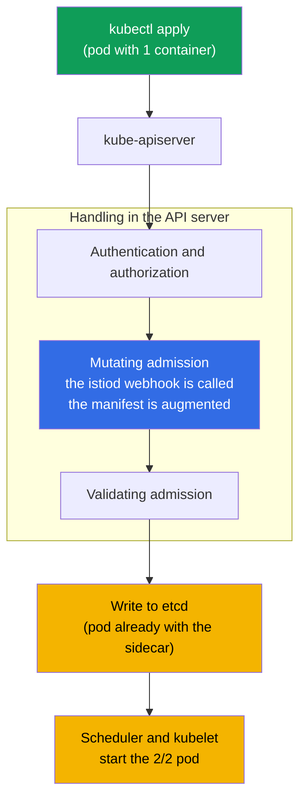
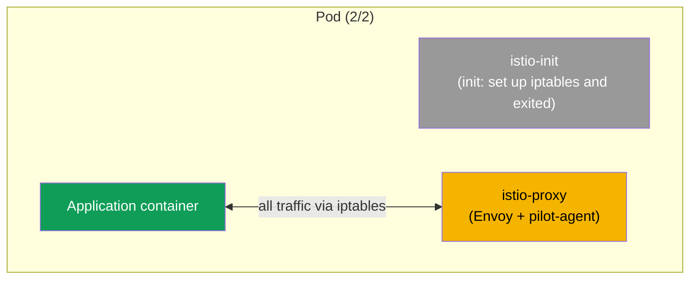
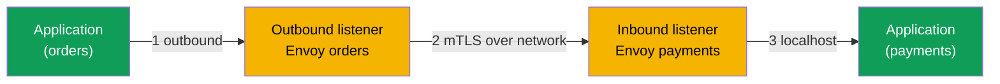

[RU version](ru.md) · [Versión en español](es.md)

# Chapter 4. Data plane: Envoy and sidecar injection

> **What's next.** We have already seen that Istio has a data plane (the proxies that carry
> traffic) and a control plane (istiod, which manages them). In this chapter we cover the
> data plane in detail: what Envoy is, what its configuration consists of, how it gets its
> settings from istiod, and how exactly the proxy gets into your pod. This is the foundation
> that all the following chapters on traffic and security rest on.

## 4.1. Envoy - the heart of the data plane

All real traffic in Istio flows not through istiod, but through the Envoy proxies. It is
Envoy that encrypts connections, retries requests, applies routing and counts metrics.
istiod only hands out settings to Envoy. So, to understand Istio, you have to understand
Envoy at least at the level of ideas.

## 4.2. What Envoy is and why it was chosen

Envoy is a high-performance L7 network proxy written in C++. It was created at Lyft in 2016
to cope with communication between hundreds of microservices; the same year the project was
donated to the CNCF, where it later reached graduated status (on par with Kubernetes). The
sources and documentation are at [envoyproxy.io](https://www.envoyproxy.io/) and in the
[envoyproxy/envoy](https://github.com/envoyproxy/envoy) repository.

Envoy was designed as a "universal data plane": the same proxy is used as a sidecar next to
a service, as an edge load balancer, and as an API gateway. Its key architectural traits:

- **L7 awareness.** Understands HTTP/1.1, HTTP/2, HTTP/3, gRPC and arbitrary TCP/UDP. It
  sees headers, methods, paths, response codes, gRPC statuses - hence smart routing, retries
  by code, and detailed metrics.
- **Dynamic configuration via an API (xDS).** Almost all Envoy settings can be changed on
  the fly over gRPC/REST, without a restart and without dropping connections. This is
  exactly what istiod uses (section 4.4). Most classic proxies cannot do this: their config
  is static, and a change requires a reload.
- **Filter chains.** Request processing is a pipeline of filters (routing, authentication,
  rate limit, custom logic in Lua or Wasm). Hence Istio's extensibility (EnvoyFilter,
  WasmPlugin - chapter 20).
- **Lock-free multithreading.** A model of worker threads with a separate event loop per
  thread gives high throughput with predictable latency.
- **Observability out of the box.** Detailed metrics (including in Prometheus format),
  tracing and access logs per request; an admin interface on port `15000` inside the pod.
- **Hot restart.** It can restart itself without dropping active connections.

It is exactly the combination of "understands L7 + configured dynamically over an API +
extended by filters" that made Envoy a convenient foundation for a service mesh. So Istio
did not write its own proxy but took Envoy - like most other meshes (chapter 1).

### Envoy and other proxies

Plenty of proxies can accept and forward HTTP. The difference is in dynamic configuration,
protocol support and extensibility - that is, exactly what a service mesh needs.

| Proxy | Language | Dynamic config | HTTP/2, gRPC | Extensibility | Where it is strong |
|-------|----------|----------------|--------------|---------------|--------------------|
| **Envoy** | C++ | yes, xDS API on the fly | yes (incl. HTTP/3) | filters, Lua, Wasm | mesh, edge, API gateway; the de facto data plane standard |
| **NGINX** | C | mostly static (reload; dynamic in NGINX Plus) | yes (gRPC proxy) | modules (build), Lua (OpenResty) | classic web server and reverse proxy |
| **HAProxy** | C | static + Runtime API (partial) | yes | limited (Lua, SPOE) | L4/L7 load balancing, very high performance |
| **Traefik** | Go | yes, from providers (k8s, Docker) | yes | middlewares, plugins | simple ingress for Kubernetes/Docker |
| **linkerd2-proxy** | Rust | yes, from the Linkerd control plane | yes | not meant for third-party extensions | lightweight "micro-proxy" sidecar in Linkerd |

In short:

- **NGINX / HAProxy** - mature and fast, but their config is historically static: to change
  a route you need a reload. For a mesh with hundreds of services and frequent changes this
  is inconvenient, and full dynamic config in NGINX is paid (Plus).
- **Traefik** - a convenient ingress with autoconfiguration from Kubernetes, but it is more
  of an edge proxy than a universal mesh data plane.
- **linkerd2-proxy** - a specialized lightweight Rust proxy tailored for Linkerd: simpler
  and lighter than Envoy, but less universal and not extensible with third-party filters.
- **Envoy** wins not by "speed" as such, but by the combination of a dynamic xDS API, broad
  protocol support and extensibility - which is why Istio, Consul, Kuma, Gloo, AWS App Mesh
  and others are built on it.

## 4.3. What Envoy's configuration consists of

To read diagnostic output (chapter 23) and understand what is going on, you need to know
four basic Envoy concepts. They form a chain - from "where to accept the request" to "where
to finally send it".

- **Listener.** The port and address Envoy listens on. Traffic arrives here.
- **Route.** The rules: by which conditions (host, path, headers) and into which cluster to
  send the request.
- **Cluster.** A logical group of recipients - essentially the "destination service" with
  policies (load balancing, timeouts, mTLS).
- **Endpoint.** A concrete recipient address, usually a pod IP and port.


Remember this chain: the listener accepted, the route decided where to, the cluster set the
policy, the endpoint is a concrete pod. Almost all of Istio's configuration is ultimately
turned by istiod into these four entities inside Envoy.

## 4.4. Where Envoy gets its configuration: xDS

By itself Envoy is "empty". All listeners, routes, clusters and endpoints are sent to it by
istiod.


This configuration transfer (that "sends configuration" arrow in the diagram) does not go
over a single stream, but over several channels. Their common name is **xDS** (x Discovery
Service), and you will meet the individual names in diagnostics:

- **LDS** - Listener Discovery Service (listeners).
- **RDS** - Route Discovery Service (routes).
- **CDS** - Cluster Discovery Service (clusters).
- **EDS** - Endpoint Discovery Service (endpoints).
- **SDS** - Secret Discovery Service (certificates for mTLS).

When you apply, say, a `VirtualService`, istiod recomputes the configuration and pushes
updates over xDS to all the relevant Envoys. The proxies apply it on the fly. That is
exactly why routing changes reach traffic without restarting pods.

## 4.5. How the sidecar gets into the pod: automatic injection

In chapter 2 we set the `istio-injection=enabled` label on a namespace and saw pods become
`2/2`. Now let's cover what happens under the hood.

istiod has a **mutating admission webhook**. If you passed CKA, you already know this
mechanism: admission controllers step into the request handling on the API server side,
before the object is written to etcd. Istio's sidecar injector is exactly a mutating webhook
that the API server calls when a pod is created.

You do not need to install the webhook separately: it appears **together with the Istio
install**. When you install the control plane (`istioctl install` in chapter 2 or the Helm
`istiod` chart in chapter 3), Istio creates a `MutatingWebhookConfiguration` resource in the
cluster that tells the API server to call istiod when pods are created. So the sidecar
injector is part of istiod, not a separate component you have to deploy by hand. In a
revisioned install (chapter 3) each revision has its own webhook, bound to its own istiod.

It is important to understand **where** and **when** the modification happens: not on your
machine, not in the kubelet, but inside the **API server**, at the mutating admission stage.
The application itself does not trigger injection - the API server does it, calling the
webhook as an HTTP callback.



The sequence is:

1. You run `kubectl apply`, the request goes to the API server.
2. The API server checks who you are and whether you may create the pod (authentication,
   authorization).
3. At the **mutating admission** stage the API server sees the namespace is marked for
   injection and calls the istiod webhook. It receives the original manifest, adds the
   sidecar to it and returns the modified manifest. This is exactly where the modification
   happens.
4. The augmented manifest passes validation and is stored in etcd - the pod lands in the
   database already with the sidecar.
5. From here on everything is as usual: the scheduler picks a node, the kubelet starts the
   pod, and it comes up as `2/2` right away.

### How the webhook itself is arranged

You can view it in the cluster like this:

```bash
kubectl get mutatingwebhookconfiguration | grep istio
```

Inside the `MutatingWebhookConfiguration` a few fields matter (simplified):

```yaml
apiVersion: admissionregistration.k8s.io/v1
kind: MutatingWebhookConfiguration
metadata:
  name: istio-sidecar-injector
webhooks:
- name: sidecar-injector.istio.io
  clientConfig:
    service:
      name: istiod                 # WHERE the API server sends the pod for injection
      namespace: istio-system
      path: /inject                # the istiod endpoint that does the patch
  rules:
  - operations: ["CREATE"]         # only on creation
    resources: ["pods"]            # only for pods
  namespaceSelector:
    matchLabels:
      istio-injection: enabled     # only labeled namespaces
  failurePolicy: Fail              # what to do if istiod is unavailable
```

The key point: **this object itself modifies nothing**. It only tells the API server: "when
a pod is created in such a namespace, call this service at path `/inject`". This is a
routing rule, not the injection logic.

The manifest modification is done by **istiod** - that same `/inject` endpoint. Let's break
down step by step which part is responsible for what:

- **`MutatingWebhookConfiguration`** - defines *when* and *for whom* to call istiod (the
  CREATE operation, the pods resource, the right namespaceSelector).
- **istiod (`/inject`)** - receives the pod object from the API server (as an
  `AdmissionReview`), takes the sidecar template (it lives in the `istio-sidecar-injector`
  ConfigMap and is set at install time), computes what to add, and returns a **JSON patch**
  back in the `AdmissionReview`.
- **the API server** - applies the received patch to the original manifest. It is right
  after this that `istio-init`, `istio-proxy` and the volumes appear in the pod.


That is, the template of what gets inserted is set at Istio install time (the ConfigMap),
the decision to call is made by the `MutatingWebhookConfiguration`, and the concrete patch
is computed by istiod. The API server merely applies the result.

Let's recall two rules from chapter 2: injection fires only on **new** pods (because the
`rules` have the CREATE operation), and only if the label is set (checked by the
`namespaceSelector`; in a revisioned install it is `istio.io/rev`). Already-running pods
must be recreated via `rollout restart` - then they pass through admission again and get the
sidecar.

### Injection at the pod or deployment level

Injection can be controlled not only at the namespace level, but also pointwise - for a
specific workload. For that there is the pod label `sidecar.istio.io/inject` with the value
`"true"` or `"false"`.

An important point: the label goes not on the Deployment object, but on the **pod template**
- `spec.template.metadata.labels`. It is pods, not the Deployment, that pass through the
admission webhook, so a label on the Deployment's own `metadata` has no effect.

```yaml
apiVersion: apps/v1
kind: Deployment
metadata:
  name: orders
spec:
  template:
    metadata:
      labels:
        app: orders
        sidecar.istio.io/inject: "true"   # <- label on the pod template, not the Deployment
    spec:
      containers:
        - name: app
          image: orders:1.0
```

The final decision is computed from two labels - on the namespace (`istio-injection`) and on
the pod (`sidecar.istio.io/inject`) - with this logic:

1. If either label is set to "off" (`istio-injection=disabled` or
   `sidecar.istio.io/inject: "false"`) - the sidecar is **not** injected.
2. If either label is "on" (`istio-injection=enabled`, `istio.io/rev=<rev>` or
   `sidecar.istio.io/inject: "true"`) - the sidecar is injected.
3. If neither is set - by default it is not injected (governed by the
   `enableNamespacesByDefault` setting, which is off by default).

| namespace `istio-injection` | pod `sidecar.istio.io/inject` | Result |
|---|---|---|
| enabled | (none) | injected |
| enabled | `"false"` | not injected |
| enabled | `"true"` | injected |
| (no label) | `"true"` | **injected** |
| (no label) | (none) | not injected |
| disabled | `"true"` | not injected (`disabled` takes precedence) |

Hence two practical scenarios:

- **Enable the sidecar for a single deployment only**, without touching the whole namespace:
  do not label the namespace, and on the pod template of the desired Deployment set
  `sidecar.istio.io/inject: "true"` (the "no label + true" row in the table). Only that
  workload gets the sidecar.
- **Exclude a single deployment** from injection in a labeled namespace: keep
  `istio-injection=enabled` on the namespace, and on that Deployment's pod template set
  `sidecar.istio.io/inject: "false"`.

> In a revisioned install (chapter 3) the "enabler" at the pod level is the
> `istio.io/rev=<revision>` label, while for pointwise disabling the same
> `sidecar.istio.io/inject: "false"` is used.

## 4.6. What exactly is added to the pod

The webhook adds two things to the pod:

- **the `istio-init` init container.** It runs once at pod startup and sets up the iptables
  rules that route all of the application's inbound and outbound traffic to Envoy. After
  that the init container exits. (In some installs the Istio CNI plugin is used instead of
  the init container, in which case it sets up iptables, but the idea is the same.)
- **the `istio-proxy` container.** This is the sidecar itself: inside runs Envoy and the
  helper process pilot-agent, which talks to istiod and manages certificates.

### What exactly changes in the pod manifest

The easiest way to understand injection is to compare the manifest "before" and "after". You
hand Kubernetes a simple pod with one container:

```yaml
# BEFORE: your original pod
apiVersion: v1
kind: Pod
metadata:
  name: orders
spec:
  containers:
  - name: app
    image: orders:1.0
```

The webhook intercepts this manifest and returns an already-augmented version to Kubernetes:

```yaml
# AFTER: the pod after injection (simplified)
apiVersion: v1
kind: Pod
metadata:
  name: orders
  labels:
    security.istio.io/tlsMode: istio          # + labels for the mesh
    service.istio.io/canonical-name: orders
  annotations:
    sidecar.istio.io/status: '{...}'          # + annotation about the injection status
spec:
  initContainers:
  - name: istio-init                          # + init container (iptables)
    image: docker.io/istio/proxyv2:1.29.1
  containers:
  - name: app                                 # your container, unchanged
    image: orders:1.0
  - name: istio-proxy                          # + the sidecar itself (Envoy)
    image: docker.io/istio/proxyv2:1.29.1
  volumes:                                     # + volumes for certificates and config
  - name: istio-envoy
  - name: istio-data
  - name: istio-token
  - name: istiod-ca-cert
```

In total the webhook adds to the original manifest:

- **`spec.initContainers`** - the `istio-init` container (sets up iptables before the
  application starts).
- **`spec.containers`** - the `istio-proxy` container (Envoy + pilot-agent).
- **`spec.volumes`** - volumes for the Envoy config, mTLS certificates and the
  ServiceAccount token, through which the sidecar gets its identity.
- **`metadata.labels`** and **`metadata.annotations`** - service labels and annotations by
  which Istio knows the pod is in the mesh and stores the injection status.

Your own `app` container is not touched - the pod simply gets plumbing added around it.



This is why pods in the mesh show `2/2`: init containers are not counted here, so you see
two "long-lived" containers - the application and istio-proxy.

## 4.7. Manual injection

Automatic injection via the webhook is the main method, but sometimes the sidecar is
injected manually, for example when the webhook is disabled or you want to see what exactly
gets added. For that there is `istioctl kube-inject`:

```bash
istioctl kube-inject -f deployment.yaml | kubectl apply -f -
```

The command takes your manifest, adds the init container and istio-proxy to it, and passes
the result to `kubectl apply`. The result is the same as with automatic injection, you just
do it explicitly.

## 4.8. How traffic passes through Envoy

Let's assemble the picture of a request's path at the Envoy level. Each proxy has two types
of listener: **outbound** (for the application's outgoing traffic) and **inbound** (for
traffic arriving at the application).



1. The application makes a request. Thanks to iptables it lands on the outbound listener of
   the local Envoy.
2. Envoy applies routing and policies, encrypts the traffic with mTLS and sends it to the
   inbound listener of the recipient pod's Envoy.
3. The recipient's Envoy decrypts the traffic and hands it to the application over localhost.

This is the same path we drew in chapter 1, only now you can see that inside each Envoy there
are separate listeners for inbound and outbound.

## 4.9. How to look inside Envoy

Sometimes you need to see which configuration actually reached a specific proxy. For that
there is `istioctl proxy-config`, which shows the listeners, routes, clusters and endpoints
of a chosen pod:

```bash
istioctl proxy-config clusters <pod> -n <namespace>
istioctl proxy-config routes   <pod> -n <namespace>
istioctl proxy-config listeners <pod> -n <namespace>
```

Here just remember that such a tool exists. We will use it in detail in chapter 23 on
troubleshooting - there it is the main way to understand why traffic goes the wrong way.

## 4.10. Sidecar resources

Each sidecar is an extra container, which means it consumes CPU and memory. By default
istio-proxy requests a little (around `100m` CPU and `128Mi` of memory), but in a cluster
with thousands of pods this adds up noticeably. Sidecar resources can be set globally
(through install settings) or overridden with annotations on pods. We will separately touch
on data plane cost optimization in chapter 18 (sidecar scoping) and in the ambient topic
(chapter 21), where there are no sidecars at all.

## 4.11. Chapter summary

- All traffic in the mesh is carried by Envoy; istiod does not touch traffic, it only
  configures the proxies.
- Envoy ([envoyproxy.io](https://www.envoyproxy.io/), a CNCF project) was chosen by Istio for
  its protocol awareness (HTTP/1.1, HTTP/2, HTTP/3, gRPC), dynamic configuration over xDS,
  filter-based extensibility and metrics; most other meshes are built on it too.
- Envoy's configuration is a chain: listener, route, cluster, endpoint.
- Settings arrive from istiod over xDS (LDS, RDS, CDS, EDS, SDS) and are applied on the fly.
- The sidecar is injected by the istiod webhook into new pods of a labeled namespace.
- Injection can be controlled pointwise with the pod label `sidecar.istio.io/inject`
  (`"true"`/`"false"`) on the Deployment's **pod template**: enable one workload without a
  namespace label, or, conversely, exclude it from a labeled namespace.
- The pod gets the `istio-init` init container (sets up iptables) and the `istio-proxy`
  container (Envoy + pilot-agent); hence `2/2`.
- Each Envoy has inbound and outbound listeners; traffic between pods is encrypted with mTLS.
- `istioctl proxy-config` helps you see the proxy's actual configuration.

## 4.12. Self-check questions

1. Why does istiod not take part in carrying user traffic?
2. Explain the listener - route - cluster - endpoint chain in your own words.
3. What is xDS and why, thanks to it, do changes reach traffic without restarting pods?
4. What does the injection webhook add to the pod? Why is the init container needed?
5. How does an inbound listener differ from an outbound listener?
6. How do you enable sidecar injection for a single Deployment only, without labeling the
   whole namespace? On which object and where exactly is the label placed?

## Practice

There is no separate lab just for injection - you already saw it in action in lab 01, when
the Bookinfo pods became `2/2`. Go back to it and look at a pod more closely: check the
containers (`kubectl get pod <pod> -o jsonpath='{.spec.containers[*].name}'`) and the init
containers, and find `istio-proxy` and `istio-init` there.

🧪 Lab 01: [tasks/ica/labs/01](../../labs/01/README.MD)

---
[Contents](../README.md) · [Chapter 3](../03/en.md) · [Chapter 5](../05/en.md)
