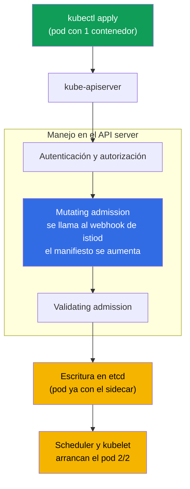
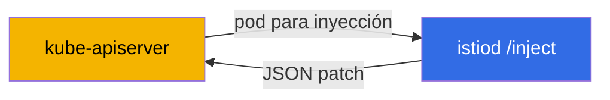
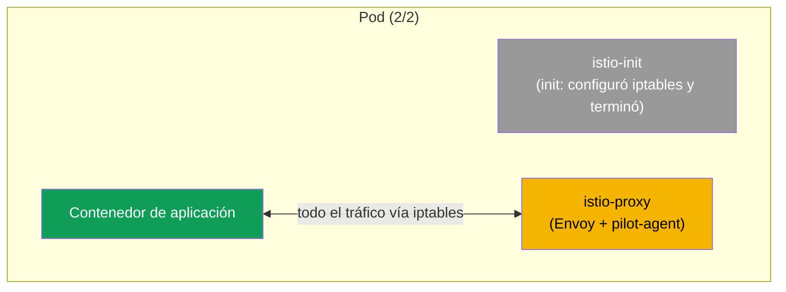
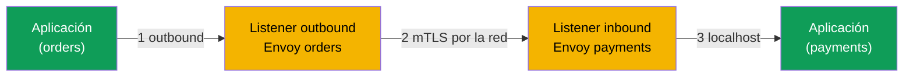

[RU version](ru.md) · [Eng version](en.md) · [Version française](fr.md) · [Deutsche Version](de.md)

# Capítulo 4. Data plane: Envoy e inyección de sidecar

> **Qué sigue.** Ya hemos visto que Istio tiene un data plane (los proxies que transportan el
> tráfico) y un control plane (istiod, que los gestiona). En este capítulo cubrimos el data
> plane en detalle: qué es Envoy, en qué consiste su configuración, cómo obtiene sus ajustes
> de istiod, y cómo exactamente el proxy acaba en tu pod. Esta es la base sobre la que se
> apoyan todos los capítulos siguientes sobre tráfico y seguridad.

## 4.1. Envoy, el corazón del data plane

Todo el tráfico real en Istio fluye no a través de istiod, sino a través de los proxies
Envoy. Es Envoy quien cifra las conexiones, reintenta las peticiones, aplica el enrutamiento y
cuenta las métricas. istiod solo reparte los ajustes a Envoy. Así que, para entender Istio,
hay que entender Envoy al menos a nivel de ideas.

## 4.2. Qué es Envoy y por qué se eligió

Envoy es un proxy de red L7 de alto rendimiento escrito en C++. Fue creado en Lyft en 2016
para lidiar con la comunicación entre cientos de microservicios; ese mismo año el proyecto se
donó a la CNCF, donde luego alcanzó el estado de graduado (a la par de Kubernetes). Las fuentes
y la documentación están en [envoyproxy.io](https://www.envoyproxy.io/) y en el repositorio
[envoyproxy/envoy](https://github.com/envoyproxy/envoy).

Envoy fue diseñado como un "data plane universal": el mismo proxy se usa como sidecar junto a
un servicio, como balanceador de carga en el borde, y como API gateway. Sus rasgos
arquitectónicos clave:

- **Conciencia de L7.** Entiende HTTP/1.1, HTTP/2, HTTP/3, gRPC y TCP/UDP arbitrario. Ve
  cabeceras, métodos, rutas, códigos de respuesta, estados de gRPC; de ahí el enrutamiento
  inteligente, los reintentos por código y las métricas detalladas.
- **Configuración dinámica mediante una API (xDS).** Casi todos los ajustes de Envoy se pueden
  cambiar al vuelo por gRPC/REST, sin reinicio y sin cortar conexiones. Esto es exactamente lo
  que usa istiod (sección 4.4). La mayoría de los proxies clásicos no pueden hacerlo: su config
  es estática, y un cambio requiere un reload.
- **Cadenas de filtros.** El procesamiento de peticiones es un pipeline de filtros
  (enrutamiento, autenticación, rate limit, lógica personalizada en Lua o Wasm). De ahí la
  extensibilidad de Istio (EnvoyFilter, WasmPlugin, capítulo 20).
- **Multithreading sin bloqueos.** Un modelo de hilos worker con un event loop separado por
  hilo da un alto throughput con latencia predecible.
- **Observabilidad de fábrica.** Métricas detalladas (incluso en formato Prometheus), tracing
  y access logs por petición; una interfaz de admin en el puerto `15000` dentro del pod.
- **Hot restart.** Puede reiniciarse a sí mismo sin cortar las conexiones activas.

Es exactamente la combinación de "entiende L7 + se configura dinámicamente por una API + se
extiende con filtros" lo que convirtió a Envoy en una base cómoda para una malla de servicios.
Por eso Istio no escribió su propio proxy sino que tomó Envoy, como la mayoría de las demás
mallas (capítulo 1).

### Envoy y otros proxies

Muchos proxies pueden aceptar y reenviar HTTP. La diferencia está en la configuración dinámica,
el soporte de protocolos y la extensibilidad, es decir, exactamente lo que necesita una malla
de servicios.

| Proxy | Lenguaje | Config dinámica | HTTP/2, gRPC | Extensibilidad | Dónde es fuerte |
|-------|----------|-----------------|--------------|----------------|-----------------|
| **Envoy** | C++ | sí, API xDS al vuelo | sí (incl. HTTP/3) | filtros, Lua, Wasm | malla, borde, API gateway; el estándar de facto del data plane |
| **NGINX** | C | mayormente estática (reload; dinámica en NGINX Plus) | sí (proxy gRPC) | módulos (build), Lua (OpenResty) | servidor web clásico y reverse proxy |
| **HAProxy** | C | estática + Runtime API (parcial) | sí | limitada (Lua, SPOE) | balanceo de carga L4/L7, muy alto rendimiento |
| **Traefik** | Go | sí, desde providers (k8s, Docker) | sí | middlewares, plugins | ingress simple para Kubernetes/Docker |
| **linkerd2-proxy** | Rust | sí, desde el control plane de Linkerd | sí | no pensado para extensiones de terceros | "micro-proxy" ligero como sidecar en Linkerd |

En resumen:

- **NGINX / HAProxy**, maduros y rápidos, pero su config es históricamente estática: para
  cambiar una ruta necesitas un reload. Para una malla con cientos de servicios y cambios
  frecuentes esto es incómodo, y la config dinámica completa en NGINX es de pago (Plus).
- **Traefik**, un ingress cómodo con autoconfiguración desde Kubernetes, pero es más un proxy
  de borde que un data plane de malla universal.
- **linkerd2-proxy**, un proxy Rust ligero y especializado, hecho a medida para Linkerd: más
  simple y ligero que Envoy, pero menos universal y no extensible con filtros de terceros.
- **Envoy** gana no por la "velocidad" en sí, sino por la combinación de una API xDS dinámica,
  amplio soporte de protocolos y extensibilidad, que es por lo que Istio, Consul, Kuma, Gloo,
  AWS App Mesh y otros están construidos sobre él.

## 4.3. En qué consiste la configuración de Envoy

Para leer la salida de diagnóstico (capítulo 23) y entender qué está pasando, necesitas conocer
cuatro conceptos básicos de Envoy. Forman una cadena, de "dónde aceptar la petición" a "a dónde
enviarla finalmente".

- **Listener.** El puerto y la dirección en los que Envoy escucha. Aquí llega el tráfico.
- **Route.** Las reglas: por qué condiciones (host, ruta, cabeceras) y a qué cluster enviar la
  petición.
- **Cluster.** Un grupo lógico de destinatarios, esencialmente el "servicio de destino" con
  políticas (balanceo de carga, timeouts, mTLS).
- **Endpoint.** Una dirección concreta de destinatario, normalmente una IP y puerto de pod.


Recuerda esta cadena: el listener aceptó, la route decidió a dónde, el cluster fijó la
política, el endpoint es un pod concreto. Casi toda la configuración de Istio la convierte
istiod, en última instancia, en estas cuatro entidades dentro de Envoy.

## 4.4. De dónde saca Envoy su configuración: xDS

Por sí mismo Envoy está "vacío". Todos los listeners, routes, clusters y endpoints se los envía
istiod.


Esta transferencia de configuración (esa flecha "envía la configuración" del diagrama) no va
por un único stream, sino por varios canales. Su nombre común es **xDS** (x Discovery
Service), y encontrarás los nombres individuales en los diagnósticos:

- **LDS**, Listener Discovery Service (listeners).
- **RDS**, Route Discovery Service (routes).
- **CDS**, Cluster Discovery Service (clusters).
- **EDS**, Endpoint Discovery Service (endpoints).
- **SDS**, Secret Discovery Service (certificados para mTLS).

Cuando aplicas, por ejemplo, un `VirtualService`, istiod recalcula la configuración y envía
actualizaciones por xDS a todos los Envoy relevantes. Los proxies las aplican al vuelo. Por eso
exactamente los cambios de enrutamiento llegan al tráfico sin reiniciar los pods.

## 4.5. Cómo el sidecar acaba en el pod: inyección automática

En el capítulo 2 pusimos la etiqueta `istio-injection=enabled` en un namespace y vimos a los
pods volverse `2/2`. Ahora cubramos qué pasa por debajo.

istiod tiene un **mutating admission webhook**. Si aprobaste el CKA, ya conoces este mecanismo:
los admission controllers intervienen en el manejo de la petición del lado del API server,
antes de que el objeto se escriba en etcd. El inyector de sidecar de Istio es exactamente un
mutating webhook que el API server llama cuando se crea un pod.

No necesitas instalar el webhook por separado: aparece **junto con la instalación de Istio**.
Cuando instalas el control plane (`istioctl install` en el capítulo 2 o el chart de Helm
`istiod` en el capítulo 3), Istio crea en el clúster un recurso
`MutatingWebhookConfiguration` que le dice al API server que llame a istiod cuando se crean
pods. Así que el inyector de sidecar es parte de istiod, no un componente separado que tengas
que desplegar a mano. En una instalación con revisión (capítulo 3) cada revisión tiene su
propio webhook, ligado a su propio istiod.

Es importante entender **dónde** y **cuándo** ocurre la modificación: no en tu máquina, no en
el kubelet, sino dentro del **API server**, en la fase de mutating admission. La propia
aplicación no dispara la inyección: lo hace el API server, llamando al webhook como un callback
HTTP.



La secuencia es:

1. Ejecutas `kubectl apply`, la petición va al API server.
2. El API server comprueba quién eres y si puedes crear el pod (autenticación, autorización).
3. En la fase de **mutating admission** el API server ve que el namespace está marcado para
   inyección y llama al webhook de istiod. Este recibe el manifiesto original, le añade el
   sidecar y devuelve el manifiesto modificado. Aquí es exactamente donde ocurre la
   modificación.
4. El manifiesto aumentado pasa la validación y se guarda en etcd: el pod aterriza en la base
   de datos ya con el sidecar.
5. De aquí en adelante todo es como siempre: el scheduler elige un nodo, el kubelet arranca el
   pod, y este se levanta como `2/2` de inmediato.

### Cómo está montado el propio webhook

Puedes verlo en el clúster así:

```bash
kubectl get mutatingwebhookconfiguration | grep istio
```

Dentro del `MutatingWebhookConfiguration` importan unos pocos campos (simplificado):

```yaml
apiVersion: admissionregistration.k8s.io/v1
kind: MutatingWebhookConfiguration
metadata:
  name: istio-sidecar-injector
webhooks:
- name: sidecar-injector.istio.io
  clientConfig:
    service:
      name: istiod                 # A DÓNDE el API server envía el pod para inyección
      namespace: istio-system
      path: /inject                # el endpoint de istiod que hace el patch
  rules:
  - operations: ["CREATE"]         # solo en la creación
    resources: ["pods"]            # solo para pods
  namespaceSelector:
    matchLabels:
      istio-injection: enabled     # solo namespaces etiquetados
  failurePolicy: Fail              # qué hacer si istiod no está disponible
```

El punto clave: **este objeto en sí no modifica nada**. Solo le dice al API server: "cuando se
cree un pod en tal namespace, llama a este servicio en la ruta `/inject`". Esto es una regla de
enrutamiento, no la lógica de inyección.

La modificación del manifiesto la hace **istiod**, ese mismo endpoint `/inject`. Desglosemos
paso a paso qué parte es responsable de qué:

- **`MutatingWebhookConfiguration`**, define *cuándo* y *para quién* llamar a istiod (la
  operación CREATE, el recurso pods, el namespaceSelector correcto).
- **istiod (`/inject`)**, recibe el objeto pod del API server (como un `AdmissionReview`), toma
  la plantilla del sidecar (vive en el ConfigMap `istio-sidecar-injector` y se define en el
  momento de la instalación), calcula qué añadir, y devuelve un **JSON patch** de vuelta en el
  `AdmissionReview`.
- **el API server**, aplica el patch recibido al manifiesto original. Es justo después de esto
  cuando `istio-init`, `istio-proxy` y los volumes aparecen en el pod.



Es decir, la plantilla de lo que se inserta se define en el momento de la instalación de Istio
(el ConfigMap), la decisión de llamar la toma el `MutatingWebhookConfiguration`, y el patch
concreto lo calcula istiod. El API server simplemente aplica el resultado.

Recordemos dos reglas del capítulo 2: la inyección solo se dispara en pods **nuevos** (porque
las `rules` tienen la operación CREATE), y solo si la etiqueta está puesta (lo comprueba el
`namespaceSelector`; en una instalación con revisión es `istio.io/rev`). Los pods que ya están
corriendo deben recrearse mediante `rollout restart`; entonces pasan de nuevo por admission y
reciben el sidecar.

### Inyección a nivel de pod o de deployment

La inyección se puede controlar no solo a nivel de namespace, sino también de forma puntual,
para una carga de trabajo concreta. Para eso está la etiqueta de pod `sidecar.istio.io/inject`
con el valor `"true"` o `"false"`.

Un punto importante: la etiqueta va no en el objeto Deployment, sino en la **plantilla del
pod**, `spec.template.metadata.labels`. Son los pods, no el Deployment, los que pasan por el
admission webhook, así que una etiqueta en el `metadata` propio del Deployment no tiene efecto.

```yaml
apiVersion: apps/v1
kind: Deployment
metadata:
  name: orders
spec:
  template:
    metadata:
      labels:
        app: orders
        sidecar.istio.io/inject: "true"   # <- etiqueta en la plantilla del pod, no en el Deployment
    spec:
      containers:
        - name: app
          image: orders:1.0
```

La decisión final se calcula a partir de dos etiquetas, en el namespace (`istio-injection`) y
en el pod (`sidecar.istio.io/inject`), con esta lógica:

1. Si cualquiera de las etiquetas está en "off" (`istio-injection=disabled` o
   `sidecar.istio.io/inject: "false"`), el sidecar **no** se inyecta.
2. Si cualquiera de las etiquetas está en "on" (`istio-injection=enabled`,
   `istio.io/rev=<rev>` o `sidecar.istio.io/inject: "true"`), el sidecar se inyecta.
3. Si ninguna está puesta, por defecto no se inyecta (gobernado por el ajuste
   `enableNamespacesByDefault`, que está desactivado por defecto).

| namespace `istio-injection` | pod `sidecar.istio.io/inject` | Resultado |
|---|---|---|
| enabled | (ninguna) | inyectado |
| enabled | `"false"` | no inyectado |
| enabled | `"true"` | inyectado |
| (sin etiqueta) | `"true"` | **inyectado** |
| (sin etiqueta) | (ninguna) | no inyectado |
| disabled | `"true"` | no inyectado (`disabled` tiene prioridad) |

De ahí dos escenarios prácticos:

- **Habilitar el sidecar solo para un deployment**, sin tocar todo el namespace: no etiquetes
  el namespace, y en la plantilla del pod del Deployment deseado pon
  `sidecar.istio.io/inject: "true"` (la fila "sin etiqueta + true" de la tabla). Solo esa carga
  de trabajo recibe el sidecar.
- **Excluir un solo deployment** de la inyección en un namespace etiquetado: mantén
  `istio-injection=enabled` en el namespace, y en la plantilla del pod de ese Deployment pon
  `sidecar.istio.io/inject: "false"`.

> En una instalación con revisión (capítulo 3) el "habilitador" a nivel de pod es la etiqueta
> `istio.io/rev=<revision>`, mientras que para desactivar de forma puntual se usa el mismo
> `sidecar.istio.io/inject: "false"`.

## 4.6. Qué se añade exactamente al pod

El webhook añade dos cosas al pod:

- **el init container `istio-init`.** Se ejecuta una vez al arrancar el pod y configura las
  reglas de iptables que enrutan todo el tráfico entrante y saliente de la aplicación hacia
  Envoy. Después el init container termina. (En algunas instalaciones se usa el plugin CNI de
  Istio en lugar del init container, en cuyo caso este configura iptables, pero la idea es la
  misma.)
- **el contenedor `istio-proxy`.** Este es el propio sidecar: dentro corre Envoy y el proceso
  auxiliar pilot-agent, que habla con istiod y gestiona los certificados.

### Qué cambia exactamente en el manifiesto del pod

La forma más fácil de entender la inyección es comparar el manifiesto "antes" y "después". Le
entregas a Kubernetes un pod simple con un contenedor:

```yaml
# ANTES: tu pod original
apiVersion: v1
kind: Pod
metadata:
  name: orders
spec:
  containers:
  - name: app
    image: orders:1.0
```

El webhook intercepta este manifiesto y devuelve a Kubernetes una versión ya aumentada:

```yaml
# DESPUÉS: el pod tras la inyección (simplificado)
apiVersion: v1
kind: Pod
metadata:
  name: orders
  labels:
    security.istio.io/tlsMode: istio          # + etiquetas para la malla
    service.istio.io/canonical-name: orders
  annotations:
    sidecar.istio.io/status: '{...}'          # + anotación sobre el estado de la inyección
spec:
  initContainers:
  - name: istio-init                          # + init container (iptables)
    image: docker.io/istio/proxyv2:1.29.1
  containers:
  - name: app                                 # tu contenedor, sin cambios
    image: orders:1.0
  - name: istio-proxy                          # + el propio sidecar (Envoy)
    image: docker.io/istio/proxyv2:1.29.1
  volumes:                                     # + volumes para certificados y config
  - name: istio-envoy
  - name: istio-data
  - name: istio-token
  - name: istiod-ca-cert
```

En total el webhook añade al manifiesto original:

- **`spec.initContainers`**, el contenedor `istio-init` (configura iptables antes de que
  arranque la aplicación).
- **`spec.containers`**, el contenedor `istio-proxy` (Envoy + pilot-agent).
- **`spec.volumes`**, volumes para la config de Envoy, los certificados de mTLS y el token de
  ServiceAccount, a través del cual el sidecar obtiene su identidad.
- **`metadata.labels`** y **`metadata.annotations`**, etiquetas y anotaciones de servicio por
  las que Istio sabe que el pod está en la malla y almacena el estado de la inyección.

Tu propio contenedor `app` no se toca: al pod simplemente se le añade fontanería alrededor.



Por eso los pods en la malla muestran `2/2`: los init containers no se cuentan aquí, así que
ves dos contenedores "de larga vida", la aplicación e istio-proxy.

## 4.7. Inyección manual

La inyección automática mediante el webhook es el método principal, pero a veces el sidecar se
inyecta manualmente, por ejemplo cuando el webhook está desactivado o quieres ver qué se añade
exactamente. Para eso está `istioctl kube-inject`:

```bash
istioctl kube-inject -f deployment.yaml | kubectl apply -f -
```

El comando toma tu manifiesto, le añade el init container e istio-proxy, y pasa el resultado a
`kubectl apply`. El resultado es el mismo que con la inyección automática, solo que lo haces
explícitamente.

## 4.8. Cómo pasa el tráfico por Envoy

Montemos la imagen del camino de una petición a nivel de Envoy. Cada proxy tiene dos tipos de
listener: **outbound** (para el tráfico saliente de la aplicación) e **inbound** (para el
tráfico que llega a la aplicación).



1. La aplicación hace una petición. Gracias a iptables aterriza en el listener outbound del
   Envoy local.
2. Envoy aplica enrutamiento y políticas, cifra el tráfico con mTLS y lo envía al listener
   inbound del Envoy del pod destinatario.
3. El Envoy del destinatario descifra el tráfico y se lo entrega a la aplicación por localhost.

Este es el mismo camino que dibujamos en el capítulo 1, solo que ahora puedes ver que dentro de
cada Envoy hay listeners separados para inbound y outbound.

## 4.9. Cómo mirar dentro de Envoy

A veces necesitas ver qué configuración llegó realmente a un proxy concreto. Para eso está
`istioctl proxy-config`, que muestra los listeners, routes, clusters y endpoints de un pod
elegido:

```bash
istioctl proxy-config clusters <pod> -n <namespace>
istioctl proxy-config routes   <pod> -n <namespace>
istioctl proxy-config listeners <pod> -n <namespace>
```

Aquí solo recuerda que existe tal herramienta. La usaremos en detalle en el capítulo 23 sobre
troubleshooting; ahí es la forma principal de entender por qué el tráfico va por el camino
equivocado.

## 4.10. Recursos del sidecar

Cada sidecar es un contenedor extra, lo que significa que consume CPU y memoria. Por defecto
istio-proxy solicita un poco (alrededor de `100m` de CPU y `128Mi` de memoria), pero en un
clúster con miles de pods esto se suma de forma notable. Los recursos del sidecar se pueden
fijar globalmente (mediante ajustes de instalación) o sobrescribir con anotaciones en los pods.
Tocaremos por separado la optimización del coste del data plane en el capítulo 18 (sidecar
scoping) y en el tema de ambient (capítulo 21), donde no hay sidecars en absoluto.

## 4.11. Resumen del capítulo

- Todo el tráfico en la malla lo transporta Envoy; istiod no toca el tráfico, solo configura
  los proxies.
- Envoy ([envoyproxy.io](https://www.envoyproxy.io/), un proyecto de la CNCF) fue elegido por
  Istio por su conciencia de protocolos (HTTP/1.1, HTTP/2, HTTP/3, gRPC), su configuración
  dinámica por xDS, su extensibilidad basada en filtros y sus métricas; la mayoría de las demás
  mallas también están construidas sobre él.
- La configuración de Envoy es una cadena: listener, route, cluster, endpoint.
- Los ajustes llegan desde istiod por xDS (LDS, RDS, CDS, EDS, SDS) y se aplican al vuelo.
- El sidecar lo inyecta el webhook de istiod en los pods nuevos de un namespace etiquetado.
- La inyección se puede controlar de forma puntual con la etiqueta de pod
  `sidecar.istio.io/inject` (`"true"`/`"false"`) en la **plantilla del pod** del Deployment:
  habilitar una carga de trabajo sin etiquetar el namespace, o, al contrario, excluirla de un
  namespace etiquetado.
- El pod recibe el init container `istio-init` (configura iptables) y el contenedor
  `istio-proxy` (Envoy + pilot-agent); de ahí el `2/2`.
- Cada Envoy tiene listeners inbound y outbound; el tráfico entre pods se cifra con mTLS.
- `istioctl proxy-config` te ayuda a ver la configuración real del proxy.

## 4.12. Preguntas de autoevaluación

1. ¿Por qué istiod no toma parte en el transporte del tráfico de usuario?
2. Explica con tus propias palabras la cadena listener, route, cluster, endpoint.
3. ¿Qué es xDS y por qué, gracias a él, los cambios llegan al tráfico sin reiniciar los pods?
4. ¿Qué añade al pod el webhook de inyección? ¿Para qué se necesita el init container?
5. ¿En qué se diferencia un listener inbound de un listener outbound?
6. ¿Cómo habilitas la inyección de sidecar solo para un Deployment, sin etiquetar todo el
   namespace? ¿En qué objeto y dónde exactamente se pone la etiqueta?

## Práctica

No hay un laboratorio separado solo para la inyección: ya la viste en acción en el laboratorio
01, cuando los pods de Bookinfo se volvieron `2/2`. Vuelve a él y mira un pod más de cerca:
comprueba los contenedores (`kubectl get pod <pod> -o jsonpath='{.spec.containers[*].name}'`) y
los init containers, y encuentra ahí `istio-proxy` e `istio-init`.

🧪 Laboratorio 01: [tasks/ica/labs/01](../../labs/01/README_ES.MD)

---
[Índice](../README_ES.md) · [Capítulo 3](../03/es.md) · [Capítulo 5](../05/es.md)
