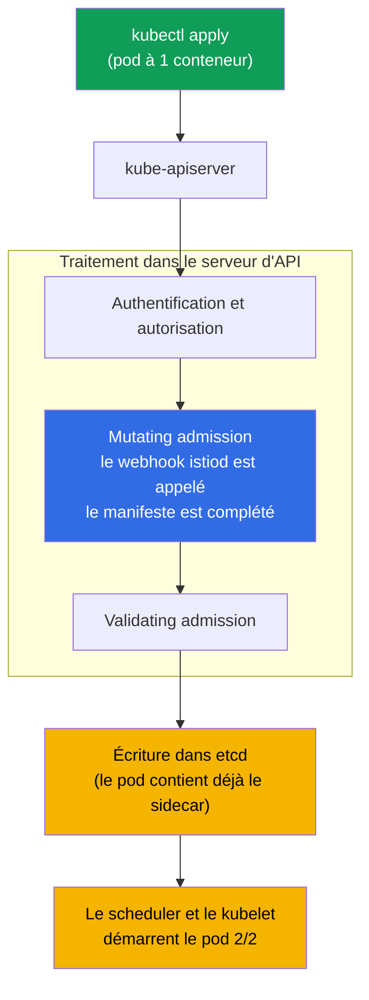
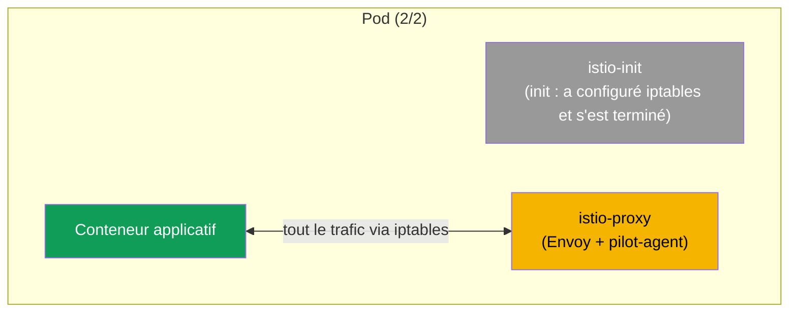
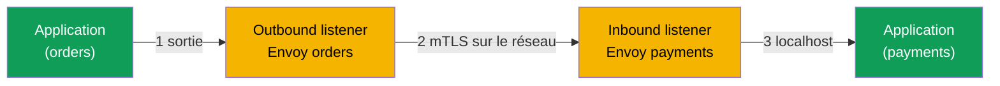

[RU version](ru.md) · [Eng version](en.md) · [Versión en español](es.md) · [Deutsche Version](de.md)

# Chapitre 4. Data plane : Envoy et sidecar injection

> **La suite.** Nous avons déjà vu qu'Istio a un data plane (les proxys qui portent le
> trafic) et un control plane (istiod, qui les gère). Dans ce chapitre, nous examinons
> le data plane en détail : ce qu'est Envoy, de quoi se compose sa configuration,
> comment il reçoit ses réglages d'istiod et comment exactement le proxy se retrouve
> dans votre pod. C'est le socle sur lequel reposent tous les chapitres suivants sur le
> trafic et la sécurité.

## 4.1. Envoy - le cœur du data plane

Tout le trafic réel dans Istio passe non pas par istiod, mais par le proxy Envoy. C'est
précisément Envoy qui chiffre les connexions, rejoue les requêtes, applique le routage
et comptabilise les métriques. istiod ne fait que distribuer les réglages à Envoy.
Ainsi, pour comprendre Istio, il faut comprendre Envoy au moins au niveau des idées.

## 4.2. Qu'est-ce qu'Envoy et pourquoi lui

Envoy est un proxy réseau de niveau L7 à hautes performances, écrit en C++. Il a été
créé par l'entreprise Lyft en 2016 pour gérer la communication entre des centaines de
microservices ; la même année, le projet a été transféré à la CNCF, où il a ensuite
obtenu le statut graduated (au même titre que Kubernetes). Le code source et la
documentation sont sur le site [envoyproxy.io](https://www.envoyproxy.io/) et dans le
dépôt [envoyproxy/envoy](https://github.com/envoyproxy/envoy).

Envoy a été conçu comme un « data plane universel » : le même proxy s'utilise à la fois
comme sidecar à côté d'un service, comme équilibreur de charge en périphérie (edge) et
comme API gateway. Traits architecturaux clés :

- **Conscience L7.** Il comprend HTTP/1.1, HTTP/2, HTTP/3, gRPC et le TCP/UDP
  arbitraire. Il voit les en-têtes, les méthodes, les chemins, les codes de réponse, les
  statuts gRPC - d'où un routage intelligent, des retries selon les codes et des
  métriques détaillées.
- **Configuration dynamique via API (xDS).** Presque tous les réglages d'Envoy peuvent
  être modifiés à la volée en gRPC/REST, sans redémarrage et sans rupture de connexion.
  C'est précisément ce dont se sert istiod (section 4.4). La plupart des proxys
  classiques ne savent pas faire cela : leur configuration est statique, et une
  modification exige un reload.
- **Chaînes de filtres (filter chains).** Le traitement d'une requête est un pipeline de
  filtres (routage, authentification, rate limit, logique personnalisée en Lua ou Wasm).
  D'où l'extensibilité d'Istio (EnvoyFilter, WasmPlugin - chapitre 20).
- **Multithreading sans verrous.** Un modèle de threads worker avec une event loop
  distincte par thread offre un débit élevé avec une latence prévisible.
- **Observabilité prête à l'emploi.** Métriques détaillées (notamment au format
  Prometheus), tracing et access logs pour chaque requête ; interface d'administration
  sur le port `15000` à l'intérieur du pod.
- **Hot restart.** Il sait se redémarrer lui-même sans rompre les connexions actives.

C'est précisément l'association « comprend le L7 + se configure dynamiquement via API +
s'étend par des filtres » qui a fait d'Envoy une base pratique pour un maillage de
services. C'est pourquoi Istio n'a pas écrit son propre proxy, mais a pris Envoy -
comme la plupart des autres maillages (chapitre 1).

### Envoy et les autres proxys

Recevoir et transmettre du HTTP, beaucoup de proxys savent le faire. La différence tient
au dynamisme de la configuration, à la prise en charge des protocoles et à
l'extensibilité, c'est-à-dire précisément à ce dont un maillage de services a besoin.

| Proxy | Langage | Config dynamique | HTTP/2, gRPC | Extensibilité | Où il excelle |
|--------|------|---------------------|--------------|---------------|-----------|
| **Envoy** | C++ | oui, API xDS à la volée | oui (dont HTTP/3) | filtres, Lua, Wasm | maillage, edge, API gateway ; standard de fait du data plane |
| **NGINX** | C | essentiellement statique (reload ; dynamique dans NGINX Plus) | oui (proxy pour gRPC) | modules (build), Lua (OpenResty) | serveur web et reverse-proxy classique |
| **HAProxy** | C | statique + Runtime API (partiellement) | oui | limitée (Lua, SPOE) | répartition L4/L7, très hautes performances |
| **Traefik** | Go | oui, depuis les providers (k8s, Docker) | oui | middlewares, plugins | ingress simple pour Kubernetes/Docker |
| **linkerd2-proxy** | Rust | oui, depuis le control plane de Linkerd | oui | non conçu pour des extensions tierces | « micro-proxy » léger en sidecar dans Linkerd |

En bref :

- **NGINX / HAProxy** - matures et rapides, mais leur configuration est historiquement
  statique : pour changer une route, il faut un reload. Pour un maillage de centaines de
  services aux changements fréquents, c'est peu pratique, et le vrai dynamisme de NGINX
  est payant (Plus).
- **Traefik** - un ingress pratique avec autoconfiguration depuis Kubernetes, mais c'est
  plutôt un proxy edge qu'un data plane universel de maillage.
- **linkerd2-proxy** - un proxy Rust léger et spécialisé, taillé pour Linkerd : plus
  simple et plus léger qu'Envoy, mais moins universel et non extensible par des filtres
  tiers.
- **Envoy** l'emporte non par la « vitesse » en tant que telle, mais par l'association
  d'une API xDS dynamique, d'une large prise en charge des protocoles et de
  l'extensibilité - c'est pourquoi Istio, Consul, Kuma, Gloo, AWS App Mesh et d'autres
  sont bâtis dessus.

## 4.3. De quoi se compose la configuration d'Envoy

Pour lire la sortie de diagnostic (chapitre 23) et comprendre ce qui se passe, il faut
connaître quatre concepts de base d'Envoy. Ils s'enchaînent en une chaîne - de « où
recevoir la requête » à « où l'envoyer au final ».

- **Listener (écouteur).** Le port et l'adresse qu'écoute Envoy. C'est là qu'arrive le
  trafic.
- **Route.** Les règles : selon quelles conditions (hôte, chemin, en-têtes) et vers quel
  cluster diriger la requête.
- **Cluster.** Un groupe logique de destinataires - en somme le « service de
  destination » avec ses politiques (répartition de charge, timeouts, mTLS).
- **Endpoint.** L'adresse concrète du destinataire, généralement l'IP du pod et le port.


Retenez cette chaîne : le listener a reçu, la route a décidé où, le cluster a défini la
politique, l'endpoint est le pod concret. Presque toute la configuration d'Istio finit
par être transformée par istiod en ces quatre entités à l'intérieur d'Envoy.

## 4.4. D'où Envoy tire sa configuration : xDS

En lui-même, Envoy est « vide ». Tous les listeners, routes, clusters et endpoints lui
sont envoyés par istiod.


Cette transmission de configuration (la fameuse flèche « envoie la configuration » du
schéma) ne se fait pas en un seul flux, mais par plusieurs canaux. Leur nom collectif
est **xDS** (x Discovery Service), et leurs noms individuels reviendront dans le
diagnostic :

- **LDS** - Listener Discovery Service (les listeners).
- **RDS** - Route Discovery Service (les routes).
- **CDS** - Cluster Discovery Service (les clusters).
- **EDS** - Endpoint Discovery Service (les endpoints).
- **SDS** - Secret Discovery Service (les certificats pour le mTLS).

Lorsque vous appliquez par exemple un `VirtualService`, istiod recalcule la
configuration et distribue via xDS les mises à jour à tous les Envoy concernés. Les
proxys l'appliquent à la volée. C'est précisément pour cela que les changements de
routage atteignent le trafic sans redémarrage des pods.

## 4.5. Comment le sidecar arrive dans le pod : l'injection automatique

Au chapitre 2, nous posions le label `istio-injection=enabled` sur le namespace et nous
voyions les pods passer à `2/2`. Voyons maintenant ce qui se passe sous le capot.

istiod dispose d'un **mutating admission webhook**. Si vous avez passé le CKA, vous
connaissez déjà ce mécanisme : les contrôleurs d'admission interviennent dans le
traitement de la requête côté serveur d'API, avant l'écriture de l'objet dans etcd. Le
sidecar injector d'Istio est justement un mutating webhook que le serveur d'API appelle
lors de la création d'un pod.

Il n'y a pas à installer le webhook séparément : il apparaît **avec l'installation
d'Istio**. Lorsque vous installez le control plane (`istioctl install` au chapitre 2 ou
le chart Helm `istiod` au chapitre 3), Istio crée dans le cluster une ressource
`MutatingWebhookConfiguration` qui indique au serveur d'API d'appeler istiod lors de la
création des pods. Autrement dit, le sidecar injector fait partie d'istiod, et non un
composant séparé à déployer à la main. Dans une installation par révision (chapitre 3),
chaque révision a son propre webhook, lié à son istiod.

Il est important de comprendre **où** et **quand** se produit la modification : ni sur
votre machine, ni dans le kubelet, mais à l'intérieur du **serveur d'API**, à l'étape du
mutating admission. L'application elle-même ne déclenche pas l'injection - c'est le
serveur d'API qui l'exécute, en appelant le webhook comme un callback HTTP.



La séquence est la suivante :

1. Vous faites `kubectl apply`, la requête part vers le serveur d'API.
2. Le serveur d'API vérifie qui vous êtes et si vous avez le droit de créer le pod
   (authentification, autorisation).
3. À l'étape du **mutating admission**, le serveur d'API voit que le namespace est marqué
   pour l'injection et appelle le webhook istiod. Celui-ci reçoit le manifeste d'origine,
   y ajoute le sidecar et renvoie le manifeste modifié. C'est ici que se produit la
   modification.
4. Le manifeste complété passe la validation et est enregistré dans etcd - le pod entre
   dans la base déjà pourvu du sidecar.
5. Ensuite, tout se déroule normalement : le scheduler choisit un nœud, le kubelet
   démarre le pod, et il se lance directement en `2/2`.

### Comment est construit le webhook lui-même

On peut le voir dans le cluster ainsi :

```bash
kubectl get mutatingwebhookconfiguration | grep istio
```

À l'intérieur de `MutatingWebhookConfiguration`, plusieurs champs importent (en
simplifié) :

```yaml
apiVersion: admissionregistration.k8s.io/v1
kind: MutatingWebhookConfiguration
metadata:
  name: istio-sidecar-injector
webhooks:
- name: sidecar-injector.istio.io
  clientConfig:
    service:
      name: istiod                 # OÙ le serveur d'API envoie le pod pour injection
      namespace: istio-system
      path: /inject                # endpoint d'istiod qui effectue le patch
  rules:
  - operations: ["CREATE"]         # uniquement à la création
    resources: ["pods"]            # uniquement pour les pods
  namespaceSelector:
    matchLabels:
      istio-injection: enabled     # uniquement les namespaces marqués
  failurePolicy: Fail              # que faire si istiod est indisponible
```

Point clé : **cet objet lui-même ne modifie rien**. Il indique seulement au serveur
d'API : « lors de la création d'un pod dans tel namespace, appelle ce service par le
chemin `/inject` ». C'est une règle de routage, pas la logique d'injection.

La modification du manifeste est effectuée par **istiod** - le fameux endpoint
`/inject`. Décortiquons étape par étape quelle partie fait quoi :

- **`MutatingWebhookConfiguration`** - définit *quand* et *pour qui* appeler istiod
  (opération CREATE, ressource pods, le namespaceSelector voulu).
- **istiod (`/inject`)** - reçoit du serveur d'API l'objet pod (sous forme
  d'`AdmissionReview`), prend le modèle de sidecar (il se trouve dans la ConfigMap
  `istio-sidecar-injector` et est défini à l'installation), calcule ce qu'il faut
  ajouter et renvoie un **patch JSON** dans l'`AdmissionReview`.
- **Le serveur d'API** - applique le patch reçu au manifeste d'origine. C'est après cela
  qu'apparaissent dans le pod `istio-init`, `istio-proxy` et les volumes.


Autrement dit, le modèle de ce qui est inséré est défini à l'installation d'Istio
(ConfigMap), la décision d'appeler est prise par `MutatingWebhookConfiguration`, et le
patch concret est calculé par istiod. Le serveur d'API ne fait qu'appliquer le résultat.

Rappelons deux règles du chapitre 2 : l'injection ne se déclenche que sur les
**nouveaux** pods (car dans `rules` figure l'opération `CREATE`), et uniquement si le
label est présent (vérifié par le `namespaceSelector` ; dans une installation par
révision, c'est `istio.io/rev`). Les pods déjà en fonctionnement doivent être recréés
via `rollout restart` - ils repasseront alors par l'admission et recevront le sidecar.

### Injection au niveau du pod ou du deployment

L'injection peut se gérer non seulement au niveau du namespace, mais aussi de manière
ciblée - pour un workload précis. Pour cela, il existe le label de pod
`sidecar.istio.io/inject` avec la valeur `"true"` ou `"false"`.

Point important : le label se pose non pas sur l'objet Deployment, mais sur le **modèle
de pod** - `spec.template.metadata.labels`. Ce sont bien les pods qui passent par
l'admission-webhook, et non le Deployment, c'est pourquoi un label sur le `metadata` du
Deployment lui-même ne jouera aucun rôle.

```yaml
apiVersion: apps/v1
kind: Deployment
metadata:
  name: orders
spec:
  template:
    metadata:
      labels:
        app: orders
        sidecar.istio.io/inject: "true"   # <- label sur le modèle de pod, pas sur le Deployment
    spec:
      containers:
        - name: app
          image: orders:1.0
```

La décision finale se calcule à partir de deux labels - celui du namespace
(`istio-injection`) et celui du pod (`sidecar.istio.io/inject`) - selon la logique
suivante :

1. Si l'un des labels est sur « désactivé » (`istio-injection=disabled` ou
   `sidecar.istio.io/inject: "false"`) - le sidecar **n'est pas** injecté.
2. Si l'un des labels est « activé » (`istio-injection=enabled`, `istio.io/rev=<rev>` ou
   `sidecar.istio.io/inject: "true"`) - le sidecar est injecté.
3. Si aucun n'est présent - par défaut il n'est pas injecté (géré par le réglage
   `enableNamespacesByDefault`, désactivé par défaut).

| namespace `istio-injection` | pod `sidecar.istio.io/inject` | Résultat |
|---|---|---|
| enabled | (aucun) | injecté |
| enabled | `"false"` | non injecté |
| enabled | `"true"` | injecté |
| (aucun label) | `"true"` | **injecté** |
| (aucun label) | (aucun) | non injecté |
| disabled | `"true"` | non injecté (`disabled` prioritaire) |

D'où deux scénarios pratiques :

- **Activer le sidecar pour un seul deployment**, sans toucher à tout le namespace : ne
  posez pas de label sur le namespace, mais sur le modèle de pod du Deployment voulu,
  mettez `sidecar.istio.io/inject: "true"` (la ligne « aucun label + true » du tableau).
  Seul ce workload recevra un sidecar.
- **Exclure un deployment** de l'injection dans un namespace marqué : conservez
  `istio-injection=enabled` sur le namespace, et sur le modèle de pod de ce Deployment
  mettez `sidecar.istio.io/inject: "false"`.

> Dans une installation par révision (chapitre 3), le rôle d'« activateur » au niveau du
> pod est joué par le label `istio.io/rev=<revision>`, et pour une désactivation ciblée
> on utilise toujours le même `sidecar.istio.io/inject: "false"`.

## 4.6. Ce qui est concrètement ajouté au pod

Le webhook ajoute deux choses au pod :

- **l'init-conteneur `istio-init`.** Il s'exécute une fois au démarrage du pod et
  configure les règles iptables qui redirigent tout le trafic entrant et sortant de
  l'application vers Envoy. Après quoi l'init-conteneur se termine. (Dans certaines
  installations, à la place de l'init-conteneur, on utilise le plugin CNI d'Istio, qui
  configure alors iptables, mais l'idée est la même.)
- **le conteneur `istio-proxy`.** C'est le sidecar : à l'intérieur tournent Envoy et un
  processus auxiliaire pilot-agent, qui communique avec istiod et gère les certificats.

### Ce qui change concrètement dans le manifeste du pod

Le plus simple pour comprendre l'injection est de comparer le manifeste « avant » et
« après ». Vous confiez à Kubernetes un simple pod à un conteneur :

```yaml
# AVANT : votre pod d'origine
apiVersion: v1
kind: Pod
metadata:
  name: orders
spec:
  containers:
  - name: app
    image: orders:1.0
```

Le webhook intercepte ce manifeste et renvoie à Kubernetes une version déjà complétée :

```yaml
# APRÈS : le pod après injection (simplifié)
apiVersion: v1
kind: Pod
metadata:
  name: orders
  labels:
    security.istio.io/tlsMode: istio          # + labels pour le maillage
    service.istio.io/canonical-name: orders
  annotations:
    sidecar.istio.io/status: '{...}'          # + annotation sur le statut de l'injection
spec:
  initContainers:
  - name: istio-init                          # + init-conteneur (iptables)
    image: docker.io/istio/proxyv2:1.29.1
  containers:
  - name: app                                 # votre conteneur, inchangé
    image: orders:1.0
  - name: istio-proxy                          # + le sidecar lui-même (Envoy)
    image: docker.io/istio/proxyv2:1.29.1
  volumes:                                     # + volumes pour les certificats et la config
  - name: istio-envoy
  - name: istio-data
  - name: istio-token
  - name: istiod-ca-cert
```

Au total, le webhook ajoute au manifeste d'origine :

- **`spec.initContainers`** - le conteneur `istio-init` (configure iptables avant le
  démarrage de l'application).
- **`spec.containers`** - le conteneur `istio-proxy` (Envoy + pilot-agent).
- **`spec.volumes`** - les volumes pour la configuration d'Envoy, les certificats mTLS et
  le token du ServiceAccount, par lesquels le sidecar reçoit son identity.
- **`metadata.labels`** et **`metadata.annotations`** - des labels et annotations de
  service, grâce auxquels Istio sait que le pod est dans le maillage et conserve le
  statut de l'injection.

Votre propre conteneur `app` n'est pas touché - le pod se voit simplement ajouter une
enveloppe autour de lui.



Voilà pourquoi, dans le maillage, les pods affichent `2/2` : les init-conteneurs
n'entrent pas dans ce compteur, on voit donc deux conteneurs « longue durée » -
l'application et istio-proxy.

## 4.7. Injection manuelle

L'injection automatique via webhook est la méthode principale, mais on injecte parfois
le sidecar manuellement, par exemple lorsque le webhook est désactivé ou qu'on veut voir
ce qui est ajouté exactement. Pour cela, il existe `istioctl kube-inject` :

```bash
istioctl kube-inject -f deployment.yaml | kubectl apply -f -
```

La commande prend votre manifeste, y ajoute l'init-conteneur et istio-proxy et transmet
le résultat à `kubectl apply`. Le résultat est le même que lors de l'injection
automatique, vous le faites simplement de manière explicite.

## 4.8. Comment le trafic traverse Envoy

Rassemblons la vue du chemin de la requête au niveau d'Envoy. Chaque proxy a deux types
de listener : **outbound** (pour le trafic sortant de l'application) et **inbound**
(pour le trafic arrivant vers l'application).



1. L'application fait une requête. Grâce à iptables, elle arrive sur l'outbound listener
   de l'Envoy local.
2. Envoy applique le routage et les politiques, chiffre le trafic en mTLS et l'envoie sur
   l'inbound listener de l'Envoy du pod destinataire.
3. L'Envoy du destinataire déchiffre le trafic et le remet à l'application via localhost.

C'est le même chemin que nous avons dessiné au chapitre 1, sauf qu'on voit maintenant
qu'à l'intérieur de chaque Envoy il y a des listeners distincts pour l'entrée et la
sortie.

## 4.9. Comment regarder à l'intérieur d'Envoy

Il faut parfois voir quelle configuration est réellement arrivée jusqu'à un proxy précis.
Pour cela, il existe `istioctl proxy-config`, qui montre les listeners, routes, clusters
et endpoints du pod choisi :

```bash
istioctl proxy-config clusters <pod> -n <namespace>
istioctl proxy-config routes   <pod> -n <namespace>
istioctl proxy-config listeners <pod> -n <namespace>
```

Ici, retenez simplement qu'un tel outil existe. Nous l'utiliserons en détail au chapitre
23 sur le troubleshooting - c'est là le principal moyen de comprendre pourquoi le trafic
ne va pas au bon endroit.

## 4.10. Ressources du sidecar

Chaque sidecar est un conteneur supplémentaire, il consomme donc du CPU et de la
mémoire. Par défaut, istio-proxy demande peu (de l'ordre de `100m` CPU et `128Mi` de
mémoire), mais dans un cluster de milliers de pods, cela devient globalement notable.
Les ressources du sidecar peuvent se définir globalement (via les réglages
d'installation) ou se surcharger par des annotations sur les pods. Nous aborderons
séparément l'optimisation des coûts du data plane au chapitre 18 (sidecar scoping) et
dans le thème ambient (chapitre 21), où il n'y a pas de sidecars du tout.

## 4.11. Résumé du chapitre

- Tout le trafic dans le maillage est porté par Envoy ; istiod ne touche pas au trafic,
  il ne fait que configurer les proxys.
- Envoy ([envoyproxy.io](https://www.envoyproxy.io/), projet CNCF) a été choisi par
  Istio pour sa compréhension des protocoles (HTTP/1.1, HTTP/2, HTTP/3, gRPC), sa
  configuration dynamique via xDS, son extensibilité par filtres et ses métriques ; la
  plupart des autres maillages sont aussi bâtis dessus.
- La configuration d'Envoy est une chaîne : listener, route, cluster, endpoint.
- Les réglages arrivent d'istiod via xDS (LDS, RDS, CDS, EDS, SDS) et s'appliquent à la
  volée.
- Le sidecar est injecté par le webhook d'istiod dans les nouveaux pods d'un namespace
  marqué.
- L'injection peut se gérer de manière ciblée par le label de pod
  `sidecar.istio.io/inject` (`"true"`/`"false"`) sur le **modèle de pod** du Deployment :
  activer un seul workload sans label sur le namespace ou, à l'inverse, l'exclure d'un
  namespace marqué.
- Le pod se voit ajouter l'init-conteneur `istio-init` (configure iptables) et le
  conteneur `istio-proxy` (Envoy + pilot-agent) ; d'où le `2/2`.
- Chaque Envoy a un inbound listener et un outbound listener ; le trafic entre les pods
  est chiffré en mTLS.
- `istioctl proxy-config` aide à voir la configuration réelle du proxy.

## 4.12. Questions d'auto-évaluation

1. Pourquoi istiod ne participe-t-il pas à la transmission du trafic utilisateur ?
2. Expliquez la chaîne listener - route - cluster - endpoint avec vos propres mots.
3. Qu'est-ce que le xDS et pourquoi, grâce à lui, les changements arrivent-ils sans
   redémarrage des pods ?
4. Qu'ajoute au pod le webhook d'injection ? À quoi sert l'init-conteneur ?
5. En quoi l'inbound listener diffère-t-il de l'outbound listener ?
6. Comment activer l'injection de sidecar pour un seul Deployment, sans marquer tout le
   namespace ? Sur quel objet et où exactement se pose le label ?

## Pratique

Il n'y a pas de lab dédié uniquement à l'injection - vous l'avez déjà vue à l'œuvre dans
le lab 01, quand les pods de Bookinfo sont passés à `2/2`. Revenez-y et regardez le pod
de plus près : vérifiez les conteneurs (`kubectl get pod <pod> -o
jsonpath='{.spec.containers[*].name}'`) et les init-conteneurs, et repérez-y
`istio-proxy` et `istio-init`.

🧪 Lab 01 : [tasks/ica/labs/01](../../labs/01/README_FR.MD)

---
[Table des matières](../README_FR.md) · [Chapitre 3](../03/fr.md) · [Chapitre 5](../05/fr.md)
