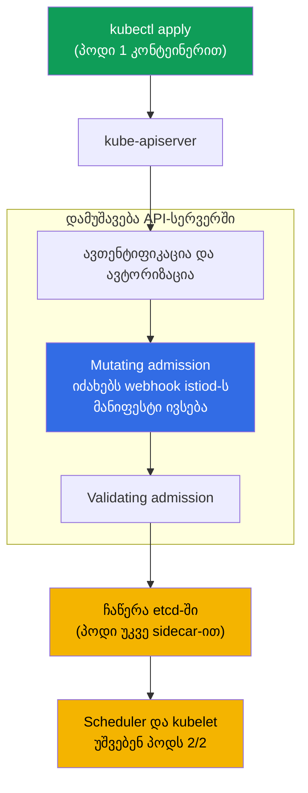
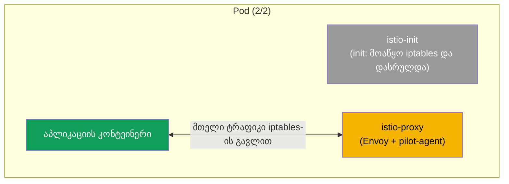
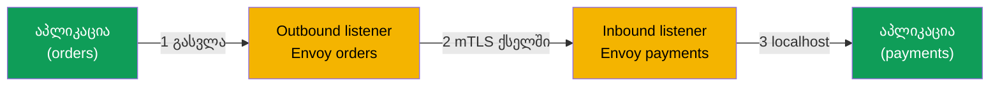

[Русская версия](ru.md) · [Eng version](en.md) · [Versión en español](es.md) · [Version française](fr.md) · [Deutsche Version](de.md) · [繁體中文版](tw.md) · [日本語版](jp.md)

# თავი 4. Data plane: Envoy და sidecar injection

> **რა იქნება შემდეგ.** უკვე ვნახეთ, რომ Istio-ს აქვს data plane (პროქსიები, რომლებიც
> ტრაფიკს ატარებენ) და control plane (istiod, რომელიც მათ მართავს). ამ თავში
> დეტალურად განვიხილავთ data plane-ს: რა არის Envoy, რისგან შედგება მისი კონფიგურაცია,
> როგორ იღებს ის პარამეტრებს istiod-ისგან და კონკრეტულად როგორ ხვდება პროქსი თქვენს
> პოდში. ეს არის საფუძველი, რომელსაც ტრაფიკისა და უსაფრთხოების შესახებ ყველა მომდევნო
> თავი ეყრდნობა.

## 4.1. Envoy - data plane-ის გული

Istio-ში მთელი რეალური ტრაფიკი არა istiod-ის, არამედ Envoy პროქსის გავლით მოძრაობს.
სწორედ Envoy შიფრავს კავშირებს, იმეორებს მოთხოვნებს, იყენებს მარშრუტიზაციას და
ითვლის მეტრიკებს. istiod მხოლოდ პარამეტრებს აწვდის Envoy-ს. ამიტომ Istio-ს გასაგებად
საჭიროა, სულ მცირე, Envoy-ის ძირითადი იდეების გაგება.

## 4.2. რა არის Envoy და რატომ მაინცდამაინც ის

Envoy არის C++-ზე დაწერილი, მაღალი წარმადობის L7 დონის ქსელური პროქსი. ის 2016 წელს
კომპანია Lyft-ში შექმნეს, რათა ასობით მიკროსერვისს შორის კავშირი ემართათ; იმავე წელს
პროექტი CNCF-ს გადასცეს, სადაც მოგვიანებით graduated სტატუსი მიიღო (Kubernetes-ის
მსგავსად). საწყისი კოდი და დოკუმენტაცია ხელმისაწვდომია საიტზე
[envoyproxy.io](https://www.envoyproxy.io/) და რეპოზიტორიაში
[envoyproxy/envoy](https://github.com/envoyproxy/envoy).

Envoy ჩაფიქრებული იყო როგორც „უნივერსალური data plane“: ერთსა და იმავე პროქსის
იყენებენ როგორც sidecar-ს სერვისის გვერდით, edge-დამაბალანსებლად და API-gateway-დ.
ძირითადი არქიტექტურული მახასიათებლებია:

- **L7-ის ცოდნა.** ესმის HTTP/1.1, HTTP/2, HTTP/3, gRPC და ნებისმიერი TCP/UDP.
  ხედავს სათაურებს, მეთოდებს, გზებს, პასუხის კოდებსა და gRPC-სტატუსებს - აქედან
  მოდის ჭკვიანი მარშრუტიზაცია, კოდების მიხედვით განმეორებითი ცდები და დეტალური
  მეტრიკები.
- **დინამიკური კონფიგურაცია API-ის (xDS) მეშვეობით.** Envoy-ის თითქმის ყველა
  პარამეტრი შეიძლება შეიცვალოს მუშაობისას gRPC/REST-ის მეშვეობით, გადატვირთვისა და
  კავშირების გაწყვეტის გარეშე. სწორედ ამას იყენებს istiod (განყოფილება 4.4).
  კლასიკური პროქსიების უმეტესობას ეს არ შეუძლია: მათი კონფიგურაცია სტატიკურია, ხოლო
  ცვლილებას reload სჭირდება.
- **ფილტრების ჯაჭვები (filter chains).** მოთხოვნის დამუშავება ფილტრებისგან შემდგარი
  კონვეიერია (მარშრუტიზაცია, ავთენტიფიკაცია, rate limit, საკუთარი ლოგიკა Lua-ზე ან
  Wasm-ზე). აქედან მოდის Istio-ს გაფართოების შესაძლებლობა (EnvoyFilter, WasmPlugin -
  თავი 20).
- **მრავალნაკადიანობა ბლოკირების გარეშე.** worker-ნაკადების მოდელი, თითოეული
  ნაკადისთვის ცალკე event loop-ით, უზრუნველყოფს მაღალ გამტარუნარიანობას პროგნოზირებადი
  დაყოვნებით.
- **Observability მზა სახით.** დეტალური მეტრიკები (მათ შორის Prometheus-ის ფორმატში),
  tracing და access-ლოგები თითოეული მოთხოვნისთვის; admin-ინტერფეისი პოდის შიგნით
  `15000` პორტზე.
- **Hot restart.** შეუძლია საკუთარი თავის გადატვირთვა აქტიური კავშირების გაწყვეტის
  გარეშე.

სწორედ კომბინაციამ „ესმის L7 + დინამიკურად კონფიგურირდება API-ით + ფართოვდება
ფილტრებით“ აქცია Envoy service mesh-ის მოსახერხებელ საფუძვლად. ამიტომ Istio-მ
საკუთარი პროქსი კი არ დაწერა, არამედ Envoy აიღო - ისევე, როგორც სხვა mesh-ების
უმეტესობამ (თავი 1).

### Envoy და სხვა პროქსიები

HTTP-ის მიღება და გადაგზავნა ბევრ პროქსის შეუძლია. განსხვავება კონფიგურაციის
დინამიკურობაში, პროტოკოლების მხარდაჭერასა და გაფართოების შესაძლებლობაშია, ანუ ზუსტად
იმაში, რაც service mesh-ს სჭირდება.

| პროქსი | ენა | დინამიკური კონფიგურაცია | HTTP/2, gRPC | გაფართოების შესაძლებლობა | ძლიერი მხარე |
|--------|------|---------------------|--------------|---------------|-----------|
| **Envoy** | C++ | დიახ, xDS API მუშაობისას | დიახ (მათ შორის HTTP/3) | ფილტრები, Lua, Wasm | mesh, edge, API-gateway; data plane-ის ფაქტობრივი სტანდარტი |
| **NGINX** | C | ძირითადად სტატიკური (reload; დინამიკა - NGINX Plus-ში) | დიახ (proxy gRPC-სთვის) | მოდულები (აწყობისას), Lua (OpenResty) | კლასიკური ვებსერვერი და reverse-proxy |
| **HAProxy** | C | სტატიკური + Runtime API (ნაწილობრივ) | დიახ | შეზღუდული (Lua, SPOE) | L4/L7-დაბალანსება, ძალიან მაღალი წარმადობა |
| **Traefik** | Go | დიახ, პროვაიდერებიდან (k8s, Docker) | დიახ | middlewares, პლაგინები | მარტივი ingress Kubernetes/Docker-ისთვის |
| **linkerd2-proxy** | Rust | დიახ, Linkerd-ის control plane-იდან | დიახ | გარე გაფართოებებზე გათვლილი არ არის | მსუბუქი „მიკროპროქსი“-sidecar Linkerd-ში |

მოკლედ:

- **NGINX / HAProxy** - მომწიფებული და სწრაფია, მაგრამ მათი კონფიგურაცია ისტორიულად
  სტატიკურია: მარშრუტის შესაცვლელად reload არის საჭირო. ასობით სერვისისა და ხშირი
  ცვლილებების მქონე mesh-ისთვის ეს მოუხერხებელია, ხოლო NGINX-ის სრულფასოვანი დინამიკა
  ფასიანია (Plus).
- **Traefik** - მოსახერხებელი ingress-ია Kubernetes-იდან ავტოკონფიგურაციით, თუმცა ის
  უფრო edge-პროქსია, ვიდრე mesh-ის უნივერსალური data plane.
- **linkerd2-proxy** - Linkerd-ზე მორგებული სპეციალიზებული, მსუბუქი Rust-პროქსია:
  Envoy-ზე მარტივი და მსუბუქია, მაგრამ ნაკლებად უნივერსალურია და გარე ფილტრებით არ
  ფართოვდება.
- **Envoy** იმარჯვებს არა უშუალოდ „სიჩქარით“, არამედ დინამიკური xDS-API-ის,
  პროტოკოლების ფართო მხარდაჭერისა და გაფართოების შესაძლებლობის კომბინაციით - ამიტომ
  მასზეა აგებული Istio, Consul, Kuma, Gloo, AWS App Mesh და სხვა სისტემები.

## 4.3. რისგან შედგება Envoy-ის კონფიგურაცია

დიაგნოსტიკის გამონატანის წასაკითხად (თავი 23) და მიმდინარე პროცესების გასაგებად,
Envoy-ის ოთხი საბაზისო ცნება უნდა იცოდეთ. ისინი ჯაჭვად ლაგდება - „სად მივიღოთ
მოთხოვნიდან“ „საბოლოოდ სად გავაგზავნოთ მოთხოვნამდე“.

- **Listener (მსმენელი).** პორტი და მისამართი, რომლებსაც Envoy უსმენს. ტრაფიკი აქ
  შემოდის.
- **Route (მარშრუტი).** წესები: რა პირობების მიხედვით (ჰოსტი, გზა, სათაურები) და რომელ
  კლასტერში გაიგზავნოს მოთხოვნა.
- **Cluster (კლასტერი).** მიმღებთა ლოგიკური ჯგუფი - არსებითად „დანიშნულების სერვისი“
  პოლიტიკებით (დაბალანსება, timeout-ები, mTLS).
- **Endpoint (ენდპოინტი).** მიმღების კონკრეტული მისამართი, ჩვეულებრივ პოდის IP და
  პორტი.


დაიმახსოვრეთ ეს ჯაჭვი: listener-მა მიიღო, route-მა გადაწყვიტა სად, cluster-მა
პოლიტიკა განსაზღვრა, endpoint კი კონკრეტული პოდია. Istio-ს თითქმის მთელი
კონფიგურაცია საბოლოოდ istiod-ის მიერ Envoy-ის შიგნით ამ ოთხ ერთეულად გარდაიქმნება.

## 4.4. საიდან იღებს Envoy კონფიგურაციას: xDS

Envoy თავისთავად „ცარიელია“. ყველა listener-ს, route-ს, cluster-სა და endpoint-ს მას
istiod უგზავნის.


კონფიგურაციის ეს გადაცემა (სქემაზე იგივე ისარი „აგზავნის კონფიგურაციას“) არა ერთი
ნაკადით, არამედ რამდენიმე არხით მიმდინარეობს. მათი საერთო სახელია **xDS** (x Discovery
Service), ცალკეულ სახელებს კი დიაგნოსტიკაში შეხვდებით:

- **LDS** - Listener Discovery Service (მსმენელები).
- **RDS** - Route Discovery Service (მარშრუტები).
- **CDS** - Cluster Discovery Service (კლასტერები).
- **EDS** - Endpoint Discovery Service (ენდპოინტები).
- **SDS** - Secret Discovery Service (სერტიფიკატები mTLS-ისთვის).

როდესაც, მაგალითად, `VirtualService`-ს იყენებთ, istiod ხელახლა ითვლის კონფიგურაციას
და xDS-ის მეშვეობით განახლებებს ყველა საჭირო Envoy-ს უგზავნის. პროქსიები მათ
მუშაობისას იყენებენ. ამიტომ მარშრუტიზაციის ცვლილებები ტრაფიკამდე პოდების
გადატვირთვის გარეშე აღწევს.

## 4.5. როგორ ხვდება sidecar პოდში: ავტომატური ინექცია

მე-2 თავში namespace-ს `istio-injection=enabled` ჭდე დავადეთ და ვნახეთ, რომ პოდები
`2/2` ხდებოდა. ახლა განვიხილოთ, რა ხდება შიგნით.

istiod-ს აქვს **mutating admission webhook**. თუ CKA ჩაგიბარებიათ, ეს მექანიზმი უკვე
იცით: admission-კონტროლერები API-სერვერის მხარეს მოთხოვნის დამუშავებაში ობიექტის
etcd-ში ჩაწერამდე ერევიან. Istio-ს Sidecar injector სწორედ mutating webhook-ია,
რომელსაც API-სერვერი პოდის შექმნისას იძახებს.

webhook-ის ცალკე დაყენება საჭირო არ არის: ის **Istio-ს დაყენებასთან ერთად** ჩნდება.
როდესაც control plane-ს აყენებთ (მე-2 თავში `istioctl install`-ით ან მე-3 თავში Helm
chart `istiod`-ით), Istio კლასტერში ქმნის `MutatingWebhookConfiguration` რესურსს,
რომელიც API-სერვერს ეუბნება, პოდების შექმნისას istiod გამოიძახოს. ანუ sidecar
injector არის istiod-ის ნაწილი და არა ცალკე კომპონენტი, რომელიც ხელით უნდა
განათავსოთ. რევიზიულ ინსტალაციაში (თავი 3) თითოეულ რევიზიას თავის istiod-ზე მიბმული
საკუთარი webhook აქვს.

მნიშვნელოვანია იმის გაგება, **სად** და **როდის** ხდება მოდიფიკაცია: არა თქვენს
კომპიუტერზე, არა kubelet-ში, არამედ **API-სერვერის** შიგნით, mutating admission
ეტაპზე. თავად აპლიკაცია ინექციას არ იწყებს - მას API-სერვერი ასრულებს, როდესაც webhook-ს
HTTP-callback-ის სახით იძახებს.



თანმიმდევრობა ასეთია:

1. ასრულებთ `kubectl apply`-ს, მოთხოვნა API-სერვერზე იგზავნება.
2. API-სერვერი ამოწმებს, ვინ ხართ და შეგიძლიათ თუ არა პოდის შექმნა (ავთენტიფიკაცია,
   ავტორიზაცია).
3. **mutating admission** ეტაპზე API-სერვერი ხედავს, რომ namespace ინექციისთვისაა
   მონიშნული, და istiod-ის webhook-ს იძახებს. ის საწყის მანიფესტს იღებს, მასში sidecar-ს
   ამატებს და შეცვლილ მანიფესტს აბრუნებს. მოდიფიკაცია სწორედ აქ ხდება.
4. შევსებული მანიფესტი ვალიდაციას გადის და etcd-ში ინახება - მონაცემთა ბაზაში პოდი
   უკვე sidecar-ით ხვდება.
5. შემდეგ ყველაფერი ჩვეულებრივად მიმდინარეობს: scheduler ირჩევს ნოდს, kubelet უშვებს
   პოდს და ის პირდაპირ `2/2` მდგომარეობაში ირთვება.

### როგორ არის მოწყობილი თავად webhook

კლასტერში მისი ნახვა ასე შეგიძლიათ:

```bash
kubectl get mutatingwebhookconfiguration | grep istio
```

`MutatingWebhookConfiguration`-ში რამდენიმე ველია მნიშვნელოვანი (გამარტივებული სახით):

```yaml
apiVersion: admissionregistration.k8s.io/v1
kind: MutatingWebhookConfiguration
metadata:
  name: istio-sidecar-injector
webhooks:
- name: sidecar-injector.istio.io
  clientConfig:
    service:
      name: istiod                 # სად აგზავნის API-სერვერი pod-ს ინექციაზე
      namespace: istio-system
      path: /inject                # istiod-ის endpoint, რომელიც პაჩს აკეთებს
  rules:
  - operations: ["CREATE"]         # მხოლოდ შექმნისას
    resources: ["pods"]            # მხოლოდ pod-ებისთვის
  namespaceSelector:
    matchLabels:
      istio-injection: enabled     # მხოლოდ მონიშნული namespace
  failurePolicy: Fail              # რა ვქნათ, თუ istiod მიუწვდომელია
```

მთავარი მომენტი: **თავად ეს ობიექტი არაფერს ცვლის**. ის API-სერვერს მხოლოდ ეუბნება:
„ასეთ namespace-ში პოდის შექმნისას გამოიძახე ეს სერვისი `/inject` გზაზე“. ეს
მარშრუტიზაციის წესია და არა ინექციის ლოგიკა.

მანიფესტის მოდიფიკაციას ასრულებს **istiod** - სწორედ endpoint `/inject`. ნაბიჯებად
განვიხილოთ, რომელი ნაწილი რაზეა პასუხისმგებელი:

- **`MutatingWebhookConfiguration`** - განსაზღვრავს, *როდის* და *ვისთვის* გამოიძახოს
  istiod (ოპერაცია CREATE, რესურსი pods, საჭირო namespaceSelector).
- **istiod (`/inject`)** - API-სერვერისგან იღებს პოდის ობიექტს (`AdmissionReview`-ის
  სახით), იღებს sidecar-ის შაბლონს (ის `istio-sidecar-injector` ConfigMap-ში ინახება
  და დაყენებისას განისაზღვრება), ითვლის, რა უნდა დაამატოს, და **JSON-patch**-ს უკან,
  `AdmissionReview`-ში აბრუნებს.
- **API-სერვერი** - მიღებულ patch-ს საწყის მანიფესტზე იყენებს. სწორედ ამის შემდეგ
  ჩნდება პოდში `istio-init`, `istio-proxy` და ტომები.


ანუ ჩასასმელი შიგთავსის შაბლონი Istio-ს დაყენებისას (ConfigMap-ში) განისაზღვრება,
გამოძახების გადაწყვეტილებას `MutatingWebhookConfiguration` იღებს, კონკრეტულ patch-ს
კი istiod ითვლის. API-სერვერი მხოლოდ შედეგს იყენებს.

გავიხსენოთ მე-2 თავის ორი წესი: ინექცია მხოლოდ **ახალ** პოდებზე მუშაობს (რადგან
`rules`-ში ოპერაცია `CREATE` წერია) და მხოლოდ მაშინ, თუ ჭდეა დაყენებული (მას
`namespaceSelector` ამოწმებს; რევიზიულ ინსტალაციაში ეს არის `istio.io/rev`). უკვე
მომუშავე პოდები `rollout restart`-ის მეშვეობით უნდა ხელახლა შექმნათ - მაშინ ისინი
admission-ს თავიდან გაივლიან და sidecar-ს მიიღებენ.

### ინექცია პოდის ან deployment-ის დონეზე

ინექციის მართვა შესაძლებელია არა მხოლოდ namespace-ის დონეზე, არამედ კონკრეტული
workload-ისთვისაც. ამისთვის არსებობს პოდის ჭდე `sidecar.istio.io/inject` მნიშვნელობით
`"true"` ან `"false"`.

მნიშვნელოვანი მომენტი: ჭდე თავსდება არა Deployment ობიექტზე, არამედ **პოდის შაბლონზე** -
`spec.template.metadata.labels`. admission-webhook-ს სწორედ პოდები გადიან და არა
Deployment, ამიტომ თავად Deployment-ის `metadata`-ზე დადებული ჭდე არაფერს შეცვლის.

```yaml
apiVersion: apps/v1
kind: Deployment
metadata:
  name: orders
spec:
  template:
    metadata:
      labels:
        app: orders
        sidecar.istio.io/inject: "true"   # <- ჭდე pod-ის შაბლონზე, არა Deployment-ზე
    spec:
      containers:
        - name: app
          image: orders:1.0
```

საბოლოო გადაწყვეტილება ორი ჭდის - namespace-ზე (`istio-injection`) და პოდზე
(`sidecar.istio.io/inject`) - მიხედვით ასეთი ლოგიკით გამოითვლება:

1. თუ რომელიმე ჭდე „გამორთულ“ მდგომარეობაშია (`istio-injection=disabled` ან
   `sidecar.istio.io/inject: "false"`) - sidecar **არ** ინერგება.
2. თუ რომელიმე ჭდე „ჩართულია“ (`istio-injection=enabled`, `istio.io/rev=<rev>` ან
   `sidecar.istio.io/inject: "true"`) - sidecar ინერგება.
3. თუ არცერთი ჭდე არ არის დაყენებული - ნაგულისხმევად არ ინერგება (ამას მართავს
   `enableNamespacesByDefault` პარამეტრი, რომელიც ნაგულისხმევად გამორთულია).

| namespace `istio-injection` | pod `sidecar.istio.io/inject` | შედეგი |
|---|---|---|
| enabled | (არ არის) | ინერგება |
| enabled | `"false"` | არ ინერგება |
| enabled | `"true"` | ინერგება |
| (ჭდე არ არის) | `"true"` | **ინერგება** |
| (ჭდე არ არის) | (არ არის) | არ ინერგება |
| disabled | `"true"` | არ ინერგება (`disabled`-ს პრიორიტეტი აქვს) |

აქედან გამომდინარეობს ორი პრაქტიკული სცენარი:

- **sidecar-ის ჩართვა მხოლოდ ერთი deployment-ისთვის**, მთელი namespace-ის შეცვლის
  გარეშე: namespace-ზე ჭდეს ნუ დააყენებთ, ხოლო საჭირო Deployment-ის პოდის შაბლონზე
  დააყენეთ `sidecar.istio.io/inject: "true"` (ცხრილში სტრიქონი „ჭდე არ არის + true“).
  Sidecar-ს მხოლოდ ეს workload მიიღებს.
- **ერთი deployment-ის გამორიცხვა** ინექციიდან მონიშნულ namespace-ში: namespace-ზე
  დატოვეთ `istio-injection=enabled`, ხოლო ამ Deployment-ის პოდის შაბლონზე დააყენეთ
  `sidecar.istio.io/inject: "false"`.

> რევიზიულ ინსტალაციაში (თავი 3) პოდის დონეზე „ჩამრთველის“ როლს ასრულებს ჭდე
> `istio.io/rev=<revision>`, ხოლო კონკრეტული გამორთვისთვის კვლავ იგივე
> `sidecar.istio.io/inject: "false"` გამოიყენება.

## 4.6. კონკრეტულად რა ემატება პოდს

Webhook პოდს ორ რამეს ამატებს:

- **init-კონტეინერი `istio-init`.** პოდის გაშვებისას ერთხელ ირთვება და აწყობს iptables
  წესებს, რომლებიც აპლიკაციის მთელ შემომავალ და გამავალ ტრაფიკს Envoy-ზე მიმართავს.
  ამის შემდეგ init-კონტეინერი მუშაობას ასრულებს. (ზოგიერთ ინსტალაციაში
  init-კონტეინერის ნაცვლად Istio-ს CNI-პლაგინი გამოიყენება; ამ შემთხვევაში iptables-ს
  ის აწყობს, თუმცა იდეა იგივეა.)
- **კონტეინერი `istio-proxy`.** სწორედ ეს არის sidecar: მის შიგნით მუშაობს Envoy და
  დამხმარე პროცესი pilot-agent, რომელიც istiod-ს უკავშირდება და სერტიფიკატებს მართავს.

### კონკრეტულად რა იცვლება პოდის მანიფესტში

ინექციის გაგების უმარტივესი გზა მანიფესტის „მანამდე“ და „შემდეგ“ შედარებაა. თქვენ
Kubernetes-ს აწვდით მარტივ პოდს ერთი კონტეინერით:

```yaml
# იყო: თქვენი საწყისი pod
apiVersion: v1
kind: Pod
metadata:
  name: orders
spec:
  containers:
  - name: app
    image: orders:1.0
```

Webhook ამ მანიფესტს იჭერს და Kubernetes-ს უკვე შევსებულ ვერსიას უბრუნებს:

```yaml
# გახდა: pod ინექციის შემდეგ (გამარტივებულად)
apiVersion: v1
kind: Pod
metadata:
  name: orders
  labels:
    security.istio.io/tlsMode: istio          # + ჭდეები mesh-ისთვის
    service.istio.io/canonical-name: orders
  annotations:
    sidecar.istio.io/status: '{...}'          # + ანოტაცია ინექციის სტატუსზე
spec:
  initContainers:
  - name: istio-init                          # + init-კონტეინერი (iptables)
    image: docker.io/istio/proxyv2:1.29.1
  containers:
  - name: app                                 # თქვენი კონტეინერი, უცვლელად
    image: orders:1.0
  - name: istio-proxy                          # + თავად sidecar (Envoy)
    image: docker.io/istio/proxyv2:1.29.1
  volumes:                                     # + ტომები სერტიფიკატებისა და კონფიგისთვის
  - name: istio-envoy
  - name: istio-data
  - name: istio-token
  - name: istiod-ca-cert
```

შედეგად webhook საწყის მანიფესტს ამატებს:

- **`spec.initContainers`** - კონტეინერი `istio-init` (აპლიკაციის გაშვებამდე აწყობს
  iptables-ს).
- **`spec.containers`** - კონტეინერი `istio-proxy` (Envoy + pilot-agent).
- **`spec.volumes`** - ტომები Envoy-ის კონფიგურაციისთვის, mTLS სერტიფიკატებისა და
  ServiceAccount ტოკენისთვის, რომელთა მეშვეობით sidecar identity-ს იღებს.
- **`metadata.labels`** და **`metadata.annotations`** - სამსახურებრივი ჭდეები და
  ანოტაციები, რომელთა მიხედვით Istio ხვდება, რომ პოდი mesh-შია, და ინექციის სტატუსს
  ინახავს.

თქვენი საკუთარი `app` კონტეინერი ამ დროს არ იცვლება - პოდს უბრალოდ გარშემო საჭირო
ინფრასტრუქტურა ემატება.



აი, რატომ აჩვენებს mesh-ში პოდები `2/2`-ს: init-კონტეინერები ამ მთვლელში არ შედის,
ამიტომ ჩანს ორი „ხანგრძლივად მომუშავე“ კონტეინერი - აპლიკაცია და istio-proxy.

## 4.7. ხელით ინექცია

webhook-ის მეშვეობით ავტომატური ინექცია ძირითადი მეთოდია, მაგრამ ზოგჯერ sidecar-ს
ხელით ნერგავენ, მაგალითად, როდესაც webhook გამორთულია ან საჭიროა იმის ნახვა,
კონკრეტულად რა ემატება. ამისთვის არსებობს `istioctl kube-inject`:

```bash
istioctl kube-inject -f deployment.yaml | kubectl apply -f -
```

ბრძანება იღებს თქვენს მანიფესტს, ამატებს init-კონტეინერსა და istio-proxy-ს და შედეგს
`kubectl apply`-ს გადასცემს. შედეგი იგივეა, რაც ავტომატური ინექციისას, უბრალოდ ამას
ცხადად აკეთებთ.

## 4.8. როგორ გადის ტრაფიკი Envoy-ის გავლით

Envoy-ის დონეზე მოთხოვნის გზის სრული სურათი შევკრათ. თითოეულ პროქსის ორი ტიპის
listener აქვს: **outbound** (აპლიკაციის გამავალი ტრაფიკისთვის) და **inbound**
(აპლიკაციასთან შემომავალი ტრაფიკისთვის).



1. აპლიკაცია მოთხოვნას აგზავნის. iptables-ის წყალობით ის ლოკალური Envoy-ის outbound
   listener-ზე ხვდება.
2. Envoy იყენებს მარშრუტიზაციასა და პოლიტიკებს, ტრაფიკს mTLS-ით შიფრავს და მიმღები
   პოდის Envoy-ის inbound listener-ზე აგზავნის.
3. მიმღების Envoy ტრაფიკს გაშიფრავს და localhost-ის მეშვეობით აპლიკაციას გადასცემს.

ეს იგივე გზაა, რომელიც პირველ თავში დავხატეთ, თუმცა ახლა ჩანს, რომ თითოეულ Envoy-ში
შემოსვლისა და გასვლისთვის ცალკე listener-ებია.

## 4.9. როგორ ჩავიხედოთ Envoy-ის შიგნით

ზოგჯერ საჭიროა იმის ნახვა, რეალურად რომელი კონფიგურაცია მივიდა კონკრეტულ პროქსიმდე.
ამისთვის არსებობს `istioctl proxy-config`, რომელიც არჩეული პოდის listeners, routes,
clusters და endpoints-ს აჩვენებს:

```bash
istioctl proxy-config clusters <pod> -n <namespace>
istioctl proxy-config routes   <pod> -n <namespace>
istioctl proxy-config listeners <pod> -n <namespace>
```

ჯერ მხოლოდ დაიმახსოვრეთ, რომ ასეთი ხელსაწყო არსებობს. მის დეტალურ გამოყენებას 23-ე
თავში, troubleshooting-ის განხილვისას ვისწავლით - იქ ეს მთავარი გზაა იმის გასაგებად,
რატომ მიდის ტრაფიკი არასწორი მიმართულებით.

## 4.10. sidecar-ის რესურსები

თითოეული sidecar დამატებითი კონტეინერია, რაც ნიშნავს, რომ ის CPU-სა და მეხსიერებას
მოიხმარს. ნაგულისხმევად istio-proxy ცოტას ითხოვს (დაახლოებით `100m` CPU და `128Mi`
მეხსიერება), მაგრამ ათასობით პოდის მქონე კლასტერში ჯამური ხარჯი შესამჩნევია.
sidecar-ის რესურსები შეიძლება განისაზღვროს გლობალურად (ინსტალაციის პარამეტრებით) ან
პოდებზე ანოტაციებით გადაიფაროს. data plane-ის ხარჯების ოპტიმიზაციას ცალკე შევეხებით
მე-18 თავში (sidecar scoping) და ambient-ის თემაში (თავი 21), სადაც sidecar-ები
საერთოდ არ არის.

## 4.11. თავის შეჯამება

- mesh-ში მთელ ტრაფიკს Envoy ატარებს; istiod ტრაფიკს არ ეხება და მხოლოდ პროქსის
  აკონფიგურირებს.
- Envoy ([envoyproxy.io](https://www.envoyproxy.io/), CNCF პროექტი) Istio-მ აირჩია
  პროტოკოლების (HTTP/1.1, HTTP/2, HTTP/3, gRPC) გაგების, xDS-ით დინამიკური
  კონფიგურაციის, ფილტრებით გაფართოებისა და მეტრიკების გამო; სხვა mesh-ების
  უმეტესობაც მასზეა აგებული.
- Envoy-ის კონფიგურაცია ჯაჭვია: listener, route, cluster, endpoint.
- პარამეტრები istiod-იდან xDS-ის (LDS, RDS, CDS, EDS, SDS) მეშვეობით მოდის და
  მუშაობისას გამოიყენება.
- Sidecar მონიშნული namespace-ის ახალ პოდებში istiod-ის webhook-ით ინერგება.
- ინექცია შეიძლება ზუსტად იმართოს პოდის ჭდით `sidecar.istio.io/inject` (`"true"`/
  `"false"`) Deployment-ის **პოდის შაბლონზე**: ჩაირთოს ერთი workload namespace-ის
  ჭდის გარეშე ან, პირიქით, გამოირიცხოს მონიშნული namespace-იდან.
- პოდს ემატება init-კონტეინერი `istio-init` (აწყობს iptables-ს) და კონტეინერი
  `istio-proxy` (Envoy + pilot-agent); აქედან მოდის `2/2`.
- თითოეულ Envoy-ს აქვს inbound და outbound listener; პოდებს შორის ტრაფიკი mTLS-ით
  იშიფრება.
- პროქსის რეალური კონფიგურაციის ნახვაში `istioctl proxy-config` გვეხმარება.

## 4.12. თვითშემოწმების კითხვები

1. რატომ არ მონაწილეობს istiod მომხმარებლის ტრაფიკის გადაცემაში?
2. ახსენით listener - route - cluster - endpoint ჯაჭვი თქვენი სიტყვებით.
3. რა არის xDS და რატომ აღწევს მისი წყალობით ცვლილებები პოდების გადატვირთვის გარეშე?
4. რას ამატებს პოდში ინექციის webhook? რისთვის არის საჭირო init-კონტეინერი?
5. რით განსხვავდება inbound listener outbound listener-ისგან?
6. როგორ ჩავრთოთ sidecar-ის ინექცია მხოლოდ ერთი Deployment-ისთვის, მთელი namespace-ის
   მონიშვნის გარეშე? რომელ ობიექტზე და კონკრეტულად სად თავსდება ჭდე?

## პრაქტიკა

მხოლოდ ინექციისთვის ცალკე ლაბორატორიული სამუშაო არ არსებობს - მისი მოქმედება უკვე
იხილეთ 01 ლაბორატორიულ სამუშაოში, როდესაც Bookinfo-ს პოდები `2/2` გახდა. დაუბრუნდით
მას და პოდი უფრო ყურადღებით შეამოწმეთ: ნახეთ კონტეინერები
(`kubectl get pod <pod> -o jsonpath='{.spec.containers[*].name}'`) და init-კონტეინერები,
იპოვეთ მათ შორის `istio-proxy` და `istio-init`.

🧪 ლაბორატორიული სამუშაო 01: [tasks/ica/labs/01](../../labs/01/README_GE.MD)

---
[სარჩევი](../README_GE.md) · [თავი 3](../03/ge.md) · [თავი 5](../05/ge.md)
