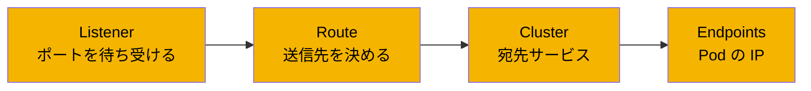
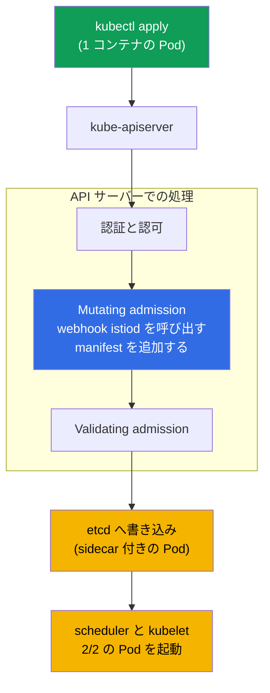
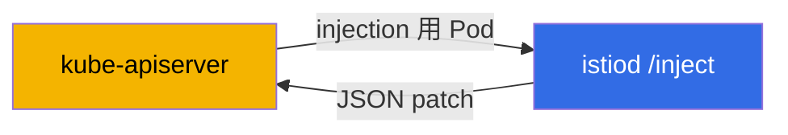
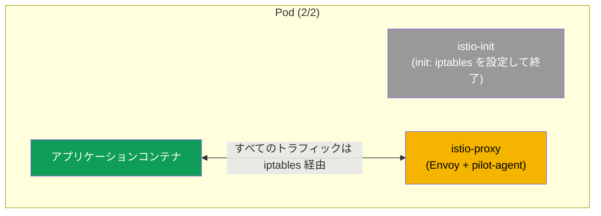

[Русская версия](ru.md) · [Eng version](en.md) · [Versión en español](es.md) · [Version française](fr.md) · [Deutsche Version](de.md) · [ქართული ვერსია](ge.md) · [繁體中文版](tw.md)

# 第4章 Data plane: Envoy と sidecar injection

> **次に進む前に。** Istio には data plane（トラフィックを運ぶプロキシ）と、
> それを管理する control plane（istiod）があることをすでに見てきました。この章では
> data plane を詳しく扱います。Envoy とは何か、その設定は何で構成されるのか、
> istiod からどのように設定を受け取るのか、そしてプロキシが実際にどのように Pod に入るのかを説明します。
> これは、トラフィックとセキュリティを扱う以降のすべての章の土台です。

## 4.1. Envoy - data plane の心臓部

Istio の実際のトラフィックは istiod ではなく Envoy プロキシを通ります。接続を
暗号化し、リクエストを再試行し、ルーティングを適用し、メトリクスを集計するのは Envoy です。
istiod は Envoy に設定を配布するだけです。したがって Istio を理解するには、少なくとも
概念レベルでは Envoy を理解する必要があります。

## 4.2. Envoy とは何か、なぜ Envoy なのか

Envoy は C++ で書かれた高性能な L7 ネットワークプロキシです。数百のマイクロサービス間の
通信を扱うために Lyft 社が 2016 年に開発し、同年にプロジェクトは CNCF へ寄贈され、後に
Kubernetes と同じく graduated ステータスを取得しました。ソースコードとドキュメントは
[envoyproxy.io](https://www.envoyproxy.io/) およびリポジトリ
[envoyproxy/envoy](https://github.com/envoyproxy/envoy) にあります。

Envoy は「汎用 data plane」として設計されました。同じプロキシをサービス横の sidecar、
edge ロードバランサー、API-gateway のいずれにも使用できます。主なアーキテクチャ上の特徴は
次のとおりです。

- **L7 を認識すること。** HTTP/1.1、HTTP/2、HTTP/3、gRPC、および任意の TCP/UDP を理解します。
  ヘッダー、メソッド、パス、レスポンスコード、gRPC ステータスを認識できるため、
  高度なルーティング、コードに基づくリトライ、詳細なメトリクスが可能です。
- **API（xDS）による動的設定。** Envoy のほぼすべての設定は、再起動も接続切断もせずに
  gRPC/REST 経由で動的に変更できます。istiod が利用しているのはまさにこれです（4.4 節）。
  従来型プロキシの大半にはこの機能がありません。設定が静的であり、変更には reload が必要です。
- **フィルタチェーン（filter chains）。** リクエスト処理は、ルーティング、認証、rate limit、
  Lua または Wasm による独自ロジックなど、フィルタのパイプラインです。これが Istio の
  拡張性（EnvoyFilter、WasmPlugin - 第20章）の基盤です。
- **ロックを使わないマルチスレッド。** 各 worker スレッドに個別の event loop を置くモデルにより、
  予測可能なレイテンシで高いスループットを実現します。
- **標準搭載の Observability。** リクエストごとの詳細なメトリクス（Prometheus 形式を含む）、
  トレーシング、access-log を提供します。Pod 内のポート `15000` には admin インターフェイスがあります。
- **Hot restart。** アクティブな接続を切断せずに自らを再起動できます。

「L7 を理解する + API 経由で動的に設定できる + フィルタで拡張できる」という組み合わせにより、
Envoy は service mesh の便利な基盤になりました。そのため Istio は独自プロキシを書かず、
他の大半の mesh と同様に Envoy を採用しました（第1章）。

### Envoy と他のプロキシ

HTTP を受け取り転送できるプロキシは数多くあります。違いは設定の動的性、プロトコル対応、
拡張性にあり、これは service mesh にまさに必要なものです。

| プロキシ | 言語 | 動的設定 | HTTP/2, gRPC | 拡張性 | 得意分野 |
|--------|------|---------------------|--------------|---------------|-----------|
| **Envoy** | C++ | はい、xDS API で動的 | はい（HTTP/3 を含む） | フィルタ、Lua、Wasm | mesh、edge、API-gateway、data plane の事実上の標準 |
| **NGINX** | C | 主に静的（reload、動的機能は NGINX Plus） | はい（gRPC の proxy） | モジュール（ビルド）、Lua（OpenResty） | 従来型の Web サーバーと reverse-proxy |
| **HAProxy** | C | 静的 + Runtime API（部分的） | はい | 限定的（Lua、SPOE） | L4/L7 ロードバランシング、非常に高い性能 |
| **Traefik** | Go | はい、プロバイダー経由（k8s、Docker） | はい | middlewares、プラグイン | Kubernetes/Docker 向けのシンプルな ingress |
| **linkerd2-proxy** | Rust | はい、Linkerd の control plane から | はい | サードパーティー拡張向けには設計されていない | Linkerd の軽量な「マイクロプロキシ」sidecar |

要点は次のとおりです。

- **NGINX / HAProxy** - 成熟して高速ですが、歴史的に設定は静的です。ルートを変更するには
  reload が必要です。数百のサービスと頻繁な変更がある mesh では不便であり、NGINX の完全な
  動的機能は有償の Plus でのみ利用できます。
- **Traefik** - Kubernetes からの自動設定を備えた便利な ingress ですが、汎用的な mesh の
  data plane というより edge プロキシです。
- **linkerd2-proxy** - Linkerd 向けに特化した軽量な Rust プロキシです。Envoy より単純で軽量ですが、
  汎用性は低く、外部フィルタでは拡張できません。
- **Envoy** が優れているのは「速度」そのものではなく、動的な xDS-API、幅広いプロトコル対応、
  拡張性の組み合わせです。そのため Istio、Consul、Kuma、Gloo、AWS App Mesh などがこれを基盤としています。

## 4.3. Envoy の設定は何で構成されるか

診断出力（第23章）を読んで何が起きているかを理解するには、Envoy の基本概念を4つ知る必要があります。
これらは「どこでリクエストを受けるか」から「最終的にどこへ送るか」までの連鎖を形成します。

- **Listener（リスナー）。** Envoy が待ち受けるポートとアドレスです。トラフィックはここに到着します。
- **Route（ルート）。** どの条件（ホスト、パス、ヘッダー）で、どの cluster にリクエストを送るかを定めるルールです。
- **Cluster（クラスター）。** 受信先の論理グループです。本質的にはポリシー（ロードバランシング、
  タイムアウト、mTLS）を備えた「宛先サービス」です。
- **Endpoint（エンドポイント）。** 受信先の具体的なアドレスで、通常は Pod の IP とポートです。



この連鎖を覚えておいてください。listener が受け取り、route が宛先を決め、cluster がポリシーを定め、
endpoint は具体的な Pod です。Istio の設定のほとんどは、最終的に istiod により Envoy 内のこの4つの
エンティティへ変換されます。

## 4.4. Envoy はどこから設定を取得するか: xDS

Envoy 単体は「空」です。listener、route、cluster、endpoint はすべて istiod から送られます。


この設定転送（図の「設定を送信」という矢印）は1つのストリームではなく、複数のチャネルで行われます。
これらを総称して **xDS**（x Discovery Service）と呼びます。個別の名称は診断で目にします。

- **LDS** - Listener Discovery Service（リスナー）。
- **RDS** - Route Discovery Service（ルート）。
- **CDS** - Cluster Discovery Service（クラスター）。
- **EDS** - Endpoint Discovery Service（エンドポイント）。
- **SDS** - Secret Discovery Service（mTLS 用証明書）。

たとえば `VirtualService` を適用すると、istiod は設定を再計算し、xDS を通じて必要なすべての Envoy に
更新を配布します。プロキシはこれを動的に適用します。これにより、ルーティングの変更は Pod を再起動せずに
トラフィックへ反映されます。

## 4.5. sidecar はどのように Pod に入るか: 自動 injection

第2章では namespace に `istio-injection=enabled` ラベルを付け、Pod が `2/2` になることを見ました。
ここでは内部で何が起きているかを説明します。

istiod には **mutating admission webhook** があります。CKA を受験した方なら、この仕組みをご存じでしょう。
admission controller は、オブジェクトが etcd に書き込まれる前、API サーバー側でリクエスト処理に介入します。
Istio の sidecar injector は、まさに Pod 作成時に API サーバーが呼び出す mutating webhook です。

webhook を別途インストールする必要はありません。これは **Istio のインストールとともに** 作成されます。
control plane（第2章の `istioctl install` または第3章の Helm chart `istiod`）をインストールすると、
Istio はクラスタに `MutatingWebhookConfiguration` リソースを作成し、Pod 作成時に istiod を呼び出すよう
API サーバーに指示します。つまり sidecar injector は istiod の一部であり、手動でデプロイする別コンポーネントではありません。
revision インストール（第3章）では、各 revision にそれぞれの istiod に紐付く webhook があります。

変更が **どこで**、**いつ** 起きるかを理解することが重要です。あなたのマシンでも kubelet でもなく、
mutating admission の段階で **API サーバー内** で発生します。アプリケーション自身が injection を開始するのではなく、
API サーバーが webhook を HTTP callback として呼び出して実行します。



処理の流れは次のとおりです。

1. `kubectl apply` を実行すると、リクエストは API サーバーへ送られます。
2. API サーバーは、あなたが誰で、Pod を作成する権限があるかを確認します（認証、認可）。
3. **mutating admission** の段階で、API サーバーは namespace が injection 用にラベル付けされていることを確認し、
   istiod の webhook を呼び出します。webhook は元の manifest を受け取り、sidecar を追記して変更済み manifest を返します。
   変更はまさにここで行われます。
4. 追記済み manifest は validation を通過して etcd に保存されます。データベースに入る時点で Pod にはすでに sidecar があります。
5. その後は通常どおりです。scheduler が node を選び、kubelet が Pod を起動すると、すぐに `2/2` で立ち上がります。

### webhook 自体の仕組み

クラスタ内では次のように確認できます。

```bash
kubectl get mutatingwebhookconfiguration | grep istio
```

`MutatingWebhookConfiguration` 内の重要なフィールドを簡略化すると、以下のとおりです。

```yaml
apiVersion: admissionregistration.k8s.io/v1
kind: MutatingWebhookConfiguration
metadata:
  name: istio-sidecar-injector
webhooks:
- name: sidecar-injector.istio.io
  clientConfig:
    service:
      name: istiod                 # API サーバーが injection のために Pod を送る先
      namespace: istio-system
      path: /inject                # patch を行う istiod の endpoint
  rules:
  - operations: ["CREATE"]         # 作成時のみ
    resources: ["pods"]            # Pod のみ対象
  namespaceSelector:
    matchLabels:
      istio-injection: enabled     # ラベル付き namespace のみ
  failurePolicy: Fail              # istiod が利用不能な場合にどうするか
```

要点は、**このオブジェクト自体は何も変更しない** ことです。API サーバーに対して、
「このような namespace で Pod を作成するとき、このサービスの `/inject` パスを呼び出せ」と指示するだけです。
これは injection ロジックではなく、ルーティングルールです。

manifest を変更するのは **istiod**、つまり `/inject` endpoint です。各部分の役割を順に見ていきます。

- **`MutatingWebhookConfiguration`** - istiod を *いつ*、*誰に対して* 呼び出すかを定義します
  （CREATE 操作、pods リソース、対象の namespaceSelector）。
- **istiod (`/inject`)** - API サーバーから Pod オブジェクト（`AdmissionReview` の形式）を受け取り、
  sidecar テンプレート（`istio-sidecar-injector` ConfigMap にあり、インストール時に指定されます）を取得し、
  追加すべき内容を計算して、**JSON patch** を `AdmissionReview` で返します。
- **API サーバー** - 受け取った patch を元の manifest に適用します。この後に初めて、Pod 内に
  `istio-init`、`istio-proxy`、および volumes が現れます。



つまり、挿入される内容のテンプレートは Istio のインストール時に（ConfigMap で）指定され、
呼び出すかどうかは `MutatingWebhookConfiguration` が決め、具体的な patch は istiod が計算します。
API サーバーは結果を適用するだけです。

第2章の2つのルールを思い出してください。injection が適用されるのは **新しい** Pod だけです（`rules` に
CREATE 操作が指定されているため）。また、ラベルがある場合だけです（これを確認するのは `namespaceSelector` であり、
revision インストールでは `istio.io/rev` です）。すでに実行中の Pod は `rollout restart` で再作成する必要があります。
そうすると、再び admission を通過して sidecar を受け取ります。

### Pod または deployment レベルの injection

injection は namespace だけでなく、特定の workload に対して個別に制御できます。そのために、
値が `"true"` または `"false"` の Pod ラベル `sidecar.istio.io/inject` があります。

重要なのは、このラベルを Deployment オブジェクトではなく **Pod テンプレート** の
`spec.template.metadata.labels` に付けることです。admission webhook を通過するのは Deployment ではなく Pod なので、
Deployment 自体の `metadata` にあるラベルは役割を果たしません。

```yaml
apiVersion: apps/v1
kind: Deployment
metadata:
  name: orders
spec:
  template:
    metadata:
      labels:
        app: orders
        sidecar.istio.io/inject: "true"   # <- Pod テンプレートのラベル、Deployment ではない
    spec:
      containers:
        - name: app
          image: orders:1.0
```

最終的な判断は、namespace の `istio-injection` と Pod の `sidecar.istio.io/inject` という2つのラベルから、
次のロジックで行われます。

1. いずれかのラベルが「無効」（`istio-injection=disabled` または
   `sidecar.istio.io/inject: "false"`）なら、sidecar は injection **されません**。
2. いずれかのラベルが「有効」（`istio-injection=enabled`、`istio.io/rev=<rev>` または
   `sidecar.istio.io/inject: "true"`）なら、sidecar は injection されます。
3. どちらのラベルもない場合、デフォルトでは injection されません（これは設定
   `enableNamespacesByDefault` で制御され、デフォルトでは無効です）。

| namespace `istio-injection` | pod `sidecar.istio.io/inject` | 結果 |
|---|---|---|
| enabled | （なし） | injection される |
| enabled | `"false"` | injection されない |
| enabled | `"true"` | injection される |
| （ラベルなし） | `"true"` | **injection される** |
| （ラベルなし） | （なし） | injection されない |
| disabled | `"true"` | injection されない（`disabled` が優先） |

ここから実用的なシナリオが2つ導かれます。

- namespace 全体に触れず、**1つの deployment だけで sidecar を有効にする**: namespace にラベルを付けず、
  対象 Deployment の Pod テンプレートに `sidecar.istio.io/inject: "true"` を設定します（表の「ラベルなし + true」）。
  sidecar を受け取るのはこの workload だけです。
- ラベル付き namespace から **1つの deployment を除外する**: namespace の `istio-injection=enabled` はそのままにして、
  対象 Deployment の Pod テンプレートに `sidecar.istio.io/inject: "false"` を設定します。

> revision インストール（第3章）では、Pod レベルで「有効」にする役割は `istio.io/rev=<revision>` ラベルが担い、
> 個別に無効化するには同じ `sidecar.istio.io/inject: "false"` を使用します。

## 4.6. Pod に具体的に何が追加されるか

webhook は Pod に次の2つを追加します。

- **init-container `istio-init`。** Pod の開始時に一度実行され、アプリケーションのすべての入出力トラフィックを
  Envoy に転送する iptables ルールを設定します。その後、init-container は終了します。（一部のインストールでは
  init-container の代わりに Istio CNI plugin を使用し、その場合は plugin が iptables を設定しますが、考え方は同じです。）
- **container `istio-proxy`。** これが sidecar です。内部では Envoy と、istiod と通信して証明書を管理する補助プロセス
  pilot-agent が動作します。

### Pod manifest で実際に変更されるもの

injection は「前」と「後」の manifest を比較すると最も理解しやすくなります。Kubernetes に渡すのは、
コンテナが1つの単純な Pod です。

```yaml
# 変更前: あなたの元の Pod
apiVersion: v1
kind: Pod
metadata:
  name: orders
spec:
  containers:
  - name: app
    image: orders:1.0
```

webhook はこの manifest を捕捉し、すでに内容が追加されたバージョンを Kubernetes に返します。

```yaml
# 変更後: injection 後の Pod（簡略化）
apiVersion: v1
kind: Pod
metadata:
  name: orders
  labels:
    security.istio.io/tlsMode: istio          # + mesh 用のラベル
    service.istio.io/canonical-name: orders
  annotations:
    sidecar.istio.io/status: '{...}'          # + injection ステータスの annotation
spec:
  initContainers:
  - name: istio-init                          # + init コンテナ (iptables)
    image: docker.io/istio/proxyv2:1.29.1
  containers:
  - name: app                                 # あなたのコンテナ、変更なし
    image: orders:1.0
  - name: istio-proxy                          # + sidecar 本体 (Envoy)
    image: docker.io/istio/proxyv2:1.29.1
  volumes:                                     # + 証明書と設定用の volumes
  - name: istio-envoy
  - name: istio-data
  - name: istio-token
  - name: istiod-ca-cert
```

つまり webhook は元の manifest に以下を追記します。

- **`spec.initContainers`** - `istio-init` コンテナ（アプリケーション開始前に iptables を設定します）。
- **`spec.containers`** - `istio-proxy` コンテナ（Envoy + pilot-agent）。
- **`spec.volumes`** - Envoy の設定、mTLS 証明書、ServiceAccount token 用の volumes です。これを通じて
  sidecar は identity を取得します。
- **`metadata.labels`** と **`metadata.annotations`** - Pod が mesh 内にあることを Istio が認識し、
  injection ステータスを保持するための内部ラベルと annotation です。

あなた自身の `app` コンテナは変更されません。Pod にそれを取り囲む仕組みが追加されるだけです。



このため、mesh の Pod は `2/2` と表示されます。init-container はこのカウンターに含まれないため、
長期間動作する2つのコンテナ、すなわちアプリケーションと istio-proxy が表示されます。

## 4.7. 手動 injection

webhook による自動 injection が主な方法ですが、webhook が無効な場合や、何が追加されるかを確認したい場合など、
sidecar を手動で injection することもあります。そのために `istioctl kube-inject` があります。

```bash
istioctl kube-inject -f deployment.yaml | kubectl apply -f -
```

このコマンドは manifest を受け取り、init-container と istio-proxy を追記し、その結果を `kubectl apply` に渡します。
結果は自動 injection の場合と同じですが、こちらでは明示的に実行します。

## 4.8. トラフィックは Envoy をどのように通過するか

Envoy レベルでのリクエスト経路をまとめましょう。各プロキシには2種類の listener があります。アプリケーションからの
送信トラフィック用の **outbound** と、アプリケーションに到着するトラフィック用の **inbound** です。


1. アプリケーションがリクエストを送信します。iptables により、そのリクエストはローカル Envoy の outbound listener に到達します。
2. Envoy はルーティングとポリシーを適用し、mTLS でトラフィックを暗号化して、受信 Pod の Envoy の inbound listener へ送信します。
3. 受信側の Envoy はトラフィックを復号し、localhost 経由でアプリケーションに渡します。

これは第1章で描いた経路と同じですが、これで各 Envoy 内に入力と出力それぞれの listener があることが分かります。

## 4.9. Envoy の内部を見る方法

特定のプロキシに実際にどの設定が届いたかを確認する必要があることがあります。そのために `istioctl proxy-config` があり、
選択した Pod の listeners、routes、clusters、endpoints を表示します。

```bash
istioctl proxy-config clusters <pod> -n <namespace>
istioctl proxy-config routes   <pod> -n <namespace>
istioctl proxy-config listeners <pod> -n <namespace>
```

ここでは、このようなツールが存在することだけ覚えておいてください。詳しい使い方は troubleshooting を扱う第23章で説明します。
そこでは、なぜトラフィックが意図しない場所へ流れるのかを理解するための主な手段になります。

## 4.10. sidecar のリソース

sidecar は追加コンテナであり、CPU とメモリを消費します。デフォルトで istio-proxy が要求する量は少ないです
（およそ `100m` CPU と `128Mi` メモリ）が、数千の Pod を持つクラスタでは合計すると無視できません。
sidecar のリソースはグローバルに（インストール設定から）指定することも、Pod の annotation で上書きすることもできます。
data plane のコスト最適化は第18章（sidecar scoping）で、sidecar が存在しない ambient のテーマは第21章で個別に扱います。

## 4.11. 章のまとめ

- mesh のすべてのトラフィックを運ぶのは Envoy であり、istiod はトラフィックに触れずプロキシを設定するだけです。
- Envoy（[envoyproxy.io](https://www.envoyproxy.io/)、CNCF プロジェクト）が Istio に選ばれたのは、
  プロトコル（HTTP/1.1、HTTP/2、HTTP/3、gRPC）の理解、xDS による動的設定、フィルタによる拡張性、
  メトリクスのためです。大半の他の mesh もこれを基盤にしています。
- Envoy の設定は listener、route、cluster、endpoint の連鎖です。
- 設定は xDS（LDS、RDS、CDS、EDS、SDS）を通じて istiod から到着し、動的に適用されます。
- sidecar は、ラベル付き namespace の新しい Pod に istiod の webhook が injection します。
- injection は Deployment の **Pod テンプレート** 上の Pod ラベル `sidecar.istio.io/inject`（`"true"`/
  `"false"`）で個別に制御できます。namespace をラベル付けせずに1つの workload を有効にすることも、
  逆にラベル付き namespace からそれを除外することもできます。
- Pod には init-container `istio-init`（iptables を設定）と container `istio-proxy`（Envoy + pilot-agent）が追加されます。
  これが `2/2` となる理由です。
- 各 Envoy には inbound と outbound の listener があり、Pod 間のトラフィックは mTLS で暗号化されます。
- `istioctl proxy-config` はプロキシの実際の設定を確認するのに役立ちます。

## 4.12. 自己確認の質問

1. istiod がユーザートラフィックの転送に参加しないのはなぜですか？
2. listener - route - cluster - endpoint の連鎖を自分の言葉で説明してください。
3. xDS とは何ですか？ なぜこれにより Pod を再起動せずに変更が反映されるのですか？
4. injection webhook は Pod に何を追加しますか？ init-container はなぜ必要ですか？
5. inbound listener と outbound listener は何が異なりますか？
6. namespace 全体をラベル付けせず、1つの Deployment だけで sidecar injection を有効にするにはどうしますか？
   ラベルはどのオブジェクトのどこに付けますか？

## 演習

injection 専用のラボはありません。ラボ 01 で、Bookinfo の Pod が `2/2` になったとき、すでにその動作を見ています。
そこへ戻り、Pod をより詳しく確認してください。containers
（`kubectl get pod <pod> -o jsonpath='{.spec.containers[*].name}'`）と init-containers を確認し、
そこに `istio-proxy` と `istio-init` を見つけてください。

🧪 ラボ 01: [tasks/ica/labs/01](../../labs/01/README_JP.MD)

---
[目次](../README_JP.md) · [第3章](../03/jp.md) · [第5章](../05/jp.md)
