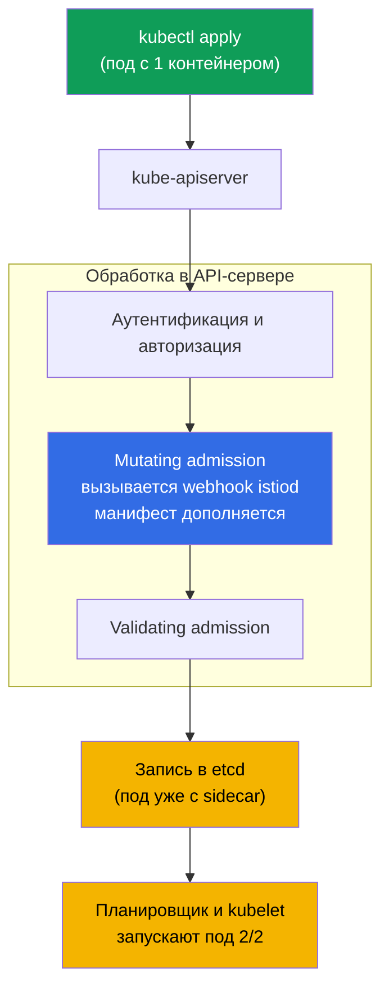
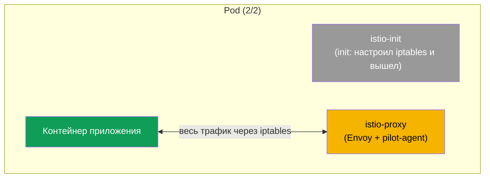
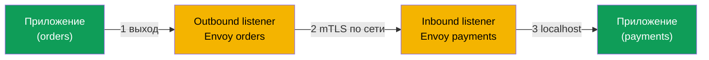

# Глава 4. Data plane: Envoy и sidecar injection

> **Что дальше.** Мы уже видели, что у Istio есть data plane (прокси, которые несут
> трафик) и control plane (istiod, который ими управляет). В этой главе разберём
> data plane подробно: что такое Envoy, из чего состоит его конфигурация, как он
> получает настройки от istiod и как именно прокси попадает в ваш под. Это фундамент,
> на котором держатся все следующие главы про трафик и безопасность.

## 4.1. Envoy - сердце data plane

Весь реальный трафик в Istio идёт не через istiod, а через прокси Envoy. Именно Envoy
шифрует соединения, повторяет запросы, применяет маршрутизацию и считает метрики.
istiod только раздаёт Envoy настройки. Поэтому, чтобы понимать Istio, надо понимать
Envoy хотя бы на уровне идей.

## 4.2. Что такое Envoy и почему именно он

Envoy - это высокопроизводительный сетевой прокси (L7), написанный на C++. Его создали
в Lyft, сейчас это проект CNCF. Istio не написал свой прокси, а взял Envoy, потому что
у него есть три важных свойства:

- **Понимает протоколы приложения.** HTTP/1.1, HTTP/2, gRPC, TCP. Он видит заголовки,
  методы, пути, коды ответов - отсюда все возможности умной маршрутизации.
- **Динамическая конфигурация.** Envoy умеет менять настройки на лету, не
  перезапускаясь. istiod пользуется этим, чтобы обновлять правила без даунтайма.
- **Богатая observability.** Envoy из коробки отдаёт подробные метрики по каждому
  запросу.

Большинство других мешей (мы говорили об этом в главе 1) тоже построены на Envoy - это
фактический стандарт для data plane.

## 4.3. Из чего состоит конфигурация Envoy

Чтобы читать вывод диагностики (глава 23) и понимать, что происходит, надо знать четыре
базовых понятия Envoy. Они выстраиваются в цепочку - от «где принять запрос» до «куда
его в итоге отправить».

- **Listener (слушатель).** Порт и адрес, которые слушает Envoy. Сюда приходит трафик.
- **Route (маршрут).** Правила: по каким условиям (хост, путь, заголовки) и в какой
  кластер направить запрос.
- **Cluster (кластер).** Логическая группа получателей - по сути «сервис назначения» с
  политиками (балансировка, таймауты, mTLS).
- **Endpoint (эндпоинт).** Конкретный адрес получателя, обычно IP пода и порт.


Запомните эту цепочку: listener принял, route решил куда, cluster определил политику,
endpoint это конкретный под. Почти вся конфигурация Istio в конечном счёте
превращается istiod-ом в эти четыре сущности внутри Envoy.

## 4.4. Откуда Envoy берёт конфигурацию: xDS

Сам по себе Envoy «пустой». Все listener, route, cluster и endpoint ему присылает
istiod.


Эта передача конфигурации (та самая стрелка «шлёт конфигурацию» на схеме) идёт не одним
потоком, а по нескольким каналам. Их общее название - **xDS** (x Discovery Service), а
отдельные имена вы встретите в диагностике:

- **LDS** - Listener Discovery Service (слушатели).
- **RDS** - Route Discovery Service (маршруты).
- **CDS** - Cluster Discovery Service (кластеры).
- **EDS** - Endpoint Discovery Service (эндпоинты).
- **SDS** - Secret Discovery Service (сертификаты для mTLS).

Когда вы применяете, например, `VirtualService`, istiod пересчитывает конфигурацию и
по xDS рассылает обновления всем нужным Envoy. Прокси применяют её на лету. Именно
поэтому изменения маршрутизации доезжают до трафика без перезапуска подов.

## 4.5. Как sidecar попадает в под: автоматическая инъекция

В главе 2 мы ставили метку `istio-injection=enabled` на namespace и видели, что поды
становятся `2/2`. Теперь разберём, что происходит под капотом.

У istiod есть **mutating admission webhook**. Если вы сдавали CKA, вы уже знаете этот
механизм: admission-контроллеры вмешиваются в обработку запроса на стороне API-сервера,
до записи объекта в etcd. Sidecar injector Istio - это как раз mutating webhook,
который API-сервер вызывает при создании пода.

Отдельно ставить webhook не нужно: он появляется **вместе с установкой Istio**. Когда
вы ставите control plane (`istioctl install` в главе 2 или Helm-чарт `istiod` в главе
3), Istio создаёт в кластере ресурс `MutatingWebhookConfiguration`, который указывает
API-серверу вызывать istiod при создании подов. То есть sidecar injector это часть
istiod, а не отдельный компонент, который надо разворачивать руками. В ревизионной
установке (глава 3) у каждой ревизии свой webhook, привязанный к своему istiod.

Важно понять, **где** и **когда** происходит модификация: не на вашей машине, не в
kubelet, а внутри **API-сервера**, на этапе mutating admission. Само приложение
инъекцию не запускает - её выполняет API-сервер, вызывая webhook как HTTP-callback.



Последовательность такая:

1. Вы делаете `kubectl apply`, запрос уходит в API-сервер.
2. API-сервер проверяет, кто вы и можно ли вам создавать под (аутентификация,
   авторизация).
3. На этапе **mutating admission** API-сервер видит, что namespace помечен для инъекции,
   и вызывает webhook istiod. Тот получает исходный манифест, дописывает в него sidecar
   и возвращает изменённый манифест. Именно здесь происходит модификация.
4. Дополненный манифест проходит валидацию и сохраняется в etcd - в базу под попадает
   уже с sidecar.
5. Дальше всё как обычно: планировщик выбирает ноду, kubelet запускает под, и он
   поднимается сразу `2/2`.

### Как устроен сам webhook

Посмотреть его в кластере можно так:

```bash
kubectl get mutatingwebhookconfiguration | grep istio
```

Внутри `MutatingWebhookConfiguration` важны несколько полей (упрощённо):

```yaml
apiVersion: admissionregistration.k8s.io/v1
kind: MutatingWebhookConfiguration
metadata:
  name: istio-sidecar-injector
webhooks:
- name: sidecar-injector.istio.io
  clientConfig:
    service:
      name: istiod                 # КУДА API-сервер шлёт под на инъекцию
      namespace: istio-system
      path: /inject                # endpoint istiod, который делает патч
  rules:
  - operations: ["CREATE"]         # только при создании
    resources: ["pods"]            # только для подов
  namespaceSelector:
    matchLabels:
      istio-injection: enabled     # только помеченные namespace
  failurePolicy: Fail              # что делать, если istiod недоступен
```

Ключевой момент: **сам этот объект ничего не модифицирует**. Он только говорит
API-серверу: «при создании пода в таком namespace вызови вот этот сервис по пути
`/inject`». Это правило маршрутизации, а не логика инъекции.

Модификацию манифеста выполняет **istiod** - тот самый endpoint `/inject`. Разберём по
шагам, какая часть за что отвечает:

- **`MutatingWebhookConfiguration`** - определяет, *когда* и *для кого* звать istiod
  (операция CREATE, ресурс pods, нужный namespaceSelector).
- **istiod (`/inject`)** - получает от API-сервера объект пода (в виде `AdmissionReview`),
  берёт шаблон sidecar (он лежит в ConfigMap `istio-sidecar-injector` и задаётся при
  установке), вычисляет, что добавить, и возвращает **JSON-патч** обратно в
  `AdmissionReview`.
- **API-сервер** - применяет полученный патч к исходному манифесту. Именно после этого
  в поде появляются `istio-init`, `istio-proxy` и тома.


То есть шаблон того, что вставляется, задаётся при установке Istio (ConfigMap), решение
о вызове принимает `MutatingWebhookConfiguration`, а конкретный патч считает istiod.
API-сервер лишь применяет результат.

Напомним два правила из главы 2: инъекция срабатывает только на **новые** поды (потому
что в `rules` стоит операция `CREATE`), и только если стоит метка (её проверяет
`namespaceSelector`; в ревизионной установке это `istio.io/rev`). Уже работающие поды
надо пересоздать через `rollout restart` - тогда они заново пройдут через admission и
получат sidecar.

## 4.6. Что именно добавляется в под

Webhook добавляет в под две вещи:

- **init-контейнер `istio-init`.** Запускается один раз при старте пода и настраивает
  правила iptables, которые заворачивают весь входящий и исходящий трафик приложения
  на Envoy. После этого init-контейнер завершается. (В некоторых установках вместо
  init-контейнера используется CNI-плагин Istio, тогда iptables настраивает он, но
  идея та же.)
- **контейнер `istio-proxy`.** Это и есть sidecar: внутри работает Envoy и вспомогательный
  процесс pilot-agent, который общается с istiod и управляет сертификатами.

### Что конкретно меняется в манифесте пода

Проще всего понять инъекцию, если сравнить манифест «до» и «после». Вы отдаёте
Kubernetes простой под с одним контейнером:

```yaml
# БЫЛО: ваш исходный под
apiVersion: v1
kind: Pod
metadata:
  name: orders
spec:
  containers:
  - name: app
    image: orders:1.0
```

Webhook перехватывает этот манифест и возвращает Kubernetes уже дополненную версию:

```yaml
# СТАЛО: под после инъекции (упрощённо)
apiVersion: v1
kind: Pod
metadata:
  name: orders
  labels:
    security.istio.io/tlsMode: istio          # + метки для mesh
    service.istio.io/canonical-name: orders
  annotations:
    sidecar.istio.io/status: '{...}'          # + аннотация о статусе инъекции
spec:
  initContainers:
  - name: istio-init                          # + init-контейнер (iptables)
    image: docker.io/istio/proxyv2:1.29.1
  containers:
  - name: app                                 # ваш контейнер, без изменений
    image: orders:1.0
  - name: istio-proxy                          # + сам sidecar (Envoy)
    image: docker.io/istio/proxyv2:1.29.1
  volumes:                                     # + тома для сертификатов и конфига
  - name: istio-envoy
  - name: istio-data
  - name: istio-token
  - name: istiod-ca-cert
```

Итого webhook дописывает в исходный манифест:

- **`spec.initContainers`** - контейнер `istio-init` (настраивает iptables до старта
  приложения).
- **`spec.containers`** - контейнер `istio-proxy` (Envoy + pilot-agent).
- **`spec.volumes`** - тома для конфигурации Envoy, сертификатов mTLS и токена
  ServiceAccount, через которые sidecar получает identity.
- **`metadata.labels`** и **`metadata.annotations`** - служебные метки и аннотации, по
  которым Istio понимает, что под в mesh, и хранит статус инъекции.

Ваш собственный контейнер `app` при этом не трогается - к поду просто добавляется
обвязка вокруг него.



Вот почему в mesh поды показывают `2/2`: init-контейнеры в этот счётчик не входят,
поэтому видно два «долгоживущих» контейнера - приложение и istio-proxy.

## 4.7. Ручная инъекция

Автоматическая инъекция через webhook - основной способ, но иногда sidecar внедряют
вручную, например когда webhook отключён или нужно посмотреть, что именно
добавляется. Для этого есть `istioctl kube-inject`:

```bash
istioctl kube-inject -f deployment.yaml | kubectl apply -f -
```

Команда берёт ваш манифест, дописывает в него init-контейнер и istio-proxy и отдаёт
результат в `kubectl apply`. Результат тот же, что и при автоматической инъекции,
просто вы делаете это явно.

## 4.8. Как трафик проходит через Envoy

Соберём картину пути запроса на уровне Envoy. У каждого прокси есть два типа
listener: **outbound** (для исходящего трафика приложения) и **inbound** (для трафика,
приходящего к приложению).



1. Приложение делает запрос. Благодаря iptables он попадает на outbound listener
   локального Envoy.
2. Envoy применяет маршрутизацию и политики, шифрует трафик по mTLS и отправляет его на
   inbound listener Envoy пода-получателя.
3. Envoy получателя расшифровывает трафик и отдаёт его приложению по localhost.

Это тот же путь, что мы рисовали в главе 1, только теперь видно, что внутри каждого
Envoy есть отдельные listener для входа и выхода.

## 4.9. Как заглянуть внутрь Envoy

Иногда нужно увидеть, какая конфигурация реально доехала до конкретного прокси. Для
этого есть `istioctl proxy-config`, который показывает listeners, routes, clusters и
endpoints выбранного пода:

```bash
istioctl proxy-config clusters <pod> -n <namespace>
istioctl proxy-config routes   <pod> -n <namespace>
istioctl proxy-config listeners <pod> -n <namespace>
```

Здесь просто запомните, что такой инструмент есть. Подробно им пользоваться будем в
главе 23 про troubleshooting - там это главный способ понять, почему трафик идёт не
туда.

## 4.10. Ресурсы sidecar

Каждый sidecar это дополнительный контейнер, а значит, он потребляет CPU и память.
По умолчанию istio-proxy запрашивает немного (порядка `100m` CPU и `128Mi` памяти), но
в кластере с тысячами подов это суммарно заметно. Ресурсы sidecar можно задавать
глобально (через настройки установки) или переопределять аннотациями на подах.
Оптимизацию затрат data plane мы отдельно затронем в главе 18 (sidecar scoping) и в
теме ambient (глава 21), где сайдкаров нет вовсе.

## 4.11. Итоги главы

- Весь трафик в mesh несёт Envoy; istiod трафик не трогает, только настраивает прокси.
- Envoy выбран Istio за понимание протоколов, динамическую конфигурацию и метрики.
- Конфигурация Envoy это цепочка: listener, route, cluster, endpoint.
- Настройки прилетают от istiod по xDS (LDS, RDS, CDS, EDS, SDS) и применяются на лету.
- Sidecar внедряется webhook-ом istiod в новые поды помеченного namespace.
- В под добавляются init-контейнер `istio-init` (настраивает iptables) и контейнер
  `istio-proxy` (Envoy + pilot-agent); отсюда `2/2`.
- У каждого Envoy есть inbound и outbound listener; трафик между подами шифруется mTLS.
- Посмотреть реальную конфигурацию прокси помогает `istioctl proxy-config`.

## 4.12. Вопросы для самопроверки

1. Почему istiod не участвует в передаче пользовательского трафика?
2. Объясните цепочку listener - route - cluster - endpoint своими словами.
3. Что такое xDS и почему благодаря ему изменения доезжают без перезапуска подов?
4. Что добавляет в под webhook инъекции? Зачем нужен init-контейнер?
5. Чем inbound listener отличается от outbound listener?

## Практика

Отдельной лабы только под инъекцию нет - вы уже видели её в действии в лабе 01, когда
поды Bookinfo стали `2/2`. Вернитесь к ней и посмотрите на под внимательнее:
проверьте контейнеры (`kubectl get pod <pod> -o jsonpath='{.spec.containers[*].name}'`)
и init-контейнеры, найдите там `istio-proxy` и `istio-init`.

🧪 Лаба 01: [tasks/ica/labs/01](../../labs/01/README_RU.MD)

---
[Оглавление](../README.md) · [Глава 3](../03/ru.md) · [Глава 5](../05/ru.md)
