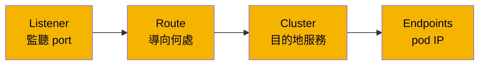
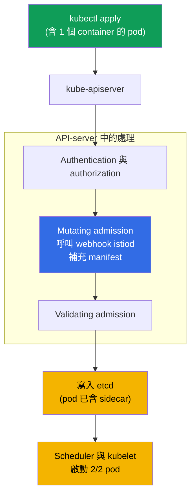
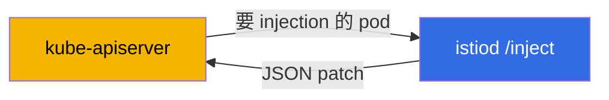
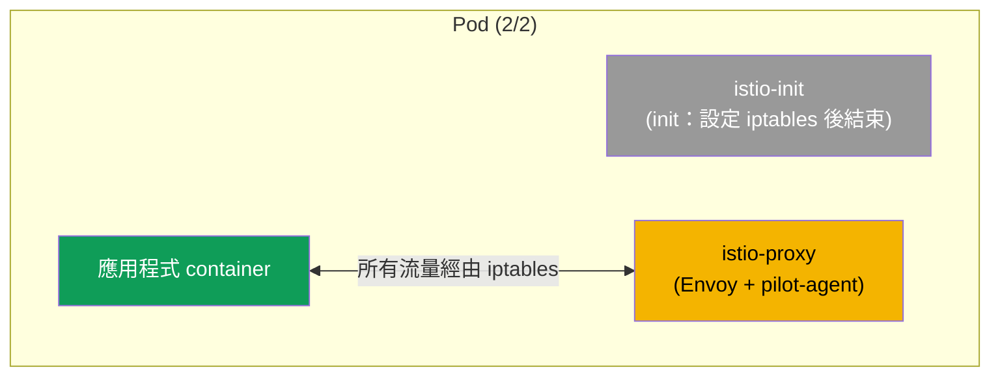
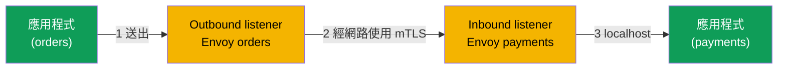

[Русская версия](ru.md) · [Eng version](en.md) · [Versión en español](es.md) · [Version française](fr.md) · [Deutsche Version](de.md) · [ქართული ვერსია](ge.md) · [日本語版](jp.md)

# 第 4 章。Data plane：Envoy 與 sidecar injection

> **接下來。** 我們已經看過 Istio 有 data plane（承載流量的 proxy）與 control plane（管理它們的 istiod）。本章將詳細說明 data plane：Envoy 是什麼、其設定由哪些部分組成、如何從 istiod 取得設定，以及 proxy 究竟如何進入您的 pod。這是後續所有流量與安全性章節所依賴的基礎。

## 4.1. Envoy - data plane 的核心

Istio 中所有實際流量都不會經過 istiod，而是經過 Envoy proxy。正是 Envoy 加密連線、重試請求、套用路由，並計算指標。istiod 只將設定發送給 Envoy。因此，若要理解 Istio，至少必須在概念層面理解 Envoy。

## 4.2. Envoy 是什麼，為何選擇它

Envoy 是以 C++ 撰寫的高效能 L7 網路 proxy。Lyft 公司於 2016 年為解決數百個 microservice 之間的通訊而建立它；同年該專案移交 CNCF，後來獲得 graduated 狀態（與 Kubernetes 同級）。原始碼與文件可見於 [envoyproxy.io](https://www.envoyproxy.io/) 網站和 [envoyproxy/envoy](https://github.com/envoyproxy/envoy) repository。

Envoy 的設計目標是「通用 data plane」：同一個 proxy 既可作為服務旁的 sidecar，也可作為 edge load balancer 和 API gateway。其關鍵架構特點如下：

- **L7 感知。** 可理解 HTTP/1.1、HTTP/2、HTTP/3、gRPC 和任意 TCP/UDP。它能看見 header、method、path、response code 與 gRPC status，因此可進行智慧路由、按狀態碼重試，以及蒐集詳細指標。
- **透過 API (xDS) 動態設定。** 幾乎所有 Envoy 設定都能透過 gRPC/REST 即時變更，無須重新啟動或中斷連線。這正是 istiod 所使用的方式（4.4 節）。多數傳統 proxy 做不到這一點：它們的設定是靜態的，變更需要 reload。
- **Filter chain。** 請求處理是由 filter 組成的 pipeline（路由、認證、rate limit、以 Lua 或 Wasm 實作的自訂邏輯）。這正是 Istio 可擴充性的來源（EnvoyFilter、WasmPlugin - 第 20 章）。
- **無鎖多執行緒。** 每個 worker thread 各有獨立 event loop 的模型，可在延遲可預測的情況下提供高吞吐量。
- **內建 Observability。** 每個請求都有詳細的 metrics（包括 Prometheus format）、tracing 與 access log；pod 內的 `15000` port 提供 admin interface。
- **Hot restart。** 可在不中斷使用中連線的情況下自行重新啟動。

正是「理解 L7 + 可透過 API 動態設定 + 可透過 filter 擴充」的組合，讓 Envoy 成為 service mesh 的便利基礎。因此 Istio 沒有自行撰寫 proxy，而是採用 Envoy - 與大部分其他 mesh 一樣（第 1 章）。

### Envoy 與其他 proxy

許多 proxy 都能接收並轉送 HTTP。差異在於設定的動態性、protocol 支援與可擴充性，也正是 service mesh 所需的特性。

| Proxy | 語言 | 動態設定 | HTTP/2、gRPC | 可擴充性 | 擅長場景 |
|--------|------|---------------------|--------------|---------------|-----------|
| **Envoy** | C++ | 是，xDS API 即時套用 | 是（包括 HTTP/3） | filters、Lua、Wasm | mesh、edge、API-gateway；data plane 的事實標準 |
| **NGINX** | C | 主要為靜態（reload；動態功能在 NGINX Plus） | 是（gRPC proxy） | modules（編譯）、Lua（OpenResty） | 傳統 web server 與 reverse-proxy |
| **HAProxy** | C | 靜態 + Runtime API（部分） | 是 | 有限（Lua、SPOE） | L4/L7 load balancing、極高效能 |
| **Traefik** | Go | 是，來自 providers（k8s、Docker） | 是 | middlewares、plugins | Kubernetes/Docker 的簡易 ingress |
| **linkerd2-proxy** | Rust | 是，來自 Linkerd control plane | 是 | 不設計用於第三方 extensions | Linkerd 中輕量的「microproxy」sidecar |

簡而言之：

- **NGINX / HAProxy** - 成熟且快速，但它們的設定在歷史上是靜態的：若要變更路由，就需要 reload。對有數百個服務且經常變更的 mesh 而言並不方便，而 NGINX 的完整動態功能需要付費（Plus）。
- **Traefik** - 可從 Kubernetes 自動設定的便利 ingress，但它更偏向 edge proxy，而非通用的 mesh data plane。
- **linkerd2-proxy** - 為 Linkerd 專門打造的輕量 Rust proxy：比 Envoy 更簡單、輕量，但通用性較低，且無法以第三方 filter 擴充。
- **Envoy** 勝出的並非單純「速度」，而是動態 xDS API、廣泛 protocol 支援與可擴充性的組合 - 因此 Istio、Consul、Kuma、Gloo、AWS App Mesh 等都建構於其上。

## 4.3. Envoy 設定的組成

為了閱讀診斷輸出（第 23 章）並理解發生的情況，您需要知道 Envoy 的四個基本概念。它們形成一條鏈：從「在哪裡接收請求」到「最終傳送到哪裡」。

- **Listener（監聽器）。** Envoy 監聽的 port 與 address。流量由此進入。
- **Route（路由）。** 規則：根據哪些條件（host、path、header）將請求導向哪個 cluster。
- **Cluster（叢集）。** 接收者的邏輯群組 - 本質上是具備 policies（load balancing、timeout、mTLS）的「目的地服務」。
- **Endpoint（端點）。** 接收者的具體 address，通常是 pod IP 與 port。



請記住這條鏈：listener 接收、route 決定去向、cluster 決定 policy、endpoint 是具體 pod。幾乎所有 Istio 設定最終都由 istiod 轉化為 Envoy 內的這四種實體。

## 4.4. Envoy 從哪裡取得設定：xDS

Envoy 本身是「空的」。所有 listener、route、cluster 和 endpoint 都由 istiod 發送給它。


這項設定傳遞（圖中「發送設定」的箭頭）不是單一 stream，而是經由多個 channel。它們的總稱是 **xDS**（x Discovery Service），而您會在診斷中遇到下列個別名稱：

- **LDS** - Listener Discovery Service（監聽器）。
- **RDS** - Route Discovery Service（路由）。
- **CDS** - Cluster Discovery Service（叢集）。
- **EDS** - Endpoint Discovery Service（端點）。
- **SDS** - Secret Discovery Service（mTLS 的憑證）。

例如，當您套用 `VirtualService` 時，istiod 會重新計算設定，並透過 xDS 將更新發送給所有必要的 Envoy。proxy 即時套用它。因此，路由變更可在不重啟 pod 的情況下到達流量。

## 4.5. sidecar 如何進入 pod：自動 injection

在第 2 章中，我們將 `istio-injection=enabled` label 加到 namespace，並看到 pod 變成 `2/2`。現在來看看底層發生了什麼。

istiod 有一個 **mutating admission webhook**。如果您考過 CKA，您已經認識這個機制：admission controller 會在 API server 端、物件寫入 etcd 前介入請求的處理。Istio 的 sidecar injector 正是一個 API server 在建立 pod 時呼叫的 mutating webhook。

不需要另外安裝 webhook：它會**隨 Istio 安裝一同出現**。當您安裝 control plane（第 2 章的 `istioctl install` 或第 3 章的 Helm chart `istiod`）時，Istio 會在 cluster 中建立 `MutatingWebhookConfiguration` resource，指示 API server 在建立 pod 時呼叫 istiod。換言之，sidecar injector 是 istiod 的一部分，不是必須手動部署的獨立 component。在 revision installation（第 3 章）中，每個 revision 都有連結到其 istiod 的 webhook。

重要的是理解修改發生的**位置**與**時機**：不是在您的機器上，不是在 kubelet，而是在 **API server** 內部的 mutating admission 階段。應用程式本身不會啟動 injection - 它是由 API server 將 webhook 作為 HTTP callback 呼叫而執行。



順序如下：

1. 您執行 `kubectl apply`，請求送往 API server。
2. API server 檢查您的身分，以及您是否可以建立 pod（authentication、authorization）。
3. 在 **mutating admission** 階段，API server 看見 namespace 被標記為需要 injection，並呼叫 istiod webhook。它收到原始 manifest、為其加入 sidecar，並回傳變更後的 manifest。修改就是在此發生。
4. 補充後的 manifest 通過 validation 並儲存至 etcd - 存入資料庫的 pod 已帶有 sidecar。
5. 接著一切照常：scheduler 選擇 node，kubelet 啟動 pod，而它立即以 `2/2` 啟動。

### webhook 本身的運作方式

您可在 cluster 中如此查看它：

```bash
kubectl get mutatingwebhookconfiguration | grep istio
```

`MutatingWebhookConfiguration` 中有幾個重要欄位（簡化如下）：

```yaml
apiVersion: admissionregistration.k8s.io/v1
kind: MutatingWebhookConfiguration
metadata:
  name: istio-sidecar-injector
webhooks:
- name: sidecar-injector.istio.io
  clientConfig:
    service:
      name: istiod                 # API server 將 pod 送往何處進行注入
      namespace: istio-system
      path: /inject                # istiod 執行 patch 的 endpoint
  rules:
  - operations: ["CREATE"]         # 僅在建立時
    resources: ["pods"]            # 僅針對 pod
  namespaceSelector:
    matchLabels:
      istio-injection: enabled     # 僅限已標記的 namespace
  failurePolicy: Fail              # 若 istiod 無法使用時該怎麼做
```

關鍵點：**此物件本身不修改任何內容**。它只告訴 API server：「當在此類 namespace 建立 pod 時，請透過路徑 `/inject` 呼叫這個 service。」這是一條路由規則，不是 injection 邏輯。

修改 manifest 的是 **istiod** - 即 `/inject` endpoint。以下逐步說明各部分負責的工作：

- **`MutatingWebhookConfiguration`** - 決定*何時*以及*為誰*呼叫 istiod（CREATE operation、pods resource、符合的 namespaceSelector）。
- **istiod (`/inject`)** - 從 API server 接收 pod 物件（以 `AdmissionReview` 形式），取得 sidecar template（位於 ConfigMap `istio-sidecar-injector`，並在安裝時設定），計算要新增的內容，然後在 `AdmissionReview` 中回傳 **JSON patch**。
- **API server** - 將收到的 patch 套用至原始 manifest。之後 pod 中才會出現 `istio-init`、`istio-proxy` 與 volumes。



也就是說，插入內容的 template 由 Istio 安裝時設定（ConfigMap），是否呼叫的決定由 `MutatingWebhookConfiguration` 做出，而具體 patch 由 istiod 計算。API server 只套用結果。

重申第 2 章的兩項規則：injection 僅會套用至**新的** pod（因為 `rules` 指定的是 `CREATE` operation），且僅在有 label 時套用（由 `namespaceSelector` 檢查；revision installation 中則為 `istio.io/rev`）。已運行的 pod 必須透過 `rollout restart` 重新建立 - 屆時它們會再次通過 admission 並取得 sidecar。

### 在 pod 或 deployment 層級 injection

除了 namespace 外，您也可精確控制特定 workload 的 injection。為此可使用值為 `"true"` 或 `"false"` 的 pod label `sidecar.istio.io/inject`。

重要的是，label 不應加在 Deployment 物件本身，而應加在 **pod template** - `spec.template.metadata.labels`。通過 admission webhook 的是 pod，而不是 Deployment，因此 Deployment 自身 `metadata` 上的 label 不會起作用。

```yaml
apiVersion: apps/v1
kind: Deployment
metadata:
  name: orders
spec:
  template:
    metadata:
      labels:
        app: orders
        sidecar.istio.io/inject: "true"   # <- 標籤加在 pod template 上，而非 Deployment
    spec:
      containers:
        - name: app
          image: orders:1.0
```

最終決定會根據兩個 label 計算 - namespace 上的 (`istio-injection`) 和 pod 上的 (`sidecar.istio.io/inject`) - 邏輯如下：

1. 若任一 label 設為「停用」（`istio-injection=disabled` 或 `sidecar.istio.io/inject: "false"`），sidecar **不會**注入。
2. 若任一 label 設為「啟用」（`istio-injection=enabled`、`istio.io/rev=<rev>` 或 `sidecar.istio.io/inject: "true"`），就會注入 sidecar。
3. 若兩者皆未設定，預設不注入（由預設停用的 `enableNamespacesByDefault` 設定控制）。

| namespace `istio-injection` | pod `sidecar.istio.io/inject` | 結果 |
|---|---|---|
| enabled | （沒有） | 注入 |
| enabled | `"false"` | 不注入 |
| enabled | `"true"` | 注入 |
| （沒有 label） | `"true"` | **注入** |
| （沒有 label） | （沒有） | 不注入 |
| disabled | `"true"` | 不注入（`disabled` 優先） |

由此可得兩個實用情境：

- **僅為一個 deployment 啟用 sidecar**，而不影響整個 namespace：不要為 namespace 設定 label，而是在所需 Deployment 的 pod template 上設定 `sidecar.istio.io/inject: "true"`（表格中的「沒有 label + true」列）。只有這個 workload 會取得 sidecar。
- 從已標記 namespace 的 injection 中**排除一個 deployment**：保留 namespace 上的 `istio-injection=enabled`，但在該 Deployment 的 pod template 上設定 `sidecar.istio.io/inject: "false"`。

> 在 revision installation（第 3 章）中，pod 層級的「啟用開關」角色由 `istio.io/rev=<revision>` label 擔任，而精確停用仍使用相同的 `sidecar.istio.io/inject: "false"`。

## 4.6. pod 中究竟新增了什麼

webhook 會在 pod 中加入兩項內容：

- **init-container `istio-init`。** 在 pod 啟動時執行一次，設定 iptables rules，將所有應用程式的 ingress 與 egress 流量導向 Envoy。之後 init-container 結束。（在部分安裝中，會使用 Istio CNI plugin 取代 init-container，此時由它設定 iptables，但概念相同。）
- **container `istio-proxy`。** 這就是 sidecar：其中運行 Envoy 與輔助的 pilot-agent process；它與 istiod 通訊並管理憑證。

### pod manifest 具體如何變更

比較「前」與「後」的 manifest，是理解 injection 最簡單的方式。您向 Kubernetes 提交一個只有一個 container 的簡單 pod：

```yaml
# 之前：您的原始 pod
apiVersion: v1
kind: Pod
metadata:
  name: orders
spec:
  containers:
  - name: app
    image: orders:1.0
```

webhook 攔截此 manifest，並向 Kubernetes 回傳已補充的版本：

```yaml
# 之後：注入後的 pod（簡化）
apiVersion: v1
kind: Pod
metadata:
  name: orders
  labels:
    security.istio.io/tlsMode: istio          # + mesh 用的 label
    service.istio.io/canonical-name: orders
  annotations:
    sidecar.istio.io/status: '{...}'          # + 注入狀態的 annotation
spec:
  initContainers:
  - name: istio-init                          # + init container（iptables）
    image: docker.io/istio/proxyv2:1.29.1
  containers:
  - name: app                                 # 您的 container，未變更
    image: orders:1.0
  - name: istio-proxy                          # + sidecar 本身（Envoy）
    image: docker.io/istio/proxyv2:1.29.1
  volumes:                                     # + 用於憑證與設定的 volume
  - name: istio-envoy
  - name: istio-data
  - name: istio-token
  - name: istiod-ca-cert
```

因此，webhook 會向原始 manifest 加入：

- **`spec.initContainers`** - `istio-init` container（在應用程式啟動前設定 iptables）。
- **`spec.containers`** - `istio-proxy` container（Envoy + pilot-agent）。
- **`spec.volumes`** - 儲存 Envoy configuration、mTLS certificates 與 ServiceAccount token 的 volumes，sidecar 藉此取得 identity。
- **`metadata.labels`** 和 **`metadata.annotations`** - service labels 與 annotations，Istio 透過它們知道 pod 位於 mesh 中，並保存 injection status。

您自己的 `app` container 不會被修改 - 只是為 pod 加上環繞它的支援層。



這就是為何 mesh 中的 pod 顯示 `2/2`：init-container 不列入此計數器，因此顯示兩個「長時間運行」的 container - 應用程式與 istio-proxy。

## 4.7. 手動 injection

透過 webhook 的自動 injection 是主要方式，但有時會手動注入 sidecar，例如 webhook 已停用，或需要查看究竟新增哪些內容。可為此使用 `istioctl kube-inject`：

```bash
istioctl kube-inject -f deployment.yaml | kubectl apply -f -
```

此命令取得您的 manifest，加入 init-container 與 istio-proxy，再將結果交給 `kubectl apply`。結果與自動 injection 相同，只是由您明確執行。

## 4.8. 流量如何經過 Envoy

讓我們在 Envoy 層級統整請求路徑。每個 proxy 有兩種 listener：**outbound**（應用程式的 egress 流量）與 **inbound**（傳入應用程式的流量）。



1. 應用程式發出請求。由於 iptables，它到達本機 Envoy 的 outbound listener。
2. Envoy 套用路由與 policy，透過 mTLS 加密流量，並將它送往接收端 pod 的 Envoy inbound listener。
3. 接收端 Envoy 解密流量，並透過 localhost 交給應用程式。

這與我們在第 1 章繪製的路徑相同，只是現在可以看到每個 Envoy 內都有獨立的 inbound 與 outbound listener。

## 4.9. 如何查看 Envoy 內部

有時需要查看實際已送達特定 proxy 的 configuration。為此可使用 `istioctl proxy-config`，它會顯示所選 pod 的 listeners、routes、clusters 與 endpoints：

```bash
istioctl proxy-config clusters <pod> -n <namespace>
istioctl proxy-config routes   <pod> -n <namespace>
istioctl proxy-config listeners <pod> -n <namespace>
```

目前只需記住有這個工具。第 23 章 troubleshooting 會詳細說明如何使用它 - 屆時它是了解流量為何前往錯誤目的地的主要方法。

## 4.10. sidecar 資源

每個 sidecar 都是一個額外 container，因此會消耗 CPU 與 memory。預設的 istio-proxy 請求不多（約 `100m` CPU 與 `128Mi` memory），但在有數千個 pod 的 cluster 中，總計十分可觀。sidecar 資源可全域設定（透過 installation settings），或以 pod annotations 覆寫。我們將在第 18 章（sidecar scoping）和 ambient 主題（第 21 章，完全沒有 sidecar）中另外討論 data plane 的成本最佳化。

## 4.11. 本章總結

- mesh 中所有流量由 Envoy 承載；istiod 不接觸流量，只設定 proxy。
- Istio 選擇 Envoy（[envoyproxy.io](https://www.envoyproxy.io/)，CNCF 專案）是因為它理解 protocols（HTTP/1.1、HTTP/2、HTTP/3、gRPC）、可透過 xDS 動態設定、能由 filters 擴充並具備 metrics；多數其他 mesh 也建構於其上。
- Envoy configuration 是一條鏈：listener、route、cluster、endpoint。
- 設定由 istiod 經 xDS（LDS、RDS、CDS、EDS、SDS）送達，並即時套用。
- sidecar 由 istiod webhook 注入已標記 namespace 中的新 pod。
- 可在 Deployment 的 **pod template** 上以 pod label `sidecar.istio.io/inject`（`"true"`/`"false"`）精確控制 injection：在沒有 namespace label 的情況下啟用一個 workload，或反過來將它排除於已標記的 namespace 外。
- pod 中新增 init-container `istio-init`（設定 iptables）與 `istio-proxy` container（Envoy + pilot-agent）；這就是 `2/2` 的原因。
- 每個 Envoy 都有 inbound 與 outbound listener；pod 間流量以 mTLS 加密。
- `istioctl proxy-config` 有助於查看 proxy 的實際 configuration。

## 4.12. 自我檢查問題

1. 為何 istiod 不參與使用者流量的傳輸？
2. 請用自己的話說明 listener - route - cluster - endpoint 鏈。
3. xDS 是什麼？為何它讓變更可在不重啟 pod 的情況下送達？
4. injection webhook 為 pod 新增什麼？init-container 有何作用？
5. inbound listener 與 outbound listener 有何不同？
6. 如何只為一個 Deployment 啟用 sidecar injection，而不標記整個 namespace？label 要加在哪個物件的何處？

## 實作練習

沒有只針對 injection 的獨立 lab - 您已在 lab 01 中看過它的運作，當時 Bookinfo pod 變成 `2/2`。請回去仔細檢視 pod：檢查 containers（`kubectl get pod <pod> -o jsonpath='{.spec.containers[*].name}'`）與 init-containers，在其中找到 `istio-proxy` 和 `istio-init`。

🧪 Lab 01: [tasks/ica/labs/01](../../labs/01/README_TW.MD)

---
[目錄](../README_TW.md) · [第 3 章](../03/tw.md) · [第 5 章](../05/tw.md)
