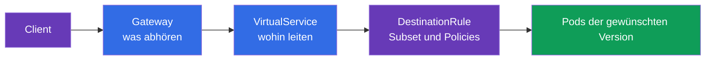
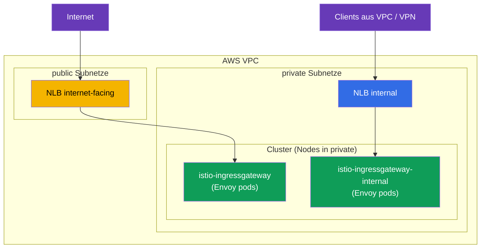
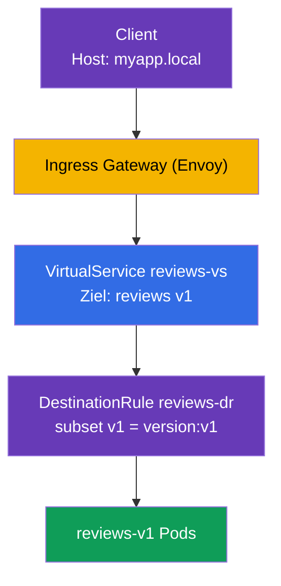

[RU version](ru.md) · [Eng version](en.md) · [Versión en español](es.md) · [Version française](fr.md)

# Kapitel 5. Traffic-Management: Gateway, VirtualService, DestinationRule

> **Was kommt als Nächstes.** Wir haben Istio installiert und die data plane verstanden.
> Jetzt beginnt das Spannendste und das größte Thema der ICA-Prüfung - das
> Traffic-Management (etwa 40 % der Prüfung). In diesem Kapitel behandeln wir die drei
> wichtigsten Routing-Ressourcen: Gateway, VirtualService und DestinationRule. Auf ihnen
> bauen alle folgenden Kapitel über Canary, Mirroring, Resilienz und Egress auf.

## 5.1. Die drei Säulen des Traffic-Managements

In Kubernetes gab es `Ingress` für eingehenden Datenverkehr und `Service` für die
Lastverteilung. In Istio ist das Routing flexibler und auf einzelne Ressourcen aufgeteilt,
von denen jede für ihren eigenen Teil zuständig ist.

| Ressource | Zuständig für | Analogie |
|--------|-------------|----------|
| **Gateway** | was an der Mesh-Grenze abgehört wird (Port, Protokoll, Host) | Eingang in den Cluster, wie `Ingress` |
| **VirtualService** | wohin und nach welchen Regeln der Datenverkehr geleitet wird | Routing-Tabelle |
| **DestinationRule** | was mit dem Datenverkehr beim Empfänger geschieht (Subsets, Policies) | Einstellungen für den Zieldienst |

Es gibt außerdem `ServiceEntry` (Registrierung externer Dienste) - das behandeln wir in
Kapitel 11 über Egress. Vorerst konzentrieren wir uns auf diese drei.

Die Logik ist einfach: Das **Gateway** hat den Datenverkehr an der Grenze angenommen, der
**VirtualService** hat entschieden, wohin er geht, und die **DestinationRule** hat
beschrieben, wie mit dem Empfänger umzugehen ist.



## 5.2. Gateway: der Einstiegspunkt

Das `Gateway` konfiguriert Envoy an der Mesh-Grenze (ingress gateway) - es teilt ihm mit,
welchen Port und welches Protokoll es abhören und für welche Hosts es Anfragen annehmen
soll. Das Gateway selbst leitet keinen Datenverkehr irgendwohin, es öffnet nur die „Tür“.

```yaml
apiVersion: networking.istio.io/v1
kind: Gateway
metadata:
  name: main-gateway
spec:
  selector:
    istio: ingressgateway   # auf welchen Envoy-Pod anwenden (ingress gateway)
  servers:
  - port:
      number: 80
      name: http
      protocol: HTTP
    hosts:
    - "myapp.local"         # nur Anfragen für diesen Host annehmen
```

Sehen wir uns die Felder an:

- **`selector`** - wählt aus, auf welches Envoy-Gateway diese Konfiguration angewendet
  wird. Das Label `istio: ingressgateway` entspricht dem Pod `istio-ingressgateway` aus
  Kapitel 2.
- **`servers`** - was abgehört wird: Port `80`, Protokoll `HTTP`.
- **`hosts`** - für welche Hosts Anfragen angenommen werden. Eine Anfrage mit einem
  anderen `Host` wird abgelehnt. Soll alles angenommen werden, setzt man
  `hosts: ["*"]`.

Wichtig zu verstehen: Das Gateway öffnet nur den Port und sagt „ich bin bereit, Datenverkehr
für myapp.local anzunehmen“. Wohin er anschließend geleitet wird, entscheidet der
VirtualService.

### Mehrere ingress gateways: Trennung des Datenverkehrs

Der `selector` im Gateway gibt an, auf welches Envoy-Gateway die Regeln angewendet werden.
Standardmäßig ist das ein einzelnes Gateway `istio-ingressgateway` (Label
`istio: ingressgateway`). Es kann aber **mehrere** Gateways geben: Sie rollen zusätzliche
ingress gateways aus - das sind separate Envoy-Deployments mit eigenen Labels und eigenem
Kubernetes Service - und leiten unterschiedlichen Datenverkehr auf unterschiedliche
Gateways, indem Sie das gewünschte Label im `selector` angeben.

Wozu das nötig ist:

- **Öffentlichen und internen Datenverkehr trennen.** Ein Gateway schaut ins Internet, ein
  anderes nur ins interne Netz; sie überschneiden sich nicht.
- **Isolation von Teams/Mandanten.** Jedes Team hat sein eigenes Gateway mit eigenen Limits
  und Zertifikaten.
- **Unterschiedliche Anforderungen.** Ein separates Gateway für gRPC/TCP, für einen anderen
  Satz TLS-Zertifikate oder für eigenes Skalieren.

Ein zweites Gateway kann man über IstioOperator ausrollen, indem man ein weiteres ingress
gateway mit eigenem Namen und Label hinzufügt:

```yaml
apiVersion: install.istio.io/v1alpha1
kind: IstioOperator
spec:
  components:
    ingressGateways:
    - name: istio-ingressgateway          # öffentlich (Standard)
      enabled: true
    - name: istio-ingressgateway-internal # zusätzlich, intern
      enabled: true
      label:
        istio: ingressgateway-internal    # eigenes Label für selector
```

Jeder Eintrag in `ingressGateways` ist ein eigenständiges Gateway. Bei `istioctl install`
erstellt Istio dafür im namespace `istio-system` einen vollständigen Satz von Objekten:

- **Deployment** mit Envoy-Pods (Name = `name`, hier `istio-ingressgateway-internal`);
- **Service** gleichen Namens - über ihn gelangt der Datenverkehr zu diesen Pods (der Typ
  stammt aus `k8s.service.type`, standardmäßig `LoadBalancer`);
- **ServiceAccount**, HPA/PodDisruptionBudget usw.

Das Label aus `label` (`istio: ingressgateway-internal`) wird auf die Pods des Deployments
gesetzt - genau darüber findet das Gateway per `selector` das gewünschte Gateway. Dass das
Gateway erstellt wurde, lässt sich so prüfen:

```bash
kubectl -n istio-system get deploy,svc,pod -l istio=ingressgateway-internal
```

```
NAME                                             READY   UP-TO-DATE   AVAILABLE
deployment.apps/istio-ingressgateway-internal    1/1     1            1

NAME                                    TYPE           CLUSTER-IP     EXTERNAL-IP      PORT(S)
service/istio-ingressgateway-internal   LoadBalancer   10.100.5.6     <lb-address>     80:31234/TCP

NAME                                                 READY   STATUS
pod/istio-ingressgateway-internal-6c9f4b8d7-xk2mn    1/1     Running
```

Ein „Gateway“ ist also ein Paar aus **Deployment (Envoy-Pods) + Service**. Hat der Service
den Typ `LoadBalancer`, erstellt die Cloud (in unserem Fall AWS) dafür einen Load Balancer
und trägt dessen Adresse in `EXTERNAL-IP` ein.

Jetzt kann man im Gateway auswählen, welches Gateway einen bestimmten Host abhört:

```yaml
# öffentliche Anwendung — über das externe Gateway
apiVersion: networking.istio.io/v1
kind: Gateway
metadata:
  name: public-gateway
spec:
  selector:
    istio: ingressgateway            # externes Gateway
  servers:
  - port: { number: 80, name: http, protocol: HTTP }
    hosts: ["shop.example.com"]
---
# interne Anwendung — über das interne Gateway
apiVersion: networking.istio.io/v1
kind: Gateway
metadata:
  name: internal-gateway
spec:
  selector:
    istio: ingressgateway-internal   # internes Gateway
  servers:
  - port: { number: 80, name: http, protocol: HTTP }
    hosts: ["admin.internal"]
```

So bedient ein einzelner Cluster sowohl öffentlichen als auch internen Datenverkehr über
verschiedene „Türen“, und der VirtualService wird über das Feld `gateways` an das gewünschte
Gateway gebunden.

### Beispiel für AWS VPC: public und private Subnetze

Eine typische AWS VPC besteht aus zwei Arten von Subnetzen:

- **public** - haben eine Route zum Internet Gateway, die Ressourcen darin sind aus dem
  Internet erreichbar;
- **private** - ohne direkte Route ins Internet, nur innerhalb der VPC erreichbar (und über
  VPN/Direct Connect).

Ein AWS-Load-Balancer wird **in Subnetzen** erstellt, und davon, in welchen Subnetzen er
liegt, hängt ab, ob er öffentlich oder intern ist:

- `scheme: internet-facing` → der Load Balancer wird in **public**-Subnetzen platziert und
  erhält eine öffentliche Adresse;
- `scheme: internal` → der Load Balancer wird in **private**-Subnetzen platziert und löst
  nur in private IPs auf (aus dem Internet nicht erreichbar).

Für das Erstellen der Load Balancer ist der [AWS Load Balancer
Controller](https://kubernetes-sigs.github.io/aws-load-balancer-controller/) zuständig. Die
benötigten Subnetze findet er anhand von Tags (die üblicherweise der Cluster-Installer
setzt, zum Beispiel `eksctl`):

- public: Tag `kubernetes.io/role/elb = 1`;
- private: Tag `kubernetes.io/role/internal-elb = 1`;
- plus `kubernetes.io/cluster/<cluster-name> = owned` (oder `shared`).

Sind die Subnetze nicht getaggt oder müssen sie explizit ausgewählt werden, gibt man die
Subnetze über die Annotation `service.beta.kubernetes.io/aws-load-balancer-subnets` an.

Wir rollen zwei Gateways aus - ein Internet-Gateway in public-Subnetzen und ein internes in
private:

```yaml
apiVersion: install.istio.io/v1alpha1
kind: IstioOperator
spec:
  components:
    ingressGateways:
    # 1) Internet-Gateway: öffentlicher NLB in PUBLIC-Subnetzen
    - name: istio-ingressgateway
      enabled: true
      # Standard-Label istio: ingressgateway
      k8s:
        service:
          type: LoadBalancer
        serviceAnnotations:
          service.beta.kubernetes.io/aws-load-balancer-type: external
          service.beta.kubernetes.io/aws-load-balancer-nlb-target-type: ip
          service.beta.kubernetes.io/aws-load-balancer-scheme: internet-facing
          # Subnetze können explizit statt über Tags angegeben werden:
          # service.beta.kubernetes.io/aws-load-balancer-subnets: subnet-pub-a,subnet-pub-b
    # 2) internes Gateway: privater NLB in PRIVATE-Subnetzen
    - name: istio-ingressgateway-internal
      enabled: true
      label:
        istio: ingressgateway-internal
      k8s:
        service:
          type: LoadBalancer
        serviceAnnotations:
          service.beta.kubernetes.io/aws-load-balancer-type: external
          service.beta.kubernetes.io/aws-load-balancer-nlb-target-type: ip
          service.beta.kubernetes.io/aws-load-balancer-scheme: internal
          # service.beta.kubernetes.io/aws-load-balancer-subnets: subnet-priv-a,subnet-priv-b
```

Was die Annotationen bedeuten:

- **`aws-load-balancer-type`** - wählt aus, **welcher Controller** den Load Balancer
  provisioniert (nicht „ALB oder NLB“). Der Wert `external` = moderner [AWS Load Balancer
  Controller](https://kubernetes-sigs.github.io/aws-load-balancer-controller/), und für die
  Ressource **Service** erstellt er immer einen **NLB** (Network Load Balancer, L4).
  Mögliche Werte: `external` (AWS LBC → NLB), veraltet `nlb-ip` (derselbe AWS LBC mit
  IP-Targets), `nlb` (in-tree-Controller → NLB). Setzt man die Annotation gar nicht, greift
  der eingebaute in-tree-Controller und erstellt einen veralteten **Classic Load Balancer
  (CLB)** - deshalb muss man den Typ angeben. Den Wert `alb` gibt es bei dieser Annotation
  **nicht**: Ein ALB wird nicht aus einem Service, sondern aus der Ressource `Ingress`
  erstellt (siehe unten). Nicht zu verwechseln mit **ELB** (*Elastic Load Balancing*) - das
  ist der Sammelname des AWS-Dienstes, zu dem CLB, ALB und NLB gehören, und kein eigener
  Load-Balancer-Typ.
- **`aws-load-balancer-nlb-target-type`** - wohin der Datenverkehr geht: `ip` (direkt an die
  IPs der Pods über das VPC CNI) oder `instance` (an den NodePort der Nodes). `ip` ist
  effizienter und bewahrt die ursprüngliche Client-IP.
- **`aws-load-balancer-scheme`** - `internet-facing` (public-Subnetze, öffentliche Adresse)
  oder `internal` (private-Subnetze, nur aus der VPC).

Das Wichtigste zu den AWS-Load-Balancer-Typen in Kubernetes: **Der Typ des Load Balancers
wird durch den Typ der Kubernetes-Ressource bestimmt, nicht durch den Wert der Annotation.**

- **Service (Typ `LoadBalancer`) → NLB (L4).** Genau das ist der Fall des ingress gateways:
  Der NLB reicht einfach TCP durch, und Routing, TLS und mTLS macht Istio selbst. Ein ALB
  lässt sich aus einem Service nicht erstellen.
- **Ingress → ALB (L7).** Ein ALB wird nur aus der Ressource `Ingress` provisioniert (Klasse
  `ingressClassName: alb` und Annotationen `alb.ingress.kubernetes.io/*`), mit einem Service
  hat das nichts zu tun. Ein ALB wird manchmal vor Istio gestellt, aber dann terminiert er
  selbst HTTPS und ein Teil der L7-Logik verlässt das Mesh; für ein „sauberes“
  Istio-Ingress nimmt man üblicherweise einen NLB. Mehr zu dieser Wahl in den Kapiteln über
  die Produktions-Installation auf EKS.



Ergebnis:

- Der Service `istio-ingressgateway` erhält einen öffentlichen NLB (in `EXTERNAL-IP` ein
  öffentlicher DNS-Name `*.elb.amazonaws.com`, der in öffentliche IPs auflöst). Über ihn
  stellen wir öffentliche Anwendungen bereit (`shop.example.com`).
- Der Service `istio-ingressgateway-internal` erhält einen **internen** NLB (die Adresse
  löst nur in private IPs der VPC auf). Über ihn laufen interne/administrative Dienste
  (`admin.internal`) - aus dem Internet sind sie grundsätzlich nicht erreichbar, weil ihr
  Gateway keine öffentliche Adresse hat.

Die Envoy-Pods beider Gateways leben dabei üblicherweise auf Nodes in private-Subnetzen -
ins Internet „schaut“ nur der öffentliche NLB, nicht die Pods selbst.

### ACM-TLS-Zertifikat direkt am NLB

Das Zertifikat für eingehendes HTTPS muss nicht in Istio geladen werden - man kann ein
fertiges Zertifikat aus dem **AWS Certificate Manager (ACM)** direkt am NLB anbringen. Dann
wird TLS am Load Balancer terminiert, und ACM verlängert das Zertifikat selbst. Es genügt,
Annotationen zum Service des Gateways hinzuzufügen:

```yaml
        serviceAnnotations:
          service.beta.kubernetes.io/aws-load-balancer-type: external
          service.beta.kubernetes.io/aws-load-balancer-scheme: internet-facing
          # ACM-Zertifikat und Port(s), an denen der NLB TLS terminiert
          service.beta.kubernetes.io/aws-load-balancer-ssl-cert: arn:aws:acm:eu-central-1:123456789012:certificate/xxxxxxxx-xxxx-xxxx
          service.beta.kubernetes.io/aws-load-balancer-ssl-ports: "443"
```

- `aws-load-balancer-ssl-cert` - ARN des Zertifikats aus ACM.
- `aws-load-balancer-ssl-ports` - an welchen Ports der NLB TLS abhört (üblicherweise `443`);
  die übrigen Ports (zum Beispiel `80`) bleiben normales TCP.

Ein wichtiger Punkt - **wo** TLS terminiert wird:

- **TLS am NLB (Offload).** Der NLB entschlüsselt den Datenverkehr mit dem ACM-Zertifikat,
  und weiter über die VPC bis zum Gateway läuft bereits entschlüsselter Datenverkehr.
  Vorteil: Das Zertifikat verwaltet AWS (automatische Verlängerung), in Istio muss man es
  nicht laden. Nachteil: Zwischen NLB und Gateway ist der Datenverkehr durch dieses
  Zertifikat nicht geschützt (nur innerhalb der VPC), und Istio „sieht“ das ursprüngliche
  TLS nicht.
- **Passthrough + TLS in Istio.** Alternative: Der NLB reicht einfach TCP durch (ohne
  `ssl-cert`), das Zertifikat wird in Istio abgelegt, und TLS (oder mTLS) terminiert dann
  das ingress gateway. Diese Variante mit `Gateway` in den Modi
  `SIMPLE`/`MUTUAL`/`PASSTHROUGH` behandeln wir in Kapitel 9.

Kurz gesagt: Wollen Sie die Zertifikatsverwaltung an AWS abgeben und TLS am Rand
terminieren - bringen Sie das ACM-Zertifikat per Annotationen am NLB an; brauchen Sie
durchgängiges TLS/mTLS bis ins Mesh - terminieren Sie in Istio (Kapitel 9).

## 5.3. VirtualService: Routing-Regeln

Der `VirtualService` ist die zentrale Routing-Ressource. Er beschreibt, wie der Datenverkehr
zu einem konkreten Dienst gelangt: über welchen Host, unter welchen Bedingungen und zu
welchem Empfänger er geleitet wird.

```yaml
apiVersion: networking.istio.io/v1
kind: VirtualService
metadata:
  name: reviews-vs
spec:
  hosts:
  - "myapp.local"      # für welchen Host die Regeln gelten
  gateways:
  - main-gateway       # über welches Gateway der Datenverkehr kam
  http:
  - route:
    - destination:
        host: reviews  # Kubernetes Service als Ziel
        subset: v1     # welche Gruppe von Pods (in DestinationRule beschrieben)
```

Wichtige Felder:

- **`hosts`** - für welchen Host die Regeln gelten. Das kann ein externer Host (wie
  `myapp.local`) oder der Name eines internen Dienstes sein.
- **`gateways`** - woher der Datenverkehr kam. Hier bedeutet `main-gateway` „Datenverkehr von
  außen, über unser Ingress“. Es gibt den besonderen Wert `mesh` für clusterinternen
  Datenverkehr - dazu Abschnitt 5.6.
- **`http`** - Liste von Routing-Regeln, sie werden von oben nach unten abgearbeitet, die
  erste passende greift.
- **`destination.host`** - Name des Kubernetes Service, an den der Datenverkehr geleitet wird.
- **`destination.subset`** - konkrete Gruppe von Pods innerhalb des Dienstes (zum Beispiel nur
  Version v1). Diese Subsets werden in der DestinationRule beschrieben.

Der VirtualService kann noch viel mehr: Routing nach Headern, Verteilung nach Gewichten,
Mirroring, Timeouts und Retries. All das behandeln wir in den folgenden Kapiteln, vorerst
ist die Grundrolle wichtig - „wohin leiten“.

## 5.4. DestinationRule: Subsets und Policies

Der `VirtualService` im Beispiel oben verweist auf `subset: v1`. Aber woher weiß Istio, was
v1 ist? Das beschreibt die `DestinationRule`.

```yaml
apiVersion: networking.istio.io/v1
kind: DestinationRule
metadata:
  name: reviews-dr
spec:
  host: reviews          # für welchen Dienst
  subsets:
  - name: v1
    labels:
      version: v1        # v1 = Pods mit dem Label version=v1
  - name: v2
    labels:
      version: v2
```

- **`host`** - auf welchen Kubernetes Service sich die Regel bezieht.
- **`subsets`** - logische Gruppen von Pods innerhalb eines Dienstes. Jedes Subset wird durch
  einen Satz von Labels definiert. Das Subset `v1` sind alle Pods des Dienstes `reviews` mit
  dem Label `version: v1`.

Wozu das nötig ist: Der Dienst `reviews` kann mehrere Versionen haben (v1, v2, v3), und alle
liegen unter einem Kubernetes Service. Um den Datenverkehr gezielt auf v1 zu leiten, muss
Istio die v1-Pods von den v2-Pods unterscheiden können. Subsets sind genau dieser
Mechanismus.

Neben den Subsets legt man in der DestinationRule **Traffic-Policies** zum Empfänger fest:
Lastverteilungs-Algorithmus, Einstellungen des Connection Pools, circuit breaking,
mTLS-Modus. Diese behandeln wir in den Kapiteln 7, 8 und 12.

## 5.5. Wie das mit dem Kubernetes Service zusammenhängt

Eine häufige Frage: Wenn es VirtualService und DestinationRule gibt, wozu braucht man dann
überhaupt noch einen gewöhnlichen Kubernetes Service? Und wie hängen sie zusammen? Sehen wir
uns das an, denn es ist der Schlüssel zum Verständnis des gesamten Routings.

Das Wichtigste: **Der VirtualService ersetzt den Kubernetes Service nicht, sondern arbeitet
über ihm.**

- Das Feld `destination.host` im VirtualService (und `host` in der DestinationRule) verweist
  auf den **Namen des Kubernetes Service** (Kurzname oder FQDN wie
  `reviews.default.svc.cluster.local`).
- Istio nimmt aus diesem Service die Liste der Endpoints - die realen IPs der Pods. Das ist
  dasselbe Service Discovery wie im gewöhnlichen Kubernetes: Der Service weiß über seinen
  `selector`, welche Pods hinter ihm stehen. Istio verwendet diese Information wieder.
- **Der VirtualService fängt nur** den Datenverkehr ab, der an diesen Host geht, und
  entscheidet, wohin und nach welchen Regeln er geleitet wird (in welches Subset, mit
  welchen Gewichten). Die Anfrage physisch an die konkreten Pods zu verteilen ist Aufgabe
  von Envoy, und er nutzt genau die Endpoints aus dem Kubernetes Service.
- Das **Subset** aus der DestinationRule ist eine Teilmenge derselben Pods des Service,
  ausgewählt anhand zusätzlicher Labels (zum Beispiel `version: v1`). Die Pods eines Subsets
  müssen unter den `selector` des Service fallen, sonst sind sie dort schlicht nicht
  enthalten.


Fazit: Der Kubernetes Service ist nach wie vor zwingend - er liefert den DNS-Namen und die
Liste der Pods. Ohne ihn wüsste Istio nicht, wohin der Datenverkehr physisch zu senden ist.
VirtualService und DestinationRule sind ein Aufsatz: Bei ihnen geht es nicht um „wo die Pods
sind“, sondern um „wie genau der Datenverkehr zwischen ihnen verteilt wird“. Deshalb
erstellen Sie in einer realen Anwendung immer zuerst einen gewöhnlichen Service und decken
ihn erst danach mit Istio-Regeln ab.

## 5.6. Wie die drei Ressourcen zusammenarbeiten

Fassen wir alles am Beispiel einer Anfrage von außen an den Dienst `reviews` in einem Bild
zusammen.



Schritt für Schritt:

1. Der Client sendet eine Anfrage mit dem Header `Host: myapp.local` an das ingress gateway.
2. Das **Gateway** hat dem Gateway bereits gesagt, `myapp.local:80` abzuhören - die Anfrage
   wird angenommen.
3. Der **VirtualService** sieht, dass für `myapp.local` über `main-gateway` der Datenverkehr
   an den Dienst `reviews`, Subset `v1`, geleitet werden soll.
4. Die **DestinationRule** erklärt, dass das Subset `v1` die Pods mit dem Label
   `version: v1` sind.
5. Der Datenverkehr geht an die Pods `reviews-v1`.

Entfernen Sie eine der drei Ressourcen, und die Kette bricht: Ohne Gateway kommt der
Datenverkehr nicht herein, ohne VirtualService weiß das Gateway nicht, wohin damit, ohne
DestinationRule versteht Istio nicht, was `subset: v1` ist.

## 5.7. Interner Datenverkehr und das Gateway „mesh“

Bisher haben wir über Datenverkehr von außen gesprochen. Aber der VirtualService kann auch
den Datenverkehr **innerhalb** des Clusters steuern (wenn ein Pod einen anderen aufruft).
Dafür gibt es den besonderen Wert `gateways: [mesh]`.

`mesh` ist ein reserviertes Wort, das „alle Sidecars innerhalb des Mesh“ bedeutet.
Vergleichen Sie die beiden Fälle:

- `gateways: [main-gateway]` - die Regeln gelten für Datenverkehr, der von außen über das
  ingress gateway kam.
- `gateways: [mesh]` - die Regeln gelten für clusterinternen Datenverkehr (pod-to-pod).

Häufig gibt man in `hosts` gleich beide Varianten an - sowohl den externen Host als auch den
Namen des Dienstes - und listet in `gateways` sowohl `main-gateway` als auch `mesh` auf,
damit dieselben Regeln sowohl außen als auch innen wirken:

```yaml
spec:
  hosts:
  - "myapp.local"    # externer Datenverkehr
  - "reviews"        # interner Datenverkehr (über den Dienstnamen)
  gateways:
  - main-gateway     # von außen
  - mesh             # von innen
```

Gibt man `gateways` gar nicht an, wird standardmäßig `mesh` angenommen, das heißt die Regeln
gelten nur für clusterinternen Datenverkehr.

## 5.8. Häufige Fehler

Diese Stolpersteine begegnen einem sowohl in der Prüfung als auch in der Praxis.

- **Falscher `selector` im Gateway.** Das Label im `selector` muss mit den Labels des
  ingress-gateway-Pods übereinstimmen. Schreibt man `istio: gateway` statt
  `istio: ingressgateway`, wird der Datenverkehr einfach nicht angenommen.
- **`subset` in der DestinationRule vergessen.** Der VirtualService verweist auf
  `subset: v1`, aber in der DestinationRule gibt es dieses Subset nicht - der Datenverkehr
  läuft nicht. Die Namen der Subsets müssen übereinstimmen.
- **Hosts für Datenverkehr zwischen namespaces.** Für den Zugriff auf einen Dienst in einem
  anderen namespace gibt man in `hosts` des VirtualService besser sowohl den Kurznamen als
  auch den vollständigen FQDN an:

  ```yaml
  hosts:
    - reviews
    - reviews.default.svc.cluster.local
  ```

- **`mesh` in gateways vergessen.** Sollen die Regeln für clusterinternen Datenverkehr
  wirken, fügen Sie unbedingt `mesh` zu `gateways` hinzu. Sonst greifen sie nur für externen
  Datenverkehr.

## 5.9. Zusammenfassung des Kapitels

- Das Traffic-Management in Istio ruht auf drei Ressourcen: Gateway, VirtualService,
  DestinationRule.
- Das **Gateway** öffnet einen Port an der Mesh-Grenze und sagt, welche Hosts anzunehmen
  sind; es leitet den Datenverkehr nicht selbst.
- Es kann **mehrere** ingress gateways geben: Jeder Eintrag `ingressGateways` im
  IstioOperator ist ein eigenes Deployment (Envoy-Pods) + Service, und über verschiedene
  Labels im `selector` wird der Datenverkehr auf verschiedene Gateways verteilt (zum Beispiel
  öffentlich und intern).
- Auf AWS bestimmt die Annotation `aws-load-balancer-type: external` den Typ des Load
  Balancers (AWS LB Controller → NLB; ohne sie - veralteter Classic LB), und das Schema gibt
  an, wo er erstellt wird: `internet-facing` in public-Subnetzen (öffentliche Adresse) oder
  `internal` in private-Subnetzen (nur aus VPC/VPN). Die Subnetze werden über Tags oder die
  Annotation `aws-load-balancer-subnets` ausgewählt. Ein ALB (L7) wird für Ingress erstellt,
  nicht für einen Service.
- TLS kann direkt am NLB mit einem fertigen Zertifikat aus ACM terminiert werden
  (Annotationen `aws-load-balancer-ssl-cert` + `aws-load-balancer-ssl-ports`) - AWS
  verlängert es selbst; alternativ Passthrough nutzen und TLS/mTLS in Istio terminieren
  (Kapitel 9).
- Der **VirtualService** entscheidet, wohin und nach welchen Regeln der Datenverkehr geleitet
  wird (Host, Bedingungen, Destination).
- Die **DestinationRule** beschreibt Subsets (Gruppen von Pods nach Labels) und Policies zum
  Empfänger.
- Die Subsets aus der DestinationRule verbinden den VirtualService mit konkreten
  Pod-Versionen.
- Der VirtualService ersetzt den Kubernetes Service nicht, sondern arbeitet über ihm: Der
  Name in `destination.host` ist ein Service, aus dem Istio die Endpoints (IPs der Pods)
  nimmt.
- Der Wert `gateways: [mesh]` aktiviert die Regeln für clusterinternen Datenverkehr; ohne
  Angabe von gateways ist genau `mesh` gemeint.
- Häufige Fehler: falscher selector, nicht übereinstimmende Subset-Namen, fehlender FQDN in
  hosts, vergessenes `mesh`.

## 5.10. Fragen zur Selbstüberprüfung

1. Wofür ist jede der drei Ressourcen zuständig: Gateway, VirtualService, DestinationRule?
2. Was passiert, wenn ein VirtualService auf ein Subset verweist, das es in der
   DestinationRule nicht gibt?
3. Wozu braucht man Subsets und wie hängen sie mit den Labels der Pods zusammen?
4. Wodurch unterscheidet sich `gateways: [main-gateway]` von `gateways: [mesh]`?
5. Warum sollte man für Datenverkehr zwischen namespaces in hosts den FQDN angeben?
6. Wozu braucht man einen gewöhnlichen Kubernetes Service, wenn es einen VirtualService gibt?
   Wie hängen sie zusammen?
7. Wie rollt man mehrere ingress gateways aus und leitet unterschiedlichen Datenverkehr auf
   sie? Wie macht man auf AWS ein Gateway öffentlich und ein anderes nur aus der VPC
   erreichbar?

## Praxis

Absolvieren Sie das Lab: Konfigurieren Sie von Grund auf Gateway, VirtualService und
DestinationRule, trennen Sie den Datenverkehr nach Dienstversion und nach HTTP-Header.

🧪 Lab 02: [tasks/ica/labs/02](../../labs/02/README_DE.MD)

---
[Inhaltsverzeichnis](../README_DE.md) · [Kapitel 4](../04/de.md) · [Kapitel 6](../06/de.md)
