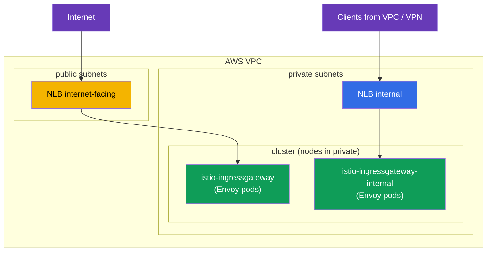
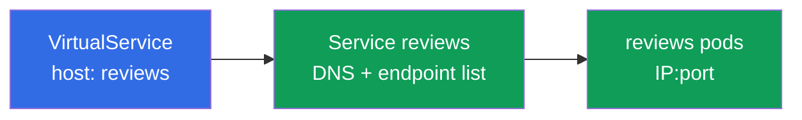
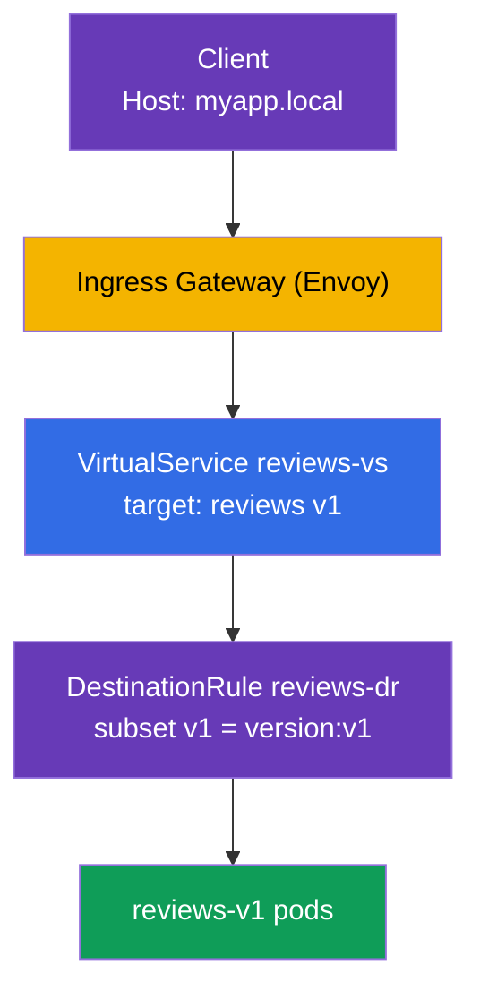

[RU version](ru.md)

# Chapter 5. Traffic management: Gateway, VirtualService, DestinationRule

> **What's next.** We installed Istio and worked through the data plane. Now the most
> interesting and the largest ICA exam topic begins - traffic management (about 40% of the
> exam). In this chapter we cover the three main routing resources: Gateway, VirtualService
> and DestinationRule. All the following chapters on canary, mirroring, resilience and
> egress rest on them.

## 5.1. The three pillars of traffic management

In Kubernetes you had `Ingress` for incoming traffic and `Service` for load balancing. In
Istio routing is more flexible and split into separate resources, each responsible for its
own part.

| Resource | Responsible for | Analogy |
|----------|-----------------|---------|
| **Gateway** | what to listen for at the mesh edge (port, protocol, host) | the cluster entry, like `Ingress` |
| **VirtualService** | where and by which rules to route traffic | a routing table |
| **DestinationRule** | what to do with traffic at the recipient (subsets, policies) | settings for the destination service |

There is also `ServiceEntry` (registering external services) - we cover it in chapter 11 on
egress. For now let's focus on these three.

The logic is simple: **Gateway** accepted the traffic at the edge, **VirtualService** decided
where to send it, and **DestinationRule** described how to treat the recipient.


## 5.2. Gateway: the entry point

A `Gateway` configures the Envoy at the mesh edge (the ingress gateway) - it tells it which
port and protocol to listen on and for which hosts to accept requests. By itself a Gateway
does not send traffic anywhere, it only opens the "door".

```yaml
apiVersion: networking.istio.io/v1
kind: Gateway
metadata:
  name: main-gateway
spec:
  selector:
    istio: ingressgateway   # which Envoy gateway to apply this to (ingress gateway)
  servers:
  - port:
      number: 80
      name: http
      protocol: HTTP
    hosts:
    - "myapp.local"         # accept requests only for this host
```

Let's break down the fields:

- **`selector`** - selects which Envoy gateway to apply this configuration to. The label
  `istio: ingressgateway` matches the `istio-ingressgateway` pod from chapter 2.
- **`servers`** - what to listen for: port `80`, protocol `HTTP`.
- **`hosts`** - for which hosts to accept requests. A request with a different `Host` is
  rejected. To accept everything, use `hosts: ["*"]`.

The important thing: the Gateway only opens the port and says "I'm ready to accept traffic
for myapp.local". Where to send it next is decided by the VirtualService.

### Multiple ingress gateways: separating traffic

The `selector` in a Gateway shows which Envoy gateway the rules apply to. By default this is
a single gateway `istio-ingressgateway` (label `istio: ingressgateway`). But there can be
**several** gateways: you deploy additional ingress gateways - separate Envoy Deployments
with their own labels and their own Kubernetes Service - and direct different traffic to
different gateways by specifying the right label in `selector`.

Why this is useful:

- **Separate public and internal traffic.** One gateway faces the internet, another only the
  internal network; they do not overlap.
- **Team/tenant isolation.** Each team has its own gateway with its own limits and
  certificates.
- **Different requirements.** A dedicated gateway for gRPC/TCP, for a different set of TLS
  certificates, or for separate scaling.

You can deploy a second gateway via IstioOperator by adding another ingress gateway with its
own name and label:

```yaml
apiVersion: install.istio.io/v1alpha1
kind: IstioOperator
spec:
  components:
    ingressGateways:
    - name: istio-ingressgateway          # public (the default)
      enabled: true
    - name: istio-ingressgateway-internal # additional, internal
      enabled: true
      label:
        istio: ingressgateway-internal    # its own label for selector
```

Each `ingressGateways` entry is a standalone gateway. On `istioctl install` Istio creates for
it, in the `istio-system` namespace, a full set of objects:

- a **Deployment** with Envoy pods (name = `name`, here `istio-ingressgateway-internal`);
- a **Service** of the same name - through which traffic reaches those pods (the type comes
  from `k8s.service.type`, `LoadBalancer` by default);
- a **ServiceAccount**, HPA/PodDisruptionBudget, etc.

The label from `label` (`istio: ingressgateway-internal`) is placed on the Deployment's pods
- it is exactly what a Gateway's `selector` uses to find the right gateway. You can check
that the gateway appeared like this:

```bash
kubectl -n istio-system get deploy,svc,pod -l istio=ingressgateway-internal
```

```
NAME                                             READY   UP-TO-DATE   AVAILABLE
deployment.apps/istio-ingressgateway-internal    1/1     1            1

NAME                                    TYPE           CLUSTER-IP     EXTERNAL-IP      PORT(S)
service/istio-ingressgateway-internal   LoadBalancer   10.100.5.6     <lb-address>     80:31234/TCP

NAME                                                 READY   STATUS
pod/istio-ingressgateway-internal-6c9f4b8d7-xk2mn    1/1     Running
```

So a "gateway" is the pair **Deployment (Envoy pods) + Service**. If the Service is of type
`LoadBalancer`, the cloud (in our case AWS) provisions a load balancer for it and puts its
address in `EXTERNAL-IP`.

Now in a Gateway you can choose which gateway listens for a given host:

```yaml
# public application — via the external gateway
apiVersion: networking.istio.io/v1
kind: Gateway
metadata:
  name: public-gateway
spec:
  selector:
    istio: ingressgateway            # external gateway
  servers:
  - port: { number: 80, name: http, protocol: HTTP }
    hosts: ["shop.example.com"]
---
# internal application — via the internal gateway
apiVersion: networking.istio.io/v1
kind: Gateway
metadata:
  name: internal-gateway
spec:
  selector:
    istio: ingressgateway-internal   # internal gateway
  servers:
  - port: { number: 80, name: http, protocol: HTTP }
    hosts: ["admin.internal"]
```

This way one cluster serves both public and internal traffic through different "doors", and
a VirtualService binds to the right gateway via the `gateways` field.

### AWS VPC example: public and private subnets

A typical AWS VPC consists of two kinds of subnets:

- **public** - have a route to the Internet Gateway; resources in them are reachable from the
  internet;
- **private** - no direct route to the internet, reachable only inside the VPC (and via
  VPN/Direct Connect).

An AWS load balancer is created **in subnets**, and which subnets it is in determines whether
it is public or internal:

- `scheme: internet-facing` → the load balancer is placed in **public** subnets and gets a
  public address;
- `scheme: internal` → the load balancer is placed in **private** subnets and resolves only
  to private IPs (not reachable from the internet).

The [AWS Load Balancer
Controller](https://kubernetes-sigs.github.io/aws-load-balancer-controller/) is responsible
for creating the load balancers. It finds the right subnets by tags (usually set by the
cluster installer, e.g. `eksctl`):

- public: tag `kubernetes.io/role/elb = 1`;
- private: tag `kubernetes.io/role/internal-elb = 1`;
- plus `kubernetes.io/cluster/<cluster-name> = owned` (or `shared`).

If the subnets are not tagged or you need to choose them explicitly, subnets are set with the
`service.beta.kubernetes.io/aws-load-balancer-subnets` annotation.

Let's deploy two gateways - an internet gateway in public subnets and an internal one in
private:

```yaml
apiVersion: install.istio.io/v1alpha1
kind: IstioOperator
spec:
  components:
    ingressGateways:
    # 1) internet gateway: public NLB in PUBLIC subnets
    - name: istio-ingressgateway
      enabled: true
      # default label istio: ingressgateway
      k8s:
        service:
          type: LoadBalancer
        serviceAnnotations:
          service.beta.kubernetes.io/aws-load-balancer-type: external
          service.beta.kubernetes.io/aws-load-balancer-nlb-target-type: ip
          service.beta.kubernetes.io/aws-load-balancer-scheme: internet-facing
          # you can specify subnets explicitly instead of tags:
          # service.beta.kubernetes.io/aws-load-balancer-subnets: subnet-pub-a,subnet-pub-b
    # 2) internal gateway: private NLB in PRIVATE subnets
    - name: istio-ingressgateway-internal
      enabled: true
      label:
        istio: ingressgateway-internal
      k8s:
        service:
          type: LoadBalancer
        serviceAnnotations:
          service.beta.kubernetes.io/aws-load-balancer-type: external
          service.beta.kubernetes.io/aws-load-balancer-nlb-target-type: ip
          service.beta.kubernetes.io/aws-load-balancer-scheme: internal
          # service.beta.kubernetes.io/aws-load-balancer-subnets: subnet-priv-a,subnet-priv-b
```

What the annotations mean:

- **`aws-load-balancer-type`** - selects **which controller** provisions the load balancer
  (not "ALB or NLB"). The value `external` = the modern [AWS Load Balancer
  Controller](https://kubernetes-sigs.github.io/aws-load-balancer-controller/), and for a
  **Service** resource it always creates an **NLB** (Network Load Balancer, L4). Possible
  values: `external` (AWS LBC → NLB), the deprecated `nlb-ip` (same AWS LBC with IP targets),
  `nlb` (in-tree controller → NLB). If you do not set the annotation at all, the built-in
  in-tree controller kicks in and creates a legacy **Classic Load Balancer (CLB)** - so you
  do need to set the type. There is **no `alb` value** for this annotation: an ALB is created
  not from a Service but from an `Ingress` resource (see below).
  Do not confuse it with **ELB** (*Elastic Load Balancing*) - that is the umbrella name of
  the AWS service, which includes CLB, ALB and NLB, not a separate load balancer type.
- **`aws-load-balancer-nlb-target-type`** - where to send traffic: `ip` (directly to pod IPs
  via the VPC CNI) or `instance` (to the nodes' NodePort). `ip` is more efficient and
  preserves the original client IP.
- **`aws-load-balancer-scheme`** - `internet-facing` (public subnets, public address) or
  `internal` (private subnets, VPC-only).

The key thing about AWS load balancer types in Kubernetes: **the load balancer type is
determined by the Kubernetes resource type, not by an annotation value.**

- **Service (type `LoadBalancer`) → NLB (L4).** This is exactly the ingress gateway case: the
  NLB simply forwards TCP, while routing, TLS and mTLS are done by Istio itself. You cannot
  create an ALB from a Service.
- **Ingress → ALB (L7).** An ALB is provisioned only from an `Ingress` resource (the class
  `ingressClassName: alb` and `alb.ingress.kubernetes.io/*` annotations); it has nothing to
  do with a Service. An ALB is sometimes put in front of Istio, but then it terminates HTTPS
  itself and part of the L7 logic leaves the mesh; for a "pure" Istio ingress an NLB is
  usually chosen. More on this choice - in the chapters on the production install on EKS.



The result:

- The `istio-ingressgateway` Service gets a public NLB (`EXTERNAL-IP` is a public DNS name
  `*.elb.amazonaws.com` resolving to public IPs). Through it we expose public applications
  (`shop.example.com`).
- The `istio-ingressgateway-internal` Service gets an **internal** NLB (its address resolves
  only to private VPC IPs). Through it go internal/admin services (`admin.internal`) - they
  are simply unreachable from the internet, because their gateway has no public address.

The Envoy pods of both gateways usually live on nodes in the private subnets - only the
public NLB "faces" the internet, not the pods themselves.

### An ACM TLS certificate right on the NLB

The certificate for incoming HTTPS does not have to be loaded into Istio - you can attach a
ready certificate from **AWS Certificate Manager (ACM)** directly to the NLB. Then TLS is
terminated at the load balancer, and ACM renews the certificate itself. It is enough to add
annotations to the gateway Service:

```yaml
        serviceAnnotations:
          service.beta.kubernetes.io/aws-load-balancer-type: external
          service.beta.kubernetes.io/aws-load-balancer-scheme: internet-facing
          # the ACM certificate and the port(s) on which the NLB terminates TLS
          service.beta.kubernetes.io/aws-load-balancer-ssl-cert: arn:aws:acm:eu-central-1:123456789012:certificate/xxxxxxxx-xxxx-xxxx
          service.beta.kubernetes.io/aws-load-balancer-ssl-ports: "443"
```

- `aws-load-balancer-ssl-cert` - the ARN of the certificate from ACM.
- `aws-load-balancer-ssl-ports` - on which ports the NLB listens for TLS (usually `443`); the
  other ports (for example, `80`) stay plain TCP.

An important nuance - **where** TLS is terminated:

- **TLS at the NLB (offload).** The NLB decrypts the traffic with the ACM certificate, and
  from there to the gateway the traffic travels already decrypted inside the VPC. Pro: the
  certificate is managed by AWS (auto-renewal), you do not need to load it into Istio. Con:
  between the NLB and the gateway the traffic is not protected by this certificate (only
  inside the VPC), and Istio does not "see" the original TLS.
- **Passthrough + TLS in Istio.** The alternative: the NLB just forwards TCP (without
  `ssl-cert`), the certificate is placed in Istio, and TLS (or mTLS) is terminated by the
  ingress gateway. This variant with a `Gateway` in `SIMPLE`/`MUTUAL`/`PASSTHROUGH` modes is
  covered in chapter 9.

In short: if you want to hand certificate management to AWS and terminate TLS at the edge -
attach an ACM certificate to the NLB with annotations; if you need end-to-end TLS/mTLS all
the way to the mesh - terminate it in Istio (chapter 9).

## 5.3. VirtualService: the routing rules

A `VirtualService` is the central routing resource. It describes how traffic reaches a
specific service: by which host, by which conditions, and into which recipient to route it.

```yaml
apiVersion: networking.istio.io/v1
kind: VirtualService
metadata:
  name: reviews-vs
spec:
  hosts:
  - "myapp.local"      # for which host the rules apply
  gateways:
  - main-gateway       # through which Gateway the traffic arrived
  http:
  - route:
    - destination:
        host: reviews  # the destination Kubernetes Service
        subset: v1     # which group of pods (described in the DestinationRule)
```

Key fields:

- **`hosts`** - for which host the rules apply. This can be an external host (like
  `myapp.local`) or an internal service name.
- **`gateways`** - where the traffic came from. Here `main-gateway` means "traffic from
  outside, through our ingress". There is a special value `mesh` for in-cluster traffic -
  about it in section 5.6.
- **`http`** - a list of routing rules, processed top to bottom, the first matching one wins.
- **`destination.host`** - the name of the Kubernetes Service to send traffic to.
- **`destination.subset`** - a specific group of pods within the service (for example, only
  version v1). These subsets are described in a DestinationRule.

A VirtualService can do much more: header-based routing, weighted splitting, mirroring,
timeouts and retries. We cover all of it in the following chapters; for now the point is to
understand the basic role - "where to route".

## 5.4. DestinationRule: subsets and policies

The `VirtualService` in the example above references `subset: v1`. But how does Istio know
what v1 is? That is described by a `DestinationRule`.

```yaml
apiVersion: networking.istio.io/v1
kind: DestinationRule
metadata:
  name: reviews-dr
spec:
  host: reviews          # for which service
  subsets:
  - name: v1
    labels:
      version: v1        # v1 = pods with the label version=v1
  - name: v2
    labels:
      version: v2
```

- **`host`** - which Kubernetes Service the rule applies to.
- **`subsets`** - logical groups of pods within a single service. Each subset is defined by a
  set of labels. Subset `v1` is all pods of the `reviews` service with the label
  `version: v1`.

Why this is needed: the `reviews` service may have several versions (v1, v2, v3), all under a
single Kubernetes Service. To route traffic specifically to v1, Istio must be able to tell v1
pods from v2. Subsets are exactly this mechanism.

Besides subsets, a DestinationRule sets **traffic policies** toward the recipient: the load
balancing algorithm, connection pool settings, circuit breaking, the mTLS mode. We cover
these in chapters 7, 8 and 12.

## 5.5. How this relates to the Kubernetes Service

A frequent question: if there are a VirtualService and a DestinationRule, why is a plain
Kubernetes Service needed at all? And how are they related? Let's work through it, because
this is the key to understanding all of routing.

The main point: **a VirtualService does not replace a Kubernetes Service, it works on top of
it.**

- The `destination.host` field in a VirtualService (and `host` in a DestinationRule) points
  to the **name of a Kubernetes Service** (a short name or an FQDN like
  `reviews.default.svc.cluster.local`).
- Istio takes from that Service the list of endpoints - the real pod IPs. This is the same
  service discovery as in ordinary Kubernetes: a Service, by its `selector`, knows which pods
  stand behind it. Istio reuses this information.
- **A VirtualService only intercepts** the traffic going to that host and decides where and
  by which rules to route it (into which subset, with which weights). And physically
  distributing the request across the concrete pods is Envoy's job, and it uses exactly the
  endpoints from the Kubernetes Service.
- A **subset** from a DestinationRule is a subset of those same Service pods, selected by
  additional labels (for example, `version: v1`). Subset pods must fall under the Service's
  `selector`, otherwise they simply would not be there.



The conclusion: a Kubernetes Service is still mandatory - it provides the DNS name and the
list of pods. Without it Istio would not know where to physically send traffic. VirtualService
and DestinationRule are an overlay: they are not about "where the pods are" but about "how
exactly to distribute traffic among them". That is why in a real application you always create
a plain Service first and only then cover it with Istio rules.

## 5.6. How the three resources work together

Let's assemble everything into one picture with the example of an external request to the
`reviews` service.



Step by step:

1. The client sends a request with the header `Host: myapp.local` to the ingress gateway.
2. The **Gateway** has already told the gateway to listen on `myapp.local:80` - the request is
   accepted.
3. The **VirtualService** sees that for `myapp.local` through `main-gateway` the traffic must
   go to the `reviews` service, subset `v1`.
4. The **DestinationRule** explains that subset `v1` is the pods with the label `version: v1`.
5. The traffic goes to the `reviews-v1` pods.

Remove any of the three resources and the chain breaks: without the Gateway the traffic will
not get in, without the VirtualService the gateway will not know what to do with it, without
the DestinationRule Istio will not understand what `subset: v1` is.

## 5.7. Internal traffic and the `mesh` gateway

So far we have talked about traffic from outside. But a VirtualService can also manage traffic
**inside** the cluster (when one pod calls another). For that there is the special value
`gateways: [mesh]`.

`mesh` is a reserved word that means "all sidecars inside the mesh". Compare the two cases:

- `gateways: [main-gateway]` - the rules apply to traffic that came from outside through the
  ingress gateway.
- `gateways: [mesh]` - the rules apply to in-cluster traffic (pod-to-pod).

Often both variants are listed in `hosts` at once - the external host and the service name -
and both `main-gateway` and `mesh` are listed in `gateways`, so the same rules work both from
outside and inside:

```yaml
spec:
  hosts:
  - "myapp.local"    # external traffic
  - "reviews"        # internal traffic (by service name)
  gateways:
  - main-gateway     # from outside
  - mesh             # from inside
```

If you do not specify `gateways` at all, `mesh` is assumed by default, i.e. the rules apply
only to in-cluster traffic.

## 5.8. Common mistakes

These traps show up both on the exam and in real work.

- **Wrong `selector` in the Gateway.** The label in `selector` must match the labels of the
  ingress gateway pod. If you write `istio: gateway` instead of `istio: ingressgateway`,
  traffic simply will not be accepted.
- **Forgot the `subset` in the DestinationRule.** The VirtualService references `subset: v1`,
  but there is no such subset in the DestinationRule - the traffic will not flow. Subset names
  must match.
- **Hosts for cross-namespace traffic.** To reach a service in another namespace, it is
  better to specify both the short name and the full FQDN in the VirtualService `hosts`:

  ```yaml
  hosts:
    - reviews
    - reviews.default.svc.cluster.local
  ```

- **Forgot `mesh` in gateways.** If you want the rules to work for in-cluster traffic, be sure
  to add `mesh` to `gateways`. Otherwise they will only fire for external traffic.

## 5.9. Chapter summary

- Traffic management in Istio rests on three resources: Gateway, VirtualService,
  DestinationRule.
- A **Gateway** opens a port at the mesh edge and says which hosts to accept; it does not
  route traffic itself.
- There can be **several** ingress gateways: each `ingressGateways` entry in the IstioOperator
  is its own Deployment (Envoy pods) + Service, and with different `selector` labels traffic
  is split across different gateways (for example, public and internal).
- On AWS the load balancer type is set by the annotation `aws-load-balancer-type: external`
  (AWS LB Controller → NLB; without it - the legacy Classic LB), and the scheme sets where it
  is created: `internet-facing` in public subnets (public address) or `internal` in private
  subnets (VPC/VPN only). Subnets are chosen by tags or the `aws-load-balancer-subnets`
  annotation. An ALB (L7) is created for an Ingress, not for a Service.
- TLS can be terminated right on the NLB with a ready certificate from ACM (the
  `aws-load-balancer-ssl-cert` + `aws-load-balancer-ssl-ports` annotations) - AWS renews it
  itself; or use passthrough and terminate TLS/mTLS in Istio (chapter 9).
- A **VirtualService** decides where and by which rules to route traffic (host, conditions,
  destination).
- A **DestinationRule** describes subsets (groups of pods by labels) and policies toward the
  recipient.
- Subsets from a DestinationRule link a VirtualService to specific pod versions.
- A VirtualService does not replace a Kubernetes Service, it works on top of it: the name in
  `destination.host` is a Service from which Istio takes endpoints (pod IPs).
- The value `gateways: [mesh]` enables the rules for in-cluster traffic; with no gateways
  specified, `mesh` is what is assumed.
- Common mistakes: a wrong selector, mismatched subset names, a missing FQDN in hosts, a
  forgotten `mesh`.

## 5.10. Self-check questions

1. What is each of the three resources responsible for: Gateway, VirtualService,
   DestinationRule?
2. What happens if a VirtualService references a subset that does not exist in the
   DestinationRule?
3. Why are subsets needed and how are they linked to pod labels?
4. How does `gateways: [main-gateway]` differ from `gateways: [mesh]`?
5. Why should you specify an FQDN in hosts for cross-namespace traffic?
6. Why is a plain Kubernetes Service needed if there is a VirtualService? How are they related?
7. How do you deploy several ingress gateways and direct different traffic to them? How, on
   AWS, do you make one gateway public and another reachable only from the VPC?

## Practice

Go through the lab: configure a Gateway, VirtualService and DestinationRule from scratch, and
split traffic by service version and by HTTP header.

🧪 Lab 02: [tasks/ica/labs/02](../../labs/02/README.MD)

---
[Contents](../README.md) · [Chapter 4](../04/en.md) · [Chapter 6](../06/ru.md)
