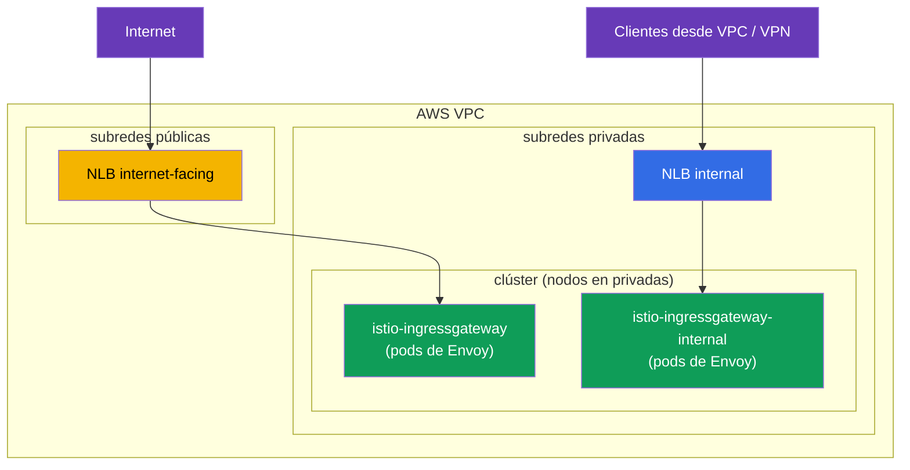
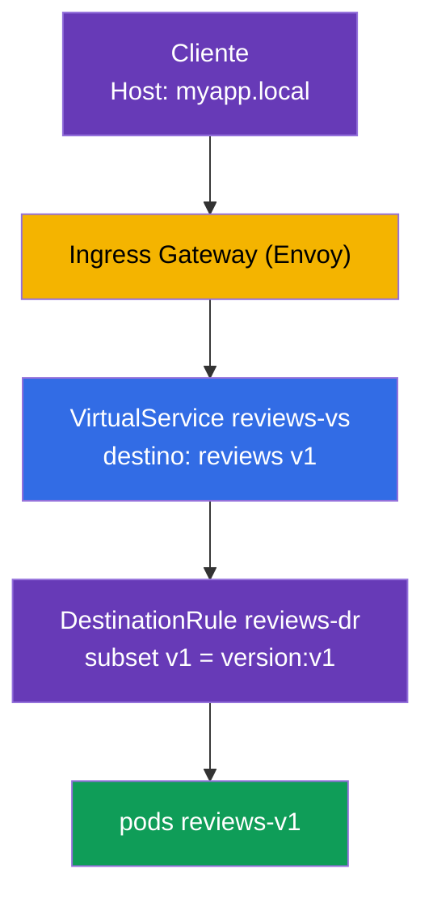

[RU version](ru.md) · [Eng version](en.md)

# Capítulo 5. Gestión del tráfico: Gateway, VirtualService, DestinationRule

> **Qué sigue.** Instalamos Istio y recorrimos el data plane. Ahora empieza el tema más
> interesante y más grande del examen ICA: la gestión del tráfico (alrededor del 40% del
> examen). En este capítulo cubrimos los tres recursos principales de enrutamiento: Gateway,
> VirtualService y DestinationRule. Todos los capítulos siguientes sobre canary, mirroring,
> resiliencia y egress se apoyan en ellos.

## 5.1. Los tres pilares de la gestión del tráfico

En Kubernetes tenías `Ingress` para el tráfico entrante y `Service` para el balanceo de carga.
En Istio el enrutamiento es más flexible y se divide en recursos separados, cada uno
responsable de su propia parte.

| Recurso | Responsable de | Analogía |
|---------|----------------|----------|
| **Gateway** | qué escuchar en el borde de la malla (puerto, protocolo, host) | la entrada del clúster, como `Ingress` |
| **VirtualService** | a dónde y por qué reglas enrutar el tráfico | una tabla de enrutamiento |
| **DestinationRule** | qué hacer con el tráfico en el destinatario (subsets, políticas) | ajustes para el servicio de destino |

También existe `ServiceEntry` (registrar servicios externos), que cubrimos en el capítulo 11
sobre egress. Por ahora centrémonos en estos tres.

La lógica es simple: **Gateway** aceptó el tráfico en el borde, **VirtualService** decidió a
dónde enviarlo, y **DestinationRule** describió cómo tratar al destinatario.


## 5.2. Gateway: el punto de entrada

Un `Gateway` configura el Envoy en el borde de la malla (el ingress gateway): le dice en qué
puerto y protocolo escuchar y para qué hosts aceptar peticiones. Por sí mismo un Gateway no
envía tráfico a ninguna parte, solo abre la "puerta".

```yaml
apiVersion: networking.istio.io/v1
kind: Gateway
metadata:
  name: main-gateway
spec:
  selector:
    istio: ingressgateway   # a qué Envoy gateway aplicar esto (el ingress gateway)
  servers:
  - port:
      number: 80
      name: http
      protocol: HTTP
    hosts:
    - "myapp.local"         # aceptar peticiones solo para este host
```

Desglosemos los campos:

- **`selector`**, selecciona a qué Envoy gateway aplicar esta configuración. La etiqueta
  `istio: ingressgateway` coincide con el pod `istio-ingressgateway` del capítulo 2.
- **`servers`**, qué escuchar: puerto `80`, protocolo `HTTP`.
- **`hosts`**, para qué hosts aceptar peticiones. Una petición con un `Host` distinto se
  rechaza. Para aceptar todo, usa `hosts: ["*"]`.

Lo importante: el Gateway solo abre el puerto y dice "estoy listo para aceptar tráfico para
myapp.local". A dónde enviarlo a continuación lo decide el VirtualService.

### Múltiples ingress gateways: separar el tráfico

El `selector` en un Gateway muestra a qué Envoy gateway se aplican las reglas. Por defecto este
es un único gateway `istio-ingressgateway` (etiqueta `istio: ingressgateway`). Pero puede haber
**varios** gateways: despliegas ingress gateways adicionales, Deployments de Envoy separados
con sus propias etiquetas y su propio Service de Kubernetes, y diriges distinto tráfico a
distintos gateways indicando la etiqueta correcta en `selector`.

Por qué es útil:

- **Separar el tráfico público y el interno.** Un gateway da a internet, otro solo a la red
  interna; no se solapan.
- **Aislamiento por equipo/tenant.** Cada equipo tiene su propio gateway con sus propios
  límites y certificados.
- **Requisitos distintos.** Un gateway dedicado para gRPC/TCP, para un conjunto distinto de
  certificados TLS, o para escalado separado.

Puedes desplegar un segundo gateway mediante IstioOperator añadiendo otro ingress gateway con
su propio nombre y etiqueta:

```yaml
apiVersion: install.istio.io/v1alpha1
kind: IstioOperator
spec:
  components:
    ingressGateways:
    - name: istio-ingressgateway          # público (el por defecto)
      enabled: true
    - name: istio-ingressgateway-internal # adicional, interno
      enabled: true
      label:
        istio: ingressgateway-internal    # su propia etiqueta para selector
```

Cada entrada de `ingressGateways` es un gateway independiente. Al ejecutar `istioctl install`,
Istio crea para él, en el namespace `istio-system`, un conjunto completo de objetos:

- un **Deployment** con pods de Envoy (name = `name`, aquí `istio-ingressgateway-internal`);
- un **Service** del mismo nombre, a través del cual el tráfico llega a esos pods (el tipo
  viene de `k8s.service.type`, `LoadBalancer` por defecto);
- un **ServiceAccount**, HPA/PodDisruptionBudget, etc.

La etiqueta de `label` (`istio: ingressgateway-internal`) se pone en los pods del Deployment; es
exactamente lo que usa el `selector` de un Gateway para encontrar el gateway correcto. Puedes
comprobar que el gateway apareció así:

```bash
kubectl -n istio-system get deploy,svc,pod -l istio=ingressgateway-internal
```

```
NAME                                             READY   UP-TO-DATE   AVAILABLE
deployment.apps/istio-ingressgateway-internal    1/1     1            1

NAME                                    TYPE           CLUSTER-IP     EXTERNAL-IP      PORT(S)
service/istio-ingressgateway-internal   LoadBalancer   10.100.5.6     <lb-address>     80:31234/TCP

NAME                                                 READY   STATUS
pod/istio-ingressgateway-internal-6c9f4b8d7-xk2mn    1/1     Running
```

Así que un "gateway" es el par **Deployment (pods de Envoy) + Service**. Si el Service es de
tipo `LoadBalancer`, la nube (en nuestro caso AWS) provisiona un load balancer para él y pone
su dirección en `EXTERNAL-IP`.

Ahora en un Gateway puedes elegir qué gateway escucha para un host dado:

```yaml
# aplicación pública — vía el gateway externo
apiVersion: networking.istio.io/v1
kind: Gateway
metadata:
  name: public-gateway
spec:
  selector:
    istio: ingressgateway            # gateway externo
  servers:
  - port: { number: 80, name: http, protocol: HTTP }
    hosts: ["shop.example.com"]
---
# aplicación interna — vía el gateway interno
apiVersion: networking.istio.io/v1
kind: Gateway
metadata:
  name: internal-gateway
spec:
  selector:
    istio: ingressgateway-internal   # gateway interno
  servers:
  - port: { number: 80, name: http, protocol: HTTP }
    hosts: ["admin.internal"]
```

De este modo un mismo clúster sirve tanto tráfico público como interno a través de distintas
"puertas", y un VirtualService se enlaza al gateway correcto mediante el campo `gateways`.

### Ejemplo de VPC de AWS: subredes públicas y privadas

Una VPC típica de AWS consta de dos clases de subredes:

- **públicas**, tienen una ruta al Internet Gateway; los recursos en ellas son alcanzables
  desde internet;
- **privadas**, sin ruta directa a internet, alcanzables solo dentro de la VPC (y vía
  VPN/Direct Connect).

Un load balancer de AWS se crea **en subredes**, y en qué subredes está determina si es público
o interno:

- `scheme: internet-facing` → el load balancer se coloca en subredes **públicas** y obtiene una
  dirección pública;
- `scheme: internal` → el load balancer se coloca en subredes **privadas** y resuelve solo a
  IPs privadas (no alcanzable desde internet).

El [AWS Load Balancer
Controller](https://kubernetes-sigs.github.io/aws-load-balancer-controller/) es responsable de
crear los load balancers. Encuentra las subredes correctas por tags (normalmente puestos por el
instalador del clúster, p. ej. `eksctl`):

- públicas: tag `kubernetes.io/role/elb = 1`;
- privadas: tag `kubernetes.io/role/internal-elb = 1`;
- más `kubernetes.io/cluster/<cluster-name> = owned` (o `shared`).

Si las subredes no están tagueadas o necesitas elegirlas explícitamente, las subredes se fijan
con la anotación `service.beta.kubernetes.io/aws-load-balancer-subnets`.

Desplegamos dos gateways: un gateway de internet en subredes públicas y uno interno en
privadas:

```yaml
apiVersion: install.istio.io/v1alpha1
kind: IstioOperator
spec:
  components:
    ingressGateways:
    # 1) gateway de internet: NLB público en subredes PÚBLICAS
    - name: istio-ingressgateway
      enabled: true
      # etiqueta por defecto istio: ingressgateway
      k8s:
        service:
          type: LoadBalancer
        serviceAnnotations:
          service.beta.kubernetes.io/aws-load-balancer-type: external
          service.beta.kubernetes.io/aws-load-balancer-nlb-target-type: ip
          service.beta.kubernetes.io/aws-load-balancer-scheme: internet-facing
          # puedes indicar las subredes explícitamente en lugar de tags:
          # service.beta.kubernetes.io/aws-load-balancer-subnets: subnet-pub-a,subnet-pub-b
    # 2) gateway interno: NLB privado en subredes PRIVADAS
    - name: istio-ingressgateway-internal
      enabled: true
      label:
        istio: ingressgateway-internal
      k8s:
        service:
          type: LoadBalancer
        serviceAnnotations:
          service.beta.kubernetes.io/aws-load-balancer-type: external
          service.beta.kubernetes.io/aws-load-balancer-nlb-target-type: ip
          service.beta.kubernetes.io/aws-load-balancer-scheme: internal
          # service.beta.kubernetes.io/aws-load-balancer-subnets: subnet-priv-a,subnet-priv-b
```

Qué significan las anotaciones:

- **`aws-load-balancer-type`**, selecciona **qué controlador** provisiona el load balancer (no
  "ALB o NLB"). El valor `external` = el moderno [AWS Load Balancer
  Controller](https://kubernetes-sigs.github.io/aws-load-balancer-controller/), y para un
  recurso **Service** siempre crea un **NLB** (Network Load Balancer, L4). Valores posibles:
  `external` (AWS LBC → NLB), el obsoleto `nlb-ip` (el mismo AWS LBC con targets IP), `nlb` (el
  controlador in-tree → NLB). Si no pones la anotación en absoluto, entra el controlador
  in-tree integrado y crea un **Classic Load Balancer (CLB)** heredado, así que sí necesitas
  fijar el tipo. **No hay un valor `alb`** para esta anotación: un ALB se crea no a partir de un
  Service sino de un recurso `Ingress` (ver más abajo). No lo confundas con **ELB** (*Elastic
  Load Balancing*), que es el nombre paraguas del servicio de AWS, que incluye CLB, ALB y NLB,
  no un tipo de load balancer separado.
- **`aws-load-balancer-nlb-target-type`**, a dónde enviar el tráfico: `ip` (directamente a las
  IPs de los pods vía el VPC CNI) o `instance` (al NodePort de los nodos). `ip` es más eficiente
  y preserva la IP original del cliente.
- **`aws-load-balancer-scheme`**, `internet-facing` (subredes públicas, dirección pública) o
  `internal` (subredes privadas, solo VPC).

Lo clave sobre los tipos de load balancer de AWS en Kubernetes: **el tipo de load balancer lo
determina el tipo de recurso de Kubernetes, no el valor de una anotación.**

- **Service (tipo `LoadBalancer`) → NLB (L4).** Este es exactamente el caso del ingress
  gateway: el NLB simplemente reenvía TCP, mientras que el enrutamiento, TLS y mTLS los hace el
  propio Istio. No puedes crear un ALB a partir de un Service.
- **Ingress → ALB (L7).** Un ALB se provisiona solo a partir de un recurso `Ingress` (la clase
  `ingressClassName: alb` y las anotaciones `alb.ingress.kubernetes.io/*`); no tiene nada que
  ver con un Service. A veces se pone un ALB delante de Istio, pero entonces este termina HTTPS
  por sí mismo y parte de la lógica L7 sale de la malla; para un ingress de Istio "puro"
  normalmente se elige un NLB. Más sobre esta elección en los capítulos sobre la instalación de
  producción en EKS.



El resultado:

- El Service `istio-ingressgateway` obtiene un NLB público (`EXTERNAL-IP` es un nombre DNS
  público `*.elb.amazonaws.com` que resuelve a IPs públicas). A través de él exponemos las
  aplicaciones públicas (`shop.example.com`).
- El Service `istio-ingressgateway-internal` obtiene un NLB **interno** (su dirección resuelve
  solo a IPs privadas de la VPC). A través de él van los servicios internos/admin
  (`admin.internal`); simplemente no son alcanzables desde internet, porque su gateway no tiene
  dirección pública.

Los pods de Envoy de ambos gateways suelen vivir en nodos de las subredes privadas; solo el NLB
público "da" a internet, no los propios pods.

### Un certificado TLS de ACM directamente en el NLB

El certificado para el HTTPS entrante no tiene por qué cargarse en Istio: puedes adjuntar un
certificado ya listo de **AWS Certificate Manager (ACM)** directamente al NLB. Entonces TLS se
termina en el load balancer, y ACM renueva el certificado por sí mismo. Basta con añadir
anotaciones al Service del gateway:

```yaml
        serviceAnnotations:
          service.beta.kubernetes.io/aws-load-balancer-type: external
          service.beta.kubernetes.io/aws-load-balancer-scheme: internet-facing
          # el certificado de ACM y el/los puerto(s) en los que el NLB termina TLS
          service.beta.kubernetes.io/aws-load-balancer-ssl-cert: arn:aws:acm:eu-central-1:123456789012:certificate/xxxxxxxx-xxxx-xxxx
          service.beta.kubernetes.io/aws-load-balancer-ssl-ports: "443"
```

- `aws-load-balancer-ssl-cert`, el ARN del certificado de ACM.
- `aws-load-balancer-ssl-ports`, en qué puertos escucha el NLB para TLS (normalmente `443`);
  los otros puertos (por ejemplo, `80`) siguen siendo TCP en texto plano.

Un matiz importante: **dónde** se termina TLS:

- **TLS en el NLB (offload).** El NLB descifra el tráfico con el certificado de ACM, y de ahí al
  gateway el tráfico viaja ya descifrado dentro de la VPC. Pro: el certificado lo gestiona AWS
  (renovación automática), no necesitas cargarlo en Istio. Contra: entre el NLB y el gateway el
  tráfico no está protegido por este certificado (solo dentro de la VPC), e Istio no "ve" el
  TLS original.
- **Passthrough + TLS en Istio.** La alternativa: el NLB solo reenvía TCP (sin `ssl-cert`), el
  certificado se coloca en Istio, y TLS (o mTLS) lo termina el ingress gateway. Esta variante
  con un `Gateway` en modos `SIMPLE`/`MUTUAL`/`PASSTHROUGH` se cubre en el capítulo 9.

En resumen: si quieres delegar la gestión de certificados en AWS y terminar TLS en el borde,
adjunta un certificado de ACM al NLB con anotaciones; si necesitas TLS/mTLS de extremo a extremo
hasta la malla, termínalo en Istio (capítulo 9).

## 5.3. VirtualService: las reglas de enrutamiento

Un `VirtualService` es el recurso central de enrutamiento. Describe cómo llega el tráfico a un
servicio concreto: por qué host, por qué condiciones, y a qué destinatario enrutarlo.

```yaml
apiVersion: networking.istio.io/v1
kind: VirtualService
metadata:
  name: reviews-vs
spec:
  hosts:
  - "myapp.local"      # para qué host aplican las reglas
  gateways:
  - main-gateway       # a través de qué Gateway llegó el tráfico
  http:
  - route:
    - destination:
        host: reviews  # el Service de Kubernetes de destino
        subset: v1     # qué grupo de pods (descrito en la DestinationRule)
```

Campos clave:

- **`hosts`**, para qué host aplican las reglas. Puede ser un host externo (como `myapp.local`)
  o un nombre de servicio interno.
- **`gateways`**, de dónde vino el tráfico. Aquí `main-gateway` significa "tráfico desde fuera,
  a través de nuestro ingress". Hay un valor especial `mesh` para el tráfico dentro del
  clúster, sobre él en la sección 5.6.
- **`http`**, una lista de reglas de enrutamiento, procesadas de arriba a abajo, gana la
  primera que coincide.
- **`destination.host`**, el nombre del Service de Kubernetes al que enviar el tráfico.
- **`destination.subset`**, un grupo específico de pods dentro del servicio (por ejemplo, solo
  la versión v1). Estos subsets se describen en una DestinationRule.

Un VirtualService puede hacer mucho más: enrutamiento por cabeceras, división por pesos,
mirroring, timeouts y reintentos. Cubrimos todo ello en los capítulos siguientes; por ahora la
idea es entender el papel básico: "a dónde enrutar".

## 5.4. DestinationRule: subsets y políticas

El `VirtualService` del ejemplo de arriba referencia `subset: v1`. Pero, ¿cómo sabe Istio qué
es v1? Eso lo describe una `DestinationRule`.

```yaml
apiVersion: networking.istio.io/v1
kind: DestinationRule
metadata:
  name: reviews-dr
spec:
  host: reviews          # para qué servicio
  subsets:
  - name: v1
    labels:
      version: v1        # v1 = pods con la etiqueta version=v1
  - name: v2
    labels:
      version: v2
```

- **`host`**, a qué Service de Kubernetes aplica la regla.
- **`subsets`**, grupos lógicos de pods dentro de un mismo servicio. Cada subset se define por un
  conjunto de etiquetas. El subset `v1` son todos los pods del servicio `reviews` con la
  etiqueta `version: v1`.

Por qué se necesita: el servicio `reviews` puede tener varias versiones (v1, v2, v3), todas bajo
un único Service de Kubernetes. Para enrutar el tráfico específicamente a v1, Istio debe poder
distinguir los pods v1 de los v2. Los subsets son exactamente este mecanismo.

Además de los subsets, una DestinationRule fija **políticas de tráfico** hacia el destinatario:
el algoritmo de balanceo de carga, los ajustes del connection pool, el circuit breaking, el modo
mTLS. Las cubrimos en los capítulos 7, 8 y 12.

## 5.5. Cómo se relaciona esto con el Service de Kubernetes

Una pregunta frecuente: si hay un VirtualService y una DestinationRule, ¿para qué se necesita
un Service de Kubernetes normal? ¿Y cómo se relacionan? Trabajémoslo, porque esta es la clave
para entender todo el enrutamiento.

El punto principal: **un VirtualService no reemplaza a un Service de Kubernetes, trabaja encima
de él.**

- El campo `destination.host` en un VirtualService (y `host` en una DestinationRule) apunta al
  **nombre de un Service de Kubernetes** (un nombre corto o un FQDN como
  `reviews.default.svc.cluster.local`).
- Istio toma de ese Service la lista de endpoints, las IPs reales de los pods. Este es el mismo
  service discovery que en Kubernetes ordinario: un Service, por su `selector`, sabe qué pods
  hay detrás de él. Istio reutiliza esta información.
- **Un VirtualService solo intercepta** el tráfico que va hacia ese host y decide a dónde y por
  qué reglas enrutarlo (a qué subset, con qué pesos). Y distribuir físicamente la petición
  entre los pods concretos es trabajo de Envoy, y este usa exactamente los endpoints del Service
  de Kubernetes.
- Un **subset** de una DestinationRule es un subconjunto de esos mismos pods del Service,
  seleccionados por etiquetas adicionales (por ejemplo, `version: v1`). Los pods del subset
  deben caer bajo el `selector` del Service, de lo contrario simplemente no estarían ahí.


La conclusión: un Service de Kubernetes sigue siendo obligatorio; proporciona el nombre DNS y la
lista de pods. Sin él Istio no sabría a dónde enviar físicamente el tráfico. VirtualService y
DestinationRule son una capa por encima: no tratan de "dónde están los pods" sino de "cómo
distribuir exactamente el tráfico entre ellos". Por eso en una aplicación real siempre creas
primero un Service normal y solo después lo cubres con reglas de Istio.

## 5.6. Cómo trabajan juntos los tres recursos

Montemos todo en una sola imagen con el ejemplo de una petición externa al servicio `reviews`.



Paso a paso:

1. El cliente envía una petición con la cabecera `Host: myapp.local` al ingress gateway.
2. El **Gateway** ya le ha dicho al gateway que escuche en `myapp.local:80`; la petición se
   acepta.
3. El **VirtualService** ve que para `myapp.local` a través de `main-gateway` el tráfico debe ir
   al servicio `reviews`, subset `v1`.
4. La **DestinationRule** explica que el subset `v1` son los pods con la etiqueta `version: v1`.
5. El tráfico va a los pods `reviews-v1`.

Quita cualquiera de los tres recursos y la cadena se rompe: sin el Gateway el tráfico no
entrará, sin el VirtualService el gateway no sabrá qué hacer con él, sin la DestinationRule
Istio no entenderá qué es `subset: v1`.

## 5.7. Tráfico interno y el gateway `mesh`

Hasta ahora hemos hablado de tráfico desde fuera. Pero un VirtualService también puede
gestionar tráfico **dentro** del clúster (cuando un pod llama a otro). Para eso está el valor
especial `gateways: [mesh]`.

`mesh` es una palabra reservada que significa "todos los sidecars dentro de la malla". Compara
los dos casos:

- `gateways: [main-gateway]`, las reglas aplican al tráfico que vino desde fuera a través del
  ingress gateway.
- `gateways: [mesh]`, las reglas aplican al tráfico dentro del clúster (pod a pod).

A menudo se listan ambas variantes en `hosts` a la vez, el host externo y el nombre del
servicio, y se listan tanto `main-gateway` como `mesh` en `gateways`, para que las mismas reglas
funcionen tanto desde fuera como desde dentro:

```yaml
spec:
  hosts:
  - "myapp.local"    # tráfico externo
  - "reviews"        # tráfico interno (por nombre de servicio)
  gateways:
  - main-gateway     # desde fuera
  - mesh             # desde dentro
```

Si no especificas `gateways` en absoluto, se asume `mesh` por defecto, es decir, las reglas
aplican solo al tráfico dentro del clúster.

## 5.8. Errores comunes

Estas trampas aparecen tanto en el examen como en el trabajo real.

- **`selector` incorrecto en el Gateway.** La etiqueta en `selector` debe coincidir con las
  etiquetas del pod del ingress gateway. Si escribes `istio: gateway` en lugar de
  `istio: ingressgateway`, el tráfico simplemente no se aceptará.
- **Olvidar el `subset` en la DestinationRule.** El VirtualService referencia `subset: v1`, pero
  no hay tal subset en la DestinationRule; el tráfico no fluirá. Los nombres de subset deben
  coincidir.
- **Hosts para tráfico entre namespaces.** Para alcanzar un servicio en otro namespace, es mejor
  indicar tanto el nombre corto como el FQDN completo en los `hosts` del VirtualService:

  ```yaml
  hosts:
    - reviews
    - reviews.default.svc.cluster.local
  ```

- **Olvidar `mesh` en gateways.** Si quieres que las reglas funcionen para el tráfico dentro del
  clúster, asegúrate de añadir `mesh` a `gateways`. De lo contrario solo se dispararán para el
  tráfico externo.

## 5.9. Resumen del capítulo

- La gestión del tráfico en Istio se apoya en tres recursos: Gateway, VirtualService,
  DestinationRule.
- Un **Gateway** abre un puerto en el borde de la malla y dice qué hosts aceptar; no enruta el
  tráfico por sí mismo.
- Puede haber **varios** ingress gateways: cada entrada `ingressGateways` en el IstioOperator es
  su propio Deployment (pods de Envoy) + Service, y con distintas etiquetas de `selector` el
  tráfico se divide entre distintos gateways (por ejemplo, público e interno).
- En AWS el tipo de load balancer lo fija la anotación `aws-load-balancer-type: external` (AWS
  LB Controller → NLB; sin ella, el Classic LB heredado), y el scheme fija dónde se crea:
  `internet-facing` en subredes públicas (dirección pública) o `internal` en subredes privadas
  (solo VPC/VPN). Las subredes se eligen por tags o la anotación `aws-load-balancer-subnets`. Un
  ALB (L7) se crea para un Ingress, no para un Service.
- TLS se puede terminar directamente en el NLB con un certificado ya listo de ACM (las
  anotaciones `aws-load-balancer-ssl-cert` + `aws-load-balancer-ssl-ports`); AWS lo renueva por
  sí mismo; o usa passthrough y termina TLS/mTLS en Istio (capítulo 9).
- Un **VirtualService** decide a dónde y por qué reglas enrutar el tráfico (host, condiciones,
  destino).
- Una **DestinationRule** describe subsets (grupos de pods por etiquetas) y políticas hacia el
  destinatario.
- Los subsets de una DestinationRule enlazan un VirtualService con versiones de pods concretas.
- Un VirtualService no reemplaza a un Service de Kubernetes, trabaja encima de él: el nombre en
  `destination.host` es un Service del que Istio toma endpoints (IPs de pods).
- El valor `gateways: [mesh]` habilita las reglas para el tráfico dentro del clúster; sin
  gateways especificados, `mesh` es lo que se asume.
- Errores comunes: un selector incorrecto, nombres de subset que no coinciden, un FQDN ausente
  en hosts, un `mesh` olvidado.

## 5.10. Preguntas de autoevaluación

1. ¿De qué es responsable cada uno de los tres recursos: Gateway, VirtualService,
   DestinationRule?
2. ¿Qué pasa si un VirtualService referencia un subset que no existe en la DestinationRule?
3. ¿Para qué se necesitan los subsets y cómo se enlazan con las etiquetas de los pods?
4. ¿En qué se diferencia `gateways: [main-gateway]` de `gateways: [mesh]`?
5. ¿Por qué deberías especificar un FQDN en hosts para el tráfico entre namespaces?
6. ¿Para qué se necesita un Service de Kubernetes normal si hay un VirtualService? ¿Cómo se
   relacionan?
7. ¿Cómo despliegas varios ingress gateways y diriges distinto tráfico a ellos? ¿Cómo, en AWS,
   haces que un gateway sea público y otro alcanzable solo desde la VPC?

## Práctica

Realiza el laboratorio: configura un Gateway, VirtualService y DestinationRule desde cero, y
divide el tráfico por versión de servicio y por cabecera HTTP.

🧪 Laboratorio 02: [tasks/ica/labs/02](../../labs/02/README_ES.MD)

---
[Índice](../README_ES.md) · [Capítulo 4](../04/es.md) · [Capítulo 6](../06/es.md)
