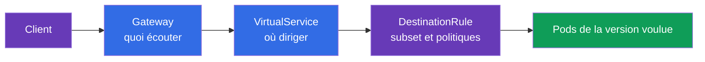
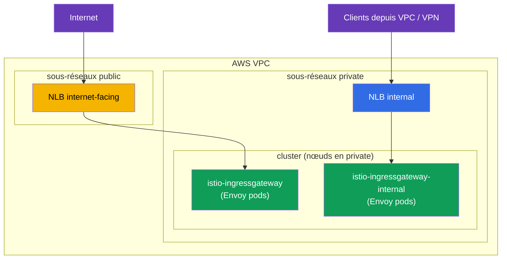
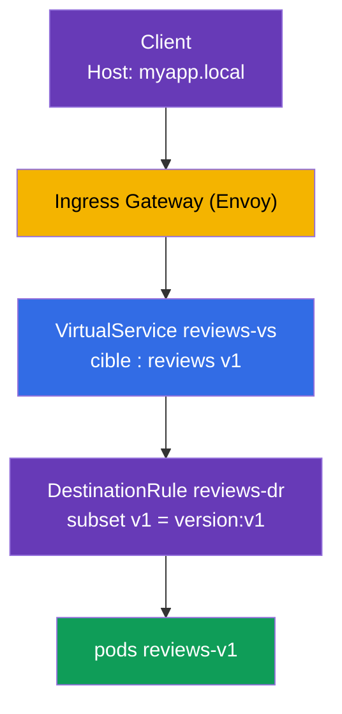

[RU version](ru.md) · [Eng version](en.md) · [Versión en español](es.md) · [Deutsche Version](de.md)

# Chapitre 5. Gestion du trafic : Gateway, VirtualService, DestinationRule

> **Ce qui suit.** Nous avons installé Istio et abordé le data plane. Maintenant commence
> la partie la plus intéressante et le plus gros sujet de l'examen ICA - la gestion du
> trafic (environ 40 % de l'examen). Dans ce chapitre, nous étudierons les trois
> principales ressources de routage : Gateway, VirtualService et DestinationRule. C'est
> sur elles que reposent tous les chapitres suivants sur le canary, le mirroring, la
> résilience et l'egress.

## 5.1. Les trois piliers de la gestion du trafic

Dans Kubernetes, vous disposiez d'un `Ingress` pour le trafic entrant et d'un `Service`
pour la répartition de charge. Dans Istio, le routage est plus souple et réparti entre
des ressources distinctes, chacune responsable de sa propre partie.

| Ressource | Responsable de | Analogie |
|--------|-------------|----------|
| **Gateway** | ce qu'on écoute à la frontière du mesh (port, protocole, hôte) | l'entrée du cluster, comme `Ingress` |
| **VirtualService** | vers où et selon quelles règles diriger le trafic | table de routage |
| **DestinationRule** | quoi faire du trafic chez le destinataire (subsets, politiques) | paramètres pour le service de destination |

Il existe encore `ServiceEntry` (enregistrement de services externes) - nous l'étudierons
au chapitre 11 sur l'egress. Pour l'instant, concentrons-nous sur ces trois-là.

La logique est simple : la **Gateway** a reçu le trafic à la frontière, le
**VirtualService** décide où l'envoyer, et la **DestinationRule** décrit comment traiter
le destinataire.



## 5.2. Gateway : le point d'entrée

`Gateway` configure Envoy à la frontière du mesh (ingress gateway) - elle lui indique
quel port et quel protocole écouter et pour quels hôtes accepter les requêtes. À elle
seule, la Gateway n'envoie le trafic nulle part, elle ne fait qu'ouvrir la « porte ».

```yaml
apiVersion: networking.istio.io/v1
kind: Gateway
metadata:
  name: main-gateway
spec:
  selector:
    istio: ingressgateway   # à quel pod Envoy appliquer (ingress gateway)
  servers:
  - port:
      number: 80
      name: http
      protocol: HTTP
    hosts:
    - "myapp.local"         # on n'accepte les requêtes que pour cet hôte
```

Détaillons les champs :

- **`selector`** - sélectionne à quel gateway Envoy appliquer cette configuration.
  Le label `istio: ingressgateway` correspond au pod `istio-ingressgateway` du chapitre 2.
- **`servers`** - ce qu'on écoute : port `80`, protocole `HTTP`.
- **`hosts`** - pour quels hôtes accepter les requêtes. Une requête avec un autre `Host`
  sera rejetée. Si l'on veut tout accepter, on met `hosts: ["*"]`.

Point important à comprendre : la Gateway ne fait qu'ouvrir le port et dire « je suis prêt
à accepter le trafic pour myapp.local ». Où l'envoyer ensuite - c'est le VirtualService
qui le décide.

### Plusieurs ingress gateway : séparer le trafic

Le `selector` de la Gateway indique à quel gateway Envoy précisément appliquer les règles.
Par défaut, il s'agit d'un unique gateway `istio-ingressgateway` (label
`istio: ingressgateway`). Mais il peut y avoir **plusieurs** gateways : vous déployez des
ingress gateway supplémentaires - ce sont des Deployment Envoy distincts avec leurs
propres labels et leur propre Kubernetes Service - et vous dirigez différents trafics vers
différents gateways en indiquant le label voulu dans le `selector`.

À quoi cela sert :

- **Séparer le trafic public et interne.** Un gateway regarde vers Internet, l'autre -
  uniquement vers le réseau interne ; ils ne se croisent pas.
- **Isolation des équipes/tenants.** Chaque équipe a son gateway avec ses propres limites
  et certificats.
- **Exigences différentes.** Un gateway dédié au gRPC/TCP, à un autre jeu de certificats
  TLS ou à une mise à l'échelle séparée.

On peut déployer un deuxième gateway via IstioOperator, en ajoutant un ingress gateway
supplémentaire avec son propre nom et son label :

```yaml
apiVersion: install.istio.io/v1alpha1
kind: IstioOperator
spec:
  components:
    ingressGateways:
    - name: istio-ingressgateway          # public (par défaut)
      enabled: true
    - name: istio-ingressgateway-internal # supplémentaire, interne
      enabled: true
      label:
        istio: ingressgateway-internal    # label propre pour le selector
```

Chaque entrée dans `ingressGateways` est un gateway autonome. Lors du `istioctl install`,
Istio crée pour lui dans le namespace `istio-system` un ensemble complet d'objets :

- **Deployment** avec les pods Envoy (nom = `name`, ici `istio-ingressgateway-internal`) ;
- **Service** du même nom - c'est par lui que le trafic atteint ces pods (le type est
  tiré de `k8s.service.type`, `LoadBalancer` par défaut) ;
- **ServiceAccount**, HPA/PodDisruptionBudget, etc.

Le label de `label` (`istio: ingressgateway-internal`) est posé sur les pods du Deployment
- c'est par lui que la Gateway, via son `selector`, trouve le bon gateway. On peut
vérifier que le gateway est apparu ainsi :

```bash
kubectl -n istio-system get deploy,svc,pod -l istio=ingressgateway-internal
```

```
NAME                                             READY   UP-TO-DATE   AVAILABLE
deployment.apps/istio-ingressgateway-internal    1/1     1            1

NAME                                    TYPE           CLUSTER-IP     EXTERNAL-IP      PORT(S)
service/istio-ingressgateway-internal   LoadBalancer   10.100.5.6     <lb-address>     80:31234/TCP

NAME                                                 READY   STATUS
pod/istio-ingressgateway-internal-6c9f4b8d7-xk2mn    1/1     Running
```

Autrement dit, un « gateway » est une paire **Deployment (pods Envoy) + Service**. Si le
Service est de type `LoadBalancer`, le cloud (dans notre cas AWS) crée un load balancer
pour lui et renseigne son adresse dans `EXTERNAL-IP`.

Maintenant, dans la Gateway, on peut choisir quel gateway écoute un hôte donné :

```yaml
# application publique — via le gateway externe
apiVersion: networking.istio.io/v1
kind: Gateway
metadata:
  name: public-gateway
spec:
  selector:
    istio: ingressgateway            # gateway externe
  servers:
  - port: { number: 80, name: http, protocol: HTTP }
    hosts: ["shop.example.com"]
---
# application interne — via le gateway interne
apiVersion: networking.istio.io/v1
kind: Gateway
metadata:
  name: internal-gateway
spec:
  selector:
    istio: ingressgateway-internal   # gateway interne
  servers:
  - port: { number: 80, name: http, protocol: HTTP }
    hosts: ["admin.internal"]
```

Ainsi, un même cluster sert à la fois le trafic public et interne par des « portes »
différentes, et le VirtualService se rattache au gateway voulu via le champ `gateways`.

### Exemple pour un AWS VPC : sous-réseaux public et private

Un AWS VPC typique se compose de deux types de sous-réseaux :

- **public** - ils ont une route vers l'Internet Gateway, leurs ressources sont accessibles
  depuis Internet ;
- **private** - sans route directe vers Internet, accessibles uniquement à l'intérieur du
  VPC (et via VPN/Direct Connect).

Le load balancer AWS est créé **dans les sous-réseaux**, et selon les sous-réseaux où il se
trouve, il est public ou interne :

- `scheme: internet-facing` → le load balancer est placé dans les sous-réseaux **public**
  et reçoit une adresse publique ;
- `scheme: internal` → le load balancer est placé dans les sous-réseaux **private** et ne
  se résout qu'en IP privées (inaccessible depuis Internet).

La création des load balancers est assurée par le [AWS Load Balancer
Controller](https://kubernetes-sigs.github.io/aws-load-balancer-controller/). Il trouve
les sous-réseaux voulus par leurs tags (généralement posés par l'installateur du cluster,
par exemple `eksctl`) :

- public : tag `kubernetes.io/role/elb = 1` ;
- private : tag `kubernetes.io/role/internal-elb = 1` ;
- plus `kubernetes.io/cluster/<cluster-name> = owned` (ou `shared`).

Si les sous-réseaux ne sont pas taggés ou qu'il faut les choisir explicitement, on les
indique par l'annotation `service.beta.kubernetes.io/aws-load-balancer-subnets`.

Déployons deux gateways - un gateway Internet dans les sous-réseaux public et un interne
dans les private :

```yaml
apiVersion: install.istio.io/v1alpha1
kind: IstioOperator
spec:
  components:
    ingressGateways:
    # 1) gateway Internet : NLB public dans les sous-réseaux PUBLIC
    - name: istio-ingressgateway
      enabled: true
      # label par défaut istio: ingressgateway
      k8s:
        service:
          type: LoadBalancer
        serviceAnnotations:
          service.beta.kubernetes.io/aws-load-balancer-type: external
          service.beta.kubernetes.io/aws-load-balancer-nlb-target-type: ip
          service.beta.kubernetes.io/aws-load-balancer-scheme: internet-facing
          # on peut indiquer les sous-réseaux explicitement au lieu des tags :
          # service.beta.kubernetes.io/aws-load-balancer-subnets: subnet-pub-a,subnet-pub-b
    # 2) gateway interne : NLB privé dans les sous-réseaux PRIVATE
    - name: istio-ingressgateway-internal
      enabled: true
      label:
        istio: ingressgateway-internal
      k8s:
        service:
          type: LoadBalancer
        serviceAnnotations:
          service.beta.kubernetes.io/aws-load-balancer-type: external
          service.beta.kubernetes.io/aws-load-balancer-nlb-target-type: ip
          service.beta.kubernetes.io/aws-load-balancer-scheme: internal
          # service.beta.kubernetes.io/aws-load-balancer-subnets: subnet-priv-a,subnet-priv-b
```

Ce que signifient les annotations :

- **`aws-load-balancer-type`** - sélectionne **quel contrôleur** provisionne le load
  balancer (et non « ALB ou NLB »). La valeur `external` = le moderne [AWS Load Balancer
  Controller](https://kubernetes-sigs.github.io/aws-load-balancer-controller/), et pour une
  ressource **Service** il crée toujours un **NLB** (Network Load Balancer, L4). Valeurs
  possibles : `external` (AWS LBC → NLB), l'obsolète `nlb-ip` (le même AWS LBC avec des
  cibles IP), `nlb` (contrôleur in-tree → NLB). Si l'on ne met pas l'annotation du tout,
  c'est le contrôleur in-tree intégré qui s'activera et créera un obsolète **Classic Load
  Balancer (CLB)** - c'est pourquoi il faut indiquer le type. La valeur `alb` **n'existe
  pas** pour cette annotation : un ALB est créé non pas depuis un Service, mais depuis une
  ressource `Ingress` (voir ci-dessous). À ne pas confondre avec **ELB** (*Elastic Load
  Balancing*) - c'est le nom générique du service AWS qui regroupe CLB, ALB et NLB, et non
  un type de load balancer distinct.
- **`aws-load-balancer-nlb-target-type`** - où envoyer le trafic : `ip` (directement vers
  l'IP des pods via le VPC CNI) ou `instance` (vers le NodePort des nœuds). `ip` est plus
  efficace et préserve l'IP client d'origine.
- **`aws-load-balancer-scheme`** - `internet-facing` (sous-réseaux public, adresse publique)
  ou `internal` (sous-réseaux private, uniquement depuis le VPC).

L'essentiel sur les types de load balancers AWS dans Kubernetes : **le type de load
balancer est déterminé par le type de ressource Kubernetes, et non par la valeur de
l'annotation.**

- **Service (type `LoadBalancer`) → NLB (L4).** C'est justement le cas de l'ingress gateway :
  le NLB transmet simplement le TCP, tandis que le routage, le TLS et le mTLS sont assurés
  par Istio lui-même. On ne peut pas créer un ALB depuis un Service.
- **Ingress → ALB (L7).** Un ALB n'est provisionné que depuis une ressource `Ingress`
  (classe `ingressClassName: alb` et annotations `alb.ingress.kubernetes.io/*`), cela n'a
  rien à voir avec un Service. On place parfois un ALB devant Istio, mais alors il termine
  lui-même le HTTPS et une partie de la logique L7 sort du mesh ; pour un ingress Istio
  « pur », on prend généralement un NLB. Plus de détails sur ce choix - dans les chapitres
  sur l'installation en production sur EKS.



Résultat :

- Le Service `istio-ingressgateway` recevra un NLB public (dans `EXTERNAL-IP` - un nom DNS
  public `*.elb.amazonaws.com`, qui se résout en IP publiques). Par lui, on expose les
  applications publiques (`shop.example.com`).
- Le Service `istio-ingressgateway-internal` recevra un NLB **interne** (l'adresse ne se
  résout qu'en IP privées du VPC). Par lui passent les services internes/admin
  (`admin.internal`) - ils sont par principe inaccessibles depuis Internet, car leur
  gateway n'a pas d'adresse publique.

Les pods Envoy des deux gateways vivent d'ailleurs généralement sur des nœuds dans les
sous-réseaux private - seul le NLB public « regarde » vers Internet, pas les pods
eux-mêmes.

### Certificat TLS ACM directement sur le NLB

Le certificat pour le HTTPS entrant ne doit pas obligatoirement être chargé dans Istio -
on peut accrocher un certificat prêt à l'emploi issu d'**AWS Certificate Manager (ACM)**
directement sur le NLB. Le TLS est alors terminé sur le load balancer, et ACM renouvelle
lui-même le certificat. Il suffit d'ajouter des annotations au Service du gateway :

```yaml
        serviceAnnotations:
          service.beta.kubernetes.io/aws-load-balancer-type: external
          service.beta.kubernetes.io/aws-load-balancer-scheme: internet-facing
          # certificat ACM et port(s) sur lesquels le NLB termine le TLS
          service.beta.kubernetes.io/aws-load-balancer-ssl-cert: arn:aws:acm:eu-central-1:123456789012:certificate/xxxxxxxx-xxxx-xxxx
          service.beta.kubernetes.io/aws-load-balancer-ssl-ports: "443"
```

- `aws-load-balancer-ssl-cert` - l'ARN du certificat issu d'ACM.
- `aws-load-balancer-ssl-ports` - sur quels ports le NLB écoute le TLS (généralement `443`) ;
  les autres ports (par exemple `80`) restent du TCP ordinaire.

Nuance importante - **où** le TLS est terminé :

- **TLS sur le NLB (offload).** Le NLB déchiffre le trafic avec le certificat ACM, puis dans
  le VPC jusqu'au gateway c'est déjà du trafic déchiffré qui circule. Avantage : le
  certificat est géré par AWS (renouvellement automatique), pas besoin de le charger dans
  Istio. Inconvénient : entre le NLB et le gateway, le trafic n'est pas protégé par ce
  certificat (seulement à l'intérieur du VPC), et Istio ne « voit » pas le TLS d'origine.
- **Passthrough + TLS dans Istio.** Alternative : le NLB transmet simplement le TCP (sans
  `ssl-cert`), le certificat est placé dans Istio, et le TLS (ou mTLS) est terminé par
  l'ingress gateway. Cette variante avec `Gateway` dans les modes
  `SIMPLE`/`MUTUAL`/`PASSTHROUGH` est étudiée au chapitre 9.

En bref : vous voulez confier la gestion du certificat à AWS et terminer le TLS en
bordure - accrochez le certificat ACM sur le NLB par des annotations ; vous avez besoin
d'un TLS/mTLS de bout en bout jusqu'au mesh - terminez dans Istio (chapitre 9).

## 5.3. VirtualService : les règles de routage

`VirtualService` est la ressource centrale du routage. Elle décrit comment le trafic
atteint un service concret : par quel hôte, selon quelles conditions et vers quel
destinataire le diriger.

```yaml
apiVersion: networking.istio.io/v1
kind: VirtualService
metadata:
  name: reviews-vs
spec:
  hosts:
  - "myapp.local"      # pour quel hôte les règles s'appliquent
  gateways:
  - main-gateway       # par quel Gateway le trafic est arrivé
  http:
  - route:
    - destination:
        host: reviews  # Kubernetes Service de destination
        subset: v1     # quel groupe de pods (décrit dans DestinationRule)
```

Champs clés :

- **`hosts`** - pour quel hôte les règles s'appliquent. Ce peut être un hôte externe (comme
  `myapp.local`) ou le nom d'un service interne.
- **`gateways`** - d'où est arrivé le trafic. Ici `main-gateway` signifie « trafic de
  l'extérieur, via notre ingress ». Il existe une valeur spéciale `mesh` pour le trafic
  intra-cluster - on en parle à la section 5.6.
- **`http`** - liste de règles de routage, traitées de haut en bas, la première qui
  correspond s'applique.
- **`destination.host`** - le nom du Kubernetes Service vers lequel envoyer le trafic.
- **`destination.subset`** - un groupe de pods concret au sein du service (par exemple,
  seulement la version v1). Ces subsets sont décrits dans DestinationRule.

Le VirtualService sait faire beaucoup plus : routage par en-têtes, répartition par poids,
mirroring, timeouts et retries. Nous étudierons tout cela dans les chapitres suivants ;
pour l'instant, l'important est de comprendre son rôle de base - « où diriger ».

## 5.4. DestinationRule : subsets et politiques

Le `VirtualService` de l'exemple ci-dessus se réfère à `subset: v1`. Mais d'où Istio
sait-il ce qu'est v1 ? C'est ce que décrit la `DestinationRule`.

```yaml
apiVersion: networking.istio.io/v1
kind: DestinationRule
metadata:
  name: reviews-dr
spec:
  host: reviews          # pour quel service
  subsets:
  - name: v1
    labels:
      version: v1        # v1 = pods avec le label version=v1
  - name: v2
    labels:
      version: v2
```

- **`host`** - à quel Kubernetes Service la règle se rapporte.
- **`subsets`** - groupes logiques de pods au sein d'un même service. Chaque subset est
  défini par un ensemble de labels. Le subset `v1` correspond à tous les pods du service
  `reviews` avec le label `version: v1`.

À quoi cela sert : le service `reviews` peut avoir plusieurs versions (v1, v2, v3), toutes
sous un même Kubernetes Service. Pour diriger le trafic précisément vers v1, Istio doit
savoir distinguer les pods v1 des v2. Les subsets sont justement ce mécanisme.

Outre les subsets, la DestinationRule définit les **politiques de trafic** vers le
destinataire : algorithme de répartition de charge, réglages du pool de connexions,
circuit breaking, mode mTLS. Nous les étudierons aux chapitres 7, 8 et 12.

## 5.5. Comment cela se relie au Kubernetes Service

Question fréquente : si l'on a un VirtualService et une DestinationRule, à quoi sert
encore le Kubernetes Service ordinaire ? Et comment sont-ils reliés ? Étudions-le, car
c'est la clé pour comprendre tout le routage.

L'essentiel : **le VirtualService ne remplace pas le Kubernetes Service, il travaille
par-dessus lui.**

- Le champ `destination.host` du VirtualService (et `host` dans la DestinationRule) pointe
  vers le **nom du Kubernetes Service** (nom court ou FQDN du genre
  `reviews.default.svc.cluster.local`).
- Istio prend depuis ce Service la liste des endpoints - les vraies IP des pods. C'est le
  même service discovery que dans Kubernetes ordinaire : le Service, par son `selector`,
  sait quels pods sont derrière lui. Istio réutilise cette information.
- **Le VirtualService ne fait qu'intercepter** le trafic qui va vers cet hôte et décide où
  et selon quelles règles le diriger (vers quel subset, avec quels poids). Envoyer
  physiquement la requête vers des pods concrets - c'est le travail d'Envoy, et il utilise
  justement les endpoints du Kubernetes Service.
- Un **subset** de la DestinationRule est un sous-ensemble de ces mêmes pods du Service,
  sélectionnés par des labels supplémentaires (par exemple, `version: v1`). Les pods d'un
  subset doivent obligatoirement correspondre au `selector` du Service, sinon ils n'y
  seront tout simplement pas.


Conclusion : le Kubernetes Service reste indispensable - il fournit le nom DNS et la liste
des pods. Sans lui, Istio ne saurait pas où envoyer physiquement le trafic. Le
VirtualService et la DestinationRule sont une surcouche : ils ne concernent pas « où se
trouvent les pods », mais « comment exactement répartir le trafic entre eux ». C'est
pourquoi, dans une application réelle, vous créez toujours d'abord un Service ordinaire,
puis vous le recouvrez de règles Istio.

## 5.6. Comment les trois ressources fonctionnent ensemble

Rassemblons tout en une seule image, sur l'exemple d'une requête venue de l'extérieur vers
le service `reviews`.



Étape par étape :

1. Le client envoie une requête avec l'en-tête `Host: myapp.local` vers l'ingress gateway.
2. La **Gateway** a déjà dit au gateway d'écouter `myapp.local:80` - la requête est acceptée.
3. Le **VirtualService** voit que, pour `myapp.local` via `main-gateway`, le trafic doit
   être envoyé vers le service `reviews`, subset `v1`.
4. La **DestinationRule** explique que le subset `v1` correspond aux pods avec le label
   `version: v1`.
5. Le trafic part vers les pods `reviews-v1`.

Retirez l'une des trois ressources, et la chaîne se casse : sans Gateway le trafic n'entre
pas, sans VirtualService le gateway ne sait pas quoi en faire, sans DestinationRule Istio
ne comprend pas ce qu'est `subset: v1`.

## 5.7. Trafic interne et le gateway « mesh »

Jusqu'ici, nous avons parlé du trafic venant de l'extérieur. Mais le VirtualService sait
aussi gérer le trafic **à l'intérieur** du cluster (quand un pod s'adresse à un autre).
Pour cela, il existe la valeur spéciale `gateways: [mesh]`.

`mesh` est un mot réservé qui signifie « tous les sidecars à l'intérieur du mesh ».
Comparez les deux cas :

- `gateways: [main-gateway]` - les règles s'appliquent au trafic venu de l'extérieur via
  l'ingress gateway.
- `gateways: [mesh]` - les règles s'appliquent au trafic intra-cluster (pod-to-pod).

On indique souvent les deux variantes à la fois dans `hosts` - l'hôte externe et le nom du
service - et on énumère à la fois `main-gateway` et `mesh` dans `gateways`, pour que les
mêmes règles fonctionnent aussi bien à l'extérieur qu'à l'intérieur :

```yaml
spec:
  hosts:
  - "myapp.local"    # trafic externe
  - "reviews"        # trafic interne (par nom de service)
  gateways:
  - main-gateway     # de l'extérieur
  - mesh             # de l'intérieur
```

Si l'on n'indique pas `gateways` du tout, `mesh` est implicite par défaut, c'est-à-dire que
les règles ne s'appliquent qu'au trafic intra-cluster.

## 5.8. Erreurs fréquentes

Ces pièges se rencontrent aussi bien à l'examen que dans le travail réel.

- **`selector` incorrect dans la Gateway.** Le label du `selector` doit correspondre aux
  labels du pod de l'ingress gateway. Si l'on écrit `istio: gateway` au lieu de
  `istio: ingressgateway`, le trafic ne sera tout simplement pas accepté.
- **Oublier le `subset` dans la DestinationRule.** Le VirtualService se réfère à
  `subset: v1`, mais ce subset n'existe pas dans la DestinationRule - le trafic ne passera
  pas. Les noms des subsets doivent correspondre.
- **Hôtes pour le trafic entre namespaces.** Pour s'adresser à un service dans un autre
  namespace, il vaut mieux indiquer dans `hosts` du VirtualService à la fois le nom court
  et le FQDN complet :

  ```yaml
  hosts:
    - reviews
    - reviews.default.svc.cluster.local
  ```

- **Oublier `mesh` dans gateways.** Si vous voulez que les règles s'appliquent au trafic
  intra-cluster, ajoutez impérativement `mesh` dans `gateways`. Sinon, elles ne
  fonctionneront que pour le trafic externe.

## 5.9. Résumé du chapitre

- La gestion du trafic dans Istio repose sur trois ressources : Gateway, VirtualService,
  DestinationRule.
- La **Gateway** ouvre un port à la frontière du mesh et indique quels hôtes accepter ;
  elle ne dirige pas le trafic elle-même.
- Il peut y avoir **plusieurs** ingress gateway : chaque entrée `ingressGateways` dans
  l'IstioOperator est son propre Deployment (pods Envoy) + Service, et par des labels
  `selector` différents le trafic est réparti entre différents gateways (par exemple,
  public et interne).
- Sur AWS, le type de load balancer est fixé par l'annotation
  `aws-load-balancer-type: external` (AWS LB Controller → NLB ; sans elle - l'obsolète
  Classic LB), et le scheme définit où il est créé : `internet-facing` dans les
  sous-réseaux public (adresse publique) ou `internal` dans les sous-réseaux private
  (uniquement depuis le VPC/VPN). Les sous-réseaux sont choisis par tags ou par
  l'annotation `aws-load-balancer-subnets`. L'ALB (L7) est créé pour un Ingress, et non
  pour un Service.
- Le TLS peut être terminé directement sur le NLB avec un certificat prêt issu d'ACM
  (annotations `aws-load-balancer-ssl-cert` + `aws-load-balancer-ssl-ports`) - AWS le
  renouvelle lui-même ; ou bien utiliser le passthrough et terminer le TLS/mTLS dans Istio
  (chapitre 9).
- Le **VirtualService** décide où et selon quelles règles diriger le trafic (hôte,
  conditions, destination).
- La **DestinationRule** décrit les subsets (groupes de pods par labels) et les politiques
  vers le destinataire.
- Les subsets de la DestinationRule relient le VirtualService à des versions de pods
  concrètes.
- Le VirtualService ne remplace pas le Kubernetes Service, il travaille par-dessus lui : le
  nom dans `destination.host` est un Service depuis lequel Istio prend les endpoints (IP
  des pods).
- La valeur `gateways: [mesh]` active les règles pour le trafic intra-cluster ; sans
  indication de gateways, c'est justement `mesh` qui est sous-entendu.
- Erreurs fréquentes : selector incorrect, non-correspondance des noms de subsets, absence
  de FQDN dans hosts, `mesh` oublié.

## 5.10. Questions d'auto-évaluation

1. De quoi est responsable chacune des trois ressources : Gateway, VirtualService,
   DestinationRule ?
2. Que se passe-t-il si un VirtualService se réfère à un subset qui n'existe pas dans la
   DestinationRule ?
3. À quoi servent les subsets et comment sont-ils reliés aux labels des pods ?
4. En quoi `gateways: [main-gateway]` diffère-t-il de `gateways: [mesh]` ?
5. Pourquoi, pour le trafic entre namespaces, faut-il indiquer le FQDN dans hosts ?
6. À quoi sert un Kubernetes Service ordinaire si l'on a un VirtualService ? Comment sont-ils
   reliés ?
7. Comment déployer plusieurs ingress gateway et diriger différents trafics vers eux ?
   Comment, sur AWS, rendre un gateway public et un autre accessible uniquement depuis le
   VPC ?

## Pratique

Faites le lab : configurez de zéro une Gateway, un VirtualService et une DestinationRule,
répartissez le trafic par version de service et par en-tête HTTP.

🧪 Lab 02 : [tasks/ica/labs/02](../../labs/02/README_FR.MD)

---
[Table des matières](../README_FR.md) · [Chapitre 4](../04/fr.md) · [Chapitre 6](../06/fr.md)
