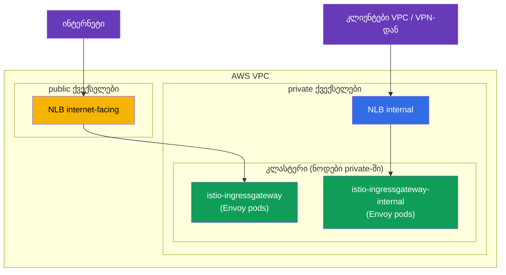
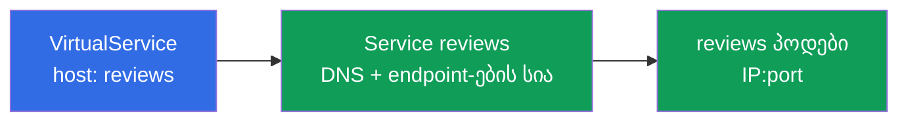
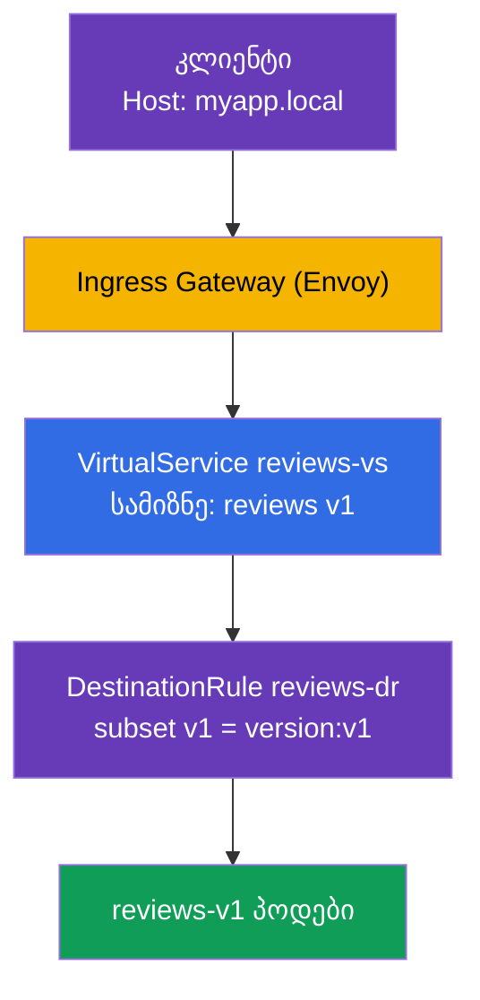

[Русская версия](ru.md) · [Eng version](en.md) · [Versión en español](es.md) · [Version française](fr.md) · [Deutsche Version](de.md) · [繁體中文版](tw.md) · [日本語版](jp.md)

# თავი 5. ტრაფიკის მართვა: Gateway, VirtualService, DestinationRule

> **რა იქნება შემდეგ.** Istio დავაყენეთ და data plane გავარჩიეთ. ახლა იწყება
> ყველაზე საინტერესო და ICA გამოცდის ყველაზე დიდი თემა - ტრაფიკის მართვა (გამოცდის
> დაახლოებით 40%). ამ თავში მარშრუტიზაციის სამ მთავარ რესურსს განვიხილავთ: Gateway,
> VirtualService და DestinationRule. მათ ეფუძნება ყველა მომდევნო თავი canary-ზე,
> სარკისებურ ასახვაზე, მდგრადობასა და egress-ზე.

## 5.1. ტრაფიკის მართვის სამი საყრდენი

Kubernetes-ში შემომავალი ტრაფიკისთვის `Ingress` გქონდათ, ხოლო დაბალანსებისთვის -
`Service`. Istio-ში მარშრუტიზაცია უფრო მოქნილია და ცალკეულ რესურსებადაა დაყოფილი,
რომელთაგან თითოეული თავის ნაწილზეა პასუხისმგებელი.

| რესურსი | რაზეა პასუხისმგებელი | ანალოგია |
|--------|-------------|----------|
| **Gateway** | რას მოუსმინოს mesh-ის საზღვარზე (პორტი, პროტოკოლი, ჰოსტი) | კლასტერში შესასვლელი, როგორც `Ingress` |
| **VirtualService** | სად და რომელი წესებით მიმართოს ტრაფიკი | მარშრუტების ცხრილი |
| **DestinationRule** | რა უქნას ტრაფიკს მიმღებთან (subsets, პოლიტიკები) | დანიშნულების სერვისის პარამეტრები |

არსებობს ასევე `ServiceEntry` (გარე სერვისების რეგისტრაცია) - მას egress-ის შესახებ
მე-11 თავში განვიხილავთ. ჯერჯერობით ამ სამზე გავამახვილოთ ყურადღება.

ლოგიკა მარტივია: **Gateway**-მ საზღვარზე მიიღო ტრაფიკი, **VirtualService**-მა გადაწყვიტა,
სად გაეგზავნა ის, ხოლო **DestinationRule**-მა აღწერა, როგორ უნდა მოექცეს მიმღებს.


## 5.2. Gateway: შესვლის წერტილი

`Gateway` mesh-ის საზღვარზე Envoy-ს (ingress gateway) აკონფიგურირებს - ეუბნება, რომელ
პორტსა და პროტოკოლს მოუსმინოს და რომელი ჰოსტებისთვის მიიღოს მოთხოვნები. Gateway
თავად ტრაფიკს არსად აგზავნის, ის მხოლოდ „კარს“ აღებს.

```yaml
apiVersion: networking.istio.io/v1
kind: Gateway
metadata:
  name: main-gateway
spec:
  selector:
    istio: ingressgateway   # რომელ Envoy pod-ზე გამოვიყენოთ (ingress gateway)
  servers:
  - port:
      number: 80
      name: http
      protocol: HTTP
    hosts:
    - "myapp.local"         # ვიღებთ მოთხოვნებს მხოლოდ ამ ჰოსტისთვის
```

გავარჩიოთ ველები:

- **`selector`** - ირჩევს, Envoy-ის რომელ gateway-ზე უნდა გავრცელდეს ეს კონფიგურაცია.
  ჭდე `istio: ingressgateway` შეესაბამება მე-2 თავში განხილულ
  `istio-ingressgateway` პოდს.
- **`servers`** - რას მოუსმინოს: პორტი `80`, პროტოკოლი `HTTP`.
- **`hosts`** - რომელი ჰოსტებისთვის მიიღოს მოთხოვნები. სხვა `Host`-ის მქონე მოთხოვნა
  უარყოფილი იქნება. თუ ყველაფრის მიღებაა საჭირო, უთითებენ `hosts: ["*"]`.

მნიშვნელოვანია გვესმოდეს: Gateway მხოლოდ პორტს ხსნის და ამბობს: „მზად ვარ
myapp.local-ის ტრაფიკის მისაღებად“. სად გაგზავნოს ის შემდეგ - ამას VirtualService
წყვეტს.

### რამდენიმე ingress gateway: ტრაფიკის განცალკევება

Gateway-ში `selector` მიუთითებს, კონკრეტულად რომელ Envoy gateway-ზე გავრცელდეს წესები.
ნაგულისხმევად ეს ერთი `istio-ingressgateway` gateway-ა (ჭდე
`istio: ingressgateway`). თუმცა gateway შეიძლება **რამდენიმე** იყოს: თქვენ დამატებით
ingress gateway-ებს განათავსებთ - Envoy-ის ცალკეულ Deployment-ებს საკუთარი ჭდეებითა და
საკუთარი Kubernetes Service-ით - და სხვადასხვა ტრაფიკს სხვადასხვა gateway-ზე
მიმართავთ, რისთვისაც `selector`-ში საჭირო ჭდეს უთითებთ.

რატომ არის ეს საჭირო:

- **საჯარო და შიდა ტრაფიკის განცალკევება.** ერთი gateway ინტერნეტს უყურებს, მეორე -
  მხოლოდ შიდა ქსელს; ისინი ერთმანეთს არ კვეთენ.
- **გუნდების/მოიჯარეების იზოლაცია.** თითოეულ გუნდს საკუთარი gateway აქვს თავისი
  ლიმიტებითა და სერტიფიკატებით.
- **განსხვავებული მოთხოვნები.** ცალკე gateway gRPC/TCP-სთვის, TLS-სერტიფიკატების სხვა
  ნაკრებისთვის ან ცალკე მასშტაბირებისთვის.

მეორე gateway შეიძლება IstioOperator-ის მეშვეობით გაიშალოს, თუ კიდევ ერთ ingress
gateway-ს საკუთარი სახელითა და ჭდით დაამატებთ:

```yaml
apiVersion: install.istio.io/v1alpha1
kind: IstioOperator
spec:
  components:
    ingressGateways:
    - name: istio-ingressgateway          # საჯარო (ნაგულისხმევად)
      enabled: true
    - name: istio-ingressgateway-internal # დამატებითი, შიდა
      enabled: true
      label:
        istio: ingressgateway-internal    # საკუთარი ჭდე selector-ისთვის
```

`ingressGateways`-ის თითოეული ჩანაწერი დამოუკიდებელი gateway-ა. `istioctl install`-ის
დროს Istio მისთვის `istio-system` namespace-ში ობიექტების სრულ ნაკრებს ქმნის:

- **Deployment** Envoy-ის პოდებით (სახელი = `name`, აქ
  `istio-ingressgateway-internal`);
- იმავე სახელის **Service** - მისი მეშვეობით ტრაფიკი ამ პოდებზე ხვდება (ტიპი აიღება
  `k8s.service.type`-იდან, ნაგულისხმევად `LoadBalancer`);
- **ServiceAccount**, HPA/PodDisruptionBudget და ა.შ.

`label`-იდან ჭდე (`istio: ingressgateway-internal`) Deployment-ის პოდებს ენიჭება -
სწორედ მისი საშუალებით პოულობს Gateway საჭირო gateway-ს `selector`-ით. gateway-ის
გამოჩენა ასე შეგიძლიათ შეამოწმოთ:

```bash
kubectl -n istio-system get deploy,svc,pod -l istio=ingressgateway-internal
```

```
NAME                                             READY   UP-TO-DATE   AVAILABLE
deployment.apps/istio-ingressgateway-internal    1/1     1            1

NAME                                    TYPE           CLUSTER-IP     EXTERNAL-IP      PORT(S)
service/istio-ingressgateway-internal   LoadBalancer   10.100.5.6     <lb-address>     80:31234/TCP

NAME                                                 READY   STATUS
pod/istio-ingressgateway-internal-6c9f4b8d7-xk2mn    1/1     Running
```

ანუ „gateway“ არის წყვილი: **Deployment (Envoy-ის პოდები) + Service**. თუ Service-ს
`LoadBalancer` ტიპი აქვს, ღრუბელი (ჩვენს შემთხვევაში AWS) მისთვის load balancer-ს
ქმნის და მის მისამართს `EXTERNAL-IP`-ში უთითებს.

ახლა Gateway-ში შეიძლება იმის არჩევა, თუ რომელი gateway მოუსმენს მოცემულ ჰოსტს:

```yaml
# საჯარო აპლიკაცია - გარე gateway-ის მეშვეობით
apiVersion: networking.istio.io/v1
kind: Gateway
metadata:
  name: public-gateway
spec:
  selector:
    istio: ingressgateway            # გარე gateway
  servers:
  - port: { number: 80, name: http, protocol: HTTP }
    hosts: ["shop.example.com"]
---
# შიდა აპლიკაცია - შიდა gateway-ის მეშვეობით
apiVersion: networking.istio.io/v1
kind: Gateway
metadata:
  name: internal-gateway
spec:
  selector:
    istio: ingressgateway-internal   # შიდა gateway
  servers:
  - port: { number: 80, name: http, protocol: HTTP }
    hosts: ["admin.internal"]
```

ამგვარად, ერთი კლასტერი საჯარო და შიდა ტრაფიკსაც სხვადასხვა „კარის“ მეშვეობით
ემსახურება, ხოლო VirtualService საჭირო gateway-ს `gateways` ველით უკავშირდება.

### AWS VPC-ის მაგალითი: public და private ქვექსელები

ტიპური AWS VPC ორი სახის ქვექსელისგან შედგება:

- **public** - აქვს მარშრუტი Internet Gateway-ში და მასში არსებული რესურსები
  ინტერნეტიდან ხელმისაწვდომია;
- **private** - ინტერნეტში პირდაპირი მარშრუტის გარეშე, ხელმისაწვდომია მხოლოდ VPC-ის
  შიგნით (და VPN/Direct Connect-ის მეშვეობით).

AWS-ის load balancer **ქვექსელებში** იქმნება და საჯარო იქნება თუ შიდა, დამოკიდებულია
იმაზე, რომელ ქვექსელებშია განთავსებული:

- `scheme: internet-facing` → load balancer **public** ქვექსელებში თავსდება და საჯარო
  მისამართს იღებს;
- `scheme: internal` → load balancer **private** ქვექსელებში თავსდება და მხოლოდ
  private IP-ებად resolve-დება (ინტერნეტიდან მიუწვდომელია).

load balancer-ების შექმნაზე პასუხისმგებელია [AWS Load Balancer
Controller](https://kubernetes-sigs.github.io/aws-load-balancer-controller/). საჭირო
ქვექსელებს ის ტეგებით პოულობს (მათ, ჩვეულებრივ, კლასტერის ინსტალატორი, მაგალითად
`eksctl`, ანიჭებს):

- public: ტეგი `kubernetes.io/role/elb = 1`;
- private: ტეგი `kubernetes.io/role/internal-elb = 1`;
- დამატებით `kubernetes.io/cluster/<cluster-name> = owned` (ან `shared`).

თუ ქვექსელებს ტეგები არ აქვს ან მათი ცხადად არჩევაა საჭირო, ქვექსელები მიეთითება
ანოტაციით `service.beta.kubernetes.io/aws-load-balancer-subnets`.

განვათავსოთ ორი gateway - ინტერნეტ gateway public ქვექსელებში და შიდა gateway private
ქვექსელებში:

```yaml
apiVersion: install.istio.io/v1alpha1
kind: IstioOperator
spec:
  components:
    ingressGateways:
    # 1) ინტერნეტ-gateway: საჯარო NLB PUBLIC ქვექსელებში
    - name: istio-ingressgateway
      enabled: true
      # ნაგულისხმევი ჭდე istio: ingressgateway
      k8s:
        service:
          type: LoadBalancer
        serviceAnnotations:
          service.beta.kubernetes.io/aws-load-balancer-type: external
          service.beta.kubernetes.io/aws-load-balancer-nlb-target-type: ip
          service.beta.kubernetes.io/aws-load-balancer-scheme: internet-facing
          # ქვექსელების პირდაპირ მითითებაც შეიძლება ტეგების ნაცვლად:
          # service.beta.kubernetes.io/aws-load-balancer-subnets: subnet-pub-a,subnet-pub-b
    # 2) შიდა gateway: პრივატული NLB PRIVATE ქვექსელებში
    - name: istio-ingressgateway-internal
      enabled: true
      label:
        istio: ingressgateway-internal
      k8s:
        service:
          type: LoadBalancer
        serviceAnnotations:
          service.beta.kubernetes.io/aws-load-balancer-type: external
          service.beta.kubernetes.io/aws-load-balancer-nlb-target-type: ip
          service.beta.kubernetes.io/aws-load-balancer-scheme: internal
          # service.beta.kubernetes.io/aws-load-balancer-subnets: subnet-priv-a,subnet-priv-b
```

რას ნიშნავს ანოტაციები:

- **`aws-load-balancer-type`** - ირჩევს, **რომელი კონტროლერი** ქმნის load balancer-ს
  (და არა „ALB თუ NLB“). მნიშვნელობა `external` = თანამედროვე [AWS Load Balancer
  Controller](https://kubernetes-sigs.github.io/aws-load-balancer-controller/), და
  **Service** რესურსისთვის ის ყოველთვის **NLB**-ს (Network Load Balancer, L4) ქმნის.
  შესაძლო მნიშვნელობებია: `external` (AWS LBC → NLB), მოძველებული `nlb-ip` (იგივე AWS
  LBC IP target-ებით), `nlb` (in-tree კონტროლერი → NLB). თუ ანოტაცია საერთოდ არ
  მიეთითება, ჩაშენებული in-tree კონტროლერი ამოქმედდება და მოძველებულ **Classic Load
  Balancer (CLB)**-ს შექმნის - ამიტომ ტიპის მითითება აუცილებელია. ამ ანოტაციას `alb`
  მნიშვნელობა **არ აქვს**: ALB იქმნება არა Service-იდან, არამედ `Ingress` რესურსიდან
  (იხ. ქვემოთ). არ აგერიოთ **ELB**-ში (*Elastic Load Balancing*) - ეს AWS-ის სერვისის
  საერთო სახელია, რომელშიც CLB, ALB და NLB შედის, და არა load balancer-ის ცალკე ტიპი.
- **`aws-load-balancer-nlb-target-type`** - სად გაიგზავნოს ტრაფიკი: `ip` (პირდაპირ
  პოდების IP-ზე VPC CNI-ის მეშვეობით) ან `instance` (ნოდების NodePort-ზე). `ip` უფრო
  ეფექტურია და კლიენტის საწყის IP-ს ინარჩუნებს.
- **`aws-load-balancer-scheme`** - `internet-facing` (public ქვექსელები, საჯარო
  მისამართი) ან `internal` (private ქვექსელები, მხოლოდ VPC-დან).

მთავარი AWS load balancer-ების ტიპების შესახებ Kubernetes-ში: **load balancer-ის ტიპს
Kubernetes რესურსის ტიპი განსაზღვრავს და არა ანოტაციის მნიშვნელობა.**

- **Service (ტიპი `LoadBalancer`) → NLB (L4).** სწორედ ეს არის ingress gateway-ის
  შემთხვევა: NLB უბრალოდ TCP-ს გადასცემს, მარშრუტიზაციას, TLS-სა და mTLS-ს კი თავად
  Istio ასრულებს. Service-იდან ALB-ის შექმნა შეუძლებელია.
- **Ingress → ALB (L7).** ALB მხოლოდ `Ingress` რესურსიდან იქმნება (კლასი
  `ingressClassName: alb` და ანოტაციები `alb.ingress.kubernetes.io/*`), Service-თან
  ამას კავშირი არ აქვს. ALB-ს ზოგჯერ Istio-ს წინ აყენებენ, მაგრამ მაშინ HTTPS-ს თავად
  ის ასრულებს და L7 ლოგიკის ნაწილი mesh-იდან გადის; „სუფთა“ Istio ingress-ისთვის,
  ჩვეულებრივ, NLB-ს იყენებენ. ამ არჩევანის შესახებ უფრო დეტალურად EKS-ზე production
  ინსტალაციის თავებში ვისაუბრებთ.



შედეგი:

- Service `istio-ingressgateway` მიიღებს საჯარო NLB-ს (`EXTERNAL-IP`-ში - საჯარო DNS
  სახელი `*.elb.amazonaws.com`, რომელიც საჯარო IP-ებად resolve-დება). მისი მეშვეობით
  საჯარო აპლიკაციებს (`shop.example.com`) გამოვაქვეყნებთ.
- Service `istio-ingressgateway-internal` მიიღებს **შიდა** NLB-ს (მისამართი მხოლოდ VPC-ის
  private IP-ებად resolve-დება). მისი მეშვეობით შიდა/ადმინისტრაციულ სერვისებს
  (`admin.internal`) მიმართავენ - ინტერნეტიდან ისინი პრინციპულად მიუწვდომელია, რადგან
  მათ gateway-ს საჯარო მისამართი არ აქვს.

ამასთან, ორივე gateway-ის Envoy პოდები, ჩვეულებრივ, private ქვექსელების ნოდებზეა
განთავსებული - ინტერნეტს მხოლოდ საჯარო NLB „უყურებს“ და არა თავად პოდები.

### ACM TLS-სერტიფიკატი პირდაპირ NLB-ზე

შემომავალი HTTPS-ის სერტიფიკატის Istio-ში ატვირთვა აუცილებელი არ არის - შეიძლება
**AWS Certificate Manager (ACM)**-ის მზა სერტიფიკატი პირდაპირ NLB-ს მიებას. ამ
შემთხვევაში TLS load balancer-ზე დასრულდება, ხოლო ACM სერტიფიკატს თავად განაახლებს.
საკმარისია gateway-ის Service-ს ანოტაციები დაემატოს:

```yaml
        serviceAnnotations:
          service.beta.kubernetes.io/aws-load-balancer-type: external
          service.beta.kubernetes.io/aws-load-balancer-scheme: internet-facing
          # ACM-სერტიფიკატი და პორტ(ებ)ი, რომლებზეც NLB ამთავრებს TLS-ს
          service.beta.kubernetes.io/aws-load-balancer-ssl-cert: arn:aws:acm:eu-central-1:123456789012:certificate/xxxxxxxx-xxxx-xxxx
          service.beta.kubernetes.io/aws-load-balancer-ssl-ports: "443"
```

- `aws-load-balancer-ssl-cert` - ACM-ის სერტიფიკატის ARN.
- `aws-load-balancer-ssl-ports` - რომელ პორტებზე მოუსმენს NLB TLS-ს (ჩვეულებრივ,
  `443`); დანარჩენი პორტები (მაგალითად, `80`) ჩვეულებრივ TCP-ად რჩება.

მნიშვნელოვანი ნიუანსია, **სად** სრულდება TLS:

- **TLS NLB-ზე (offload).** NLB ტრაფიკს ACM სერტიფიკატით გაშიფრავს და შემდეგ VPC-ის
  გავლით gateway-მდე უკვე გაშიფრული ტრაფიკი მიდის. უპირატესობა: სერტიფიკატს AWS
  მართავს (ავტომატური განახლება), მისი Istio-ში ატვირთვა საჭირო არ არის. ნაკლი: NLB-სა
  და gateway-ს შორის ტრაფიკი ამ სერტიფიკატით დაცული არ არის (ის მხოლოდ VPC-ის შიგნით
  მოძრაობს) და Istio საწყის TLS-ს ვერ „ხედავს“.
- **Passthrough + TLS Istio-ში.** ალტერნატივა: NLB უბრალოდ TCP-ს გადასცემს
  (`ssl-cert`-ის გარეშე), სერტიფიკატი კი Istio-ში თავსდება და TLS (ან mTLS) უკვე ingress
  gateway-ზე სრულდება. ამ ვარიანტს `Gateway`-ის `SIMPLE`/`MUTUAL`/`PASSTHROUGH`
  რეჟიმებთან ერთად მე-9 თავში განვიხილავთ.

მოკლედ: თუ სერტიფიკატის მართვის AWS-ისთვის გადაცემა და TLS-ის საზღვარზე დასრულება
გსურთ, ACM სერტიფიკატი NLB-ს ანოტაციებით მიაბით; თუ თავად mesh-მდე გამჭოლი TLS/mTLS
გჭირდებათ - ის Istio-ში დაასრულეთ (თავი 9).

## 5.3. VirtualService: მარშრუტიზაციის წესები

`VirtualService` მარშრუტიზაციის ცენტრალური რესურსია. ის აღწერს, როგორ მიდის ტრაფიკი
კონკრეტულ სერვისამდე: რომელი ჰოსტით, რა პირობებით და რომელ მიმღებთან უნდა გაიგზავნოს.

```yaml
apiVersion: networking.istio.io/v1
kind: VirtualService
metadata:
  name: reviews-vs
spec:
  hosts:
  - "myapp.local"      # რომელი ჰოსტისთვის მოქმედებს წესები
  gateways:
  - main-gateway       # რომელი Gateway-ის გავლით მოვიდა ტრაფიკი
  http:
  - route:
    - destination:
        host: reviews  # დანიშნულების Kubernetes Service
        subset: v1     # pod-ების რომელი ჯგუფი (აღწერილია DestinationRule-ში)
```

ძირითადი ველები:

- **`hosts`** - რომელი ჰოსტისთვის მოქმედებს წესები. ეს შეიძლება იყოს გარე ჰოსტი
  (როგორც `myapp.local`) ან შიდა სერვისის სახელი.
- **`gateways`** - საიდან მოვიდა ტრაფიკი. აქ `main-gateway` ნიშნავს „ტრაფიკი გარედან,
  ჩვენი ingress-ის გავლით“. არსებობს სპეციალური მნიშვნელობა `mesh` შიდაკლასტერული
  ტრაფიკისთვის - მას 5.6 განყოფილებაში განვიხილავთ.
- **`http`** - მარშრუტიზაციის წესების სია; მუშავდება ზემოდან ქვემოთ და პირველი
  შესაფერისი წესი ამოქმედდება.
- **`destination.host`** - Kubernetes Service-ის სახელი, სადაც ტრაფიკი უნდა გაიგზავნოს.
- **`destination.subset`** - პოდების კონკრეტული ჯგუფი სერვისის შიგნით (მაგალითად,
  მხოლოდ v1 ვერსია). ეს subsets DestinationRule-ში აღიწერება.

VirtualService-ს გაცილებით მეტი შეუძლია: მარშრუტიზაცია სათაურების მიხედვით, წონებით
განაწილება, სარკისებური ასახვა, timeout-ები და retry-ები. ამ ყველაფერს მომდევნო თავებში
განვიხილავთ, ახლა კი მნიშვნელოვანია საბაზისო როლის გაგება - „სად მივმართოთ“.

## 5.4. DestinationRule: subsets და პოლიტიკები

ზემოთ მოყვანილ მაგალითში `VirtualService` მიუთითებს `subset: v1`-ზე. მაგრამ საიდან
იცის Istio-მ, რა არის v1? ამას `DestinationRule` აღწერს.

```yaml
apiVersion: networking.istio.io/v1
kind: DestinationRule
metadata:
  name: reviews-dr
spec:
  host: reviews          # რომელი სერვისისთვის
  subsets:
  - name: v1
    labels:
      version: v1        # v1 = pod-ები ჭდით version=v1
  - name: v2
    labels:
      version: v2
```

- **`host`** - Kubernetes Service, რომელსაც წესი ეხება.
- **`subsets`** - პოდების ლოგიკური ჯგუფები ერთი სერვისის შიგნით. თითოეული subset
  ჭდეების ნაკრებით განისაზღვრება. Subset `v1` არის `reviews` სერვისის ყველა პოდი,
  რომელსაც `version: v1` ჭდე აქვს.

რატომ არის ეს საჭირო: `reviews` სერვისს შეიძლება რამდენიმე ვერსია (v1, v2, v3) ჰქონდეს
და ყველა ერთი Kubernetes Service-ის ქვეშ იყოს. ტრაფიკის კონკრეტულად v1-ზე
მისამართად Istio-ს v1 პოდების v2 პოდებისგან გარჩევა უნდა შეეძლოს. Subsets სწორედ ეს
მექანიზმია.

Subsets-ის გარდა DestinationRule-ში მიმღებისკენ მიმართული **ტრაფიკის პოლიტიკებიც**
განისაზღვრება: დაბალანსების ალგორითმი, კავშირების pool-ის პარამეტრები, circuit
breaking, mTLS რეჟიმი. მათ მე-7, მე-8 და მე-12 თავებში განვიხილავთ.

## 5.5. როგორ უკავშირდება ეს Kubernetes Service-ს

ხშირი კითხვაა: თუ VirtualService და DestinationRule არსებობს, ჩვეულებრივი Kubernetes
Service საერთოდ რისთვისაა საჭირო? და როგორ უკავშირდებიან ისინი ერთმანეთს?
განვიხილოთ, რადგან ეს მთელი მარშრუტიზაციის გაგების გასაღებია.

მთავარი: **VirtualService Kubernetes Service-ს არ ცვლის, არამედ მის ზედა ფენად მუშაობს.**

- VirtualService-ის `destination.host` ველი (და DestinationRule-ის `host`) მიუთითებს
  **Kubernetes Service-ის სახელზე** (მოკლე სახელზე ან FQDN-ზე, როგორიცაა
  `reviews.default.svc.cluster.local`).
- Istio ამ Service-იდან endpoint-ების - პოდების რეალური IP-ების - სიას იღებს. ეს იგივე
  service discovery-ა, რაც ჩვეულებრივ Kubernetes-ში: Service-მა თავისი `selector`-ით
  იცის, რომელი პოდები დგას მის უკან. Istio ამ ინფორმაციას ხელახლა იყენებს.
- **VirtualService მხოლოდ იჭერს** ამ ჰოსტზე მიმავალ ტრაფიკს და წყვეტს, სად და რა
  წესებით მიმართოს ის (რომელ subset-ში, რა წონებით). მოთხოვნის კონკრეტულ პოდებზე
  ფიზიკურად გაგზავნა კი Envoy-ის საქმეა და ამისთვის ის სწორედ Kubernetes Service-ის
  endpoint-ებს იყენებს.
- DestinationRule-ის **subset** იმავე Service-ის პოდების ქვესიმრავლეა, რომელიც
  დამატებითი ჭდეებით (მაგალითად, `version: v1`) შეირჩევა. subset-ის პოდები Service-ის
  `selector`-ს აუცილებლად უნდა შეესაბამებოდეს, წინააღმდეგ შემთხვევაში ისინი მასში
  უბრალოდ არ იქნება.



დასკვნა: Kubernetes Service კვლავ აუცილებელია - ის DNS სახელსა და პოდების სიას
გვაძლევს. მის გარეშე Istio-ს არ ეცოდინებოდა, სად გაეგზავნა ტრაფიკი ფიზიკურად.
VirtualService და DestinationRule დაშენებული ფენაა: ისინი აღწერს არა „სად არიან
პოდები“, არამედ „ზუსტად როგორ განაწილდეს ტრაფიკი მათ შორის“. ამიტომ რეალურ აპლიკაციაში
ყოველთვის ჯერ ჩვეულებრივ Service-ს ქმნით და მხოლოდ შემდეგ ავრცელებთ მასზე Istio-ს
წესებს.

## 5.6. როგორ მუშაობს სამი რესურსი ერთად

ყველაფერი ერთ სურათად შევკრათ გარედან `reviews` სერვისისკენ გაგზავნილი მოთხოვნის
მაგალითზე.



ნაბიჯ-ნაბიჯ:

1. კლიენტი ingress gateway-ზე მოთხოვნას `Host: myapp.local` სათაურით აგზავნის.
2. **Gateway**-მ gateway-ს უკვე უთხრა, რომ `myapp.local:80`-ს მოუსმინოს - მოთხოვნა
   მიიღება.
3. **VirtualService** ხედავს, რომ `myapp.local`-ისთვის `main-gateway`-ის გავლით მოსული
   ტრაფიკი `reviews` სერვისის `v1` subset-ზე უნდა გაიგზავნოს.
4. **DestinationRule** განმარტავს, რომ subset `v1` არის პოდები ჭდით `version: v1`.
5. ტრაფიკი `reviews-v1` პოდებზე მიდის.

ამ სამი რესურსიდან რომელიმეს ამოღებისას ჯაჭვი გაწყდება: Gateway-ის გარეშე ტრაფიკი ვერ
შემოვა, VirtualService-ის გარეშე gateway-ს არ ეცოდინება, სად გაგზავნოს ის, ხოლო
DestinationRule-ის გარეშე Istio ვერ გაიგებს, რას ნიშნავს `subset: v1`.

## 5.7. შიდა ტრაფიკი და gateway „mesh“

აქამდე გარე ტრაფიკზე ვსაუბრობდით. მაგრამ VirtualService-ს შეუძლია მართოს ტრაფიკი
კლასტერის **შიგნითაც** (როდესაც ერთი პოდი მეორეს მიმართავს). ამისთვის არსებობს
სპეციალური მნიშვნელობა `gateways: [mesh]`.

`mesh` დარეზერვებული სიტყვაა, რომელიც ნიშნავს „mesh-ის შიგნით არსებული ყველა
sidecar“. შევადაროთ ორი შემთხვევა:

- `gateways: [main-gateway]` - წესები მოქმედებს გარედან ingress gateway-ის გავლით
  შემოსულ ტრაფიკზე.
- `gateways: [mesh]` - წესები მოქმედებს შიდაკლასტერულ ტრაფიკზე (pod-to-pod).

ხშირად `hosts`-ში ერთდროულად ორივე ვარიანტს - გარე ჰოსტსა და სერვისის სახელს -
უთითებენ, ხოლო `gateways`-ში `main-gateway`-საც და `mesh`-საც ჩამოთვლიან, რათა ერთი და
იგივე წესები გარედანაც და შიგნიდანაც მუშაობდეს:

```yaml
spec:
  hosts:
  - "myapp.local"    # გარე ტრაფიკი
  - "reviews"        # შიდა ტრაფიკი (სერვისის სახელით)
  gateways:
  - main-gateway     # გარედან
  - mesh             # შიგნიდან
```

თუ `gateways` საერთოდ არ არის მითითებული, ნაგულისხმევად `mesh` იგულისხმება, ანუ წესები
მხოლოდ შიდაკლასტერულ ტრაფიკზე ვრცელდება.

## 5.8. ხშირი შეცდომები

ეს ხაფანგები გამოცდაზეც გვხვდება და რეალურ სამუშაოშიც.

- **არასწორი `selector` Gateway-ში.** `selector`-ში არსებული ჭდე ingress gateway-ის
  პოდის ჭდეებს უნდა ემთხვეოდეს. თუ `istio: ingressgateway`-ის ნაცვლად
  `istio: gateway`-ს დაწერთ, ტრაფიკი უბრალოდ არ მიიღება.
- **`subset` DestinationRule-ში გამოგრჩათ.** VirtualService მიუთითებს `subset: v1`-ზე,
  DestinationRule-ში კი ასეთი subset არ არის - ტრაფიკი არ წავა. subsets-ის სახელები
  უნდა ემთხვეოდეს.
- **ჰოსტები namespace-ებს შორის ტრაფიკისთვის.** სხვა namespace-ში არსებულ სერვისთან
  დასაკავშირებლად VirtualService-ის `hosts`-ში უმჯობესია მოკლე სახელიც და სრული FQDN-იც
  მიუთითოთ:

  ```yaml
  hosts:
    - reviews
    - reviews.default.svc.cluster.local
  ```

- **`mesh` gateways-ში გამოგრჩათ.** თუ გსურთ, წესებმა შიდაკლასტერული ტრაფიკისთვისაც
  იმუშაოს, `gateways`-ში აუცილებლად დაამატეთ `mesh`. წინააღმდეგ შემთხვევაში ისინი
  მხოლოდ გარე ტრაფიკისთვის ამოქმედდება.

## 5.9. თავის შეჯამება

- Istio-ში ტრაფიკის მართვა სამ რესურსს ეფუძნება: Gateway, VirtualService,
  DestinationRule.
- **Gateway** mesh-ის საზღვარზე პორტს ხსნის და ამბობს, რომელი ჰოსტები მიიღოს; ტრაფიკს
  თავად არ მიმართავს.
- Ingress gateway შეიძლება **რამდენიმე** იყოს: IstioOperator-ში `ingressGateways`-ის
  თითოეული ჩანაწერი საკუთარი Deployment (Envoy-ის პოდები) + Service-ია, ხოლო
  სხვადასხვა `selector` ჭდით ტრაფიკი სხვადასხვა gateway-ზე ნაწილდება (მაგალითად,
  საჯარო და შიდა gateway-ზე).
- AWS-ზე load balancer-ის ტიპს განსაზღვრავს ანოტაცია
  `aws-load-balancer-type: external` (AWS LB Controller → NLB; მის გარეშე - მოძველებული
  Classic LB), ხოლო scheme განსაზღვრავს, სად იქმნება ის: `internet-facing` public
  ქვექსელებში (საჯარო მისამართი) ან `internal` private ქვექსელებში (მხოლოდ VPC/VPN-დან).
  ქვექსელები ტეგებით ან `aws-load-balancer-subnets` ანოტაციით შეირჩევა. ALB (L7)
  Ingress-ისთვის იქმნება და არა Service-ისთვის.
- TLS შეიძლება პირდაპირ NLB-ზე დასრულდეს ACM-ის მზა სერტიფიკატით (ანოტაციები
  `aws-load-balancer-ssl-cert` + `aws-load-balancer-ssl-ports`) - AWS მას თავად
  განაახლებს; ან შეიძლება passthrough-ის გამოყენება და TLS/mTLS-ის Istio-ში დასრულება
  (თავი 9).
- **VirtualService** წყვეტს, სად და რომელი წესებით მიმართოს ტრაფიკი (ჰოსტი, პირობები,
  destination).
- **DestinationRule** აღწერს subsets-ს (პოდების ჯგუფებს ჭდეების მიხედვით) და მიმღების
  პოლიტიკებს.
- DestinationRule-ის subsets VirtualService-ს პოდების კონკრეტულ ვერსიებთან აკავშირებს.
- VirtualService Kubernetes Service-ს არ ცვლის, არამედ მის ზედა ფენად მუშაობს:
  `destination.host`-ში არსებული სახელი Service-ია, საიდანაც Istio endpoint-ებს
  (პოდების IP-ებს) იღებს.
- მნიშვნელობა `gateways: [mesh]` წესებს შიდაკლასტერული ტრაფიკისთვის რთავს; თუ gateways
  მითითებული არ არის, სწორედ `mesh` იგულისხმება.
- ხშირი შეცდომებია: არასწორი selector, subsets-ის სახელების შეუსაბამობა, hosts-ში
  FQDN-ის არქონა, გამორჩენილი `mesh`.

## 5.10. თვითშემოწმების კითხვები

1. რაზეა პასუხისმგებელი სამი რესურსიდან თითოეული: Gateway, VirtualService,
   DestinationRule?
2. რა მოხდება, თუ VirtualService მიუთითებს subset-ზე, რომელიც DestinationRule-ში არ
   არსებობს?
3. რისთვის არის საჭირო subsets და როგორ უკავშირდება ისინი პოდების ჭდეებს?
4. რით განსხვავდება `gateways: [main-gateway]` და `gateways: [mesh]`?
5. რატომ ღირს namespace-ებს შორის ტრაფიკისთვის hosts-ში FQDN-ის მითითება?
6. რატომ არის საჭირო ჩვეულებრივი Kubernetes Service, თუ VirtualService არსებობს?
   როგორ უკავშირდებიან ისინი ერთმანეთს?
7. როგორ უნდა გაიშალოს რამდენიმე ingress gateway და როგორ უნდა მიემართოს მათზე
   სხვადასხვა ტრაფიკი? როგორ გავხადოთ AWS-ზე ერთი gateway საჯარო, ხოლო მეორე - მხოლოდ
   VPC-დან ხელმისაწვდომი?

## პრაქტიკა

გაიარეთ ლაბორატორიული სამუშაო: ნულიდან გამართეთ Gateway, VirtualService და
DestinationRule, დაყავით ტრაფიკი სერვისის ვერსიებისა და HTTP სათაურის მიხედვით.

🧪 ლაბორატორიული სამუშაო 02: [tasks/ica/labs/02](../../labs/02/README_GE.MD)

---
[სარჩევი](../README_GE.md) · [თავი 4](../04/ge.md) · [თავი 6](../06/ge.md)