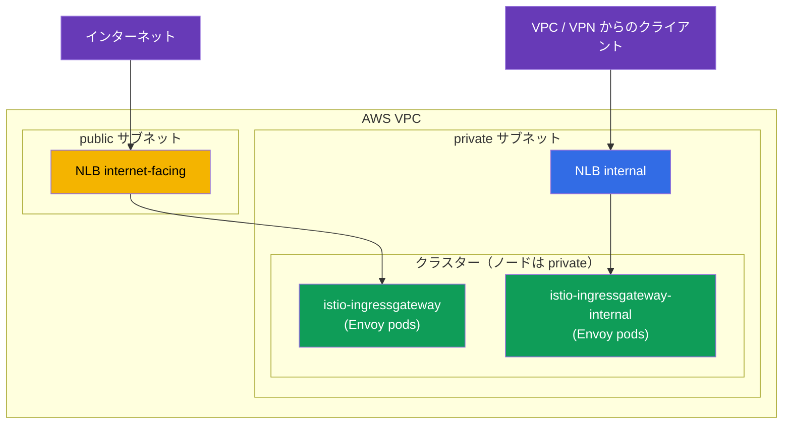
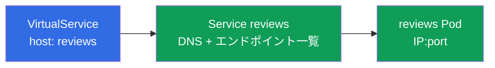
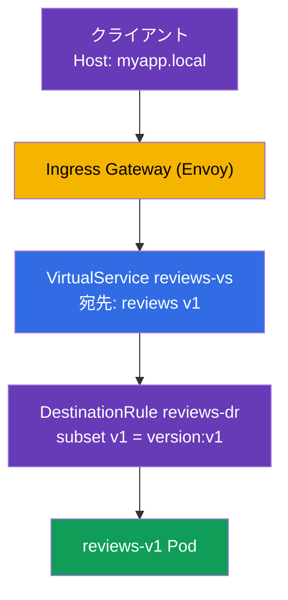

[Русская версия](ru.md) · [Eng version](en.md) · [Versión en español](es.md) · [Version française](fr.md) · [Deutsche Version](de.md) · [ქართული ვერსია](ge.md) · [繁體中文版](tw.md)

# 第5章。トラフィック管理: Gateway、VirtualService、DestinationRule

> **次は何か。** Istio をインストールし、data plane を理解しました。ここから最も興味深く、ICA 試験で最大のテーマであるトラフィック管理（試験のおよそ 40%）が始まります。この章では、3 つの主要なルーティングリソース、Gateway、VirtualService、DestinationRule を扱います。以降の canary、ミラーリング、レジリエンス、egress に関する章はすべてこれらに基づいています。

## 5.1. トラフィック管理の三本柱

Kubernetes には、受信トラフィックのための `Ingress` と、負荷分散のための `Service` がありました。Istio ではルーティングはより柔軟で、役割ごとに別々のリソースへ分割されています。

| リソース | 担当すること | たとえ |
|--------|-------------|----------|
| **Gateway** | mesh 境界で何をリッスンするか（ポート、プロトコル、ホスト） | `Ingress` のような、クラスターへの入口 |
| **VirtualService** | トラフィックをどこへ、どのルールで送るか | ルーティングテーブル |
| **DestinationRule** | 受信側でトラフィックをどう扱うか（subsets、ポリシー） | 宛先サービスの設定 |

`ServiceEntry`（外部サービスの登録）もあります。これは egress を扱う第 11 章で説明します。まずはこの 3 つに集中しましょう。

ロジックは単純です。**Gateway** が境界でトラフィックを受け取り、**VirtualService** が送信先を決め、**DestinationRule** が受信側の扱い方を記述します。


## 5.2. Gateway: 入口

`Gateway` は mesh 境界（ingress gateway）の Envoy を設定します。どのポートとプロトコルをリッスンし、どのホストへのリクエストを受け付けるかを指定します。Gateway 自体はトラフィックをどこにも送信せず、「ドア」を開けるだけです。

```yaml
apiVersion: networking.istio.io/v1
kind: Gateway
metadata:
  name: main-gateway
spec:
  selector:
    istio: ingressgateway   # どの Envoy Pod に適用するか (ingress gateway)
  servers:
  - port:
      number: 80
      name: http
      protocol: HTTP
    hosts:
    - "myapp.local"         # このホスト宛てのリクエストのみ受け付ける
```

フィールドを見ていきましょう。

- **`selector`** - この設定を適用する Envoy gateway を選びます。ラベル `istio: ingressgateway` は第 2 章の `istio-ingressgateway` Pod に対応します。
- **`servers`** - リッスン対象です。ポート `80`、プロトコル `HTTP`。
- **`hosts`** - リクエストを受け付けるホストです。別の `Host` を持つリクエストは拒否されます。すべてを受け付けたい場合は `hosts: ["*"]` を指定します。

重要なのは、Gateway はポートを開き「myapp.local 宛てのトラフィックを受け取る準備ができた」と言うだけだということです。その後どこへ送るかは VirtualService が決めます。

### 複数の ingress gateway: トラフィックの分離

Gateway の `selector` は、どの Envoy gateway にルールを適用するかを示します。デフォルトでは `istio-ingressgateway`（ラベル `istio: ingressgateway`）という 1 つの gateway です。しかし gateway は**複数**にできます。追加の ingress gateway、すなわち独自のラベルと Kubernetes Service を持つ別個の Envoy Deployment をデプロイし、`selector` に必要なラベルを指定して異なるトラフィックを別々の gateway に送ります。

その必要性は次のとおりです。

- **公開トラフィックと内部トラフィックの分離。** 一方の gateway はインターネットに面し、もう一方は内部ネットワークだけに面します。両者は交差しません。
- **チーム／テナントの分離。** 各チームは独自の制限と証明書を持つ専用 gateway を使用できます。
- **異なる要件。** gRPC/TCP 用、別セットの TLS 証明書用、または個別のスケーリング用に gateway を分けられます。

2 つ目の gateway は、IstioOperator に独自の名前とラベルを持つ ingress gateway を追加してデプロイできます。

```yaml
apiVersion: install.istio.io/v1alpha1
kind: IstioOperator
spec:
  components:
    ingressGateways:
    - name: istio-ingressgateway          # 公開用 (デフォルト)
      enabled: true
    - name: istio-ingressgateway-internal # 追加用、内部向け
      enabled: true
      label:
        istio: ingressgateway-internal    # selector 用の独自ラベル
```

`ingressGateways` の各エントリーは独立した gateway です。`istioctl install` を実行すると、Istio は namespace `istio-system` にそのための完全なオブジェクト一式を作成します。

- Envoy Pod を持つ **Deployment**（名前は `name`、ここでは `istio-ingressgateway-internal`）。
- 同名の **Service**。トラフィックはこれを通じて Pod に到達します（タイプは `k8s.service.type`、デフォルトは `LoadBalancer`）。
- **ServiceAccount**、HPA/PodDisruptionBudget など。

`label` のラベル（`istio: ingressgateway-internal`）は Deployment の Pod に付与されます。Gateway はまさにこのラベルで `selector` を通じて必要な gateway を見つけます。gateway が作成されたかは次で確認できます。

```bash
kubectl -n istio-system get deploy,svc,pod -l istio=ingressgateway-internal
```

```
NAME                                             READY   UP-TO-DATE   AVAILABLE
deployment.apps/istio-ingressgateway-internal    1/1     1            1

NAME                                    TYPE           CLUSTER-IP     EXTERNAL-IP      PORT(S)
service/istio-ingressgateway-internal   LoadBalancer   10.100.5.6     <lb-address>     80:31234/TCP

NAME                                                 READY   STATUS
pod/istio-ingressgateway-internal-6c9f4b8d7-xk2mn    1/1     Running
```

つまり「gateway」とは **Deployment（Envoy Pod）+ Service** の組み合わせです。Service のタイプが `LoadBalancer` なら、クラウド（ここでは AWS）がそのためのロードバランサーを作成し、アドレスを `EXTERNAL-IP` に設定します。

次に Gateway で、どの gateway が特定のホストをリッスンするか選べます。

```yaml
# 公開アプリケーション - 外部 gateway 経由
apiVersion: networking.istio.io/v1
kind: Gateway
metadata:
  name: public-gateway
spec:
  selector:
    istio: ingressgateway            # 外部 gateway
  servers:
  - port: { number: 80, name: http, protocol: HTTP }
    hosts: ["shop.example.com"]
---
# 内部アプリケーション - 内部 gateway 経由
apiVersion: networking.istio.io/v1
kind: Gateway
metadata:
  name: internal-gateway
spec:
  selector:
    istio: ingressgateway-internal   # 内部 gateway
  servers:
  - port: { number: 80, name: http, protocol: HTTP }
    hosts: ["admin.internal"]
```

このように、1 つのクラスターで公開トラフィックと内部トラフィックを異なる「ドア」から処理でき、VirtualService は `gateways` フィールドで必要な gateway に関連付けられます。

### AWS VPC の例: public と private サブネット

一般的な AWS VPC には 2 種類のサブネットがあります。

- **public** - Internet Gateway へのルートがあり、その中のリソースはインターネットから利用できます。
- **private** - インターネットへの直接ルートがなく、VPC 内部（および VPN/Direct Connect 経由）からのみ利用できます。

AWS のロードバランサーは**サブネット内に**作成され、どのサブネットに置かれるかで公開か内部かが決まります。

- `scheme: internet-facing` → ロードバランサーは **public** サブネットに配置され、公開アドレスを取得します。
- `scheme: internal` → ロードバランサーは **private** サブネットに配置され、private IP にのみ名前解決されます（インターネットからはアクセスできません）。

ロードバランサーの作成を担うのは [AWS Load Balancer Controller](https://kubernetes-sigs.github.io/aws-load-balancer-controller/) です。必要なサブネットはタグで検出します（通常は `eksctl` などのクラスターインストーラーが設定します）。

- public: タグ `kubernetes.io/role/elb = 1`。
- private: タグ `kubernetes.io/role/internal-elb = 1`。
- さらに `kubernetes.io/cluster/<cluster-name> = owned`（または `shared`）。

サブネットにタグがない、または明示的に選択したい場合は、`service.beta.kubernetes.io/aws-load-balancer-subnets` アノテーションで指定します。

2 つの gateway をデプロイします。public サブネットのインターネット gateway と private サブネットの内部 gateway です。

```yaml
apiVersion: install.istio.io/v1alpha1
kind: IstioOperator
spec:
  components:
    ingressGateways:
    # 1) インターネット gateway: PUBLIC サブネットの公開 NLB
    - name: istio-ingressgateway
      enabled: true
      # デフォルトラベル istio: ingressgateway
      k8s:
        service:
          type: LoadBalancer
        serviceAnnotations:
          service.beta.kubernetes.io/aws-load-balancer-type: external
          service.beta.kubernetes.io/aws-load-balancer-nlb-target-type: ip
          service.beta.kubernetes.io/aws-load-balancer-scheme: internet-facing
          # タグの代わりにサブネットを明示的に指定することもできる:
          # service.beta.kubernetes.io/aws-load-balancer-subnets: subnet-pub-a,subnet-pub-b
    # 2) 内部 gateway: PRIVATE サブネットのプライベート NLB
    - name: istio-ingressgateway-internal
      enabled: true
      label:
        istio: ingressgateway-internal
      k8s:
        service:
          type: LoadBalancer
        serviceAnnotations:
          service.beta.kubernetes.io/aws-load-balancer-type: external
          service.beta.kubernetes.io/aws-load-balancer-nlb-target-type: ip
          service.beta.kubernetes.io/aws-load-balancer-scheme: internal
          # service.beta.kubernetes.io/aws-load-balancer-subnets: subnet-priv-a,subnet-priv-b
```

アノテーションの意味は次のとおりです。

- **`aws-load-balancer-type`** - ロードバランサーをプロビジョニングする**コントローラー**を選択します（「ALB か NLB か」を選ぶものではありません）。値 `external` は新しい [AWS Load Balancer Controller](https://kubernetes-sigs.github.io/aws-load-balancer-controller/) を表し、**Service** リソースでは常に **NLB**（Network Load Balancer、L4）を作成します。使用可能な値は `external`（AWS LBC → NLB）、非推奨の `nlb-ip`（IP ターゲットを使う同じ AWS LBC）、`nlb`（in-tree controller → NLB）です。このアノテーションをまったく設定しないと組み込みの in-tree controller が動作し、古い **Classic Load Balancer (CLB)** を作成するため、タイプを指定する必要があります。このアノテーションに `alb` という値は**ありません**。ALB は Service ではなく `Ingress` リソースから作成されます（後述）。**ELB** (*Elastic Load Balancing*) と混同しないでください。これは個別のロードバランサー種別ではなく、CLB、ALB、NLB を含む AWS サービス全体の名称です。
- **`aws-load-balancer-nlb-target-type`** - トラフィックの送信先です。`ip`（VPC CNI 経由で Pod IP に直接）または `instance`（Node の NodePort）を選びます。`ip` はより効率的で、元のクライアント IP を保持します。
- **`aws-load-balancer-scheme`** - `internet-facing`（public サブネット、公開アドレス）または `internal`（private サブネット、VPC 内のみ）です。

Kubernetes 上の AWS ロードバランサー種別について最も重要な点は、**ロードバランサーの種別はアノテーションの値ではなく、Kubernetes リソースの種別で決まる**ことです。

- **Service (type `LoadBalancer`) → NLB (L4)。** これが ingress gateway のケースです。NLB は TCP を単に転送し、ルーティング、TLS、mTLS は Istio 自身が行います。Service から ALB を作成することはできません。
- **Ingress → ALB (L7)。** ALB は `Ingress` リソース（`ingressClassName: alb` と `alb.ingress.kubernetes.io/*` アノテーション）からのみプロビジョニングされ、Service とは関係ありません。Istio の前段に ALB を置くこともありますが、その場合 ALB 自身が HTTPS を終端し、L7 ロジックの一部が mesh の外へ出ます。「純粋な」Istio ingress では通常 NLB を選びます。この選択については EKS の本番インストールに関する章で詳しく説明します。



結果は次のとおりです。

- Service `istio-ingressgateway` は公開 NLB を取得します（`EXTERNAL-IP` は公開 DNS 名 `*.elb.amazonaws.com` で、公開 IP に名前解決されます）。これを通じて公開アプリケーション（`shop.example.com`）を公開します。
- Service `istio-ingressgateway-internal` は**内部** NLB を取得します（アドレスは VPC の private IP にのみ名前解決されます）。内部／管理用サービス（`admin.internal`）はこれを通じてアクセスされ、gateway に公開アドレスがないため、原理的にインターネットからアクセスできません。

両方の gateway の Envoy Pod 自体は通常 private サブネットの Node 上で動作します。インターネットに「面する」のは公開 NLB だけで、Pod 自体ではありません。

### NLB に直接付与する ACM TLS 証明書

受信 HTTPS の証明書を必ずしも Istio にロードする必要はありません。**AWS Certificate Manager (ACM)** の既成証明書を NLB に直接付与できます。この場合 TLS はロードバランサーで終端され、ACM が証明書を自動更新します。gateway の Service にアノテーションを追加するだけです。

```yaml
        serviceAnnotations:
          service.beta.kubernetes.io/aws-load-balancer-type: external
          service.beta.kubernetes.io/aws-load-balancer-scheme: internet-facing
          # ACM 証明書と、NLB が TLS を終端するポート
          service.beta.kubernetes.io/aws-load-balancer-ssl-cert: arn:aws:acm:eu-central-1:123456789012:certificate/xxxxxxxx-xxxx-xxxx
          service.beta.kubernetes.io/aws-load-balancer-ssl-ports: "443"
```

- `aws-load-balancer-ssl-cert` - ACM の証明書 ARN です。
- `aws-load-balancer-ssl-ports` - NLB が TLS をリッスンするポート（通常は `443`）です。その他のポート（たとえば `80`）は通常の TCP のままです。

重要な注意点は、TLS を**どこで**終端するかです。

- **NLB で TLS（offload）。** NLB が ACM 証明書でトラフィックを復号し、VPC 内の gateway までには復号済みトラフィックが届きます。利点は、AWS が証明書を管理（自動更新）し、Istio にロードする必要がないことです。欠点は、NLB と gateway 間のトラフィックはこの証明書で保護されないこと（VPC 内のみ）と、Istio が元の TLS を「見ない」ことです。
- **Passthrough + Istio の TLS。** 代替として、NLB は `ssl-cert` なしで TCP を単純に転送し、証明書を Istio に配置します。TLS（または mTLS）は ingress gateway で終端されます。`Gateway` の `SIMPLE`/`MUTUAL`/`PASSTHROUGH` モードを使うこの方式は第 9 章で説明します。

要するに、証明書管理を AWS に任せてエッジで TLS を終端したいなら NLB に ACM 証明書をアノテーションで付与します。mesh 自体までエンドツーエンドの TLS/mTLS が必要なら Istio で終端します（第 9 章）。

## 5.3. VirtualService: ルーティングルール

`VirtualService` はルーティングの中心となるリソースです。どのホスト、どの条件で、どの宛先にトラフィックを送るか、すなわち特定サービスにトラフィックが到達する方法を記述します。

```yaml
apiVersion: networking.istio.io/v1
kind: VirtualService
metadata:
  name: reviews-vs
spec:
  hosts:
  - "myapp.local"      # どのホストに対してルールが有効か
  gateways:
  - main-gateway       # どの Gateway 経由で来たトラフィックか
  http:
  - route:
    - destination:
        host: reviews  # 宛先の Kubernetes Service
        subset: v1     # どの Pod グループか (DestinationRule に記述)
```

主なフィールドは次のとおりです。

- **`hosts`** - ルールを適用するホストです。`myapp.local` のような外部ホストでも、内部サービス名でもかまいません。
- **`gateways`** - トラフィックの到来元です。ここでの `main-gateway` は「外部から当社の ingress を経由したトラフィック」を意味します。クラスタ内トラフィック用には特別な値 `mesh` があり、第 5.6 節で扱います。
- **`http`** - ルーティングルールのリストです。上から下へ処理され、最初に一致したルールが適用されます。
- **`destination.host`** - トラフィックを送る Kubernetes Service の名前です。
- **`destination.subset`** - サービス内の特定の Pod グループ（たとえば v1 のみ）です。これらの subsets は DestinationRule に記述します。

VirtualService にはさらに多くの機能があります。ヘッダーによるルーティング、重み付き分配、ミラーリング、タイムアウト、リトライなどです。これらは後の章で扱いますが、まずは「どこへ送るか」という基本的な役割を理解してください。

## 5.4. DestinationRule: subsets とポリシー

上の例の `VirtualService` は `subset: v1` を参照しています。しかし Istio は v1 が何かをどう知るのでしょうか。それを記述するのが `DestinationRule` です。

```yaml
apiVersion: networking.istio.io/v1
kind: DestinationRule
metadata:
  name: reviews-dr
spec:
  host: reviews          # どのサービス向けか
  subsets:
  - name: v1
    labels:
      version: v1        # v1 = version=v1 ラベルを持つ Pod
  - name: v2
    labels:
      version: v2
```

- **`host`** - ルールが属する Kubernetes Service です。
- **`subsets`** - 1 つのサービス内の論理的な Pod グループです。各 subset はラベルの組み合わせで定義されます。subset `v1` は `version: v1` ラベルを持つ `reviews` サービスの全 Pod です。

これが必要な理由は、`reviews` サービスには v1、v2、v3 のように複数のバージョンがあり、すべてが 1 つの Kubernetes Service 配下に置かれるためです。トラフィックを v1 にだけ送るには、Istio が v1 Pod と v2 Pod を区別できなければなりません。subsets がその仕組みです。

DestinationRule では subsets に加え、受信側への**トラフィックポリシー**も設定します。負荷分散アルゴリズム、コネクションプール設定、circuit breaking、mTLS モードです。これらは第 7、8、12 章で扱います。

## 5.5. Kubernetes Service との関係

よくある疑問です。VirtualService と DestinationRule があるなら、通常の Kubernetes Service はなぜ必要なのでしょうか。両者はどう関係するのでしょうか。これはルーティング全体を理解する鍵なので確認しましょう。

結論は、**VirtualService は Kubernetes Service を置き換えるのではなく、その上で動作する**ということです。

- VirtualService の `destination.host`（および DestinationRule の `host`）フィールドは、**Kubernetes Service の名前**（短縮名または `reviews.default.svc.cluster.local` のような FQDN）を指します。
- Istio はこの Service からエンドポイント、すなわち実際の Pod IP の一覧を取得します。これは通常の Kubernetes と同じ service discovery です。Service は自身の `selector` により配下の Pod を認識し、Istio はこの情報を再利用します。
- **VirtualService は、**このホストへ向かうトラフィックを**インターセプトするだけで、**どこへ、どのルールで送るか（どの subset か、どの重みか）を決めます。実際の Pod へリクエストを配るのは Envoy の仕事であり、Kubernetes Service のエンドポイントを使用します。
- DestinationRule の **subset** は、同じ Service の Pod から追加ラベル（たとえば `version: v1`）で選んだ部分集合です。subset の Pod は Service の `selector` に一致しなければなりません。一致しない場合、そこには存在しません。



結論として、Kubernetes Service は引き続き必須です。DNS 名と Pod 一覧を提供するからです。これがなければ Istio は物理的にどこへトラフィックを送るべきか分かりません。VirtualService と DestinationRule はその上のレイヤーであり、「Pod がどこにあるか」ではなく「Pod 間でトラフィックを具体的にどう分配するか」を扱います。したがって実際のアプリケーションでは、常に最初に通常の Service を作成し、次に Istio ルールを適用します。

## 5.6. 3 つのリソースが連携する仕組み

外部から `reviews` サービスへのリクエストを例に、全体像をまとめます。



順を追って見ていきます。

1. クライアントは `Host: myapp.local` ヘッダーを持つリクエストを ingress gateway に送ります。
2. **Gateway** がすでに gateway に `myapp.local:80` をリッスンするよう指示しているため、リクエストは受け付けられます。
3. **VirtualService** は、`main-gateway` 経由の `myapp.local` 宛てトラフィックを `reviews` サービスの subset `v1` へ送るべきだと判断します。
4. **DestinationRule** は、subset `v1` が `version: v1` ラベルを持つ Pod であることを説明します。
5. トラフィックは `reviews-v1` Pod に送られます。

3 つのリソースのどれか 1 つでも取り除くと連鎖が壊れます。Gateway がなければトラフィックは入れず、VirtualService がなければ gateway は行き先を知ることができず、DestinationRule がなければ Istio は `subset: v1` が何であるか理解できません。

## 5.7. 内部トラフィックと gateway `mesh`

これまでは外部からのトラフィックについて話してきました。しかし VirtualService は、クラスタ**内部**のトラフィック（ある Pod が別の Pod にアクセスする場合）も管理できます。そのために特別な値 `gateways: [mesh]` があります。

`mesh` は「mesh 内のすべての sidecar」を意味する予約語です。2 つのケースを比較しましょう。

- `gateways: [main-gateway]` - ルールは、ingress gateway 経由で外部から到着したトラフィックに適用されます。
- `gateways: [mesh]` - ルールはクラスタ内トラフィック（pod-to-pod）に適用されます。

同じルールを外部と内部の両方で機能させるため、`hosts` には外部ホストとサービス名の両方を、`gateways` には `main-gateway` と `mesh` の両方を指定することがよくあります。

```yaml
spec:
  hosts:
  - "myapp.local"    # 外部トラフィック
  - "reviews"        # 内部トラフィック (サービス名による)
  gateways:
  - main-gateway     # 外部から
  - mesh             # 内部から
```

`gateways` をまったく指定しない場合、デフォルトで `mesh` が暗黙に指定されます。つまりルールはクラスタ内トラフィックにのみ適用されます。

## 5.8. よくある間違い

これらの落とし穴は、試験でも実際の作業でもよく見られます。

- **Gateway の `selector` が誤っている。** `selector` のラベルは ingress gateway Pod のラベルと一致しなければなりません。`istio: ingressgateway` ではなく `istio: gateway` と書くと、トラフィックはまったく受信されません。
- **DestinationRule の `subset` を忘れる。** VirtualService が `subset: v1` を参照しているのに、DestinationRule にその subset がなければトラフィックは流れません。subset 名は一致している必要があります。
- **namespace 間トラフィックのホスト。** 別 namespace のサービスにアクセスする場合、VirtualService の `hosts` には短縮名と完全 FQDN の両方を指定する方がよいです。

  ```yaml
  hosts:
    - reviews
    - reviews.default.svc.cluster.local
  ```

- **gateways の `mesh` を忘れる。** ルールをクラスタ内トラフィックに適用したい場合は、必ず `gateways` に `mesh` を追加します。追加しないと外部トラフィックにしか適用されません。

## 5.9. この章のまとめ

- Istio のトラフィック管理は Gateway、VirtualService、DestinationRule という 3 つのリソースに基づいています。
- **Gateway** は mesh 境界でポートを開き、受け付けるホストを指定します。自らトラフィックを転送することはありません。
- ingress gateway は**複数**にできます。IstioOperator の各 `ingressGateways` エントリーは固有の Deployment（Envoy Pod）+ Service であり、異なる `selector` ラベルによりトラフィックを異なる gateway（たとえば公開用と内部用）へ分離します。
- AWS では、ロードバランサー種別は `aws-load-balancer-type: external` アノテーションで指定します（AWS LB Controller → NLB、これがなければ古い Classic LB）。スキームは作成場所を決めます。`internet-facing` は public サブネット（公開アドレス）、`internal` は private サブネット（VPC/VPN 内のみ）です。サブネットはタグまたは `aws-load-balancer-subnets` アノテーションで選択します。ALB (L7) は Service ではなく Ingress 用に作成されます。
- TLS は ACM の既成証明書で NLB 上に直接終端できます（`aws-load-balancer-ssl-cert` + `aws-load-balancer-ssl-ports` アノテーション）。AWS が自動更新します。または passthrough を使用し、Istio で TLS/mTLS を終端できます（第 9 章）。
- **VirtualService** はトラフィックをどこへ、どのルールで送るか（ホスト、条件、destination）を決めます。
- **DestinationRule** は subsets（ラベルによる Pod グループ）と受信側ポリシーを記述します。
- DestinationRule の subsets は VirtualService と特定バージョンの Pod を結び付けます。
- VirtualService は Kubernetes Service を置き換えず、その上で動作します。`destination.host` の名前は Service であり、Istio はそこからエンドポイント（Pod IP）を取得します。
- `gateways: [mesh]` はクラスタ内トラフィックのルールを有効にします。gateways を指定しなければ `mesh` が暗黙に使用されます。
- よくある間違いは、誤った selector、subset 名の不一致、hosts に FQDN がないこと、`mesh` を忘れることです。

## 5.10. 自己確認の質問

1. Gateway、VirtualService、DestinationRule の 3 つのリソースはそれぞれ何を担当しますか？
2. VirtualService が DestinationRule に存在しない subset を参照するとどうなりますか？
3. subsets はなぜ必要で、Pod ラベルとどう関係しますか？
4. `gateways: [main-gateway]` と `gateways: [mesh]` の違いは何ですか？
5. namespace 間のトラフィックで hosts に FQDN を指定すべきなのはなぜですか？
6. VirtualService があるのに通常の Kubernetes Service が必要なのはなぜですか？両者はどう関係しますか？
7. 複数の ingress gateway をデプロイし、それぞれに異なるトラフィックを送るにはどうしますか？AWS で、一方の gateway を公開にし、もう一方を VPC 内からのみアクセス可能にするにはどうしますか？

## 実践

ラボを進めてください。Gateway、VirtualService、DestinationRule をゼロから構成し、サービスバージョンと HTTP ヘッダーでトラフィックを分割します。

🧪 ラボ 02: [tasks/ica/labs/02](../../labs/02/README_JP.MD)

---
[目次](../README_JP.md) · [第 4 章](../04/jp.md) · [第 6 章](../06/jp.md)
