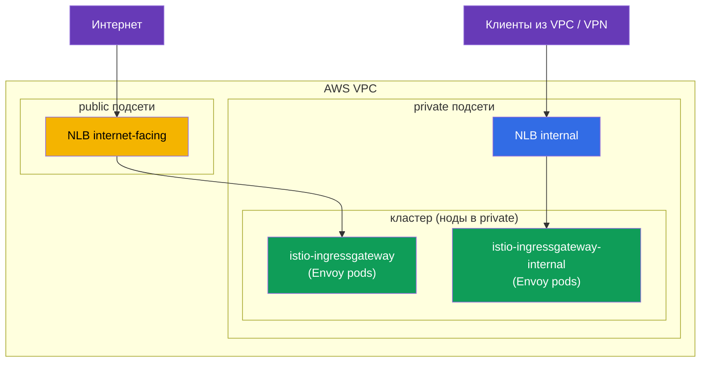
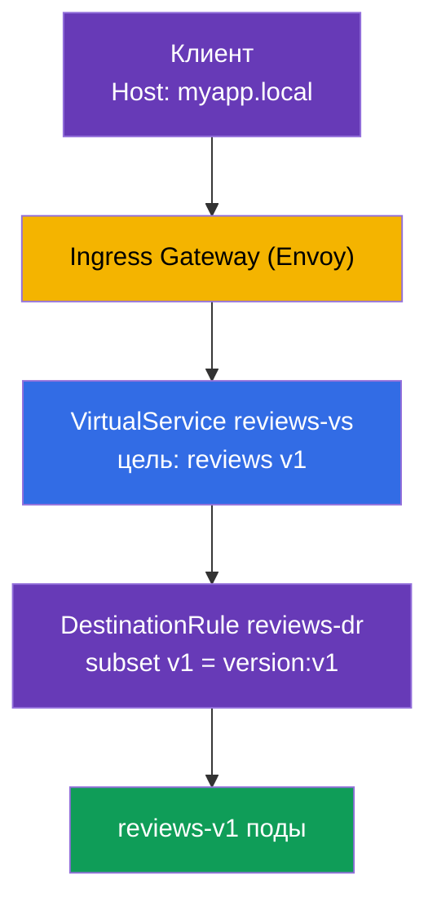

[Eng version](en.md) · [Versión en español](es.md) · [Version française](fr.md) · [Deutsche Version](de.md)

# Глава 5. Управление трафиком: Gateway, VirtualService, DestinationRule

> **Что дальше.** Мы установили Istio и разобрались с data plane. Теперь начинается
> самое интересное и самая большая тема экзамена ICA - управление трафиком (около 40%
> экзамена). В этой главе разберём три главных ресурса маршрутизации: Gateway,
> VirtualService и DestinationRule. На них держатся все следующие главы про canary,
> зеркалирование, устойчивость и egress.

## 5.1. Три кита управления трафиком

В Kubernetes у вас был `Ingress` для входящего трафика и `Service` для балансировки.
В Istio маршрутизация гибче и разбита на отдельные ресурсы, каждый отвечает за свою
часть.

| Ресурс | Отвечает за | Аналогия |
|--------|-------------|----------|
| **Gateway** | что слушать на границе mesh (порт, протокол, хост) | вход в кластер, как `Ingress` |
| **VirtualService** | куда и по каким правилам направить трафик | таблица маршрутов |
| **DestinationRule** | что делать с трафиком у получателя (subsets, политики) | настройки для сервиса назначения |

Есть ещё `ServiceEntry` (регистрация внешних сервисов) - его разберём в главе 11 про
egress. Пока сосредоточимся на этих трёх.

Логика простая: **Gateway** принял трафик на границе, **VirtualService** решил, куда
его отправить, а **DestinationRule** описал, как обращаться с получателем.


## 5.2. Gateway: точка входа

`Gateway` настраивает Envoy на границе mesh (ingress gateway) - говорит ему, какой
порт и протокол слушать и для каких хостов принимать запросы. Сам по себе Gateway
трафик никуда не отправляет, он только открывает «дверь».

```yaml
apiVersion: networking.istio.io/v1
kind: Gateway
metadata:
  name: main-gateway
spec:
  selector:
    istio: ingressgateway   # к какому поду Envoy применить (ingress gateway)
  servers:
  - port:
      number: 80
      name: http
      protocol: HTTP
    hosts:
    - "myapp.local"         # принимаем запросы только для этого хоста
```

Разберём поля:

- **`selector`** - выбирает, на какой Envoy-шлюз наложить эту конфигурацию. Метка
  `istio: ingressgateway` соответствует поду `istio-ingressgateway` из главы 2.
- **`servers`** - что слушать: порт `80`, протокол `HTTP`.
- **`hosts`** - для каких хостов принимать запросы. Запрос с другим `Host` будет
  отклонён. Если нужно принимать всё, ставят `hosts: ["*"]`.

Важно понять: Gateway только открывает порт и говорит «я готов принять трафик для
myapp.local». Куда его потом отправить - решает VirtualService.

### Несколько ingress gateway: разделение трафика

`selector` в Gateway показывает, к какому именно Envoy-шлюзу применить правила. По
умолчанию это один шлюз `istio-ingressgateway` (метка `istio: ingressgateway`). Но
шлюзов может быть **несколько**: вы разворачиваете дополнительные ingress gateway - это
отдельные Deployment'ы Envoy со своими метками и своим Kubernetes Service - и
направляете разный трафик на разные шлюзы, указывая нужную метку в `selector`.

Зачем это нужно:

- **Разделить публичный и внутренний трафик.** Один шлюз смотрит в интернет, другой -
  только во внутреннюю сеть; они не пересекаются.
- **Изоляция команд/арендаторов.** У каждой команды свой шлюз со своими лимитами и
  сертификатами.
- **Разные требования.** Отдельный шлюз под gRPC/TCP, под другой набор TLS-сертификатов
  или под отдельное масштабирование.

Развернуть второй шлюз можно через IstioOperator, добавив ещё один ingress gateway со
своим именем и меткой:

```yaml
apiVersion: install.istio.io/v1alpha1
kind: IstioOperator
spec:
  components:
    ingressGateways:
    - name: istio-ingressgateway          # публичный (по умолчанию)
      enabled: true
    - name: istio-ingressgateway-internal # дополнительный, внутренний
      enabled: true
      label:
        istio: ingressgateway-internal    # своя метка для selector
```

Каждая запись в `ingressGateways` - это самостоятельный шлюз. При `istioctl install`
Istio создаёт для него в namespace `istio-system` полный набор объектов:

- **Deployment** с подами Envoy (имя = `name`, здесь `istio-ingressgateway-internal`);
- **Service** того же имени - через него трафик попадает на эти поды (тип берётся из
  `k8s.service.type`, по умолчанию `LoadBalancer`);
- **ServiceAccount**, HPA/PodDisruptionBudget и т.п.

Метка из `label` (`istio: ingressgateway-internal`) вешается на поды Deployment -
именно по ней Gateway через `selector` находит нужный шлюз. Проверить, что шлюз
появился, можно так:

```bash
kubectl -n istio-system get deploy,svc,pod -l istio=ingressgateway-internal
```

```
NAME                                             READY   UP-TO-DATE   AVAILABLE
deployment.apps/istio-ingressgateway-internal    1/1     1            1

NAME                                    TYPE           CLUSTER-IP     EXTERNAL-IP      PORT(S)
service/istio-ingressgateway-internal   LoadBalancer   10.100.5.6     <lb-address>     80:31234/TCP

NAME                                                 READY   STATUS
pod/istio-ingressgateway-internal-6c9f4b8d7-xk2mn    1/1     Running
```

То есть «шлюз» - это пара **Deployment (поды Envoy) + Service**. Если Service имеет тип
`LoadBalancer`, облако (в нашем случае AWS) создаёт под него балансировщик и проставляет
его адрес в `EXTERNAL-IP`.

Теперь в Gateway можно выбрать, какой шлюз слушает данный хост:

```yaml
# публичное приложение — через внешний шлюз
apiVersion: networking.istio.io/v1
kind: Gateway
metadata:
  name: public-gateway
spec:
  selector:
    istio: ingressgateway            # внешний шлюз
  servers:
  - port: { number: 80, name: http, protocol: HTTP }
    hosts: ["shop.example.com"]
---
# внутреннее приложение — через внутренний шлюз
apiVersion: networking.istio.io/v1
kind: Gateway
metadata:
  name: internal-gateway
spec:
  selector:
    istio: ingressgateway-internal   # внутренний шлюз
  servers:
  - port: { number: 80, name: http, protocol: HTTP }
    hosts: ["admin.internal"]
```

Так один кластер обслуживает и публичный, и внутренний трафик через разные «двери», а
VirtualService привязывается к нужному шлюзу через поле `gateways`.

### Пример для AWS VPC: public и private подсети

Типичная AWS VPC состоит из двух видов подсетей:

- **public** - имеют маршрут в Internet Gateway, ресурсы в них доступны из интернета;
- **private** - без прямого маршрута в интернет, доступны только внутри VPC (и через
  VPN/Direct Connect).

Балансировщик AWS создаётся **в подсетях**, и от того, в каких он подсетях, зависит,
публичный он или внутренний:

- `scheme: internet-facing` → балансировщик ставится в **public** подсети и получает
  публичный адрес;
- `scheme: internal` → балансировщик ставится в **private** подсети и резолвится только
  в приватные IP (из интернета недоступен).

За создание балансировщиков отвечает [AWS Load Balancer
Controller](https://kubernetes-sigs.github.io/aws-load-balancer-controller/). Нужные
подсети он находит по тегам (их обычно ставит установщик кластера, например `eksctl`):

- public: тег `kubernetes.io/role/elb = 1`;
- private: тег `kubernetes.io/role/internal-elb = 1`;
- плюс `kubernetes.io/cluster/<cluster-name> = owned` (или `shared`).

Если подсети не тегированы или их надо выбрать явно, подсети задают аннотацией
`service.beta.kubernetes.io/aws-load-balancer-subnets`.

Разворачиваем два шлюза - интернет-шлюз в public-подсетях и внутренний в private:

```yaml
apiVersion: install.istio.io/v1alpha1
kind: IstioOperator
spec:
  components:
    ingressGateways:
    # 1) интернет-шлюз: публичный NLB в PUBLIC подсетях
    - name: istio-ingressgateway
      enabled: true
      # метка по умолчанию istio: ingressgateway
      k8s:
        service:
          type: LoadBalancer
        serviceAnnotations:
          service.beta.kubernetes.io/aws-load-balancer-type: external
          service.beta.kubernetes.io/aws-load-balancer-nlb-target-type: ip
          service.beta.kubernetes.io/aws-load-balancer-scheme: internet-facing
          # можно указать подсети явно вместо тегов:
          # service.beta.kubernetes.io/aws-load-balancer-subnets: subnet-pub-a,subnet-pub-b
    # 2) внутренний шлюз: приватный NLB в PRIVATE подсетях
    - name: istio-ingressgateway-internal
      enabled: true
      label:
        istio: ingressgateway-internal
      k8s:
        service:
          type: LoadBalancer
        serviceAnnotations:
          service.beta.kubernetes.io/aws-load-balancer-type: external
          service.beta.kubernetes.io/aws-load-balancer-nlb-target-type: ip
          service.beta.kubernetes.io/aws-load-balancer-scheme: internal
          # service.beta.kubernetes.io/aws-load-balancer-subnets: subnet-priv-a,subnet-priv-b
```

Что означают аннотации:

- **`aws-load-balancer-type`** - выбирает, **какой контроллер** провижинит
  балансировщик (а не «ALB или NLB»). Значение `external` = современный [AWS Load
  Balancer Controller](https://kubernetes-sigs.github.io/aws-load-balancer-controller/),
  и для ресурса **Service** он всегда создаёт **NLB** (Network Load Balancer, L4).
  Возможные значения: `external` (AWS LBC → NLB), устаревшее `nlb-ip` (тот же AWS LBC с
  IP-таргетами), `nlb` (in-tree контроллер → NLB). Если аннотацию не ставить вовсе,
  сработает встроенный in-tree контроллер и создаст устаревший **Classic Load Balancer
  (CLB)** - поэтому тип указывать нужно. Значения `alb` у этой аннотации **не бывает**:
  ALB создаётся не из Service, а из ресурса `Ingress` (см. ниже).
  Не путайте с **ELB** (*Elastic Load Balancing*) - это общее название сервиса AWS, куда
  входят CLB, ALB и NLB, а не отдельный тип балансировщика.
- **`aws-load-balancer-nlb-target-type`** - куда слать трафик: `ip` (прямо на IP подов
  через VPC CNI) или `instance` (на NodePort нод). `ip` эффективнее и сохраняет исходный
  клиентский IP.
- **`aws-load-balancer-scheme`** - `internet-facing` (public-подсети, публичный адрес)
  или `internal` (private-подсети, только из VPC).

Главное про типы балансировщиков AWS в Kubernetes: **тип балансировщика определяется
типом ресурса Kubernetes, а не значением аннотации.**

- **Service (type `LoadBalancer`) → NLB (L4).** Это и есть случай ingress gateway: NLB
  просто пробрасывает TCP, а маршрутизацию, TLS и mTLS делает сам Istio. ALB из Service
  создать нельзя.
- **Ingress → ALB (L7).** ALB провижинится только из ресурса `Ingress` (класс
  `ingressClassName: alb` и аннотации `alb.ingress.kubernetes.io/*`), к Service это
  отношения не имеет. ALB иногда ставят перед Istio, но тогда он сам терминирует HTTPS и
  часть L7-логики уходит из mesh; для «чистого» Istio-ingress обычно берут NLB. Подробнее
  об этом выборе - в главах про продакшн-установку на EKS.



Результат:

- Service `istio-ingressgateway` получит публичный NLB (в `EXTERNAL-IP` - публичное DNS-
  имя `*.elb.amazonaws.com`, резолвится в публичные IP). Через него выставляем публичные
  приложения (`shop.example.com`).
- Service `istio-ingressgateway-internal` получит **внутренний** NLB (адрес резолвится
  только в приватные IP VPC). Через него ходят внутренние/админские сервисы
  (`admin.internal`) - из интернета они недоступны в принципе, потому что у их шлюза нет
  публичного адреса.

Сами поды Envoy обоих шлюзов при этом обычно живут на нодах в private-подсетях - в
интернет «смотрит» только публичный NLB, а не сами поды.

### TLS-сертификат ACM прямо на NLB

Сертификат для входящего HTTPS не обязательно грузить в Istio - можно повесить готовый
сертификат из **AWS Certificate Manager (ACM)** сразу на NLB. Тогда TLS терминируется на
балансировщике, а ACM сам продлевает сертификат. Достаточно добавить аннотации к Service
шлюза:

```yaml
        serviceAnnotations:
          service.beta.kubernetes.io/aws-load-balancer-type: external
          service.beta.kubernetes.io/aws-load-balancer-scheme: internet-facing
          # ACM-сертификат и порт(ы), на которых NLB терминирует TLS
          service.beta.kubernetes.io/aws-load-balancer-ssl-cert: arn:aws:acm:eu-central-1:123456789012:certificate/xxxxxxxx-xxxx-xxxx
          service.beta.kubernetes.io/aws-load-balancer-ssl-ports: "443"
```

- `aws-load-balancer-ssl-cert` - ARN сертификата из ACM.
- `aws-load-balancer-ssl-ports` - на каких портах NLB слушает TLS (обычно `443`);
  остальные порты (например, `80`) остаются обычным TCP.

Важный нюанс - **где** терминируется TLS:

- **TLS на NLB (offload).** NLB расшифровывает трафик по ACM-сертификату, и дальше по VPC
  до шлюза идёт уже расшифрованный трафик. Плюс: сертификатом управляет AWS
  (автопродление), в Istio его грузить не нужно. Минус: между NLB и шлюзом трафик не
  защищён этим сертификатом (только внутри VPC), и Istio не «видит» исходный TLS.
- **Passthrough + TLS в Istio.** Альтернатива: NLB просто пробрасывает TCP (без
  `ssl-cert`), а сертификат кладут в Istio, и TLS (или mTLS) терминирует уже ingress
  gateway. Этот вариант с `Gateway` в режимах `SIMPLE`/`MUTUAL`/`PASSTHROUGH` разбираем
  в главе 9.

Коротко: хотите отдать управление сертификатом AWS и терминировать TLS на краю - вешайте
ACM-сертификат на NLB аннотациями; нужен сквозной TLS/mTLS до самого mesh - терминируйте
в Istio (глава 9).

## 5.3. VirtualService: правила маршрутизации

`VirtualService` - центральный ресурс маршрутизации. Он описывает, как трафик
доходит до конкретного сервиса: по какому хосту, по каким условиям и в какой
получатель его направить.

```yaml
apiVersion: networking.istio.io/v1
kind: VirtualService
metadata:
  name: reviews-vs
spec:
  hosts:
  - "myapp.local"      # для какого хоста действуют правила
  gateways:
  - main-gateway       # через какой Gateway пришёл трафик
  http:
  - route:
    - destination:
        host: reviews  # Kubernetes Service назначения
        subset: v1     # какая группа подов (описана в DestinationRule)
```

Ключевые поля:

- **`hosts`** - для какого хоста применяются правила. Это может быть внешний хост (как
  `myapp.local`) или имя внутреннего сервиса.
- **`gateways`** - откуда пришёл трафик. Здесь `main-gateway` значит «трафик снаружи,
  через наш ingress». Есть особое значение `mesh` для внутрикластерного трафика - про
  него в разделе 5.6.
- **`http`** - список правил маршрутизации, обрабатываются сверху вниз, срабатывает
  первое подходящее.
- **`destination.host`** - имя Kubernetes Service, куда отправить трафик.
- **`destination.subset`** - конкретная группа подов внутри сервиса (например, только
  версия v1). Эти subsets описываются в DestinationRule.

VirtualService умеет гораздо больше: маршрутизация по заголовкам, распределение по
весам, зеркалирование, таймауты и ретраи. Всё это разберём в следующих главах, а пока
важно понять базовую роль - «куда направить».

## 5.4. DestinationRule: subsets и политики

`VirtualService` в примере выше ссылается на `subset: v1`. Но откуда Istio знает, что
такое v1? Это описывает `DestinationRule`.

```yaml
apiVersion: networking.istio.io/v1
kind: DestinationRule
metadata:
  name: reviews-dr
spec:
  host: reviews          # для какого сервиса
  subsets:
  - name: v1
    labels:
      version: v1        # v1 = поды с меткой version=v1
  - name: v2
    labels:
      version: v2
```

- **`host`** - к какому Kubernetes Service относится правило.
- **`subsets`** - логические группы подов внутри одного сервиса. Каждый subset
  определяется набором меток. Subset `v1` это все поды сервиса `reviews` с меткой
  `version: v1`.

Зачем это нужно: у сервиса `reviews` может быть несколько версий (v1, v2, v3), и все
они под одним Kubernetes Service. Чтобы направить трафик именно на v1, Istio должен
уметь отличать поды v1 от v2. Subsets и есть этот механизм.

Кроме subsets, в DestinationRule задают **политики трафика** к получателю: алгоритм
балансировки, настройки пула соединений, circuit breaking, режим mTLS. Их мы разберём
в главах 7, 8 и 12.

## 5.5. Как это связано с Kubernetes Service

Частый вопрос: если есть VirtualService и DestinationRule, зачем вообще нужен обычный
Kubernetes Service? И как они связаны? Разберём, потому что это ключ к пониманию всей
маршрутизации.

Главное: **VirtualService не заменяет Kubernetes Service, а работает поверх него.**

- Поле `destination.host` в VirtualService (и `host` в DestinationRule) указывает на
  **имя Kubernetes Service** (короткое имя или FQDN вроде
  `reviews.default.svc.cluster.local`).
- Istio берёт из этого Service список эндпоинтов - реальные IP подов. Это то же самое
  service discovery, что и в обычном Kubernetes: Service по своему `selector` знает,
  какие поды за ним стоят. Istio переиспользует эту информацию.
- **VirtualService только перехватывает** трафик, который идёт на этот хост, и решает,
  куда и по каким правилам его направить (в какой subset, с какими весами). А физически
  разослать запрос по конкретным подам - работа Envoy, и он использует именно эндпоинты
  из Kubernetes Service.
- **subset** из DestinationRule - это подмножество тех же самых подов Service,
  отобранное по дополнительным меткам (например, `version: v1`). Поды subset обязаны
  попадать под `selector` Service, иначе их там просто не будет.


Вывод: Kubernetes Service по-прежнему обязателен - он даёт DNS-имя и список подов. Без
него Istio не знал бы, куда физически слать трафик. VirtualService и DestinationRule
это надстройка: они не про «где находятся поды», а про «как именно распределить трафик
между ними». Поэтому в реальном приложении вы всегда сначала создаёте обычный Service,
а уже потом накрываете его правилами Istio.

## 5.6. Как три ресурса работают вместе

Соберём всё в одну картину на примере запроса снаружи к сервису `reviews`.



Шаг за шагом:

1. Клиент шлёт запрос с заголовком `Host: myapp.local` на ingress gateway.
2. **Gateway** уже сказал шлюзу слушать `myapp.local:80` - запрос принимается.
3. **VirtualService** видит, что для `myapp.local` через `main-gateway` трафик надо
   отправить на сервис `reviews`, subset `v1`.
4. **DestinationRule** объясняет, что subset `v1` это поды с меткой `version: v1`.
5. Трафик уходит на поды `reviews-v1`.

Уберите любой из трёх ресурсов, и цепочка сломается: без Gateway трафик не войдёт, без
VirtualService шлюз не будет знать, куда его девать, без DestinationRule Istio не
поймёт, что такое `subset: v1`.

## 5.7. Внутренний трафик и gateway «mesh»

До сих пор мы говорили про трафик снаружи. Но VirtualService умеет управлять и
трафиком **внутри** кластера (когда один под обращается к другому). Для этого есть
специальное значение `gateways: [mesh]`.

`mesh` - это зарезервированное слово, которое означает «все sidecar внутри mesh».
Сравните два случая:

- `gateways: [main-gateway]` - правила действуют для трафика, пришедшего снаружи через
  ingress gateway.
- `gateways: [mesh]` - правила действуют для внутрикластерного трафика (pod-to-pod).

Часто в `hosts` указывают сразу оба варианта - и внешний хост, и имя сервиса, - а в
`gateways` перечисляют и `main-gateway`, и `mesh`, чтобы одни и те же правила работали
и снаружи, и внутри:

```yaml
spec:
  hosts:
  - "myapp.local"    # внешний трафик
  - "reviews"        # внутренний трафик (по имени сервиса)
  gateways:
  - main-gateway     # снаружи
  - mesh             # изнутри
```

Если не указать `gateways` вообще, по умолчанию подразумевается `mesh`, то есть
правила применяются только к внутрикластерному трафику.

## 5.8. Частые ошибки

Эти грабли встречаются и на экзамене, и в реальной работе.

- **Неправильный `selector` в Gateway.** Метка в `selector` должна совпадать с метками
  пода ingress gateway. Если написать `istio: gateway` вместо `istio: ingressgateway`,
  трафик просто не будет приниматься.
- **Забыли `subset` в DestinationRule.** VirtualService ссылается на `subset: v1`, а в
  DestinationRule такого subset нет - трафик не пойдёт. Имена subsets должны совпадать.
- **Хосты для трафика между namespace.** Для обращения к сервису в другом namespace в
  `hosts` VirtualService лучше указывать и короткое имя, и полный FQDN:

  ```yaml
  hosts:
    - reviews
    - reviews.default.svc.cluster.local
  ```

- **Забыли `mesh` в gateways.** Если хотите, чтобы правила работали для
  внутрикластерного трафика, обязательно добавьте `mesh` в `gateways`. Иначе они
  сработают только для внешнего трафика.

## 5.9. Итоги главы

- Управление трафиком в Istio держится на трёх ресурсах: Gateway, VirtualService,
  DestinationRule.
- **Gateway** открывает порт на границе mesh и говорит, какие хосты принимать; трафик
  сам не направляет.
- Ingress gateway может быть **несколько**: каждая запись `ingressGateways` в
  IstioOperator - это свой Deployment (поды Envoy) + Service, а разными метками
  `selector` трафик разделяют по разным шлюзам (например, публичный и внутренний).
- На AWS тип балансировщика задаёт аннотация `aws-load-balancer-type: external` (AWS LB
  Controller → NLB; без неё - устаревший Classic LB), а схема - где он создаётся:
  `internet-facing` в public-подсетях (публичный адрес) или `internal` в private-
  подсетях (только из VPC/VPN). Подсети выбираются по тегам или аннотацией
  `aws-load-balancer-subnets`. ALB (L7) создаётся для Ingress, а не для Service.
- TLS можно терминировать прямо на NLB готовым сертификатом из ACM (аннотации
  `aws-load-balancer-ssl-cert` + `aws-load-balancer-ssl-ports`) - AWS сам продлевает
  его; либо использовать passthrough и терминировать TLS/mTLS в Istio (глава 9).
- **VirtualService** решает, куда и по каким правилам направить трафик (хост, условия,
  destination).
- **DestinationRule** описывает subsets (группы подов по меткам) и политики к
  получателю.
- Subsets из DestinationRule связывают VirtualService с конкретными версиями подов.
- VirtualService не заменяет Kubernetes Service, а работает поверх него: имя в
  `destination.host` это Service, из которого Istio берёт эндпоинты (IP подов).
- Значение `gateways: [mesh]` включает правила для внутрикластерного трафика; без
  указания gateways подразумевается именно `mesh`.
- Частые ошибки: неверный selector, несовпадение имён subsets, отсутствие FQDN в hosts,
  забытый `mesh`.

## 5.10. Вопросы для самопроверки

1. За что отвечает каждый из трёх ресурсов: Gateway, VirtualService, DestinationRule?
2. Что произойдёт, если VirtualService ссылается на subset, которого нет в
   DestinationRule?
3. Зачем нужны subsets и как они связаны с метками подов?
4. Чем отличается `gateways: [main-gateway]` от `gateways: [mesh]`?
5. Почему для трафика между namespace в hosts стоит указывать FQDN?
6. Зачем нужен обычный Kubernetes Service, если есть VirtualService? Как они связаны?
7. Как развернуть несколько ingress gateway и направить на них разный трафик? Как на
   AWS сделать один шлюз публичным, а другой - доступным только из VPC?

## Практика

Пройдите лабу: с нуля настройте Gateway, VirtualService и DestinationRule, разделите
трафик по версиям сервиса и по HTTP-заголовку.

🧪 Лаба 02: [tasks/ica/labs/02](../../labs/02/README_RU.MD)

---
[Оглавление](../README.md) · [Глава 4](../04/ru.md) · [Глава 6](../06/ru.md)
