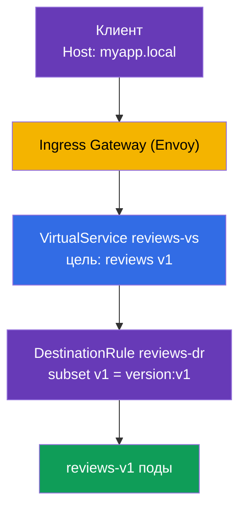

# Глава 5. Управление трафиком: Gateway, VirtualService, DestinationRule

> **Что дальше.** Мы установили Istio и разобрались с data plane. Теперь начинается
> самое интересное и самая большая тема экзамена ICA - управление трафиком (около 40%
> экзамена). В этой главе разберём три главных ресурса маршрутизации: Gateway,
> VirtualService и DestinationRule. На них держатся все следующие главы про canary,
> зеркалирование, устойчивость и egress.

## 5.1. Три кита управления трафиком

В Kubernetes у вас был `Ingress` для входящего трафика и `Service` для балансировки.
В Istio маршрутизация гибче и разбита на отдельные ресурсы, каждый отвечает за свою
часть.

| Ресурс | Отвечает за | Аналогия |
|--------|-------------|----------|
| **Gateway** | что слушать на границе mesh (порт, протокол, хост) | вход в кластер, как `Ingress` |
| **VirtualService** | куда и по каким правилам направить трафик | таблица маршрутов |
| **DestinationRule** | что делать с трафиком у получателя (subsets, политики) | настройки для сервиса назначения |

Есть ещё `ServiceEntry` (регистрация внешних сервисов) - его разберём в главе 11 про
egress. Пока сосредоточимся на этих трёх.

Логика простая: **Gateway** принял трафик на границе, **VirtualService** решил, куда
его отправить, а **DestinationRule** описал, как обращаться с получателем.


## 5.2. Gateway: точка входа

`Gateway` настраивает Envoy на границе mesh (ingress gateway) - говорит ему, какой
порт и протокол слушать и для каких хостов принимать запросы. Сам по себе Gateway
трафик никуда не отправляет, он только открывает «дверь».

```yaml
apiVersion: networking.istio.io/v1
kind: Gateway
metadata:
  name: main-gateway
spec:
  selector:
    istio: ingressgateway   # к какому поду Envoy применить (ingress gateway)
  servers:
  - port:
      number: 80
      name: http
      protocol: HTTP
    hosts:
    - "myapp.local"         # принимаем запросы только для этого хоста
```

Разберём поля:

- **`selector`** - выбирает, на какой Envoy-шлюз наложить эту конфигурацию. Метка
  `istio: ingressgateway` соответствует поду `istio-ingressgateway` из главы 2.
- **`servers`** - что слушать: порт `80`, протокол `HTTP`.
- **`hosts`** - для каких хостов принимать запросы. Запрос с другим `Host` будет
  отклонён. Если нужно принимать всё, ставят `hosts: ["*"]`.

Важно понять: Gateway только открывает порт и говорит «я готов принять трафик для
myapp.local». Куда его потом отправить - решает VirtualService.

## 5.3. VirtualService: правила маршрутизации

`VirtualService` - центральный ресурс маршрутизации. Он описывает, как трафик
доходит до конкретного сервиса: по какому хосту, по каким условиям и в какой
получатель его направить.

```yaml
apiVersion: networking.istio.io/v1
kind: VirtualService
metadata:
  name: reviews-vs
spec:
  hosts:
  - "myapp.local"      # для какого хоста действуют правила
  gateways:
  - main-gateway       # через какой Gateway пришёл трафик
  http:
  - route:
    - destination:
        host: reviews  # Kubernetes Service назначения
        subset: v1     # какая группа подов (описана в DestinationRule)
```

Ключевые поля:

- **`hosts`** - для какого хоста применяются правила. Это может быть внешний хост (как
  `myapp.local`) или имя внутреннего сервиса.
- **`gateways`** - откуда пришёл трафик. Здесь `main-gateway` значит «трафик снаружи,
  через наш ingress». Есть особое значение `mesh` для внутрикластерного трафика - про
  него в разделе 5.6.
- **`http`** - список правил маршрутизации, обрабатываются сверху вниз, срабатывает
  первое подходящее.
- **`destination.host`** - имя Kubernetes Service, куда отправить трафик.
- **`destination.subset`** - конкретная группа подов внутри сервиса (например, только
  версия v1). Эти subsets описываются в DestinationRule.

VirtualService умеет гораздо больше: маршрутизация по заголовкам, распределение по
весам, зеркалирование, таймауты и ретраи. Всё это разберём в следующих главах, а пока
важно понять базовую роль - «куда направить».

## 5.4. DestinationRule: subsets и политики

`VirtualService` в примере выше ссылается на `subset: v1`. Но откуда Istio знает, что
такое v1? Это описывает `DestinationRule`.

```yaml
apiVersion: networking.istio.io/v1
kind: DestinationRule
metadata:
  name: reviews-dr
spec:
  host: reviews          # для какого сервиса
  subsets:
  - name: v1
    labels:
      version: v1        # v1 = поды с меткой version=v1
  - name: v2
    labels:
      version: v2
```

- **`host`** - к какому Kubernetes Service относится правило.
- **`subsets`** - логические группы подов внутри одного сервиса. Каждый subset
  определяется набором меток. Subset `v1` это все поды сервиса `reviews` с меткой
  `version: v1`.

Зачем это нужно: у сервиса `reviews` может быть несколько версий (v1, v2, v3), и все
они под одним Kubernetes Service. Чтобы направить трафик именно на v1, Istio должен
уметь отличать поды v1 от v2. Subsets и есть этот механизм.

Кроме subsets, в DestinationRule задают **политики трафика** к получателю: алгоритм
балансировки, настройки пула соединений, circuit breaking, режим mTLS. Их мы разберём
в главах 7, 8 и 12.

## 5.5. Как это связано с Kubernetes Service

Частый вопрос: если есть VirtualService и DestinationRule, зачем вообще нужен обычный
Kubernetes Service? И как они связаны? Разберём, потому что это ключ к пониманию всей
маршрутизации.

Главное: **VirtualService не заменяет Kubernetes Service, а работает поверх него.**

- Поле `destination.host` в VirtualService (и `host` в DestinationRule) указывает на
  **имя Kubernetes Service** (короткое имя или FQDN вроде
  `reviews.default.svc.cluster.local`).
- Istio берёт из этого Service список эндпоинтов - реальные IP подов. Это то же самое
  service discovery, что и в обычном Kubernetes: Service по своему `selector` знает,
  какие поды за ним стоят. Istio переиспользует эту информацию.
- **VirtualService только перехватывает** трафик, который идёт на этот хост, и решает,
  куда и по каким правилам его направить (в какой subset, с какими весами). А физически
  разослать запрос по конкретным подам - работа Envoy, и он использует именно эндпоинты
  из Kubernetes Service.
- **subset** из DestinationRule - это подмножество тех же самых подов Service,
  отобранное по дополнительным меткам (например, `version: v1`). Поды subset обязаны
  попадать под `selector` Service, иначе их там просто не будет.


Вывод: Kubernetes Service по-прежнему обязателен - он даёт DNS-имя и список подов. Без
него Istio не знал бы, куда физически слать трафик. VirtualService и DestinationRule
это надстройка: они не про «где находятся поды», а про «как именно распределить трафик
между ними». Поэтому в реальном приложении вы всегда сначала создаёте обычный Service,
а уже потом накрываете его правилами Istio.

## 5.6. Как три ресурса работают вместе

Соберём всё в одну картину на примере запроса снаружи к сервису `reviews`.



Шаг за шагом:

1. Клиент шлёт запрос с заголовком `Host: myapp.local` на ingress gateway.
2. **Gateway** уже сказал шлюзу слушать `myapp.local:80` - запрос принимается.
3. **VirtualService** видит, что для `myapp.local` через `main-gateway` трафик надо
   отправить на сервис `reviews`, subset `v1`.
4. **DestinationRule** объясняет, что subset `v1` это поды с меткой `version: v1`.
5. Трафик уходит на поды `reviews-v1`.

Уберите любой из трёх ресурсов, и цепочка сломается: без Gateway трафик не войдёт, без
VirtualService шлюз не будет знать, куда его девать, без DestinationRule Istio не
поймёт, что такое `subset: v1`.

## 5.7. Внутренний трафик и gateway «mesh»

До сих пор мы говорили про трафик снаружи. Но VirtualService умеет управлять и
трафиком **внутри** кластера (когда один под обращается к другому). Для этого есть
специальное значение `gateways: [mesh]`.

`mesh` - это зарезервированное слово, которое означает «все sidecar внутри mesh».
Сравните два случая:

- `gateways: [main-gateway]` - правила действуют для трафика, пришедшего снаружи через
  ingress gateway.
- `gateways: [mesh]` - правила действуют для внутрикластерного трафика (pod-to-pod).

Часто в `hosts` указывают сразу оба варианта - и внешний хост, и имя сервиса, - а в
`gateways` перечисляют и `main-gateway`, и `mesh`, чтобы одни и те же правила работали
и снаружи, и внутри:

```yaml
spec:
  hosts:
  - "myapp.local"    # внешний трафик
  - "reviews"        # внутренний трафик (по имени сервиса)
  gateways:
  - main-gateway     # снаружи
  - mesh             # изнутри
```

Если не указать `gateways` вообще, по умолчанию подразумевается `mesh`, то есть
правила применяются только к внутрикластерному трафику.

## 5.8. Частые ошибки

Эти грабли встречаются и на экзамене, и в реальной работе.

- **Неправильный `selector` в Gateway.** Метка в `selector` должна совпадать с метками
  пода ingress gateway. Если написать `istio: gateway` вместо `istio: ingressgateway`,
  трафик просто не будет приниматься.
- **Забыли `subset` в DestinationRule.** VirtualService ссылается на `subset: v1`, а в
  DestinationRule такого subset нет - трафик не пойдёт. Имена subsets должны совпадать.
- **Хосты для трафика между namespace.** Для обращения к сервису в другом namespace в
  `hosts` VirtualService лучше указывать и короткое имя, и полный FQDN:

  ```yaml
  hosts:
    - reviews
    - reviews.default.svc.cluster.local
  ```

- **Забыли `mesh` в gateways.** Если хотите, чтобы правила работали для
  внутрикластерного трафика, обязательно добавьте `mesh` в `gateways`. Иначе они
  сработают только для внешнего трафика.

## 5.9. Итоги главы

- Управление трафиком в Istio держится на трёх ресурсах: Gateway, VirtualService,
  DestinationRule.
- **Gateway** открывает порт на границе mesh и говорит, какие хосты принимать; трафик
  сам не направляет.
- **VirtualService** решает, куда и по каким правилам направить трафик (хост, условия,
  destination).
- **DestinationRule** описывает subsets (группы подов по меткам) и политики к
  получателю.
- Subsets из DestinationRule связывают VirtualService с конкретными версиями подов.
- VirtualService не заменяет Kubernetes Service, а работает поверх него: имя в
  `destination.host` это Service, из которого Istio берёт эндпоинты (IP подов).
- Значение `gateways: [mesh]` включает правила для внутрикластерного трафика; без
  указания gateways подразумевается именно `mesh`.
- Частые ошибки: неверный selector, несовпадение имён subsets, отсутствие FQDN в hosts,
  забытый `mesh`.

## 5.10. Вопросы для самопроверки

1. За что отвечает каждый из трёх ресурсов: Gateway, VirtualService, DestinationRule?
2. Что произойдёт, если VirtualService ссылается на subset, которого нет в
   DestinationRule?
3. Зачем нужны subsets и как они связаны с метками подов?
4. Чем отличается `gateways: [main-gateway]` от `gateways: [mesh]`?
5. Почему для трафика между namespace в hosts стоит указывать FQDN?
6. Зачем нужен обычный Kubernetes Service, если есть VirtualService? Как они связаны?

## Практика

Пройдите лабу: с нуля настройте Gateway, VirtualService и DestinationRule, разделите
трафик по версиям сервиса и по HTTP-заголовку.

🧪 Лаба 02: [tasks/ica/labs/02](../../labs/02/README_RU.MD)

---
[Оглавление](../README.md) · [Глава 4](../04/ru.md) · [Глава 6](../06/ru.md)
