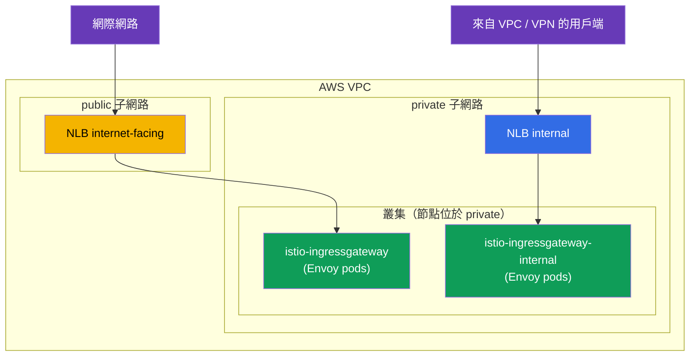
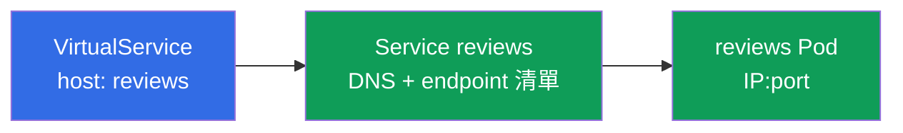
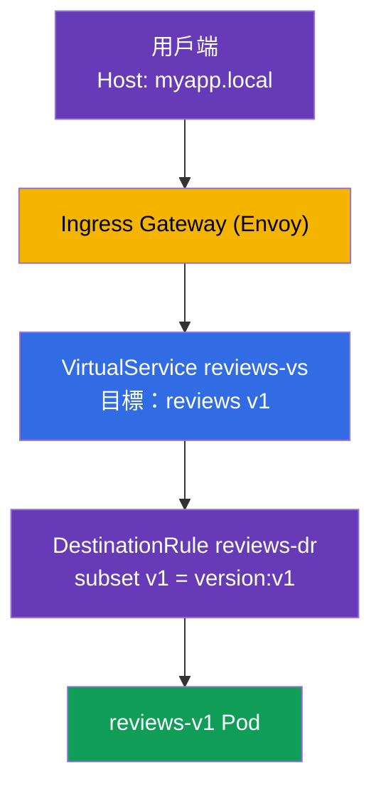

[Русская версия](ru.md) · [Eng version](en.md) · [Versión en español](es.md) · [Version française](fr.md) · [Deutsche Version](de.md) · [ქართული ვერსია](ge.md) · [日本語版](jp.md)

# 第 5 章。流量管理：Gateway、VirtualService、DestinationRule

> **接下來。** 我們已安裝 Istio，並理解了 data plane。現在進入最有趣、也是 ICA 考試最大的主題--流量管理（約佔考試的 40%）。本章將探討三個主要的路由資源：Gateway、VirtualService 與 DestinationRule。後續所有關於 canary、鏡像、韌性與 egress 的章節都以它們為基礎。

## 5.1. 流量管理的三大支柱

在 Kubernetes 中，您會使用 `Ingress` 處理入站流量，使用 `Service` 進行負載平衡。在 Istio 中，路由更具彈性，並拆分為各自負責不同部分的獨立資源。

| 資源 | 負責事項 | 類比 |
|--------|-------------|----------|
| **Gateway** | 在 mesh 邊界監聽什麼（連接埠、協定、主機） | 叢集入口，如同 `Ingress` |
| **VirtualService** | 將流量依哪些規則導向何處 | 路由表 |
| **DestinationRule** | 在接收端如何處理流量（subsets、策略） | 目的服務的設定 |

還有 `ServiceEntry`（外部服務註冊），我們會在第 11 章 egress 中討論。目前先聚焦於這三個。

邏輯很簡單：**Gateway** 在邊界接收流量，**VirtualService** 決定要傳送至何處，而 **DestinationRule** 說明如何處理接收端。


## 5.2. Gateway：入口點

`Gateway` 設定 mesh 邊界（ingress gateway）上的 Envoy：告訴它要監聽哪個連接埠與協定，以及要接受哪些主機的請求。Gateway 本身不會將流量傳送到任何地方，它只負責打開「門」。

```yaml
apiVersion: networking.istio.io/v1
kind: Gateway
metadata:
  name: main-gateway
spec:
  selector:
    istio: ingressgateway   # 套用至哪個 Envoy pod（ingress gateway）
  servers:
  - port:
      number: 80
      name: http
      protocol: HTTP
    hosts:
    - "myapp.local"         # 只接受此主機的請求
```

讓我們看看各欄位：

- **`selector`**：選擇要套用此設定的 Envoy gateway。標籤 `istio: ingressgateway` 對應第 2 章的 `istio-ingressgateway` Pod。
- **`servers`**：要監聽的項目：連接埠 `80`、協定 `HTTP`。
- **`hosts`**：要接受哪些主機的請求。具有其他 `Host` 的請求會遭到拒絕。若需要接受所有請求，請設定 `hosts: ["*"]`。

重點是：Gateway 只會開啟連接埠並表示「我已準備好接受 `myapp.local` 的流量」。後續要傳送到何處，則由 VirtualService 決定。

### 多個 ingress gateway：流量分離

Gateway 中的 `selector` 指出規則要套用至哪個 Envoy gateway。預設只有一個 gateway，即 `istio-ingressgateway`（標籤為 `istio: ingressgateway`）。但 gateway 可以有**多個**：您可部署額外的 ingress gateway--它們是有各自標籤和 Kubernetes Service 的獨立 Envoy Deployment--並透過在 `selector` 指定所需標籤，將不同流量導向不同 gateway。

其用途如下：

- **分離公用與內部流量。** 一個 gateway 面向網際網路，另一個僅面向內部網路；兩者互不交叉。
- **團隊／租戶隔離。** 每個團隊都有自己的 gateway，具備各自的限制與憑證。
- **不同需求。** 為 gRPC/TCP、另一組 TLS 憑證或獨立擴展配置獨立 gateway。

可透過 IstioOperator 部署第二個 gateway，加入另一個具有自訂名稱與標籤的 ingress gateway：

```yaml
apiVersion: install.istio.io/v1alpha1
kind: IstioOperator
spec:
  components:
    ingressGateways:
    - name: istio-ingressgateway          # 公用（預設）
      enabled: true
    - name: istio-ingressgateway-internal # 額外的、內部的
      enabled: true
      label:
        istio: ingressgateway-internal    # 給 selector 用的專屬 label
```

`ingressGateways` 中的每個項目都是獨立的 gateway。執行 `istioctl install` 時，Istio 會在 `istio-system` namespace 中為它建立完整的一組物件：

- 包含 Envoy Pod 的 **Deployment**（名稱 = `name`，此處為 `istio-ingressgateway-internal`）；
- 同名的 **Service**--流量經由它抵達這些 Pod（類型取自 `k8s.service.type`，預設為 `LoadBalancer`）；
- **ServiceAccount**、HPA/PodDisruptionBudget 等。

`label` 中的標籤（`istio: ingressgateway-internal`）會套用到 Deployment 的 Pod；Gateway 正是透過 `selector` 以此尋找所需 gateway。可依下列方式確認 gateway 是否出現：

```bash
kubectl -n istio-system get deploy,svc,pod -l istio=ingressgateway-internal
```

```
NAME                                             READY   UP-TO-DATE   AVAILABLE
deployment.apps/istio-ingressgateway-internal    1/1     1            1

NAME                                    TYPE           CLUSTER-IP     EXTERNAL-IP      PORT(S)
service/istio-ingressgateway-internal   LoadBalancer   10.100.5.6     <lb-address>     80:31234/TCP

NAME                                                 READY   STATUS
pod/istio-ingressgateway-internal-6c9f4b8d7-xk2mn    1/1     Running
```

換言之，「gateway」就是一組 **Deployment（Envoy Pod）+ Service**。若 Service 的類型為 `LoadBalancer`，雲端（本例為 AWS）會為其建立負載平衡器，並將其位址填入 `EXTERNAL-IP`。

現在可在 Gateway 中選擇由哪個 gateway 監聽特定主機：

```yaml
# 公用應用程式 - 透過外部 gateway
apiVersion: networking.istio.io/v1
kind: Gateway
metadata:
  name: public-gateway
spec:
  selector:
    istio: ingressgateway            # 外部 gateway
  servers:
  - port: { number: 80, name: http, protocol: HTTP }
    hosts: ["shop.example.com"]
---
# 內部應用程式 - 透過內部 gateway
apiVersion: networking.istio.io/v1
kind: Gateway
metadata:
  name: internal-gateway
spec:
  selector:
    istio: ingressgateway-internal   # 內部 gateway
  servers:
  - port: { number: 80, name: http, protocol: HTTP }
    hosts: ["admin.internal"]
```

如此一來，同一叢集會透過不同的「門」同時處理公用及內部流量，而 VirtualService 則透過 `gateways` 欄位繫結至所需的 gateway。

### AWS VPC 範例：public 與 private 子網路

典型 AWS VPC 包含兩種子網路：

- **public**：具有通往 Internet Gateway 的路由，當中的資源可從網際網路存取；
- **private**：沒有直接通往網際網路的路由，只能在 VPC 內部（以及透過 VPN/Direct Connect）存取。

AWS 負載平衡器會建立於**子網路中**，其所在子網路決定它是公用或內部：

- `scheme: internet-facing` → 負載平衡器設於 **public** 子網路並取得公用位址；
- `scheme: internal` → 負載平衡器設於 **private** 子網路，僅解析為私有 IP（無法從網際網路存取）。

負責建立負載平衡器的是 [AWS Load Balancer Controller](https://kubernetes-sigs.github.io/aws-load-balancer-controller/)。它會依標籤尋找所需子網路（通常由叢集安裝工具設定，例如 `eksctl`）：

- public：標籤 `kubernetes.io/role/elb = 1`；
- private：標籤 `kubernetes.io/role/internal-elb = 1`；
- 另加上 `kubernetes.io/cluster/<cluster-name> = owned`（或 `shared`）。

若子網路未加標籤，或必須明確選擇，請使用註解 `service.beta.kubernetes.io/aws-load-balancer-subnets` 指定子網路。

部署兩個 gateway：位於 public 子網路的網際網路 gateway，以及位於 private 子網路的內部 gateway：

```yaml
apiVersion: install.istio.io/v1alpha1
kind: IstioOperator
spec:
  components:
    ingressGateways:
    # 1) 網際網路 gateway：PUBLIC 子網路中的公用 NLB
    - name: istio-ingressgateway
      enabled: true
      # 預設 label istio: ingressgateway
      k8s:
        service:
          type: LoadBalancer
        serviceAnnotations:
          service.beta.kubernetes.io/aws-load-balancer-type: external
          service.beta.kubernetes.io/aws-load-balancer-nlb-target-type: ip
          service.beta.kubernetes.io/aws-load-balancer-scheme: internet-facing
          # 可明確指定子網路以取代標籤：
          # service.beta.kubernetes.io/aws-load-balancer-subnets: subnet-pub-a,subnet-pub-b
    # 2) 內部 gateway：PRIVATE 子網路中的私有 NLB
    - name: istio-ingressgateway-internal
      enabled: true
      label:
        istio: ingressgateway-internal
      k8s:
        service:
          type: LoadBalancer
        serviceAnnotations:
          service.beta.kubernetes.io/aws-load-balancer-type: external
          service.beta.kubernetes.io/aws-load-balancer-nlb-target-type: ip
          service.beta.kubernetes.io/aws-load-balancer-scheme: internal
          # service.beta.kubernetes.io/aws-load-balancer-subnets: subnet-priv-a,subnet-priv-b
```

註解的含義：

- **`aws-load-balancer-type`**：選擇**哪個控制器**來佈建負載平衡器（而非「ALB 或 NLB」）。值 `external` = 現代的 [AWS Load Balancer Controller](https://kubernetes-sigs.github.io/aws-load-balancer-controller/)，對 **Service** 資源它一律建立 **NLB**（Network Load Balancer，L4）。可用值：`external`（AWS LBC → NLB）、已棄用的 `nlb-ip`（同一 AWS LBC 搭配 IP targets）、`nlb`（in-tree controller → NLB）。若完全不設定此註解，內建 in-tree controller 會生效並建立已棄用的 **Classic Load Balancer (CLB)**--因此應指定其類型。此註解**沒有** `alb` 值：ALB 並非由 Service 建立，而是由 `Ingress` 資源建立（見下文）。請勿與 **ELB**（*Elastic Load Balancing*）混淆--後者是涵蓋 CLB、ALB 與 NLB 的 AWS 服務總稱，而非單獨的負載平衡器類型。
- **`aws-load-balancer-nlb-target-type`**：流量傳送目的地：`ip`（經 VPC CNI 直接傳至 Pod IP）或 `instance`（傳至節點的 NodePort）。`ip` 更有效率，也能保留原始用戶端 IP。
- **`aws-load-balancer-scheme`**：`internet-facing`（public 子網路、公用位址）或 `internal`（private 子網路，僅來自 VPC）。

關於 Kubernetes 中 AWS 負載平衡器類型的重點：**負載平衡器類型由 Kubernetes 資源類型決定，而不是由註解值決定。**

- **Service（type `LoadBalancer`）→ NLB（L4）。** 這正是 ingress gateway 的情境：NLB 僅轉送 TCP，而路由、TLS 與 mTLS 由 Istio 本身處理。無法從 Service 建立 ALB。
- **Ingress → ALB（L7）。** ALB 僅由 `Ingress` 資源佈建（類別 `ingressClassName: alb` 及註解 `alb.ingress.kubernetes.io/*`），與 Service 無關。有時會將 ALB 放在 Istio 前方，但那麼它會自行終止 HTTPS，部分 L7 邏輯將離開 mesh；「純粹」的 Istio ingress 通常採用 NLB。有關此選擇的更多資訊，請參閱 EKS 生產環境安裝章節。



結果：

- Service `istio-ingressgateway` 會取得公用 NLB（`EXTERNAL-IP` 中會是公用 DNS 名稱 `*.elb.amazonaws.com`，解析為公用 IP）。我們藉此公開應用程式（`shop.example.com`）。
- Service `istio-ingressgateway-internal` 會取得**內部** NLB（位址僅解析為 VPC 私有 IP）。內部／管理服務會經由它存取（`admin.internal`）；它們原則上無法從網際網路存取，因為其 gateway 沒有公用位址。

兩個 gateway 的 Envoy Pod 通常都位於 private 子網路的節點上；只有公用 NLB 面向網際網路，Pod 本身並不直接面向網際網路。

### 直接在 NLB 上使用 ACM TLS 憑證

傳入 HTTPS 的憑證未必需要載入 Istio--您可以直接將 **AWS Certificate Manager (ACM)** 的既有憑證附加至 NLB。如此 TLS 會在負載平衡器終止，而 ACM 會自行續期憑證。只要為 gateway 的 Service 新增註解：

```yaml
        serviceAnnotations:
          service.beta.kubernetes.io/aws-load-balancer-type: external
          service.beta.kubernetes.io/aws-load-balancer-scheme: internet-facing
          # ACM 憑證與 NLB 終止 TLS 的連接埠
          service.beta.kubernetes.io/aws-load-balancer-ssl-cert: arn:aws:acm:eu-central-1:123456789012:certificate/xxxxxxxx-xxxx-xxxx
          service.beta.kubernetes.io/aws-load-balancer-ssl-ports: "443"
```

- `aws-load-balancer-ssl-cert`：ACM 中憑證的 ARN。
- `aws-load-balancer-ssl-ports`：NLB 監聽 TLS 的連接埠（通常為 `443`）；其他連接埠（例如 `80`）維持一般 TCP。

重要的細節是 TLS 在**哪裡**終止：

- **NLB 上的 TLS（offload）。** NLB 使用 ACM 憑證解密流量，之後流量在 VPC 內以已解密狀態前往 gateway。優點：憑證由 AWS 管理（自動續期），不必載入 Istio。缺點：NLB 與 gateway 之間的流量不受該憑證保護（僅限 VPC 內），且 Istio 不會「看到」原始 TLS。
- **Passthrough + Istio 中的 TLS。** 替代方式：NLB 僅轉送 TCP（不設定 `ssl-cert`），憑證則放入 Istio，並由 ingress gateway 終止 TLS（或 mTLS）。第 9 章將討論採用 `SIMPLE`/`MUTUAL`/`PASSTHROUGH` 模式的 `Gateway`。

簡言之：若想由 AWS 管理憑證並在邊緣終止 TLS，請透過註解將 ACM 憑證附加至 NLB；若需要一路到 mesh 本身的端對端 TLS/mTLS，則在 Istio 中終止（第 9 章）。

## 5.3. VirtualService：路由規則

`VirtualService` 是路由的核心資源。它描述流量如何抵達特定服務：依據哪個主機、哪些條件，以及要導向哪個接收端。

```yaml
apiVersion: networking.istio.io/v1
kind: VirtualService
metadata:
  name: reviews-vs
spec:
  hosts:
  - "myapp.local"      # 規則適用於哪個主機
  gateways:
  - main-gateway       # 流量從哪個 Gateway 進入
  http:
  - route:
    - destination:
        host: reviews  # 目的地 Kubernetes Service
        subset: v1     # 哪一組 pod（定義於 DestinationRule）
```

關鍵欄位：

- **`hosts`**：規則適用的主機。可為外部主機（例如 `myapp.local`）或內部服務名稱。
- **`gateways`**：流量來源。此處的 `main-gateway` 表示「從外部經由我們的 ingress 傳入的流量」。內有特殊值 `mesh` 用於叢集內流量--請見 5.6 節。
- **`http`**：路由規則清單，依從上到下的順序處理，第一個相符的規則生效。
- **`destination.host`**：傳送流量的 Kubernetes Service 名稱。
- **`destination.subset`**：服務內特定的一組 Pod（例如僅 v1 版本）。這些 subsets 定義於 DestinationRule。

VirtualService 還能做更多：依 header 路由、依權重分配、鏡像、逾時與重試。我們會在後續章節討論這些內容；目前重要的是理解其基本角色：「導向何處」。

## 5.4. DestinationRule：subsets 與策略

上述範例中的 `VirtualService` 參照 `subset: v1`。但是 Istio 如何知道 v1 是什麼？這由 `DestinationRule` 描述。

```yaml
apiVersion: networking.istio.io/v1
kind: DestinationRule
metadata:
  name: reviews-dr
spec:
  host: reviews          # 針對哪個服務
  subsets:
  - name: v1
    labels:
      version: v1        # v1 = 帶有 version=v1 label 的 pod
  - name: v2
    labels:
      version: v2
```

- **`host`**：規則適用的 Kubernetes Service。
- **`subsets`**：同一服務內 Pod 的邏輯群組。每個 subset 由一組標籤定義。Subset `v1` 是服務 `reviews` 中所有帶有 `version: v1` 標籤的 Pod。

其必要性在於：服務 `reviews` 可以有多個版本（v1、v2、v3），但它們都在同一個 Kubernetes Service 後方。若要將流量確實導向 v1，Istio 必須能夠區分 v1 與 v2 Pod。Subsets 正是此機制。

除了 subsets 外，DestinationRule 也會為接收端設定**流量策略**：負載平衡演算法、連線集區設定、circuit breaking、mTLS 模式。我們將在第 7、8 與 12 章討論它們。

## 5.5. 與 Kubernetes Service 的關聯

常見問題是：既然有 VirtualService 與 DestinationRule，為何仍需要一般的 Kubernetes Service？它們如何關聯？讓我們釐清，因為這是理解整個路由的關鍵。

重點是：**VirtualService 不會取代 Kubernetes Service，而是在其上運作。**

- VirtualService 的 `destination.host` 欄位（以及 DestinationRule 中的 `host`）指向 **Kubernetes Service 名稱**（短名稱，或如 `reviews.default.svc.cluster.local` 的 FQDN）。
- Istio 從該 Service 取得 endpoint 清單--即實際 Pod IP。這與一般 Kubernetes 的 service discovery 相同：Service 依自身的 `selector` 知道背後有哪些 Pod。Istio 重複使用這項資訊。
- **VirtualService 僅攔截**前往該主機的流量，並決定要以哪些規則導向何處（哪個 subset、哪些權重）。實際將請求分送到特定 Pod 則是 Envoy 的工作，並且它使用 Kubernetes Service 的 endpoint。
- DestinationRule 的 **subset** 是同一 Service Pod 的子集，依額外標籤選取（例如 `version: v1`）。Subset Pod 必須符合 Service 的 `selector`，否則它們根本不會在其中。



結論：Kubernetes Service 仍是必要的--它提供 DNS 名稱與 Pod 清單。沒有它，Istio 不會知道實際要將流量傳送至何處。VirtualService 和 DestinationRule 是上層機制：它們關注的不是「Pod 位於何處」，而是「如何在它們之間分配流量」。因此在實際應用程式中，您始終會先建立一般的 Service，然後再加上 Istio 規則。

## 5.6. 三個資源如何共同運作

以從外部對 `reviews` 服務發出的請求為例，將所有內容整合為一張圖。



逐步說明：

1. 用戶端將含有 header `Host: myapp.local` 的請求傳送至 ingress gateway。
2. **Gateway** 已指示 gateway 監聽 `myapp.local:80`，因此請求被接受。
3. **VirtualService** 發現：透過 `main-gateway` 進入、針對 `myapp.local` 的流量，必須傳送至服務 `reviews`、subset `v1`。
4. **DestinationRule** 說明 subset `v1` 是帶有 `version: v1` 標籤的 Pod。
5. 流量會送往 `reviews-v1` Pod。

移除任一資源，這個鏈結就會中斷：沒有 Gateway，流量無法進入；沒有 VirtualService，gateway 不知道該如何處理流量；沒有 DestinationRule，Istio 不會理解 `subset: v1` 的含義。

## 5.7. 內部流量與「mesh」gateway

到目前為止，我們討論的是外部流量。但 VirtualService 也能管理叢集**內部**流量（一個 Pod 呼叫另一個 Pod 時）。為此可使用特殊值 `gateways: [mesh]`。

`mesh` 是保留字，表示「mesh 中所有的 sidecar」。比較以下兩種情況：

- `gateways: [main-gateway]`：規則適用於從外部經 ingress gateway 傳入的流量。
- `gateways: [mesh]`：規則適用於叢集內流量（pod-to-pod）。

通常會在 `hosts` 中同時指定兩種形式--外部主機和服務名稱--並在 `gateways` 中列出 `main-gateway` 和 `mesh`，讓相同規則可同時用於外部與內部：

```yaml
spec:
  hosts:
  - "myapp.local"    # 外部流量
  - "reviews"        # 內部流量（依服務名稱）
  gateways:
  - main-gateway     # 來自外部
  - mesh             # 來自內部
```

若完全未指定 `gateways`，預設為 `mesh`，也就是規則僅適用於叢集內流量。

## 5.8. 常見錯誤

這些陷阱無論在考試或實際工作中都很常見。

- **Gateway 中的 `selector` 錯誤。** `selector` 的標籤必須與 ingress gateway Pod 的標籤相符。若寫成 `istio: gateway` 而非 `istio: ingressgateway`，流量根本不會被接受。
- **忘記在 DestinationRule 中定義 `subset`。** VirtualService 參照 `subset: v1`，但 DestinationRule 中沒有該 subset，流量不會通過。Subset 名稱必須一致。
- **跨 namespace 流量的主機。** 若要呼叫另一個 namespace 的服務，最好在 VirtualService 的 `hosts` 中同時指定短名稱與完整 FQDN：

  ```yaml
  hosts:
    - reviews
    - reviews.default.svc.cluster.local
  ```

- **忘記在 gateways 中加入 `mesh`。** 若希望規則套用於叢集內流量，務必在 `gateways` 加入 `mesh`。否則它們只會對外部流量生效。

## 5.9. 本章摘要

- Istio 的流量管理建立於三個資源：Gateway、VirtualService、DestinationRule。
- **Gateway** 在 mesh 邊界開啟連接埠並說明接受哪些主機；它本身不會導向流量。
- Ingress gateway 可以有**多個**：IstioOperator 中每個 `ingressGateways` 項目各自代表 Deployment（Envoy Pod）+ Service，並可藉由不同的 `selector` 標籤將流量分離至不同 gateway（例如公用與內部）。
- 在 AWS 上，負載平衡器類型由註解 `aws-load-balancer-type: external` 指定（AWS LB Controller → NLB；未指定時為已棄用的 Classic LB），而 scheme 則決定其建立位置：public 子網路的 `internet-facing`（公用位址）或 private 子網路的 `internal`（僅 VPC/VPN）。子網路依標籤或註解 `aws-load-balancer-subnets` 選取。ALB（L7）是為 Ingress 建立，而非 Service。
- TLS 可直接使用 ACM 的既有憑證在 NLB 上終止（註解 `aws-load-balancer-ssl-cert` + `aws-load-balancer-ssl-ports`）--AWS 會自動續期；也可使用 passthrough，並在 Istio 中終止 TLS/mTLS（第 9 章）。
- **VirtualService** 決定流量要依哪些規則導向何處（主機、條件、destination）。
- **DestinationRule** 描述 subsets（依標籤分組的 Pod）及接收端策略。
- DestinationRule 的 subsets 將 VirtualService 與特定 Pod 版本連結起來。
- VirtualService 不會取代 Kubernetes Service，而是在其上運作：`destination.host` 中的名稱就是 Istio 從中取得 endpoint（Pod IP）的 Service。
- 值 `gateways: [mesh]` 啟用叢集內流量的規則；若未指定 gateways，預設正是 `mesh`。
- 常見錯誤：錯誤的 selector、subset 名稱不一致、`hosts` 中缺少 FQDN、忘記 `mesh`。

## 5.10. 自我檢查問題

1. Gateway、VirtualService、DestinationRule 這三個資源各自負責什麼？
2. 若 VirtualService 參照 DestinationRule 中不存在的 subset，會發生什麼事？
3. 為何需要 subsets？它們如何與 Pod 標籤相關？
4. `gateways: [main-gateway]` 與 `gateways: [mesh]` 有何不同？
5. 為什麼跨 namespace 的流量應在 hosts 中指定 FQDN？
6. 既然有 VirtualService，為何仍需要一般 Kubernetes Service？兩者如何關聯？
7. 如何部署多個 ingress gateway 並將不同流量導向它們？在 AWS 上如何讓一個 gateway 公用，而另一個只能從 VPC 存取？

## 實作練習

完成實驗：從零開始設定 Gateway、VirtualService 與 DestinationRule，依服務版本及 HTTP header 分離流量。

🧪 實驗 02：[tasks/ica/labs/02](../../labs/02/README_TW.MD)

---
[目錄](../README_TW.md) · [第 4 章](../04/tw.md) · [第 6 章](../06/tw.md)