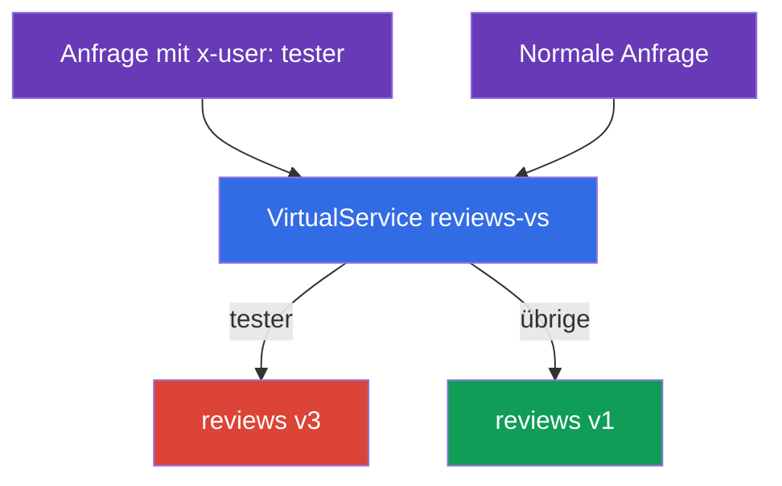
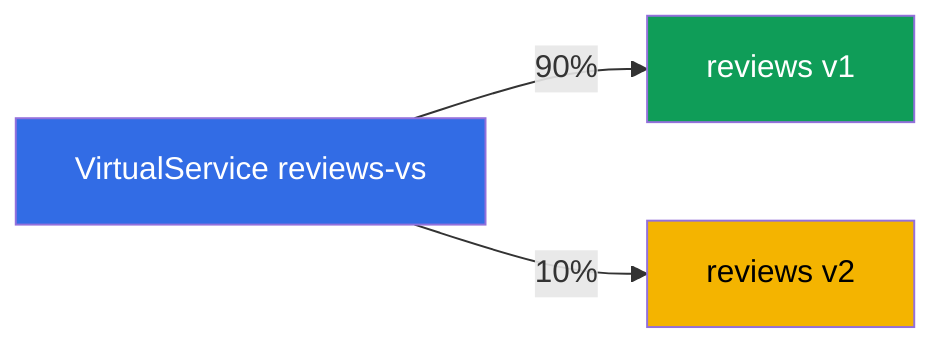
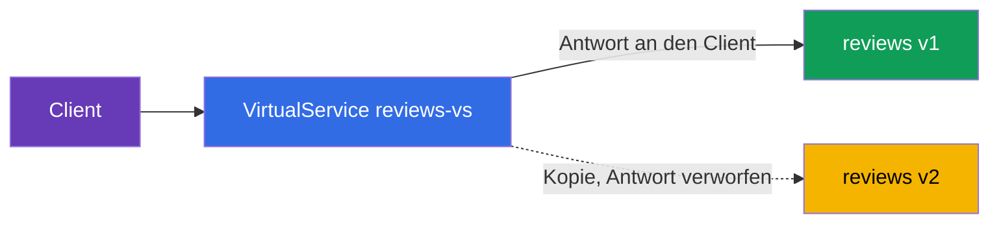

[RU version](ru.md) · [Eng version](en.md) · [Versión en español](es.md) · [Version française](fr.md)

# Kapitel 6. Release-Strategien: Canary, Header-Routing, Traffic Mirroring

> **Was kommt als Nächstes.** In Kapitel 5 haben wir die Basisressourcen behandelt:
> Gateway, VirtualService, DestinationRule. Jetzt wenden wir sie auf die wichtigste
> praktische Aufgabe an - das sichere Ausrollen neuer Versionen. Wir behandeln drei
> Techniken: Routing nach Headern (verdeckter Start für Tester), gewichtete Verteilung
> (Canary) und Mirroring des Datenverkehrs (Prüfung einer neuen Version an echtem
> Datenverkehr ohne Risiko).

## 6.1. Deployment versus Release

Zuerst eine wichtige Idee, die erklärt, wozu das alles nötig ist. In Kubernetes bedeutet
„eine neue Version ausrollen“ meist, das Deployment zu aktualisieren - und alle Benutzer
laufen sofort auf den neuen Code. Steckt darin ein Bug, sehen ihn alle und sofort.

Istio erlaubt es, zwei Ereignisse zu trennen:

- **Deployment** - die neue Version ist einfach im Cluster gestartet, die Pods laufen, aber
  es geht kein produktiver Datenverkehr auf sie.
- **Release** - Sie leiten bewusst Datenverkehr auf die neue Version: zuerst ein bisschen,
  dann mehr.

Der Sinn ist, dass „die neue Version ausrollen“ und „Benutzer darauf lassen“ jetzt zwei
unabhängige Schritte sind. Dazwischen kann man die neue Version prüfen und den Datenverkehr
jederzeit zurückrollen, ohne die Pods selbst anzufassen. Genau darauf bauen alle
Release-Strategien unten auf.

Technisch sind alle drei Techniken Regeln im `VirtualService` über den Subsets aus der
`DestinationRule` (Kapitel 5). Wir nehmen an, dass der Dienst `reviews` die Subsets `v1`,
`v2`, `v3` hat, die in der DestinationRule beschrieben sind.

## 6.2. Routing nach Headern (Dark Launch)

Aufgabe: Die neue experimentelle Version `v3` ist noch unausgereift, normale Benutzer dürfen
sie nicht sehen. Aber Tester sollen auf sie gelangen, um sie im produktiven Cluster zu
prüfen. Tester unterscheiden wir am HTTP-Header `x-user: tester`.

Lösung - eine `match`-Regel nach Header im VirtualService:

```yaml
apiVersion: networking.istio.io/v1
kind: VirtualService
metadata:
  name: reviews-vs
spec:
  hosts:
  - reviews
  http:
  - match:                    # REGEL 1: Header x-user: tester vorhanden
    - headers:
        x-user:
          exact: tester
    route:
    - destination:
        host: reviews
        subset: v3            # Tester auf v3
  - route:                    # REGEL 2: alle übrigen
    - destination:
        host: reviews
        subset: v1            # normale Benutzer auf v1
```



Wie das funktioniert:

- Die `http`-Regeln werden von oben nach unten geprüft, die erste passende greift.
- Enthält die Anfrage den Header `x-user: tester` - greift die erste Regel, der Datenverkehr
  geht auf `v3`.
- Alle übrigen Anfragen passen nicht auf das `match` und fallen in die zweite Regel (ohne
  `match`, sie ist die Standardregel) - sie gehen auf `v1`.

Das nennt man Dark Launch (verdeckter Start): Die neue Version läuft in der Produktion, ist
aber nur für die sichtbar, die das „Passwort“ kennen (den passenden Header). Matchen kann man
nicht nur Header, sondern auch den URI-Pfad, die Methode oder Query-Parameter.

## 6.3. Gewichtete Verteilung (Canary)

Aufgabe: die Benutzer schrittweise von der stabilen `v1` auf die neue `v2` überführen. Wir
beginnen mit einem kleinen Anteil, um Probleme an einem geringen Prozentsatz des
Datenverkehrs abzufangen.

Lösung - mehrere Destinations mit dem Feld `weight`:

```yaml
  http:
  - route:
    - destination:
        host: reviews
        subset: v1
      weight: 90        # 90% des Datenverkehrs auf die stabile v1
    - destination:
        host: reviews
        subset: v2
      weight: 10        # 10% auf die neue v2
```



Die Summe der Gewichte muss 100 ergeben. Danach läuft das Ausrollen schrittweise: Sie ändern
die Gewichte auf 70/30, dann 50/50, dann 0/100 - und die neue Version nimmt den gesamten
Datenverkehr an. Bemerken Sie bei einem Schritt ein Problem, setzen Sie die Gewichte zurück.
Die Benutzer werden dabei nicht angefasst, nur die Verteilung ändert sich.

Das ist der klassische **Canary Release**: Eine kleine „Kanarie“ des Datenverkehrs prüft die
neue Version, bevor alle darauf gehen. Diesen Prozess zu automatisieren (mit Metrik-Analyse
und automatischem Rollback) hilft Flagger - dazu Kapitel 24.

## 6.4. Traffic Mirroring (Schattenverkehr)

Sowohl Canary als auch Header-Routing schicken dennoch einen Teil der **echten** Benutzer
auf die neue Version. Und wenn man die neue Version an produktivem Datenverkehr prüfen will,
ganz ohne die Benutzer zu gefährden? Dafür gibt es das Mirroring.

Idee: 100 % der echten Anfragen bedient nach wie vor `v1`, aber Envoy schickt zusätzlich eine
**Kopie** jeder Anfrage an `v2`. Die Antwort von `v2` wird verworfen - der Client sieht sie
nie.

```yaml
  http:
  - route:
    - destination:
        host: reviews
        subset: v1        # 100% der Antworten an den Client von v1
    mirror:
      host: reviews
      subset: v2          # eine Kopie jeder Anfrage geht an v2
    mirrorPercentage:
      value: 100          # welcher Anteil des Datenverkehrs gespiegelt wird
```



Sehen wir uns die Felder an:

- **`route`** - die Hauptroute. Der Client erhält die Antwort nur von hier (Subset `v1`).
- **`mirror`** - wohin die Kopie der Anfrage geht (Subset `v2`). Das ist „abschießen und
  vergessen“: Envoy wartet nicht auf die Antwort des Spiegels und nutzt sie nicht.
- **`mirrorPercentage`** - welcher Anteil des Datenverkehrs dupliziert wird. Man kann zum
  Beispiel `25` setzen, um nur ein Viertel der produktiven Anfragen zu spiegeln.

Wozu das nötig ist: Sie leiten echte Last durch `v2` und beobachten deren Metriken, Logs und
Fehler, aber ganz ohne Risiko für die Benutzer. Fällt `v2` aus oder beginnt sie zu
fehlerhaften Antworten, bemerken es die Clients nicht - ihnen antwortet `v1`.

Eine Warnung: Die gespiegelten Anfragen erreichen `v2` tatsächlich. Ist es kein GET, sondern
zum Beispiel ein POST, das etwas schreibt, führt auch die Kopie den Schreibvorgang aus. Bei
Diensten mit Seiteneffekten (Schreiben in die DB, Versand von E-Mails) muss man das Mirroring
vorsichtig einsetzen.

## 6.5. Wie man das kombiniert

In der Praxis fügen sich die Techniken zu einer gemeinsamen Rollout-Strategie zusammen:

1. `v2` neben `v1` ausgerollt (Deployment), es geht kein Datenverkehr auf sie.
2. **Mirroring**: einen Schatten des produktiven Datenverkehrs auf `v2` geleitet, Metriken
   und Fehler beobachtet, ohne etwas zu riskieren.
3. **Header-Routing**: nur interne Tester per Header auf `v2` geleitet.
4. **Canary**: begonnen, echte Benutzer zu überführen - 10 %, 30 %, 50 %, 100 %.
5. Läuft es bei einem Schritt schlecht - zurückgerollt (Gewichte oder Route auf `v1`
   zurückgesetzt).

Alle Schritte sind Änderungen an einem einzigen `VirtualService`, die Pods werden dabei nicht
angefasst. Genau darin liegt die Stärke des Ansatzes: Der Release ist steuerbar und
umkehrbar geworden.

## 6.6. Zusammenfassung des Kapitels

- Istio trennt Deployment (die Version ist einfach gestartet) und Release (auf sie ist
  Datenverkehr geleitet) - das ist die Grundlage sicherer Rollouts.
- **Header-Routing (Dark Launch)**: Eine `match`-Regel nach Header leitet ein bestimmtes
  Publikum (zum Beispiel Tester) auf die neue Version, die übrigen auf die stabile.
- **Canary**: Das Feld `weight` verteilt den Datenverkehr prozentual zwischen den Versionen;
  indem Sie die Gewichte schrittweise ändern, überführen Sie die Benutzer auf die neue
  Version.
- **Traffic Mirroring**: `mirror` + `mirrorPercentage` schicken eine Kopie des Datenverkehrs
  auf die neue Version, die Antwort wird verworfen - Prüfung an produktivem Datenverkehr ohne
  Risiko.
- Mirroring ist bei Anfragen mit Seiteneffekten (Schreiben von Daten) gefährlich.
- Alle Techniken sind Regeln im VirtualService über den Subsets; der Rollout ist steuerbar
  und umkehrbar, die Pods werden nicht angefasst.

## 6.7. Fragen zur Selbstüberprüfung

1. Worin besteht der Unterschied zwischen Deployment und Release und warum ist das für
   sichere Rollouts wichtig?
2. Wie leitet man nur diejenigen auf die neue Version, die in ihrer Anfrage einen bestimmten
   Header haben?
3. Wie ist Canary über Gewichte aufgebaut und wie sieht ein schrittweiser Rollout aus?
4. Wodurch unterscheidet sich Mirroring von Canary? Sieht der Client die Antwort des
   Spiegels?
5. Warum ist Mirroring bei POST-Anfragen gefährlich, die Daten schreiben?

## Praxis

Üben Sie Routing nach Headern und Canary:

🧪 Lab 02: [tasks/ica/labs/02](../../labs/02/README_DE.MD)

Üben Sie das Mirroring des Datenverkehrs (und die Lastverteilung - Thema von Kapitel 7):

🧪 Lab 06: [tasks/ica/labs/06](../../labs/06/README_DE.MD)

---
[Inhaltsverzeichnis](../README_DE.md) · [Kapitel 5](../05/de.md) · [Kapitel 7](../07/de.md)
