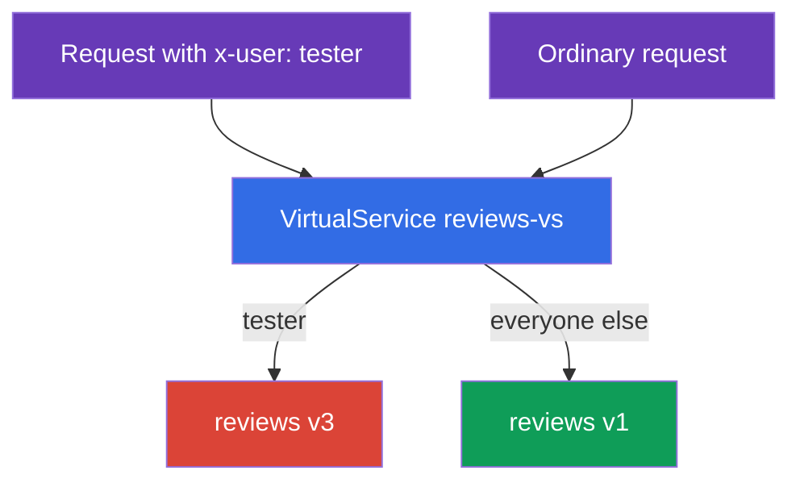
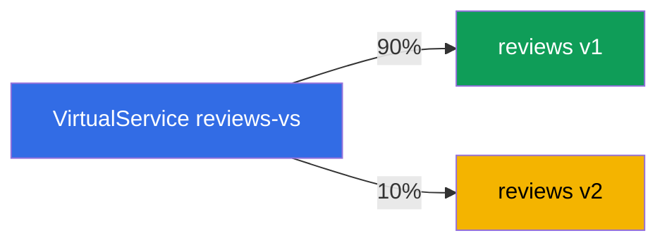
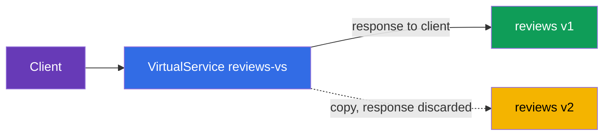

[RU version](ru.md) · [Versión en español](es.md)

# Chapter 6. Release strategies: canary, header-routing, traffic mirroring

> **What's next.** In chapter 5 we covered the base resources: Gateway, VirtualService,
> DestinationRule. Now we apply them to the main practical task - safely rolling out new
> versions. We cover three techniques: header-based routing (a dark launch for testers),
> weighted splitting (canary), and traffic mirroring (validating a new version on live
> traffic without risk).

## 6.1. Deployment vs release

First, an important idea that explains why all this is needed. In Kubernetes "roll out a new
version" usually means updating a Deployment - and all users immediately go to the new code.
If it has a bug, everyone sees it at once.

Istio lets you split two events:

- **Deployment** - the new version is simply running in the cluster, the pods work, but there
  is no live traffic on them.
- **Release** - you deliberately direct traffic to the new version: a little at first, then
  more.

The point is that deploying a new version and letting users onto it are now two independent
steps. Between them you can validate the new version and roll traffic back at any moment,
without touching the pods themselves. All the release strategies below are built on this.

Technically all three techniques are rules in a `VirtualService` on top of subsets from a
`DestinationRule` (chapter 5). We assume the `reviews` service has subsets `v1`, `v2`, `v3`
described in a DestinationRule.

## 6.2. Header-based routing (dark launch)

The task: the new experimental version `v3` is still raw, ordinary users must not see it. But
testers must reach it, to validate it on the live cluster. We tell testers apart by the HTTP
header `x-user: tester`.

The solution is a `match` rule on the header in the VirtualService:

```yaml
apiVersion: networking.istio.io/v1
kind: VirtualService
metadata:
  name: reviews-vs
spec:
  hosts:
  - reviews
  http:
  - match:                    # RULE 1: there is a header x-user: tester
    - headers:
        x-user:
          exact: tester
    route:
    - destination:
        host: reviews
        subset: v3            # testers to v3
  - route:                    # RULE 2: everyone else
    - destination:
        host: reviews
        subset: v1            # ordinary users to v1
```



How it works:

- The `http` rules are checked top to bottom, the first matching one fires.
- If the request has the header `x-user: tester` - the first rule fires, the traffic goes to
  `v3`.
- All other requests do not match the `match` and fall into the second rule (with no `match`,
  the default one) - they go to `v1`.

This is called a dark launch: the new version runs in production but is visible only to those
who know the "password" (the required header). You can match not only headers but also the
URI path, the method, and query parameters.

## 6.3. Weighted splitting (canary)

The task: gradually move users from the stable `v1` to the new `v2`. We start with a small
share, to catch problems on a small percentage of traffic.

The solution is several destinations with a `weight` field:

```yaml
  http:
  - route:
    - destination:
        host: reviews
        subset: v1
      weight: 90        # 90% of traffic to the stable v1
    - destination:
        host: reviews
        subset: v2
      weight: 10        # 10% to the new v2
```



The weights must sum to 100. From there the rollout proceeds gradually: you change the weights
to 70/30, then 50/50, then 0/100 - and the new version takes all the traffic. If at some step
you notice a problem, you put the weights back. Users are not touched in the process, only the
distribution changes.

This is the classic **canary release**: a small "canary" of traffic validates the new version
before everyone goes to it. Flagger helps automate this process (with metric analysis and
auto-rollback) - see chapter 24.

## 6.4. Traffic mirroring (shadow traffic)

Both canary and header-routing still send some **real** users to the new version. What if you
want to validate the new version on live traffic without risking users at all? That is what
mirroring is for.

The idea: 100% of real requests are still served by `v1`, but Envoy additionally sends a
**copy** of each request to `v2`. The response from `v2` is discarded - the client never sees
it.

```yaml
  http:
  - route:
    - destination:
        host: reviews
        subset: v1        # 100% of client responses come from v1
    mirror:
      host: reviews
      subset: v2          # a copy of each request goes to v2
    mirrorPercentage:
      value: 100          # what share of traffic to mirror
```



Let's break down the fields:

- **`route`** - the main route. The client gets its response only from here (subset `v1`).
- **`mirror`** - where to send the copy of the request (subset `v2`). This is "fire and
  forget": Envoy does not wait for and does not use the mirror's response.
- **`mirrorPercentage`** - what share of traffic to duplicate. You can set, for example, `25`,
  to mirror only a quarter of the live requests.

Why this is needed: you run real load through `v2` and watch its metrics, logs and errors, but
without any risk to users. If `v2` crashes or starts erroring, clients will not notice - `v1`
answers them.

One warning: mirrored requests really do reach `v2`. If it is not a GET but, say, a POST that
writes something, the copy will also perform the write. For services with side effects (writing
to a DB, sending emails) mirroring must be applied carefully.

## 6.5. How these are combined

In practice the techniques add up into an overall rollout strategy:

1. You deployed `v2` next to `v1` (deployment), there is no traffic on it.
2. **Mirroring**: you sent a shadow of live traffic to `v2`, looked at metrics and errors,
   risking nothing.
3. **Header-routing**: you let only internal testers onto `v2` by header.
4. **Canary**: you started moving real users - 10%, 30%, 50%, 100%.
5. If anything is bad at any step - you roll back (put the weights or the route back to `v1`).

All the steps are edits to a single `VirtualService`, and the pods are not touched in the
process. That is the strength of the approach: the release has become controllable and
reversible.

## 6.6. Chapter summary

- Istio separates deployment (the version is simply running) and release (traffic is directed
  to it) - this is the foundation of safe rollouts.
- **Header-routing (dark launch)**: a `match` rule on a header directs a specific audience (for
  example, testers) to the new version, and everyone else to the stable one.
- **Canary**: the `weight` field splits traffic between versions by percentage; by gradually
  changing the weights you move users to the new version.
- **Traffic mirroring**: `mirror` + `mirrorPercentage` send a copy of traffic to the new
  version, the response is discarded - validation on live traffic without risk.
- Mirroring is dangerous for requests with side effects (writing data).
- All the techniques are rules in a VirtualService on top of subsets; the rollout is
  controllable and reversible, the pods are not touched.

## 6.7. Self-check questions

1. What is the difference between deployment and release, and why does it matter for safe
   rollouts?
2. How do you direct only those who have a certain header in the request to the new version?
3. How does canary via weights work, and what does a gradual rollout look like?
4. How does mirroring differ from canary? Does the client see the mirror's response?
5. Why is mirroring dangerous for POST requests that write data?

## Practice

Practice header-based routing and canary:

🧪 Lab 02: [tasks/ica/labs/02](../../labs/02/README.MD)

Practice traffic mirroring (and load balancing - the topic of chapter 7):

🧪 Lab 06: [tasks/ica/labs/06](../../labs/06/README.MD)

---
[Contents](../README.md) · [Chapter 5](../05/en.md) · [Chapter 7](../07/en.md)
