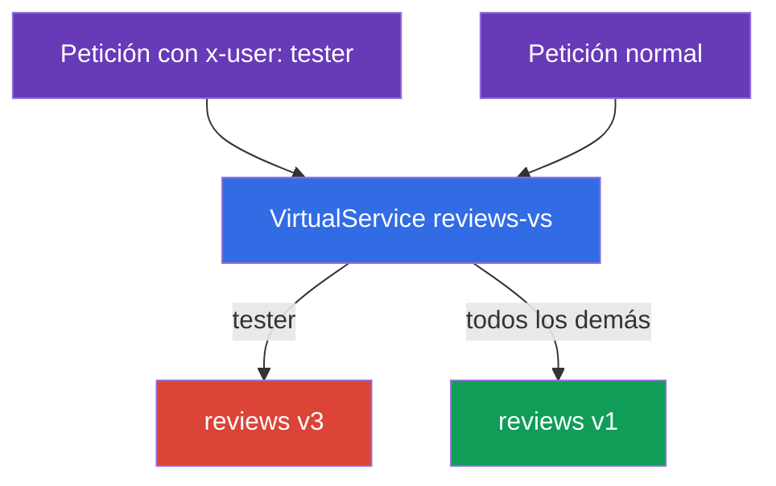
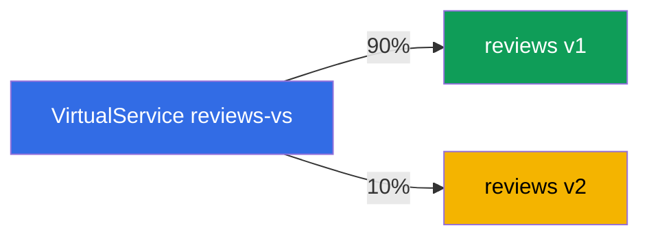
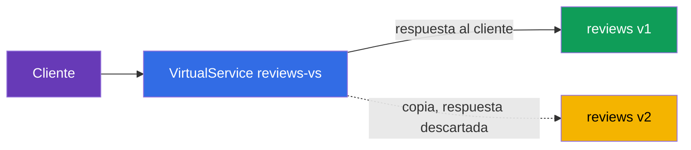

[RU version](ru.md) · [Eng version](en.md) · [Version française](fr.md) · [Deutsche Version](de.md)

# Capítulo 6. Estrategias de release: canary, enrutamiento por cabeceras, mirroring de tráfico

> **Qué sigue.** En el capítulo 5 cubrimos los recursos base: Gateway, VirtualService,
> DestinationRule. Ahora los aplicamos a la tarea práctica principal: desplegar nuevas
> versiones de forma segura. Cubrimos tres técnicas: enrutamiento por cabeceras (un dark
> launch para testers), división por pesos (canary) y mirroring de tráfico (validar una nueva
> versión sobre tráfico real sin riesgo).

## 6.1. Deployment vs release

Primero, una idea importante que explica por qué hace falta todo esto. En Kubernetes
"desplegar una nueva versión" normalmente significa actualizar un Deployment, y todos los
usuarios pasan de inmediato al nuevo código. Si tiene un bug, todos lo ven a la vez.

Istio te permite separar dos eventos:

- **Deployment**: la nueva versión simplemente está corriendo en el clúster, los pods
  funcionan, pero no hay tráfico real sobre ellos.
- **Release**: diriges tráfico deliberadamente a la nueva versión: primero un poco, luego más.

La cuestión es que desplegar una nueva versión y dejar entrar a los usuarios en ella son ahora
dos pasos independientes. Entre ellos puedes validar la nueva versión y revertir el tráfico en
cualquier momento, sin tocar los propios pods. Todas las estrategias de release de abajo se
apoyan en esto.

Técnicamente, las tres técnicas son reglas en un `VirtualService` sobre subsets de un
`DestinationRule` (capítulo 5). Damos por hecho que el servicio `reviews` tiene subsets `v1`,
`v2`, `v3` descritos en un DestinationRule.

## 6.2. Enrutamiento por cabeceras (dark launch)

La tarea: la nueva versión experimental `v3` todavía está verde, los usuarios normales no
deben verla. Pero los testers deben poder llegar a ella, para validarla en el clúster real. A
los testers los distinguimos por la cabecera HTTP `x-user: tester`.

La solución es una regla `match` sobre la cabecera en el VirtualService:

```yaml
apiVersion: networking.istio.io/v1
kind: VirtualService
metadata:
  name: reviews-vs
spec:
  hosts:
  - reviews
  http:
  - match:                    # REGLA 1: hay una cabecera x-user: tester
    - headers:
        x-user:
          exact: tester
    route:
    - destination:
        host: reviews
        subset: v3            # testers a v3
  - route:                    # REGLA 2: todos los demás
    - destination:
        host: reviews
        subset: v1            # usuarios normales a v1
```



Cómo funciona:

- Las reglas `http` se comprueban de arriba abajo, se dispara la primera que coincide.
- Si la petición tiene la cabecera `x-user: tester`, se dispara la primera regla, el tráfico
  va a `v3`.
- Todas las demás peticiones no coinciden con el `match` y caen en la segunda regla (sin
  `match`, la de por defecto): van a `v1`.

Esto se llama dark launch: la nueva versión corre en producción pero solo es visible para
quienes conocen la "contraseña" (la cabecera requerida). Puedes hacer `match` no solo por
cabeceras, sino también por la ruta URI, el método y los parámetros de consulta.

## 6.3. División por pesos (canary)

La tarea: mover gradualmente a los usuarios desde la estable `v1` a la nueva `v2`. Empezamos
con una porción pequeña, para detectar problemas sobre un pequeño porcentaje de tráfico.

La solución son varios destinos con un campo `weight`:

```yaml
  http:
  - route:
    - destination:
        host: reviews
        subset: v1
      weight: 90        # 90% del tráfico a la estable v1
    - destination:
        host: reviews
        subset: v2
      weight: 10        # 10% a la nueva v2
```



Los pesos deben sumar 100. A partir de ahí el rollout avanza gradualmente: cambias los pesos a
70/30, luego 50/50, luego 0/100, y la nueva versión se lleva todo el tráfico. Si en algún paso
notas un problema, vuelves a poner los pesos como estaban. A los usuarios no se les toca en el
proceso, solo cambia la distribución.

Este es el clásico **canary release**: un pequeño "canario" de tráfico valida la nueva versión
antes de que todos pasen a ella. Flagger ayuda a automatizar este proceso (con análisis de
métricas y auto-rollback); ver el capítulo 24.

## 6.4. Mirroring de tráfico (shadow traffic)

Tanto canary como el enrutamiento por cabeceras siguen enviando algunos usuarios **reales** a
la nueva versión. ¿Y si quieres validar la nueva versión sobre tráfico real sin arriesgar a
los usuarios en absoluto? Para eso está el mirroring.

La idea: el 100% de las peticiones reales las sigue atendiendo `v1`, pero Envoy envía además
una **copia** de cada petición a `v2`. La respuesta de `v2` se descarta, el cliente nunca la
ve.

```yaml
  http:
  - route:
    - destination:
        host: reviews
        subset: v1        # el 100% de las respuestas al cliente vienen de v1
    mirror:
      host: reviews
      subset: v2          # una copia de cada petición va a v2
    mirrorPercentage:
      value: 100          # qué porción del tráfico reflejar
```



Desglosemos los campos:

- **`route`**: la ruta principal. El cliente obtiene su respuesta solo de aquí (subset `v1`).
- **`mirror`**: adónde enviar la copia de la petición (subset `v2`). Esto es "fire and
  forget": Envoy no espera ni usa la respuesta del mirror.
- **`mirrorPercentage`**: qué porción del tráfico duplicar. Puedes poner, por ejemplo, `25`,
  para reflejar solo una cuarta parte de las peticiones reales.

Por qué hace falta esto: haces pasar carga real por `v2` y observas sus métricas, logs y
errores, pero sin ningún riesgo para los usuarios. Si `v2` se cae o empieza a dar errores, los
clientes no lo notarán: `v1` les responde.

Una advertencia: las peticiones reflejadas sí llegan de verdad a `v2`. Si no es un GET sino,
digamos, un POST que escribe algo, la copia también realizará la escritura. Para servicios con
efectos secundarios (escribir en una BD, enviar correos) el mirroring debe aplicarse con
cuidado.

## 6.5. Cómo se combinan

En la práctica las técnicas se suman en una estrategia de rollout global:

1. Desplegaste `v2` junto a `v1` (deployment), no hay tráfico sobre ella.
2. **Mirroring**: enviaste una sombra del tráfico real a `v2`, miraste métricas y errores, sin
   arriesgar nada.
3. **Enrutamiento por cabeceras**: dejaste entrar en `v2` solo a los testers internos por
   cabecera.
4. **Canary**: empezaste a mover usuarios reales: 10%, 30%, 50%, 100%.
5. Si algo va mal en algún paso, reviertes (vuelves a poner los pesos o la ruta hacia `v1`).

Todos los pasos son ediciones de un único `VirtualService`, y los pods no se tocan en el
proceso. Esa es la fuerza del enfoque: el release se ha vuelto controlable y reversible.

## 6.6. Resumen del capítulo

- Istio separa el deployment (la versión simplemente está corriendo) del release (se le
  dirige tráfico): esta es la base de los despliegues seguros.
- **Enrutamiento por cabeceras (dark launch)**: una regla `match` sobre una cabecera dirige a
  una audiencia concreta (por ejemplo, testers) hacia la nueva versión, y a todos los demás
  hacia la estable.
- **Canary**: el campo `weight` divide el tráfico entre versiones por porcentaje; cambiando
  gradualmente los pesos mueves a los usuarios a la nueva versión.
- **Mirroring de tráfico**: `mirror` + `mirrorPercentage` envían una copia del tráfico a la
  nueva versión, la respuesta se descarta: validación sobre tráfico real sin riesgo.
- El mirroring es peligroso para peticiones con efectos secundarios (escritura de datos).
- Todas las técnicas son reglas en un VirtualService sobre subsets; el rollout es controlable
  y reversible, los pods no se tocan.

## 6.7. Preguntas de autoevaluación

1. ¿Cuál es la diferencia entre deployment y release, y por qué importa para los despliegues
   seguros?
2. ¿Cómo diriges a la nueva versión solo a quienes tienen cierta cabecera en la petición?
3. ¿Cómo funciona canary mediante pesos, y qué aspecto tiene un rollout gradual?
4. ¿En qué se diferencia el mirroring de canary? ¿Ve el cliente la respuesta del mirror?
5. ¿Por qué el mirroring es peligroso para peticiones POST que escriben datos?

## Práctica

Practica el enrutamiento por cabeceras y canary:

🧪 Laboratorio 02: [tasks/ica/labs/02](../../labs/02/README_ES.MD)

Practica el mirroring de tráfico (y el balanceo de carga, el tema del capítulo 7):

🧪 Laboratorio 06: [tasks/ica/labs/06](../../labs/06/README_ES.MD)

---
[Índice](../README_ES.md) · [Capítulo 5](../05/es.md) · [Capítulo 7](../07/es.md)
