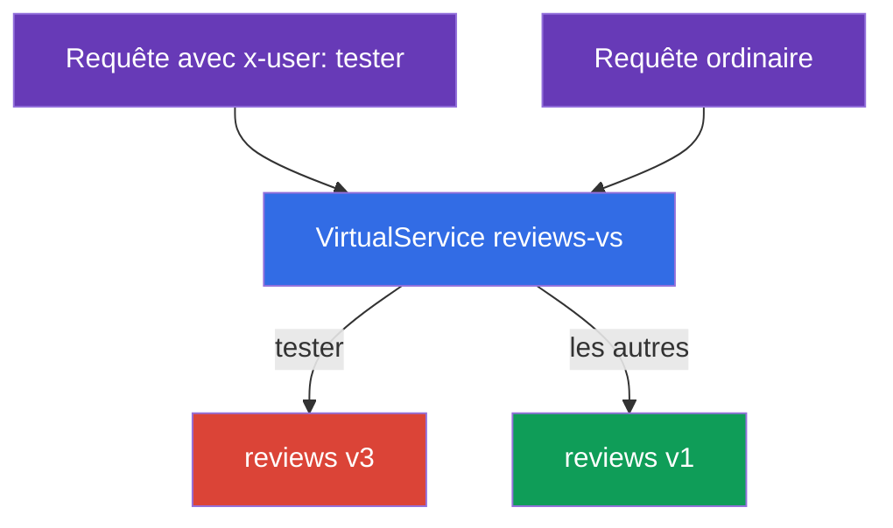
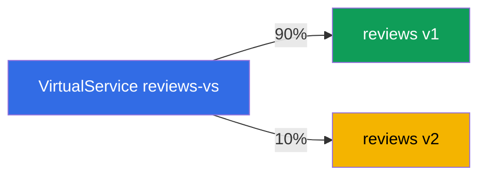
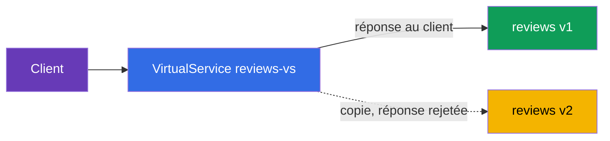

[RU version](ru.md) · [Eng version](en.md) · [Versión en español](es.md) · [Deutsche Version](de.md)

# Chapitre 6. Stratégies de release : canary, header-routing, traffic mirroring

> **Ce qui suit.** Au chapitre 5, nous avons étudié les ressources de base : Gateway,
> VirtualService, DestinationRule. Appliquons-les maintenant à la principale tâche
> pratique - le déploiement sûr de nouvelles versions. Nous verrons trois techniques : le
> routage par en-têtes (lancement caché pour les testeurs), la répartition pondérée
> (canary) et le mirroring du trafic (vérifier une nouvelle version sur du trafic de
> production sans risque).

## 6.1. Deployment versus release

D'abord une idée importante qui explique pourquoi tout cela est nécessaire. Dans
Kubernetes, « déployer une nouvelle version » signifie généralement mettre à jour un
Deployment - et tous les utilisateurs passent aussitôt sur le nouveau code. S'il contient
un bug, tout le monde le voit d'un coup.

Istio permet de séparer deux événements :

- **Deployment (déploiement)** - la nouvelle version est simplement lancée dans le cluster,
  les pods tournent, mais aucun trafic de production ne va vers eux.
- **Release (release)** - vous dirigez délibérément du trafic vers la nouvelle version :
  d'abord un peu, puis davantage.

L'idée est que déployer une nouvelle version et y envoyer les utilisateurs sont désormais
deux étapes indépendantes. Entre les deux, on peut vérifier la nouvelle version et, à tout
moment, ramener le trafic en arrière sans toucher aux pods eux-mêmes. C'est là-dessus que
reposent toutes les stratégies de release ci-dessous.

Techniquement, les trois techniques sont des règles dans un `VirtualService` par-dessus
les subsets d'une `DestinationRule` (chapitre 5). Supposons que le service `reviews`
possède les subsets `v1`, `v2`, `v3`, décrits dans la DestinationRule.

## 6.2. Routage par en-têtes (dark launch)

Objectif : la nouvelle version expérimentale `v3` est encore brute, les utilisateurs
ordinaires ne doivent pas la voir. Mais les testeurs doivent y accéder, pour la vérifier
sur le cluster de production. On distingue les testeurs par l'en-tête HTTP `x-user: tester`.

La solution - une règle `match` par en-tête dans le VirtualService :

```yaml
apiVersion: networking.istio.io/v1
kind: VirtualService
metadata:
  name: reviews-vs
spec:
  hosts:
  - reviews
  http:
  - match:                    # RÈGLE 1 : présence de l'en-tête x-user: tester
    - headers:
        x-user:
          exact: tester
    route:
    - destination:
        host: reviews
        subset: v3            # les testeurs vers v3
  - route:                    # RÈGLE 2 : tous les autres
    - destination:
        host: reviews
        subset: v1            # les utilisateurs ordinaires vers v1
```



Comment cela fonctionne :

- Les règles `http` sont évaluées de haut en bas, la première qui correspond s'applique.
- Si la requête contient l'en-tête `x-user: tester` - la première règle s'applique, le
  trafic va vers `v3`.
- Toutes les autres requêtes ne correspondent pas au `match` et tombent dans la deuxième
  règle (sans `match`, celle par défaut) - elles vont vers `v1`.

C'est ce qu'on appelle un dark launch (lancement caché) : la nouvelle version tourne en
prod, mais n'est visible que par ceux qui connaissent le « mot de passe » (l'en-tête
voulu). On peut matcher non seulement les en-têtes, mais aussi le chemin d'URI, la méthode,
les paramètres de query.

## 6.3. Répartition pondérée (canary)

Objectif : faire passer progressivement les utilisateurs de la version stable `v1` vers la
nouvelle `v2`. On commence par une faible part, pour attraper les problèmes sur un petit
pourcentage de trafic.

La solution - plusieurs destinations avec le champ `weight` :

```yaml
  http:
  - route:
    - destination:
        host: reviews
        subset: v1
      weight: 90        # 90% du trafic vers la v1 stable
    - destination:
        host: reviews
        subset: v2
      weight: 10        # 10% vers la nouvelle v2
```



La somme des poids doit faire 100. Ensuite, le déploiement se fait progressivement : vous
changez les poids en 70/30, puis 50/50, puis 0/100 - et la nouvelle version prend tout le
trafic. Si à une étape vous remarquez un problème, vous ramenez les poids en arrière. Les
utilisateurs ne sont pas touchés, seule la répartition change.

C'est le **canary release** classique : un petit « canari » de trafic vérifie la nouvelle
version avant que tout le monde y passe. Pour automatiser ce processus (avec analyse des
métriques et rollback automatique), Flagger aide - il en est question au chapitre 24.

## 6.4. Traffic mirroring (trafic fantôme)

Le canary comme le header-routing envoient tout de même une partie des utilisateurs
**réels** vers la nouvelle version. Et si l'on veut vérifier la nouvelle version sur du
trafic de production, sans risquer les utilisateurs du tout ? Pour cela, il y a le
mirroring.

Idée : 100 % des requêtes réelles continuent d'être servies par `v1`, mais Envoy envoie en
plus une **copie** de chaque requête vers `v2`. La réponse de `v2` est rejetée - le client
ne la voit jamais.

```yaml
  http:
  - route:
    - destination:
        host: reviews
        subset: v1        # 100% des réponses au client viennent de v1
    mirror:
      host: reviews
      subset: v2          # une copie de chaque requête part vers v2
    mirrorPercentage:
      value: 100          # quelle part du trafic mirrorer
```



Détaillons les champs :

- **`route`** - la route principale. Le client ne reçoit de réponse que d'ici (subset `v1`).
- **`mirror`** - où envoyer la copie de la requête (subset `v2`). C'est du « tire et
  oublie » : Envoy n'attend pas et n'utilise pas la réponse du miroir.
- **`mirrorPercentage`** - quelle part du trafic dupliquer. On peut mettre, par exemple,
  `25`, pour ne mirrorer qu'un quart des requêtes de production.

À quoi cela sert : vous faites passer de la charge réelle par `v2` et vous observez ses
métriques, logs et erreurs, mais sans aucun risque pour les utilisateurs. Si `v2` tombe ou
se met à renvoyer des erreurs, les clients ne le remarquent pas - c'est `v1` qui leur
répond.

Un avertissement : les requêtes mirrorées atteignent réellement `v2`. Si ce n'est pas un
GET mais, par exemple, un POST qui écrit quelque chose, la copie effectuera elle aussi
l'écriture. Pour les services à effets de bord (écriture en BD, envoi d'e-mails), le
mirroring doit s'appliquer avec précaution.

## 6.5. Comment on les combine

En pratique, ces techniques se combinent en une stratégie de déploiement globale :

1. On a déployé `v2` à côté de `v1` (deployment), aucun trafic ne va vers elle.
2. **Mirroring** : on envoie une ombre du trafic de production vers `v2`, on observe les
   métriques et les erreurs, sans rien risquer.
3. **Header-routing** : on envoie vers `v2` uniquement les testeurs internes via l'en-tête.
4. **Canary** : on commence à faire passer les utilisateurs réels - 10 %, 30 %, 50 %, 100 %.
5. Si à une étape quelconque ça se passe mal - on fait un rollback (on ramène les poids ou
   la route vers `v1`).

Toutes les étapes sont des modifications d'un même `VirtualService`, les pods ne sont pas
touchés. C'est là toute la force de l'approche : le release est devenu maîtrisable et
réversible.

## 6.6. Résumé du chapitre

- Istio sépare le deployment (la version est simplement lancée) et le release (le trafic y
  est dirigé) - c'est la base des déploiements sûrs.
- **Header-routing (dark launch)** : une règle `match` par en-tête dirige un public
  particulier (par exemple, les testeurs) vers la nouvelle version, les autres vers la
  stable.
- **Canary** : le champ `weight` répartit le trafic entre les versions par pourcentages ;
  en changeant progressivement les poids, vous faites passer les utilisateurs vers la
  nouvelle version.
- **Traffic mirroring** : `mirror` + `mirrorPercentage` envoient une copie du trafic vers
  la nouvelle version, la réponse est rejetée - vérification sur du trafic de production
  sans risque.
- Le mirroring est dangereux pour les requêtes à effets de bord (écriture de données).
- Toutes ces techniques sont des règles dans un VirtualService par-dessus les subsets ; le
  déploiement est maîtrisable et réversible, les pods ne sont pas touchés.

## 6.7. Questions d'auto-évaluation

1. Quelle est la différence entre deployment et release et pourquoi est-ce important pour
   les déploiements sûrs ?
2. Comment diriger vers la nouvelle version uniquement ceux dont la requête contient un
   en-tête donné ?
3. Comment fonctionne le canary par poids et à quoi ressemble un déploiement progressif ?
4. En quoi le mirroring diffère-t-il du canary ? Le client voit-il la réponse du miroir ?
5. Pourquoi le mirroring est-il dangereux pour les requêtes POST qui écrivent des données ?

## Pratique

Entraînez-vous au routage par en-têtes et au canary :

🧪 Lab 02 : [tasks/ica/labs/02](../../labs/02/README_FR.MD)

Entraînez-vous au mirroring du trafic (et à la répartition de charge - sujet du chapitre 7) :

🧪 Lab 06 : [tasks/ica/labs/06](../../labs/06/README_FR.MD)

---
[Table des matières](../README_FR.md) · [Chapitre 5](../05/fr.md) · [Chapitre 7](../07/fr.md)
