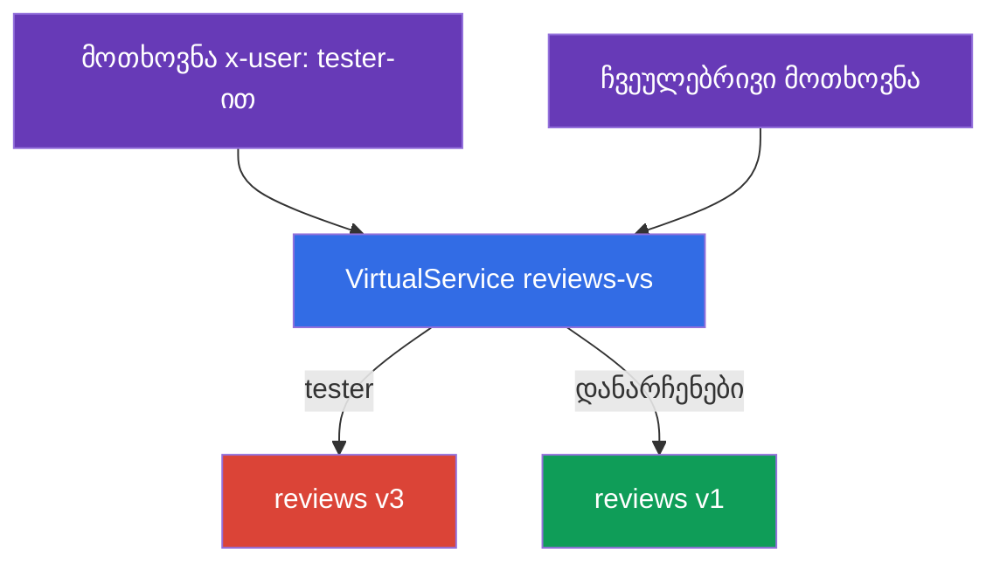
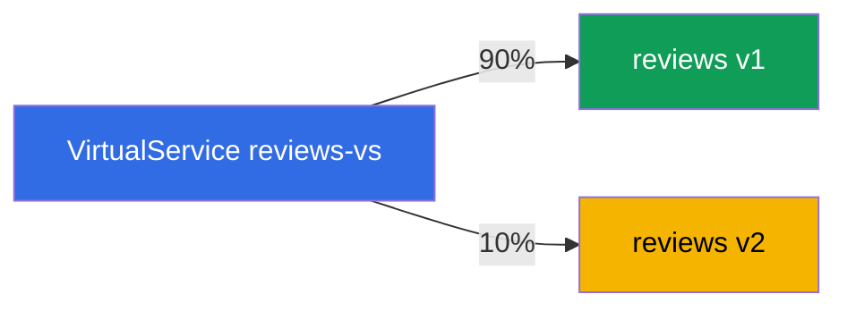
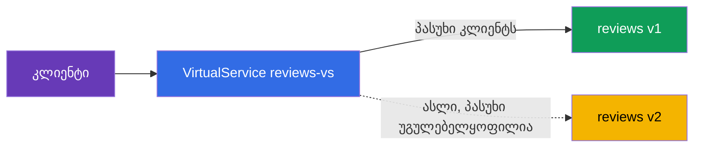

[Русская версия](ru.md) · [Eng version](en.md) · [Versión en español](es.md) · [Version française](fr.md) · [Deutsche Version](de.md) · [繁體中文版](tw.md) · [日本語版](jp.md)

# თავი 6. რელიზის სტრატეგიები: canary, header-routing, traffic mirroring

> **რა იქნება შემდეგ.** მე-5 თავში განვიხილეთ საბაზისო რესურსები: Gateway, VirtualService,
> DestinationRule. ახლა მათ გამოვიყენებთ მთავარი პრაქტიკული ამოცანისთვის - ახალი
> ვერსიების უსაფრთხოდ გასაშვებად. განვიხილავთ სამ ხერხს: სათაურების მიხედვით
> მარშრუტიზაციას (ტესტერებისთვის დაფარულ გაშვებას), წონიან განაწილებას (canary) და
> ტრაფიკის სარკისებურ ასახვას (ახალი ვერსიის შემოწმებას სამუშაო ტრაფიკზე რისკის გარეშე).

## 6.1. Deployment და release

თავდაპირველად განვიხილოთ მნიშვნელოვანი იდეა, რომელიც ხსნის, რატომ არის ეს ყველაფერი
საჭირო. Kubernetes-ში „ახალი ვერსიის გაშვება“ ჩვეულებრივ Deployment-ის განახლებას
ნიშნავს - და ყველა მომხმარებელი მაშინვე ახალ კოდზე გადადის. თუ მასში შეცდომაა, ამას
ყველა დაუყოვნებლივ დაინახავს.

Istio საშუალებას გვაძლევს, ორი მოვლენა ერთმანეთისგან გავმიჯნოთ:

- **Deployment (განთავსება)** - ახალი ვერსია უბრალოდ გაშვებულია კლასტერში, პოდები
  მუშაობს, მაგრამ სამუშაო ტრაფიკი მათზე არ მიდის.
- **Release (რელიზი)** - თქვენ გააზრებულად მიმართავთ ტრაფიკს ახალ ვერსიაზე: ჯერ
  მცირედს, შემდეგ კი მეტს.

იდეა ისაა, რომ ახალი ვერსიის განთავსება და მასზე მომხმარებლების გადაყვანა ახლა ორი
დამოუკიდებელი ნაბიჯია. მათ შორის შესაძლებელია ახალი ვერსიის შემოწმება და ნებისმიერ
დროს ტრაფიკის უკან დაბრუნება თავად პოდების ხელშეუხებლად. ქვემოთ განხილული რელიზის
ყველა სტრატეგია სწორედ ამას ეფუძნება.

ტექნიკურად, სამივე ხერხი არის `VirtualService`-ის წესები `DestinationRule`-ში
განსაზღვრული subsets-ის საფუძველზე (თავი 5). ვგულისხმობთ, რომ სერვის `reviews`-ს აქვს
DestinationRule-ში აღწერილი subsets `v1`, `v2`, `v3`.

## 6.2. მარშრუტიზაცია სათაურების მიხედვით (dark launch)

ამოცანა: ახალი ექსპერიმენტული ვერსია `v3` ჯერ არ არის მზად და ჩვეულებრივმა
მომხმარებლებმა ის არ უნდა ნახონ. თუმცა ტესტერებს მასზე წვდომა უნდა ჰქონდეთ, რათა
ვერსია სამუშაო კლასტერში შეამოწმონ. ტესტერებს HTTP-სათაურით `x-user: tester`
განვასხვავებთ.

გადაწყვეტა - VirtualService-ში სათაურის მიხედვით `match` წესი:

```yaml
apiVersion: networking.istio.io/v1
kind: VirtualService
metadata:
  name: reviews-vs
spec:
  hosts:
  - reviews
  http:
  - match:                    # წესი 1: არის სათაური x-user: tester
    - headers:
        x-user:
          exact: tester
    route:
    - destination:
        host: reviews
        subset: v3            # ტესტერები v3-ზე
  - route:                    # წესი 2: ყველა დანარჩენი
    - destination:
        host: reviews
        subset: v1            # ჩვეულებრივი მომხმარებლები v1-ზე
```



როგორ მუშაობს ეს:

- `http` წესები მოწმდება ზემოდან ქვემოთ და პირველი შესაბამისი წესი ამოქმედდება.
- თუ მოთხოვნაში არის სათაური `x-user: tester`, ამოქმედდება პირველი წესი და ტრაფიკი
  `v3`-ზე წავა.
- ყველა დანარჩენი მოთხოვნა `match`-ს არ შეესაბამება და მეორე წესში მოხვდება
  (`match`-ის გარეშე, ის ნაგულისხმევი წესია) - ისინი `v1`-ზე მიდის.

ამას dark launch (დაფარული გაშვება) ეწოდება: ახალი ვერსია production-ში მუშაობს,
მაგრამ მას მხოლოდ ისინი ხედავენ, ვინც „პაროლი“ (საჭირო სათაური) იცის. დამთხვევის
შემოწმება შესაძლებელია არა მხოლოდ სათაურების, არამედ URI-ის გზის, მეთოდისა და
query-პარამეტრების მიხედვითაც.

## 6.3. წონიანი განაწილება (canary)

ამოცანა: მომხმარებლები სტაბილური `v1`-დან ახალ `v2`-ზე თანდათან გადავიყვანოთ. მცირე
წილით ვიწყებთ, რათა პრობლემები ტრაფიკის მცირე პროცენტზე გამოვავლინოთ.

გადაწყვეტა - რამდენიმე destination ველით `weight`:

```yaml
  http:
  - route:
    - destination:
        host: reviews
        subset: v1
      weight: 90        # ტრაფიკის 90% სტაბილურ v1-ზე
    - destination:
        host: reviews
        subset: v2
      weight: 10        # 10% ახალ v2-ზე
```



წონების ჯამი 100 უნდა იყოს. შემდეგ გაშვება ეტაპობრივად გრძელდება: წონებს ცვლით
70/30-ზე, შემდეგ 50/50-ზე, ბოლოს 0/100-ზე - და ახალი ვერსია მთელ ტრაფიკს იღებს. თუ
რომელიმე ეტაპზე პრობლემა შენიშნეთ, წონებს უკან აბრუნებთ. ამ დროს მომხმარებლებს არაფერი
ეხებათ, იცვლება მხოლოდ განაწილება.

ეს კლასიკური **canary release**-ია: ტრაფიკის მცირე „კანარი“ ახალ ვერსიას ამოწმებს,
სანამ მასზე ყველა გადავა. ამ პროცესის ავტომატიზაციაში (მეტრიკების ანალიზითა და
ავტომატური უკან დაბრუნებით) Flagger გვეხმარება - მას 24-ე თავი ეძღვნება.

## 6.4. Traffic mirroring (ჩრდილოვანი ტრაფიკი)

როგორც canary, ისე header-routing **რეალური** მომხმარებლების ნაწილს მაინც ახალ
ვერსიაზე აგზავნის. მაგრამ როგორ უნდა შევამოწმოთ ახალი ვერსია სამუშაო ტრაფიკზე ისე,
რომ მომხმარებლებს საერთოდ არ შევუქმნათ რისკი? ამისთვის სარკისებური ასახვა არსებობს.

იდეა: რეალური მოთხოვნების 100%-ს კვლავ `v1` ამუშავებს, მაგრამ Envoy დამატებით ყოველი
მოთხოვნის **ასლს** `v2`-ზე აგზავნის. `v2`-ის პასუხი უგულებელყოფილია - კლიენტი მას
ვერასოდეს ხედავს.

```yaml
  http:
  - route:
    - destination:
        host: reviews
        subset: v1        # კლიენტისთვის პასუხების 100% v1-იდან
    mirror:
      host: reviews
      subset: v2          # ყოველი მოთხოვნის ასლი მიდის v2-ზე
    mirrorPercentage:
      value: 100          # ტრაფიკის რა წილი დაიმირაროს
```



განვიხილოთ ველები:

- **`route`** - ძირითადი მარშრუტი. კლიენტი პასუხს მხოლოდ აქედან იღებს (subset `v1`).
- **`mirror`** - სად გაიგზავნოს მოთხოვნის ასლი (subset `v2`). ეს არის „გაისროლე და
  დაივიწყე“: Envoy არ ელოდება და არ იყენებს სარკის პასუხს.
- **`mirrorPercentage`** - ტრაფიკის რა ნაწილის დუბლირება მოხდეს. მაგალითად,
  შესაძლებელია `25`-ის მითითება, რათა სამუშაო მოთხოვნების მხოლოდ მეოთხედი აისახოს.

რისთვის არის ეს საჭირო: თქვენ რეალურ დატვირთვას `v2`-ში ატარებთ და აკვირდებით მის
მეტრიკებს, ჟურნალებსა და შეცდომებს, თუმცა მომხმარებლებისთვის ყოველგვარი რისკის გარეშე.
თუ `v2` გაითიშება ან შეცდომებით მუშაობას დაიწყებს, კლიენტები ამას ვერ შენიშნავენ -
მათ `v1` პასუხობს.

ერთი გაფრთხილება: სარკისებურად ასახული მოთხოვნები რეალურად აღწევს `v2`-მდე. თუ ეს GET
კი არა, მაგალითად, POST-ია, რომელიც რაღაცას წერს, ასლიც შეასრულებს ჩაწერას. გვერდითი
ეფექტების მქონე სერვისებისთვის (მონაცემთა ბაზაში ჩაწერა, წერილების გაგზავნა)
სარკისებური ასახვა სიფრთხილით უნდა გამოიყენოთ.

## 6.5. როგორ აერთიანებენ ამ ხერხებს

პრაქტიკაში ეს ხერხები გაშვების ერთიან სტრატეგიად ერთიანდება:

1. `v2` განათავსეს `v1`-ის გვერდით (deployment), მასზე ტრაფიკი არ მიდის.
2. **სარკისებური ასახვა**: სამუშაო ტრაფიკის ჩრდილი `v2`-ზე გაუშვეს, მეტრიკებსა და
   შეცდომებს დააკვირდნენ ყოველგვარი რისკის გარეშე.
3. **Header-routing**: სათაურის მიხედვით `v2`-ზე მხოლოდ შიდა ტესტერები გაუშვეს.
4. **Canary**: რეალური მომხმარებლების გადაყვანა დაიწყეს - 10%, 30%, 50%, 100%.
5. თუ რომელიმე ეტაპზე პრობლემა წარმოიშვა - უკან დააბრუნეს (წონები ან მარშრუტი
   `v1`-ზე დააბრუნეს).

ყველა ნაბიჯი ერთი `VirtualService`-ის ცვლილებაა, პოდებს კი არაფერი ეხება. სწორედ
ამაშია მიდგომის ძალა: რელიზი მართვადი და შექცევადი გახდა.

## 6.6. თავის შეჯამება

- Istio ერთმანეთისგან მიჯნავს deployment-ს (ვერსია უბრალოდ გაშვებულია) და release-ს
  (ტრაფიკი მასზეა მიმართული) - ეს უსაფრთხო გაშვების საფუძველია.
- **Header-routing (dark launch)**: სათაურის მიხედვით `match` წესი ცალკეულ აუდიტორიას
  (მაგალითად, ტესტერებს) ახალ ვერსიაზე აგზავნის, დანარჩენებს კი - სტაბილურზე.
- **Canary**: ველი `weight` ტრაფიკს ვერსიებს შორის პროცენტულად ანაწილებს; წონების
  თანდათან შეცვლით მომხმარებლები ახალ ვერსიაზე გადაგყავთ.
- **Traffic mirroring**: `mirror` + `mirrorPercentage` ტრაფიკის ასლს ახალ ვერსიაზე
  აგზავნის, პასუხი კი უგულებელყოფილია - ეს სამუშაო ტრაფიკზე შემოწმებაა რისკის გარეშე.
- სარკისებური ასახვა სახიფათოა გვერდითი ეფექტების მქონე მოთხოვნებისთვის (მონაცემების
  ჩაწერა).
- ყველა ხერხი VirtualService-ის წესებია subsets-ის საფუძველზე; გაშვება მართვადი და
  შექცევადია, პოდებს კი არაფერი ეხება.

## 6.7. თვითშემოწმების კითხვები

1. რა განსხვავებაა deployment-სა და release-ს შორის და რატომ არის ეს მნიშვნელოვანი
   უსაფრთხო გაშვებისთვის?
2. როგორ უნდა გადავიყვანოთ ახალ ვერსიაზე მხოლოდ ისინი, ვისი მოთხოვნაც განსაზღვრულ
   სათაურს შეიცავს?
3. როგორ არის მოწყობილი canary წონების საშუალებით და როგორ გამოიყურება ეტაპობრივი
   გაშვება?
4. რით განსხვავდება სარკისებური ასახვა canary-სგან? ხედავს თუ არა კლიენტი სარკის
   პასუხს?
5. რატომ არის სარკისებური ასახვა სახიფათო POST-მოთხოვნებისთვის, რომლებიც მონაცემებს
   წერენ?

## პრაქტიკა

ივარჯიშეთ სათაურების მიხედვით მარშრუტიზაციასა და canary-ში:

🧪 ლაბორატორია 02: [tasks/ica/labs/02](../../labs/02/README_GE.MD)

ივარჯიშეთ ტრაფიკის სარკისებურ ასახვაში (და დატვირთვის დაბალანსებაში - მე-7 თავის თემა):

🧪 ლაბორატორია 06: [tasks/ica/labs/06](../../labs/06/README_GE.MD)

---
[სარჩევი](../README_GE.md) · [თავი 5](../05/ge.md) · [თავი 7](../07/ge.md)