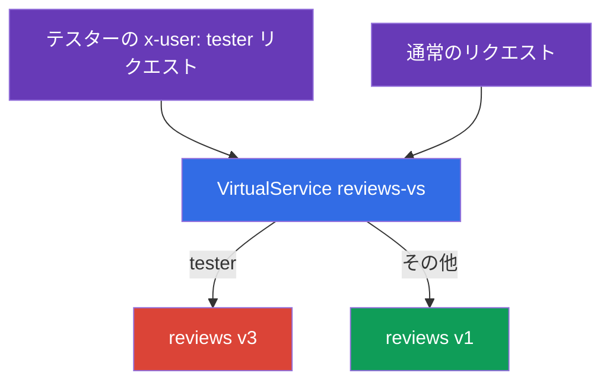
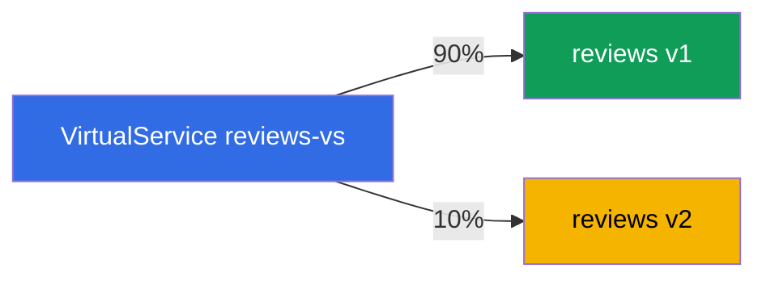
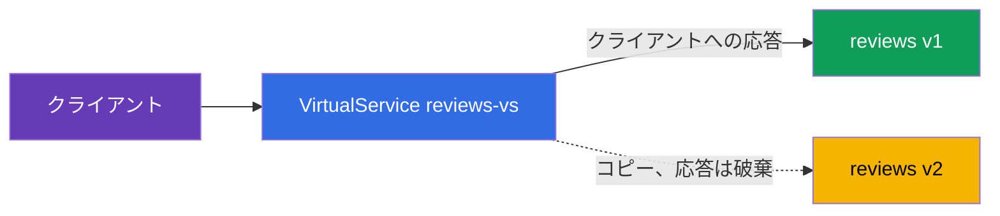

[Русская версия](ru.md) · [Eng version](en.md) · [Versión en español](es.md) · [Version française](fr.md) · [Deutsche Version](de.md) · [ქართული ვერსია](ge.md) · [繁體中文版](tw.md)

# 第6章 リリース戦略: canary、header-routing、traffic mirroring

> **次に進む前に。** 第5章では、基本リソースである Gateway、VirtualService、
> DestinationRule を扱いました。ここからは、それらを最も重要な実践課題である新バージョンの
> 安全なリリースに適用します。3つの手法を学びます。ヘッダーによるルーティング（テスター向けの
> 隠れた起動）、重み付け分散（canary）、そしてトラフィックのミラーリング（ユーザーにリスクを
> 与えず、本番トラフィックで新バージョンを検証する方法）です。

## 6.1. Deployment と release

まず、これらが必要な理由を説明する重要な考え方から始めます。Kubernetes では通常、
「新バージョンをリリースする」とは Deployment を更新することを意味し、すべてのユーザーが
直ちに新しいコードへ向かいます。そこにバグがあれば、すべてのユーザーがすぐにそれを目にします。

Istio では、2つのイベントを分けられます。

- **Deployment（デプロイ）** - 新バージョンは単にクラスター内で起動され、Pod は動作しているものの、
  本番トラフィックは届きません。
- **Release（リリース）** - 新バージョンへ意図的にトラフィックを送ります。まず少量から始め、
  その後に増やします。

つまり、新バージョンをデプロイすることと、ユーザーをそこへ送ることは、今や独立した
2つのステップです。その間に新バージョンを検証でき、Pod 自体に手を加えずにいつでも
トラフィックをロールバックできます。以下のすべてのリリース戦略はこの考え方に基づいています。

技術的には、3つの手法はいずれも DestinationRule（第5章）で定義された subsets の上に置く
`VirtualService` のルールです。サービス `reviews` に、DestinationRule で定義された subsets `v1`、
`v2`、`v3` があるものとします。

## 6.2. ヘッダーによるルーティング（dark launch）

課題: 新しい実験的バージョン `v3` はまだ未完成であり、一般ユーザーに見せるべきではありません。
しかし、テスターには本番クラスター上で検証してもらうため、これへ到達できる必要があります。
テスターは HTTP ヘッダー `x-user: tester` で識別します。

解決策は、VirtualService 内でヘッダーに対する `match` ルールを設定することです。

```yaml
apiVersion: networking.istio.io/v1
kind: VirtualService
metadata:
  name: reviews-vs
spec:
  hosts:
  - reviews
  http:
  - match:                    # ルール1: x-user: tester ヘッダーがある
    - headers:
        x-user:
          exact: tester
    route:
    - destination:
        host: reviews
        subset: v3            # テスターを v3 へ
  - route:                    # ルール2: その他すべて
    - destination:
        host: reviews
        subset: v1            # 通常ユーザーを v1 へ
```



動作の仕組み:

- `http` ルールは上から下へ評価され、最初に一致したものが適用されます。
- リクエストに `x-user: tester` ヘッダーがあれば、最初のルールが適用され、トラフィックは
  `v3` へ送られます。
- その他のすべてのリクエストは `match` に一致しないため、2番目のルールへ入ります
  （`match` がなく、これがデフォルトです）。そして `v1` へ送られます。

これは dark launch（隠れた起動）と呼ばれます。新バージョンは本番環境で動作していますが、
「合言葉」（必要なヘッダー）を知る人にしか見えません。一致条件にできるのはヘッダーだけでなく、
URI パス、メソッド、query パラメーターもあります。

## 6.3. 重み付け分散（canary）

課題: ユーザーを安定版 `v1` から新しい `v2` へ段階的に移行します。小さな割合から始めることで、
少ないトラフィックの割合で問題を検出します。

解決策は、`weight` フィールドを持つ複数の destination を使用することです。

```yaml
  http:
  - route:
    - destination:
        host: reviews
        subset: v1
      weight: 90        # トラフィックの 90% を安定版 v1 へ
    - destination:
        host: reviews
        subset: v2
      weight: 10        # 10% を新しい v2 へ
```



重みの合計は 100 でなければなりません。その後、リリースは段階的に進めます。重みを 70/30、
次に 50/50、最後に 0/100 へ変更すると、新バージョンがすべてのトラフィックを受け取ります。
どの段階で問題に気付いても、重みを元に戻せます。このときユーザー側には手を加えず、
変更されるのは分散のみです。

これは古典的な **canary release** です。トラフィックの小さな「カナリア」が、新バージョンへ
全員を送る前にそのバージョンを検証します。メトリクス分析と自動ロールバックを伴うこのプロセスの
自動化には Flagger が役立ちます。これについては第24章で扱います。

## 6.4. Traffic mirroring（シャドートラフィック）

canary も header-routing も、結局は **実際の** ユーザーの一部を新バージョンへ送ります。
では、ユーザーにまったくリスクを与えずに、本番トラフィックで新バージョンを検証したい場合はどうでしょうか。
そのためにミラーリングがあります。

考え方は次のとおりです。実際のリクエストの 100% はこれまでどおり `v1` が処理しますが、Envoy は
各リクエストの**コピー**を追加で `v2` へ送ります。`v2` からの応答は破棄され、クライアントには
決して表示されません。

```yaml
  http:
  - route:
    - destination:
        host: reviews
        subset: v1        # クライアントへの応答は 100% v1 から
    mirror:
      host: reviews
      subset: v2          # 各リクエストのコピーが v2 へ送られる
    mirrorPercentage:
      value: 100          # どの割合のトラフィックをミラーするか
```



各フィールドを見てみましょう。

- **`route`** - 主ルートです。クライアントはここからのみ応答を受け取ります（subset `v1`）。
- **`mirror`** - リクエストのコピーの送信先です（subset `v2`）。これは「送信したら忘れる」方式です。Envoy は
  ミラーからの応答を待たず、使用もしません。
- **`mirrorPercentage`** - 複製するトラフィックの割合です。たとえば `25` を設定すれば、本番リクエストの
  4分の1だけをミラーリングできます。

これが必要な理由: 実際の負荷を `v2` に流し、そのメトリクス、ログ、エラーを確認できますが、
ユーザーにリスクはありません。`v2` が停止したりエラーを返し始めたりしても、クライアントはそれに気付きません。
応答するのは `v1` だからです。

注意点が1つあります。ミラーされたリクエストは実際に `v2` へ到達します。GET ではなく、たとえば
何かを書き込む POST の場合、コピーも書き込みを実行します。副作用のあるサービス（DB への書き込み、
メール送信）では、ミラーリングを慎重に適用する必要があります。

## 6.5. これらをどう組み合わせるか

実際には、これらの手法を全体的なリリース戦略として組み合わせます。

1. `v1` と並べて `v2` をデプロイします（deployment）。まだトラフィックは送られません。
2. **ミラーリング**: 本番トラフィックの影を `v2` へ送り、メトリクスとエラーを確認します。リスクはありません。
3. **Header-routing**: ヘッダーにより、社内テスターだけを `v2` へ送ります。
4. **Canary**: 実際のユーザーの移行を開始します。10%、30%、50%、100% と進めます。
5. どの段階で問題が起きても、ロールバックします（重みまたはルートを `v1` に戻します）。

すべてのステップは単一の `VirtualService` を編集するだけで、Pod には手を加えません。ここにこの
アプローチの強みがあります。リリースは制御可能かつ可逆的になります。

## 6.6. 章のまとめ

- Istio は deployment（バージョンを単に起動すること）と release（そこへトラフィックを送ること）を分離します。
  これは安全なリリースの基盤です。
- **Header-routing（dark launch）**: ヘッダーに対する `match` ルールにより、特定の対象者
  （たとえばテスター）を新バージョンへ、その他を安定版へ送ります。
- **Canary**: `weight` フィールドがバージョン間のトラフィックを割合で分散します。重みを段階的に変更して、
  ユーザーを新バージョンへ移行します。
- **Traffic mirroring**: `mirror` + `mirrorPercentage` はトラフィックのコピーを新バージョンへ送ります。
  応答は破棄されるため、本番トラフィックでリスクなく検証できます。
- ミラーリングは、副作用のあるリクエスト（データの書き込み）では危険です。
- すべての手法は subsets 上の VirtualService ルールです。リリースは制御可能かつ可逆的であり、Pod には手を加えません。

## 6.7. 自己確認の質問

1. deployment と release の違いは何ですか。また、安全なリリースにとってなぜ重要ですか。
2. リクエストに特定のヘッダーを持つユーザーだけを、新バージョンへ送るにはどうしますか。
3. 重みによる canary はどのように動作しますか。また段階的なリリースはどのように見えますか。
4. ミラーリングは canary と何が異なりますか。クライアントはミラーからの応答を見ますか。
5. データを書き込む POST リクエストにとって、ミラーリングが危険なのはなぜですか。

## 演習

ヘッダーによるルーティングと canary を練習しましょう。

🧪 ラボ 02: [tasks/ica/labs/02](../../labs/02/README_JP.MD)

トラフィックミラーリング（および第7章のテーマである負荷分散）を練習しましょう。

🧪 ラボ 06: [tasks/ica/labs/06](../../labs/06/README_JP.MD)

---
[目次](../README_JP.md) · [第5章](../05/jp.md) · [第7章](../07/jp.md)
